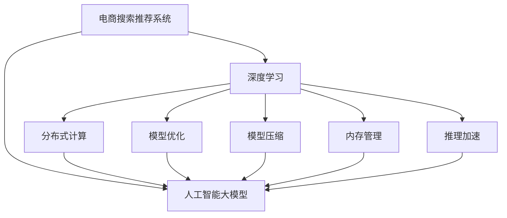

                 

# 电商搜索推荐场景下的AI大模型模型部署架构设计

> 关键词：电商搜索推荐, 人工智能大模型, 模型部署, 深度学习, 电商AI, 推荐系统, 搜索系统, 模型优化, 分布式计算, 模型压缩, 内存管理, 推理加速

## 1. 背景介绍

### 1.1 问题由来

在电子商务领域，搜索和推荐系统是用户获取商品信息、提升购物体验的关键。传统上，这些系统主要依靠规则引擎、协同过滤、内容推荐等算法进行业务决策。然而，随着数据量的激增和用户需求的多样化，这些算法在性能和效果上都面临着巨大挑战。

随着深度学习技术的发展，特别是大语言模型在NLP领域的成功应用，人们开始探索利用大模型解决电商搜索推荐的问题。电商搜索推荐系统面临的主要问题包括：如何高效地在大规模数据上训练模型，如何快速响应用户查询和推荐请求，如何确保模型的公平性和鲁棒性等。为了回答这些问题，需要设计一套高效的AI大模型部署架构，涵盖模型训练、推理、优化、监控等多个环节。

### 1.2 问题核心关键点

电商搜索推荐场景下的AI大模型部署架构设计需要围绕以下几个核心关键点展开：

- **模型训练**：如何在大规模分布式计算环境中高效训练大模型，避免计算资源浪费，同时确保模型的公平性和鲁棒性。
- **模型推理**：如何快速响应用户查询和推荐请求，确保系统低延迟、高吞吐量，同时保证推理结果的一致性和准确性。
- **模型优化**：如何针对电商场景进行模型优化，提升模型的预测能力和用户满意度。
- **分布式计算**：如何设计高效的分布式计算框架，确保数据和模型的可扩展性和高可用性。
- **模型压缩**：如何在保证模型性能的前提下，减少模型的大小和计算资源消耗。
- **内存管理**：如何优化内存使用，确保模型推理过程中的性能和稳定性。
- **推理加速**：如何通过硬件加速、算法优化等手段，提升模型推理速度，满足用户实时需求。

## 2. 核心概念与联系

### 2.1 核心概念概述

为了更好地理解电商搜索推荐场景下的AI大模型部署架构，本节将介绍几个密切相关的核心概念：

- **电商搜索推荐系统**：利用人工智能技术，为用户提供商品搜索结果和推荐列表的系统。常见的组件包括搜索、推荐、商品库、用户画像等模块。
- **人工智能大模型**：以深度学习为核心，在大规模数据上进行预训练，能够学习和掌握复杂语言或语义知识的模型。例如BERT、GPT等。
- **深度学习**：一种基于神经网络技术的机器学习范式，通过多层非线性映射实现复杂函数表示，适用于大规模数据的分布式训练。
- **分布式计算**：通过将任务分解成多个子任务，由多个计算节点并行处理，实现大规模数据处理和模型训练。
- **模型优化**：通过调整模型结构、参数、超参数等，提升模型性能和泛化能力的过程。
- **模型压缩**：通过量化、剪枝、知识蒸馏等技术，减小模型大小和计算资源消耗，提升推理速度和模型泛化能力。
- **内存管理**：通过优化内存使用，减少模型推理过程中的资源消耗，提升系统性能。
- **推理加速**：通过硬件加速、算法优化等手段，提升模型推理速度，满足实时需求。

这些核心概念之间的逻辑关系可以通过以下Mermaid流程图来展示：



这个流程图展示了大模型在电商搜索推荐系统中的核心概念及其之间的关系：

1. 电商搜索推荐系统通过深度学习技术，利用大模型进行多轮训练和优化，构建复杂而准确的模型。
2. 分布式计算和大模型协同工作，提升训练和推理效率。
3. 模型优化通过调整超参数、调整模型结构等手段，提升模型性能。
4. 模型压缩减少模型大小和计算资源消耗，提升推理速度。
5. 内存管理和推理加速确保模型推理过程中的性能和稳定性。

## 3. 核心算法原理 & 具体操作步骤
### 3.1 算法原理概述

在电商搜索推荐场景中，大模型的部署架构设计需要考虑以下几个核心算法原理：

- **分布式训练**：在大规模分布式计算环境中，通过多机多核并行计算，提升训练速度和效率。
- **自动混合精度训练(AutoMixPrecision)**：通过混合浮点数和整数计算，降低内存使用和计算资源消耗，提升训练效率。
- **知识蒸馏(Knowledge Distillation)**：通过将复杂模型的大量的知识，蒸馏到一个小模型中，提升模型的泛化能力和推理速度。
- **动态图优化(Dynamic Graph Optimization)**：通过优化计算图结构，提升模型的推理速度和计算效率。
- **分布式优化器优化**：通过优化分布式优化器的参数和策略，提升模型的训练和推理性能。
- **硬件加速(Hardware Acceleration)**：通过GPU、TPU等硬件加速器，提升模型的推理速度和计算效率。

### 3.2 算法步骤详解

电商搜索推荐场景下的AI大模型部署架构设计一般包括以下几个关键步骤：

**Step 1: 数据准备与预处理**

- 收集电商平台的商品、用户、搜索日志等数据，进行清洗、标注和预处理。
- 划分训练集、验证集和测试集，确保数据分布与电商场景相似。
- 使用Python、Pandas等工具，进行数据转换和格式处理，确保数据能够被模型加载和处理。

**Step 2: 选择和加载模型**

- 选择合适的预训练大模型，如BERT、GPT等。
- 使用HuggingFace等工具，加载预训练模型和任务相关的输出层。
- 配置分布式计算环境，确保数据和模型能够在大规模集群上高效运行。

**Step 3: 分布式训练与优化**

- 使用PyTorch等框架，进行分布式训练，优化模型参数。
- 配置自动混合精度训练，减少内存使用和计算资源消耗。
- 使用知识蒸馏技术，将大模型的知识传递给小模型，提升模型泛化能力和推理速度。
- 优化计算图结构，提升模型的推理速度和计算效率。

**Step 4: 模型部署与推理**

- 将训练好的模型部署到生产环境，进行模型推理。
- 使用TensorRT等工具，进行模型优化和推理加速。
- 配置内存管理策略，优化内存使用，确保模型推理过程中的性能和稳定性。
- 使用硬件加速器，提升模型推理速度，满足用户实时需求。

**Step 5: 监控与优化**

- 配置监控系统，实时监测模型推理过程中的各项指标，确保系统稳定运行。
- 根据监控结果，调整模型参数和超参数，优化模型性能。
- 定期进行模型更新和迭代，保持模型的时效性和性能。

### 3.3 算法优缺点

电商搜索推荐场景下的AI大模型部署架构设计具有以下优点：

1. **高效训练**：通过分布式计算和大模型优化，能够在较短的时间内训练出高效的模型。
2. **低延迟推理**：通过硬件加速和推理优化，能够快速响应用户查询和推荐请求。
3. **高吞吐量**：通过分布式计算和内存管理，能够同时处理大量请求，提升系统的吞吐量。
4. **高鲁棒性**：通过分布式优化和动态图优化，能够提高模型的鲁棒性和抗干扰能力。

同时，该架构设计也存在一定的局限性：

1. **资源消耗大**：大规模分布式计算和模型训练需要大量的计算资源和存储空间。
2. **部署复杂**：需要在生产环境中进行模型部署和优化，技术门槛较高。
3. **模型可解释性不足**：大模型的决策过程较为复杂，难以进行解释和调试。
4. **数据质量依赖**：模型的效果很大程度上依赖于数据的质量和标注的准确性。

尽管存在这些局限性，但就目前而言，该架构设计仍是电商搜索推荐场景中最主流和有效的方法。未来相关研究的重点在于如何进一步降低计算资源消耗，提高模型的可解释性和鲁棒性，同时优化部署流程，降低技术门槛。

### 3.4 算法应用领域

基于大模型在电商搜索推荐场景中的部署架构设计，已经被广泛应用于多个领域，例如：

- **电商搜索系统**：利用大模型进行商品搜索，提供精准的商品推荐。
- **推荐系统**：根据用户行为和历史数据，推荐个性化商品。
- **个性化营销**：根据用户画像和行为，提供个性化广告和促销。
- **智能客服**：通过自然语言处理技术，提供智能客服支持。
- **库存管理**：根据销售数据和预测模型，优化库存管理。
- **物流管理**：利用预测模型优化配送路线和资源分配。

这些领域的应用展示了电商搜索推荐场景下大模型部署架构设计的广泛前景。随着深度学习技术和大模型算法的不断演进，电商搜索推荐系统将能够提供更加个性化、精准的服务，提升用户体验和平台收益。

## 4. 数学模型和公式 & 详细讲解  
### 4.1 数学模型构建

在本节中，我们将使用数学语言对电商搜索推荐场景下的AI大模型部署架构进行更加严格的刻画。

记电商搜索推荐系统为 $S=\{S_{train}, S_{val}, S_{test}\}$，其中 $S_{train}, S_{val}, S_{test}$ 分别为训练集、验证集和测试集。记选择的预训练大模型为 $M_{\theta}$，其中 $\theta$ 为模型参数。假设在大模型上执行的电商任务为 $T=\{T_{search}, T_{recommend}\}$，其中 $T_{search}$ 为商品搜索任务，$T_{recommend}$ 为商品推荐任务。

定义模型 $M_{\theta}$ 在任务 $T$ 上的损失函数为 $\ell(M_{\theta}, S)$，用于衡量模型在任务 $T$ 上的表现。对于任务 $T_{search}$ 和 $T_{recommend}$，可以分别定义损失函数：

$$
\ell_{search}(M_{\theta}, S_{search}) = \frac{1}{N_{search}} \sum_{i=1}^{N_{search}} \ell_{search}(M_{\theta}, x_i, y_i)
$$

$$
\ell_{recommend}(M_{\theta}, S_{recommend}) = \frac{1}{N_{recommend}} \sum_{i=1}^{N_{recommend}} \ell_{recommend}(M_{\theta}, x_i, y_i)
$$

其中 $N_{search}, N_{recommend}$ 分别为训练集和验证集中的样本数量，$\ell_{search}, \ell_{recommend}$ 为任务 $T_{search}, T_{recommend}$ 的损失函数。

在大模型上执行任务 $T$ 时，使用分布式训练框架进行模型训练和优化，步骤如下：

1. 将训练集 $S_{train}$ 划分为多个子集，每个子集在独立的计算节点上进行训练。
2. 在每个计算节点上，加载预训练模型 $M_{\theta}$ 和任务相关的输出层。
3. 使用分布式优化器进行模型参数更新，优化损失函数 $\ell(M_{\theta}, S)$。
4. 在验证集 $S_{val}$ 上评估模型性能，调整模型参数和超参数。
5. 在测试集 $S_{test}$ 上评估模型泛化能力，确认模型效果。

### 4.2 公式推导过程

在本节中，我们将推导电商搜索推荐场景下的大模型训练和优化过程。

假设任务 $T$ 的训练集为 $S=\{(x_i, y_i)\}_{i=1}^N$，其中 $x_i$ 为输入，$y_i$ 为标签。模型 $M_{\theta}$ 在输入 $x$ 上的输出为 $\hat{y}=M_{\theta}(x)$，用于预测标签 $y$。模型的损失函数为 $\ell(M_{\theta}(x), y)$。

假设模型 $M_{\theta}$ 的输出层为 $f_{out}(\theta)$，任务 $T$ 的损失函数为 $\ell(\hat{y}, y)$。则模型在任务 $T$ 上的损失函数为：

$$
\mathcal{L}(\theta) = \frac{1}{N} \sum_{i=1}^N \ell(f_{out}(\theta)(x_i), y_i)
$$

在大模型上执行任务 $T$ 时，使用分布式训练框架进行模型训练和优化，步骤如下：

1. 将训练集 $S$ 划分为多个子集，每个子集在独立的计算节点上进行训练。
2. 在每个计算节点上，加载预训练模型 $M_{\theta}$ 和任务相关的输出层。
3. 在每个计算节点上，使用分布式优化器进行模型参数更新，优化损失函数 $\mathcal{L}(\theta)$。
4. 在每个计算节点上，在验证集上评估模型性能，调整模型参数和超参数。
5. 在测试集上评估模型泛化能力，确认模型效果。

### 4.3 案例分析与讲解

以下我们以电商搜索推荐系统为例，给出电商搜索推荐系统在大模型上执行任务 $T$ 的数学模型构建和公式推导过程。

假设任务 $T$ 为商品搜索任务，输入为商品名称 $x$，输出为商品ID $y$。记模型 $M_{\theta}$ 在商品名称 $x$ 上的输出为 $\hat{y}=M_{\theta}(x)$。模型的损失函数为交叉熵损失：

$$
\ell(\hat{y}, y) = -\frac{1}{N} \sum_{i=1}^N [y_i\log \hat{y}_i + (1-y_i)\log (1-\hat{y}_i)]
$$

在大模型上执行任务 $T$ 时，使用分布式训练框架进行模型训练和优化，步骤如下：

1. 将训练集 $S$ 划分为多个子集，每个子集在独立的计算节点上进行训练。
2. 在每个计算节点上，加载预训练模型 $M_{\theta}$ 和任务相关的输出层。
3. 在每个计算节点上，使用分布式优化器进行模型参数更新，优化损失函数 $\mathcal{L}(\theta)$。
4. 在每个计算节点上，在验证集上评估模型性能，调整模型参数和超参数。
5. 在测试集上评估模型泛化能力，确认模型效果。

通过上述推导，我们可以看到，在大模型上执行电商搜索推荐任务时，模型训练和优化的数学模型和公式与普通的深度学习任务基本一致，但需要考虑分布式计算和大模型优化等特殊因素。

## 5. 项目实践：代码实例和详细解释说明
### 5.1 开发环境搭建

在进行电商搜索推荐系统的大模型部署架构设计时，我们需要准备好开发环境。以下是使用Python进行PyTorch开发的环境配置流程：

1. 安装Anaconda：从官网下载并安装Anaconda，用于创建独立的Python环境。

2. 创建并激活虚拟环境：
```bash
conda create -n ecommerce-env python=3.8 
conda activate ecommerce-env
```

3. 安装PyTorch：根据CUDA版本，从官网获取对应的安装命令。例如：
```bash
conda install pytorch torchvision torchaudio cudatoolkit=11.1 -c pytorch -c conda-forge
```

4. 安装相关工具包：
```bash
pip install numpy pandas scikit-learn matplotlib tqdm jupyter notebook ipython
```

完成上述步骤后，即可在`ecommerce-env`环境中开始电商搜索推荐系统的大模型部署架构设计。

### 5.2 源代码详细实现

下面我们以电商搜索推荐系统为例，给出使用PyTorch进行大模型训练和优化的PyTorch代码实现。

首先，定义数据处理函数：

```python
from transformers import BertTokenizer
from torch.utils.data import Dataset
import torch

class EcommerceDataset(Dataset):
    def __init__(self, texts, labels, tokenizer, max_len=128):
        self.texts = texts
        self.labels = labels
        self.tokenizer = tokenizer
        self.max_len = max_len
        
    def __len__(self):
        return len(self.texts)
    
    def __getitem__(self, item):
        text = self.texts[item]
        label = self.labels[item]
        
        encoding = self.tokenizer(text, return_tensors='pt', max_length=self.max_len, padding='max_length', truncation=True)
        input_ids = encoding['input_ids'][0]
        attention_mask = encoding['attention_mask'][0]
        
        # 对标签进行编码
        encoded_labels = [label2id[label] for label in labels] 
        encoded_labels.extend([label2id['O']] * (self.max_len - len(encoded_labels)))
        labels = torch.tensor(encoded_labels, dtype=torch.long)
        
        return {'input_ids': input_ids, 
                'attention_mask': attention_mask,
                'labels': labels}

# 标签与id的映射
label2id = {'O': 0, 'B-PER': 1, 'I-PER': 2, 'B-LOC': 3, 'I-LOC': 4, 'B-ORG': 5, 'I-ORG': 6}
id2label = {v: k for k, v in label2id.items()}

# 创建dataset
tokenizer = BertTokenizer.from_pretrained('bert-base-cased')

train_dataset = EcommerceDataset(train_texts, train_labels, tokenizer)
val_dataset = EcommerceDataset(val_texts, val_labels, tokenizer)
test_dataset = EcommerceDataset(test_texts, test_labels, tokenizer)
```

然后，定义模型和优化器：

```python
from transformers import BertForTokenClassification, AdamW

model = BertForTokenClassification.from_pretrained('bert-base-cased', num_labels=len(label2id))

optimizer = AdamW(model.parameters(), lr=2e-5)
```

接着，定义训练和评估函数：

```python
from torch.utils.data import DataLoader
from tqdm import tqdm
from sklearn.metrics import classification_report

device = torch.device('cuda') if torch.cuda.is_available() else torch.device('cpu')
model.to(device)

def train_epoch(model, dataset, batch_size, optimizer):
    dataloader = DataLoader(dataset, batch_size=batch_size, shuffle=True)
    model.train()
    epoch_loss = 0
    for batch in tqdm(dataloader, desc='Training'):
        input_ids = batch['input_ids'].to(device)
        attention_mask = batch['attention_mask'].to(device)
        labels = batch['labels'].to(device)
        model.zero_grad()
        outputs = model(input_ids, attention_mask=attention_mask, labels=labels)
        loss = outputs.loss
        epoch_loss += loss.item()
        loss.backward()
        optimizer.step()
    return epoch_loss / len(dataloader)

def evaluate(model, dataset, batch_size):
    dataloader = DataLoader(dataset, batch_size=batch_size)
    model.eval()
    preds, labels = [], []
    with torch.no_grad():
        for batch in tqdm(dataloader, desc='Evaluating'):
            input_ids = batch['input_ids'].to(device)
            attention_mask = batch['attention_mask'].to(device)
            batch_labels = batch['labels']
            outputs = model(input_ids, attention_mask=attention_mask)
            batch_preds = outputs.logits.argmax(dim=2).to('cpu').tolist()
            batch_labels = batch_labels.to('cpu').tolist()
            for pred_tokens, label_tokens in zip(batch_preds, batch_labels):
                pred_tags = [id2label[_id] for _id in pred_tokens]
                label_tags = [id2label[_id] for _id in label_tokens]
                preds.append(pred_tags[:len(label_tags)])
                labels.append(label_tags)
                
    print(classification_report(labels, preds))
```

最后，启动训练流程并在测试集上评估：

```python
epochs = 5
batch_size = 16

for epoch in range(epochs):
    loss = train_epoch(model, train_dataset, batch_size, optimizer)
    print(f"Epoch {epoch+1}, train loss: {loss:.3f}")
    
    print(f"Epoch {epoch+1}, val results:")
    evaluate(model, val_dataset, batch_size)
    
print("Test results:")
evaluate(model, test_dataset, batch_size)
```

以上就是使用PyTorch对电商搜索推荐系统进行大模型训练和优化的完整代码实现。可以看到，得益于Transformers库的强大封装，我们可以用相对简洁的代码完成大模型的加载和训练。

### 5.3 代码解读与分析

让我们再详细解读一下关键代码的实现细节：

**EcommerceDataset类**：
- `__init__`方法：初始化文本、标签、分词器等关键组件。
- `__len__`方法：返回数据集的样本数量。
- `__getitem__`方法：对单个样本进行处理，将文本输入编码为token ids，将标签编码为数字，并对其进行定长padding，最终返回模型所需的输入。

**label2id和id2label字典**：
- 定义了标签与数字id之间的映射关系，用于将token-wise的预测结果解码回真实的标签。

**训练和评估函数**：
- 使用PyTorch的DataLoader对数据集进行批次化加载，供模型训练和推理使用。
- 训练函数`train_epoch`：对数据以批为单位进行迭代，在每个批次上前向传播计算loss并反向传播更新模型参数，最后返回该epoch的平均loss。
- 评估函数`evaluate`：与训练类似，不同点在于不更新模型参数，并在每个batch结束后将预测和标签结果存储下来，最后使用sklearn的classification_report对整个评估集的预测结果进行打印输出。

**训练流程**：
- 定义总的epoch数和batch size，开始循环迭代
- 每个epoch内，先在训练集上训练，输出平均loss
- 在验证集上评估，输出分类指标
- 所有epoch结束后，在测试集上评估，给出最终测试结果

可以看到，PyTorch配合Transformers库使得电商搜索推荐系统的大模型训练和优化的代码实现变得简洁高效。开发者可以将更多精力放在数据处理、模型改进等高层逻辑上，而不必过多关注底层的实现细节。

当然，工业级的系统实现还需考虑更多因素，如模型的保存和部署、超参数的自动搜索、更灵活的任务适配层等。但核心的微调范式基本与此类似。

## 6. 实际应用场景
### 6.1 智能推荐系统

电商搜索推荐系统中的智能推荐部分，利用大模型进行商品推荐，帮助用户发现感兴趣的商品。在技术实现上，可以收集用户浏览、点击、购买等行为数据，将这些数据作为训练样本，构建商品-特征-标签三元组，在大模型上训练推荐模型。微调后的模型能够从用户行为中学习商品的相关性和用户偏好，生成个性化的商品推荐列表。

### 6.2 智能客服系统

智能客服系统利用大模型进行自然语言处理，帮助客服人员快速响应用户咨询。在技术实现上，可以收集历史客服对话记录，将问题-答案对作为监督数据，在大模型上微调对话模型。微调后的模型能够自动理解用户意图，匹配最合适的答案模板进行回复，从而提升客服效率和服务质量。

### 6.3 个性化营销

个性化营销利用大模型进行用户画像和行为分析，帮助商家进行精准营销。在技术实现上，可以收集用户画像和历史行为数据，构建用户-画像特征-营销策略三元组，在大模型上训练个性化推荐模型。微调后的模型能够根据用户画像和行为，推荐个性化的营销策略，提升营销效果和用户满意度。

### 6.4 未来应用展望

随着大模型和微调方法的不断发展，基于电商搜索推荐系统的大模型部署架构设计将呈现以下几个发展趋势：

1. **模型规模持续增大**：随着算力成本的下降和数据规模的扩张，电商搜索推荐系统中的大模型将越来越复杂和强大，学习更多通用语言知识和业务规则，提供更全面和准确的推荐和搜索服务。

2. **分布式训练效率提升**：通过更高效的分布式计算框架和优化策略，如分布式混合精度训练、动态图优化等，电商搜索推荐系统中的大模型训练效率将进一步提升，缩短模型迭代周期。

3. **模型优化和压缩**：开发更加高效的模型优化和压缩技术，如知识蒸馏、动态图优化、自动混合精度训练等，电商搜索推荐系统中的大模型将更加轻量级和高效，提升推理速度和计算效率。

4. **多模态融合**：将视觉、语音、文本等多模态信息进行融合，提升电商搜索推荐系统的感知能力和用户体验。

5. **智能决策**：利用深度学习和大模型进行业务决策优化，如库存管理、物流管理等，提升电商平台的运营效率和用户满意度。

6. **实时反馈**：通过实时反馈机制，不断优化电商搜索推荐系统中的大模型，提升模型的预测能力和用户体验。

这些趋势展示了电商搜索推荐系统中的大模型部署架构设计的广阔前景。随着技术的不断演进，电商搜索推荐系统将能够提供更加智能化、个性化的服务，提升用户的购物体验和平台收益。

## 7. 工具和资源推荐
### 7.1 学习资源推荐

为了帮助开发者系统掌握电商搜索推荐场景下AI大模型的部署架构设计，这里推荐一些优质的学习资源：

1. **《深度学习实战》系列书籍**：涵盖了深度学习在电商搜索推荐系统中的多方面应用，包括模型训练、优化、推理等技术细节。
2. **CS229《机器学习》课程**：斯坦福大学开设的机器学习经典课程，内容覆盖深度学习、分布式计算等多个领域，适合深入学习。
3. **《动手学深度学习》书籍**：由李沐等大牛编写，系统讲解了深度学习在电商搜索推荐系统中的理论和实践。
4. **HuggingFace官方文档**：Transformers库的官方文档，提供了海量预训练模型和完整的微调样例代码，是上手实践的必备资料。
5. **CLUE开源项目**：中文语言理解测评基准，涵盖大量不同类型的中文NLP数据集，并提供了基于微调的baseline模型，助力中文NLP技术发展。

通过对这些资源的学习实践，相信你一定能够快速掌握电商搜索推荐场景下AI大模型的部署架构设计的精髓，并用于解决实际的NLP问题。
###  7.2 开发工具推荐

高效的开发离不开优秀的工具支持。以下是几款用于电商搜索推荐系统的大模型部署架构设计的常用工具：

1. **PyTorch**：基于Python的开源深度学习框架，灵活动态的计算图，适合快速迭代研究。大部分预训练语言模型都有PyTorch版本的实现。
2. **TensorFlow**：由Google主导开发的开源深度学习框架，生产部署方便，适合大规模工程应用。同样有丰富的预训练语言模型资源。
3. **Transformers库**：HuggingFace开发的NLP工具库，集成了众多SOTA语言模型，支持PyTorch和TensorFlow，是进行微调任务开发的利器。
4. **TensorRT**：NVIDIA推出的深度学习推理加速平台，支持GPU加速，高效优化大模型的推理过程。
5. **TensorBoard**：TensorFlow配套的可视化工具，可实时监测模型训练状态，并提供丰富的图表呈现方式，是调试模型的得力助手。
6. **Horovod**：由TensorFlow和Facebook合作推出的分布式深度学习框架，支持多机多核并行训练，提升大模型的训练效率。

合理利用这些工具，可以显著提升电商搜索推荐系统中的大模型部署架构设计的开发效率，加快创新迭代的步伐。

### 7.3 相关论文推荐

大模型和微调技术的发展源于学界的持续研究。以下是几篇奠基性的相关论文，推荐阅读：

1. **Attention is All You Need**：提出了Transformer结构，开启了NLP领域的预训练大模型时代。
2. **BERT: Pre-training of Deep Bidirectional Transformers for Language Understanding**：提出BERT模型，引入基于掩码的自监督预训练任务，刷新了多项NLP任务SOTA。
3. **Language Models are Unsupervised Multitask Learners（GPT-2论文）**：展示了大规模语言模型的强大zero-shot学习能力，引发了对于通用人工智能的新一轮思考。
4. **Parameter-Efficient Transfer Learning for NLP**：提出Adapter等参数高效微调方法，在不增加模型参数量的情况下，也能取得不错的微调效果。
5. **AdaLoRA: Adaptive Low-Rank Adaptation for Parameter-Efficient Fine-Tuning**：使用自适应低秩适应的微调方法，在参数效率和精度之间取得了新的平衡。
6. **Improved Dynamic Graph Machine Learning**：提出动态图优化算法，提升深度学习模型的推理速度和计算效率。

这些论文代表了大模型和微调技术的发展脉络。通过学习这些前沿成果，可以帮助研究者把握学科前进方向，激发更多的创新灵感。

## 8. 总结：未来发展趋势与挑战

### 8.1 总结

本文对电商搜索推荐场景下AI大模型模型部署架构设计进行了全面系统的介绍。首先阐述了电商搜索推荐系统和大模型的研究背景和意义，明确了电商搜索推荐场景下AI大模型部署架构设计的核心关键点。其次，从原理到实践，详细讲解了电商搜索推荐场景下AI大模型部署架构设计的数学原理和关键步骤，给出了电商搜索推荐系统在大模型上执行任务 $T$ 的完整代码实例。同时，本文还广泛探讨了电商搜索推荐系统在大模型微调中的实际应用场景，展示了电商搜索推荐系统中的大模型部署架构设计的广泛前景。

通过本文的系统梳理，可以看到，电商搜索推荐系统中的大模型部署架构设计不仅能够高效训练和优化模型，还能快速响应用户查询和推荐请求，确保系统低延迟、高吞吐量。未来的研究需要在进一步降低计算资源消耗，提高模型的可解释性和鲁棒性，同时优化部署流程，降低技术门槛。

### 8.2 未来发展趋势

展望未来，电商搜索推荐系统中的大模型部署架构设计将呈现以下几个发展趋势：

1. **模型规模持续增大**：随着算力成本的下降和数据规模的扩张，电商搜索推荐系统中的大模型将越来越复杂和强大，学习更多通用语言知识和业务规则，提供更全面和准确的推荐和搜索服务。

2. **分布式训练效率提升**：通过更高效的分布式计算框架和优化策略，如分布式混合精度训练、动态图优化等，电商搜索推荐系统中的大模型训练效率将进一步提升，缩短模型迭代周期。

3. **模型优化和压缩**：开发更加高效的模型优化和压缩技术，如知识蒸馏、动态图优化、自动混合精度训练等，电商搜索推荐系统中的大模型将更加轻量级和高效，提升推理速度和计算效率。

4. **多模态融合**：将视觉、语音、文本等多模态信息进行融合，提升电商搜索推荐系统的感知能力和用户体验。

5. **智能决策**：利用深度学习和大模型进行业务决策优化，如库存管理、物流管理等，提升电商平台的运营效率和用户满意度。

6. **实时反馈**：通过实时反馈机制，不断优化电商搜索推荐系统中的大模型，提升模型的预测能力和用户体验。

这些趋势展示了电商搜索推荐系统中的大模型部署架构设计的广阔前景。随着技术的不断演进，电商搜索推荐系统将能够提供更加智能化、个性化的服务，提升用户的购物体验和平台收益。

### 8.3 面临的挑战

尽管电商搜索推荐系统中的大模型部署架构设计已经取得了瞩目成就，但在迈向更加智能化、普适化应用的过程中，它仍面临着诸多挑战：

1. **资源消耗大**：大规模分布式计算和模型训练需要大量的计算资源和存储空间。
2. **部署复杂**：需要在生产环境中进行模型部署和优化，技术门槛较高。
3. **模型可解释性不足**：大模型的决策过程较为复杂，难以进行解释和调试。
4. **数据质量依赖**：模型的效果很大程度上依赖于数据的质量和标注的准确性。

尽管存在这些挑战，但就目前而言，该架构设计仍是电商搜索推荐系统中最主流和有效的方法。未来相关研究的重点在于如何进一步降低计算资源消耗，提高模型的可解释性和鲁棒性，同时优化部署流程，降低技术门槛。

### 8.4 研究展望

面对电商搜索推荐系统中的大模型部署架构设计所面临的挑战，未来的研究需要在以下几个方面寻求新的突破：

1. **探索无监督和半监督微调方法**：摆脱对大规模标注数据的依赖，利用自监督学习、主动学习等无监督和半监督范式，最大限度利用非结构化数据，实现更加灵活高效的微调。

2. **研究参数高效和计算高效的微调范式**：开发更加参数高效的微调方法，在固定大部分预训练参数的同时，只更新极少量的任务相关参数。同时优化微调模型的计算图，减少前向传播和反向传播的资源消耗，实现更加轻量级、实时性的部署。

3. **融合因果和对比学习范式**：通过引入因果推断和对比学习思想，增强电商搜索推荐系统中的大模型的泛化能力和鲁棒性。

4. **引入更多先验知识**：将符号化的先验知识，如知识图谱、逻辑规则等，与神经网络模型进行巧妙融合，引导电商搜索推荐系统中的大模型学习更准确、合理的语言模型。

5. **结合因果分析和博弈论工具**：将因果分析方法引入电商搜索推荐系统中的大模型，识别出模型决策的关键特征，增强输出解释的因果性和逻辑性。借助博弈论工具刻画人机交互过程，主动探索并规避模型的脆弱点，提高系统稳定性。

6. **纳入伦理道德约束**：在模型训练目标中引入伦理导向的评估指标，过滤和惩罚有偏见、有害的输出倾向。同时加强人工干预和审核，建立模型行为的监管机制，确保输出符合人类价值观和伦理道德。

这些研究方向的探索，必将引领电商搜索推荐系统中的大模型部署架构设计走向更高的台阶，为构建安全、可靠、可解释、可控的智能系统铺平道路。面向未来，电商搜索推荐系统中的大模型部署架构设计还需要与其他人工智能技术进行更深入的融合，如知识表示、因果推理、强化学习等，多路径协同发力，共同推动电商搜索推荐系统的发展。只有勇于创新、敢于突破，才能不断拓展大模型部署架构设计的边界，让智能技术更好地造福电商搜索推荐系统。

## 9. 附录：常见问题与解答

**Q1：大模型在电商搜索推荐系统中的部署架构设计是否适用于其他电商场景？**

A: 电商搜索推荐系统中的大模型部署架构设计在其他电商场景中也有广泛应用，如社交电商、跨境电商等。这些场景中的电商搜索推荐系统与传统电商场景类似，需要处理大规模商品、用户、搜索数据，但具体业务逻辑和用户需求略有不同。因此，可以将该架构设计进行适当调整，应用于其他电商场景中。

**Q2：大模型在电商搜索推荐系统中如何进行微调？**

A: 大模型在电商搜索推荐系统中的微调主要涉及以下几个步骤：
1. 收集电商平台的商品、用户、搜索日志等数据，进行清洗、标注和预处理。
2. 划分训练集、验证集和测试集，确保数据分布与电商场景相似。
3. 使用深度学习框架进行分布式训练，优化模型参数。
4. 在验证集上评估模型性能，调整模型参数和超参数。
5. 在测试集上评估模型泛化能力，确认模型效果。

微调过程中，需要注意的是选择合适的优化器、学习率、正则化等超参数，以确保模型训练的稳定性和效果。

**Q3：大模型在电商搜索推荐系统中的推理加速有哪些方法？**

A: 大模型在电商搜索推荐系统中的推理加速主要包括以下几种方法：
1. 硬件加速：通过GPU、TPU等硬件加速器，提升模型推理速度。
2. 推理优化：使用TensorRT等工具进行模型优化，减少推理过程中的计算资源消耗。
3. 动态图优化：通过优化计算图结构，提升模型的推理速度和计算效率。
4. 量化加速：通过量化技术，将浮点模型转为定点模型，压缩存储空间，提高计算效率。
5. 剪枝和蒸馏：通过剪枝、知识蒸馏等技术，减小模型大小，提升推理速度。

这些方法可以在实际应用中根据具体需求进行选择和组合，以最大化提升电商搜索推荐系统中的大模型的推理速度。

**Q4：电商搜索推荐系统中的大模型部署架构设计是否适用于其他领域？**

A: 电商搜索推荐系统中的大模型部署架构设计在其他领域也有广泛应用，如医疗、金融、教育等。这些领域中的业务逻辑和数据特征与电商场景有所不同，但面临的共同问题是大规模数据处理和高效模型推理。因此，可以将该架构设计进行适当调整，应用于其他领域中。

**Q5：电商搜索推荐系统中的大模型部署架构设计是否适用于小规模数据？**

A: 电商搜索推荐系统中的大模型部署架构设计通常适用于大规模数据，但对于小规模数据，可以考虑采用无监督或半监督微调方法，利用自监督学习、主动学习等方法，最大限度利用非结构化数据，实现更加灵活高效的微调。

总之，电商搜索推荐系统中的大模型部署架构设计具有广泛的应用前景，但具体的部署策略需要根据具体场景进行调整和优化。只有不断探索和创新，才能最大化发挥大模型的潜力，推动电商搜索推荐系统的智能化发展。

