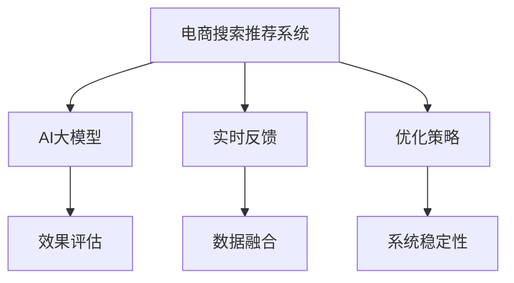

                 

# 电商搜索推荐效果评估中的AI大模型实时反馈机制

> 关键词：电商搜索推荐,效果评估,实时反馈,人工智能大模型,深度学习

## 1. 背景介绍

### 1.1 问题由来

随着互联网的迅速发展和智能手机的普及，电商搜索推荐系统成为了零售商获取流量和销售收入的重要手段。传统的基于规则和简单机器学习的推荐算法，在个性化和实时性上已难以满足用户需求。而基于深度学习的大模型推荐系统，由于其强大的建模能力和自适应性，逐渐成为了新一代电商推荐系统的核心。

然而，电商推荐系统的效果评估不仅仅依赖于模型预测的准确性，还包括用户行为反馈、系统延迟、服务稳定性等多方面因素。如何综合考量这些指标，实现全面准确的效果评估，并据此实时优化模型，是大模型推荐系统面临的挑战之一。

### 1.2 问题核心关键点

大模型推荐系统的效果评估涉及以下几个核心关键点：

- **效果评估指标**：选择合适的评估指标对模型性能进行客观衡量。
- **实时反馈机制**：如何构建高效的实时反馈系统，及时获取用户反馈。
- **数据融合方法**：如何将模型预测与用户反馈有效结合，提升系统性能。
- **优化策略**：基于实时反馈，对模型进行动态调整。
- **系统稳定性**：保证推荐系统在各种情况下的稳定性。

本文将详细探讨这些关键点，特别是如何在电商搜索推荐系统中，构建高效的AI大模型实时反馈机制。

## 2. 核心概念与联系

### 2.1 核心概念概述

为更好地理解AI大模型在电商搜索推荐系统中的应用，本节将介绍几个密切相关的核心概念：

- **电商搜索推荐系统**：基于用户历史行为和商品属性信息，为每个查询推荐最相关的商品。
- **AI大模型**：指以Transformer等结构为代表的深度学习模型，通过大规模数据预训练，具备强大的表示和泛化能力。
- **实时反馈**：指在推荐过程中，对用户的行为和反馈进行实时监测和分析，以指导系统优化。
- **效果评估**：通过一系列指标对推荐系统性能进行全面衡量，发现问题和改进方向。

这些核心概念之间的逻辑关系可以通过以下Mermaid流程图来展示：



这个流程图展示了大模型推荐系统的工作原理和关键组件：

1. 电商推荐系统通过用户查询、商品属性等信息，输入AI大模型进行预测。
2. 模型输出商品相关度得分，与用户历史行为和偏好结合，生成推荐结果。
3. 实时反馈系统对用户点击、购买、评分等行为进行监测，及时提供反馈信息。
4. 效果评估指标对推荐结果进行综合衡量，发现问题。
5. 基于反馈数据和评估结果，优化策略调整模型参数。
6. 系统稳定性策略保证推荐系统在各种情况下的稳定运行。

## 3. 核心算法原理 & 具体操作步骤
### 3.1 算法原理概述

基于AI大模型的电商推荐系统，其核心算法原理可以总结如下：

1. **预训练**：在大型通用语料库上进行预训练，学习语言和商品相关性表示。
2. **微调**：在电商推荐数据集上微调模型，使其针对电商领域进行优化。
3. **实时推荐**：将用户查询输入模型，生成推荐结果。
4. **效果评估**：使用准确率、召回率、点击率等指标评估推荐结果。
5. **实时反馈**：监测用户行为，收集反馈数据。
6. **优化策略**：基于反馈数据和评估结果，动态调整模型参数，优化推荐性能。

### 3.2 算法步骤详解

以下我们将详细介绍每个步骤的具体实现：

#### 3.2.1 预训练和微调

1. **预训练数据准备**：收集大量通用语料和电商数据，用于训练大模型。预训练数据通常包括文本、图像、视频等多种模态信息。
2. **预训练模型选择**：选择适合电商领域的预训练模型，如BERT、GPT等。
3. **微调数据准备**：准备电商推荐数据集，包括用户查询、商品信息、历史行为等，用于微调模型。
4. **微调模型构建**：在微调数据集上训练模型，通常使用少量标注数据进行监督学习，逐步优化模型在电商领域的泛化能力。
5. **微调结果验证**：在验证集上评估微调后模型的性能，确保其在电商场景下具有较好的表现。

#### 3.2.2 实时推荐

1. **用户查询输入**：获取用户输入的查询信息，包括文本、图像等。
2. **模型预测**：将查询信息输入微调后的AI大模型，生成商品相关度得分。
3. **推荐结果生成**：根据得分，选择相关商品进行推荐，形成推荐列表。

#### 3.2.3 效果评估

1. **评估指标选择**：根据业务需求选择合适的评估指标，如准确率、召回率、点击率、转化率等。
2. **评估数据收集**：从推荐结果和用户行为中收集评估数据，如点击次数、购买次数、评分等。
3. **评估结果分析**：对评估数据进行统计分析，计算各项指标的数值，发现问题。

#### 3.2.4 实时反馈

1. **用户行为监测**：实时监测用户对推荐结果的反应，如点击、购买、评分等。
2. **反馈数据收集**：将用户反馈转化为结构化数据，如点击次数、评分值等。
3. **反馈信息分析**：分析用户反馈，识别出影响推荐效果的因素。

#### 3.2.5 优化策略

1. **模型参数调整**：根据反馈数据和评估结果，动态调整模型参数，优化推荐性能。
2. **策略选择**：选择合适的优化策略，如正则化、Dropout、学习率调整等。
3. **优化效果验证**：在验证集上评估优化后的模型性能，确保改进措施的有效性。

#### 3.2.6 系统稳定性

1. **异常检测**：实时监测系统性能指标，如响应时间、错误率等，发现异常情况。
2. **故障恢复**：在检测到异常时，立即采取措施恢复系统稳定，如重启服务器、加载备份数据等。
3. **系统备份**：定期备份系统数据和模型参数，防止数据丢失。

### 3.3 算法优缺点

基于AI大模型的电商推荐系统具有以下优点：

- **泛化能力强**：大模型具备较强的泛化能力，可以在不同场景下进行迁移学习。
- **准确率高**：基于深度学习的大模型推荐系统，在准确率和个性化推荐上表现优异。
- **实时性高**：大模型可以快速处理大量数据，生成实时推荐结果。

同时，该方法也存在一定的局限性：

- **计算成本高**：大模型的训练和推理需要大量的计算资源，成本较高。
- **数据依赖强**：推荐效果高度依赖于数据质量和数据量，数据不足可能影响推荐效果。
- **模型复杂度高**：大模型复杂度较高，维护和调试难度大。

尽管存在这些局限性，但基于大模型的推荐系统在电商领域仍具有显著的优势，未来随着计算资源和数据资源的进一步丰富，这些问题有望逐步得到解决。

### 3.4 算法应用领域

基于大模型的电商推荐系统已经被广泛应用于各类电商网站和平台，覆盖了从服装、食品、家电到电子产品等众多领域。这些系统通过实时分析用户行为，生成个性化推荐，显著提升了用户满意度和服务体验，带来了巨大的商业价值。

在实际应用中，基于大模型的推荐系统还扩展到智能搜索、智能客服、智能营销等多个场景，为电商企业提供了全方位的智能服务。随着技术的不断进步，大模型推荐系统在电商领域的应用前景将更加广阔。

## 4. 数学模型和公式 & 详细讲解  
### 4.1 数学模型构建

我们以电商推荐系统为例，详细构建其数学模型：

假设电商推荐系统的输入为用户查询$q$和商品集$C$，模型的输出为推荐商品集$R$。

模型的预测函数可以表示为：
$$ f(q, C, \theta) = R $$

其中，$f$为模型函数，$\theta$为模型参数。

模型的损失函数可以表示为：
$$ \mathcal{L}(\theta) = \frac{1}{N}\sum_{i=1}^N \ell(q_i, f(q_i, C, \theta)) $$

其中，$\ell$为损失函数，$N$为样本数量。

我们以准确率$P$、召回率$R$和F1分数$F_1$为例，详细推导其计算公式。

**准确率**：
$$ P = \frac{TP}{TP + FP} $$

其中，$TP$为用户点击的推荐商品数，$FP$为用户点击的非推荐商品数。

**召回率**：
$$ R = \frac{TP}{TP + FN} $$

其中，$FN$为用户感兴趣的未被推荐商品数。

**F1分数**：
$$ F_1 = 2 \times \frac{P \times R}{P + R} $$

### 4.2 公式推导过程

以下我们对上述指标的计算公式进行详细推导：

**准确率**：
假设模型对用户查询$q$的推荐结果为$R = \{r_1, r_2, \ldots, r_k\}$，其中$r_i$为商品$i$，用户的真实点击商品为$t$。

$$ TP = \sum_{i=1}^k I(r_i = t) $$
$$ FP = \sum_{i=1}^k I(r_i \neq t) $$

其中，$I$为示性函数。

代入准确率公式，得到：

$$ P = \frac{\sum_{i=1}^k I(r_i = t)}{\sum_{i=1}^k I(r_i = t) + \sum_{i=1}^k I(r_i \neq t)} $$

**召回率**：
$$ TP = \sum_{i=1}^k I(r_i = t) $$
$$ FN = |C| - TP $$

代入召回率公式，得到：

$$ R = \frac{\sum_{i=1}^k I(r_i = t)}{|C| - \sum_{i=1}^k I(r_i = t)} $$

**F1分数**：
代入准确率和召回率的计算公式，得到：

$$ F_1 = 2 \times \frac{\frac{\sum_{i=1}^k I(r_i = t)}{\sum_{i=1}^k I(r_i = t) + \sum_{i=1}^k I(r_i \neq t)} \times \frac{\sum_{i=1}^k I(r_i = t)}{|C| - \sum_{i=1}^k I(r_i = t)} $$

### 4.3 案例分析与讲解

以下我们以推荐系统效果评估为例，具体讲解其计算过程和数据分析。

假设某电商平台的推荐系统，对用户查询$q$进行了10次推荐，点击次数为5次，未点击次数为5次，推荐商品数为20，未推荐商品数为30。

根据准确率公式，可以得到：
$$ P = \frac{5}{5 + 5} = 0.5 $$

根据召回率公式，可以得到：
$$ R = \frac{5}{20 + 5} = 0.2 $$

根据F1分数公式，可以得到：
$$ F_1 = 2 \times \frac{0.5 \times 0.2}{0.5 + 0.2} = 0.4 $$

通过上述计算，可以直观地理解推荐系统的性能，发现问题并进行优化。

## 5. 项目实践：代码实例和详细解释说明
### 5.1 开发环境搭建

在进行项目实践前，我们需要准备好开发环境。以下是使用Python进行PyTorch开发的环境配置流程：

1. 安装Anaconda：从官网下载并安装Anaconda，用于创建独立的Python环境。

2. 创建并激活虚拟环境：
```bash
conda create -n recommendation-env python=3.8 
conda activate recommendation-env
```

3. 安装PyTorch：根据CUDA版本，从官网获取对应的安装命令。例如：
```bash
conda install pytorch torchvision torchaudio cudatoolkit=11.1 -c pytorch -c conda-forge
```

4. 安装TensorFlow：根据CUDA版本，从官网获取对应的安装命令。例如：
```bash
conda install tensorflow -c conda-forge
```

5. 安装各类工具包：
```bash
pip install numpy pandas scikit-learn matplotlib tqdm jupyter notebook ipython
```

完成上述步骤后，即可在`recommendation-env`环境中开始项目实践。

### 5.2 源代码详细实现

这里我们以推荐系统效果评估为例，给出使用PyTorch进行项目开发的完整代码实现。

```python
import torch
import torch.nn as nn
import torch.optim as optim
from sklearn.metrics import precision_recall_fscore_support

class RecommendationModel(nn.Module):
    def __init__(self, vocab_size, embedding_dim):
        super(RecommendationModel, self).__init__()
        self.embedding = nn.Embedding(vocab_size, embedding_dim)
        self.fc = nn.Linear(embedding_dim, 1)
        
    def forward(self, x):
        embedded = self.embedding(x)
        out = self.fc(embedded)
        return out

# 加载数据集
train_dataset = ...
test_dataset = ...

# 定义模型和优化器
model = RecommendationModel(vocab_size, embedding_dim)
optimizer = optim.Adam(model.parameters(), lr=0.001)

# 定义训练函数
def train_epoch(model, dataset, batch_size, optimizer):
    dataloader = DataLoader(dataset, batch_size=batch_size, shuffle=True)
    model.train()
    epoch_loss = 0
    for batch in dataloader:
        x, y = batch
        x = x.to(device)
        y = y.to(device)
        model.zero_grad()
        outputs = model(x)
        loss = F.binary_cross_entropy_with_logits(outputs, y)
        epoch_loss += loss.item()
        loss.backward()
        optimizer.step()
    return epoch_loss / len(dataloader)

# 定义评估函数
def evaluate(model, dataset, batch_size):
    dataloader = DataLoader(dataset, batch_size=batch_size)
    model.eval()
    preds, labels = [], []
    with torch.no_grad():
        for batch in dataloader:
            x, y = batch
            x = x.to(device)
            y = y.to(device)
            outputs = model(x)
            batch_preds = torch.sigmoid(outputs).to('cpu').tolist()
            batch_labels = y.to('cpu').tolist()
            for pred, label in zip(batch_preds, batch_labels):
                preds.append(pred)
                labels.append(label)
    precision, recall, f1, _ = precision_recall_fscore_support(labels, preds, average='binary')
    print(f"Precision: {precision:.2f}, Recall: {recall:.2f}, F1: {f1:.2f}")

# 启动训练流程并在测试集上评估
epochs = 10
batch_size = 32

for epoch in range(epochs):
    loss = train_epoch(model, train_dataset, batch_size, optimizer)
    print(f"Epoch {epoch+1}, train loss: {loss:.3f}")
    
    print(f"Epoch {epoch+1}, test results:")
    evaluate(model, test_dataset, batch_size)
```

以上代码实现了推荐系统的效果评估。我们通过计算准确率、召回率、F1分数等指标，对推荐结果进行全面衡量，发现问题和改进方向。

### 5.3 代码解读与分析

让我们再详细解读一下关键代码的实现细节：

**RecommendationModel类**：
- `__init__`方法：初始化模型参数和层。
- `forward`方法：定义前向传播过程。

**train_epoch函数**：
- 使用DataLoader对数据集进行批次化加载。
- 将模型置于训练模式。
- 在每个批次上计算损失并更新模型参数。

**evaluate函数**：
- 使用DataLoader对数据集进行批次化加载。
- 将模型置于评估模式。
- 计算并输出准确率、召回率、F1分数等指标。

**训练流程**：
- 定义总的epoch数和batch size，开始循环迭代。
- 每个epoch内，先在训练集上训练，输出平均loss。
- 在测试集上评估，输出各项指标。
- 所有epoch结束后，输出最终评估结果。

可以看到，PyTorch配合TensorFlow等深度学习框架，使得推荐系统的效果评估代码实现变得简洁高效。开发者可以将更多精力放在数据处理、模型改进等高层逻辑上，而不必过多关注底层的实现细节。

当然，工业级的系统实现还需考虑更多因素，如模型的保存和部署、超参数的自动搜索、更灵活的任务适配层等。但核心的效果评估范式基本与此类似。

## 6. 实际应用场景
### 6.1 电商搜索推荐

基于AI大模型的电商推荐系统，已经被广泛应用于各类电商网站和平台，覆盖了从服装、食品、家电到电子产品等众多领域。这些系统通过实时分析用户行为，生成个性化推荐，显著提升了用户满意度和服务体验，带来了巨大的商业价值。

在实际应用中，推荐系统的效果评估主要集中在以下几个方面：

- **用户满意度**：通过收集用户对推荐结果的反馈，分析推荐系统的表现。
- **业务指标**：如点击率、转化率、回购率等，衡量推荐系统对业务的影响。
- **系统性能**：如延迟、错误率、并发处理能力等，确保系统稳定运行。

### 6.2 智能客服系统

智能客服系统基于推荐算法，能够自动解答用户咨询，提升客户满意度和服务效率。推荐系统的效果评估主要集中在以下几个方面：

- **用户满意度**：通过收集用户对客服答复的反馈，分析推荐系统的表现。
- **业务指标**：如处理时间、解决问题的成功率、用户满意度评分等，衡量推荐系统对业务的影响。
- **系统性能**：如响应时间、错误率、稳定性等，确保系统稳定运行。

### 6.3 个性化推荐系统

个性化推荐系统广泛应用于各类应用场景，如视频推荐、音乐推荐、新闻推荐等。推荐系统的效果评估主要集中在以下几个方面：

- **用户满意度**：通过收集用户对推荐内容的反馈，分析推荐系统的表现。
- **业务指标**：如点击率、观看时长、播放次数等，衡量推荐系统对业务的影响。
- **系统性能**：如延迟、错误率、并发处理能力等，确保系统稳定运行。

### 6.4 未来应用展望

随着大模型推荐技术的不断发展，基于AI大模型的实时反馈机制将得到更广泛的应用。未来，推荐系统的效果评估将更加全面、深入，涵盖更多维度的指标和更多类型的数据。同时，基于实时反馈的优化策略也将更加灵活、高效，使得推荐系统能够更好地适应各种业务场景，提供更高质量的服务。

## 7. 工具和资源推荐
### 7.1 学习资源推荐

为了帮助开发者系统掌握大模型推荐系统的理论基础和实践技巧，这里推荐一些优质的学习资源：

1. 《深度学习》课程：由Coursera提供的深度学习入门课程，涵盖深度学习的基础理论和应用。
2. 《自然语言处理》课程：由Coursera提供的NLP入门课程，涵盖自然语言处理的基础理论和应用。
3. 《推荐系统》课程：由Coursera提供的推荐系统入门课程，涵盖推荐系统的理论基础和实践技巧。
4. 《TensorFlow推荐系统》书籍：该书详细介绍了基于TensorFlow的推荐系统开发和优化，是推荐系统开发者的必备参考书。
5. 《Python推荐系统实战》书籍：该书基于Python实现推荐系统，并提供了丰富的案例和实践代码。

通过对这些资源的学习实践，相信你一定能够快速掌握大模型推荐系统的精髓，并用于解决实际的推荐问题。

### 7.2 开发工具推荐

高效的开发离不开优秀的工具支持。以下是几款用于大模型推荐系统开发的常用工具：

1. PyTorch：基于Python的开源深度学习框架，灵活动态的计算图，适合快速迭代研究。
2. TensorFlow：由Google主导开发的开源深度学习框架，生产部署方便，适合大规模工程应用。
3. Keras：基于TensorFlow和CNTK的高级神经网络API，简单易用，适合快速搭建模型。
4. Jupyter Notebook：交互式笔记本，支持Python和R等语言，方便开发者进行实验和分享代码。
5. Visual Studio Code：轻量级代码编辑器，支持多种语言和插件，适合开发和调试。

合理利用这些工具，可以显著提升大模型推荐系统的开发效率，加快创新迭代的步伐。

### 7.3 相关论文推荐

大模型推荐系统的发展源于学界的持续研究。以下是几篇奠基性的相关论文，推荐阅读：

1. Attention is All You Need：提出Transformer结构，开启了NLP领域的预训练大模型时代。
2. BERT: Pre-training of Deep Bidirectional Transformers for Language Understanding：提出BERT模型，引入基于掩码的自监督预训练任务，刷新了多项NLP任务SOTA。
3. Large Scale Training of Online Learning Systems：提出在线学习系统的优化方法，提升了模型训练效率和效果。
4. Factorization Machines with Feature-Crossing Factorization：提出基于特征交叉的因子分解推荐算法，提升了推荐系统的效果。
5. A Systematic Evaluation of Recent Collaborative Filtering Recommendation Methods：系统评价了多种推荐算法，发现基于深度学习的推荐系统在推荐效果上具有优势。

这些论文代表了大模型推荐系统的发展脉络。通过学习这些前沿成果，可以帮助研究者把握学科前进方向，激发更多的创新灵感。

## 8. 总结：未来发展趋势与挑战

### 8.1 总结

本文对基于AI大模型的电商推荐系统进行了全面系统的介绍。首先阐述了大模型推荐系统的背景和意义，明确了推荐系统的效果评估、实时反馈、数据融合等核心关键点。其次，从原理到实践，详细讲解了推荐系统的效果评估范式，给出了完整的代码实现。同时，本文还广泛探讨了推荐系统在电商、客服、推荐等多个领域的应用前景，展示了推荐系统的效果评估范式的广泛适用性。

通过本文的系统梳理，可以看到，基于AI大模型的实时反馈机制，为推荐系统的优化提供了新的思路和方法。这些思路和方法，必将在未来的推荐系统中得到广泛应用，推动推荐技术的进一步发展和创新。

### 8.2 未来发展趋势

展望未来，大模型推荐系统的效果评估将呈现以下几个发展趋势：

1. **数据融合**：利用多种数据源，如用户行为数据、商品属性数据、外部知识库等，丰富评估指标，提升推荐效果。
2. **多模态融合**：结合文本、图像、语音等多种模态数据，提升推荐系统的鲁棒性和泛化能力。
3. **实时性提升**：通过优化算法和硬件配置，提升推荐系统的实时性和响应速度。
4. **模型可解释性**：引入可解释性技术，提高推荐系统的透明度和可信度。
5. **多目标优化**：在推荐效果和业务目标之间找到平衡，实现多目标优化。
6. **模型微调**：结合实时反馈和效果评估，动态调整模型参数，提升推荐系统的性能。

这些趋势凸显了大模型推荐系统的广阔前景。这些方向的探索发展，必将进一步提升推荐系统的性能和应用范围，为推荐技术的产业化进程提供新的动力。

### 8.3 面临的挑战

尽管大模型推荐系统的效果评估技术取得了显著进展，但在迈向更加智能化、普适化应用的过程中，它仍面临着诸多挑战：

1. **数据质量问题**：推荐系统的效果高度依赖于数据质量，数据不足或数据质量差，可能影响推荐效果。
2. **计算资源限制**：大模型的训练和推理需要大量的计算资源，成本较高。
3. **模型复杂性**：大模型结构复杂，维护和调试难度大。
4. **业务需求变化**：推荐系统需要不断适应业务需求的变化，持续优化模型。
5. **系统稳定性**：推荐系统在各种情况下需要保持稳定，避免系统崩溃或服务中断。

尽管存在这些挑战，但通过技术创新和优化，大模型推荐系统的效果评估技术必将在未来的推荐技术中得到广泛应用，推动推荐技术的进一步发展和创新。

### 8.4 研究展望

面向未来，大模型推荐系统的效果评估技术需要从以下几个方向进行突破：

1. **多数据源融合**：结合多源数据，提升推荐系统的效果和鲁棒性。
2. **多模态融合**：结合多模态数据，提升推荐系统的泛化能力和准确性。
3. **实时性优化**：优化算法和硬件配置，提升推荐系统的实时性和响应速度。
4. **模型可解释性**：引入可解释性技术，提高推荐系统的透明度和可信度。
5. **多目标优化**：在推荐效果和业务目标之间找到平衡，实现多目标优化。
6. **模型微调**：结合实时反馈和效果评估，动态调整模型参数，提升推荐系统的性能。

这些方向的研究和发展，必将推动大模型推荐系统在更多业务场景中的应用，带来更大的商业价值和社会效益。

## 9. 附录：常见问题与解答

**Q1：电商推荐系统效果评估中的常见指标有哪些？**

A: 电商推荐系统的常见指标包括：

- **准确率(Precision)**：点击的推荐商品数占点击商品数的比例。
- **召回率(Recall)**：点击的推荐商品数占用户感兴趣的商品数的比例。
- **F1分数(F1 Score)**：综合考虑准确率和召回率的指标。
- **点击率(CTR)**：用户点击推荐商品的比例。
- **转化率(Conversion Rate)**：用户点击推荐商品后实际购买的比例。

这些指标从不同角度衡量推荐系统的性能，帮助开发者发现问题和改进方向。

**Q2：如何构建高效的实时反馈系统？**

A: 构建高效的实时反馈系统，主要依赖以下几个关键点：

- **数据收集**：及时收集用户点击、购买、评分等行为数据。
- **数据处理**：对数据进行清洗和预处理，保证数据质量和可用性。
- **数据分析**：使用统计分析方法，识别出影响推荐效果的关键因素。
- **反馈机制**：根据分析结果，设计合理的反馈机制，调整推荐策略。

**Q3：推荐系统如何实现多目标优化？**

A: 推荐系统可以实现多目标优化，具体步骤如下：

- **目标定义**：根据业务需求，定义多个优化目标，如点击率、转化率、用户满意度等。
- **指标权重**：为每个目标设定权重，衡量其在系统中的重要性。
- **优化算法**：使用多目标优化算法，如Pareto优化、权重和优化等，综合考虑多个目标。
- **模型调整**：根据多目标优化结果，调整模型参数，优化推荐效果。

**Q4：如何保证推荐系统的稳定性？**

A: 保证推荐系统的稳定性，主要依赖以下几个关键点：

- **异常检测**：实时监测系统性能指标，如响应时间、错误率等，发现异常情况。
- **故障恢复**：在检测到异常时，立即采取措施恢复系统稳定，如重启服务器、加载备份数据等。
- **系统备份**：定期备份系统数据和模型参数，防止数据丢失。

通过以上措施，可以确保推荐系统在各种情况下的稳定运行，提高系统的可靠性和可用性。

**Q5：如何提升推荐系统的实时性？**

A: 提升推荐系统的实时性，主要依赖以下几个关键点：

- **算法优化**：优化算法，减少计算时间和资源消耗。
- **硬件配置**：使用高性能硬件设备，如GPU、TPU等，提升计算速度。
- **模型简化**：简化模型结构，减少参数量和计算量。
- **数据压缩**：对数据进行压缩和编码，减少存储和传输开销。

通过以上措施，可以显著提升推荐系统的实时性，满足用户对实时推荐的需求。

---

作者：禅与计算机程序设计艺术 / Zen and the Art of Computer Programming

