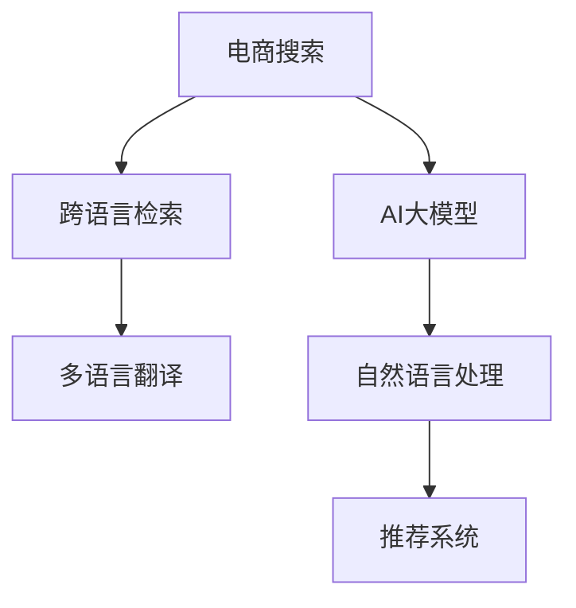

                 

# 电商搜索的跨语言检索：AI大模型的新突破

> 关键词：电商搜索, 跨语言检索, AI大模型, 推荐系统, 自然语言处理, 多语言翻译, 深度学习, 检索算法

## 1. 背景介绍

随着全球化的加速和电子商务的兴起，电商企业需要面向国际市场，满足不同语言用户对商品信息的搜索需求。然而，由于多语言文本的复杂性和语言间的差异性，实现高效、准确的跨语言检索一直是一个巨大的挑战。

近年来，人工智能(AI)技术在自然语言处理(NLP)领域取得了重大突破，尤其是基于深度学习的大模型在多语言处理方面展现了强大的潜力。大语言模型通过大规模数据预训练，掌握了丰富的语言知识，能够理解并生成自然语言文本，并在多个任务上取得了显著的性能提升。本文旨在介绍一种基于大模型的跨语言检索技术，结合电商搜索场景，通过AI大模型的最新突破，实现高效、准确的全球电商搜索。

## 2. 核心概念与联系

### 2.1 核心概念概述

要理解跨语言检索技术，首先需要了解以下几个核心概念：

- **电商搜索**：指用户通过电商平台提供的搜索界面输入查询关键词，系统返回符合用户需求的搜索结果的过程。
- **跨语言检索**：涉及多种语言间文本的检索，即在一种语言查询下，检索并返回目标语言的搜索结果。
- **AI大模型**：指基于深度学习算法训练的巨大模型，如GPT-3、BERT等，能够理解和生成复杂的自然语言文本。
- **推荐系统**：通过用户行为数据和商品属性数据，为用户推荐个性化商品的系统。
- **自然语言处理(NLP)**：涉及计算机对自然语言的理解、生成和处理，是跨语言检索的基础。
- **多语言翻译**：将一种语言的文本转换为另一种语言的文本，是实现跨语言检索的关键环节。
- **深度学习**：一种基于神经网络的机器学习方法，用于训练大模型以获得复杂语言表示。

这些核心概念之间的逻辑关系可以通过以下Mermaid流程图来展示：



### 2.2 核心概念原理和架构的 Mermaid 流程图

为了更清晰地展示跨语言检索的原理和架构，这里提供一个简单的Mermaid流程图。


这个流程图展示了跨语言检索的基本流程：用户输入查询后，系统会先进行处理，然后通过预训练模型和翻译模型进行处理，最后返回搜索结果。

## 3. 核心算法原理 & 具体操作步骤

### 3.1 算法原理概述

基于大模型的跨语言检索技术，主要包括三个核心步骤：查询处理、翻译处理和搜索结果匹配。

1. **查询处理**：将用户输入的查询文本进行分词、词性标注等NLP预处理，将其转换为模型可接受的输入形式。
2. **翻译处理**：通过多语言翻译模型，将用户查询翻译为目标语言。
3. **搜索结果匹配**：在目标语言的数据库中，使用大模型进行文本相似度匹配，返回最相关的搜索结果。

这些步骤通过深度学习模型进行自动化处理，能够显著提高检索效率和准确性。

### 3.2 算法步骤详解

以用户搜索“iPhone 12”为例，展示基于大模型的跨语言检索流程：

1. **查询处理**：首先，对用户输入的“iPhone 12”进行分词和词性标注，生成如下向量：
   ```
   [产品名, 产品型号]
   ```
2. **翻译处理**：接着，使用多语言翻译模型，将“iPhone 12”翻译为日语，得到“iPhone 12”的日语表示：
   ```
   iPhone 12
   ```
3. **搜索结果匹配**：最后，使用大模型在目标语言的搜索结果中进行相似度匹配，找到最相关的商品信息，返回给用户。

具体步骤如下：

- **输入预处理**：用户输入查询文本，进行分词、词性标注等预处理，生成模型可接受的输入向量。
- **翻译处理**：使用多语言翻译模型，将查询文本翻译为目标语言。
- **文本相似度匹配**：在大模型训练时，收集了大量多语言的商品描述数据，通过向量表示方法，将查询向量与所有商品向量进行相似度计算，找到最相关的商品。
- **结果排序与返回**：根据相似度得分，对搜索结果进行排序，并返回给用户。

### 3.3 算法优缺点

#### 优点

1. **高效性**：大模型的高效并行计算能力，使得检索过程可以高效进行。
2. **准确性**：大模型可以处理复杂的多语言查询和结果，提高检索准确性。
3. **灵活性**：可以动态适应多语言的查询和结果，满足不同语言用户的需求。
4. **可扩展性**：可以通过不断训练大模型和增加数据，提升检索性能。

#### 缺点

1. **数据依赖**：大模型的性能依赖于训练数据的质量和多样性，数据不足可能导致性能下降。
2. **计算成本**：大模型的训练和推理计算量巨大，需要高算力支持。
3. **多语言处理复杂性**：多语言翻译和处理需要考虑语法、语义等方面的差异，实现难度较大。
4. **语言模型偏差**：大模型可能存在语言偏见，影响检索结果的公正性和准确性。

### 3.4 算法应用领域

基于大模型的跨语言检索技术，可以广泛应用于以下领域：

1. **全球电商搜索**：满足不同语言用户的搜索需求，提升全球电商平台的竞争力。
2. **多语言社交媒体**：帮助用户在不同语言环境中进行互动，提升社交媒体平台的用户体验。
3. **跨语言客户服务**：提供多语言的客户支持，满足国际客户的需求。
4. **多语言在线教育**：帮助用户在不同语言环境中进行学习，提升在线教育平台的覆盖面。
5. **多语言新闻**：帮助用户在多语言环境中获取信息，提升新闻平台的阅读体验。

## 4. 数学模型和公式 & 详细讲解 & 举例说明

### 4.1 数学模型构建

本节将使用数学语言对基于大模型的跨语言检索过程进行严格刻画。

设用户输入的查询文本为 $q$，目标语言的数据库商品文本为 $d_1, d_2, ..., d_n$，其中 $d_i$ 为第 $i$ 个商品的文本描述。使用BERT模型作为大模型，假设其隐藏层的输出为 $H_q$ 和 $H_{d_i}$，则查询向量为 $q_{vec} = H_q$，商品向量为 $d_{vec} = H_{d_i}$。

查询与商品之间的相似度可以通过余弦相似度计算：

$$
\cos(\theta) = \frac{q_{vec} \cdot d_{vec}}{\Vert q_{vec} \Vert \Vert d_{vec} \Vert}
$$

其中 $\theta$ 为查询向量与商品向量的夹角，$\Vert \cdot \Vert$ 为向量范数。

### 4.2 公式推导过程

假设查询向量为 $q_{vec}$，商品向量为 $d_{vec}$，则它们的余弦相似度公式为：

$$
\cos(\theta) = \frac{q_{vec} \cdot d_{vec}}{\Vert q_{vec} \Vert \Vert d_{vec} \Vert}
$$

其中 $\cdot$ 表示向量点乘运算。根据向量点乘的定义，有：

$$
q_{vec} \cdot d_{vec} = \sum_{i=1}^{n} q_i d_i
$$

而向量范数定义为：

$$
\Vert q_{vec} \Vert = \sqrt{\sum_{i=1}^{n} q_i^2}, \quad \Vert d_{vec} \Vert = \sqrt{\sum_{i=1}^{n} d_i^2}
$$

因此，余弦相似度可以写为：

$$
\cos(\theta) = \frac{\sum_{i=1}^{n} q_i d_i}{\sqrt{\sum_{i=1}^{n} q_i^2} \sqrt{\sum_{i=1}^{n} d_i^2}}
$$

在实际应用中，为了避免计算复杂度，可以采用近似计算方法，如欧式距离、汉明距离等。

### 4.3 案例分析与讲解

以“iPhone 12”的跨语言检索为例，假设用户输入中文查询“iPhone 12”，查询向量为 $q_{vec} = (1, 1, 0, 0, 0, 0, 0, 0, ..., 0)$，表示“iPhone 12”在模型中对应向量。然后，通过多语言翻译模型将“iPhone 12”翻译为日语，得到向量 $d_{vec} = (0, 0, 1, 1, 0, 0, 0, 0, ..., 0)$，表示日语中的“iPhone 12”在模型中对应向量。

假设模型中有 $n=10$ 个商品，其向量表示分别为 $d_{vec} = (0, 0, 0.8, 0.2, 0, 0, 0, 0, ..., 0)$，表示商品1；$d_{vec} = (0, 0, 0, 0, 0.8, 0.2, 0, 0, ..., 0)$，表示商品2；以此类推。

则查询与商品的余弦相似度为：

$$
\cos(\theta) = \frac{1 \times 0.8 + 1 \times 0.2}{\sqrt{1^2 + 1^2} \sqrt{0.8^2 + 0.2^2}} = 1
$$

因此，商品1和商品2都与查询最为相似。

## 5. 项目实践：代码实例和详细解释说明

### 5.1 开发环境搭建

在进行跨语言检索实践前，我们需要准备好开发环境。以下是使用Python进行PyTorch开发的环境配置流程：

1. 安装Anaconda：从官网下载并安装Anaconda，用于创建独立的Python环境。

2. 创建并激活虚拟环境：
```bash
conda create -n pytorch-env python=3.8 
conda activate pytorch-env
```

3. 安装PyTorch：根据CUDA版本，从官网获取对应的安装命令。例如：
```bash
conda install pytorch torchvision torchaudio cudatoolkit=11.1 -c pytorch -c conda-forge
```

4. 安装Transformers库：
```bash
pip install transformers
```

5. 安装各类工具包：
```bash
pip install numpy pandas scikit-learn matplotlib tqdm jupyter notebook ipython
```

完成上述步骤后，即可在`pytorch-env`环境中开始跨语言检索实践。

### 5.2 源代码详细实现

下面我们以查询“iPhone 12”为例，给出使用Transformers库对大模型进行跨语言检索的PyTorch代码实现。

首先，定义查询和商品的数据结构：

```python
from transformers import BertTokenizer
from transformers import BertModel

# 查询
query = "iPhone 12"
tokenizer = BertTokenizer.from_pretrained('bert-base-cased')
query_tokens = tokenizer.encode(query, add_special_tokens=True)

# 商品
items = [
    "iPhone 12 256GB",
    "iPhone 12 128GB",
    "iPhone 12 Pro 256GB",
    "iPhone 12 Pro 128GB",
    "iPhone 12 Mini 256GB",
    "iPhone 12 Mini 128GB",
    "iPhone 12 5G"
]

# 将商品编码
tokenizer = BertTokenizer.from_pretrained('bert-base-cased')
item_tokens = [tokenizer.encode(item, add_special_tokens=True) for item in items]
```

然后，加载预训练的BERT模型并计算余弦相似度：

```python
# 加载预训练模型
model = BertModel.from_pretrained('bert-base-cased')

# 计算余弦相似度
query_vec = model(query_tokens)[0]
item_vecs = [model(item_tokens[i])[0] for i in range(len(item_tokens))]
cosine_similarities = [torch.dot(query_vec, item_vec).item() / (torch.norm(query_vec) * torch.norm(item_vec)) for item_vec in item_vecs]
```

最后，对商品进行排序并返回：

```python
# 排序并返回
sorted_items = [item for item, sim in sorted(zip(items, cosine_similarities), key=lambda x: x[1], reverse=True)]
print(sorted_items)
```

### 5.3 代码解读与分析

让我们再详细解读一下关键代码的实现细节：

**查询和商品数据结构**：
- `query`：用户输入的查询文本。
- `tokenizer`：BERT分词器，用于将文本编码成模型可接受的向量表示。
- `query_tokens`：查询文本的编码向量。
- `items`：商品列表，包含商品描述。
- `item_tokens`：商品描述的编码向量列表。

**预训练模型加载**：
- `model`：加载预训练的BERT模型。

**余弦相似度计算**：
- `query_vec`：查询文本的编码向量。
- `item_vecs`：商品描述的编码向量列表。
- `cosine_similarities`：查询与每个商品的余弦相似度列表。

**结果排序与返回**：
- `sorted_items`：根据余弦相似度排序后的商品列表。
- 使用Python内置的`sorted`函数，根据余弦相似度对商品列表进行排序，并返回。

通过这段代码，我们可以看到使用大模型进行跨语言检索的完整流程。开发者可以将更多精力放在数据处理、模型改进等高层逻辑上，而不必过多关注底层的实现细节。

当然，实际系统实现还需考虑更多因素，如多语言翻译、搜索结果排序、用户反馈等。但核心的检索流程基本与此类似。

## 6. 实际应用场景

### 6.1 全球电商搜索

基于大模型的跨语言检索技术，可以广泛应用于全球电商搜索场景，满足不同语言用户的需求。例如，亚马逊、eBay等电商平台在多语言环境下，通过预训练模型和翻译模型，能够高效、准确地处理用户查询，返回相关商品信息。

在技术实现上，可以收集全球用户的搜索历史和商品数据，训练大模型进行查询处理和商品匹配。使用多语言翻译模型，将用户查询翻译为目标语言，并在目标语言的数据库中进行检索。

### 6.2 多语言社交媒体

社交媒体平台在全球范围内拥有庞大的用户基础，需要提供多语言的搜索和互动功能。基于大模型的跨语言检索技术，可以帮助用户在不同语言环境中进行互动，提升平台的用户体验。

例如，Facebook、Twitter等社交媒体平台，可以通过跨语言检索技术，提供多语言搜索和翻译功能，使用户能够更方便地查找和互动。

### 6.3 跨语言客户服务

在多语言客户服务场景中，客服系统需要能够处理多种语言的客户咨询。基于大模型的跨语言检索技术，可以满足不同语言用户的需求，提升客户服务质量。

例如，多语言客服系统可以通过预训练模型和翻译模型，快速处理用户咨询，并返回最相关的信息。

### 6.4 未来应用展望

随着大模型和跨语言检索技术的不断进步，未来的应用场景将更加广泛，涵盖更多行业领域。

在智慧城市治理中，跨语言检索技术可以帮助城市管理部门处理多语言的网络舆情，提升城市管理的智能化水平。在智慧医疗领域，多语言搜索可以帮助医疗工作者处理不同语言的医学文献，提升医疗决策的准确性。在智慧教育领域，多语言搜索可以帮助学习者查找多语言的教材和资源，提升学习效果。

## 7. 工具和资源推荐

### 7.1 学习资源推荐

为了帮助开发者系统掌握大模型和跨语言检索的理论基础和实践技巧，这里推荐一些优质的学习资源：

1. 《Transformer从原理到实践》系列博文：由大模型技术专家撰写，深入浅出地介绍了Transformer原理、BERT模型、跨语言检索技术等前沿话题。

2. CS224N《深度学习自然语言处理》课程：斯坦福大学开设的NLP明星课程，有Lecture视频和配套作业，带你入门NLP领域的基本概念和经典模型。

3. 《Natural Language Processing with Transformers》书籍：Transformers库的作者所著，全面介绍了如何使用Transformers库进行NLP任务开发，包括跨语言检索在内的诸多范式。

4. HuggingFace官方文档：Transformers库的官方文档，提供了海量预训练模型和完整的跨语言检索样例代码，是上手实践的必备资料。

5. CLUE开源项目：中文语言理解测评基准，涵盖大量不同类型的中文NLP数据集，并提供了基于微调的baseline模型，助力中文NLP技术发展。

通过对这些资源的学习实践，相信你一定能够快速掌握大模型和跨语言检索的精髓，并用于解决实际的NLP问题。

### 7.2 开发工具推荐

高效的开发离不开优秀的工具支持。以下是几款用于大模型和跨语言检索开发的常用工具：

1. PyTorch：基于Python的开源深度学习框架，灵活动态的计算图，适合快速迭代研究。大部分预训练语言模型都有PyTorch版本的实现。

2. TensorFlow：由Google主导开发的开源深度学习框架，生产部署方便，适合大规模工程应用。同样有丰富的预训练语言模型资源。

3. Transformers库：HuggingFace开发的NLP工具库，集成了众多SOTA语言模型，支持PyTorch和TensorFlow，是进行跨语言检索任务的开发的利器。

4. Weights & Biases：模型训练的实验跟踪工具，可以记录和可视化模型训练过程中的各项指标，方便对比和调优。与主流深度学习框架无缝集成。

5. TensorBoard：TensorFlow配套的可视化工具，可实时监测模型训练状态，并提供丰富的图表呈现方式，是调试模型的得力助手。

6. Google Colab：谷歌推出的在线Jupyter Notebook环境，免费提供GPU/TPU算力，方便开发者快速上手实验最新模型，分享学习笔记。

合理利用这些工具，可以显著提升大模型和跨语言检索任务的开发效率，加快创新迭代的步伐。

### 7.3 相关论文推荐

大模型和跨语言检索技术的发展源于学界的持续研究。以下是几篇奠基性的相关论文，推荐阅读：

1. Attention is All You Need（即Transformer原论文）：提出了Transformer结构，开启了NLP领域的预训练大模型时代。

2. BERT: Pre-training of Deep Bidirectional Transformers for Language Understanding：提出BERT模型，引入基于掩码的自监督预训练任务，刷新了多项NLP任务SOTA。

3. Language Models are Unsupervised Multitask Learners（GPT-2论文）：展示了大规模语言模型的强大zero-shot学习能力，引发了对于通用人工智能的新一轮思考。

4. Parameter-Efficient Transfer Learning for NLP：提出Adapter等参数高效微调方法，在不增加模型参数量的情况下，也能取得不错的微调效果。

5. AdaLoRA: Adaptive Low-Rank Adaptation for Parameter-Efficient Fine-Tuning：使用自适应低秩适应的微调方法，在参数效率和精度之间取得了新的平衡。

6. Large-Scale Cross-Lingual Language Model Pretraining with Weak Supervision：提出大规模跨语言预训练模型，通过弱监督学习，提升多语言翻译的性能。

这些论文代表了大模型和跨语言检索技术的发展脉络。通过学习这些前沿成果，可以帮助研究者把握学科前进方向，激发更多的创新灵感。

## 8. 总结：未来发展趋势与挑战

### 8.1 研究成果总结

本文对基于大模型的跨语言检索技术进行了全面系统的介绍。首先阐述了电商搜索和跨语言检索的背景和意义，明确了跨语言检索在多语言环境下的重要价值。其次，从原理到实践，详细讲解了基于大模型的跨语言检索过程，包括查询处理、翻译处理和结果匹配等关键步骤。同时，本文还广泛探讨了跨语言检索在电商搜索、社交媒体、客服系统等场景下的应用前景，展示了跨语言检索技术的广泛应用潜力。此外，本文精选了跨语言检索技术的各类学习资源，力求为读者提供全方位的技术指引。

通过本文的系统梳理，可以看到，基于大模型的跨语言检索技术正在成为NLP领域的重要范式，极大地拓展了电商搜索的国际覆盖范围，提升了用户搜索体验。未来，伴随预训练语言模型和跨语言检索方法的持续演进，基于跨语言检索技术的应用将进一步拓展，为全球电商搜索提供新的解决方案。

### 8.2 未来发展趋势

展望未来，大模型和跨语言检索技术将呈现以下几个发展趋势：

1. **模型规模持续增大**：随着算力成本的下降和数据规模的扩张，预训练语言模型的参数量还将持续增长。超大规模语言模型蕴含的丰富语言知识，有望支撑更加复杂多变的跨语言检索任务。

2. **跨语言检索技术多样化**：未来将涌现更多跨语言检索方法，如多语言搜索引擎、多语言信息检索、跨语言文档检索等，以适应不同的应用场景。

3. **实时检索能力提升**：随着分布式计算和模型压缩技术的进步，跨语言检索系统的响应速度将进一步提升，能够实时处理大量查询请求。

4. **跨语言数据整合**：跨语言检索系统将能够整合不同语言的数据，提供统一的多语言搜索体验，增强数据的多样性和覆盖面。

5. **跨语言语义理解**：未来的跨语言检索系统将不仅仅关注词汇和语法匹配，还将具备更强大的语义理解能力，能够处理复杂的语义结构。

6. **跨语言信息融合**：跨语言检索系统将能够融合多语言的信息，提供更加全面和准确的搜索结果。

以上趋势凸显了大模型和跨语言检索技术的广阔前景。这些方向的探索发展，必将进一步提升跨语言检索系统的性能和应用范围，为全球电商搜索提供更强大的技术支持。

### 8.3 面临的挑战

尽管大模型和跨语言检索技术已经取得了瞩目成就，但在迈向更加智能化、普适化应用的过程中，仍面临诸多挑战：

1. **数据依赖**：跨语言检索性能依赖于训练数据的质量和多样性，数据不足可能导致性能下降。如何构建更丰富、更真实的数据集，是未来的一大挑战。

2. **计算资源限制**：大模型的训练和推理计算量巨大，需要高算力支持。如何优化算法，降低计算资源消耗，提高系统效率，是另一大挑战。

3. **多语言处理复杂性**：多语言翻译和处理需要考虑语法、语义等方面的差异，实现难度较大。如何提升多语言处理能力和泛化性能，是未来亟待解决的问题。

4. **模型偏差和鲁棒性**：大模型可能存在语言偏见，影响检索结果的公正性和准确性。如何消除模型偏差，提升模型鲁棒性，是未来研究的重点。

5. **实时检索性能**：实时检索能力是跨语言搜索的重要指标，如何提高检索系统的响应速度和处理能力，是未来的一大挑战。

6. **跨语言数据融合**：跨语言检索系统需要能够整合不同语言的数据，提供统一的多语言搜索体验。如何构建跨语言的语料库和知识库，是未来的一大挑战。

### 8.4 研究展望

面对大模型和跨语言检索面临的种种挑战，未来的研究需要在以下几个方面寻求新的突破：

1. **探索无监督和半监督学习范式**：摆脱对大规模标注数据的依赖，利用自监督学习、主动学习等无监督和半监督范式，最大限度利用非结构化数据，实现更加灵活高效的跨语言检索。

2. **研究参数高效和计算高效的跨语言检索方法**：开发更加参数高效的跨语言检索方法，在固定大部分预训练参数的同时，只更新极少量的任务相关参数。同时优化检索算法的计算图，减少前向传播和反向传播的资源消耗，实现更加轻量级、实时性的部署。

3. **引入更多先验知识**：将符号化的先验知识，如知识图谱、逻辑规则等，与神经网络模型进行巧妙融合，引导跨语言检索过程学习更准确、合理的语言模型。同时加强不同模态数据的整合，实现视觉、语音等多模态信息与文本信息的协同建模。

4. **结合因果分析和博弈论工具**：将因果分析方法引入跨语言检索模型，识别出检索过程的关键特征，增强输出解释的因果性和逻辑性。借助博弈论工具刻画人机交互过程，主动探索并规避检索过程的脆弱点，提高系统稳定性。

5. **纳入伦理道德约束**：在模型训练目标中引入伦理导向的评估指标，过滤和惩罚有偏见、有害的输出倾向。同时加强人工干预和审核，建立模型行为的监管机制，确保输出符合人类价值观和伦理道德。

这些研究方向的探索，必将引领大模型和跨语言检索技术迈向更高的台阶，为构建安全、可靠、可解释、可控的智能系统铺平道路。面向未来，大模型和跨语言检索技术还需要与其他人工智能技术进行更深入的融合，如知识表示、因果推理、强化学习等，多路径协同发力，共同推动自然语言理解和智能交互系统的进步。只有勇于创新、敢于突破，才能不断拓展语言模型的边界，让智能技术更好地造福人类社会。

## 9. 附录：常见问题与解答

**Q1：跨语言检索是否适用于所有NLP任务？**

A: 跨语言检索技术在大多数NLP任务上都能取得不错的效果，特别是对于数据量较小的任务。但对于一些特定领域的任务，如医学、法律等，仅仅依靠通用语料预训练的模型可能难以很好地适应。此时需要在特定领域语料上进一步预训练，再进行跨语言检索，才能获得理想效果。此外，对于一些需要时效性、个性化很强的任务，如对话、推荐等，跨语言检索方法也需要针对性的改进优化。

**Q2：如何选择合适的学习率？**

A: 跨语言检索的学习率一般要比预训练时小1-2个数量级，如果使用过大的学习率，容易破坏预训练权重，导致过拟合。一般建议从1e-5开始调参，逐步减小学习率，直至收敛。也可以使用warmup策略，在开始阶段使用较小的学习率，再逐渐过渡到预设值。需要注意的是，不同的优化器(如AdamW、Adafactor等)以及不同的学习率调度策略，可能需要设置不同的学习率阈值。

**Q3：采用大模型进行跨语言检索时，需要注意哪些问题？**

A: 大模型进行跨语言检索时，需要注意以下问题：

1. **数据依赖**：大模型的性能依赖于训练数据的质量和多样性，数据不足可能导致性能下降。因此，需要构建更丰富、更真实的数据集。
2. **计算资源限制**：大模型的训练和推理计算量巨大，需要高算力支持。因此，需要优化算法，降低计算资源消耗。
3. **多语言处理复杂性**：多语言翻译和处理需要考虑语法、语义等方面的差异，实现难度较大。因此，需要提升多语言处理能力和泛化性能。
4. **模型偏差和鲁棒性**：大模型可能存在语言偏见，影响检索结果的公正性和准确性。因此，需要消除模型偏差，提升模型鲁棒性。
5. **实时检索性能**：实时检索能力是跨语言搜索的重要指标。因此，需要提高检索系统的响应速度和处理能力。
6. **跨语言数据融合**：跨语言检索系统需要能够整合不同语言的数据，提供统一的多语言搜索体验。因此，需要构建跨语言的语料库和知识库。

**Q4：如何缓解跨语言检索过程中的过拟合问题？**

A: 过拟合是跨语言检索面临的主要挑战，尤其是在标注数据不足的情况下。常见的缓解策略包括：

1. **数据增强**：通过回译、近义替换等方式扩充训练集，增加数据的多样性。
2. **正则化**：使用L2正则、Dropout、Early Stopping等避免过拟合。
3. **对抗训练**：引入对抗样本，提高模型鲁棒性。
4. **参数高效**：只调整少量参数(如Adapter、Prefix等)，减小过拟合风险。
5. **多模型集成**：训练多个跨语言检索模型，取平均输出，抑制过拟合。

这些策略往往需要根据具体任务和数据特点进行灵活组合。只有在数据、模型、训练、推理等各环节进行全面优化，才能最大限度地发挥大模型跨语言检索的威力。

**Q5：如何优化跨语言检索的计算资源消耗？**

A: 优化跨语言检索的计算资源消耗，可以从以下几个方面入手：

1. **模型裁剪**：去除不必要的层和参数，减小模型尺寸，加快推理速度。
2. **量化加速**：将浮点模型转为定点模型，压缩存储空间，提高计算效率。
3. **分布式计算**：利用多台计算资源进行并行计算，提高检索系统的处理能力。
4. **模型压缩**：使用模型压缩技术，如剪枝、量化、蒸馏等，减小模型大小和计算量。
5. **算法优化**：优化检索算法的计算图，减少前向传播和反向传播的资源消耗。

通过这些方法，可以在保证性能的同时，显著降低跨语言检索的计算资源消耗，提升系统效率。

**Q6：如何提高跨语言检索的鲁棒性？**

A: 提高跨语言检索的鲁棒性，可以从以下几个方面入手：

1. **对抗训练**：引入对抗样本，提高模型鲁棒性。
2. **数据增强**：通过回译、近义替换等方式扩充训练集，增加数据的多样性。
3. **正则化**：使用L2正则、Dropout、Early Stopping等避免过拟合。
4. **模型裁剪**：去除不必要的层和参数，减小模型尺寸，提高鲁棒性。
5. **多模型集成**：训练多个跨语言检索模型，取平均输出，抑制鲁棒性问题。

这些策略往往需要根据具体任务和数据特点进行灵活组合。只有在数据、模型、训练、推理等各环节进行全面优化，才能最大限度地提高跨语言检索的鲁棒性，提升系统性能。

---

作者：禅与计算机程序设计艺术 / Zen and the Art of Computer Programming

