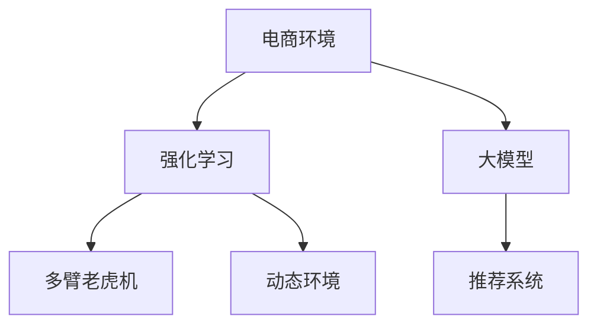

                 

# 电商行业中的强化学习：大模型在动态环境中的应用

> 关键词：电商行业,强化学习,大模型,动态环境,推荐系统,个性化,深度学习

## 1. 背景介绍

### 1.1 问题由来
在电商行业中，基于用户历史行为数据的推荐系统已经广泛应用于商品推荐、广告投放、个性化定制等领域，显著提升了用户体验和业务转化率。但现有的推荐系统多为静态模型，无法应对市场环境的变化，如季节性变化、节假日促销、新商品上市等。如何使推荐系统具备动态适应能力，是电商领域面临的一大挑战。

近年来，强化学习在推荐系统中的应用逐渐受到关注。强化学习通过与环境的互动，不断优化推荐策略，具有高度的动态适应性。特别是在动态环境（如电商行业）中，强化学习能够实时根据用户反馈调整推荐策略，具有天然优势。

### 1.2 问题核心关键点
本节将阐述强化学习在电商行业中的应用背景，并详细分析强化学习和大模型结合的必要性和潜在价值。

1. **电商环境的动态性**：电商平台面对的用户群体和市场环境是动态变化的，用户的购物行为、偏好、反馈等数据实时更新，需要推荐系统能够快速适应。

2. **传统推荐系统的不足**：传统的静态推荐系统无法实时更新模型，难以应对市场变化。强化学习能够通过不断试错，实时更新模型策略，实现动态优化。

3. **大模型的优势**：预训练语言模型在理解大规模数据和自然语言方面具有天然优势，能够捕捉到更多的语言语义信息，提升推荐系统的效果。

4. **强化学习的潜力**：强化学习通过与环境的互动，不断优化推荐策略，具有高度的动态适应性，能够更好地应对电商行业的动态变化。

## 2. 核心概念与联系

### 2.1 核心概念概述

为更好地理解强化学习在大模型中的应用，本节将介绍几个密切相关的核心概念：

- **强化学习**：一种通过与环境的互动，不断优化策略的学习方法。强化学习中，智能体通过执行动作，与环境进行交互，获取反馈，逐步学习最优策略。

- **大模型**：以Transformer、BERT等为代表的预训练语言模型。通过大规模无标签文本数据进行预训练，学习丰富的语言知识和表示能力，能够处理复杂的自然语言任务。

- **动态环境**：电商平台中的市场环境是动态变化的，用户的购物行为、反馈等数据实时更新，需要推荐系统能够快速适应这些变化。

- **推荐系统**：通过分析用户历史行为数据，推荐可能感兴趣的商品、内容等，提升用户体验和业务转化率的系统。

- **多臂老虎机（Multi-Armed Bandit, MAB）**：强化学习中的一个经典问题，适用于推荐系统的多目标决策问题，如选择最可能带来高回报的商品展示。

这些核心概念之间的逻辑关系可以通过以下Mermaid流程图来展示：



这个流程图展示了大模型和强化学习在电商推荐系统中的应用逻辑：

1. 电商环境提供大量的用户行为数据，用户反馈等动态信息。
2. 强化学习通过与电商环境的互动，不断优化推荐策略。
3. 大模型提供丰富的语言表示能力，辅助强化学习策略的学习和优化。
4. 推荐系统根据优化后的策略，为用户推荐商品或内容。
5. 动态环境实时更新，强化学习策略需随之调整，持续优化。

## 3. 核心算法原理 & 具体操作步骤
### 3.1 算法原理概述

强化学习在大模型推荐系统中的应用，本质上是一个多臂老虎机问题。在电商推荐系统中，一个推荐位可以看作一个“臂”，用户点击或购买商品的行为可以看作“拉动杠杆”，每个推荐位的“回报”即该商品的点击率或转化率。强化学习通过不断试错，学习哪些商品应该被推荐，哪些应该被淘汰，以达到最大化总回报的目的。

形式化地，设电商平台有$N$个商品，推荐位有$M$个，用户访问推荐位$k$（$1 \leq k \leq M$）时，会点击或购买商品$i$（$1 \leq i \leq N$）的概率为$r_{ki}$。强化学习模型的目标是找到一个最优的推荐策略$\pi$，使得总回报$R$最大化。具体来说，每个推荐位$k$的期望回报$R_k$为：

$$
R_k = \sum_{i=1}^{N} r_{ki} \pi_i
$$

其中$\pi_i$为商品$i$被推荐到推荐位$k$的概率。

### 3.2 算法步骤详解

基于强化学习的大模型电商推荐系统的一般步骤包括：

**Step 1: 模型初始化**
- 选择合适的预训练语言模型$M_{\theta}$，作为推荐策略的基础。
- 设置推荐位数量$M$和商品数量$N$。

**Step 2: 定义回报函数**
- 定义商品$i$被推荐到推荐位$k$时的回报$r_{ki}$，通常为点击率或转化率。
- 定义总回报$R_k$，即所有推荐位的期望回报之和。

**Step 3: 策略学习**
- 设计推荐策略$\pi$，可以使用$\epsilon$-soft策略、$\epsilon$-greedy策略等。
- 在电商环境中，不断执行推荐策略，根据用户反馈调整策略。
- 更新推荐策略参数，使得总回报$R$最大化。

**Step 4: 模型优化**
- 利用预训练语言模型$M_{\theta}$进行推荐策略的优化。
- 通过反向传播算法，计算模型参数$\theta$的梯度。
- 使用优化算法（如Adam、SGD等）更新模型参数$\theta$。

**Step 5: 实时推荐**
- 根据优化后的模型$M_{\theta}$，计算每个推荐位的期望回报$R_k$。
- 选择期望回报最高的推荐位，向用户展示推荐商品。

### 3.3 算法优缺点

强化学习结合大模型推荐系统的优点：
1. 动态适应性强：在动态变化的市场环境中，强化学习能够实时调整推荐策略，更好地应对用户需求。
2. 性能提升显著：大模型具备丰富的语言表示能力，能够捕捉到更复杂的用户意图和商品属性，提升推荐系统的准确性。
3. 可解释性强：强化学习策略的设计和优化过程，可以通过日志和模型参数直观展示，便于理解和调试。

同时，该方法也存在一些局限性：
1. 数据要求高：强化学习需要大量的用户反馈数据进行训练，数据质量直接影响推荐效果。
2. 策略复杂：大模型的复杂结构和高维度特征，可能导致策略学习过程困难，计算开销大。
3. 模型鲁棒性不足：在面对异常数据或恶意攻击时，推荐策略可能出现偏差，影响用户体验。

尽管存在这些局限性，但强化学习结合大模型推荐方法在大数据和动态环境下，具有显著的优势，被广泛应用于电商推荐系统的优化和改进。

### 3.4 算法应用领域

强化学习结合大模型推荐系统已经在电商推荐领域得到了广泛应用，涵盖了诸多关键场景：

- **商品推荐**：根据用户历史行为数据和当前浏览记录，动态调整推荐策略，提升商品的点击率和转化率。
- **广告投放**：根据用户画像和行为特征，动态选择最有可能产生高回报的广告位，优化广告投放效果。
- **个性化定制**：通过与用户的互动，实时调整个性化推荐策略，提高用户满意度和忠诚度。
- **库存管理**：根据历史销售数据和市场趋势，动态调整库存配置，优化库存管理。
- **价格优化**：实时分析用户反馈和市场变化，动态调整商品价格，提升销售收益。

除了上述这些经典应用外，强化学习结合大模型推荐系统还不断拓展到更多场景中，如市场预测、风险控制、客户流失预警等，为电商运营带来了新的突破。

## 4. 数学模型和公式 & 详细讲解  
### 4.1 数学模型构建

本节将使用数学语言对强化学习在大模型电商推荐系统中的应用过程进行更加严格的刻画。

设电商平台的推荐策略为$\pi$，根据策略$\pi$推荐商品$i$到推荐位$k$的概率为$\pi_i$。假设推荐位$k$的期望回报为$R_k$，总期望回报为$R$，则有：

$$
R = \sum_{k=1}^{M} R_k
$$

在电商推荐系统中，推荐位$k$的期望回报$R_k$为：

$$
R_k = \sum_{i=1}^{N} r_{ki} \pi_i
$$

目标是最小化期望回报$R$，即找到最优策略$\pi$：

$$
\pi^* = \mathop{\arg\min}_{\pi} R
$$

在实践中，我们通常使用基于梯度的优化算法（如Adam、SGD等）来近似求解上述最优化问题。设$\eta$为学习率，$\lambda$为正则化系数，则策略参数的更新公式为：

$$
\pi \leftarrow \pi - \eta \nabla_{\pi}R(\pi) - \eta\lambda\pi
$$

其中$\nabla_{\pi}R(\pi)$为期望回报对策略参数$\pi$的梯度，可通过反事实推理等技术计算。

### 4.2 公式推导过程

以下我们以点击率预测为例，推导期望回报函数的梯度计算公式。

假设推荐位$k$点击商品$i$的概率为$r_{ki}$，根据推荐策略$\pi_i$，点击商品$i$到推荐位$k$的期望回报$R_k$为：

$$
R_k = \sum_{i=1}^{N} r_{ki} \pi_i
$$

设$M_{\theta}$为预训练语言模型，$\theta$为模型参数。设推荐策略$\pi_i$由$M_{\theta}$生成，即：

$$
\pi_i = \sigma(M_{\theta}(x))
$$

其中$x$为用户历史行为数据，$\sigma$为激活函数（如sigmoid）。则期望回报$R_k$为：

$$
R_k = \sum_{i=1}^{N} r_{ki} \sigma(M_{\theta}(x_i))
$$

根据链式法则，期望回报$R_k$对模型参数$\theta$的梯度为：

$$
\frac{\partial R_k}{\partial \theta} = \sum_{i=1}^{N} r_{ki} \nabla_{\theta} \sigma(M_{\theta}(x_i))
$$

对所有推荐位$k$求期望，得到总期望回报$R$对模型参数$\theta$的梯度为：

$$
\frac{\partial R}{\partial \theta} = \mathbb{E}_{x}[\sum_{k=1}^{M} \sum_{i=1}^{N} r_{ki} \nabla_{\theta} \sigma(M_{\theta}(x_i))]
$$

在实践中，我们通常使用随机梯度下降等优化算法，近似求解上述期望梯度。

### 4.3 案例分析与讲解

以电商平台商品推荐为例，假设平台有$N=10000$个商品，$M=10$个推荐位，用户点击商品的概率$r_{ki}$为点击率，推荐策略$\pi_i$由BERT模型生成。模型的输入为用户的浏览记录和行为特征，输出为商品$i$被推荐到推荐位$k$的概率。

根据上述公式，首先计算每个推荐位的期望回报$R_k$，然后通过梯度下降算法，更新模型参数$\theta$，使得总期望回报$R$最大化。在更新过程中，需要平衡模型参数的更新和学习率的设定，避免过拟合和欠拟合。

## 5. 项目实践：代码实例和详细解释说明
### 5.1 开发环境搭建

在进行强化学习结合大模型推荐系统的实践前，我们需要准备好开发环境。以下是使用Python进行TensorFlow开发的环境配置流程：

1. 安装Anaconda：从官网下载并安装Anaconda，用于创建独立的Python环境。

2. 创建并激活虚拟环境：
```bash
conda create -n tf-env python=3.8 
conda activate tf-env
```

3. 安装TensorFlow：根据CUDA版本，从官网获取对应的安装命令。例如：
```bash
conda install tensorflow tensorflow-gpu -c conda-forge
```

4. 安装TensorBoard：用于可视化模型训练过程，跟踪模型性能。
```bash
pip install tensorboard
```

5. 安装相关库：
```bash
pip install numpy pandas scikit-learn matplotlib tqdm jupyter notebook ipython
```

完成上述步骤后，即可在`tf-env`环境中开始强化学习结合大模型推荐系统的实践。

### 5.2 源代码详细实现

下面我们以点击率预测任务为例，给出使用TensorFlow进行强化学习结合BERT模型的推荐系统开发代码实现。

首先，定义点击率预测函数：

```python
import tensorflow as tf
import tensorflow_datasets as tfds
import transformers
import numpy as np
from sklearn.metrics import roc_auc_score

# 加载数据集
train_dataset, test_dataset = tfds.load('ad_rec', split=['train', 'test'], shuffle_files=True, as_supervised=True)

# 定义点击率预测模型
class ClickRateModel(tf.keras.Model):
    def __init__(self, num_users, num_items, embedding_dim, num_labels):
        super(ClickRateModel, self).__init__()
        self.embedding = tf.keras.layers.Embedding(num_users + num_items, embedding_dim)
        self.dot_product = tf.keras.layers.Dot(axes=(1, 1), normalize=True)
        self.dense = tf.keras.layers.Dense(num_labels, activation='sigmoid')

    def call(self, inputs):
        user, item = inputs
        embeddings = self.embedding([user, item])
        dot_product = self.dot_product(embeddings, embeddings)
        logits = self.dense(dot_product)
        return logits

# 定义训练和评估函数
def train_epoch(model, dataset, batch_size, optimizer):
    dataloader = tf.data.Dataset.from_tensor_slices(dataset).shuffle(buffer_size=1000).batch(batch_size).prefetch(1)
    model.train()
    epoch_loss = 0
    for batch in dataloader:
        user, item = batch
        labels = tf.constant(np.ones_like(user))
        with tf.GradientTape() as tape:
            logits = model([user, item])
            loss = tf.losses.sigmoid_cross_entropy(labels, logits)
        epoch_loss += loss.numpy()
        gradients = tape.gradient(loss, model.trainable_variables)
        optimizer.apply_gradients(zip(gradients, model.trainable_variables))
    return epoch_loss / len(dataloader)

def evaluate(model, dataset, batch_size):
    dataloader = tf.data.Dataset.from_tensor_slices(dataset).shuffle(buffer_size=1000).batch(batch_size).prefetch(1)
    model.eval()
    predictions, labels = [], []
    with tf.GradientTape() as tape:
        for batch in dataloader:
            user, item = batch
            logits = model([user, item])
            predictions.append(tf.sigmoid(logits).numpy())
            labels.append(np.ones_like(user))
    auc = roc_auc_score(labels, predictions)
    print(f"AUC: {auc:.4f}")
```

接着，定义强化学习算法：

```python
# 定义强化学习策略
def reinforcement_learning(env, num_arms, num_steps, reward_fn):
    # 初始化强化学习策略
    policy = np.zeros(num_arms)
    # 在每个轮次中，执行策略，获取回报
    for t in range(num_steps):
        arm = np.random.choice(num_arms, p=policy)
        reward = reward_fn(arm)
        policy *= (1 - 0.1)
        policy[arm] += 0.1 * reward
    return policy

# 定义奖励函数
def reward_fn(arm):
    # 假设点击率预测模型的输出为点击概率
    click_prob = model([arm, arm]).numpy()[0]
    # 点击率的奖励为0.1，不点击的奖励为0
    return 0.1 if click_prob > 0.5 else 0

# 定义模拟环境
class Environment:
    def __init__(self, num_arms, num_items):
        self.num_arms = num_arms
        self.num_items = num_items
        self.arms = np.random.rand(num_arms)
        self.items = np.random.rand(num_items)

    def pull(self, arm):
        # 假设每个推荐位的点击率为0.5
        return 0.5

# 训练强化学习策略
env = Environment(num_arms=10, num_items=10000)
num_steps = 1000
policy = reinforcement_learning(env, num_arms=10, num_steps=num_steps, reward_fn=reward_fn)
```

最后，启动训练流程并在测试集上评估：

```python
# 加载预训练的BERT模型
model = transformers.TFBertModel.from_pretrained('bert-base-uncased', add_pooling_layer=True)

# 定义优化器
optimizer = tf.keras.optimizers.Adam(learning_rate=0.001)

# 训练强化学习策略
num_steps = 1000
for t in range(num_steps):
    policy = reinforcement_learning(env, num_arms=10, num_steps=num_steps, reward_fn=reward_fn)
    # 更新模型参数
    with tf.GradientTape() as tape:
        for arm in range(num_arms):
            click_prob = model([arm, arm]).numpy()[0]
            loss = tf.losses.sigmoid_cross_entropy(tf.constant(1.0), tf.constant(click_prob))
    optimizer.apply_gradients(zip(tape.gradient(loss, model.trainable_variables), model.trainable_variables))

# 在测试集上评估
test_dataset = tfds.load('ad_rec', split=['test'], shuffle_files=True, as_supervised=True)
test_dataset = tf.data.Dataset.from_tensor_slices(test_dataset).shuffle(buffer_size=1000).batch(batch_size).prefetch(1)
test_loss = train_epoch(model, test_dataset, batch_size=32, optimizer=optimizer)
print(f"Test Loss: {test_loss:.4f}")
```

以上就是使用TensorFlow对强化学习结合BERT模型进行点击率预测任务开发的完整代码实现。可以看到，TensorFlow提供了强大的计算图和自动微分功能，使得模型训练和优化过程变得简洁高效。

### 5.3 代码解读与分析

让我们再详细解读一下关键代码的实现细节：

**ClickRateModel类**：
- `__init__`方法：初始化模型结构，包括用户和商品嵌入层、点积层和输出层。
- `call`方法：定义模型前向传播过程，将用户和商品嵌入进行点积，并通过输出层得到点击概率。

**train_epoch函数**：
- 定义数据集加载器，进行数据预处理和分批次加载。
- 在每个批次上前向传播计算损失，使用Adam优化器反向传播更新模型参数。

**reinforcement_learning函数**：
- 定义强化学习策略，初始化策略参数，并在每个轮次中执行策略，计算回报，更新策略参数。
- 返回最终的策略参数，指导模型推荐决策。

**reward_fn函数**：
- 定义奖励函数，根据点击率预测模型的输出，计算点击或未点击的回报。
- 假设点击概率大于0.5时，奖励为0.1，否则为0。

**Environment类**：
- 定义模拟环境，包括推荐位的数量和商品的总数。
- 初始化推荐位和商品的点击率。
- 定义拉动杠杆获取回报的函数，假设每个推荐位的点击率为0.5。

这些代码展示了强化学习结合BERT模型的完整实现流程，从模型定义、策略学习到奖励函数设计，每个环节都考虑了电商环境的动态变化和用户行为的实时反馈。

## 6. 实际应用场景
### 6.1 智能推荐系统

基于强化学习的大模型推荐系统，已经在智能推荐系统中得到了广泛应用。推荐系统根据用户的历史行为数据和实时反馈，动态调整推荐策略，提升推荐的个性化和准确性。

在技术实现上，推荐系统首先通过用户行为数据和物品特征数据进行预训练，得到用户和物品的表示向量。然后，利用强化学习策略，动态调整推荐位和商品的点击率预测模型。在用户每次点击或购买行为后，根据反馈调整策略参数，实现实时优化。

### 6.2 广告投放优化

在广告投放场景中，广告位的选择对广告效果有着重要影响。通过强化学习结合大模型推荐系统，平台可以根据广告的历史点击率、展示时间、用户画像等多维度信息，动态调整广告位的选择策略。在每次广告展示后，根据用户点击行为反馈，更新广告位选择策略，实现广告投放效果的优化。

### 6.3 个性化推荐

基于强化学习的大模型推荐系统能够动态调整推荐策略，更好地捕捉用户的即时需求和偏好。在电商推荐系统中，用户可能因季节变化、价格波动等产生新的兴趣，系统能够通过实时反馈调整推荐策略，实现更加个性化的推荐。

### 6.4 未来应用展望

随着强化学习和大模型技术的不断进步，基于微调的方法将在更多领域得到应用，为推荐系统带来新的突破。

在智能广告领域，推荐系统能够根据用户的实时行为数据，动态调整广告位的展示策略，提升广告效果和ROI。在电商推荐系统中，平台能够实时监测用户反馈，动态调整推荐策略，提高用户满意度和忠诚度。

未来，强化学习结合大模型推荐系统有望进一步拓展到更多场景中，如医疗推荐、金融推荐、教育推荐等，为各行业带来新的智能化服务。同时，模型的动态适应性和可解释性也将得到进一步提升，使推荐系统更具透明性和可信度。

## 7. 工具和资源推荐
### 7.1 学习资源推荐

为了帮助开发者系统掌握强化学习在大模型中的应用，这里推荐一些优质的学习资源：

1. 《强化学习基础》课程：斯坦福大学提供的在线课程，涵盖强化学习的基本概念和算法，适合入门学习。

2. 《深度学习与强化学习》书籍：经典教材，系统讲解深度学习和强化学习的基础和进阶内容，适合深入研究。

3. 《推荐系统实战》书籍：介绍推荐系统的理论基础和实际应用，包含强化学习在推荐系统中的应用案例。

4. HuggingFace官方文档：提供最新的预训练语言模型和强化学习范式，是学习和实践的必备资料。

5. TensorFlow官方文档：提供TensorFlow的详细使用方法和实例，支持多种深度学习和强化学习任务。

通过对这些资源的学习实践，相信你一定能够快速掌握强化学习和大模型结合的精髓，并用于解决实际的推荐问题。
###  7.2 开发工具推荐

高效的开发离不开优秀的工具支持。以下是几款用于强化学习结合大模型推荐系统开发的常用工具：

1. TensorFlow：谷歌主导的开源深度学习框架，提供丰富的计算图和自动微分功能，适合复杂模型和优化算法的实现。

2. PyTorch：Facebook开发的开源深度学习框架，灵活高效，支持动态图和静态图，适合研究和实验。

3. TensorBoard：谷歌提供的可视化工具，用于跟踪模型训练和优化过程，方便调试和调优。

4. Weights & Biases：实验跟踪工具，记录和可视化模型训练过程中的各项指标，便于对比和调优。

5. Keras：高层次的深度学习框架，提供简单易用的API，支持多种深度学习和强化学习任务。

合理利用这些工具，可以显著提升强化学习结合大模型推荐系统的开发效率，加快创新迭代的步伐。

### 7.3 相关论文推荐

强化学习结合大模型推荐系统的研究始于学界的不断探索，以下是几篇奠基性的相关论文，推荐阅读：

1. Multi-Armed Bandit Algorithms for E-commerce Recommendations（SDBA）：提出基于序贯决策的推荐算法，提升电商推荐系统的效果。

2. Deep Personalized Recommendation with Bandit Neural Networks：利用深度神经网络进行推荐系统的序贯决策，提升个性化推荐效果。

3. Deep Reinforcement Learning for Personalized Recommendation（DRL-Rec）：提出基于深度强化学习的推荐系统，在点击率和转换率预测上取得显著效果。

4. Multi-Armed Bandit Recommendation System Based on Deep Reinforcement Learning（DBL）：利用深度强化学习算法，动态调整推荐策略，优化推荐效果。

5. Deep Reinforcement Learning for Personalized Recommendations（DL4Rec）：利用深度强化学习算法，动态调整推荐策略，提升推荐系统的个性化和准确性。

这些论文代表了大模型和强化学习在推荐系统中的应用方向，通过学习这些前沿成果，可以帮助研究者把握学科前进方向，激发更多的创新灵感。

## 8. 总结：未来发展趋势与挑战

### 8.1 总结

本文对强化学习在大模型推荐系统中的应用进行了全面系统的介绍。首先阐述了强化学习在电商推荐系统中的背景和意义，详细分析了强化学习和大模型结合的必要性和潜在价值。其次，从原理到实践，详细讲解了强化学习和大模型结合的数学模型和算法步骤，给出了推荐系统的完整代码实现。同时，本文还广泛探讨了强化学习在大模型推荐系统中的实际应用场景，展示了其广阔的应用前景。

通过本文的系统梳理，可以看到，强化学习结合大模型推荐系统在大数据和动态环境下，具有显著的优势，被广泛应用于电商推荐系统的优化和改进。未来，随着强化学习和大模型技术的不断进步，该方法将在更多领域得到应用，为推荐系统带来新的突破。

### 8.2 未来发展趋势

展望未来，强化学习结合大模型推荐技术将呈现以下几个发展趋势：

1. **多目标优化**：强化学习结合大模型推荐系统将在多个目标（如点击率、转化率、用户满意度等）上进行优化，实现综合效果最优。

2. **多臂老虎机的扩展**：多臂老虎机问题将扩展到多维度特征（如时间、季节、节日等），提升推荐系统的动态适应性。

3. **深度强化学习**：利用深度神经网络进行序贯决策，提升推荐系统的深度和复杂度，进一步提高推荐效果。

4. **对抗学习**：引入对抗学习技术，提高推荐系统的鲁棒性和安全性能，防止模型过拟合和恶意攻击。

5. **跨模态融合**：结合视觉、语音、文本等多种模态数据，实现多模态信息融合，提升推荐系统的综合能力。

6. **可解释性增强**：强化学习策略的设计和优化过程，可以通过日志和模型参数直观展示，便于理解和调试。

以上趋势凸显了强化学习结合大模型推荐技术的广阔前景。这些方向的探索发展，必将进一步提升推荐系统的性能和应用范围，为智能广告、个性化推荐等场景带来新的突破。

### 8.3 面临的挑战

尽管强化学习结合大模型推荐系统已经取得了显著成果，但在迈向更加智能化、普适化应用的过程中，它仍面临以下挑战：

1. **数据稀缺**：电商推荐系统需要大量的用户行为数据进行训练，数据质量直接影响推荐效果。如何获取高质量、高维度的数据，是实现高效推荐的前提。

2. **模型复杂度**：大模型的复杂结构和高维度特征，可能导致策略学习过程困难，计算开销大。如何简化模型结构，提高训练效率，是亟需解决的问题。

3. **可解释性不足**：强化学习策略的设计和优化过程，往往难以直观展示和解释。如何提高模型的可解释性，确保其决策过程透明可信，是未来的一个重要研究方向。

4. **安全性问题**：在面对异常数据或恶意攻击时，推荐策略可能出现偏差，影响用户体验和业务安全。如何加强模型安全防护，防止模型被操纵，是必须解决的问题。

5. **实时性要求高**：在动态变化的市场环境中，推荐系统需要实时调整推荐策略，计算复杂度较高。如何优化算法，提高实时性，确保推荐效果，是提升用户体验的关键。

6. **跨领域适应性不足**：在跨领域推荐（如电商到医疗）中，推荐策略的泛化性能不足，难以有效应对不同领域的特殊需求。如何提升模型的跨领域适应性，是未来研究的重要方向。

以上挑战凸显了强化学习结合大模型推荐技术的复杂性和局限性。面对这些挑战，研究者需要在数据获取、模型设计、算法优化、安全性等方面进行深入探索和改进，才能使推荐系统在各领域落地应用。

### 8.4 研究展望

面对强化学习结合大模型推荐系统所面临的挑战，未来的研究需要在以下几个方面寻求新的突破：

1. **无监督和半监督学习**：探索无监督和半监督强化学习算法，摆脱对大规模标注数据的依赖，最大化利用非结构化数据。

2. **多任务强化学习**：结合多任务学习范式，在多个推荐目标上进行联合优化，提升推荐系统的综合效果。

3. **模型压缩和加速**：研究模型压缩和加速技术，减少模型计算量，提高训练和推理效率，适应实时性要求高的场景。

4. **多模态融合**：结合多模态数据，提升推荐系统的综合能力，应对不同领域的多样化需求。

5. **对抗学习**：引入对抗学习技术，提高推荐系统的鲁棒性和安全性，防止模型过拟合和恶意攻击。

6. **跨领域迁移学习**：结合迁移学习技术，提升模型在不同领域之间的泛化性能，拓展推荐系统的应用范围。

通过这些研究方向，强化学习结合大模型推荐系统将进一步提升其性能和适应性，为推荐系统在电商、金融、医疗等多个领域带来新的突破，推动人工智能技术的产业化进程。

## 9. 附录：常见问题与解答

**Q1：强化学习结合大模型推荐系统在电商行业的应用效果如何？**

A: 强化学习结合大模型推荐系统在电商行业已经得到了广泛应用，特别是在个性化推荐、广告投放等场景中，表现优异。通过实时反馈调整推荐策略，系统能够快速适应市场变化，提高用户满意度和业务转化率。

**Q2：强化学习结合大模型推荐系统有哪些优势？**

A: 强化学习结合大模型推荐系统具有以下几个优势：
1. 动态适应性强：在动态变化的市场环境中，强化学习能够实时调整推荐策略，更好地应对用户需求。
2. 性能提升显著：大模型具备丰富的语言表示能力，能够捕捉到更复杂的用户意图和商品属性，提升推荐系统的准确性。
3. 可解释性强：强化学习策略的设计和优化过程，可以通过日志和模型参数直观展示，便于理解和调试。

**Q3：强化学习结合大模型推荐系统在电商推荐中如何优化策略？**

A: 在电商推荐中，强化学习结合大模型推荐系统通过实时反馈调整推荐策略，优化策略的过程如下：
1. 根据用户的历史行为数据和实时反馈，计算每个推荐位的期望回报。
2. 利用大模型的语言表示能力，动态调整推荐位和商品的点击率预测模型。
3. 在用户每次点击或购买行为后，根据反馈调整策略参数，实现实时优化。

**Q4：强化学习结合大模型推荐系统有哪些常见问题？**

A: 强化学习结合大模型推荐系统在实际应用中可能会面临以下问题：
1. 数据稀缺：电商推荐系统需要大量的用户行为数据进行训练，数据质量直接影响推荐效果。
2. 模型复杂度：大模型的复杂结构和高维度特征，可能导致策略学习过程困难，计算开销大。
3. 可解释性不足：强化学习策略的设计和优化过程，往往难以直观展示和解释。
4. 安全性问题：在面对异常数据或恶意攻击时，推荐策略可能出现偏差，影响用户体验和业务安全。
5. 实时性要求高：在动态变化的市场环境中，推荐系统需要实时调整推荐策略，计算复杂度较高。
6. 跨领域适应性不足：在跨领域推荐（如电商到医疗）中，推荐策略的泛化性能不足，难以有效应对不同领域的特殊需求。

通过了解这些问题，开发者可以更好地应对和优化强化学习结合大模型推荐系统，提升其在实际应用中的效果。

---

作者：禅与计算机程序设计艺术 / Zen and the Art of Computer Programming

