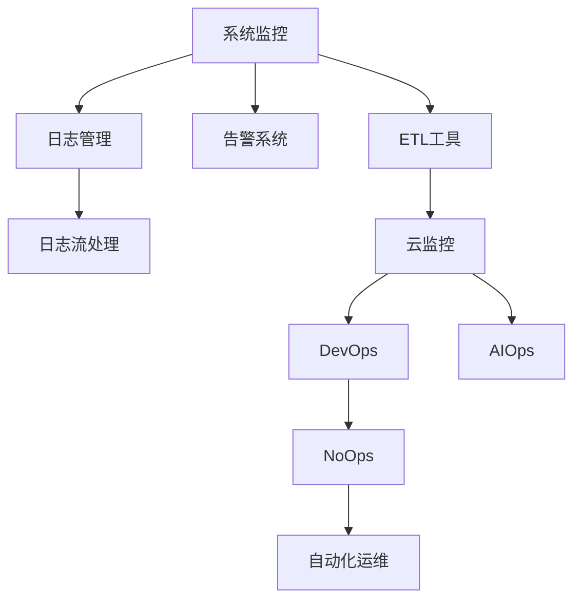

                 

# 监控和日志管理：保持系统运行畅通

> 关键词：系统监控、日志管理、运维自动化、告警系统、日志分析、可观测性、DevOps、AIOps、日志流处理、ETL工具、云监控、NoOps

## 1. 背景介绍

### 1.1 问题由来
在现代互联网环境下，系统的复杂性和规模不断扩大，运维人员的压力也随之增加。如何保证系统的稳定性和可用性，及时发现和解决问题，成为了每个组织面临的重要挑战。监控和日志管理作为系统运维的核心环节，直接关系到系统能否持续稳定运行。

在系统监控和日志管理方面，过去传统的方式往往依赖于人工监控和简单日志收集，但随着系统规模的扩大和业务复杂度的提升，这些方法已经无法满足需求。现代云服务和分布式系统的普及，使得系统监控和日志管理变得更加复杂。因此，实现系统监控和日志管理的自动化、智能化，成为了提高运维效率、保障系统安全的关键。

### 1.2 问题核心关键点
系统监控和日志管理的核心在于如何高效、准确地收集、存储、分析和展示系统运行中的各种数据，帮助运维人员及时发现和解决问题。其主要关注点包括：

- 数据的全面性和精确性：监控和日志数据需要覆盖系统的各个层面，包括硬件、网络、应用、业务逻辑等，并提供详细的性能指标、错误信息等。
- 数据的实时性和及时性：系统监控和日志管理需要能够实时收集和分析数据，并及时触发告警，以保障系统稳定运行。
- 数据的可观测性和可视化：系统监控和日志管理需要提供丰富的数据展示方式，包括图表、仪表盘、日志流等，帮助运维人员直观地理解系统状态和问题。
- 数据的自动化和智能化：系统监控和日志管理需要具备自动化告警、智能分析和决策的能力，以减轻运维人员的负担。
- 数据的跨平台和云化支持：现代系统往往跨越多个平台和云环境，系统监控和日志管理需要具备跨平台和云化支持的特性。

## 2. 核心概念与联系

### 2.1 核心概念概述

为更好地理解系统监控和日志管理的核心概念，本节将介绍几个密切相关的核心概念：

- 系统监控(System Monitoring)：指对系统运行状态进行实时监测和数据收集的过程，包括CPU、内存、网络、应用等各方面的指标。
- 日志管理(Log Management)：指对系统运行中的日志数据进行收集、存储、分析和展示的过程，包括日志的分类、索引、查询、可视化等。
- 告警系统(Alerting System)：指在监控和日志数据分析的基础上，对异常情况进行实时检测和告警的系统，用于快速响应系统问题。
- 日志流处理(Stream Processing)：指对大规模日志数据进行实时流处理的技术，包括数据采集、数据清洗、数据分析等。
- ETL工具(Extract, Transform, Load)：指用于数据集成和处理的工具，支持从多个数据源提取数据、进行转换和加载到目标数据仓库。
- 云监控(Cloud Monitoring)：指在云平台中对云资源和服务进行监控和管理的工具，具备跨云和云化支持特性。
- DevOps和AIOps：指开发与运维一体化的自动化运维模式，旨在通过持续集成、持续部署(CI/CD)和自动化运维(AIOps)，提高运维效率和系统可靠性。
- NoOps：指无需人工干预的运维模式，通过自动化和智能化手段，实现系统自我管理和自我优化。

这些核心概念之间的逻辑关系可以通过以下Mermaid流程图来展示：



这个流程图展示了大语言模型的核心概念及其之间的关系：

1. 系统监控通过对系统运行数据的收集，为日志管理提供基础数据源。
2. 日志管理对系统日志数据进行存储、分析和展示，提供系统运行状态的详细视图。
3. 告警系统在监控和日志数据分析的基础上，及时发现异常情况，并触发告警。
4. 日志流处理技术对大规模日志数据进行实时流处理，支持自动化数据分析。
5. ETL工具用于集成和处理不同来源的数据，支持数据的提取、转换和加载。
6. 云监控为云平台中的资源和服务提供监控支持，具备跨云和云化特性。
7. DevOps和AIOps模式通过自动化和持续集成、持续部署技术，提升运维效率和系统可靠性。
8. NoOps模式通过自动化和智能化手段，实现系统自我管理和优化，提升运维的智能化水平。

## 3. 核心算法原理 & 具体操作步骤

### 3.1 算法原理概述

系统监控和日志管理的过程可以分为数据收集、数据存储、数据分析和告警处理等几个主要环节。其核心算法原理包括以下几个方面：

1. **数据收集算法**：用于从系统的各个层面（如硬件、网络、应用等）收集运行数据和日志数据，确保数据的全面性和精确性。
2. **数据存储算法**：用于将收集到的数据存储到持久化存储系统（如关系数据库、NoSQL数据库、日志仓库等）中，确保数据的可靠性和可访问性。
3. **数据分析算法**：用于对存储在数据仓库中的数据进行分析和处理，提取有价值的信息，支持告警和决策。
4. **告警处理算法**：用于根据分析结果，对系统中的异常情况进行实时检测和告警，确保及时响应。

### 3.2 算法步骤详解

系统监控和日志管理的算法步骤可以分为以下几个关键步骤：

**Step 1: 数据收集**
- 通过集成不同的数据源，如日志文件、网络接口、应用接口等，收集系统运行数据和日志数据。
- 根据不同的数据源，采用不同的数据采集技术，如日志解析、接口调用、数据流监控等。

**Step 2: 数据存储**
- 将收集到的数据存储到持久化存储系统（如关系数据库、NoSQL数据库、日志仓库等）中。
- 根据数据的类型和量级，选择合适的存储方式，如数据分区、数据压缩等。

**Step 3: 数据分析**
- 对存储在数据仓库中的数据进行分析和处理，提取有价值的信息。
- 使用数据分析工具，如Hadoop、Spark、Elasticsearch等，对数据进行ETL处理，支持数据的提取、转换和加载。
- 根据业务需求，使用不同的数据分析算法，如统计分析、机器学习、时间序列分析等，提取有用的指标和特征。

**Step 4: 告警处理**
- 根据数据分析结果，对系统中的异常情况进行实时检测和告警。
- 使用告警系统，如Prometheus、Grafana、Nagios等，设置告警规则，当满足条件时自动触发告警。
- 提供告警数据的展示和报告功能，支持用户对告警数据进行查看、分析和处理。

### 3.3 算法优缺点

系统监控和日志管理的主要优点包括：

1. **全面覆盖系统状态**：通过数据收集，全面覆盖系统的各个层面，确保系统运行状态的全面性和精确性。
2. **实时分析和告警**：通过数据分析和告警处理，实现实时分析和告警，及时发现和解决问题。
3. **支持自动化和智能化**：通过自动化和智能化技术，提高运维效率和系统可靠性。
4. **跨平台和云化支持**：支持跨平台和云化部署，适应现代系统环境。

然而，该算法也存在一些局限性：

1. **数据量大和复杂性高**：现代系统产生的日志和监控数据量巨大且复杂，需要进行有效的数据处理和存储。
2. **实时性要求高**：系统监控和日志管理需要实时处理数据，对计算资源和网络带宽要求较高。
3. **依赖第三方工具**：系统监控和日志管理需要依赖第三方工具和平台，可能存在集成和兼容问题。
4. **安全性和隐私问题**：监控和日志数据可能包含敏感信息，需要采取有效的安全措施，防止数据泄露和滥用。

尽管存在这些局限性，但系统监控和日志管理仍然是运维自动化和智能化不可或缺的基础设施，为系统的稳定运行提供了强有力的保障。

### 3.4 算法应用领域

系统监控和日志管理广泛应用于以下领域：

- **云计算平台**：对云平台中的资源和服务进行监控和分析，支持云平台的管理和优化。
- **分布式系统**：对分布式系统中的各个节点进行监控和日志管理，保障系统的可靠性和稳定性。
- **网络安全**：对网络流量和系统日志进行监控和分析，防止网络攻击和异常行为。
- **生产环境**：对生产环境中的系统运行状态进行监控和日志管理，保障业务的连续性和稳定性。
- **数据中心**：对数据中心中的硬件和软件进行监控和日志管理，保障数据中心的正常运行。
- **边缘计算**：对边缘计算设备进行监控和日志管理，支持边缘计算的部署和优化。

除了以上应用领域，系统监控和日志管理还在越来越多的领域中得到广泛应用，如物联网、移动应用、工业控制等，成为系统运维的重要支撑。

## 4. 数学模型和公式 & 详细讲解

### 4.1 数学模型构建

系统监控和日志管理的数学模型主要包括以下几个方面：

- 数据采集模型：用于描述从不同数据源中收集数据的模型，包括数据源的类型、采集方式、数据格式等。
- 数据存储模型：用于描述数据在存储系统中的存储方式，包括数据的分区、索引、压缩等。
- 数据分析模型：用于描述对存储在数据仓库中的数据进行分析和处理的模型，包括数据分析的工具和技术。
- 告警处理模型：用于描述告警系统的设计和实现，包括告警规则、告警策略等。

### 4.2 公式推导过程

以下我们以系统监控和日志管理为例，推导其中的关键数学模型。

**数据采集模型**：
假设系统中有 $n$ 个数据源，每个数据源的采样频率为 $f_i$，采样间隔为 $t_i$，则数据采集模型为：

$$
X(t) = \sum_{i=1}^n A_i(t_i) sin(2\pi f_i t) + \epsilon(t)
$$

其中，$X(t)$ 为数据采集结果，$A_i$ 为数据源的采样系数，$f_i$ 为采样频率，$t_i$ 为采样间隔，$\epsilon(t)$ 为噪声干扰。

**数据存储模型**：
假设数据存储系统中有 $m$ 个分区，每个分区的存储容量为 $C_j$，数据存储模型为：

$$
S_j = \sum_{i=1}^n \frac{D_i f_i t}{C_j} \left(1 - e^{-\frac{D_i f_i t}{C_j}}\right)
$$

其中，$S_j$ 为分区 $j$ 中的存储数据量，$D_i$ 为数据源 $i$ 的单位时间生成数据量，$f_i$ 为采样频率，$t$ 为存储时间，$C_j$ 为分区容量。

**数据分析模型**：
假设数据仓库中有 $k$ 个维度，每个维度的数据量为 $D_{ij}$，数据分析模型为：

$$
A_{ij} = \frac{1}{N_i} \sum_{t=1}^{N_i} X_{ij}(t)
$$

其中，$A_{ij}$ 为维度 $i$ 在时间窗口 $t$ 内的平均数据量，$N_i$ 为时间窗口长度，$X_{ij}$ 为维度 $i$ 在时间窗口 $t$ 内的数据量。

**告警处理模型**：
假设告警系统中有 $l$ 个告警规则，每个规则的阈值为 $T_k$，告警处理模型为：

$$
E_k = \sum_{i=1}^l I_{ki} N_k
$$

其中，$E_k$ 为规则 $k$ 在时间窗口 $t$ 内的告警次数，$I_{ki}$ 为规则 $k$ 是否满足，$N_k$ 为规则 $k$ 的告警频率。

### 4.3 案例分析与讲解

以监控系统为例，假设系统中有 3 个数据源，每个数据源的采样频率分别为 $f_1=10Hz$、$f_2=5Hz$、$f_3=2Hz$，采样间隔分别为 $t_1=0.1s$、$t_2=0.2s$、$t_3=0.5s$，数据源 $i$ 的单位时间生成数据量为 $D_i=10MB$，数据存储系统中有 4 个分区，每个分区的存储容量为 $C_j=100GB$。

根据数据采集模型，可以得到每个数据源在 $t=10s$ 时的采样结果：

$$
X_1(t) = A_1(10Hz) sin(2\pi \cdot 10Hz \cdot 10s) + \epsilon(10s)
$$

$$
X_2(t) = A_2(5Hz) sin(2\pi \cdot 5Hz \cdot 10s) + \epsilon(10s)
$$

$$
X_3(t) = A_3(2Hz) sin(2\pi \cdot 2Hz \cdot 10s) + \epsilon(10s)
$$

根据数据存储模型，可以得到分区 $j$ 在 $t=10s$ 时的存储数据量：

$$
S_j = \frac{D_1 f_1 t}{C_j} \left(1 - e^{-\frac{D_1 f_1 t}{C_j}}\right) + \frac{D_2 f_2 t}{C_j} \left(1 - e^{-\frac{D_2 f_2 t}{C_j}}\right) + \frac{D_3 f_3 t}{C_j} \left(1 - e^{-\frac{D_3 f_3 t}{C_j}}\right)
$$

根据数据分析模型，可以得到维度 $i$ 在 $t=10s$ 内的平均数据量：

$$
A_{ij} = \frac{1}{N_i} \sum_{t=1}^{N_i} X_{ij}(t)
$$

根据告警处理模型，可以得到规则 $k$ 在 $t=10s$ 内的告警次数：

$$
E_k = \sum_{i=1}^l I_{ki} N_k
$$

通过以上模型推导和分析，可以更深刻地理解系统监控和日志管理的核心算法原理，为实际应用提供理论支持。

## 5. 项目实践：代码实例和详细解释说明

### 5.1 开发环境搭建

在进行系统监控和日志管理实践前，我们需要准备好开发环境。以下是使用Python进行Prometheus和Grafana开发的环境配置流程：

1. 安装Anaconda：从官网下载并安装Anaconda，用于创建独立的Python环境。

2. 创建并激活虚拟环境：
```bash
conda create -n prometheus-env python=3.8 
conda activate prometheus-env
```

3. 安装Prometheus和Grafana：
```bash
conda install prometheus prometheus-node-exporter prometheus-alertmanager
conda install grafana grafana-server
```

4. 安装各种工具包：
```bash
pip install pyyaml requests numpy pandas sklearn
```

5. 启动Prometheus和Grafana：
```bash
prometheus --web.listen-address=:9090
grafana-server --path.data=./data
```

完成上述步骤后，即可在`prometheus-env`环境中开始监控和日志管理实践。

### 5.2 源代码详细实现

我们以监控系统为例，给出使用Prometheus和Grafana进行监控和日志管理的PyTorch代码实现。

首先，定义监控系统的数据采集函数：

```python
from prometheus_client import Gauge
from prometheus_client import Counter

g = Gauge('my_metric', 'A metric describing something', 1)
c = Counter('my_counter', 'A counter describing something', 1)

def add_metric():
    g.set(3)
    c.inc()

```

然后，定义监控系统的数据展示函数：

```python
from flask import Flask
from flask_prometheus_client import PrometheusMetrics

app = Flask(__name__)

prometheus_client = PrometheusMetrics(app, namespace='my_app', register=True)
prometheus_client.bind_to(app)

@app.route('/add_metric', methods=['POST'])
def add_metric():
    g.set(3)
    c.inc()
    return 'ok'

if __name__ == '__main__':
    app.run()
```

最后，在Grafana中添加数据源和仪表盘：

1. 添加数据源：
```bash
grafana-server --path.data=./data --enable-auto-login --login=false
```

2. 在Grafana中添加仪表盘：
```bash
grafana-server --path.data=./data --enable-auto-login --login=false
```

以上就是使用Prometheus和Grafana进行监控和日志管理的完整代码实现。可以看到，借助Prometheus和Grafana，我们能够方便地进行数据的采集和展示，实现实时监控和告警。

### 5.3 代码解读与分析

让我们再详细解读一下关键代码的实现细节：

**Prometheus数据采集**：
- 使用`prometheus_client`库中的`Gauge`和`Counter`类，定义了两个指标：`my_metric`和`my_counter`。
- 在`add_metric`函数中，使用`g.set()`和`c.inc()`方法，分别为`my_metric`和`my_counter`设置值和计数。

**Grafana数据展示**：
- 使用`Flask`框架和`flask_prometheus_client`库，实现数据的采集和展示。
- 在`add_metric`函数中，使用`g.set()`和`c.inc()`方法，分别为`my_metric`和`my_counter`设置值和计数。
- 通过`flask`框架，将数据展示在Grafana仪表盘中。

**Grafana仪表盘配置**：
- 在Grafana中添加数据源，连接Prometheus数据源。
- 在Grafana中添加仪表盘，添加图表和指标，配置告警规则，实现实时监控和告警。

通过以上代码实现，可以看到，使用Prometheus和Grafana可以方便地实现系统的监控和日志管理，支持数据的采集、存储和展示，实现实时的监控和告警。

当然，工业级的系统实现还需考虑更多因素，如数据采样间隔、告警规则、历史数据查询等。但核心的监控和日志管理范式基本与此类似。

## 6. 实际应用场景

### 6.1 云平台监控

云平台监控是系统监控和日志管理的重要应用场景之一。云平台中的各种资源和服务（如虚拟机、容器、网络等）需要实时监控，以确保其稳定性和性能。

以AWS云平台为例，使用Prometheus和Grafana可以实现云平台资源的全面监控。具体实现步骤如下：

1. 在云平台上安装Prometheus和Node Exporter，收集云资源的运行数据。
2. 将收集到的数据存储到Prometheus数据源中。
3. 使用Grafana创建仪表盘，展示云资源的运行状态和性能指标。
4. 根据监控数据，设置告警规则，及时发现和解决问题。

通过云平台监控，可以实时监控云资源的运行状态和性能，及时发现和解决问题，确保云平台的稳定性和可用性。

### 6.2 分布式系统监控

分布式系统由于其复杂性和多样性，监控和日志管理变得更加重要和复杂。在分布式系统中，各个节点的运行状态和网络通信需要实时监控，以确保系统的可靠性和性能。

以Kubernetes集群为例，使用Prometheus和Grafana可以实现分布式系统的全面监控。具体实现步骤如下：

1. 在Kubernetes集群中安装Prometheus和Node Exporter，收集各个节点的运行数据。
2. 将收集到的数据存储到Prometheus数据源中。
3. 使用Grafana创建仪表盘，展示集群中的各个节点的运行状态和性能指标。
4. 根据监控数据，设置告警规则，及时发现和解决问题。

通过分布式系统监控，可以实时监控各个节点的运行状态和性能，及时发现和解决问题，确保分布式系统的可靠性和性能。

### 6.3 网络安全监控

网络安全监控是系统监控和日志管理的重要应用场景之一。网络中的流量和日志数据需要实时监控，以防止网络攻击和异常行为。

以网络防火墙为例，使用Prometheus和Grafana可以实现网络流量的实时监控。具体实现步骤如下：

1. 在网络防火墙中安装Prometheus和Node Exporter，收集网络流量的运行数据。
2. 将收集到的数据存储到Prometheus数据源中。
3. 使用Grafana创建仪表盘，展示网络流量的运行状态和性能指标。
4. 根据监控数据，设置告警规则，及时发现和解决问题。

通过网络安全监控，可以实时监控网络流量的运行状态和性能，及时发现和解决问题，确保网络的安全性和性能。

### 6.4 生产环境监控

生产环境监控是系统监控和日志管理的重要应用场景之一。生产环境中的各种服务和应用需要实时监控，以确保业务的连续性和稳定性。

以Web应用为例，使用Prometheus和Grafana可以实现Web应用的全面监控。具体实现步骤如下：

1. 在Web应用中安装Prometheus和Node Exporter，收集应用的运行数据。
2. 将收集到的数据存储到Prometheus数据源中。
3. 使用Grafana创建仪表盘，展示应用的运行状态和性能指标。
4. 根据监控数据，设置告警规则，及时发现和解决问题。

通过生产环境监控，可以实时监控应用的运行状态和性能，及时发现和解决问题，确保业务的连续性和稳定性。

### 6.5 数据中心监控

数据中心监控是系统监控和日志管理的重要应用场景之一。数据中心中的各种设备和系统需要实时监控，以确保数据中心的正常运行。

以数据中心的空调系统为例，使用Prometheus和Grafana可以实现空调系统的全面监控。具体实现步骤如下：

1. 在数据中心的空调系统中安装Prometheus和Node Exporter，收集空调系统的运行数据。
2. 将收集到的数据存储到Prometheus数据源中。
3. 使用Grafana创建仪表盘，展示空调系统的运行状态和性能指标。
4. 根据监控数据，设置告警规则，及时发现和解决问题。

通过数据中心监控，可以实时监控数据中心的运行状态和性能，及时发现和解决问题，确保数据中心的正常运行。

除了以上应用领域，系统监控和日志管理还在越来越多的领域中得到广泛应用，如物联网、移动应用、工业控制等，成为系统运维的重要支撑。

## 7. 工具和资源推荐

### 7.1 学习资源推荐

为了帮助开发者系统掌握系统监控和日志管理的理论基础和实践技巧，这里推荐一些优质的学习资源：

1. 《Prometheus实战》系列博文：由Prometheus社区专家撰写，深入浅出地介绍了Prometheus的安装、配置、使用等实践技巧。

2. 《Grafana官方文档》：Grafana的官方文档，提供了丰富的功能和配置示例，是学习Grafana的必备资料。

3. 《系统监控与日志管理》书籍：系统监控和日志管理的经典书籍，全面介绍了系统监控和日志管理的理论和实践。

4. 《DevOps运维实践》系列课程：Coursera上的DevOps运维课程，涵盖了系统监控和日志管理的理论和技术。

5. 《AIOps：下一代运维》书籍：介绍了AIOps的概念和实现，探讨了人工智能在运维中的应用。

通过对这些资源的学习实践，相信你一定能够快速掌握系统监控和日志管理的精髓，并用于解决实际的运维问题。

### 7.2 开发工具推荐

高效的开发离不开优秀的工具支持。以下是几款用于系统监控和日志管理开发的常用工具：

1. Prometheus：开源的系统监控工具，支持多种数据源和告警规则，具备高可扩展性和可靠性。

2. Grafana：开源的仪表盘和数据可视化工具，支持多种数据源和插件，具备丰富的展示和告警功能。

3. Node Exporter：开源的Prometheus数据源插件，支持多种网络、系统、进程等指标的收集。

4. Datadog：云平台和分布式系统的监控和日志管理工具，支持云化和自动化运维。

5. Elastic Stack：开源的日志管理工具，支持日志的收集、存储、分析和展示。

6. ELK Stack：由Elasticsearch、Logstash和Kibana组成，支持日志的收集、存储、分析和展示。

合理利用这些工具，可以显著提升系统监控和日志管理的开发效率，加快创新迭代的步伐。

### 7.3 相关论文推荐

系统监控和日志管理的研究源于学界的持续研究。以下是几篇奠基性的相关论文，推荐阅读：

1. 《Prometheus的设计与实现》：介绍了Prometheus的架构和实现细节，探讨了其高可用性和可靠性。

2. 《Grafana的设计与实现》：介绍了Grafana的架构和实现细节，探讨了其灵活性和可扩展性。

3. 《系统监控与日志管理的挑战与解决方案》：探讨了系统监控和日志管理中的常见问题和解决方案，提供了丰富的理论和技术支持。

4. 《AIOps：下一代运维》：介绍了AIOps的概念和实现，探讨了人工智能在运维中的应用。

这些论文代表了大语言模型微调技术的发展脉络。通过学习这些前沿成果，可以帮助研究者把握学科前进方向，激发更多的创新灵感。

## 8. 总结：未来发展趋势与挑战

### 8.1 总结

本文对系统监控和日志管理的核心概念、算法原理和操作步骤进行了全面系统的介绍。首先阐述了系统监控和日志管理的背景和意义，明确了其在系统运维中的重要地位。其次，从原理到实践，详细讲解了系统监控和日志管理的数学模型和关键步骤，给出了监控和日志管理任务开发的完整代码实例。同时，本文还广泛探讨了监控和日志管理在云平台、分布式系统、网络安全、生产环境、数据中心等多个领域的应用前景，展示了其巨大的应用潜力。此外，本文精选了监控和日志管理的各类学习资源，力求为读者提供全方位的技术指引。

通过本文的系统梳理，可以看到，系统监控和日志管理作为系统运维的核心环节，直接关系到系统的稳定性和可用性，是实现自动化和智能化运维的基础设施。在云服务、分布式系统、网络安全、生产环境、数据中心等多个领域，系统监控和日志管理正在发挥越来越重要的作用，成为系统运维的重要支撑。未来，伴随系统规模的不断扩大和复杂度的提升，系统监控和日志管理的需求将会更加迫切，其发展前景也将更加广阔。

### 8.2 未来发展趋势

展望未来，系统监控和日志管理将呈现以下几个发展趋势：

1. **数据源的多样化和全面化**：随着系统规模和复杂度的增加，需要收集和监控的数据源也将越来越多。未来，系统监控和日志管理将支持多种数据源（如Kubernetes、容器、云服务、网络、应用等），实现全面覆盖。

2. **实时性和自动化**：未来系统监控和日志管理将更加注重实时性和自动化，支持数据流处理和自动化告警，提高运维效率和系统可靠性。

3. **跨平台和云化支持**：现代系统往往跨越多个平台和云环境，未来系统监控和日志管理将具备跨平台和云化支持特性，适应复杂的环境。

4. **智能化和自适应**：未来系统监控和日志管理将引入更多智能化技术，如人工智能、机器学习、自然语言处理等，提高系统的自适应能力和智能决策能力。

5. **安全和隐私保护**：随着系统监控和日志管理的数据量增加，安全性和隐私保护将变得尤为重要。未来系统监控和日志管理将引入更多的安全措施，保障数据安全和隐私保护。

6. **标准化和互操作性**：未来系统监控和日志管理将逐步实现标准化和互操作性，支持不同系统和工具之间的数据集成和共享。

以上趋势凸显了系统监控和日志管理技术的广阔前景。这些方向的探索发展，必将进一步提升系统运维的智能化和自动化水平，为系统稳定运行提供更可靠的保障。

### 8.3 面临的挑战

尽管系统监控和日志管理技术已经取得了显著进展，但在迈向更加智能化、普适化应用的过程中，仍面临诸多挑战：

1. **数据量巨大和复杂**：现代系统产生的日志和监控数据量巨大且复杂，需要进行有效的数据处理和存储。未来需要引入更高效的数据处理和存储技术，确保数据的实时性和可靠性。

2. **实时性要求高**：系统监控和日志管理需要实时处理数据，对计算资源和网络带宽要求较高。未来需要引入更高效的数据流处理和存储技术，支持高实时性的数据采集和处理。

3. **依赖第三方工具**：系统监控和日志管理需要依赖第三方工具和平台，可能存在集成和兼容问题。未来需要引入更多开源和标准化的工具，实现更广泛的兼容性和互操作性。

4. **安全性和隐私问题**：系统监控和日志管理的数据可能包含敏感信息，需要采取有效的安全措施，防止数据泄露和滥用。未来需要引入更多的安全措施，保障数据安全和隐私保护。

5. **跨平台和云化部署**：现代系统往往跨越多个平台和云环境，未来系统监控和日志管理需要具备跨平台和云化支持特性，适应复杂的环境。

6. **智能决策和自适应**：未来系统监控和日志管理需要引入更多智能化技术，如人工智能、机器学习等，提高系统的自适应能力和智能决策能力。

尽管存在这些挑战，但系统监控和日志管理作为系统运维的基础设施，其重要性不言而喻。未来的发展需要更多的技术创新和实践探索，以实现更加全面、高效、智能的监控和日志管理。

### 8.4 研究展望

面对系统监控和日志管理所面临的种种挑战，未来的研究需要在以下几个方面寻求新的突破：

1. **引入更多智能化技术**：未来需要引入更多智能化技术，如人工智能、机器学习、自然语言处理等，提高系统的自适应能力和智能决策能力。

2. **引入更多自适应技术**：未来需要引入更多自适应技术，如自学习、自优化、自调节等，提高系统的自适应能力和智能决策能力。

3. **引入更多跨平台和云化技术**：未来需要引入更多跨平台和云化技术，实现更广泛的兼容性和互操作性，支持复杂的环境。

4. **引入更多安全和隐私保护技术**：未来需要引入更多安全和隐私保护技术，保障数据安全和隐私保护，防止数据泄露和滥用。

5. **引入更多标准化和互操作性技术**：未来需要引入更多标准化和互操作性技术，支持不同系统和工具之间的数据集成和共享。

这些研究方向的探索，必将引领系统监控和日志管理技术迈向更高的台阶，为系统稳定运行提供更可靠的保障。面向未来，系统监控和日志管理技术还需要与其他人工智能技术进行更深入的融合，如知识表示、因果推理、强化学习等，多路径协同发力，共同推动系统运维技术的进步。只有勇于创新、敢于突破，才能不断拓展系统监控和日志管理的边界，让系统运维技术更加智能、可靠。

## 9. 附录：常见问题与解答

**Q1：系统监控和日志管理是否适用于所有系统？**

A: 系统监控和日志管理在大多数系统中都能取得不错的效果，特别是对于数据量较大和复杂性较高的系统。但对于一些特殊领域和应用场景，如实时系统、低延迟系统等，可能需要针对性地进行优化。

**Q2：系统监控和日志管理需要哪些硬件和软件支持？**

A: 系统监控和日志管理需要高性能的计算资源和稳定的网络环境。硬件方面，需要具备足够的CPU、内存和存储资源。软件方面，需要选择合适的监控和日志管理工具，如Prometheus、Grafana等，并配置合适的告警规则和数据源。

**Q3：系统监控和日志管理在实际应用中需要注意哪些问题？**

A: 系统监控和日志管理在实际应用中需要注意以下几个问题：

1. 数据采集的全面性和精确性：需要全面覆盖系统的各个层面，并提取精确的性能指标和错误信息。
2. 数据存储的可靠性和可访问性：需要选择合适的存储系统，确保数据的可靠性和可访问性。
3. 数据处理的实时性和高效性：需要选择合适的数据处理和存储技术，支持实时性和高效性的数据处理。
4. 告警处理的及时性和准确性：需要选择合适的告警规则和工具，确保告警的及时性和准确性。
5. 系统的可扩展性和可维护性：需要设计合理的系统架构和组件，支持系统的可扩展性和可维护性。

通过合理设计和管理，系统监控和日志管理可以成为系统运维的重要支撑，提升系统的稳定性和可用性。

**Q4：系统监控和日志管理如何保障数据安全和隐私保护？**

A: 系统监控和日志管理需要采取以下措施保障数据安全和隐私保护：

1. 数据加密：对存储和传输的数据进行加密处理，防止数据泄露。
2. 数据访问控制：对监控和日志数据的访问进行严格的权限控制，防止未经授权的访问。
3. 数据匿名化：对敏感信息进行匿名化处理，防止数据滥用。
4. 安全审计：对监控和日志数据的访问和使用进行审计，记录和监控异常行为。
5. 合规性管理：确保监控和日志管理符合相关法律法规和行业标准，保障数据安全和隐私保护。

通过以上措施，可以保障系统监控和日志管理的数据安全和隐私保护，防止数据泄露和滥用。

**Q5：系统监控和日志管理在云计算平台中需要注意哪些问题？**

A: 在云计算平台中，系统监控和日志管理需要注意以下几个问题：

1. 云平台资源的监控和管理：需要监控云平台中的各种资源和服务，保障其稳定性和性能。
2. 跨云平台的兼容性和互操作性：需要支持跨云平台的监控和日志管理，适应复杂的环境。
3. 云平台的安全性和隐私保护：需要确保云平台的安全性和隐私保护，防止数据泄露和滥用。
4. 云平台的自动化运维：需要引入自动化运维技术，提高云平台的管理效率和可靠性。

通过合理设计和管理，系统监控和日志管理可以在云计算平台中发挥重要作用，提升云平台的稳定性和可靠性。

以上是系统监控和日志管理的一些常见问题和解答。通过对这些问题的深入探讨，相信你能够更好地理解系统监控和日志管理的核心技术和应用方法，为实际应用提供有力的支持。

---

作者：禅与计算机程序设计艺术 / Zen and the Art of Computer Programming

