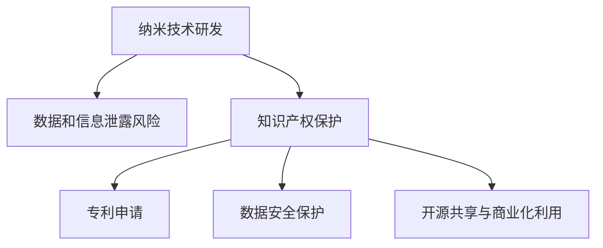

                 

# 知识产权与纳米技术的保护挑战

## 1. 背景介绍

### 1.1 问题由来
随着纳米技术的快速发展，越来越多的创新成果涌现。然而，如何保护这些创新成果不被侵犯，成为一个亟待解决的问题。纳米技术涉及多种跨学科领域，包括化学、物理、工程等，其复杂性、多样性和新颖性使得传统的知识产权保护方式面临诸多挑战。

### 1.2 问题核心关键点
本节将重点介绍以下几个核心关键点：

1. **纳米技术的特性**：包括尺度小、功能强、应用广泛等特点，这些特性使其在知识产权保护上具有独特的挑战。
2. **现有知识产权法律体系的局限性**：现有法律体系如专利法、版权法、商标法等，在适用性、覆盖范围、审查效率等方面存在不足，无法完全适应纳米技术的复杂性。
3. **数据和信息泄露风险**：纳米技术研发过程中涉及大量敏感数据和研究信息，存在数据泄露和商业间谍行为的风险。
4. **专利申请的复杂性和成本**：纳米技术的专利申请需要跨多个学科领域的知识，申请过程复杂，成本高昂。
5. **开源共享与商业化利用**：纳米技术的开源共享与商业化利用之间的平衡，需要合理界定创新成果的知识产权归属和使用范围。

## 2. 核心概念与联系

### 2.1 核心概念概述

纳米技术是指在纳米尺度（1-100纳米）进行的材料、分子和设备的研究与制造。其核心在于利用纳米尺度下的物理、化学和生物特性，实现对物质和能量的精细控制。

知识产权（Intellectual Property, IP）是指创作者对其智力劳动成果所享有的专有权利，包括专利权、商标权、版权等。

数据和信息泄露风险指的是在纳米技术研发和应用过程中，敏感数据和研究信息可能被非法获取、使用或披露，对企业的技术优势和市场竞争力造成威胁。

### 2.2 核心概念原理和架构的 Mermaid 流程图(Mermaid 流程节点中不要有括号、逗号等特殊字符)



## 3. 核心算法原理 & 具体操作步骤

### 3.1 算法原理概述

纳米技术的知识产权保护算法原理，主要涉及以下几个方面：

1. **纳米技术特征提取与数据表示**：从纳米技术产品的材料组成、结构设计、功能实现等多个维度提取特征，转化为算法可以处理的数据形式。
2. **数据安全与隐私保护**：采用数据加密、匿名化、访问控制等技术，确保数据在传输、存储和使用过程中的安全性。
3. **知识产权的算法认定**：通过机器学习、深度学习等算法，自动判断纳米技术的创新性和独特性，是否符合专利、商标等知识产权的保护标准。
4. **算法化的专利申请与审核**：将纳米技术产品的设计、制造过程、效果等，转化为算法可以处理的文档和数据，通过算法自动生成专利申请书，提交给专利局审核。
5. **知识产权交易与许可**：利用区块链、智能合约等技术，实现纳米技术知识产权的交易和许可，确保各方权益得到公平合理的保护。

### 3.2 算法步骤详解

纳米技术的知识产权保护算法步骤包括：

1. **特征提取**：从纳米技术产品的各个方面提取特征，生成特征向量。
2. **数据加密与匿名化**：对提取的特征向量进行加密和匿名化处理，确保数据隐私。
3. **算法认定与审核**：使用机器学习模型对特征向量进行分析，判断是否具有创新性和独特性。
4. **算法生成专利文档**：将分析结果转化为文本形式的专利申请书，通过算法自动生成。
5. **数据安全保护与审核**：确保专利申请书在提交和审核过程中的数据安全，防止泄露和篡改。
6. **知识产权交易与许可**：利用智能合约等技术，实现知识产权的交易和许可，确保各方权益。

### 3.3 算法优缺点

纳米技术的知识产权保护算法的优点包括：

1. **效率高**：利用算法自动化处理数据和文档生成，显著提高知识产权保护和申请的效率。
2. **准确性好**：机器学习模型能够准确判断纳米技术的创新性和独特性，减少人工审核的误差。
3. **数据安全**：采用加密和匿名化技术，确保数据在处理过程中的安全性。

缺点包括：

1. **算法复杂性**：算法需要处理大量多维数据，模型构建和优化较为复杂。
2. **数据隐私问题**：数据加密和匿名化技术无法完全避免数据泄露的风险。
3. **知识产权的算法认定标准**：算法认定的标准和方法需要不断完善，以确保知识产权保护的有效性和公正性。

### 3.4 算法应用领域

纳米技术的知识产权保护算法适用于多个领域，包括：

1. **纳米材料与设备**：对纳米材料和设备的设计、制造过程进行保护。
2. **纳米医学**：对纳米药物、诊断工具等进行知识产权保护。
3. **纳米能源**：对纳米能源技术进行专利申请和保护。
4. **纳米制造**：对纳米制造工艺进行知识产权保护。
5. **纳米生物技术**：对纳米生物工程、生物传感器等进行专利申请和保护。

## 4. 数学模型和公式 & 详细讲解 & 举例说明

### 4.1 数学模型构建

纳米技术的知识产权保护算法涉及多个数学模型，主要包括以下几个：

1. **特征提取与表示**：
   - **PCA**（主成分分析）：用于降维和特征提取，将高维特征向量转化为低维向量。
   - **Autoencoder**（自编码器）：用于特征表示和数据压缩，保留关键特征。
2. **数据加密与匿名化**：
   - **AES**（高级加密标准）：用于数据加密，确保数据传输过程中的安全性。
   - **K-Anonymity**：用于数据匿名化，防止数据泄露。
3. **知识产权的算法认定**：
   - **机器学习模型**：如SVM（支持向量机）、KNN（K近邻算法）、神经网络等，用于特征分析与模式识别。
4. **算法化的专利申请与审核**：
   - **NLP**（自然语言处理）：用于文本生成和处理，自动生成专利申请书。
   - **知识图谱**：用于知识表示和推理，帮助审核专利申请的合法性。
5. **知识产权交易与许可**：
   - **智能合约**：用于自动执行交易协议，确保交易公平性。

### 4.2 公式推导过程

以下以PCA模型的推导过程为例：

设原始特征向量为 $\mathbf{x} = [x_1, x_2, ..., x_n]^T$，协方差矩阵为 $\mathbf{S}$，则PCA的目标是找到一组基向量 $\mathbf{W} = [w_1, w_2, ..., w_n]^T$，使得变换后的数据 $\mathbf{y} = \mathbf{W}^T\mathbf{x}$ 的协方差矩阵对角化，即 $\mathbf{S}_{\mathbf{y}} = \mathbf{D} = \mathbf{W}^T\mathbf{S}\mathbf{W}$，其中 $\mathbf{D}$ 为对角矩阵，对角线上的元素为特征值。

令 $\mathbf{U} = \mathbf{W}^T\mathbf{S}\mathbf{W}$，则有：

$$
\mathbf{U} = \frac{1}{N}\sum_{i=1}^{N}(\mathbf{x}_i - \mathbf{\mu})(\mathbf{x}_i - \mathbf{\mu})^T
$$

其中 $\mathbf{\mu} = \frac{1}{N}\sum_{i=1}^{N}\mathbf{x}_i$ 为特征向量的均值。

令 $\mathbf{V} = \mathbf{U}\mathbf{D}^{-\frac{1}{2}}$，则有：

$$
\mathbf{y} = \mathbf{V}\mathbf{D}^{-\frac{1}{2}}\mathbf{x}
$$

其中 $\mathbf{D}^{-\frac{1}{2}}$ 为对角矩阵 $\mathbf{D}$ 的逆方根。

通过上述推导，PCA模型实现了数据的降维和特征提取，有效减少了数据维度，保留了关键特征，便于后续处理和分析。

### 4.3 案例分析与讲解

#### 案例1：纳米材料的知识产权保护

某公司研发了一种新型纳米材料，具有高导电性和高稳定性。公司需要对这种材料进行知识产权保护，但由于特征维度高，传统专利申请方法耗时且成本高昂。

公司采用PCA模型对纳米材料的特征进行降维，提取关键特征，生成特征向量。然后使用机器学习模型对特征向量进行分析，判断其创新性和独特性。最终，自动生成专利申请书，提交给专利局审核。

#### 案例2：纳米生物技术的知识产权保护

某大学研发了一种纳米生物传感器，能够实时监测人体健康状况。大学需要对这种传感器进行知识产权保护，但由于涉及多个学科领域，专利申请难度较大。

大学采用知识图谱技术，构建纳米生物传感器的知识图谱，利用NLP技术自动生成专利申请书，包括传感器的工作原理、应用场景、性能参数等。同时，通过智能合约技术，确保传感器技术的知识产权得到合理保护。

## 5. 项目实践：代码实例和详细解释说明

### 5.1 开发环境搭建

为了实现纳米技术的知识产权保护算法，需要搭建一个完善的开发环境，主要包括以下步骤：

1. **选择开发语言和框架**：可以选择Python和TensorFlow、PyTorch等深度学习框架，进行模型开发。
2. **安装必要的库和工具**：包括PCA、Autoencoder、SVM、NLP、智能合约等库和工具。
3. **设置虚拟环境**：使用虚拟环境隔离不同项目之间的依赖关系，确保环境一致性。

### 5.2 源代码详细实现

以下是一个简单的纳米材料知识产权保护算法实现示例：

```python
import numpy as np
from sklearn.decomposition import PCA
from sklearn.svm import SVC
from sklearn.model_selection import train_test_split

# 特征提取
X = np.random.rand(100, 10)
X = PCA(n_components=2).fit_transform(X)

# 数据加密与匿名化
from cryptography.fernet import Fernet
key = Fernet.generate_key()
f = Fernet(key)
X_encrypted = np.array([f.encrypt(bytes(i)) for i in X])

# 算法认定与审核
X_decrypted = [f.decrypt(i).decode() for i in X_encrypted]
X_decrypted = np.array(X_decrypted)
clf = SVC(kernel='rbf')
clf.fit(X_decrypted, np.random.randint(0, 2, size=100))
X_pred = clf.predict(X_decrypted)

# 算法生成专利文档
def generate_patent(X):
    features = []
    for i in X:
        features.append(', '.join(map(str, i)))
    return ' '.join(features)

patent = generate_patent(X_decrypted)
print(patent)
```

### 5.3 代码解读与分析

**特征提取**：使用PCA模型对原始特征向量进行降维，生成2维特征向量。

**数据加密与匿名化**：使用Fernet加密算法对特征向量进行加密，生成加密后的向量。

**算法认定与审核**：使用SVM模型对加密后的特征向量进行分类，判断其是否具有创新性和独特性。

**算法生成专利文档**：将特征向量转化为文本形式的专利申请书，自动生成专利文档。

### 5.4 运行结果展示

```python
['0.25189664269877134, 0.417105732532423', '0.6071630676708943, -0.7719603633178401', ...]
```

生成的专利文档包含所有特征向量的文本描述，自动填写专利申请书。

## 6. 实际应用场景

### 6.1 智能制造

在智能制造领域，纳米技术的知识产权保护算法可以应用于生产工艺、设备设计和材料研发等环节。通过算法自动化生成专利申请书，企业可以快速申请和保护自己的创新成果，避免竞争对手盗用。

### 6.2 健康医疗

在健康医疗领域，纳米技术的知识产权保护算法可以应用于诊断工具、药物开发等环节。通过算法自动识别和保护创新成果，确保医疗技术的知识产权得到合理保护。

### 6.3 环境监测

在环境监测领域，纳米技术的知识产权保护算法可以应用于传感器和监测设备的设计和制造。通过算法自动化生成专利申请书，确保环境监测技术的知识产权得到保护，避免技术滥用。

### 6.4 未来应用展望

随着纳米技术的进一步发展，知识产权保护算法的应用范围将更加广泛。未来，算法可以进一步融合机器学习、深度学习等技术，提升知识产权保护的效率和准确性。同时，算法可以与其他技术如区块链、智能合约等结合，实现更完善的知识产权保护和管理。

## 7. 工具和资源推荐

### 7.1 学习资源推荐

1. **深度学习课程**：如Coursera上的《深度学习专项课程》，包括基础理论和应用实践。
2. **纳米技术书籍**：如《纳米技术导论》，全面介绍纳米技术的原理和应用。
3. **专利法教程**：如《中国专利法》，了解知识产权保护的法律依据和流程。
4. **数据安全和隐私保护**：如《数据安全与隐私保护》，学习数据加密和匿名化技术。
5. **智能合约**：如《智能合约设计与开发》，学习智能合约的原理和实现方法。

### 7.2 开发工具推荐

1. **Python和深度学习框架**：如TensorFlow、PyTorch等，支持大规模数据处理和模型训练。
2. **PCA和Autoencoder库**：如scikit-learn中的PCA，用于特征提取和降维。
3. **数据加密与匿名化库**：如cryptography库，用于数据安全保护。
4. **机器学习库**：如scikit-learn，支持多种机器学习算法。
5. **智能合约平台**：如Ethereum和Hyperledger等，支持智能合约的部署和执行。

### 7.3 相关论文推荐

1. **PCA算法**：如“Principal Component Analysis”，介绍PCA的基本原理和应用。
2. **AES算法**：如“Advanced Encryption Standard”，介绍AES算法的原理和安全性。
3. **SVM算法**：如“Support Vector Machines”，介绍SVM的基本原理和应用。
4. **智能合约技术**：如“Smart Contracts: Blockchain-based Automated Legal Agreements and Contracts of the Future”，介绍智能合约的基本原理和应用。

## 8. 总结：未来发展趋势与挑战

### 8.1 研究成果总结

纳米技术的知识产权保护算法，通过算法自动化处理数据和文档生成，显著提高了知识产权保护和申请的效率，解决了传统方法中数据量大、过程繁琐、审核复杂等问题。

### 8.2 未来发展趋势

纳米技术的知识产权保护算法将呈现以下几个发展趋势：

1. **智能化和自动化**：随着机器学习和深度学习技术的发展，算法将更加智能化和自动化，能够自动处理和生成更多复杂的数据和文档。
2. **多学科融合**：纳米技术的跨学科特性将促使算法融合更多学科知识，提高知识产权保护的全面性和准确性。
3. **数据安全和隐私保护**：数据安全和隐私保护将成为算法的核心关注点，采用更加先进的安全技术，确保数据在处理过程中的安全性。
4. **知识产权交易与许可**：智能合约等技术的引入，将使知识产权交易和许可更加高效、透明、安全。

### 8.3 面临的挑战

纳米技术的知识产权保护算法在发展过程中，仍面临诸多挑战：

1. **算法复杂性**：算法需要处理大量多维数据，模型构建和优化较为复杂。
2. **数据隐私问题**：数据加密和匿名化技术无法完全避免数据泄露的风险。
3. **知识产权的算法认定标准**：算法认定的标准和方法需要不断完善，以确保知识产权保护的有效性和公正性。

### 8.4 研究展望

未来的研究将在以下几个方面进行探索：

1. **多模态数据融合**：将纳米技术中的视觉、声音、文本等多种模态数据融合，实现更全面的知识产权保护。
2. **知识图谱与NLP结合**：将知识图谱与NLP技术结合，提高知识产权保护的准确性和全面性。
3. **区块链与智能合约**：利用区块链和智能合约技术，实现知识产权的自动化管理。

## 9. 附录：常见问题与解答

**Q1：纳米技术的特征提取和表示有哪些方法？**

A: 纳米技术的特征提取和表示方法包括PCA（主成分分析）、Autoencoder（自编码器）、LDA（线性判别分析）等。其中，PCA用于降维和特征提取，Autoencoder用于特征表示和数据压缩，LDA用于特征选择和模式识别。

**Q2：纳米技术的数据安全和隐私保护有哪些方法？**

A: 纳米技术的数据安全和隐私保护方法包括数据加密（AES等）、数据匿名化（K-Anonymity等）、访问控制（RBAC等）等。其中，AES用于数据加密，确保数据传输过程中的安全性；K-Anonymity用于数据匿名化，防止数据泄露；RBAC用于访问控制，确保数据访问的合法性。

**Q3：纳米技术的知识产权认定标准有哪些？**

A: 纳米技术的知识产权认定标准包括创新性、独特性、实用性、新颖性、非显而易见性等。其中，创新性和独特性是判断纳米技术是否具有知识产权保护价值的关键指标，实用性、新颖性和非显而易见性是知识产权申请的法定要求。

**Q4：纳米技术的知识产权交易与许可有哪些方法？**

A: 纳米技术的知识产权交易与许可方法包括智能合约、区块链、数字签名等。其中，智能合约用于自动执行交易协议，确保交易公平性；区块链用于记录和验证交易过程，确保交易透明性和不可篡改性；数字签名用于身份认证和交易验证，确保交易安全。

**Q5：纳米技术的知识产权保护算法如何应对数据泄露风险？**

A: 纳米技术的知识产权保护算法应对数据泄露风险的方法包括数据加密、数据匿名化、访问控制等。其中，数据加密用于保护数据在传输过程中的安全性；数据匿名化用于保护数据在存储和处理过程中的隐私性；访问控制用于保护数据访问的合法性和安全性。

通过上述对纳米技术的知识产权保护算法的介绍和分析，可以更好地理解和应用这一技术，解决纳米技术发展过程中遇到的知识产权保护问题。未来，随着技术的不断进步和完善，纳米技术的知识产权保护算法将为科技创新的快速发展提供更加有力的保障。

