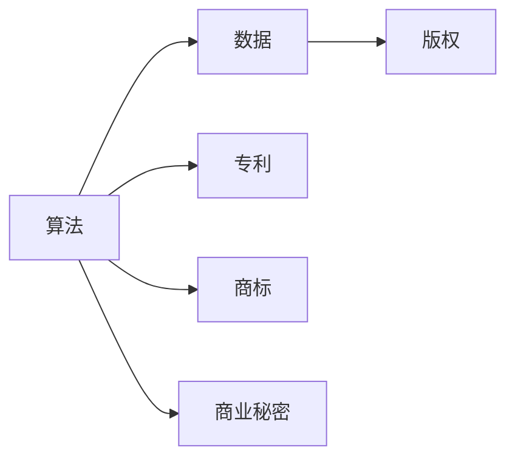
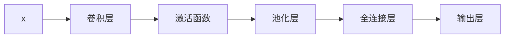
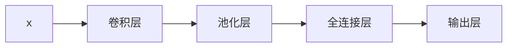

                 

# 知识产权在AI时代的新挑战

在人工智能(AI)迅猛发展的时代，知识产权（Intellectual Property, IP）领域正面临一系列前所未有的新挑战。这些挑战不仅体现在法律层面的保护和商业应用上，更涉及到技术伦理、创新驱动与数据权属等多个维度。本文将系统性地探讨AI时代下知识产权面临的新挑战，分析其成因和应对策略，以期为各方参与者提供有益的洞见和行动指南。

## 1. 背景介绍

### 1.1 问题由来

人工智能技术，特别是深度学习、自然语言处理和计算机视觉等领域的快速发展，为各行各业带来了革命性的变化。企业、研究机构和个体开发者不断利用AI技术进行技术创新和商业应用。然而，随着AI技术的广泛应用，知识产权问题也变得越来越复杂。从算法设计到数据使用，再到产品部署，AI技术中涉及到的诸多方面都可能触及知识产权的边界。这些问题若不能妥善解决，可能会引发法律纠纷、经济损失，甚至影响社会的公正性和公平性。

### 1.2 问题核心关键点

AI时代下知识产权的新挑战主要集中在以下几个方面：

- **算法设计的原创性**：AI算法是否应被视为智力创造，进而享有版权？
- **数据使用的权利归属**：在训练AI模型时使用的数据，尤其是用户生成内容（User-Generated Content, UGC），其权属问题如何界定？
- **商业应用的知识产权策略**：如何平衡创新激励与知识产权保护，确保商业应用的公平合理？
- **开源与闭源的边界**：在开源和闭源之间，AI技术的应用和迭代如何处理知识产权的问题？
- **伦理和道德问题**：AI算法的使用可能带来伦理和道德上的争议，如隐私侵犯、偏见和歧视等，如何界定涉及知识产权的伦理边界？

## 2. 核心概念与联系

### 2.1 核心概念概述

为了深入理解AI时代下知识产权的新挑战，我们需要先明确几个核心概念及其相互之间的联系：

- **算法：** 指用于实现特定功能的代码和模型，如神经网络、机器学习算法等。
- **数据：** 指用于训练和测试AI模型的输入，包括结构化数据、非结构化数据、用户生成内容等。
- **版权（Copyright）：** 指法律赋予创作者对其文学、艺术和科学作品的独占权，通常包括复制、分发、展示和表演等权利。
- **专利（Patent）：** 指法律赋予发明人对其技术发明的独占权，通常通过申请并获得专利权证书来体现。
- **商标（Trademark）：** 指用以识别特定商品或服务的标志，具有显著性和可识别性。
- **商业秘密（Trade Secret）：** 指企业在经营过程中未公开、具有商业价值的技术和信息。

### 2.2 核心概念原理和架构的 Mermaid 流程图



这个流程图展示了算法、数据与各种知识产权之间的联系。算法可以被视作一种知识产权（版权），其核心创意通常受到版权保护。而数据的使用则需要考虑数据的来源、权属和使用方式，可能涉及版权、专利、商标或商业秘密等不同类型的知识产权。

## 3. 核心算法原理 & 具体操作步骤

### 3.1 算法原理概述

AI算法，尤其是深度学习模型，往往需要大量的训练数据和计算资源。这些数据和资源可能涉及多方利益，包括数据提供者、算法开发者、商业应用者等。因此，在算法开发和应用过程中，知识产权的归属和使用问题变得复杂且敏感。

### 3.2 算法步骤详解

1. **数据获取和处理**：
   - 确定数据来源，包括公开数据集、私有大数据、用户生成内容等。
   - 处理数据，如清洗、标注、划分训练集和测试集等。

2. **算法开发和训练**：
   - 选择或设计算法模型，如神经网络、卷积神经网络、生成对抗网络等。
   - 使用数据集进行模型训练，调整超参数和优化算法。

3. **模型评估和测试**：
   - 在测试集上评估模型性能，如准确率、召回率、F1值等指标。
   - 进行模型优化，如调参、集成学习等，提升模型效果。

4. **知识产权保护**：
   - 根据算法的设计、实现和使用方式，确定其知识产权归属。
   - 为算法申请专利、商标或版权保护，以确保合法权益。

### 3.3 算法优缺点

**优点**：
- 提高创新效率。AI算法可以快速迭代和优化，加速技术创新。
- 增强竞争力。通过知识产权保护，确保技术成果不被他人非法使用。

**缺点**：
- 数据权利复杂。不同来源的数据，其权属和使用方式各异，难以统一管理和保护。
- 算法授权难度大。算法作为无形资产，其权利归属和使用方式可能涉及多方利益，难以达成一致。
- 创新激励不足。过度的知识产权保护可能会抑制开放创新和共享。

### 3.4 算法应用领域

AI算法在众多领域得到了广泛应用，如自然语言处理、计算机视觉、机器人学、自动驾驶等。不同领域对算法知识产权的需求和处理方式有所不同：

- **自然语言处理（NLP）**：需要处理大量的文本数据，涉及版权和数据隐私问题。
- **计算机视觉（CV）**：涉及大量图像和视频数据，可能涉及专利和商业秘密保护。
- **自动驾驶**：需要处理大量的传感器数据，涉及数据权属和专利保护。

## 4. 数学模型和公式 & 详细讲解 & 举例说明

### 4.1 数学模型构建

AI算法，特别是深度学习算法，其核心在于神经网络的设计和训练。下面以卷积神经网络（Convolutional Neural Network, CNN）为例，构建数学模型。

假设输入为 $x$，输出为 $y$，网络结构如图：



卷积神经网络的核心数学模型可以表示为：

$$
y = \sigma(Wx + b)
$$

其中，$\sigma$ 为激活函数，$W$ 为权重矩阵，$b$ 为偏置向量。

### 4.2 公式推导过程

- **前向传播**：从输入 $x$ 到输出 $y$ 的计算过程。
- **反向传播**：计算损失函数 $L(y, y')$ 的梯度，用于更新权重 $W$ 和偏置 $b$。

### 4.3 案例分析与讲解

以图像分类为例，假设使用ImageNet数据集进行训练，网络结构如图：



使用随机梯度下降（SGD）优化算法，计算损失函数 $L$ 的梯度：

$$
\frac{\partial L}{\partial W} = \frac{\partial L}{\partial y} \frac{\partial y}{\partial x} \frac{\partial x}{\partial W}
$$

其中，$\frac{\partial L}{\partial y}$ 表示损失函数对输出的梯度，$\frac{\partial y}{\partial x}$ 表示输出对输入的梯度，$\frac{\partial x}{\partial W}$ 表示输入对权重的梯度。

## 5. 项目实践：代码实例和详细解释说明

### 5.1 开发环境搭建

进行AI算法实践，首先需要配置好开发环境。以下是一个基于Python的深度学习项目开发环境的搭建步骤：

1. 安装Python：根据项目需要，选择合适的Python版本。
2. 安装Pip：使用pip工具安装Python库。
3. 安装深度学习框架：如TensorFlow、PyTorch等。
4. 安装相关库：如numpy、scikit-learn等。
5. 配置GPU环境：如果项目需要，安装NVIDIA GPU驱动和CUDA库。

### 5.2 源代码详细实现

以一个简单的图像分类项目为例，实现使用卷积神经网络进行图像分类的过程。

```python
import tensorflow as tf
from tensorflow.keras import layers

# 定义卷积神经网络模型
model = tf.keras.Sequential([
    layers.Conv2D(32, (3, 3), activation='relu', input_shape=(28, 28, 1)),
    layers.MaxPooling2D((2, 2)),
    layers.Flatten(),
    layers.Dense(10, activation='softmax')
])

# 编译模型
model.compile(optimizer='adam', loss='categorical_crossentropy', metrics=['accuracy'])

# 训练模型
model.fit(train_images, train_labels, epochs=5, validation_data=(test_images, test_labels))
```

### 5.3 代码解读与分析

上述代码实现了使用TensorFlow构建一个简单的卷积神经网络模型，并进行图像分类。代码的每一步都有详细解释：

- `tf.keras.Sequential()`：创建一个序列模型。
- `layers.Conv2D()`：添加一个卷积层，用于提取图像特征。
- `layers.MaxPooling2D()`：添加一个池化层，用于降低特征维度。
- `layers.Flatten()`：将池化后的特征展平，用于全连接层。
- `layers.Dense()`：添加一个全连接层，用于分类。

## 6. 实际应用场景

### 6.1 企业内部应用

企业在内部应用AI算法时，知识产权问题显得尤为重要。例如，一家公司研发了一款基于AI的客户服务聊天机器人，其使用的算法和数据都需要得到妥善保护。

- **算法保护**：公司可以将算法代码作为商业秘密保护，或申请专利保护。
- **数据保护**：公司需要与数据提供者签订保密协议，明确数据的使用范围和期限。

### 6.2 开源社区贡献

开源社区中的AI算法开发，其知识产权问题同样复杂。开发者在贡献代码时，需要注意以下几个方面：

- **代码授权**：选择适合的授权协议，如GPL、MIT等。
- **数据来源**：明确数据的来源和权属，避免侵权风险。
- **贡献规范**：遵循社区规范，确保代码质量和可维护性。

### 6.3 商业应用部署

在商业应用中，AI算法的知识产权保护尤为重要。例如，一家公司将AI算法部署到云端，其知识产权保护需要考虑以下几个方面：

- **专利申请**：申请专利保护，确保技术独占权。
- **数据加密**：对数据进行加密处理，保护数据安全。
- **合同条款**：与客户签订合同，明确使用范围和限制。

## 7. 工具和资源推荐

### 7.1 学习资源推荐

以下是一些优秀的学习资源，可以帮助理解AI时代下的知识产权问题：

- **《人工智能与法律》（José María Vallejo et al.）**：全面介绍AI技术在法律和伦理领域的挑战和应对策略。
- **《人工智能法律问题》（Tilman Frasch et al.）**：从法律视角分析AI技术的知识产权和伦理问题。
- **《AI与知识产权》（Christopher Robertson）**：探讨AI技术在知识产权法中的应用和挑战。
- **OpenAI的《人工智能与知识产权》（OpenAI）**：提供AI技术在知识产权领域的实际案例和政策建议。

### 7.2 开发工具推荐

以下是一些常用的AI开发工具，可以辅助实现和保护AI算法：

- **TensorFlow**：一个开源的机器学习框架，支持GPU加速，适合大规模AI项目开发。
- **PyTorch**：另一个开源的机器学习框架，灵活性高，适合快速原型开发。
- **Jupyter Notebook**：一个交互式开发环境，支持代码块和数据可视化，方便实验和共享。
- **Git**：一个版本控制系统，方便团队协作和管理代码版本。

### 7.3 相关论文推荐

以下是几篇重要的论文，深入探讨了AI时代下的知识产权问题：

- **《AI算法的知识产权保护》（李晓虎）**：讨论了AI算法作为知识产权的适用性和保护策略。
- **《数据隐私与AI技术的法律挑战》（Wanda Georgiou）**：分析了数据隐私和AI技术的法律冲突和保护措施。
- **《AI技术的伦理与法律》（Gabriel intron）**：探讨了AI技术在伦理和法律领域的挑战和解决方案。
- **《AI知识产权的未来》（Yoshua Bengio）**：预测了AI知识产权的发展趋势和未来方向。

## 8. 总结：未来发展趋势与挑战

### 8.1 研究成果总结

随着AI技术的不断发展和普及，知识产权问题变得日益复杂和多样化。本文系统地探讨了AI时代下知识产权的新挑战，明确了其在算法、数据、商业应用等方面的关键点。通过深入分析，提出了一些应对策略和解决方案，为各方参与者提供了有益的洞见和行动指南。

### 8.2 未来发展趋势

AI技术的快速发展将进一步改变知识产权的保护和应用方式。未来，我们可以预见以下几个趋势：

- **AI算法作为知识产权**：越来越多的算法将被视为知识产权，需要通过法律和商业手段进行保护。
- **数据权属的明确化**：数据权属问题将逐步得到解决，企业和个人将更加重视数据管理和保护。
- **国际知识产权合作**：各国将加强合作，共同应对跨国界的AI知识产权问题。
- **伦理和法律的融合**：知识产权保护将更加注重伦理和法律的融合，确保技术的公平和公正使用。

### 8.3 面临的挑战

尽管AI技术在知识产权保护方面取得了一些进展，但仍面临诸多挑战：

- **算法复杂性**：AI算法的复杂性和动态性使得知识产权保护变得复杂。
- **数据权属不清**：数据来源多样，权属问题难以统一管理和保护。
- **法律滞后**：现有法律体系对AI技术的一些方面尚未覆盖，需要进一步完善和调整。
- **伦理和法律冲突**：AI技术的伦理和法律问题复杂，需要多方面协调和平衡。

### 8.4 研究展望

未来，针对AI时代下的知识产权问题，可以从以下几个方面进行深入研究：

- **算法伦理与法律**：研究AI算法的伦理和法律边界，确保技术应用符合社会价值观和法律法规。
- **数据治理机制**：建立完善的数据治理机制，确保数据的合理使用和保护。
- **国际知识产权协议**：推动国际社会达成共识，制定统一的AI知识产权保护协议。
- **AI知识产权教育**：普及AI知识产权知识，提升公众和企业的知识产权意识。

## 9. 附录：常见问题与解答

**Q1: AI算法是否享有版权？**

A: 目前国际上对AI算法的版权保护存在争议。部分国家和地区认为，AI算法不具备原创性，不属于版权保护范围。然而，随着AI技术的发展，越来越多的算法被视为知识产权，需要通过法律和商业手段进行保护。

**Q2: 在训练AI模型时，如何使用公开数据？**

A: 使用公开数据训练AI模型时，需要遵循数据授权协议，明确数据的使用范围和期限。同时，需要确保数据的质量和可用性，避免误导和侵权行为。

**Q3: 如何保护AI模型的知识产权？**

A: 保护AI模型的知识产权，可以通过申请专利、商标或版权等方式。此外，还可以将算法代码作为商业秘密进行保护，确保其不被非法使用。

**Q4: 如何应对AI算法中的伦理和法律问题？**

A: 应对AI算法中的伦理和法律问题，需要多方参与，包括算法开发者、数据提供者、监管机构和公众。建立透明、公正、可监督的AI治理机制，确保AI技术的应用符合社会价值观和法律法规。

---

作者：禅与计算机程序设计艺术 / Zen and the Art of Computer Programming

