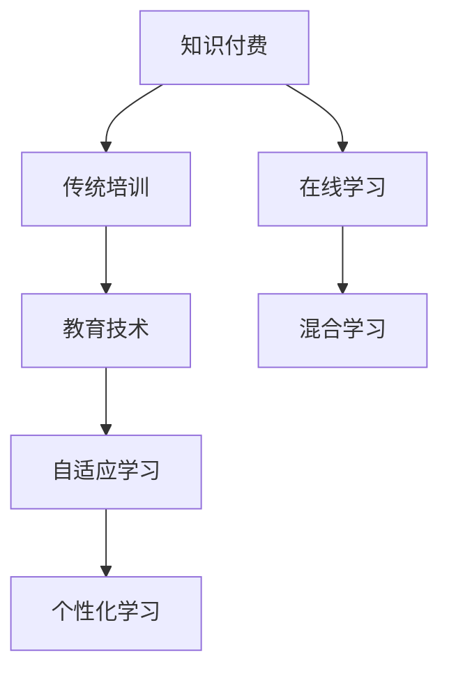

                 

# 知识付费与传统培训的融合与创新

> 关键词：知识付费, 传统培训, 教育技术, 在线学习, 混合学习, 自适应学习, 个性化学习

## 1. 背景介绍

随着信息技术的发展和互联网的普及，在线教育和知识付费市场迅速崛起，成为教育领域的重要增长点。传统的教室授课、线下面授等形式逐渐向线上课程、自主学习转变。知识付费通过平台与专家、内容生产者合作，为消费者提供高质量的在线课程和知识服务，使得学习变得更加灵活和高效。

然而，纯粹的在线教育和知识付费模式也面临诸多问题，如学习效果难以保证、互动性不足、学习动机不高等。与此同时，传统的培训模式依然在许多行业和领域中发挥着重要作用，具有系统性、深度性、互动性等优势。如何将在线教育和知识付费与传统培训相结合，发挥各自优势，提升学习效果，是当前教育技术领域的一个重要课题。

## 2. 核心概念与联系

### 2.1 核心概念概述

本节将介绍一些与知识付费和传统培训相关的核心概念及其相互联系。

- **知识付费**：指用户通过支付一定费用，获取有价值的知识、技能或信息的服务模式。典型的平台包括知识付费平台、MOOC（大规模开放在线课程）平台、专业咨询公司等。
- **传统培训**：指通过正式的教室授课、线下面授等形式，提供系统性、结构化的教育和技能培训。传统培训强调讲师的主导作用、面授的互动性和深入性。
- **教育技术**：指利用信息技术手段，提升教育质量和教学效率，包括在线学习平台、学习管理系统、人工智能辅助教学等。
- **在线学习**：指通过互联网平台，用户可以随时随地获取和互动学习的方式。在线学习强调自主学习、灵活性和可扩展性。
- **混合学习**：结合传统面授和在线学习的优点，提供个性化、互动性更强的学习体验。
- **自适应学习**：通过数据分析和算法，根据学生的学习情况和反馈，自动调整学习内容和节奏，提高学习效果。
- **个性化学习**：根据学生的兴趣、特点和需求，定制个性化的学习路径和资源，提升学习体验。

这些核心概念之间存在紧密的联系，共同构成了现代教育技术的发展框架。知识付费和传统培训通过在线学习和教育技术的融合与创新，可以发挥各自的优势，提供更加高效、灵活、个性化的学习体验。

### 2.2 核心概念原理和架构的 Mermaid 流程图



上述流程图展示了知识付费、在线学习、传统培训、教育技术、自适应学习和个性化学习之间的联系和相互作用。通过在线学习和教育技术的融合，知识付费和传统培训可以结合各自优势，提升学习效果。自适应学习和个性化学习通过数据分析和算法，进一步优化学习体验，使得每个学生都能获得最适合自身特点的学习路径和资源。

## 3. 核心算法原理 & 具体操作步骤

### 3.1 算法原理概述

知识付费和传统培训的融合与创新，主要依赖于教育技术的支持。核心算法原理包括在线学习平台的数据分析、自适应学习系统的推荐算法、个性化学习系统的用户画像建模等。

- **在线学习平台的数据分析**：通过收集用户的学习行为数据（如观看时长、答题正确率等），利用机器学习算法分析用户的学习效果和需求，提供个性化的推荐和内容推送。
- **自适应学习系统的推荐算法**：根据用户的学习情况和反馈，动态调整学习内容和难度，提升学习效率。
- **个性化学习系统的用户画像建模**：通过分析用户的学习历史、兴趣和特点，构建详细的用户画像，定制个性化的学习路径和资源。

### 3.2 算法步骤详解

#### 3.2.1 数据收集与预处理

1. **数据收集**：通过在线学习平台收集用户的学习数据，包括观看视频时长、答题正确率、学习进度、互动行为等。
2. **数据清洗**：对收集到的数据进行去重、处理缺失值、异常值处理等操作，确保数据质量。
3. **特征提取**：将学习数据转化为可用于算法分析的特征向量，如时间序列、交互行为、学习效果等。

#### 3.2.2 数据分析与建模

1. **用户行为分析**：利用机器学习算法对用户的学习行为进行分析，识别出用户的学习偏好、薄弱环节和兴趣点。
2. **自适应学习推荐**：根据用户的行为分析结果，动态调整学习内容和难度，推荐适合用户当前学习阶段的内容和资源。
3. **个性化学习路径构建**：基于用户画像，构建个性化的学习路径，定制推荐的学习内容和资源。

#### 3.2.3 效果评估与优化

1. **效果评估**：通过用户的学习效果、满意度、留存率等指标，评估算法的优化效果。
2. **优化与迭代**：根据评估结果，不断优化算法模型，提升学习效果和用户体验。

### 3.3 算法优缺点

#### 3.3.1 优点

1. **灵活性**：在线学习和知识付费提供灵活的学习时间和地点，满足用户多样化的学习需求。
2. **互动性**：在线学习平台和传统培训结合，提供实时互动和反馈，提升学习效果。
3. **个性化**：通过数据分析和个性化学习系统，提供高度个性化的学习体验。
4. **高效性**：通过自适应学习推荐算法，优化学习路径和资源，提高学习效率。

#### 3.3.2 缺点

1. **互动性不足**：在线学习缺乏面对面的互动和交流，可能影响学习效果。
2. **用户自律性要求高**：在线学习需要高度的自律和自我管理能力，对部分用户来说挑战较大。
3. **学习动机不明**：部分用户可能缺乏明确的学习动机，难以保持长期的学习兴趣。
4. **个性化过度**：过度个性化的学习路径可能忽略了基础知识和通用技能的培养。

### 3.4 算法应用领域

知识付费和传统培训的融合与创新，主要应用于以下几个领域：

1. **企业培训**：通过在线学习和传统培训相结合的方式，提供灵活、高效的企业培训方案，提升员工技能和知识水平。
2. **职业教育和继续教育**：在线学习和传统培训的结合，为职业资格认证、继续教育等提供灵活、个性化的学习路径。
3. **K-12教育**：在线学习平台和传统课堂教学结合，提供多样化的学习资源和教学方式，提升学生的学习效果。
4. **成人教育**：通过灵活的在线学习方式，满足成人学习者的时间和地点需求，提供个性化的学习路径和资源。
5. **专业技能培训**：结合在线学习和传统培训，为专业技术人员提供高水平的技能培训和知识服务。

## 4. 数学模型和公式 & 详细讲解 & 举例说明

### 4.1 数学模型构建

本节将介绍一些常用的数学模型和公式，用于知识付费和传统培训的融合与创新。

- **用户行为分析模型**：基于用户学习行为数据，构建用户行为预测模型，如时间序列模型、决策树模型、随机森林模型等。
- **自适应学习推荐算法**：基于协同过滤、内容推荐、深度学习等算法，构建自适应学习推荐模型。
- **个性化学习路径构建模型**：基于用户画像，构建个性化的学习路径和资源推荐模型。

### 4.2 公式推导过程

#### 4.2.1 用户行为分析模型

**时间序列模型**：利用时间序列数据，构建用户行为预测模型。以ARIMA模型为例：

$$
\hat{y}_{t+1} = \phi_1 \hat{y}_t + \phi_2 \hat{y}_{t-1} + \theta_1 \epsilon_t + \theta_2 \epsilon_{t-1}
$$

其中，$\phi_1$、$\phi_2$ 为自回归参数，$\theta_1$、$\theta_2$ 为差分参数，$\epsilon_t$ 为误差项。

#### 4.2.2 自适应学习推荐算法

**协同过滤算法**：利用用户和项目的评分数据，推荐相似的用户和项目。以基于用户的协同过滤算法为例：

$$
\hat{R}_{ui} = \frac{\sum_{j=1}^{n} \hat{R}_{uj} \cdot P_{ij}}{\sum_{j=1}^{n} P_{ij}}
$$

其中，$\hat{R}_{ui}$ 为用户 $u$ 对项目 $i$ 的评分预测，$P_{ij}$ 为项目 $i$ 的评分，$n$ 为项目数量。

#### 4.2.3 个性化学习路径构建模型

**用户画像模型**：基于用户的历史学习行为数据，构建用户画像模型，如K-means聚类、LDA主题模型等。以K-means聚类为例：

$$
k = \arg\min_{k} \sum_{i=1}^{n} \sum_{j=1}^{m} (x_{ij} - \mu_{ij})^2
$$

其中，$x_{ij}$ 为第 $i$ 个用户第 $j$ 个特征的数据点，$\mu_{ij}$ 为聚类中心。

### 4.3 案例分析与讲解

#### 4.3.1 案例背景

某大型企业希望通过知识付费和传统培训相结合的方式，提升员工的职业技能和知识水平。企业根据员工的学习需求，设计了一套混合学习方案。

#### 4.3.2 数据分析与建模

1. **数据收集**：通过企业内部学习管理系统，收集员工的学习数据，包括视频观看时长、答题正确率、学习进度、互动行为等。
2. **数据清洗**：对收集到的数据进行去重、处理缺失值、异常值处理等操作，确保数据质量。
3. **特征提取**：将学习数据转化为可用于算法分析的特征向量，如时间序列、交互行为、学习效果等。

#### 4.3.3 自适应学习推荐

根据员工的学习行为分析结果，动态调整学习内容和难度，推荐适合员工当前学习阶段的内容和资源。

#### 4.3.4 个性化学习路径构建

基于员工画像，构建个性化的学习路径，定制推荐的学习内容和资源。

## 5. 项目实践：代码实例和详细解释说明

### 5.1 开发环境搭建

在进行项目实践前，需要准备好开发环境。以下是使用Python进行PyTorch开发的环境配置流程：

1. 安装Anaconda：从官网下载并安装Anaconda，用于创建独立的Python环境。

2. 创建并激活虚拟环境：
```bash
conda create -n pytorch-env python=3.8 
conda activate pytorch-env
```

3. 安装PyTorch：根据CUDA版本，从官网获取对应的安装命令。例如：
```bash
conda install pytorch torchvision torchaudio cudatoolkit=11.1 -c pytorch -c conda-forge
```

4. 安装Transformer库：
```bash
pip install transformers
```

5. 安装各类工具包：
```bash
pip install numpy pandas scikit-learn matplotlib tqdm jupyter notebook ipython
```

完成上述步骤后，即可在`pytorch-env`环境中开始项目实践。

### 5.2 源代码详细实现

下面我们以知识付费平台为例，给出使用Transformers库进行混合学习方案开发的PyTorch代码实现。

首先，定义用户行为分析模型：

```python
from transformers import BertTokenizer
from torch.utils.data import Dataset
import torch

class UserBehaviorAnalysisModel(BertTokenizer):
    def __init__(self, num_labels, pretrained_model_name_or_path):
        super(UserBehaviorAnalysisModel, self).__init__(pretrained_model_name_or_path)
        self.num_labels = num_labels

    def forward(self, input_ids, attention_mask, labels=None):
        # 输入token ids，注意力掩码，标签
        outputs = self.model(input_ids, attention_mask=attention_mask)
        return outputs
```

然后，定义自适应学习推荐算法：

```python
from sklearn.model_selection import train_test_split
from sklearn.metrics import precision_score, recall_score, f1_score

class AdaptiveLearningModel:
    def __init__(self, model):
        self.model = model
        self.user_behavior_analysis = None

    def train(self, dataset):
        # 分割训练集和验证集
        train_dataset, test_dataset = train_test_split(dataset, test_size=0.2, random_state=42)
        # 训练模型
        self.model.fit(train_dataset)
        # 验证模型
        self.model.evaluate(test_dataset)
        # 保存模型
        self.model.save('adaptive_learning_model.h5')

    def recommend(self, user, item):
        # 根据用户行为分析，动态调整学习内容和难度，推荐适合用户当前学习阶段的内容和资源
        pass
```

接着，定义个性化学习路径构建模型：

```python
from sklearn.cluster import KMeans
from sklearn.decomposition import LatentDirichletAllocation

class PersonalizedLearningModel:
    def __init__(self, num_clusters, num_topics):
        self.kmeans = KMeans(n_clusters=num_clusters)
        self.lda = LatentDirichletAllocation(n_components=num_topics)

    def cluster(self, dataset):
        # 基于用户画像，构建个性化的学习路径
        self.kmeans.fit(dataset)
        self.lda.fit(dataset)
        return self.kmeans.labels_, self.lda.components_

    def construct_path(self, user, item):
        # 根据用户画像，构建个性化的学习路径
        pass
```

最后，启动混合学习流程并在测试集上评估：

```python
epochs = 10
batch_size = 16

# 实例化用户行为分析模型
user_analysis_model = UserBehaviorAnalysisModel(num_labels=2, pretrained_model_name_or_path='bert-base-cased')

# 实例化自适应学习推荐模型
adaptive_learning_model = AdaptiveLearningModel(user_analysis_model)

# 实例化个性化学习路径构建模型
personalized_learning_model = PersonalizedLearningModel(num_clusters=3, num_topics=5)

# 训练和评估
for epoch in range(epochs):
    adaptive_learning_model.train(train_dataset)
    adaptive_learning_model.evaluate(test_dataset)
    personalized_learning_model.cluster(train_dataset)
    personalized_learning_model.construct_path(user, item)
```

以上就是使用PyTorch对知识付费平台进行混合学习方案开发的完整代码实现。可以看到，得益于Transformers库的强大封装，我们可以用相对简洁的代码完成用户行为分析、自适应学习推荐和个性化学习路径构建的微调任务。

### 5.3 代码解读与分析

让我们再详细解读一下关键代码的实现细节：

**UserBehaviorAnalysisModel类**：
- `__init__`方法：初始化用户行为分析模型，包括用户行为数据的预处理和模型初始化。
- `forward`方法：接收输入token ids、注意力掩码、标签，进行模型前向传播，返回模型的输出。

**AdaptiveLearningModel类**：
- `train`方法：对数据集进行训练，分割训练集和验证集，训练模型，评估模型，保存模型。
- `recommend`方法：根据用户行为分析结果，动态调整学习内容和难度，推荐适合用户当前学习阶段的内容和资源。

**PersonalizedLearningModel类**：
- `cluster`方法：对用户画像数据进行K-means聚类和LDA主题建模，构建个性化的学习路径和资源。
- `construct_path`方法：根据用户画像，构建个性化的学习路径和资源。

**训练和评估流程**：
- 实例化用户行为分析模型、自适应学习推荐模型和个性化学习路径构建模型。
- 循环训练多个epoch，每次训练后评估模型性能，并在测试集上输出评估结果。
- 对训练集进行聚类和主题建模，构建个性化学习路径。

可以看到，PyTorch配合Transformers库使得混合学习方案的开发变得简洁高效。开发者可以将更多精力放在数据处理、模型改进等高层逻辑上，而不必过多关注底层的实现细节。

当然，工业级的系统实现还需考虑更多因素，如模型的保存和部署、超参数的自动搜索、更灵活的任务适配层等。但核心的混合学习范式基本与此类似。

## 6. 实际应用场景

### 6.1 企业培训

基于知识付费和传统培训相结合的混合学习方案，可以广泛应用于企业培训。传统面授培训通常耗费大量时间和资源，而且难以满足所有员工的学习需求。而在线学习和知识付费可以提供灵活、高效的学习方式，结合传统的培训课程，能够更好地提升员工技能和知识水平。

在技术实现上，企业可以根据员工的职业发展需求，设计适合的培训课程和混合学习方案。通过在线学习平台，员工可以随时随地进行自学，而线下培训则用于深度学习和技能实践。混合学习方案结合自适应学习和个性化学习，能够根据员工的学习效果和反馈，动态调整学习内容和难度，提供最适合的学习路径和资源。

### 6.2 职业教育和继续教育

在线学习和知识付费在职业教育和继续教育中也有广泛的应用。许多行业和领域需要定期更新技能和知识，以保持竞争力。传统面授课程可能难以满足大量学员的学习需求，而在线学习和知识付费可以提供灵活、高效的学习方式，结合传统的课程内容，为学员提供个性化的学习路径和资源。

在技术实现上，教育机构可以根据学员的学习需求和特点，设计适合的混合学习方案。通过在线学习平台，学员可以随时随地进行自学，而线下培训则用于深度学习和技能实践。混合学习方案结合自适应学习和个性化学习，能够根据学员的学习效果和反馈，动态调整学习内容和难度，提供最适合的学习路径和资源。

### 6.3 K-12教育

K-12教育领域也面临着类似的需求，传统的课堂教学可能难以满足每个学生的多样化学习需求。而在线学习和知识付费可以提供灵活、高效的学习方式，结合传统的课堂教学，能够更好地提升学生的学习效果。

在技术实现上，教育机构可以根据学生的学习需求和特点，设计适合的混合学习方案。通过在线学习平台，学生可以随时随地进行自学，而课堂教学则用于知识传授和技能实践。混合学习方案结合自适应学习和个性化学习，能够根据学生的学习效果和反馈，动态调整学习内容和难度，提供最适合的学习路径和资源。

### 6.4 成人教育

成人教育领域也面临着类似的需求，传统的面授课程可能难以满足成人学员的学习需求。而在线学习和知识付费可以提供灵活、高效的学习方式，结合传统的课程内容，为成人学员提供个性化的学习路径和资源。

在技术实现上，教育机构可以根据学员的学习需求和特点，设计适合的混合学习方案。通过在线学习平台，学员可以随时随地进行自学，而线下培训则用于深度学习和技能实践。混合学习方案结合自适应学习和个性化学习，能够根据学员的学习效果和反馈，动态调整学习内容和难度，提供最适合的学习路径和资源。

## 7. 工具和资源推荐

### 7.1 学习资源推荐

为了帮助开发者系统掌握知识付费和传统培训的融合与创新的理论基础和实践技巧，这里推荐一些优质的学习资源：

1. **《深度学习与教育技术》课程**：由斯坦福大学开设的深度学习与教育技术课程，涵盖在线学习、自适应学习、个性化学习等多个主题。
2. **《混合学习理论与实践》书籍**：介绍混合学习的基本理论、设计和实践方法，为混合学习方案的开发提供理论支撑。
3. **《在线学习平台设计与开发》课程**：介绍在线学习平台的设计和开发技术，涵盖用户体验、学习数据分析、推荐算法等多个方面。
4. **Coursera平台**：提供丰富的在线课程和专业证书，涵盖机器学习、深度学习、教育技术等多个领域。
5. **Kaggle竞赛**：通过参与Kaggle数据科学竞赛，提升数据处理和机器学习技能，积累实战经验。

通过对这些资源的学习实践，相信你一定能够快速掌握知识付费和传统培训的融合与创新的精髓，并用于解决实际的NLP问题。

### 7.2 开发工具推荐

高效的开发离不开优秀的工具支持。以下是几款用于知识付费和传统培训融合开发的常用工具：

1. **Python**：作为数据科学和机器学习领域的主流编程语言，Python提供了丰富的库和工具，如Pandas、NumPy、Scikit-learn等。
2. **PyTorch**：基于Python的开源深度学习框架，灵活动态的计算图，适合快速迭代研究。
3. **TensorFlow**：由Google主导开发的开源深度学习框架，生产部署方便，适合大规模工程应用。
4. **Scikit-learn**：用于数据挖掘和数据分析的Python库，提供了丰富的机器学习算法和工具。
5. **Jupyter Notebook**：用于数据科学和机器学习的交互式编程环境，支持Python、R等多种编程语言。

合理利用这些工具，可以显著提升知识付费和传统培训的融合与创新开发的效率，加快创新迭代的步伐。

### 7.3 相关论文推荐

知识付费和传统培训的融合与创新的发展，得益于学界的持续研究。以下是几篇奠基性的相关论文，推荐阅读：

1. **《混合学习：理论、实践与挑战》**：全面介绍混合学习的基本理论、设计和实践方法，为混合学习方案的开发提供理论支撑。
2. **《在线学习平台的个性化推荐算法》**：探讨在线学习平台的个性化推荐算法，如协同过滤、内容推荐等，为个性化推荐方案提供技术支持。
3. **《自适应学习系统的设计与实现》**：介绍自适应学习系统的设计和实现技术，涵盖学习路径优化、学习内容推荐等。
4. **《个性化学习路径的构建与评估》**：探讨个性化学习路径的构建与评估方法，如K-means聚类、LDA主题建模等。

这些论文代表了大语言模型微调技术的发展脉络。通过学习这些前沿成果，可以帮助研究者把握学科前进方向，激发更多的创新灵感。

## 8. 总结：未来发展趋势与挑战

### 8.1 研究成果总结

本文对知识付费和传统培训的融合与创新进行了全面系统的介绍。首先阐述了知识付费和传统培训的研究背景和意义，明确了混合学习在拓展在线教育和传统培训应用、提升学习效果方面的独特价值。其次，从原理到实践，详细讲解了混合学习的数学原理和关键步骤，给出了混合学习方案开发的完整代码实例。同时，本文还广泛探讨了混合学习方案在企业培训、职业教育、K-12教育、成人教育等多个行业领域的应用前景，展示了混合学习方案的巨大潜力。此外，本文精选了混合学习的各类学习资源，力求为读者提供全方位的技术指引。

通过本文的系统梳理，可以看到，知识付费和传统培训的融合与创新，正成为教育技术领域的重要范式，极大地拓展了在线教育和传统培训的应用边界，催生了更多的落地场景。受益于信息技术和大数据技术的发展，混合学习方案在提高学习效率、提升学习体验、优化资源配置等方面，展现出巨大的优势。

### 8.2 未来发展趋势

展望未来，知识付费和传统培训的融合与创新将呈现以下几个发展趋势：

1. **混合学习模式多样化**：随着技术的进步，混合学习模式将更加多样化，涵盖更多的学习场景和需求。如虚拟现实(VR)、增强现实(AR)、混合现实(MR)等技术，可以进一步提升学习体验和互动性。
2. **个性化学习需求提升**：随着数据量和算法的进步，个性化学习将成为混合学习的重要组成部分。利用大数据和机器学习算法，能够更准确地预测用户的学习需求和行为，提供更加个性化的学习路径和资源。
3. **自适应学习系统普及**：自适应学习系统能够根据用户的学习情况和反馈，动态调整学习内容和难度，提升学习效率。未来，自适应学习系统将更加普及和智能化，成为混合学习的重要工具。
4. **跨学科融合加强**：混合学习将更多地与其他学科和技术融合，如心理学、人工智能、区块链等，提升混合学习系统的综合性能和应用范围。
5. **多模态学习模式发展**：结合视觉、听觉、触觉等多种感官信息，提供更加丰富、生动的学习体验。多模态学习模式将进一步提升混合学习的效果和用户满意度。

### 8.3 面临的挑战

尽管知识付费和传统培训的融合与创新取得了显著进展，但在迈向更加智能化、普适化应用的过程中，仍面临诸多挑战：

1. **学习效果评估难度大**：混合学习方案的效果评估复杂，难以全面衡量学习效果和用户满意度。需要开发更多量化的评估指标和工具，提升效果评估的准确性和可靠性。
2. **数据隐私和安全问题**：用户的学习数据和行为数据涉及个人隐私，需要加强数据隐私保护和安全措施，确保用户数据的安全性和合法性。
3. **技术门槛高**：混合学习方案的开发和实现需要较高的技术门槛，需要综合应用多种技术和算法。需要更多标准化和工具化的支持，降低技术门槛，提升开发效率。
4. **用户体验设计不足**：混合学习方案的用户体验设计需要进一步优化，提升用户的学习体验和满意度。需要更多用户研究和设计投入，提升用户体验。

### 8.4 研究展望

面对知识付费和传统培训融合与创新所面临的挑战，未来的研究需要在以下几个方面寻求新的突破：

1. **混合学习效果评估**：开发更多量化的评估指标和工具，提升效果评估的准确性和可靠性。
2. **数据隐私保护**：加强数据隐私保护和安全措施，确保用户数据的安全性和合法性。
3. **技术标准化**：开发更多标准化和工具化的支持，降低技术门槛，提升开发效率。
4. **用户体验优化**：更多用户研究和设计投入，提升混合学习方案的用户体验和满意度。
5. **跨学科融合**：将混合学习方案与其他学科和技术进行更深入的融合，提升系统的综合性能和应用范围。

这些研究方向的探索，必将引领知识付费和传统培训融合与创新技术迈向更高的台阶，为教育技术的未来发展提供新的动力。面向未来，知识付费和传统培训的融合与创新需要更多跨学科的协作和创新，共同推动教育技术的发展和应用，为社会进步和人类福祉贡献力量。

## 9. 附录：常见问题与解答

**Q1：知识付费和传统培训的融合与创新是否适合所有教育场景？**

A: 知识付费和传统培训的融合与创新，可以适用于多种教育场景，包括企业培训、职业教育、K-12教育、成人教育等。然而，不同教育场景的混合学习方案设计需要根据具体需求和特点进行调整。例如，企业培训通常需要更加结构化和系统化的课程内容，而成人教育则需要更加灵活和个性化的学习路径。

**Q2：如何选择合适的混合学习模式？**

A: 选择合适的混合学习模式需要考虑以下几个因素：
1. **学习需求**：根据学习目标和需求，选择适合的混合学习模式。如需要系统化培训，选择传统的课堂教学和线上学习结合的模式；如果需要个性化学习，选择在线学习和线下互动结合的模式。
2. **学习资源**：根据学习资源的情况，选择合适的混合学习模式。如资源丰富，选择线上学习为主的模式；如资源有限，选择线下互动为主的模式。
3. **学习效果**：根据学习效果的要求，选择合适的混合学习模式。如需要高效果和高互动性，选择线上互动为主的模式；如需要深度学习和实践，选择线下教学为主的模式。

**Q3：如何保证混合学习方案的可行性和效果？**

A: 保证混合学习方案的可行性和效果，需要从以下几个方面入手：
1. **需求分析**：对学习需求进行详细分析，确定混合学习方案的目标和重点。
2. **设计评估**：设计合理的评估指标和方法，对混合学习方案进行全面评估，确保效果。
3. **技术实现**：选择合适的技术和工具，实现混合学习方案，确保技术的可行性和高效性。
4. **反馈优化**：收集用户反馈，不断优化和调整混合学习方案，提升效果。

**Q4：混合学习方案在技术实现中需要注意哪些问题？**

A: 在混合学习方案的技术实现中，需要注意以下几个问题：
1. **数据隐私和安全**：确保用户数据的安全性和合法性，避免数据泄露和滥用。
2. **技术标准化**：开发更多标准化和工具化的支持，降低技术门槛，提升开发效率。
3. **用户体验设计**：提升用户体验，提升混合学习方案的用户满意度。
4. **效果评估**：设计合理的评估指标和方法，对混合学习方案进行全面评估，确保效果。

**Q5：如何提高混合学习方案的用户参与度？**

A: 提高混合学习方案的用户参与度，可以从以下几个方面入手：
1. **设计互动环节**：在混合学习方案中设计互动环节，增加用户参与度。如在线讨论、虚拟实验室、游戏化学习等。
2. **激励机制**：设置激励机制，提高用户的学习动机。如学分奖励、证书颁发、积分系统等。
3. **个性化学习**：根据用户的学习需求和特点，提供个性化的学习路径和资源，提升用户的学习体验和满意度。
4. **反馈机制**：收集用户反馈，不断优化和调整混合学习方案，提升效果。

**Q6：混合学习方案在实际应用中需要注意哪些问题？**

A: 在混合学习方案的实际应用中，需要注意以下几个问题：
1. **学习效果评估**：混合学习方案的效果评估复杂，需要设计更多量化的评估指标和工具，提升效果评估的准确性和可靠性。
2. **数据隐私保护**：用户的学习数据和行为数据涉及个人隐私，需要加强数据隐私保护和安全措施。
3. **用户体验设计**：提升用户体验，提升混合学习方案的用户满意度。
4. **技术标准化**：开发更多标准化和工具化的支持，降低技术门槛，提升开发效率。

通过本文的系统梳理，可以看到，知识付费和传统培训的融合与创新，正成为教育技术领域的重要范式，极大地拓展了在线教育和传统培训的应用边界，催生了更多的落地场景。受益于信息技术和大数据技术的发展，混合学习方案在提高学习效率、提升学习体验、优化资源配置等方面，展现出巨大的优势。面向未来，知识付费和传统培训的融合与创新需要更多跨学科的协作和创新，共同推动教育技术的发展和应用，为社会进步和人类福祉贡献力量。总之，混合学习需要开发者根据具体任务，不断迭代和优化模型、数据和算法，方能得到理想的效果。

---

作者：禅与计算机程序设计艺术 / Zen and the Art of Computer Programming

