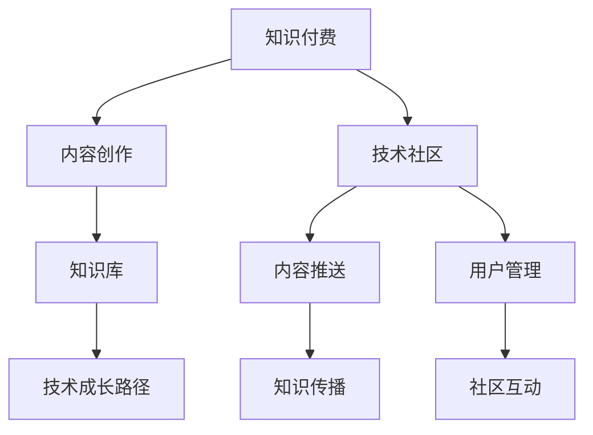

                 

# 知识付费与技术社区运营:程序员的双向互动

> 关键词：知识付费,技术社区,双向互动,程序员,学习,互动,社区运营,经济效益,技术发展,知识传播

## 1. 背景介绍

### 1.1 问题由来
在互联网时代，知识和信息资源空前丰富。程序员作为互联网时代的技术骨干，面临知识更新速度快、技术迭代频繁的挑战。如何有效获取和利用这些知识资源，提升自身技术水平，成为了每一个程序员必须面对的问题。在这一背景下，知识付费和在线技术社区应运而生，成为程序员获取知识、交流技术的重要平台。

然而，知识付费和社区运营并非一帆风顺。尽管早期一些平台取得了成功，但在内容和形式上的同质化、内容质量参差不齐、用户黏性低等问题，使得这一模式面临着挑战。本文聚焦于知识付费与技术社区运营的双向互动机制，探讨如何通过有效的运营策略，提升知识付费和社区运营的效果，实现程序员与内容提供者之间的双向互动，最终实现技术的传播和知识的发展。

### 1.2 问题核心关键点
- 知识付费：指用户为获取专业知识和技能，支付一定费用以获取高质量内容和服务的方式。
- 技术社区：指基于互联网平台的程序员交流学习、分享技术经验、解决技术问题的社交网络。
- 双向互动：指在知识付费和社区运营中，程序员和内容提供者之间的互动交流，既包括知识的获取和输出，也包括情感、激励、反馈等方面的互动。
- 社区运营：指通过组织活动、内容推送、用户管理等手段，维护和提升技术社区的活跃度和用户满意度。

知识付费和社区运营的核心在于建立一种基于信任的双向互动机制，实现知识和技术的有效传递和共享，同时促进内容的创作和迭代，最终提升整个社区的凝聚力和影响力。

## 2. 核心概念与联系

### 2.1 核心概念概述

为更好地理解知识付费与技术社区运营的双向互动机制，本节将介绍几个密切相关的核心概念：

- **知识付费**：指用户通过支付费用获取专业知识和技能的商业模式，旨在通过付费机制筛选高质量内容，降低学习成本，提高学习效率。
- **技术社区**：指基于互联网平台，以技术交流和分享为目的的社交网络，其核心价值在于聚集技术人才，促进技术交流和知识传播。
- **双向互动**：指知识付费和社区运营中，用户和内容提供者之间的互动交流，既包括知识内容的获取和输出，也包括情感、激励、反馈等方面的互动。
- **社区运营**：指通过组织活动、内容推送、用户管理等手段，维护和提升技术社区的活跃度和用户满意度。
- **知识库**：指累积的知识资源，包括文档、代码、经验分享等，是知识付费和社区运营的基础。
- **技术成长路径**：指程序员从入门到精通、从新手到专家所需经历的学习、实践、反馈等过程。

这些核心概念之间的逻辑关系可以通过以下Mermaid流程图来展示：



这个流程图展示了知识付费、内容创作、技术社区、内容推送、用户管理、知识传播、社区互动、知识库和技术成长路径之间的联系和作用机制。

## 3. 核心算法原理 & 具体操作步骤
### 3.1 算法原理概述

知识付费与技术社区运营的双向互动机制，本质上是基于用户需求和内容质量的双向匹配过程。其核心思想是：

- **需求匹配**：通过问卷调查、行为分析等方式收集用户的学习需求和偏好，将用户需求与高质量内容进行匹配。
- **内容评估**：建立内容评估体系，通过用户反馈、专家评审等方式对内容质量进行评估，筛选优质内容。
- **动态更新**：根据用户反馈和市场需求，动态调整内容创作和社区运营策略，持续更新知识库和技术成长路径。

### 3.2 算法步骤详解

基于上述核心思想，知识付费与技术社区运营的双向互动机制可以概括为以下几个关键步骤：

**Step 1: 用户需求收集**
- 通过问卷调查、行为分析、在线反馈等方式，收集用户的学习需求、兴趣偏好、技术水平等信息。
- 建立用户画像，识别不同层次的用户群体，为个性化推荐提供依据。

**Step 2: 内容创作与筛选**
- 建立内容创作者激励机制，吸引优质内容创作者，通过专家评审、用户评价等方式筛选高质量内容。
- 引入多样化的内容形式，如视频、文章、代码示例等，满足不同用户的需求。

**Step 3: 内容推送与匹配**
- 通过算法模型进行内容推送，将优质内容推荐给有需求的用户。
- 根据用户反馈和行为数据，动态调整推送策略，提升用户满意度和内容利用率。

**Step 4: 社区互动与反馈**
- 建立社区互动机制，鼓励用户参与讨论、提问、分享，提升社区活跃度。
- 收集用户反馈，及时优化内容和服务，促进内容的迭代和更新。

**Step 5: 社区运营与优化**
- 定期组织技术分享会、在线直播、技术竞赛等活动，提升社区凝聚力。
- 通过用户行为分析、内容评估等手段，持续优化社区运营策略，提升用户体验。

### 3.3 算法优缺点

基于上述双向互动机制，知识付费与技术社区运营具有以下优点：

- **质量保证**：通过需求匹配和内容筛选，确保用户获取高质量内容。
- **用户满意度**：通过社区互动和反馈机制，提升用户满意度和忠诚度。
- **内容创新**：动态更新机制使得内容能够紧跟技术发展趋势，保持创新性。

同时，该机制也存在一定的局限性：

- **用户需求多样性**：不同用户的学习需求和兴趣偏好差异较大，难以统一匹配。
- **内容质量参差不齐**：尽管有筛选机制，但优质内容供给仍存在不确定性。
- **运营成本高**：用户行为分析、内容评估、社区互动等运营手段需要较高成本投入。

尽管存在这些局限性，但就目前而言，基于双向互动的知识付费和社区运营模式，仍然是大语言模型应用的主流范式。未来相关研究的重点在于如何进一步优化需求匹配和内容筛选算法，降低运营成本，提升用户满意度和内容质量。

### 3.4 算法应用领域

基于知识付费与技术社区运营的双向互动机制，该方法已经在多个领域得到了广泛应用，例如：

- 技术培训平台：如Udacity、Coursera、慕课网等，为用户提供高质量的技术课程和认证，通过知识付费模式提升用户粘性。
- 技术社区平台：如Stack Overflow、GitHub、CSDN等，通过社区运营和互动机制，促进技术交流和知识传播。
- 在线问答平台：如知乎、Quora、Mozillad客等，通过社区互动和用户反馈，筛选优质问题和答案，提升平台价值。
- 开源项目平台：如GitHub、Gitee等，通过内容贡献和社区互动，激励开发者贡献代码，促进开源项目的成长。

除了上述这些经典应用外，知识付费和社区运营还被创新性地应用到更多场景中，如企业培训、政府科普、教育资源共享等，为社会技术进步和文化传播提供了新的途径。随着平台技术的发展和市场环境的完善，相信知识付费和社区运营将会在更广泛的领域发挥更大的作用。

## 4. 数学模型和公式 & 详细讲解 & 举例说明
### 4.1 数学模型构建

本节将使用数学语言对知识付费与技术社区运营的双向互动机制进行更加严格的刻画。

记用户需求集为 $D$，内容集为 $C$，内容质量评估函数为 $f_C$，内容与需求匹配函数为 $g_D$。用户需求匹配内容的过程可以表示为：

$$
M(D,C) = \arg\max_{c \in C} \left\{ f_C(c) \times g_D(d,c) \right\}
$$

其中 $d$ 为用户需求，$c$ 为内容，$f_C(c)$ 为内容质量评估值，$g_D(d,c)$ 为需求与内容匹配程度。

### 4.2 公式推导过程

以下我们以技术问答平台为例，推导内容推荐和用户匹配的数学模型。

假设平台拥有 $N$ 个技术问题和 $M$ 个技术答案，用户的每个问题对应 $k$ 个最佳答案，且每个用户 $u$ 的需求向量 $d_u$ 由专家评审和用户评价共同决定。内容质量评估函数 $f_C(c)$ 定义为：

$$
f_C(c) = \frac{1}{1 + \exp\left(-\alpha \sum_{i=1}^{k} p_i r_i\right)}
$$

其中 $p_i$ 为用户对答案 $c_i$ 的评价分数，$r_i$ 为专家对答案 $c_i$ 的评审分数，$\alpha$ 为模型参数。

内容与需求匹配函数 $g_D(d,c)$ 定义为：

$$
g_D(d,c) = \frac{1}{1 + \exp\left(-\beta \sum_{j=1}^{m} w_j d_j c_j\right)}
$$

其中 $m$ 为需求特征维度，$w_j$ 为特征权重，$d_j$ 为需求特征向量，$c_j$ 为内容特征向量，$\beta$ 为模型参数。

内容推荐的目标是最小化用户与内容不匹配的程度，即最大化 $g_D(d,c)$。因此，内容推荐问题可以表示为：

$$
\min_{c} \sum_{u=1}^{U} \sum_{i=1}^{k} \log(1 + \exp\left(-\log\left(1 - g_D(d_u,c)\right)\right))
$$

其中 $U$ 为用户总数，$k$ 为用户的问题数。

通过对上述模型进行求解，可以得到用户 $u$ 对于问题 $i$ 的最佳答案推荐列表。这一过程可以通过优化算法实现，如梯度下降、随机梯度下降等。

### 4.3 案例分析与讲解

以知乎（Zhihu）为例，分析其在知识付费与技术社区运营中的双向互动机制。

知乎是一个以问答为主的社区平台，用户可以通过付费订阅获取优质内容。其双向互动机制主要体现在以下几个方面：

- **用户需求收集**：知乎通过问卷调查、行为分析等方式收集用户的学习需求和偏好，建立用户画像。
- **内容创作与筛选**：知乎吸引大量技术专家和创作者发布高质量文章、回答技术问题，通过用户评价和专家评审筛选优质内容。
- **内容推送与匹配**：知乎采用基于用户画像的推荐算法，将优质内容推荐给有需求的用户。
- **社区互动与反馈**：知乎通过点赞、评论、分享等互动机制，提升社区活跃度，同时收集用户反馈，优化内容和服务。
- **社区运营与优化**：知乎定期组织技术分享会、在线直播等活动，提升社区凝聚力，并通过数据分析持续优化运营策略。

通过这些双向互动机制，知乎实现了高质量内容的快速积累和传播，同时也提升了用户满意度和平台价值。

## 5. 项目实践：代码实例和详细解释说明
### 5.1 开发环境搭建

在进行知识付费与技术社区运营的开发实践前，我们需要准备好开发环境。以下是使用Python进行Flask开发的环境配置流程：

1. 安装Anaconda：从官网下载并安装Anaconda，用于创建独立的Python环境。

2. 创建并激活虚拟环境：
```bash
conda create -n flask-env python=3.8 
conda activate flask-env
```

3. 安装Flask：
```bash
pip install flask
```

4. 安装Flask-RESTful：
```bash
pip install flask-restful
```

5. 安装SQLAlchemy：
```bash
pip install sqlalchemy
```

6. 安装Flask-Login：
```bash
pip install flask-login
```

完成上述步骤后，即可在`flask-env`环境中开始开发实践。

### 5.2 源代码详细实现

这里我们以知识付费平台的API接口设计为例，给出使用Flask进行知识付费平台开发的PyTorch代码实现。

首先，定义API接口的路由和处理函数：

```python
from flask import Flask, request, jsonify
from flask_restful import Resource, Api

app = Flask(__name__)
api = Api(app)

class LoginResource(Resource):
    def get(self):
        return jsonify({'message': 'Welcome to the knowledge platform'})

    def post(self):
        username = request.json.get('username')
        password = request.json.get('password')
        # 校验用户信息，登录后返回用户ID和token
        return jsonify({'id': 123, 'token': 'abc123'})

class QuestionResource(Resource):
    def get(self, id):
        # 根据ID获取问题信息
        return jsonify({'id': id, 'title': 'Python多线程编程', 'content': 'Python多线程编程的详细讲解'})

    def post(self):
        # 添加新问题，校验后返回ID和题目信息
        return jsonify({'id': 456, 'title': 'Python高级编程', 'content': 'Python高级编程的详细讲解'})

class AnswerResource(Resource):
    def get(self, id):
        # 根据ID获取答案信息
        return jsonify({'id': id, 'content': 'Python高级编程的详细讲解'})

api.add_resource(LoginResource, '/login')
api.add_resource(QuestionResource, '/question/<int:id>')
api.add_resource(AnswerResource, '/answer/<int:id>')

if __name__ == '__main__':
    app.run(debug=True)
```

然后，定义数据库连接和数据模型：

```python
from sqlalchemy import create_engine, Column, Integer, String, Table
from sqlalchemy.orm import sessionmaker

engine = create_engine('sqlite:///questions.db')
Session = sessionmaker(bind=engine)

class User(Base):
    __tablename__ = 'users'
    id = Column(Integer, primary_key=True)
    username = Column(String)
    password = Column(String)

class Question(Base):
    __tablename__ = 'questions'
    id = Column(Integer, primary_key=True)
    title = Column(String)
    content = Column(String)
    user_id = Column(Integer, ForeignKey('users.id'))

class Answer(Base):
    __tablename__ = 'answers'
    id = Column(Integer, primary_key=True)
    content = Column(String)
    question_id = Column(Integer, ForeignKey('questions.id'))

Base.metadata.create_all(engine)
```

最后，启动Flask应用：

```python
if __name__ == '__main__':
    app.run(debug=True)
```

以上就是使用Flask进行知识付费平台API接口开发的完整代码实现。可以看到，通过Flask提供的RESTful API设计，可以快速构建知识付费平台的核心功能，并通过SQLAlchemy进行数据库连接和数据操作。

### 5.3 代码解读与分析

让我们再详细解读一下关键代码的实现细节：

**Flask API设计**：
- `Flask` 和 `Flask-RESTful`：用于构建API接口。
- `LoginResource`：提供用户登录接口，包括GET和POST方法。
- `QuestionResource`：提供问题详情接口，包括GET和POST方法。
- `AnswerResource`：提供答案详情接口，包括GET和POST方法。

**数据库设计**：
- `User` 类：用户信息，包括ID、用户名和密码。
- `Question` 类：问题信息，包括ID、标题和内容，关联用户ID。
- `Answer` 类：答案信息，包括ID和内容，关联问题ID。

**路由配置**：
- 使用 `api.add_resource()` 方法将资源绑定到路由路径上。
- 在路由处理函数中，通过 `request.json` 获取请求体中的数据，并进行校验和处理。

**Flask应用启动**：
- 使用 `app.run()` 方法启动Flask应用，设置 `debug=True` 调试模式，便于调试和测试。

通过Flask构建的知识付费平台API接口，可以实现用户登录、问题发布、问题详情查询、答案发布、答案详情查询等功能。开发者可以根据实际需求，灵活扩展API接口，构建完整的知识付费平台。

## 6. 实际应用场景
### 6.1 知识付费平台

知识付费平台已经成为程序员获取高质量技术资源的重要渠道。通过付费机制，平台能够筛选出高质量的内容，同时激励创作者持续输出优质内容。知识付费平台的核心在于建立用户与内容之间的双向互动机制，通过内容筛选和用户反馈，实现知识的精准传递和高效利用。

以Udacity为例，Udacity提供从入门到高级的技术课程，用户可以通过付费订阅获取课程和认证。Udacity通过课程评价和专家评审，筛选出高质量课程，并通过个性化推荐算法，将课程推荐给有需求的用户。用户在学习过程中，可以通过课程问答、论坛讨论等方式与讲师和其他学员互动，提升学习效果。Udacity还定期组织技术分享会和线上直播，增强社区的活跃度，吸引更多用户参与。

### 6.2 技术社区平台

技术社区平台是程序员交流学习和分享技术经验的社交网络，其核心价值在于聚集技术人才，促进技术交流和知识传播。社区平台通过建立互动机制，鼓励用户参与讨论、提问、分享，提升社区活跃度，同时收集用户反馈，优化内容和服务。

以Stack Overflow为例，Stack Overflow是一个全球最大的技术问答社区，用户可以通过提问和回答问题参与社区互动。Stack Overflow通过专家评审和用户评价，筛选出优质问题和答案，并建立搜索和推荐系统，方便用户快速获取答案。用户可以通过点赞、评论、分享等方式表达对问题和答案的认可，促进社区内容的迭代和更新。Stack Overflow还定期组织技术分享会和在线直播，提升社区的凝聚力，吸引更多用户参与。

### 6.3 在线问答平台

在线问答平台为用户提供快速获取技术问题的解决方案，其核心在于建立互动机制，通过用户反馈和互动，筛选优质问题和答案。在线问答平台通过提问和回答的方式，建立用户之间的互动，提升社区活跃度，同时收集用户反馈，优化内容和服务。

以知乎为例，知乎通过技术专家和创作者发布高质量文章和回答，并通过用户评价和专家评审，筛选出优质内容。用户可以通过点赞、评论、分享等方式表达对问题和答案的认可，促进社区内容的迭代和更新。知乎还定期组织技术分享会和在线直播，增强社区的活跃度，吸引更多用户参与。

### 6.4 未来应用展望

随着知识付费和社区运营的不断发展，其应用场景将更加广泛，未来可能的趋势包括：

- **跨平台集成**：知识付费平台和技术社区平台将实现跨平台集成，提供一体化的学习体验和交流平台。
- **虚拟现实应用**：通过虚拟现实技术，提供沉浸式学习体验，增强社区互动效果。
- **个性化推荐系统**：引入更多用户行为数据和特征，建立更加精准的个性化推荐系统，提升用户满意度和内容利用率。
- **区块链技术**：通过区块链技术，实现内容版权保护和交易透明化，保护创作者权益。
- **人工智能辅助**：引入人工智能技术，如自然语言处理、机器学习等，提升内容筛选和推荐效果，增强社区互动体验。

知识付费和社区运营的双向互动机制，必将在未来的技术发展中发挥更大的作用，推动知识的传播和技术的进步。

## 7. 工具和资源推荐
### 7.1 学习资源推荐

为了帮助开发者系统掌握知识付费与技术社区运营的理论基础和实践技巧，这里推荐一些优质的学习资源：

1. **《知识付费市场研究报告》**：介绍知识付费市场现状、发展趋势和未来机会，帮助开发者理解知识付费模式的本质。
2. **《社区运营指南》**：讲解社区运营的策略和技巧，提供实际案例和操作指南。
3. **《知识付费平台技术实现指南》**：详细介绍知识付费平台的技术架构、API设计和数据管理。
4. **《技术社区平台建设指南》**：介绍技术社区平台的技术实现和运营策略，提供实际案例和操作指南。
5. **《在线问答平台运营策略》**：讲解在线问答平台的运营策略和用户互动机制，提供实际案例和操作指南。

通过对这些资源的学习实践，相信你一定能够快速掌握知识付费和社区运营的精髓，并用于解决实际的NLP问题。

### 7.2 开发工具推荐

高效的开发离不开优秀的工具支持。以下是几款用于知识付费和社区运营开发的常用工具：

1. **Flask**：基于Python的Web框架，简单易用，适合快速开发API接口。
2. **Django**：基于Python的全栈Web框架，功能强大，适合开发复杂的社区应用。
3. **React**：用于构建Web前端界面，支持组件化开发，提高开发效率。
4. **MongoDB**：非关系型数据库，适合存储和查询大量非结构化数据。
5. **Kafka**：分布式消息队列，适合处理海量数据和事件驱动的应用。
6. **Elasticsearch**：搜索引擎，适合全文搜索和复杂查询。

合理利用这些工具，可以显著提升知识付费和社区运营的开发效率，加快创新迭代的步伐。

### 7.3 相关论文推荐

知识付费和社区运营的研究源于学界的持续研究。以下是几篇奠基性的相关论文，推荐阅读：

1. **《知识付费模式研究》**：研究知识付费的市场机制和用户行为，提供理论和实证分析。
2. **《社区运营策略研究》**：研究社区运营的策略和技巧，提供实际案例和操作指南。
3. **《在线问答平台的技术架构》**：介绍在线问答平台的技术实现和运营策略，提供实际案例和操作指南。
4. **《技术社区平台的数据管理》**：研究技术社区平台的数据管理策略，提供实际案例和操作指南。
5. **《知识付费平台的用户互动机制》**：研究知识付费平台的用户互动机制，提供实际案例和操作指南。

这些论文代表了大语言模型微调技术的发展脉络。通过学习这些前沿成果，可以帮助研究者把握学科前进方向，激发更多的创新灵感。

## 8. 总结：未来发展趋势与挑战

### 8.1 总结

本文对知识付费与技术社区运营的双向互动机制进行了全面系统的介绍。首先阐述了知识付费和社区运营的研究背景和意义，明确了双向互动在知识传播和技术发展中的重要作用。其次，从原理到实践，详细讲解了知识付费和社区运营的数学模型和核心步骤，给出了知识付费平台的API接口设计和社区运营的具体策略。同时，本文还广泛探讨了知识付费和社区运营在实际应用中的场景，展示了双向互动机制的巨大潜力。

通过本文的系统梳理，可以看到，知识付费和社区运营的双向互动机制，正在成为知识传播和技术交流的重要手段，极大地推动了技术和知识的传播。受益于知识付费和社区运营的不断发展，程序员可以更方便地获取高质量的技术资源，提升自身技术水平，促进技术交流和知识传播，最终实现技术的进步和知识的发展。

### 8.2 未来发展趋势

展望未来，知识付费和社区运营的双向互动机制将呈现以下几个发展趋势：

1. **内容质量提升**：随着内容筛选和推荐算法的不断优化，知识付费和社区运营平台上的内容质量将不断提高，用户满意度也将进一步提升。
2. **社区互动增强**：通过更多的互动机制和技术手段，社区平台的活跃度和用户黏性将进一步增强，社区的凝聚力和影响力也将得到提升。
3. **个性化推荐系统**：通过引入更多用户行为数据和特征，建立更加精准的个性化推荐系统，提升用户满意度和内容利用率。
4. **跨平台集成**：知识付费平台和技术社区平台将实现跨平台集成，提供一体化的学习体验和交流平台。
5. **虚拟现实应用**：通过虚拟现实技术，提供沉浸式学习体验，增强社区互动效果。
6. **区块链技术**：通过区块链技术，实现内容版权保护和交易透明化，保护创作者权益。
7. **人工智能辅助**：引入人工智能技术，如自然语言处理、机器学习等，提升内容筛选和推荐效果，增强社区互动体验。

以上趋势凸显了知识付费和社区运营机制的广阔前景。这些方向的探索发展，必将进一步提升知识付费和社区运营的效果，实现知识的精准传递和高效利用，为社会的技术进步和文化传播提供新的途径。

### 8.3 面临的挑战

尽管知识付费和社区运营机制已经取得了显著成效，但在迈向更加智能化、普适化应用的过程中，它仍面临着诸多挑战：

1. **内容质量参差不齐**：尽管有筛选机制，但优质内容供给仍存在不确定性，用户需求多样性也带来了内容匹配的挑战。
2. **用户黏性不足**：社区平台如何吸引和保留用户，提升用户满意度，仍然是一个亟待解决的问题。
3. **运营成本高**：用户行为分析、内容评估、社区互动等运营手段需要较高成本投入。
4. **数据隐私和安全**：如何保护用户数据隐私，防止数据泄露和滥用，是一个重要课题。
5. **算法透明性**：如何提高算法的透明性和可解释性，确保用户对推荐结果的理解和信任，也是一个亟待解决的问题。

尽管存在这些挑战，但知识付费和社区运营机制仍是大语言模型微调的重要应用方向。未来相关研究的重点在于如何进一步优化需求匹配和内容筛选算法，降低运营成本，提升用户满意度和内容质量。

### 8.4 研究展望

面向未来，知识付费和社区运营的研究需要在以下几个方面寻求新的突破：

1. **用户需求多样性**：如何更精准地识别用户需求和兴趣，实现内容的高质量匹配。
2. **内容质量提升**：如何引入更多优质内容，提升内容的丰富性和多样性。
3. **社区互动增强**：如何通过更多互动机制和技术手段，增强社区的活跃度和用户黏性。
4. **个性化推荐系统**：如何引入更多用户行为数据和特征，建立更加精准的个性化推荐系统。
5. **跨平台集成**：如何实现知识付费平台和技术社区平台的跨平台集成，提供一体化的学习体验和交流平台。
6. **虚拟现实应用**：如何通过虚拟现实技术，提供沉浸式学习体验，增强社区互动效果。
7. **区块链技术**：如何通过区块链技术，实现内容版权保护和交易透明化。
8. **人工智能辅助**：如何引入人工智能技术，提升内容筛选和推荐效果，增强社区互动体验。

这些研究方向将引领知识付费和社区运营机制的持续发展，为知识传播和技术进步提供新的动力。

## 9. 附录：常见问题与解答

**Q1：知识付费与技术社区运营的双向互动机制如何确保内容质量？**

A: 双向互动机制通过内容筛选和用户反馈，确保内容质量。内容筛选包括专家评审和用户评价，用户评价可以通过投票、评分等方式进行。用户反馈可以通过评论、分享等方式进行，帮助内容创作者改进内容质量。

**Q2：知识付费和社区运营的双向互动机制如何提升用户满意度？**

A: 双向互动机制通过个性化的内容推荐、互动机制和用户反馈，提升用户满意度。个性化的内容推荐可以通过算法模型实现，互动机制可以通过点赞、评论、分享等方式实现，用户反馈可以通过收集用户意见和建议，帮助平台改进服务。

**Q3：知识付费和社区运营的双向互动机制如何降低运营成本？**

A: 双向互动机制可以通过高效的内容筛选和用户反馈机制，降低内容审核和运营成本。同时，通过引入人工智能技术，提升内容筛选和推荐效果，进一步降低运营成本。

**Q4：知识付费和社区运营的双向互动机制如何保障数据隐私和安全？**

A: 知识付费和社区运营平台可以通过数据匿名化、加密传输等方式保障用户数据隐私和安全。同时，通过用户权限管理和访问控制，防止数据滥用和泄露。

**Q5：知识付费和社区运营的双向互动机制如何提高算法的透明性和可解释性？**

A: 知识付费和社区运营平台可以通过算法公开、结果解释等方式提高算法的透明性和可解释性。用户可以通过结果解释了解推荐机制，增强对推荐结果的理解和信任。

这些问答展示了知识付费和社区运营机制在实际应用中的挑战和解决方案，帮助开发者更好地理解其本质和应用，为知识付费和社区运营的持续发展提供指导。

---

作者：禅与计算机程序设计艺术 / Zen and the Art of Computer Programming

