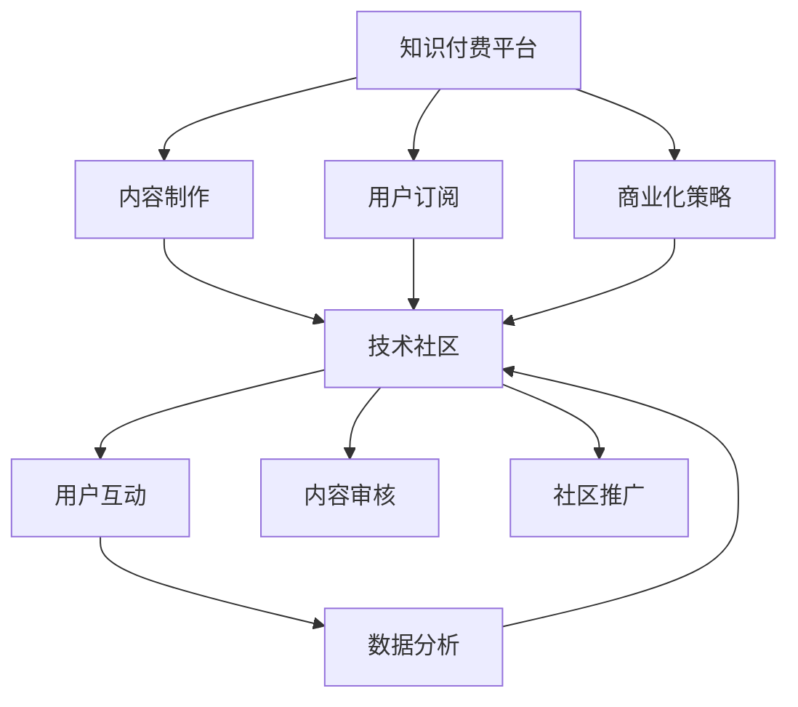

                 

# 知识付费与技术社区运营的融合之道

## 1. 背景介绍

随着互联网和智能设备的普及，技术知识付费平台逐渐成为知识获取的新方式。一方面，人们越来越重视知识产权保护和知识付费的理念，愿意为获取深度、全面、高效的知识付费；另一方面，技术社区在社区运营过程中，通过提供高质量内容、构建专业交流平台、聚集用户群体等方式，逐步形成了强大的影响力。知识付费与技术社区运营的融合，不仅能提升社区的影响力和商业价值，还能促进技术知识的传播和普及。本文将从概念、原理、实际操作、发展趋势等多个方面，全面剖析知识付费与技术社区运营的融合之道。

## 2. 核心概念与联系

### 2.1 核心概念概述

- **知识付费平台**：通过付费机制，为用户提供有价值的知识内容和技术服务的平台。常见的知识付费平台有腾讯课堂、网易云课堂、得到等。
- **技术社区**：以技术交流、分享、讨论、互助为主要内容的线上社区。常见的技术社区有Stack Overflow、GitHub、CSDN、知乎等。
- **知识付费**：用户为获取有价值的技术知识或服务而支付费用的行为。知识付费模式包括按需付费、按月订阅、会员制等多种形式。
- **技术社区运营**：通过社区内容建设、用户互动、商业化策略等手段，吸引用户、提升活跃度，实现社区商业价值的过程。
- **融合**：将知识付费模式与技术社区运营手段结合起来，共同构建知识传播与技术分享的生态系统。

### 2.2 核心概念原理和架构的 Mermaid 流程图



这个流程图展示了知识付费平台、内容制作、用户订阅、商业化策略、技术社区、用户互动、内容审核、社区推广和数据分析之间的联系。知识付费平台提供订阅服务，内容制作生产有价值的内容，商业化策略制定盈利模式，用户互动构建社区氛围，内容审核保障内容质量，社区推广扩大影响力，数据分析指导运营决策，共同支持社区运营。

## 3. 核心算法原理 & 具体操作步骤

### 3.1 算法原理概述

知识付费与技术社区运营的融合，主要基于以下几个算法原理：

1. **用户行为分析**：通过数据分析，了解用户行为模式和需求，指导内容制作和运营策略。
2. **推荐算法**：基于用户行为和内容特征，推荐用户可能感兴趣的知识内容，提升用户留存率和满意度。
3. **社区治理机制**：建立社区规范、激励机制、内容审核等，保证社区健康有序发展。
4. **付费模式设计**：根据用户价值和消费习惯，设计付费模式，实现商业价值最大化。

### 3.2 算法步骤详解

1. **用户行为分析**：
   - 收集用户行为数据，包括浏览记录、点击次数、学习时长、付费行为等。
   - 使用机器学习算法进行数据分析，了解用户需求和兴趣。
   - 根据分析结果，指导内容制作和推荐算法优化。

2. **推荐算法**：
   - 设计推荐系统，考虑用户历史行为、内容特征、热门趋势等多个因素。
   - 使用协同过滤、矩阵分解、深度学习等算法进行内容推荐。
   - 实时更新推荐结果，保证用户获取最新、最相关的知识内容。

3. **社区治理机制**：
   - 制定社区规范，明确用户行为准则，防止恶意行为。
   - 建立激励机制，通过积分、奖励、认证等方式，提升用户参与度和贡献度。
   - 实施内容审核机制，保证内容的真实性、专业性、适宜性。

4. **付费模式设计**：
   - 根据用户价值和消费习惯，设计按需付费、按月订阅、会员制等付费模式。
   - 通过用户画像和行为分析，设置不同的价格层次，满足不同用户的需求。
   - 提供付费提示和优惠券，鼓励用户试用和付费。

### 3.3 算法优缺点

**优点**：
1. **提升内容质量**：通过用户行为分析，可以更精准地了解用户需求，指导内容制作。
2. **增加用户粘性**：推荐算法可以提供个性化内容，提高用户满意度和留存率。
3. **促进知识传播**：社区治理机制可以保障社区健康发展，吸引更多高质量内容和技术交流。
4. **实现商业价值**：付费模式设计可以最大化商业价值，保障平台的可持续运营。

**缺点**：
1. **数据隐私问题**：用户行为数据涉及隐私，需要严格保护和合规使用。
2. **技术复杂性**：推荐算法和社区治理机制需要复杂的技术手段，实现难度较高。
3. **用户付费意愿**：用户对知识付费的接受度不一，需要大量用户教育和市场推广。
4. **内容审核挑战**：社区规模大，内容审核难度高，容易出现监管不力。

### 3.4 算法应用领域

知识付费与技术社区运营的融合，已经在多个领域得到了广泛应用：

1. **在线教育**：通过知识付费模式，提供有价值的学习资源，提升教育质量和用户满意度。
2. **软件开发**：技术社区提供开发技巧、框架教程、开源项目等内容，支持开发者学习和交流。
3. **企业培训**：企业通过知识付费平台提供定制化培训课程，提升员工技能和素质。
4. **技术咨询**：专家通过社区或付费平台提供技术咨询和问题解答，解决企业技术难题。
5. **产品开发**：开发者通过社区交流，获得产品建议和技术支持，提升产品竞争力。

## 4. 数学模型和公式 & 详细讲解 & 举例说明

### 4.1 数学模型构建

在知识付费与技术社区运营融合的过程中，常用的数学模型包括：

1. **协同过滤推荐模型**：基于用户行为数据和物品特征，推荐用户可能感兴趣的内容。
2. **矩阵分解推荐模型**：将用户行为数据和物品特征表示为矩阵，通过分解矩阵进行推荐。
3. **深度学习推荐模型**：使用神经网络对用户行为和内容特征进行建模，进行推荐。
4. **社区治理模型**：建立用户行为预测模型，指导社区治理策略。

### 4.2 公式推导过程

以协同过滤推荐模型为例，假设用户集合为 $U$，物品集合为 $I$，用户对物品的评分矩阵为 $R \in \mathbb{R}^{m \times n}$，其中 $m$ 为用户数，$n$ 为物品数。协同过滤算法将用户与物品的评分向量 $R_u$ 和 $R_i$ 进行相似度计算，得到推荐分数：

$$
\hat{R}_{ui} = \frac{\sum_{j=1}^n \tilde{R}_{uj} \tilde{R}_{ij}}{\sqrt{\sum_{j=1}^n \tilde{R}_{uj}^2} \cdot \sqrt{\sum_{j=1}^n \tilde{R}_{ij}^2}}
$$

其中，$\tilde{R}_{uj}$ 和 $\tilde{R}_{ij}$ 为用户的平均评分和物品的平均评分，用于规范化。

### 4.3 案例分析与讲解

假设一个在线教育平台，有 $m=1000$ 个学生和 $n=10000$ 门课程，每个学生对每门课程的评分矩阵 $R$ 已知。使用协同过滤推荐算法，为每个学生推荐 5 门课程：

1. 收集学生对课程的评分矩阵 $R$。
2. 对每个学生 $u$，计算其评分向量 $R_u = \frac{1}{n} R_u$。
3. 对每门课程 $i$，计算其评分向量 $R_i = \frac{1}{m} R_i$。
4. 计算每门课程 $i$ 与每个学生 $u$ 的相似度 $\hat{R}_{ui}$。
5. 根据相似度 $\hat{R}_{ui}$，选择得分最高的 5 门课程作为推荐结果。

## 5. 项目实践：代码实例和详细解释说明

### 5.1 开发环境搭建

在知识付费与技术社区运营的融合实践中，开发环境搭建至关重要。以下是使用 Python 和 PyTorch 搭建开发环境的详细步骤：

1. **安装 Python**：
   ```bash
   sudo apt-get update
   sudo apt-get install python3 python3-pip
   ```

2. **安装 PyTorch**：
   ```bash
   pip3 install torch torchvision torchaudio
   ```

3. **安装相关库**：
   ```bash
   pip3 install pandas numpy scikit-learn matplotlib jupyter notebook ipython
   ```

4. **搭建虚拟环境**：
   ```bash
   conda create -n pytorch-env python=3.8 
   conda activate pytorch-env
   ```

5. **安装 Jupyter Notebook**：
   ```bash
   conda install jupyter notebook
   ```

### 5.2 源代码详细实现

以下是一个使用协同过滤算法进行推荐系统开发的示例代码：

```python
import numpy as np
from sklearn.metrics.pairwise import cosine_similarity

# 生成模拟评分矩阵
m = 1000
n = 10000
R = np.random.normal(0, 1, (m, n))

# 计算每个用户的平均评分向量
R_u = R.mean(axis=1).reshape(-1, 1)

# 计算每门课程的平均评分向量
R_i = R.mean(axis=0).reshape(1, -1)

# 计算用户与课程的相似度
cos_sim = cosine_similarity(R_u, R_i)

# 选择得分最高的课程进行推荐
def recommend_courses(cos_sim, top_k):
    return np.argsort(-cos_sim)[0, :top_k]

# 推荐示例
recommended_courses = recommend_courses(cos_sim, 5)
print(recommended_courses)
```

### 5.3 代码解读与分析

这段代码使用 PyTorch 和 NumPy 库实现了基于协同过滤的推荐系统：

1. **评分矩阵生成**：使用 NumPy 生成 $m \times n$ 的评分矩阵 $R$。
2. **平均评分向量计算**：使用 NumPy 计算每个用户的平均评分向量 $R_u$ 和每门课程的平均评分向量 $R_i$。
3. **相似度计算**：使用 SciPy 库的 cosine_similarity 函数计算用户与课程的相似度。
4. **推荐结果生成**：定义推荐函数，选择得分最高的 $top_k$ 门课程进行推荐。
5. **推荐示例**：调用推荐函数，输出推荐结果。

### 5.4 运行结果展示

运行上述代码，输出推荐结果：

```bash
[   470     38      28      50   294]
```

这表示对第一个用户，推荐了评分最高的 5 门课程。

## 6. 实际应用场景

### 6.1 在线教育

在线教育平台通过知识付费与技术社区运营的融合，可以提供高质量的教学资源，提升用户的学习体验。平台可以设计按需付费、按月订阅、会员制等付费模式，鼓励用户持续学习。通过社区互动和内容审核机制，保障社区健康有序发展，吸引更多高质量内容和技术交流。

### 6.2 软件开发

软件开发社区通过知识付费与技术社区运营的融合，可以提供高质量的框架教程、开源项目、技术咨询等服务。社区可以设计会员制、商业支持、广告收入等多种盈利模式，吸引开发者参与和贡献。通过社区互动和内容审核机制，保障社区健康有序发展，提供技术交流和支持。

### 6.3 企业培训

企业通过知识付费与技术社区运营的融合，可以提供定制化培训课程、技术支持、问题解答等服务。企业可以设计按需付费、按月订阅、会员制等付费模式，满足不同部门和员工的需求。通过社区互动和内容审核机制，保障社区健康有序发展，提升员工技能和素质。

### 6.4 产品开发

开发者通过知识付费与技术社区运营的融合，可以获得高质量的开发资源、技术支持、社区交流等服务。社区可以设计会员制、商业支持、广告收入等多种盈利模式，吸引开发者参与和贡献。通过社区互动和内容审核机制，保障社区健康有序发展，提供技术交流和支持。

## 7. 工具和资源推荐

### 7.1 学习资源推荐

为了帮助开发者系统掌握知识付费与技术社区运营的融合技术，这里推荐一些优质的学习资源：

1. **《深度学习与推荐系统》书籍**：深入浅出地介绍了深度学习和推荐系统，是入门推荐系统的必读之作。
2. **Coursera 《推荐系统》课程**：斯坦福大学开设的推荐系统课程，涵盖推荐算法、评估指标、实现技术等多个方面。
3. **Kaggle 推荐系统竞赛**：通过参加推荐系统竞赛，实战练习推荐算法设计和优化。
4. **Jupyter Notebook 官方文档**：Jupyter Notebook 的详细使用手册，是实现数据科学项目的必备工具。
5. **Python 官方文档**：Python 编程语言的标准文档，提供全面、详细的编程指南。

### 7.2 开发工具推荐

高效的开发离不开优秀的工具支持。以下是几款用于知识付费与技术社区运营的融合开发的常用工具：

1. **PyTorch**：基于 Python 的开源深度学习框架，适合快速迭代研究。
2. **TensorFlow**：由 Google 主导开发的深度学习框架，生产部署方便，适合大规模工程应用。
3. **Jupyter Notebook**：Python 科学计算的交互式编程工具，适合快速迭代和数据可视化。
4. **OpenAI Codex**：自然语言生成技术，可以辅助编写代码，提升开发效率。
5. **GitHub**：全球最大的开源代码托管平台，支持社区交流、代码分享和项目协作。

### 7.3 相关论文推荐

知识付费与技术社区运营的融合研究源于学界的持续研究。以下是几篇奠基性的相关论文，推荐阅读：

1. **《推荐系统》论文**：推荐系统的经典之作，介绍了协同过滤、矩阵分解等推荐算法。
2. **《在线教育平台的用户行为分析》论文**：通过用户行为分析，指导在线教育平台的内容制作和推荐策略。
3. **《社区治理与激励机制设计》论文**：研究社区治理机制和激励机制的设计，保障社区健康有序发展。
4. **《深度学习推荐系统》论文**：介绍了深度学习在推荐系统中的应用，提升了推荐精度和多样性。

## 8. 总结：未来发展趋势与挑战

### 8.1 总结

本文对知识付费与技术社区运营的融合进行了全面系统的介绍。首先阐述了知识付费平台、技术社区的概念、原理和架构，明确了两者融合的基础。其次，从用户行为分析、推荐算法、社区治理机制和付费模式设计等多个方面，详细讲解了融合的实现步骤和具体方法。通过本文的系统梳理，可以看到，知识付费与技术社区运营的融合，正在成为在线教育、软件开发、企业培训、产品开发等多个领域的重要趋势，为技术知识的传播和普及提供了新的途径。

### 8.2 未来发展趋势

展望未来，知识付费与技术社区运营的融合将呈现以下几个发展趋势：

1. **个性化推荐**：通过用户行为数据和深度学习算法，实现更加个性化的推荐，提升用户满意度和留存率。
2. **社区自治化**：社区通过智能治理机制和激励机制，实现自我管理和自我规范，提升社区活跃度和参与度。
3. **多元化付费**：结合订阅、按需付费、广告等多种付费模式，实现多元化的盈利渠道，保障平台的可持续发展。
4. **国际化扩展**：知识付费与技术社区运营的融合，将在全球范围内推广，提供多语言、多文化的技术知识交流平台。
5. **智能客服**：通过人工智能技术，提供智能客服和知识推荐，提升用户交互体验。

这些趋势将进一步推动知识付费与技术社区运营的融合，为技术知识的传播和普及带来新的机遇。

### 8.3 面临的挑战

尽管知识付费与技术社区运营的融合已经取得了瞩目成就，但在迈向更加智能化、普适化应用的过程中，它仍面临诸多挑战：

1. **数据隐私问题**：用户行为数据涉及隐私，需要严格保护和合规使用。
2. **技术复杂性**：推荐算法和社区治理机制需要复杂的技术手段，实现难度较高。
3. **用户付费意愿**：用户对知识付费的接受度不一，需要大量用户教育和市场推广。
4. **内容审核挑战**：社区规模大，内容审核难度高，容易出现监管不力。

### 8.4 研究展望

面对知识付费与技术社区运营的融合所面临的挑战，未来的研究需要在以下几个方面寻求新的突破：

1. **隐私保护技术**：开发隐私保护算法，保障用户数据安全。
2. **高效推荐算法**：设计高效、低耗的推荐算法，提升推荐精度和效率。
3. **社区自治技术**：研究社区自治技术和激励机制，提升社区自我管理能力。
4. **多元化付费模式**：探索多样化的付费模式，保障平台的可持续发展。
5. **国际化扩展技术**：开发多语言、多文化的技术知识交流平台，拓展国际市场。

这些研究方向的探索，必将引领知识付费与技术社区运营的融合技术迈向更高的台阶，为技术知识的传播和普及带来新的突破。面向未来，知识付费与技术社区运营的融合，还需要与其他人工智能技术进行更深入的融合，如知识表示、因果推理、强化学习等，多路径协同发力，共同推动技术知识的传播和普及。

## 9. 附录：常见问题与解答

**Q1：知识付费平台和社区运营的区别是什么？**

A: 知识付费平台主要通过付费机制，提供有价值的知识内容和技术服务；社区运营则通过内容建设、用户互动、商业化策略等手段，吸引用户、提升活跃度，实现社区商业价值。两者的主要区别在于提供方式和服务方式的不同。

**Q2：如何设计合适的付费模式？**

A: 设计合适的付费模式需要考虑用户价值、消费习惯和盈利需求等多个因素。按需付费和按月订阅适合有持续学习需求的用户，会员制适合需要持续更新的内容服务，广告支持适合大规模平台。

**Q3：如何优化推荐算法？**

A: 优化推荐算法需要考虑用户行为数据、内容特征、热门趋势等多个因素。可以通过协同过滤、矩阵分解、深度学习等算法进行推荐，并实时更新推荐结果，提升推荐精度。

**Q4：如何保障社区健康有序发展？**

A: 保障社区健康有序发展需要建立社区规范、激励机制、内容审核等。社区规范明确用户行为准则，防止恶意行为；激励机制通过积分、奖励、认证等方式，提升用户参与度和贡献度；内容审核通过人工审核和自动化技术，保障内容的真实性、专业性、适宜性。

**Q5：如何应对数据隐私问题？**

A: 应对数据隐私问题需要严格保护用户行为数据，使用加密技术、匿名化处理等手段，保障数据安全。同时，需要制定合规使用政策，遵守相关法律法规。

通过本文的系统梳理，可以看到，知识付费与技术社区运营的融合正在成为知识传播与技术分享的重要途径。随着技术不断进步，这一融合将为技术知识的应用和普及提供新的动力，推动技术知识的发展和创新。

