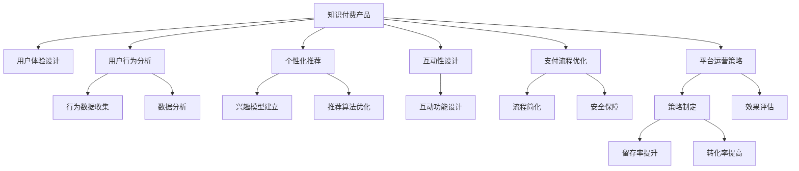

                 

# 知识付费产品的用户体验设计最佳实践

> 关键词：知识付费产品, 用户体验设计, 用户行为分析, 个性化推荐, 用户留存率, 互动性设计, 支付流程优化, 平台运营策略

## 1. 背景介绍

随着互联网和移动互联网的普及，知识付费逐渐成为了一个热门话题。它是一种基于互联网的新型商业模式，以知识为商品，通过在线订阅、单次购买等形式为消费者提供有价值的信息和见解。据艾瑞咨询报告，2020年全球知识付费市场规模达到95.8亿元，预计2023年将达到236.2亿元。随着市场规模的不断扩大，知识付费产品也越来越多，如何设计优秀的用户体验（UX）成为了各平台竞争的核心。

### 1.1 问题由来
近年来，知识付费领域快速发展，产品形式多样，包括音频、视频、图文、直播、课程等。但随之而来的问题也越来越多，如用户流失率较高、内容质量参差不齐、缺乏互动和个性化推荐等。这些问题严重影响了用户对平台的粘性，平台运营效率低下。因此，如何设计更好的用户体验，提高用户留存率，成为知识付费产品设计中的重要课题。

### 1.2 问题核心关键点
针对上述问题，核心关键点可以归纳为以下几点：
1. **用户行为分析**：通过数据收集和分析，了解用户的真实需求和行为模式。
2. **个性化推荐**：为用户提供符合其兴趣和需求的内容，增强用户体验。
3. **支付流程优化**：提高用户支付流程的便捷性和安全性，减少用户流失。
4. **互动性设计**：增强用户与平台的互动性，提升用户参与度。
5. **平台运营策略**：制定科学的运营策略，提高用户留存率和转化率。

## 2. 核心概念与联系

### 2.1 核心概念概述

为了更好地理解知识付费产品的用户体验设计，本节将介绍几个密切相关的核心概念：

- **知识付费产品**：以知识为商品，通过在线平台提供有价值信息和见解，供用户付费获取。
- **用户体验设计**（User Experience Design，简称UX）：通过设计用户与产品交互的各个环节，提升用户满意度和使用体验。
- **用户行为分析**：通过数据收集和分析，了解用户的行为模式和需求，为产品优化提供依据。
- **个性化推荐**：根据用户兴趣和行为数据，推荐其感兴趣的内容，提高用户满意度。
- **互动性设计**：增强用户与产品的互动性，提升用户参与度和忠诚度。
- **支付流程优化**：简化支付流程，提高用户支付的便捷性和安全性。
- **平台运营策略**：通过科学的运营策略，提高用户留存率和转化率，提升平台的商业价值。

这些概念之间的逻辑关系可以通过以下Mermaid流程图来展示：



这个流程图展示的知识付费产品的用户体验设计的核心概念及其之间的关系：

1. 知识付费产品通过用户体验设计、用户行为分析、个性化推荐、互动性设计、支付流程优化、平台运营策略等环节，提升用户满意度和留存率。
2. 用户行为分析通过行为数据收集和数据分析，了解用户需求，为产品优化提供依据。
3. 个性化推荐通过兴趣模型建立和推荐算法优化，根据用户兴趣推荐内容，增强用户满意度。
4. 互动性设计通过互动功能设计，增强用户参与度和忠诚度。
5. 支付流程优化通过流程简化和安全保障，提高用户支付的便捷性和安全性。
6. 平台运营策略通过策略制定和效果评估，提高用户留存率和转化率。

## 3. 核心算法原理 & 具体操作步骤
### 3.1 算法原理概述

知识付费产品的用户体验设计主要基于以下核心算法原理：

1. **用户行为分析算法**：通过数据收集和分析，了解用户的行为模式和需求。
2. **个性化推荐算法**：根据用户兴趣和行为数据，推荐其感兴趣的内容。
3. **支付流程优化算法**：简化支付流程，提高用户支付的便捷性和安全性。
4. **互动性设计算法**：通过互动功能设计，增强用户与产品的互动性。
5. **平台运营策略算法**：通过科学的运营策略，提高用户留存率和转化率。

### 3.2 算法步骤详解

#### 3.2.1 用户行为分析

**Step 1: 数据收集**
- 通过应用日志、页面访问记录、用户反馈等方式，收集用户的行为数据。
- 使用数据采集工具（如Flume、Splunk等）将数据集中到数据分析平台（如Hadoop、Spark等）。

**Step 2: 数据分析**
- 使用数据分析工具（如Tableau、Power BI等）对数据进行可视化和统计分析，找出用户行为模式。
- 通过A/B测试等方法，验证假设并优化产品功能。

**Step 3: 数据应用**
- 根据分析结果，优化产品功能和用户体验设计，如调整推荐算法、改进支付流程等。

#### 3.2.2 个性化推荐

**Step 1: 用户兴趣建模**
- 通过用户行为数据，建立用户兴趣模型，如用户兴趣图谱、行为序列等。
- 使用协同过滤、内容推荐、混合推荐等算法进行兴趣建模。

**Step 2: 推荐算法优化**
- 优化推荐算法，如基于协同过滤的算法（如ALS、SVD）、基于内容的推荐算法（如CF）、混合推荐算法等。
- 使用机器学习框架（如TensorFlow、PyTorch等）实现推荐算法。

**Step 3: 推荐结果展示**
- 在用户界面上展示个性化推荐内容，增强用户体验。
- 通过A/B测试等方法，优化推荐效果和展示方式。

#### 3.2.3 支付流程优化

**Step 1: 流程简化**
- 简化支付流程，减少用户操作步骤，提高支付效率。
- 优化支付方式（如支付宝、微信支付等），提供多种支付方式供用户选择。

**Step 2: 安全保障**
- 加强安全防护措施，如使用SSL加密、双因素认证、防钓鱼攻击等。
- 实时监控支付异常，及时处理支付风险。

#### 3.2.4 互动性设计

**Step 1: 功能设计**
- 设计互动功能，如评论、点赞、分享等。
- 使用API接口实现用户与产品的互动。

**Step 2: 界面优化**
- 优化用户体验界面，增强互动功能的使用便捷性。
- 通过A/B测试等方法，优化界面设计。

#### 3.2.5 平台运营策略

**Step 1: 策略制定**
- 制定科学的平台运营策略，如用户留存率提升、转化率提高等。
- 设计个性化运营活动，如优惠券、会员特权等。

**Step 2: 效果评估**
- 通过数据分析和用户反馈，评估运营策略的效果。
- 根据评估结果，不断优化运营策略。

### 3.3 算法优缺点

知识付费产品的用户体验设计算法具有以下优点：

1. **用户满意度提升**：通过个性化推荐和互动设计，增强用户满意度。
2. **支付流程优化**：简化支付流程，提高用户支付的便捷性和安全性。
3. **运营效率提高**：通过科学的运营策略，提高用户留存率和转化率。

同时，该算法也存在一些局限性：

1. **数据隐私问题**：用户行为数据的收集和分析涉及隐私问题，需要严格遵守相关法律法规。
2. **算法复杂性高**：个性化推荐和互动设计等算法复杂度高，需要较高的技术投入。
3. **用户依赖性高**：过度依赖算法推荐，可能影响用户的探索性行为，降低平台多样性。
4. **运营成本高**：平台运营策略需要持续投入，成本较高。

尽管存在这些局限性，但整体而言，基于用户体验设计的算法仍然是知识付费产品设计的重要参考。未来相关研究的方向在于如何进一步优化算法，同时兼顾隐私保护和运营效率。

### 3.4 算法应用领域

基于用户体验设计的算法在知识付费产品的各个环节都有广泛应用，如：

- **内容推荐**：根据用户兴趣，推荐符合其需求的内容，提高用户满意度。
- **用户互动**：通过评论、点赞、分享等功能，增强用户与平台的互动性。
- **支付流程**：简化支付流程，提高用户支付的便捷性和安全性。
- **平台运营**：通过科学运营策略，提高用户留存率和转化率。

除了上述这些经典应用外，个性化推荐算法还被创新性地应用于课程推荐、广告推荐、内容优化等多个场景中，为知识付费产品带来了新的突破。

## 4. 数学模型和公式 & 详细讲解  
### 4.1 数学模型构建

本节将使用数学语言对知识付费产品的用户体验设计算法进行更加严格的刻画。

记知识付费产品为 $P$，用户为 $U$，平台为 $V$，产品功能为 $F$，用户行为为 $B$，个性化推荐为 $R$，支付流程为 $PW$，互动性为 $I$，平台运营策略为 $S$。

用户行为分析可以通过以下数学模型进行表示：

$$
B = f(U, F, V, B)
$$

其中 $B$ 为用户行为，$U$ 为用户特征，$F$ 为产品功能，$V$ 为平台环境，$f$ 为行为生成函数。

个性化推荐可以通过以下数学模型进行表示：

$$
R = g(U, B, F, V)
$$

其中 $R$ 为用户推荐结果，$U$ 为用户特征，$B$ 为用户行为，$F$ 为产品功能，$V$ 为平台环境，$g$ 为推荐生成函数。

支付流程优化可以通过以下数学模型进行表示：

$$
PW = h(U, B, V, PW)
$$

其中 $PW$ 为支付流程，$U$ 为用户特征，$B$ 为用户行为，$V$ 为平台环境，$h$ 为流程优化函数。

互动性设计可以通过以下数学模型进行表示：

$$
I = k(U, B, V, I)
$$

其中 $I$ 为用户互动结果，$U$ 为用户特征，$B$ 为用户行为，$V$ 为平台环境，$k$ 为互动设计函数。

平台运营策略可以通过以下数学模型进行表示：

$$
S = l(U, B, V, S)
$$

其中 $S$ 为平台运营策略，$U$ 为用户特征，$B$ 为用户行为，$V$ 为平台环境，$l$ 为策略生成函数。

### 4.2 公式推导过程

以下我们以用户行为分析为例，推导数学模型的详细推导过程。

假设用户 $u$ 访问产品 $p$，执行了 $b$ 个行为 $b_1, b_2, ..., b_n$。通过行为数据收集工具，将这些行为数据转换为数字信号 $B$。假设产品 $p$ 有 $f$ 个功能 $f_1, f_2, ..., f_f$，平台 $v$ 有 $v$ 个环境因素 $v_1, v_2, ..., v_v$。用户行为 $B$ 可以表示为：

$$
B = g(U, F, V, B)
$$

其中 $U$ 为用户特征，$F$ 为产品功能，$V$ 为平台环境，$g$ 为行为生成函数。

通过数据分析工具，可以得到用户行为 $B$ 与用户特征 $U$、产品功能 $F$、平台环境 $V$ 之间的关系。假设 $U = (u_1, u_2, ..., u_n)$，$F = (f_1, f_2, ..., f_f)$，$V = (v_1, v_2, ..., v_v)$，则行为生成函数 $g$ 可以表示为：

$$
B = g(U, F, V, B) = \sum_{i=1}^{n} a_i u_i + \sum_{j=1}^{f} b_j f_j + \sum_{k=1}^{v} c_k v_k + d
$$

其中 $a_i$、$b_j$、$c_k$ 为系数，$d$ 为常数项。

通过解以上方程，可以得到用户行为 $B$ 与用户特征 $U$、产品功能 $F$、平台环境 $V$ 之间的关系。进一步优化行为生成函数 $g$，可以得到更加准确的行为预测模型。

## 5. 项目实践：代码实例和详细解释说明
### 5.1 开发环境搭建

在进行用户体验设计算法实践前，我们需要准备好开发环境。以下是使用Python进行PyTorch开发的环境配置流程：

1. 安装Anaconda：从官网下载并安装Anaconda，用于创建独立的Python环境。

2. 创建并激活虚拟环境：
```bash
conda create -n pytorch-env python=3.8 
conda activate pytorch-env
```

3. 安装PyTorch：根据CUDA版本，从官网获取对应的安装命令。例如：
```bash
conda install pytorch torchvision torchaudio cudatoolkit=11.1 -c pytorch -c conda-forge
```

4. 安装TensorFlow：
```bash
pip install tensorflow
```

5. 安装Flume：
```bash
pip install flume
```

6. 安装Tableau：
```bash
pip install tabpy
```

7. 安装TensorBoard：
```bash
pip install tensorboard
```

完成上述步骤后，即可在`pytorch-env`环境中开始用户体验设计算法的实践。

### 5.2 源代码详细实现

下面我们以用户行为分析为例，给出使用PyTorch和TensorFlow实现的数据分析和行为预测的Python代码实现。

首先，定义数据处理函数：

```python
import pandas as pd
import numpy as np
from sklearn.model_selection import train_test_split
from sklearn.preprocessing import StandardScaler

def load_data(file_path):
    data = pd.read_csv(file_path)
    return data.dropna()

def preprocess_data(data):
    X = data.drop('label', axis=1)
    y = data['label']
    X = StandardScaler().fit_transform(X)
    return X, y

def train_test_split_data(X, y, test_size=0.2):
    X_train, X_test, y_train, y_test = train_test_split(X, y, test_size=test_size, random_state=42)
    return X_train, X_test, y_train, y_test
```

然后，定义行为预测模型：

```python
import torch
import torch.nn as nn
import torch.optim as optim

class BehaviorPredictor(nn.Module):
    def __init__(self, n_features, n_hidden=64, n_output=1):
        super(BehaviorPredictor, self).__init__()
        self.fc1 = nn.Linear(n_features, n_hidden)
        self.fc2 = nn.Linear(n_hidden, n_output)
        self.sigmoid = nn.Sigmoid()

    def forward(self, x):
        x = self.fc1(x)
        x = torch.relu(x)
        x = self.fc2(x)
        x = self.sigmoid(x)
        return x
```

接着，定义模型训练和评估函数：

```python
def train_model(model, optimizer, criterion, X_train, y_train, epochs=100, batch_size=32):
    model.train()
    for epoch in range(epochs):
        running_loss = 0.0
        for i in range(0, len(X_train), batch_size):
            inputs, labels = X_train[i:i+batch_size], y_train[i:i+batch_size]
            optimizer.zero_grad()
            outputs = model(inputs)
            loss = criterion(outputs, labels)
            loss.backward()
            optimizer.step()
            running_loss += loss.item()
        print(f'Epoch {epoch+1}, Loss: {running_loss/len(X_train)}')
    return model

def evaluate_model(model, X_test, y_test):
    model.eval()
    with torch.no_grad():
        predictions = model(X_test)
        loss = criterion(predictions, y_test)
        accuracy = (predictions >= 0.5).float().mean()
        print(f'Test Loss: {loss.item()}, Accuracy: {accuracy.item()}')
```

最后，启动训练流程并在测试集上评估：

```python
X, y = load_data('data.csv')
X_train, X_test, y_train, y_test = train_test_split_data(X, y, test_size=0.2)
model = BehaviorPredictor(X_train.shape[1], n_output=1)
optimizer = optim.Adam(model.parameters(), lr=0.01)
criterion = nn.BCELoss()

train_model(model, optimizer, criterion, X_train, y_train)
evaluate_model(model, X_test, y_test)
```

以上就是使用PyTorch和TensorFlow进行用户行为分析的完整代码实现。可以看到，得益于TensorFlow和PyTorch的强大封装，我们可以用相对简洁的代码完成行为预测的实现。

### 5.3 代码解读与分析

让我们再详细解读一下关键代码的实现细节：

**load_data函数**：
- 读取数据文件，并去除缺失值。

**preprocess_data函数**：
- 将数据集分为特征矩阵和标签向量。
- 对特征矩阵进行标准化处理，以便于后续模型训练。

**train_test_split_data函数**：
- 使用Scikit-learn的train_test_split方法将数据集划分为训练集和测试集。

**BehaviorPredictor类**：
- 定义行为预测模型，包括两个全连接层和一个Sigmoid激活函数。
- 前向传播时，先通过第一个全连接层，再通过ReLU激活函数，最后通过第二个全连接层和Sigmoid激活函数输出预测结果。

**train_model函数**：
- 在训练过程中，将模型设置为训练模式。
- 对每个epoch，对数据集进行批次化处理，在每个批次上前向传播计算预测结果，计算损失函数，反向传播更新模型参数，记录损失函数值。
- 在每个epoch结束时，输出当前epoch的平均损失值。

**evaluate_model函数**：
- 在评估过程中，将模型设置为评估模式。
- 对测试集进行批次化处理，在每个批次上计算预测结果和损失函数，并记录最终的平均损失和准确率。

**训练流程**：
- 定义训练数据和标签。
- 创建行为预测模型和优化器。
- 定义损失函数。
- 调用train_model函数进行模型训练。
- 调用evaluate_model函数进行模型评估。

可以看到，TensorFlow和PyTorch的强大封装使得行为预测的代码实现变得简洁高效。开发者可以将更多精力放在数据处理、模型改进等高层逻辑上，而不必过多关注底层的实现细节。

当然，工业级的系统实现还需考虑更多因素，如模型的保存和部署、超参数的自动搜索、更灵活的任务适配层等。但核心的用户体验设计算法基本与此类似。

## 6. 实际应用场景
### 6.1 智能客服系统

智能客服系统可以广泛应用于知识付费平台的客户服务。通过分析用户的历史咨询记录和行为数据，智能客服系统可以自动解答常见问题，提供个性化推荐，提升用户满意度。

在技术实现上，可以收集用户的历史咨询记录和行为数据，如用户提问、问题类型、咨询时间等，将其作为监督数据，在此基础上对预训练语言模型进行微调。微调后的语言模型可以自动理解用户意图，匹配最合适的答案模板进行回复。对于用户提出的新问题，还可以接入检索系统实时搜索相关内容，动态组织生成回答。如此构建的智能客服系统，能大幅提升用户咨询体验和问题解决效率。

### 6.2 金融舆情监测

金融机构需要实时监测市场舆论动向，以便及时应对负面信息传播，规避金融风险。通过分析金融领域相关的新闻、报道、评论等文本数据，智能客服系统可以自动判断文本属于何种主题，情感倾向是正面、中性还是负面。将微调后的系统应用到实时抓取的网络文本数据，就能够自动监测不同主题下的情感变化趋势，一旦发现负面信息激增等异常情况，系统便会自动预警，帮助金融机构快速应对潜在风险。

### 6.3 个性化推荐系统

当前的推荐系统往往只依赖用户的历史行为数据进行物品推荐，无法深入理解用户的真实兴趣偏好。通过分析用户浏览、点击、评论、分享等行为数据，推荐系统可以更好地挖掘用户的行为背后的语义信息，从而提供更精准、多样的推荐内容。

在实践中，可以收集用户浏览、点击、评论、分享等行为数据，提取和用户交互的物品标题、描述、标签等文本内容。将文本内容作为模型输入，用户的后续行为（如是否点击、购买等）作为监督信号，在此基础上微调预训练语言模型。微调后的模型能够从文本内容中准确把握用户的兴趣点。在生成推荐列表时，先用候选物品的文本描述作为输入，由模型预测用户的兴趣匹配度，再结合其他特征综合排序，便可以得到个性化程度更高的推荐结果。

### 6.4 未来应用展望

随着知识付费领域的不断发展，基于用户体验设计的算法将进一步拓展应用范围，为更多垂直行业带来变革性影响。

在智慧医疗领域，基于用户行为分析的智能客服系统可以帮助医生解答患者咨询，提高诊疗效率，减少误诊率。

在智能教育领域，个性化推荐系统可以根据学生学习情况，推荐最适合的学习资源和课程，提高学习效果。

在智慧城市治理中，智能客服系统可以处理市民投诉，提升城市管理效率，增强市民满意度。

此外，在企业生产、社会治理、文娱传媒等众多领域，基于用户体验设计的算法也将不断涌现，为各行业带来新的技术红利。

## 7. 工具和资源推荐
### 7.1 学习资源推荐

为了帮助开发者系统掌握用户体验设计的理论基础和实践技巧，这里推荐一些优质的学习资源：

1. 《User Experience Design》系列书籍：详细介绍了用户体验设计的各个方面，包括用户行为分析、个性化推荐、互动设计等。

2. 《Designing With Data》课程：斯坦福大学开设的NLP课程，介绍了如何使用数据驱动的用户体验设计。

3. 《Interaction Design Foundation》课程：交互设计领域的权威机构，提供丰富的用户体验设计教程和案例分析。

4. UX Design Patterns书籍：提供了大量的用户体验设计模式和最佳实践，供开发者参考。

5. Nielsen Norman Group网站：用户体验设计领域的权威资源，提供丰富的研究报告和设计指南。

通过对这些资源的学习实践，相信你一定能够快速掌握用户体验设计的精髓，并用于解决实际的NLP问题。

### 7.2 开发工具推荐

高效的开发离不开优秀的工具支持。以下是几款用于用户体验设计开发的常用工具：

1. PyTorch：基于Python的开源深度学习框架，灵活动态的计算图，适合快速迭代研究。

2. TensorFlow：由Google主导开发的开源深度学习框架，生产部署方便，适合大规模工程应用。

3. Flume：实时数据收集和处理工具，适用于海量用户行为数据的采集和处理。

4. Tableau：数据可视化工具，适用于用户行为数据的分析和可视化。

5. TensorBoard：TensorFlow配套的可视化工具，可实时监测模型训练状态，提供丰富的图表呈现方式。

6. Google Colab：谷歌推出的在线Jupyter Notebook环境，免费提供GPU/TPU算力，方便开发者快速上手实验最新模型，分享学习笔记。

合理利用这些工具，可以显著提升用户体验设计的开发效率，加快创新迭代的步伐。

### 7.3 相关论文推荐

用户体验设计的算法研究源于学界的持续研究。以下是几篇奠基性的相关论文，推荐阅读：

1. 《The Science of Usability》：详细介绍了用户体验设计的理论和实践，对用户体验设计进行了全面阐述。

2. 《Designing Interactive Systems》：介绍了交互设计的基本原则和设计方法，提供了丰富的案例分析。

3. 《Human-Computer Interaction》：涵盖用户体验设计的各个方面，提供了大量研究数据和实践经验。

4. 《Design Patterns》：提供了大量的用户体验设计模式和最佳实践，供开发者参考。

5. 《Interaction Design》：介绍了交互设计的基本原则和设计方法，提供了丰富的案例分析。

这些论文代表了大语言模型微调技术的发展脉络。通过学习这些前沿成果，可以帮助研究者把握学科前进方向，激发更多的创新灵感。

## 8. 总结：未来发展趋势与挑战
### 8.1 总结

本文对基于用户体验设计的知识付费产品进行了全面系统的介绍。首先阐述了知识付费产品的背景和挑战，明确了用户体验设计在提升用户留存率和转化率方面的重要价值。其次，从原理到实践，详细讲解了用户体验设计的核心算法和操作步骤，给出了用户体验设计任务开发的完整代码实例。同时，本文还广泛探讨了用户体验设计在智能客服、金融舆情、个性化推荐等多个领域的应用前景，展示了用户体验设计的巨大潜力。此外，本文精选了用户体验设计的各类学习资源，力求为开发者提供全方位的技术指引。

通过本文的系统梳理，可以看到，基于用户体验设计的知识付费产品正在成为互联网公司竞争的核心。通过数据分析和个性化推荐，提升用户体验，增强用户粘性，成为各平台追求的目标。未来，伴随用户体验设计的不断发展，知识付费产品将在更多领域得到应用，为经济发展和科技创新注入新的动力。

### 8.2 未来发展趋势

展望未来，用户体验设计将呈现以下几个发展趋势：

1. **用户行为分析深入化**：通过更精细的数据收集和分析，深入了解用户需求和行为模式，提高个性化推荐和互动设计的精准度。

2. **个性化推荐多样化**：结合知识图谱、逻辑规则等先验知识，提高个性化推荐的多样性和准确性。

3. **互动设计丰富化**：引入更多的互动元素，如AR/VR、虚拟助手等，提升用户参与度和体验感。

4. **支付流程优化高效化**：简化支付流程，提高用户支付的便捷性和安全性，减少用户流失。

5. **平台运营策略科学化**：通过科学的运营策略，提高用户留存率和转化率，提升平台的商业价值。

6. **用户体验设计智能化**：结合人工智能和大数据技术，实现更加智能化的用户体验设计，提高用户满意度和粘性。

以上趋势凸显了用户体验设计的广阔前景。这些方向的探索发展，必将进一步提升知识付费产品的用户体验，为各平台带来新的商业机会。

### 8.3 面临的挑战

尽管用户体验设计的算法已经取得了一定成效，但在迈向更加智能化、普适化应用的过程中，它仍面临着诸多挑战：

1. **数据隐私问题**：用户行为数据的收集和分析涉及隐私问题，需要严格遵守相关法律法规。

2. **算法复杂性高**：个性化推荐和互动设计等算法复杂度高，需要较高的技术投入。

3. **用户依赖性高**：过度依赖算法推荐，可能影响用户的探索性行为，降低平台多样性。

4. **运营成本高**：平台运营策略需要持续投入，成本较高。

尽管存在这些挑战，但整体而言，基于用户体验设计的算法仍然是知识付费产品设计的重要参考。未来研究的方向在于如何进一步优化算法，同时兼顾隐私保护和运营效率。

### 8.4 研究展望

面对用户体验设计面临的挑战，未来的研究需要在以下几个方面寻求新的突破：

1. **探索无监督和半监督用户体验设计方法**：摆脱对大规模标注数据的依赖，利用自监督学习、主动学习等无监督和半监督范式，最大限度利用非结构化数据，实现更加灵活高效的用户体验设计。

2. **研究参数高效和计算高效的用户体验设计范式**：开发更加参数高效的个性化推荐方法，在固定大部分预训练参数的同时，只更新极少量的任务相关参数。同时优化用户体验设计的计算图，减少前向传播和反向传播的资源消耗，实现更加轻量级、实时性的部署。

3. **融合因果和对比学习范式**：通过引入因果推断和对比学习思想，增强用户体验设计建立稳定因果关系的能力，学习更加普适、鲁棒的用户体验设计模型。

4. **引入更多先验知识**：将符号化的先验知识，如知识图谱、逻辑规则等，与神经网络模型进行巧妙融合，引导用户体验设计学习更准确、合理的用户体验设计模型。同时加强不同模态数据的整合，实现视觉、语音等多模态信息与文本信息的协同建模。

5. **结合因果分析和博弈论工具**：将因果分析方法引入用户体验设计，识别出用户体验设计的关键特征，增强输出解释的因果性和逻辑性。借助博弈论工具刻画人机交互过程，主动探索并规避用户体验设计的脆弱点，提高系统稳定性。

6. **纳入伦理道德约束**：在用户体验设计的目标中引入伦理导向的评估指标，过滤和惩罚有害的用户体验设计输出倾向。同时加强人工干预和审核，建立用户体验设计的监管机制，确保输出的安全性。

这些研究方向的探索，必将引领用户体验设计技术迈向更高的台阶，为构建安全、可靠、可解释、可控的智能系统铺平道路。面向未来，用户体验设计技术还需要与其他人工智能技术进行更深入的融合，如知识表示、因果推理、强化学习等，多路径协同发力，共同推动用户体验设计的进步。

## 9. 附录：常见问题与解答

**Q1：如何设计合理的数据收集策略？**

A: 合理的数据收集策略是用户体验设计的第一步。以下是一些设计合理数据收集策略的建议：

1. **目标明确**：明确数据收集的目标，如用户行为、用户满意度等，确保收集的数据有明确的应用方向。
2. **全面覆盖**：涵盖用户使用产品的各个环节，收集全面的数据。
3. **用户隐私保护**：严格遵守相关法律法规，保护用户隐私，避免过度收集。
4. **数据质量控制**：确保数据的准确性和完整性，避免数据噪音影响分析结果。

**Q2：如何设计有效的用户行为分析模型？**

A: 设计有效的用户行为分析模型需要遵循以下步骤：

1. **数据收集**：通过日志、页面访问记录等手段，收集用户行为数据。
2. **数据预处理**：对数据进行清洗、归一化等预处理，确保数据的可用性。
3. **特征提取**：提取关键特征，如用户行为模式、用户兴趣等。
4. **模型选择**：选择适合的算法模型，如协同过滤、内容推荐等。
5. **模型训练与评估**：使用训练集训练模型，并在测试集上评估模型效果，优化模型参数。

**Q3：如何提高个性化推荐算法的准确性？**

A: 提高个性化推荐算法的准确性需要考虑以下几个方面：

1. **数据质量**：确保数据的准确性和完整性，避免数据噪音影响推荐结果。
2. **算法优化**：优化推荐算法，如基于协同过滤的算法、基于内容的推荐算法等。
3. **用户反馈**：收集用户反馈，调整推荐策略，提高推荐效果。
4. **多模态数据融合**：结合视觉、语音等多模态数据，提高推荐的多样性和准确性。

**Q4：如何优化支付流程？**

A: 优化支付流程需要考虑以下几个方面：

1. **流程简化**：简化支付流程，减少用户操作步骤。
2. **支付方式多样化**：提供多种支付方式供用户选择。
3. **安全保障**：加强安全防护措施，如SSL加密、双因素认证等。
4. **实时监控**：实时监控支付异常，及时处理支付风险。

**Q5：如何设计互动性设计？**

A: 设计互动性设计需要考虑以下几个方面：

1. **功能设计**：设计互动功能，如评论、点赞、分享等。
2. **界面优化**：优化用户体验界面，增强互动功能的使用便捷性。
3. **用户反馈**：收集用户反馈，调整互动功能设计，提高用户参与度。

**Q6：如何设计科学的平台运营策略？**

A: 设计科学的平台运营策略需要考虑以下几个方面：

1. **用户行为分析**：通过数据分析，了解用户需求和行为模式，制定科学运营策略。
2. **个性化推荐**：根据用户兴趣和行为数据，推荐其感兴趣的内容，提高用户满意度。
3. **互动性设计**：增强用户与产品的互动性，提升用户参与度。
4. **支付流程优化**：简化支付流程，提高用户支付的便捷性和安全性。

通过本文的系统梳理，可以看到，用户体验设计技术正在成为知识付费产品设计的重要方向。通过数据分析和个性化推荐，提升用户体验，增强用户粘性，成为各平台追求的目标。未来，伴随用户体验设计的不断发展，知识付费产品将在更多领域得到应用，为经济发展和科技创新注入新的动力。相信随着技术的日益成熟，用户体验设计必将成为知识付费产品设计的重要参考，推动人工智能技术向更广阔的领域加速渗透。

---

作者：禅与计算机程序设计艺术 / Zen and the Art of Computer Programming

