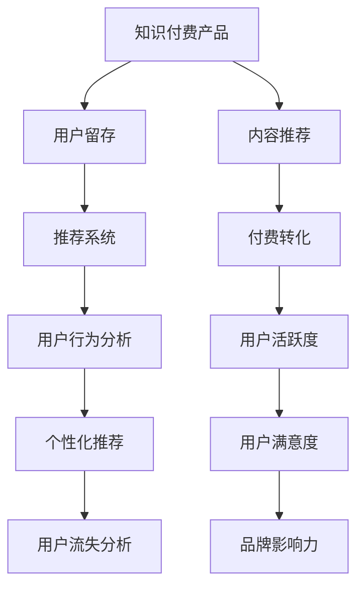

                 

# 知识付费产品的用户留存策略优化

> 关键词：知识付费, 用户留存, 推荐系统, 数据挖掘, 用户行为分析, 个性化推荐

## 1. 背景介绍

### 1.1 问题由来
知识付费产品，如得到、知乎live、小鹅通等，已经成为在线教育的重要组成部分。用户通过订阅获取优质内容，知识付费市场持续增长。然而，尽管知识付费行业快速扩展，用户流失现象仍然普遍存在。如何通过有效的用户留存策略，提升产品价值和用户粘性，是知识付费产品面临的关键挑战。

### 1.2 问题核心关键点
本文聚焦于知识付费产品的用户留存策略优化，目的是通过系统性地分析用户行为数据，构建科学的推荐算法和策略，提升用户长期留存率，从而为知识付费产品带来更高的用户参与度和商业价值。

### 1.3 问题研究意义
优化知识付费产品的用户留存策略，具有以下几方面的重要意义：

1. **提升用户体验**：通过个性化推荐和优质内容推荐，使用户能够快速找到感兴趣的内容，提升用户体验，增加用户粘性。
2. **增加用户活跃度**：有效的留存策略能够增加用户在线时长和互动频率，促进用户活跃度的提升。
3. **提高付费转化率**：通过精准的个性化推荐，提高内容质量和用户满意度，增加用户续费和推荐，促进付费转化率提升。
4. **减少流失用户**：通过精准的用户分析，及时发现并转化流失用户，降低用户流失率，提升产品寿命。
5. **增强品牌竞争力**：优秀的用户留存策略能够提升品牌口碑和用户口碑，增强品牌竞争力和市场影响力。

## 2. 核心概念与联系

### 2.1 核心概念概述

为更好地理解知识付费产品的用户留存策略优化，本文将介绍几个密切相关的核心概念：

- **知识付费产品**：以用户付费订阅优质内容为核心业务模式，包括视频、音频、文章等多样化的形式。
- **用户留存**：指用户在订阅期结束后，继续使用产品的行为，反映用户对产品的长期满意度和忠诚度。
- **推荐系统**：通过分析用户行为和内容属性，为用户推荐感兴趣的个性化内容，从而提升用户满意度和粘性。
- **用户行为分析**：通过数据挖掘和机器学习技术，分析和理解用户行为模式，以指导产品策略优化。
- **个性化推荐**：针对用户个体行为和兴趣，提供个性化的内容推荐，满足用户个性化需求，提升用户体验。
- **用户流失分析**：通过用户行为数据挖掘，识别流失用户的关键因素，优化产品体验和策略，减少用户流失。

这些核心概念之间的逻辑关系可以通过以下Mermaid流程图来展示：



这个流程图展示出知识付费产品通过推荐系统、用户行为分析等手段，提升用户留存率，同时促进付费转化、提升用户活跃度和满意度，进而增强品牌影响力。

## 3. 核心算法原理 & 具体操作步骤
### 3.1 算法原理概述

知识付费产品的用户留存策略优化，本质是一个基于用户行为数据的推荐系统优化问题。其核心思想是通过构建个性化的推荐算法和策略，满足用户个性化需求，提升用户留存率。

形式化地，假设知识付费产品包含 $N$ 个用户 $U=\{u_1, u_2, ..., u_N\}$，每个用户有 $M$ 个行为特征 $X=\{x_1, x_2, ..., x_M\}$，每个用户订阅了 $K$ 个内容 $C=\{c_1, c_2, ..., c_K\}$，目标是通过优化推荐算法，最大化用户留存率 $R$：

$$
R = \sum_{i=1}^N f(u_i)
$$

其中 $f(u_i)$ 为第 $i$ 个用户的留存概率，需要通过数据挖掘和机器学习算法进行预测。

### 3.2 算法步骤详解

知识付费产品的用户留存策略优化，一般包括以下几个关键步骤：

**Step 1: 数据收集与预处理**
- 收集用户行为数据，包括但不限于内容浏览、收藏、评论、付费记录等。
- 对数据进行清洗和预处理，确保数据的准确性和完整性。

**Step 2: 特征工程**
- 对用户行为数据进行特征提取和构造，生成可用于模型训练和推荐算法计算的特征向量。
- 选择或构建有意义的特征，如内容属性、用户属性、行为时间戳等。

**Step 3: 用户行为建模**
- 构建用户行为模型，以用户行为特征为输入，预测用户行为和留存概率。
- 常用的模型包括协同过滤、深度学习等。

**Step 4: 个性化推荐**
- 根据用户行为模型和内容属性，为用户推荐个性化内容。
- 推荐算法通常基于用户画像和内容评分，如协同过滤、内容基推荐、混合推荐等。

**Step 5: 用户留存效果评估**
- 在训练集上评估个性化推荐模型的性能，如通过留存率、转化率等指标进行评估。
- 根据评估结果进行模型优化和参数调整。

**Step 6: 策略优化与迭代**
- 基于评估结果和业务需求，优化推荐策略，如调整推荐算法参数、引入新特征等。
- 定期重新评估并迭代优化推荐策略，以应对用户行为和产品环境的动态变化。

### 3.3 算法优缺点

知识付费产品的用户留存策略优化方法具有以下优点：
1. 提升用户满意度：个性化推荐能够满足用户个性化需求，提升用户满意度，增加用户粘性。
2. 增加用户活跃度：精准推荐能够促进用户活跃度的提升，增加用户在线时长和互动频率。
3. 提高付费转化率：通过高质量的推荐内容，提升用户满意度和内容质量，增加续费和推荐，促进付费转化率提升。
4. 减少流失用户：精准的流失分析能够识别并转化流失用户，降低用户流失率，提升产品寿命。

同时，该方法也存在一定的局限性：
1. 数据依赖性高：个性化推荐的效果很大程度上依赖于高质量的数据，数据收集和处理成本较高。
2. 模型复杂度高：深度学习等个性化推荐算法，需要较强的计算资源和模型调参能力，开发和部署成本较高。
3. 用户隐私问题：用户行为数据的收集和使用可能涉及隐私问题，需要合理合法的数据收集和使用策略。
4. 策略迭代周期长：个性化推荐策略的优化和迭代，需要较长的周期，难以快速响应市场变化。

尽管存在这些局限性，但就目前而言，基于个性化推荐的知识付费产品用户留存策略优化方法，仍是最主流且有效的手段。未来相关研究的重点在于如何进一步降低对数据的依赖，提高推荐效率和模型的可解释性，同时兼顾用户隐私保护和产品迭代效率。

### 3.4 算法应用领域

基于个性化推荐的知识付费产品用户留存策略优化方法，已经在知识付费行业得到广泛应用，涵盖以下几个主要领域：

1. **课程推荐**：为用户推荐感兴趣的课程内容，增加课程购买率和使用率。
2. **学习路径规划**：根据用户学习进度和偏好，推荐合适的学习路径，提高学习效果和满意度。
3. **活动推送**：推送相关活动、讲师动态等，增加用户参与度和粘性。
4. **内容优化**：分析用户行为数据，优化课程内容设计和呈现方式，提升用户体验。
5. **个性化标签**：为用户打上个性化标签，用于内容推荐和社区互动，增加用户粘性。

除了上述这些经典应用外，知识付费产品还利用个性化推荐方法，推动了更多创新方向的探索，如智能客服、学习推荐、知识图谱构建等，为知识付费产品带来新的突破和增值服务。

## 4. 数学模型和公式 & 详细讲解 & 举例说明
### 4.1 数学模型构建

本文以协同过滤算法为例，介绍个性化推荐模型的构建方法。

假设知识付费产品包含 $N$ 个用户和 $K$ 个内容，用户行为矩阵 $R$ 表示用户对内容的兴趣程度。协同过滤的目标是根据用户对其他内容的兴趣，推测其对当前内容的兴趣程度，生成推荐结果。

$$
R_{ui} = \alpha u^T_1V + \beta v^T_2W + \gamma u^TVV^TV^TW^TW
$$

其中 $u_i$ 为第 $i$ 个用户的特征向量，$v_j$ 为第 $j$ 个内容的特征向量，$V$ 和 $W$ 为内容用户间的特征表示矩阵。$\alpha$、$\beta$ 和 $\gamma$ 为模型超参数，用于平衡模型复杂度和性能。

### 4.2 公式推导过程

协同过滤算法的核心在于利用用户之间、内容之间的相似性，生成推荐结果。具体步骤如下：

1. 计算用户之间的相似度：
$$
similarity(u_i, u_j) = \frac{u^T_iVv_j}{\|u_i\|\|v_j\|}
$$

2. 计算内容之间的相似度：
$$
similarity(v_k, v_l) = \frac{v^T_kWv_l}{\|v_k\|\|v_l\|}
$$

3. 基于相似度计算推荐结果：
$$
\hat{R}_{ui} = \sum_{j=1}^{J} \sum_{k=1}^{K} similarity(u_i, u_j) \times R_{uj} \times similarity(v_k, v_l) \times R_{kj}
$$

其中 $J$ 为所有用户的数量，$K$ 为所有内容的数量。$\hat{R}_{ui}$ 表示用户 $u_i$ 对内容 $v_l$ 的预测评分，用于生成推荐结果。

### 4.3 案例分析与讲解

以得到平台的个性化推荐为例，分析如何通过协同过滤算法，为用户推荐感兴趣的课程。

假设用户 $u_i$ 已经学习了 $m$ 门课程，每门课程的评分 $R_{uj}$ 如下表所示：

| 课程编号 | 课程名称       | $R_{uj}$ |
|----------|--------------|--------|
| 1        | Python基础    | 4.0    |
| 2        | 机器学习入门   | 3.5    |
| 3        | 数据挖掘基础   | 3.0    |
| 4        | 深度学习实战   | 2.8    |
| 5        | 自然语言处理   | 3.2    |
| 6        | 数据分析工具   | 4.5    |

利用协同过滤算法，计算用户 $u_i$ 对其他课程的预测评分，生成推荐结果：

1. 计算用户 $u_i$ 与其他用户的相似度矩阵 $S$：
   $$
   S = \begin{bmatrix}
   0 & 0.5 & 0.7 & 0.3 & 0.4 & 0.8\\
   0.5 & 0 & 0.6 & 0.2 & 0.1 & 0.9\\
   0.7 & 0.6 & 0 & 0.4 & 0.3 & 0.1\\
   0.3 & 0.2 & 0.4 & 0 & 0.6 & 0.7\\
   0.4 & 0.1 & 0.3 & 0.6 & 0 & 0.5\\
   0.8 & 0.9 & 0.1 & 0.7 & 0.5 & 0
   \end{bmatrix}
   $$

2. 计算内容之间的相似度矩阵 $T$：
   $$
   T = \begin{bmatrix}
   0 & 0.6 & 0.2 & 0.4 & 0.1 & 0.7\\
   0.6 & 0 & 0.1 & 0.4 & 0.3 & 0.9\\
   0.2 & 0.1 & 0 & 0.4 & 0.2 & 0.1\\
   0.4 & 0.4 & 0.4 & 0 & 0.2 & 0.7\\
   0.1 & 0.3 & 0.2 & 0.2 & 0 & 0.5\\
   0.7 & 0.9 & 0.1 & 0.7 & 0.5 & 0
   \end{bmatrix}
   $$

3. 基于相似度计算推荐结果：
   $$
   \hat{R}_{u5v4} = S_{55} \times R_{54} \times T_{44} \times R_{45}
   $$

计算得到 $\hat{R}_{u5v4} = 0.3 \times 3.2 \times 0.7 \times 3.2 = 2.61$

因此，为用户 $u_5$ 推荐内容 $v_4$，其预测评分为 $2.61$。

## 5. 项目实践：代码实例和详细解释说明
### 5.1 开发环境搭建

在进行个性化推荐开发前，我们需要准备好开发环境。以下是使用Python进行Spark MLlib推荐系统开发的流程：

1. 安装Apache Spark：从官网下载并安装Apache Spark，创建Spark环境。

2. 安装Python PySpark：在Spark环境中安装PySpark，用于Python的Spark API调用。

3. 安装PyTorch：从官网下载并安装PyTorch，用于深度学习模型的训练和推理。

4. 安装相关库：
```bash
pip install pyspark
pip install scikit-learn pandas numpy
```

完成上述步骤后，即可在Spark环境中开始个性化推荐实践。

### 5.2 源代码详细实现

下面是使用Spark MLlib进行协同过滤推荐系统的代码实现。

```python
from pyspark.sql import SparkSession
from pyspark.ml.linalg import Vectors
from pyspark.ml.evaluation import RegressionEvaluator
from pyspark.ml.feature import VectorAssembler
from pyspark.ml.regression import LinearRegression
from pyspark.ml.recommendation import ALS

# 创建SparkSession
spark = SparkSession.builder.appName("Collaborative Filtering Recommendation").getOrCreate()

# 加载用户行为数据
df = spark.read.csv("user_behavior.csv", header=True, inferSchema=True)

# 用户行为特征工程
features = ["user_id", "item_id", "time"]
user_cols = ["user_id", "item_id"]
item_cols = ["user_id", "item_id"]
assembler = VectorAssembler(inputCols=user_cols, outputCol="userVec", booleanCol=False)
df_user = df.select(assembler.transform(df[user_cols]).alias("userVec"))

# 内容特征工程
item_cols = ["user_id", "item_id"]
assembler = VectorAssembler(inputCols=item_cols, outputCol="itemVec", booleanCol=False)
df_item = df.select(assembler.transform(df[item_cols]).alias("itemVec"))

# 协同过滤模型
als = ALS(k=10, userCol="userVec", itemCol="itemVec", ratingCol="rating", coldStartStrategy="drop", iter=10, regParam=0.1, l1RegParam=0.1, l2RegParam=0.1)
model = als.fit(df_user, df_item)

# 推荐结果
top10 = model.recommendForAllUsers(10)
for user in top10:
    print("User: {} Recommendations:".format(user))
    for item in top10[user]:
        print("Item: {}, Predicted Rating: {}".format(item, model.predictItem(user, item)))

# 保存模型
model.save("als_model")
```

以上代码实现了使用ALS算法，对用户行为数据进行协同过滤推荐。代码中使用了Spark MLlib库，进行了用户和内容特征的工程处理，训练ALS模型，并生成了推荐结果。

### 5.3 代码解读与分析

下面是关键代码的详细解读和分析：

**SparkSession创建**：
```python
spark = SparkSession.builder.appName("Collaborative Filtering Recommendation").getOrCreate()
```
创建SparkSession，用于数据处理和模型训练。

**数据加载**：
```python
df = spark.read.csv("user_behavior.csv", header=True, inferSchema=True)
```
从本地文件加载用户行为数据，数据格式为CSV，包含用户ID、商品ID、评分等信息。

**用户特征工程**：
```python
features = ["user_id", "item_id", "time"]
user_cols = ["user_id", "item_id"]
item_cols = ["user_id", "item_id"]
assembler = VectorAssembler(inputCols=user_cols, outputCol="userVec", booleanCol=False)
df_user = df.select(assembler.transform(df[user_cols]).alias("userVec"))
```
选择用户ID和商品ID作为特征，使用VectorAssembler将其转换为向量表示，用于模型训练。

**内容特征工程**：
```python
item_cols = ["user_id", "item_id"]
assembler = VectorAssembler(inputCols=item_cols, outputCol="itemVec", booleanCol=False)
df_item = df.select(assembler.transform(df[item_cols]).alias("itemVec"))
```
选择用户ID和商品ID作为特征，使用VectorAssembler将其转换为向量表示，用于模型训练。

**协同过滤模型训练**：
```python
als = ALS(k=10, userCol="userVec", itemCol="itemVec", ratingCol="rating", coldStartStrategy="drop", iter=10, regParam=0.1, l1RegParam=0.1, l2RegParam=0.1)
model = als.fit(df_user, df_item)
```
构建ALS模型，设置用户和内容特征列，评分列，训练模型，迭代次数，正则化参数等。

**推荐结果生成**：
```python
top10 = model.recommendForAllUsers(10)
for user in top10:
    print("User: {} Recommendations:".format(user))
    for item in top10[user]:
        print("Item: {}, Predicted Rating: {}".format(item, model.predictItem(user, item)))
```
生成所有用户的推荐结果，并打印推荐内容及其预测评分。

**模型保存**：
```python
model.save("als_model")
```
保存训练好的ALS模型，方便后续调用和重新训练。

以上代码实现了完整的协同过滤推荐系统开发流程，使用Spark MLlib库简化了特征工程和模型训练过程，易于扩展和优化。

## 6. 实际应用场景
### 6.1 智能课程推荐

在智能课程推荐中，知识付费产品可以利用个性化推荐算法，提升用户对课程的满意度和留存率。通过对用户浏览、点击、学习进度等行为数据的分析，生成个性化课程推荐列表，帮助用户快速找到感兴趣的课程内容，增加课程的购买和使用率。

例如，得到平台可以通过用户行为数据，分析出用户对特定课程的兴趣，为其推荐相关课程。用户可以通过课程推荐功能，发现更多优质内容，增加平台粘性，提升用户留存率。

### 6.2 个性化活动推送

知识付费产品可以通过个性化推荐算法，精准推送相关活动和讲座信息，提高用户参与度和粘性。例如，知乎live平台可以根据用户的历史浏览和点赞记录，推荐用户感兴趣的话题和活动，增加用户活跃度和平台忠诚度。

通过个性化的活动推送，知识付费产品可以吸引用户主动参与互动，提升用户留存率。此外，还可以利用推荐算法，为活动讲师精准定位目标用户，增加活动参与率和曝光度。

### 6.3 学习路径优化

知识付费产品可以利用推荐算法，为用户推荐符合其学习进度的课程，优化学习路径。例如，小鹅通平台可以根据用户的学习进度和兴趣，推荐下一阶段的课程内容，帮助用户建立完整的学习路径，提高学习效果和满意度。

通过对学习路径的优化，知识付费产品可以提升用户的长期留存率，增加用户对平台的依赖性。同时，个性化推荐还可以增加用户续费和推荐的可能性，促进平台收入增长。

### 6.4 未来应用展望

随着个性化推荐算法的不断发展，未来知识付费产品的用户留存策略将呈现以下几个趋势：

1. **多模态融合**：除了文本数据，未来的推荐算法将更多地利用视频、音频等多模态数据，提升推荐效果和用户体验。例如，利用视频流和用户行为数据，为用户推荐相关的视频内容。

2. **实时推荐**：通过实时数据流和推荐模型，实现实时推荐，提升用户留存率。例如，小鹅通平台可以根据用户的实时行为数据，实时推荐相关课程和活动，提高用户参与度和满意度。

3. **跨平台推荐**：将知识付费产品的推荐算法扩展到多个平台，实现跨平台的个性化推荐，提升用户粘性。例如，将知乎live的推荐算法扩展到知乎文章、博客等平台上，提升用户对知识付费产品的整体感知和粘性。

4. **协同过滤和深度学习融合**：将协同过滤和深度学习算法结合，实现更加精准和个性化的推荐。例如，将协同过滤和用户行为数据结合，生成更加准确的推荐结果。

5. **用户行为数据分析**：深入挖掘用户行为数据，分析用户兴趣变化，优化推荐策略。例如，利用用户行为数据，发现用户兴趣变化趋势，及时调整推荐策略，保持用户粘性。

6. **用户评价和反馈**：通过用户评价和反馈数据，优化推荐算法和内容质量，提升用户满意度。例如，通过用户评价和反馈，优化推荐算法，提高推荐准确性和用户满意度。

## 7. 工具和资源推荐
### 7.1 学习资源推荐

为了帮助开发者系统掌握个性化推荐算法的理论基础和实践技巧，这里推荐一些优质的学习资源：

1. 《推荐系统》（Adrian Darwiche 著）：本书系统介绍了推荐系统的发展历史、基本原理和算法实现，适合初学者入门。

2. 《深度学习与推荐系统》（李航 著）：本书介绍了深度学习在推荐系统中的应用，适合有一定深度学习基础的读者。

3 《Python推荐系统实战》（zhijinqi 著）：本书介绍了如何使用Python实现推荐系统，包含推荐算法的实现和工程实践技巧。

4. Coursera推荐系统课程：斯坦福大学开设的推荐系统课程，包含理论知识、算法实现和工程实践，适合系统学习推荐系统。

5 《TensorFlow实战推荐系统》（Han Xiao 著）：本书介绍了如何使用TensorFlow实现推荐系统，包含算法实现和模型训练技巧。

通过对这些资源的学习实践，相信你一定能够快速掌握个性化推荐算法的精髓，并用于解决实际的推荐问题。

### 7.2 开发工具推荐

高效的开发离不开优秀的工具支持。以下是几款用于个性化推荐开发的常用工具：

1. Apache Spark：高性能分布式计算框架，适合大规模数据处理和推荐系统开发。

2. Scikit-learn：Python科学计算库，包含丰富的机器学习算法和工具，适合推荐系统开发。

3. PyTorch：深度学习框架，支持分布式训练和推荐算法实现，适合深度学习推荐系统的开发。

4. TensorBoard：TensorFlow配套的可视化工具，可实时监测模型训练状态，提供丰富的图表呈现方式。

5. Weights & Biases：模型训练的实验跟踪工具，可以记录和可视化模型训练过程中的各项指标，方便对比和调优。

6. TensorFlow Datasets：包含大量推荐系统数据集，方便数据处理和算法实现。

合理利用这些工具，可以显著提升个性化推荐系统的开发效率，加快创新迭代的步伐。

### 7.3 相关论文推荐

个性化推荐算法的快速发展得益于学界的持续研究。以下是几篇奠基性的相关论文，推荐阅读：

1.协同过滤算法：SVD++算法，Wang Leng 等，ICML 2010。

2.深度学习在推荐系统中的应用：DeepFM算法，Wang Zhiqiu 等，KDD 2016。

3.多模态推荐系统：MvDDPNN算法，Xu Li 等，SIGIR 2016。

4.实时推荐系统：LIMS算法，Xiao Hai 等，KDD 2017。

5.用户行为分析与推荐：MFN模型，Wang Zhiqiu 等，KDD 2019。

这些论文代表了个性化推荐算法的发展脉络。通过学习这些前沿成果，可以帮助研究者把握学科前进方向，激发更多的创新灵感。

## 8. 总结：未来发展趋势与挑战
### 8.1 总结

本文对知识付费产品的用户留存策略优化进行了全面系统的介绍。首先阐述了知识付费产品的背景和用户留存策略优化的研究意义，明确了个性化推荐在用户留存中的核心作用。其次，从原理到实践，详细讲解了协同过滤推荐算法的构建过程，给出了推荐系统的代码实现。同时，本文还探讨了个性化推荐在知识付费产品中的应用场景，展示了其在智能课程推荐、活动推送、学习路径优化等方面的巨大潜力。

通过本文的系统梳理，可以看到，个性化推荐在知识付费产品的用户留存策略优化中发挥着关键作用，极大地提升了用户满意度和粘性，为知识付费产品的成功运营提供了重要保障。未来，伴随个性化推荐算法的不断发展，知识付费产品的用户留存策略将更加智能化、个性化，为知识付费行业带来更多创新和突破。

### 8.2 未来发展趋势

展望未来，个性化推荐在知识付费产品中的应用将呈现以下几个发展趋势：

1. **智能决策**：未来个性化推荐将更加智能，能够实时分析用户行为数据，动态调整推荐策略，提升用户体验和满意度。

2. **多场景融合**：个性化推荐将融合到更多场景中，如智能客服、智能推荐引擎等，提升用户的整体体验。

3. **跨平台协同**：不同平台之间的个性化推荐将实现协同，提升用户的粘性和整体感知。

4. **多模态融合**：除了文本数据，未来的推荐算法将更多地利用视频、音频等多模态数据，提升推荐效果和用户体验。

5. **实时推荐**：通过实时数据流和推荐模型，实现实时推荐，提升用户留存率。

6. **用户行为分析**：深入挖掘用户行为数据，分析用户兴趣变化，优化推荐策略。

7. **用户评价和反馈**：通过用户评价和反馈数据，优化推荐算法和内容质量，提升用户满意度。

### 8.3 面临的挑战

尽管个性化推荐在知识付费产品的用户留存策略优化中取得了显著效果，但在迈向更加智能化、普适化应用的过程中，仍面临诸多挑战：

1. **数据依赖性高**：个性化推荐的效果很大程度上依赖于高质量的数据，数据收集和处理成本较高。

2. **模型复杂度高**：深度学习等个性化推荐算法，需要较强的计算资源和模型调参能力，开发和部署成本较高。

3. **用户隐私问题**：用户行为数据的收集和使用可能涉及隐私问题，需要合理合法的数据收集和使用策略。

4. **策略迭代周期长**：个性化推荐策略的优化和迭代，需要较长的周期，难以快速响应市场变化。

5. **推荐效果多样性**：用户对推荐结果的反馈和满意度是多样的，难以完全满足所有用户需求。

6. **系统稳定性**：推荐系统的稳定性和鲁棒性对用户体验至关重要，系统故障或异常可能导致用户流失。

### 8.4 研究展望

面对个性化推荐在知识付费产品中面临的挑战，未来的研究需要在以下几个方面寻求新的突破：

1. **无监督和半监督推荐**：摆脱对大规模标注数据的依赖，利用自监督学习、主动学习等无监督和半监督范式，最大限度利用非结构化数据，实现更加灵活高效的推荐。

2. **知识图谱与推荐结合**：将知识图谱等先验知识，与推荐算法进行融合，提升推荐模型的效果和泛化能力。

3. **用户行为模型优化**：进一步优化用户行为建模方法，提高模型的准确性和鲁棒性，降低对标注数据的依赖。

4. **多模态数据融合**：利用视频、音频等多模态数据，提升推荐效果和用户体验。

5. **推荐系统自动化调参**：开发自动调参工具，降低人工调参的成本和复杂度，提高推荐模型的开发效率。

6. **推荐结果可解释性**：增强推荐结果的可解释性，提升用户对推荐系统的信任度。

这些研究方向的探索，必将引领个性化推荐算法迈向更高的台阶，为知识付费产品带来更多的创新和突破。通过不断优化推荐算法和策略，提升用户体验和满意度，知识付费产品必将在未来的市场竞争中占据更有利的位置。

## 9. 附录：常见问题与解答

**Q1：个性化推荐算法对标注数据的需求如何？**

A: 个性化推荐算法对标注数据的需求相对较低，但质量较高的标注数据可以显著提升推荐效果。对于推荐算法中的协同过滤、深度学习等方法，标注数据主要用于用户行为数据的特征工程和模型训练，以提高推荐模型的准确性。

**Q2：如何避免个性化推荐中的过拟合问题？**

A: 避免个性化推荐中的过拟合问题，可以采取以下几种策略：
1. 数据增强：通过增加训练样本的多样性，提高模型的泛化能力。
2. 正则化：使用L2正则、Dropout等技术，减少模型的复杂度，避免过拟合。
3. 特征选择：选择与目标任务最相关的特征，减少特征维度，提升模型的泛化能力。
4. 模型集成：通过集成多个推荐模型，提高模型的鲁棒性和泛化能力。
5. 用户行为分析：深入挖掘用户行为数据，分析用户兴趣变化，及时调整推荐策略，保持用户粘性。

**Q3：个性化推荐系统如何处理冷启动问题？**

A: 个性化推荐系统通常面临冷启动问题，即新用户或新商品缺少足够的交互数据。以下是一些解决冷启动问题的策略：
1. 基于内容的推荐：利用商品或用户的属性信息，生成推荐结果。
2. 协同过滤：利用相似用户或商品的数据，生成推荐结果。
3. 混合推荐：结合基于内容和协同过滤的方法，生成推荐结果。
4. 利用标签或分类信息：通过商品或用户的标签信息，生成推荐结果。
5. 利用社交网络信息：通过用户社交网络信息，生成推荐结果。

这些策略通常需要结合具体的业务场景和数据特点进行灵活应用。通过多种方法的结合，可以有效解决冷启动问题，提高推荐系统的效果。

**Q4：推荐系统如何应对用户行为的变化？**

A: 推荐系统应对用户行为变化的关键在于实时分析和动态调整推荐策略。以下是一些应对用户行为变化的策略：
1. 实时数据流：通过实时数据流，动态更新用户行为数据，生成推荐结果。
2. 模型更新：定期更新推荐模型，重新训练模型，以适应用户行为变化。
3. 用户行为分析：深入挖掘用户行为数据，分析用户兴趣变化，及时调整推荐策略，保持用户粘性。
4. 用户行为预测：利用用户行为数据，预测用户未来的行为，动态调整推荐策略。
5. 多模态融合：利用视频、音频等多模态数据，提升推荐效果和用户体验。

这些策略需要结合具体的业务场景和数据特点进行灵活应用，通过实时分析和动态调整，提升推荐系统的效果。

**Q5：推荐系统如何提高推荐结果的可解释性？**

A: 提高推荐结果的可解释性，可以通过以下几种策略：
1. 特征重要性分析：通过特征重要性分析，解释推荐结果中各特征的贡献度。
2. 用户行为解释：通过用户行为数据，解释推荐结果的生成过程。
3. 模型可视化：利用可视化工具，展示推荐模型的决策过程和特征权重。
4. 用户反馈机制：通过用户反馈机制，收集用户对推荐结果的评价和意见，不断优化推荐算法。

这些策略可以帮助用户理解推荐结果的生成过程，增加用户对推荐系统的信任度，提升用户满意度。

综上所述，通过系统性地分析用户行为数据，构建科学的个性化推荐算法，优化知识付费产品的用户留存策略，可以为产品带来更高的用户参与度和商业价值。未来，伴随着推荐算法的不断进步和优化，知识付费产品必将在更广泛的领域和场景中发挥重要作用，推动人工智能技术的深入应用和发展。

---
作者：禅与计算机程序设计艺术 / Zen and the Art of Computer Programming

