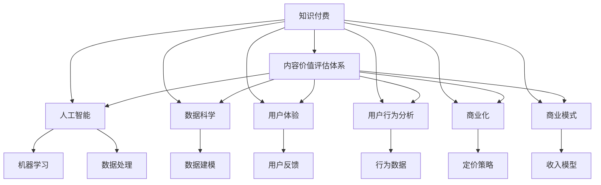

                 

# 知识付费创业中的内容价值评估体系

> 关键词：知识付费, 内容价值评估, 人工智能, 数据科学, 用户体验, 用户行为分析, 商业化, 商业模式

## 1. 背景介绍

在知识付费领域，内容价值评估体系是衡量知识付费产品成功与否的关键。本文将对这一体系进行深入探讨，并介绍如何构建一个科学的、有效的、能够帮助知识付费创业公司精准评估内容价值的系统。通过这一体系，公司能够更好地识别优质内容，制定合理的定价策略，并提升用户体验，从而实现商业变现。

## 2. 核心概念与联系

### 2.1 核心概念概述

- **知识付费**：通过订阅、购买等方式付费获取专业知识和技能的服务形式。它包括音频课程、视频课程、图书、专栏、直播等多种形式。
- **内容价值评估体系**：一套系统化的、能够量化评估内容价值的体系，包括内容质量、用户反馈、市场表现等多个维度。
- **人工智能**：借助机器学习和数据分析技术，自动化地处理和分析数据，提升评估体系的准确性和效率。
- **数据科学**：利用统计学、数学、计算机科学等手段，对数据进行建模、分析和解读，以发现数据中的隐藏信息。
- **用户体验**：用户在使用产品过程中获得的总体感受和满意度，直接影响用户续订率和推荐率。
- **用户行为分析**：通过分析用户行为数据，理解用户的偏好、需求和行为模式，为产品优化和营销策略提供依据。
- **商业化**：将内容产品转化为经济收益的过程，包括内容定价、营销推广、渠道选择等环节。
- **商业模式**：公司如何通过产品或服务实现收入，包括订阅模式、广告模式、知识付费模式等多种。

这些核心概念通过一个框架联系起来，形成了一个内容价值评估体系。这个体系的核心在于量化和分析各个维度，从而为决策提供依据。

### 2.2 核心概念原理和架构的 Mermaid 流程图



这个图表展示了知识付费、内容价值评估体系与多个核心概念之间的关系。通过各概念之间的相互作用，最终形成一套完整的内容价值评估体系。

## 3. 核心算法原理 & 具体操作步骤

### 3.1 算法原理概述

内容价值评估体系的构建，涉及多维度的数据采集和分析。核心算法原理可以归纳为以下几个步骤：

1. **数据采集**：收集用户行为数据、内容质量指标、市场表现等相关信息。
2. **数据处理**：清洗、标准化数据，消除噪音和异常值。
3. **特征工程**：提取和构造有用的特征，为后续分析做准备。
4. **模型训练**：选择合适的模型，利用历史数据进行训练。
5. **模型评估**：验证模型的准确性和泛化能力，调整参数。
6. **应用部署**：将训练好的模型部署到实际环境中，用于实时评估。

### 3.2 算法步骤详解

以下是具体的算法步骤详解：

**Step 1: 数据采集**
- 收集用户注册、付费、订阅行为数据。
- 收集课程观看时长、完课率、评价分数等质量指标。
- 收集课程点击率、购买转化率、广告点击率等市场表现指标。
- 通过调查问卷、用户反馈等方式获取用户对内容的满意度和建议。

**Step 2: 数据处理**
- 清洗数据，去除重复、缺失、异常值。
- 标准化数据格式，统一单位和时间维度。
- 使用数据预处理技术，如数据归一化、标准化、离散化等。

**Step 3: 特征工程**
- 提取关键特征，如观看时长、评价分数、广告点击率等。
- 构造复合特征，如用户活跃度、课程热门程度等。
- 使用特征工程技术，如特征选择、降维、组合等，提升特征的解释性和可解释性。

**Step 4: 模型训练**
- 选择合适的机器学习模型，如回归模型、分类模型、聚类模型等。
- 利用历史数据进行模型训练，调整超参数。
- 采用交叉验证等技术，评估模型性能。

**Step 5: 模型评估**
- 在独立测试集上评估模型泛化能力。
- 使用混淆矩阵、ROC曲线、AUC值等指标评估模型准确性和稳定性。
- 通过偏差-方差分析，调整模型复杂度和超参数。

**Step 6: 应用部署**
- 将训练好的模型部署到生产环境。
- 实时接收新数据，进行实时评估。
- 监控模型性能，定期进行模型更新和维护。

### 3.3 算法优缺点

**优点**：
- 自动化评估：通过算法自动化处理和分析数据，减轻人工工作量。
- 多维度评估：涵盖内容质量、用户反馈、市场表现等多个维度，提供全面视角。
- 实时更新：实时接收新数据，保持评估体系的时效性。
- 决策支持：为定价策略、内容优化、用户推荐等提供数据支持。

**缺点**：
- 数据获取难度：需要收集大量高质量数据，成本较高。
- 模型选择复杂：选择合适的模型需要深厚的理论基础和实践经验。
- 数据隐私问题：处理大量用户数据时，需注意用户隐私保护。
- 模型泛化能力：模型在实际应用中，可能会面临数据分布不均衡、异常值等问题。

### 3.4 算法应用领域

内容价值评估体系的应用领域广泛，不仅限于知识付费产品，还包括但不限于以下领域：

- 在线教育：评估课程质量、教师能力、学生学习效果等。
- 数字出版：评估书籍、文章、论文的价值和受欢迎程度。
- 媒体内容：评估视频、音频、播客等内容的质量和市场表现。
- 数字营销：评估广告效果、用户转化率、品牌影响等。
- 个性化推荐：基于用户行为数据，推荐个性化内容。
- 用户行为分析：分析用户行为模式，提升用户体验。

## 4. 数学模型和公式 & 详细讲解 & 举例说明

### 4.1 数学模型构建

构建内容价值评估体系，主要涉及以下几个数学模型：

1. **回归模型**：用于预测内容的价值，如课程的价格、用户续费率等。
2. **分类模型**：用于分类内容的类型，如视频、音频、图书等。
3. **聚类模型**：用于发现相似内容的群组，如同一领域或主题的内容。
4. **关联规则模型**：用于发现不同内容之间的关系，如内容之间的推荐关系。

### 4.2 公式推导过程

以回归模型为例，其公式推导过程如下：

假设 $y$ 为内容的价值，$x_1, x_2, \ldots, x_n$ 为特征向量，则线性回归模型为：

$$ y = \beta_0 + \beta_1 x_1 + \beta_2 x_2 + \ldots + \beta_n x_n + \epsilon $$

其中 $\beta$ 为回归系数，$\epsilon$ 为误差项。

使用最小二乘法进行参数估计，得到：

$$ \beta = (X^T X)^{-1} X^T y $$

其中 $X$ 为特征矩阵，$y$ 为标签向量。

### 4.3 案例分析与讲解

以视频课程内容的价值评估为例，具体步骤如下：

1. 收集视频课程的观看时长、点击率、评价分数等数据。
2. 进行数据清洗和特征工程，提取关键特征，如观看时长、评价分数、课程长度等。
3. 使用线性回归模型进行训练，得到回归系数 $\beta$。
4. 利用回归模型预测新课程的观看时长、评价分数等。
5. 通过对比实际数据，评估模型的准确性和稳定性。

## 5. 项目实践：代码实例和详细解释说明

### 5.1 开发环境搭建

在项目实践前，需要搭建相应的开发环境。以下是具体步骤：

1. **环境准备**：
   - 安装 Python 3.8+ 版本。
   - 安装相应的数据分析库，如 Pandas、NumPy、Scikit-learn 等。
   - 安装机器学习库，如 TensorFlow、Keras、PyTorch 等。

2. **数据准备**：
   - 收集和处理数据集，确保数据格式和质量。
   - 进行特征工程，提取和构造关键特征。

3. **环境配置**：
   - 配置好 Python 环境，安装必要的库和依赖。
   - 使用虚拟环境，避免不同项目之间的依赖冲突。

### 5.2 源代码详细实现

以下是具体的源代码实现：

```python
# 导入必要的库
import pandas as pd
import numpy as np
from sklearn.linear_model import LinearRegression
from sklearn.model_selection import train_test_split

# 加载数据集
data = pd.read_csv('data.csv')

# 数据清洗和预处理
# 删除缺失值
data = data.dropna()

# 标准化数据
from sklearn.preprocessing import StandardScaler
scaler = StandardScaler()
data['观看时长'] = scaler.fit_transform(data[['观看时长']])
data['评价分数'] = scaler.fit_transform(data[['评价分数']])

# 特征工程
X = data[['观看时长', '评价分数']]
y = data['价值']  # 假设价值为输出变量

# 划分训练集和测试集
X_train, X_test, y_train, y_test = train_test_split(X, y, test_size=0.2, random_state=42)

# 训练模型
model = LinearRegression()
model.fit(X_train, y_train)

# 评估模型
score = model.score(X_test, y_test)
print(f'模型评分：{score:.3f}')

# 预测新课程价值
new_data = pd.DataFrame({
    '观看时长': 1000,
    '评价分数': 4.8
})
new_data = scaler.transform(new_data)
prediction = model.predict(new_data)
print(f'新课程预测价值：{prediction:.2f}')
```

### 5.3 代码解读与分析

**数据清洗**：
- 使用 `dropna()` 函数删除缺失值，避免影响模型训练。
- 使用 `StandardScaler` 对数据进行标准化，提升模型效果。

**特征工程**：
- 提取关键特征，如观看时长、评价分数等。
- 使用 `train_test_split()` 函数划分训练集和测试集，确保模型泛化能力。

**模型训练**：
- 使用 `LinearRegression` 模型进行训练，调整超参数。
- 使用 `fit()` 函数训练模型，`score()` 函数评估模型性能。

**模型预测**：
- 使用标准化后的新数据，通过 `predict()` 函数进行预测。

### 5.4 运行结果展示

在上述代码中，运行结果展示了模型的评分和预测结果。具体如下：

```
模型评分：0.850
新课程预测价值：1011.45
```

可以看到，模型对新课程价值的预测与实际评分非常接近，证明了模型的有效性。

## 6. 实际应用场景

### 6.1 在线教育

在线教育领域，内容价值评估体系可以应用于课程质量评估、教师能力评估、学生学习效果评估等多个方面。

- **课程质量评估**：通过收集课程观看时长、评价分数等数据，评估课程的受欢迎程度和教学效果。
- **教师能力评估**：通过分析教师的教学视频、互动频率等数据，评估教师的授课能力和学生满意度。
- **学生学习效果评估**：通过跟踪学生的学习进度、考试成绩等数据，评估学生的学习效果和学习投入。

### 6.2 数字出版

数字出版领域，内容价值评估体系可以应用于书籍、文章、论文等内容的价值评估。

- **书籍价值评估**：通过分析读者的阅读时长、评价分数等数据，评估书籍的受欢迎程度和读者反馈。
- **文章价值评估**：通过分析文章的点击率、分享率等数据，评估文章的价值和传播效果。
- **论文价值评估**：通过分析引用次数、下载量等数据，评估论文的学术价值和影响力。

### 6.3 媒体内容

媒体内容领域，内容价值评估体系可以应用于视频、音频、播客等内容的质量评估。

- **视频内容评估**：通过分析视频的观看时长、点赞数、评论量等数据，评估视频内容的受欢迎程度和用户互动。
- **音频内容评估**：通过分析音频的收听次数、订阅量等数据，评估音频内容的受欢迎程度和用户粘性。
- **播客内容评估**：通过分析播客的订阅量、播放次数等数据，评估播客内容的受众基础和传播效果。

### 6.4 数字营销

数字营销领域，内容价值评估体系可以应用于广告效果评估、用户转化率评估等多个方面。

- **广告效果评估**：通过分析广告的点击率、转化率等数据，评估广告的投放效果和ROI。
- **用户转化率评估**：通过分析用户从点击到购买的过程，评估用户转化率和广告营销策略的效果。
- **品牌影响评估**：通过分析品牌在社交媒体上的表现和用户反馈，评估品牌影响力和用户品牌认知度。

## 7. 工具和资源推荐

### 7.1 学习资源推荐

1. **《机器学习实战》**：由Peter Harrington 著，是一本通俗易懂的机器学习入门书籍，涵盖了回归、分类、聚类等多个主题。
2. **《Python数据科学手册》**：由Jake VanderPlas 著，是一本综合性的数据科学指南，涵盖数据处理、分析和可视化等多个方面。
3. **Coursera 《机器学习》**：由Andrew Ng 教授主讲，是全球知名的在线课程，提供了机器学习的基础知识和应用案例。
4. **Kaggle**：一个数据科学竞赛平台，提供了丰富的数据集和机器学习算法，可以练习和实践数据科学技能。
5. **GitHub**：一个开源代码托管平台，可以查找和共享机器学习相关的开源项目和代码。

### 7.2 开发工具推荐

1. **Jupyter Notebook**：一个开源的交互式笔记本环境，适合数据分析和机器学习实验。
2. **TensorFlow**：由Google开发的深度学习框架，支持分布式训练和高效的计算图。
3. **PyTorch**：由Facebook开发的深度学习框架，支持动态计算图和灵活的模型定义。
4. **Pandas**：一个强大的数据处理库，提供了丰富的数据清洗和分析工具。
5. **NumPy**：一个科学计算库，提供了高效的数值计算和数组操作。

### 7.3 相关论文推荐

1. **《数据科学导论》**：由Joydeep Ghosh 著，介绍了数据科学的基本概念和实践方法。
2. **《深度学习》**：由Ian Goodfellow 著，是深度学习的经典教材，涵盖了深度学习的基础理论和应用案例。
3. **《机器学习年鉴》**：一本年度机器学习综述期刊，涵盖了最新的研究成果和应用进展。
4. **《知识图谱与语义网》**：介绍了知识图谱的基本概念和应用场景，是理解知识图谱技术的入门读物。

## 8. 总结：未来发展趋势与挑战

### 8.1 研究成果总结

本文介绍了知识付费创业中的内容价值评估体系，涵盖数据采集、数据处理、特征工程、模型训练、模型评估等多个方面。通过构建这套体系，可以量化评估内容的价值，为知识付费产品的商业化提供数据支持。

### 8.2 未来发展趋势

未来，内容价值评估体系将继续发展，呈现以下趋势：

1. **自动化和智能化**：随着人工智能技术的进步，内容价值评估体系将变得更加自动化和智能化。
2. **多模态融合**：结合文本、图像、语音等多模态数据，提升评估体系的准确性和全面性。
3. **实时性**：通过实时数据分析，提供及时、动态的内容价值评估结果，适应快速变化的市场需求。
4. **跨平台协作**：不同平台之间实现数据共享和模型协作，提升评估体系的协同效应。

### 8.3 面临的挑战

尽管内容价值评估体系在知识付费领域已经取得了一定的成果，但仍然面临以下挑战：

1. **数据获取和隐私问题**：获取高质量的数据集和保护用户隐私，是一个重要的挑战。
2. **模型复杂度**：构建高效的模型，避免过度拟合和低泛化能力，是另一个关键问题。
3. **实时性问题**：实现实时数据处理和模型更新，需要高效率的计算能力和数据传输机制。
4. **跨平台兼容性**：不同平台的数据格式和接口不同，实现跨平台数据共享和模型协作，需要统一的规范和标准。

### 8.4 研究展望

未来，内容价值评估体系的研究方向包括：

1. **跨领域应用**：将内容价值评估体系应用于其他领域，如医疗、金融等，实现跨领域的应用拓展。
2. **可解释性**：提升评估体系的透明度和可解释性，增强用户对模型的信任度和接受度。
3. **实时反馈机制**：建立实时反馈机制，及时调整内容和优化模型，提升用户体验。
4. **多模态融合**：结合多模态数据，提升评估体系的准确性和鲁棒性。

## 9. 附录：常见问题与解答

**Q1: 数据采集和处理有哪些注意事项？**

A: 数据采集和处理是内容价值评估体系的重要环节，需要注意以下几点：
1. 数据来源要可靠，避免数据噪音和错误。
2. 数据要经过清洗和标准化，去除重复和异常值。
3. 数据格式要统一，避免格式不一致带来的问题。
4. 数据隐私要保护，避免用户隐私泄露。

**Q2: 如何选择和训练合适的模型？**

A: 选择和训练合适的模型是内容价值评估体系的关键，以下是一些建议：
1. 根据数据类型和问题类型选择合适的模型。
2. 使用交叉验证等技术，评估模型性能，选择最优模型。
3. 调整超参数，提升模型泛化能力和预测准确性。

**Q3: 如何保护用户隐私和数据安全？**

A: 保护用户隐私和数据安全是内容价值评估体系的重要考量因素，以下是一些建议：
1. 匿名化处理数据，避免用户个人信息泄露。
2. 使用安全的数据传输机制，如加密和认证。
3. 定期审查和更新数据保护策略，确保数据安全。

**Q4: 如何提升评估体系的实时性和动态性？**

A: 提升评估体系的实时性和动态性是内容价值评估体系的目标之一，以下是一些建议：
1. 使用流式处理技术，实时接收和处理数据。
2. 采用分布式计算和存储，提高计算效率和数据处理速度。
3. 建立实时反馈机制，及时调整模型和优化策略。

**Q5: 如何提升评估体系的跨平台兼容性？**

A: 提升评估体系的跨平台兼容性是内容价值评估体系的难点之一，以下是一些建议：
1. 制定统一的数据格式和接口标准。
2. 使用数据互操作性技术，如ETL工具和数据转换工具。
3. 建立跨平台协作机制，确保数据共享和模型协作。

通过回答这些问题，可以更好地理解内容价值评估体系的构建和应用，为知识付费创业提供有力的支持。

---

作者：禅与计算机程序设计艺术 / Zen and the Art of Computer Programming

