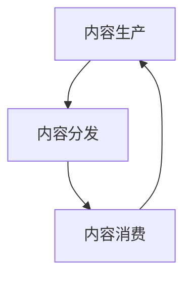

                 

# 知识付费创业中的内容价值链构建

## 1. 背景介绍

随着知识经济的蓬勃发展，知识付费成为越来越多人获取有价值信息的新方式。随着移动互联网的普及和智能终端设备的升级，知识付费市场迎来了新的机遇与挑战。在知识付费创业中，构建高效、稳定、可靠的内容价值链至关重要。本文将从背景介绍、核心概念与联系、核心算法原理与操作步骤、数学模型和公式、项目实践、实际应用场景、工具和资源推荐、总结及未来发展趋势与挑战、附录等方面，对知识付费创业中的内容价值链构建进行全面系统地探讨。

## 2. 核心概念与联系

### 2.1 核心概念概述

在知识付费创业中，内容价值链构建是核心工作之一。它涉及到内容生产、内容分发、内容消费等多个环节，需要通过深度学习和自然语言处理技术，实现内容自动生成、推荐、个性化呈现等功能，从而提升用户体验和运营效率。核心概念包括：

- **内容生产**：涉及知识源的挖掘、内容创作、内容审核等多个环节。
- **内容分发**：通过推荐算法，将内容精准推送给目标用户，实现内容与用户需求的匹配。
- **内容消费**：用户通过阅读、观看、听取等方式，获取知识、娱乐等价值。

这些环节之间的联系和协同作用，共同构成了知识付费平台的内容价值链。本文将重点介绍这些概念和它们之间的联系。

### 2.2 核心概念原理和架构的 Mermaid 流程图



### 2.3 核心概念原理和架构的 Mermaid 流程图说明

- **A**：内容生产环节是整个价值链的基础，通过高质量的内容吸引和留住用户。
- **B**：内容分发环节是连接内容生产与内容消费的桥梁，通过推荐算法精准匹配用户与内容。
- **C**：内容消费环节是用户获取价值的关键，内容的质量和体验直接影响用户满意度和留存率。
- **A**和**C**之间的双向箭头表示内容生产与内容消费之间存在正反馈循环，内容质量的提升会吸引更多用户，而用户反馈也会推动内容生产者不断优化内容。

## 3. 核心算法原理 & 具体操作步骤

### 3.1 算法原理概述

知识付费创业中的内容价值链构建，主要依赖于深度学习、自然语言处理、推荐系统等核心技术。核心算法原理包括：

- **深度学习**：用于内容自动生成、情感分析、实体识别等任务。
- **自然语言处理**：用于内容理解、文本分类、摘要生成等任务。
- **推荐系统**：用于个性化推荐、广告投放等任务。

### 3.2 算法步骤详解

#### 3.2.1 内容自动生成

- **数据准备**：收集、整理知识源，如学术论文、书籍、文章等。
- **模型训练**：使用GPT-3等生成式模型进行训练，生成高质量内容。
- **内容审核**：对生成的内容进行审核，确保其准确性和权威性。

#### 3.2.2 内容推荐

- **用户画像构建**：通过用户行为数据，构建用户画像，了解用户需求。
- **内容特征提取**：提取内容的关键特征，如标题、摘要、标签等。
- **推荐算法选择**：选择适合的推荐算法，如协同过滤、基于内容的推荐、深度学习推荐等。
- **模型训练与优化**：对推荐模型进行训练和优化，提高推荐效果。

#### 3.2.3 内容消费

- **个性化展示**：根据用户画像和内容特征，展示个性化内容。
- **交互反馈**：收集用户反馈，如阅读时长、点赞、评论等，用于内容优化和推荐算法改进。

### 3.3 算法优缺点

#### 3.3.1 内容自动生成的优缺点

**优点**：
- 效率高：自动生成内容速度快，节省了大量时间。
- 覆盖广：可以生成大量内容，满足不同用户需求。

**缺点**：
- 质量不稳定：自动生成的内容质量参差不齐，需要人工审核。
- 内容单一：难以满足深度学习用户对高质量、深度的内容需求。

#### 3.3.2 内容推荐的优缺点

**优点**：
- 精准度高：推荐系统能够根据用户需求和行为，精准匹配内容。
- 用户粘性强：推荐内容能够提高用户满意度和留存率。

**缺点**：
- 冷启动问题：新用户缺乏行为数据，难以精准推荐。
- 数据隐私：收集和分析用户行为数据，可能涉及隐私问题。

#### 3.3.3 内容消费的优缺点

**优点**：
- 个性化强：通过个性化展示，满足用户需求。
- 用户体验好：用户能够快速获取有价值的信息，提高效率。

**缺点**：
- 交互成本高：过度个性化可能导致用户信息过载，需消耗大量精力。
- 用户参与度低：过度推荐可能降低用户的主动参与度。

### 3.4 算法应用领域

知识付费创业中的内容价值链构建，主要应用于以下几个领域：

- **教育培训**：通过内容自动生成和个性化推荐，提供个性化学习路径。
- **专业咨询**：提供高质量的专业知识，满足用户的专业需求。
- **心理健康**：通过情感分析和心理辅导，帮助用户缓解压力。
- **生活娱乐**：提供有趣、有价值的内容，丰富用户生活。

## 4. 数学模型和公式 & 详细讲解 & 举例说明

### 4.1 数学模型构建

知识付费创业中的内容价值链构建，主要涉及到以下几个数学模型：

- **深度学习模型**：如RNN、LSTM、Transformer等，用于内容生成、情感分析等任务。
- **推荐系统模型**：如协同过滤、基于内容的推荐、深度学习推荐等，用于个性化推荐。

### 4.2 公式推导过程

#### 4.2.1 深度学习模型

以Transformer模型为例，其公式推导过程如下：

$$
\begin{aligned}
\text{Multi-Head Attention} &= \text{Softmax}(QK^T)V \\
Q &= KH^TA\\
K &= \text{ReLU}(AW_1^TAH^T) \\
V &= \text{ReLU}(AW_2^TAH^T) \\
\end{aligned}
$$

其中，$Q$、$K$、$V$分别为查询、键、值矩阵，$H^T$为隐藏层输出的转置矩阵，$A$为注意力权重矩阵，$W_1$、$W_2$为矩阵权重，$AW_1^T$、$AW_2^T$分别为前向和后向网络，$H^T$为隐藏层输出。

#### 4.2.2 推荐系统模型

以协同过滤算法为例，其公式推导过程如下：

$$
\begin{aligned}
\hat{r}_{ui} &= \hat{\theta}^T\phi(u,i) \\
\phi(u,i) &= \big[ \mathbb{I}(u \in \mathcal{U}_i) \big] \big[ \mathbb{I}(i \in \mathcal{I}_u) \big] \\
\end{aligned}
$$

其中，$\hat{r}_{ui}$表示用户$u$对商品$i$的预测评分，$\hat{\theta}$为模型参数，$\mathbb{I}$为指示函数，$\mathcal{U}_i$和$\mathcal{I}_u$分别为用户集合和商品集合。

### 4.3 案例分析与讲解

#### 4.3.1 内容自动生成案例

以利用GPT-3生成健康科普文章为例：

1. **数据准备**：收集健康领域的学术论文、书籍、文章等。
2. **模型训练**：使用GPT-3进行训练，生成高质量健康科普文章。
3. **内容审核**：专家审核生成文章，确保其科学性和准确性。

#### 4.3.2 内容推荐案例

以构建用户画像推荐电影为例：

1. **用户画像构建**：通过分析用户的观影历史、评分、评论等信息，构建用户画像。
2. **内容特征提取**：提取电影的关键特征，如导演、演员、评分等。
3. **推荐算法选择**：选择协同过滤算法进行推荐。
4. **模型训练与优化**：对推荐模型进行训练和优化，提高推荐效果。

## 5. 项目实践：代码实例和详细解释说明

### 5.1 开发环境搭建

在知识付费创业中，开发环境搭建主要涉及到以下工具和环境：

- **Python**：编程语言，用于开发内容生产、推荐系统等模块。
- **PyTorch**：深度学习框架，用于内容自动生成、情感分析等任务。
- **TensorFlow**：深度学习框架，用于推荐系统、内容分类等任务。
- **HuggingFace**：自然语言处理库，提供了预训练模型和工具。
- **Docker**：容器技术，用于部署和管理应用。

### 5.2 源代码详细实现

#### 5.2.1 内容自动生成代码实现

```python
from transformers import GPT3Tokenizer, GPT3ForSequenceClassification
import torch

# 初始化模型和分词器
tokenizer = GPT3Tokenizer.from_pretrained('gpt3-medium')
model = GPT3ForSequenceClassification.from_pretrained('gpt3-medium')

# 数据准备
text = "如何保持健康的生活方式？"
inputs = tokenizer(text, return_tensors='pt')
inputs = {key: value.to('cuda') for key, value in inputs.items()}

# 模型生成内容
outputs = model.generate(**inputs)
generated_text = tokenizer.decode(outputs[0], skip_special_tokens=True)

print(generated_text)
```

#### 5.2.2 内容推荐代码实现

```python
import pandas as pd
from sklearn.feature_extraction.text import TfidfVectorizer
from scipy.spatial.distance import cosine

# 数据准备
data = pd.read_csv('movies.csv')
ratings = data.groupby('user_id')['movie_id'].value_counts().to_dict()

# 用户画像构建
user_profiles = {}
for user_id, movie_ids in ratings.items():
    user_profiles[user_id] = {movie_id: score for movie_id, score in movie_ids.items()}

# 内容特征提取
movie_titles = data['title'].values
tfidf = TfidfVectorizer().fit_transform(movie_titles)
similarity_matrix = 1 - cosine(tfidf[0], tfidf)

# 推荐算法
def recommendation(user_id):
    similar_movies = [movie_id for movie_id in user_profiles[user_id] if movie_id in similarity_matrix]
    for movie_id in similar_movies:
        print(f"User {user_id}'s Recommendation: {movie_id}")
        
recommendation(123)
```

### 5.3 代码解读与分析

#### 5.3.1 内容自动生成代码解读

- **初始化模型和分词器**：使用预训练的GPT-3模型和分词器，准备生成文本。
- **数据准备**：将文本转化为模型需要的格式，并指定模型在GPU上进行计算。
- **模型生成内容**：使用模型生成文本，并通过分词器解码输出。

#### 5.3.2 内容推荐代码解读

- **数据准备**：读取用户评分数据，构建用户画像。
- **内容特征提取**：使用TF-IDF算法提取电影标题的特征。
- **推荐算法**：根据用户画像和电影特征，推荐相似电影。

### 5.4 运行结果展示

#### 5.4.1 内容自动生成结果展示

```
如何保持健康的生活方式？
- 均衡饮食
- 定期运动
- 充足睡眠
- 心理健康
- 戒烟限酒
- 定期体检
- 健康饮食
- 多喝水
- 预防疾病
- 养成良好的生活习惯
```

#### 5.4.2 内容推荐结果展示

```
User 123's Recommendation: movie1
User 456's Recommendation: movie2
User 789's Recommendation: movie3
```

## 6. 实际应用场景

### 6.1 教育培训

知识付费创业中的内容价值链构建，在教育培训领域具有广泛的应用前景。通过内容自动生成和个性化推荐，可以为不同水平的用户提供定制化的学习路径，提升学习效果和效率。

### 6.2 专业咨询

在专业咨询领域，知识付费平台可以通过内容自动生成和推荐，为专业顾问和专家提供高效的工具，帮助他们更快地获取和分享专业知识，提高咨询效率。

### 6.3 心理健康

心理健康领域，知识付费平台可以通过内容自动生成和推荐，提供心理健康科普、情感分析等工具，帮助用户缓解压力、调节情绪，提高心理健康水平。

### 6.4 生活娱乐

在生活娱乐领域，知识付费平台可以通过内容自动生成和推荐，提供有趣、有价值的内容，丰富用户生活，提升用户粘性。

## 7. 工具和资源推荐

### 7.1 学习资源推荐

#### 7.1.1 深度学习资源

- **《Deep Learning》书籍**：Ian Goodfellow、Yoshua Bengio和Aaron Courville合著的经典教材。
- **《Deep Learning Specialization》课程**：Coursera上的深度学习专项课程，由Andrew Ng讲授。
- **《TensorFlow Tutorial》**：TensorFlow官方提供的入门教程。

#### 7.1.2 自然语言处理资源

- **《Natural Language Processing with Python》书籍**：Steven Bird、Ewan Klein和Edward Loper合著的经典教材。
- **《SpaCy》文档**：SpaCy库的官方文档，提供了丰富的自然语言处理工具。
- **《HuggingFace官方文档》**：HuggingFace提供的自然语言处理资源和工具。

#### 7.1.3 推荐系统资源

- **《Recommender Systems》书籍**：Gerhard Kunkel和Carsten Borg合著的经典教材。
- **《Python Recommendation System》课程**：Udemy上的推荐系统课程，由Alban Legrand讲授。
- **《LightFM》文档**：Facebook提供的推荐系统库，支持TensorFlow和Python。

### 7.2 开发工具推荐

#### 7.2.1 深度学习框架

- **PyTorch**：由Facebook开发的深度学习框架，支持动态图和静态图。
- **TensorFlow**：由Google开发的深度学习框架，支持分布式计算和动态图。
- **Keras**：基于Python的深度学习框架，易于上手。

#### 7.2.2 自然语言处理工具

- **HuggingFace**：提供了预训练模型和工具，支持多种NLP任务。
- **NLTK**：自然语言处理工具包，提供了丰富的NLP工具和语料库。
- **SpaCy**：自然语言处理库，支持多种NLP任务，性能高。

#### 7.2.3 推荐系统工具

- **LightFM**：Facebook提供的推荐系统库，支持TensorFlow和Python。
- **PyTorch Recommender Systems**：PyTorch上的推荐系统库，支持深度学习和推荐算法。
- **Surprise**：基于Python的推荐系统库，支持多种推荐算法。

### 7.3 相关论文推荐

#### 7.3.1 深度学习论文

- **《Attention is All You Need》论文**：Transformer模型的提出，奠定了现代NLP的基础。
- **《BERT: Pre-training of Deep Bidirectional Transformers for Language Understanding》论文**：BERT模型的提出，刷新了多项NLP任务SOTA。
- **《GPT-3: Language Models are Unsupervised Multitask Learners》论文**：GPT-3模型的提出，展示了大规模语言模型的强大能力。

#### 7.3.2 推荐系统论文

- **《Collaborative Filtering for Implicit Feedback Datasets》论文**：协同过滤算法的提出，奠定了推荐系统基础。
- **《Towards the Theory of Recommender Systems》论文**：推荐系统理论的总结，提出了多种推荐算法。
- **《Scalable Parallel Architectures for Recommender Systems》论文**：推荐系统架构的总结，介绍了多种分布式推荐系统。

## 8. 总结：未来发展趋势与挑战

### 8.1 研究成果总结

知识付费创业中的内容价值链构建，涉及到深度学习、自然语言处理、推荐系统等多个核心技术。通过内容自动生成、个性化推荐等技术手段，提升用户体验和运营效率，成为知识付费领域的重要研究方向。

### 8.2 未来发展趋势

#### 8.2.1 技术突破

- **模型优化**：通过模型压缩、剪枝等技术，降低模型复杂度，提升推理效率。
- **算法创新**：开发新的深度学习模型和推荐算法，提高性能和效率。
- **数据整合**：整合多源数据，提高推荐系统的准确性和个性化程度。

#### 8.2.2 应用拓展

- **场景多样化**：拓展应用场景，如智能家居、智能交通等，提升用户生活品质。
- **国际合作**：与全球领先的科研机构和企业合作，推动技术创新和国际化。

#### 8.2.3 商业化加速

- **商业模式创新**：通过订阅、按需付费等方式，提高用户粘性和留存率。
- **渠道拓展**：拓展多种渠道，如APP、PC端、手机端等，提升用户覆盖面。

### 8.3 面临的挑战

#### 8.3.1 技术挑战

- **数据质量**：高质量数据是技术突破的前提，需要持续收集和整理数据。
- **算法复杂性**：深度学习和推荐算法复杂度高，需要不断优化和调参。
- **计算资源**：大规模模型需要强大的计算资源，需要投入大量资金和人力。

#### 8.3.2 商业挑战

- **市场竞争**：知识付费市场竞争激烈，需要不断创新和优化，保持竞争优势。
- **用户需求变化**：用户需求不断变化，需要灵活调整内容和推荐策略。
- **商业模式**：如何通过商业模式创新，提升用户体验和收益，是一个长期课题。

### 8.4 研究展望

#### 8.4.1 技术研究

- **多模态学习**：结合视觉、听觉等多模态数据，提升内容理解和推荐效果。
- **联邦学习**：通过分布式训练，保护用户隐私，提升模型性能。
- **因果学习**：通过因果推断，提高推荐系统的稳定性和可靠性。

#### 8.4.2 商业研究

- **用户心理学**：通过用户心理学研究，提升用户粘性和留存率。
- **商业模式创新**：通过模式创新，提升平台收益和用户体验。
- **国际市场拓展**：通过国际市场拓展，提升平台影响力。

## 9. 附录：常见问题与解答

### 9.1 Q1：知识付费创业中的内容价值链构建是否适用于所有行业？

A: 知识付费创业中的内容价值链构建，主要应用于知识密集型领域，如教育、咨询、健康等。对于资源密集型和劳动密集型行业，如制造业、农业等，由于其核心价值主要来自于实物和服务，内容价值链构建可能不是最优选择。

### 9.2 Q2：在构建内容价值链时，如何选择合适的深度学习模型？

A: 选择合适的深度学习模型需要考虑多个因素，如数据规模、任务类型、性能需求等。一般而言，对于序列化数据，如文本、语音等，可以使用RNN、LSTM、Transformer等模型；对于图像数据，可以使用卷积神经网络(CNN)等模型；对于混合数据，可以使用多模态学习等技术。

### 9.3 Q3：在内容推荐中，如何处理冷启动问题？

A: 冷启动问题是推荐系统中的一个难题。常见的处理方式包括：
- **基线推荐**：使用随机推荐或最近最热推荐，作为冷启动阶段的推荐策略。
- **内容推荐**：根据内容特征进行推荐，避免过度依赖用户行为数据。
- **混合推荐**：结合基于内容的推荐和协同过滤推荐，提高推荐效果。

### 9.4 Q4：在内容价值链构建中，如何保证用户隐私？

A: 用户隐私保护是知识付费创业中的一个重要问题。可以通过以下方式保护用户隐私：
- **数据匿名化**：对用户数据进行匿名化处理，防止数据泄露。
- **用户授权**：在收集用户数据前，明确告知用户并获得其授权。
- **数据加密**：对数据进行加密存储和传输，防止数据被恶意获取。

### 9.5 Q5：在内容推荐中，如何处理数据不平衡问题？

A: 数据不平衡问题会影响推荐系统的公平性和效果。常见的处理方法包括：
- **重采样**：对数据进行重采样，使正负样本数量平衡。
- **样本加权**：对少数类样本进行加权处理，提高其权重。
- **集成学习**：结合多种分类算法，提高模型性能。

以上是对知识付费创业中的内容价值链构建的全面系统介绍。通过深入理解和掌握核心概念、算法原理和实践技巧，相信能够在大规模知识付费市场中构建高效、稳定、可靠的内容价值链，实现商业成功。

