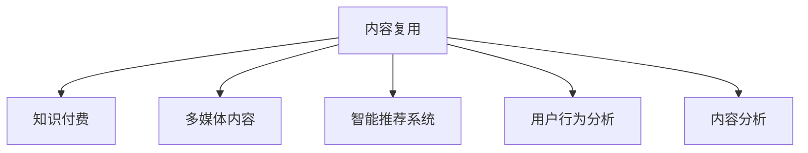

                 

# 知识付费创业中的内容复用策略

## 1. 背景介绍

### 1.1 问题由来
在知识付费领域，内容创作者面临着内容生产成本高、用户消费习惯多变、市场竞争激烈等多重挑战。为了提升内容质量和吸引力，降低生产成本，内容复用策略逐渐成为知识付费创业中不可或缺的一部分。内容复用不仅能够提高内容生产效率，还能够提升内容的多样性和趣味性，吸引更多的用户付费订阅。

### 1.2 问题核心关键点
内容复用策略的核心在于如何高效地将已有的内容资产转化为新的内容形式，以满足不同用户的需求。这包括但不限于将文章、视频、音频等内容进行重构，添加新的价值点，或与其他内容进行组合，形成全新的知识产品。

### 1.3 问题研究意义
研究内容复用策略，对于提升知识付费创业的内容生产效率、降低成本、增强用户粘性、开拓新市场具有重要意义：

1. **提升效率**：复用现有内容，可以节省大量的时间和精力，提高内容生产的整体效率。
2. **降低成本**：复用内容可以降低内容的获取和生产成本，尤其是对于小型创业公司而言。
3. **增强粘性**：复用后的内容通常具有更高的多样性和趣味性，能够更好地吸引用户，增加用户粘性。
4. **开拓市场**：通过不同的内容复用方式，能够覆盖更多的细分市场，开拓新的用户群体。

## 2. 核心概念与联系

### 2.1 核心概念概述

为了更好地理解内容复用策略，本节将介绍几个密切相关的核心概念：

- **内容复用(Content Repurposing)**：指将现有内容经过加工处理，以新的形式呈现，以提高内容价值和使用率的过程。
- **知识付费(Knowledge-Paying)**：指用户为获取专业知识和信息而支付费用的模式，内容复用策略是其核心支撑之一。
- **多媒体内容(Multimedia Content)**：包括文本、图像、音频、视频等多种形式的内容，内容复用常涉及多种媒体类型的融合和转换。
- **智能推荐系统(Recommendation Systems)**：利用算法和大数据分析技术，为用户推荐其感兴趣的内容，是内容复用的重要工具。
- **用户行为分析(User Behavior Analysis)**：通过对用户行为的分析和理解，制定更精准的内容复用策略。
- **内容分析(Content Analysis)**：对现有内容进行深度分析，挖掘其潜在的价值点和复用点。

这些核心概念之间的逻辑关系可以通过以下Mermaid流程图来展示：



这个流程图展示内容复用策略的核心概念及其之间的关系：

1. 内容复用是知识付费的重要支撑。
2. 多媒体内容是内容复用的主要对象。
3. 智能推荐系统是内容复用的辅助工具。
4. 用户行为分析和内容分析是制定复用策略的重要依据。

## 3. 核心算法原理 & 具体操作步骤

### 3.1 算法原理概述

内容复用策略的本质是通过对现有内容的重新组合、加工和再利用，以形成新的内容形式，满足不同用户的需求。其核心思想是：

1. **内容适配**：根据用户偏好和需求，对原有内容进行适配和优化。
2. **形式变换**：将内容从一种形式转换为另一种形式，如将文章转换为视频、音频等。
3. **内容融合**：将不同形式的内容进行融合，形成全新的多媒体产品。
4. **个性化推荐**：通过智能推荐系统，向用户推荐最适合的内容复用产品。

### 3.2 算法步骤详解

内容复用策略的实现一般包括以下几个关键步骤：

**Step 1: 内容收集与分析**
- 收集现有内容，包括文字、图片、视频、音频等。
- 进行内容分析，评估其潜在价值和复用点，如关键词提取、情感分析等。
- 收集用户行为数据，了解用户偏好和消费习惯。

**Step 2: 内容适配与优化**
- 根据用户偏好和需求，对内容进行适配和优化。
- 添加新的价值点，如专家访谈、案例分析等，增加内容的吸引力。

**Step 3: 内容形式变换**
- 将内容转换为不同的形式，如将文字转换为视频、音频，或将多模态内容进行整合。
- 利用AI技术，如语音合成、图像识别等，提升转换质量。

**Step 4: 内容融合与组合**
- 将不同形式的内容进行融合，形成新的多媒体产品，如视频+文章、音频+图像等。
- 添加额外的元数据，如标签、关键词等，提升内容搜索和推荐效果。

**Step 5: 智能推荐**
- 利用智能推荐系统，分析用户行为和内容属性，推荐最合适的复用内容。
- 实时更新推荐模型，保证推荐内容的时效性和准确性。

**Step 6: 用户反馈与优化**
- 收集用户反馈，分析推荐效果和内容使用情况。
- 根据用户反馈，持续优化内容复用策略，提升用户体验和满意度。

### 3.3 算法优缺点

内容复用策略具有以下优点：
1. **效率提升**：利用现有内容进行复用，可以显著提高内容生产效率。
2. **成本降低**：复用内容降低了获取和生产新内容的成本，尤其是对于小型创业公司而言。
3. **用户粘性增加**：复用后的内容形式多样，趣味性强，能够更好地吸引用户，增加用户粘性。
4. **市场开拓**：通过不同的内容复用方式，能够覆盖更多的细分市场，开拓新的用户群体。

同时，该策略也存在一定的局限性：
1. **内容同质化风险**：如果复用策略过于简单，容易陷入同质化内容陷阱，影响用户体验。
2. **用户体验单一**：单一的内容形式和推荐策略，可能无法满足不同用户的需求。
3. **技术难度高**：多媒体内容的转换和融合技术难度较高，需要较强的技术支撑。
4. **市场变化快**：用户需求和市场环境变化快，复用策略需要及时调整。

尽管存在这些局限性，但就目前而言，内容复用策略仍是知识付费创业中的重要手段。未来相关研究的重点在于如何进一步提升复用效率和精准度，降低技术难度，同时兼顾用户体验和市场变化等因素。

### 3.4 算法应用领域

内容复用策略在知识付费领域的应用广泛，涵盖了从音频、视频到文本等多种形式的内容。以下是几个典型的应用场景：

- **课程拆分与组合**：将完整的课程拆分为多个模块，每个模块可单独购买，也可组合成大课。
- **内容包装与营销**：将核心内容进行包装，添加前后缀、插图、引用等元素，提升营销效果。
- **互动视频**：将文章、图片、音频等内容整合为互动视频，增强用户参与感。
- **主题专区**：根据不同主题，将相关内容进行聚合，形成专门的主题专区，提升内容浏览效果。
- **个性化推送**：根据用户行为数据，进行个性化的内容推荐，提升用户粘性和满意度。

除了这些经典场景外，内容复用策略还被创新性地应用到更多场景中，如智能问答、社交媒体互动、直播课程等，为知识付费技术带来了新的突破。随着内容复用技术的不断进步，相信知识付费领域的内容生产效率将进一步提升，用户体验将更加丰富多样。

## 4. 数学模型和公式 & 详细讲解 & 举例说明

### 4.1 数学模型构建

本节将使用数学语言对内容复用策略进行更加严格的刻画。

记现有内容为 $C$，目标用户为 $U$，内容复用后的产品为 $P$，智能推荐系统为 $S$。假设 $C$ 和 $P$ 均由多种形式组成，如文字、图像、音频等。目标用户 $U$ 的需求为 $D$，智能推荐系统 $S$ 对内容 $C$ 的评分向量为 $R$。

定义内容复用策略 $F$，将现有内容 $C$ 转换为复用产品 $P$ 的过程如下：

$$
P = F(C)
$$

其中 $F$ 为内容复用函数，可以是转换、优化、融合等操作。

智能推荐系统 $S$ 对复用产品 $P$ 的推荐效果 $E$ 定义为：

$$
E = S(P)
$$

目标用户 $U$ 对推荐内容 $P$ 的反馈 $F_{\text{back}}$ 为：

$$
F_{\text{back}} = D(P)
$$

其中 $D$ 为反馈函数，可以是评分、评论、点击率等。

目标用户 $U$ 对复用产品 $P$ 的使用情况 $U_{\text{use}}$ 定义为：

$$
U_{\text{use}} = \sum_{u\in U} F_{\text{back}}(u)
$$

内容复用策略的目标是最大化用户使用情况 $U_{\text{use}}$，即：

$$
\max_{F} U_{\text{use}} = \max_{F} \sum_{u\in U} F_{\text{back}}(u)
$$

### 4.2 公式推导过程

假设目标用户 $U$ 的需求 $D$ 为二分类问题，即 $U=\{u_1, u_2, ..., u_N\}$，目标为分类标签 $\{1, 0\}$。智能推荐系统 $S$ 对复用产品 $P$ 的评分向量 $R$ 为：

$$
R = \left[
\begin{array}{cccc}
r_{1,1} & r_{1,2} & ... & r_{1,M} \\
r_{2,1} & r_{2,2} & ... & r_{2,M} \\
\vdots & \vdots & \ddots & \vdots \\
r_{N,1} & r_{N,2} & ... & r_{N,M}
\end{array}
\right]
$$

其中 $M$ 为复用产品 $P$ 的特征数。

根据最大化目标用户使用情况 $U_{\text{use}}$ 的定义，我们可以构建如下优化问题：

$$
\max_{F} \sum_{u\in U} F_{\text{back}}(u)
$$

由于 $F_{\text{back}}(u)$ 通常为不可直接求得的未知函数，因此我们需要通过训练数据来拟合 $F_{\text{back}}(u)$。假设我们有 $K$ 个训练样本 $(u_i, D(u_i), R(u_i))$，其中 $u_i$ 为第 $i$ 个样本的用户，$D(u_i)$ 为样本的真实标签，$R(u_i)$ 为智能推荐系统对样本的评分向量。

我们可以使用监督学习方法，如回归、分类等，对 $F_{\text{back}}(u)$ 进行拟合，得到其估计值 $\hat{F_{\text{back}}}(u)$。最终的目标函数可以表示为：

$$
\max_{F} \sum_{u\in U} \hat{F_{\text{back}}}(u)
$$

在实际应用中，为了简化计算，我们通常会进一步将目标函数转换为损失函数的形式，如均方误差损失、交叉熵损失等。

### 4.3 案例分析与讲解

以音频课程内容复用为例，分析内容复用策略的数学模型。

假设有一个音频课程 $C$，包含 $N$ 段音频，每段音频的评分向量 $R_{i} = [r_{i,1}, r_{i,2}, ..., r_{i,M}]$，其中 $M$ 为音频特征数。目标用户 $U$ 的需求 $D$ 为二分类问题，即 $U=\{u_1, u_2, ..., u_N\}$，目标为分类标签 $\{1, 0\}$。

我们希望通过内容复用策略 $F$，将音频课程 $C$ 转换为复用产品 $P$，即 $P = F(C)$。假设 $F$ 为音频转换操作，如将音频转换为文字、图片等。

对于目标用户 $u_i$，其对音频课程的评分向量为 $R(u_i)$，复用后的评分向量为 $\hat{R}(u_i)$。我们的目标函数为：

$$
\max_{F} \sum_{u\in U} \hat{F_{\text{back}}}(u)
$$

其中 $\hat{F_{\text{back}}}(u)$ 为对用户 $u_i$ 进行内容推荐后的评分向量。

在实际应用中，我们可以使用回归方法对 $\hat{F_{\text{back}}}(u)$ 进行拟合，得到其估计值 $\hat{F_{\text{back}}}(u)$。最终的目标函数可以表示为：

$$
\max_{F} \sum_{u\in U} \hat{F_{\text{back}}}(u)
$$

通过上述数学模型，我们可以系统地理解内容复用策略的构建和优化过程，为实际应用提供理论支撑。

## 5. 项目实践：代码实例和详细解释说明

### 5.1 开发环境搭建

在进行内容复用策略的实践前，我们需要准备好开发环境。以下是使用Python进行PyTorch开发的环境配置流程：

1. 安装Anaconda：从官网下载并安装Anaconda，用于创建独立的Python环境。

2. 创建并激活虚拟环境：
```bash
conda create -n pytorch-env python=3.8 
conda activate pytorch-env
```

3. 安装PyTorch：根据CUDA版本，从官网获取对应的安装命令。例如：
```bash
conda install pytorch torchvision torchaudio cudatoolkit=11.1 -c pytorch -c conda-forge
```

4. 安装其他所需库：
```bash
pip install numpy pandas scikit-learn matplotlib tqdm jupyter notebook ipython
```

完成上述步骤后，即可在`pytorch-env`环境中开始内容复用策略的实践。

### 5.2 源代码详细实现

下面我们以音频课程内容复用为例，给出使用PyTorch实现内容复用策略的Python代码实现。

首先，定义音频内容处理函数：

```python
from transformers import Wav2Vec2Tokenizer, Wav2Vec2ForCTC

def process_audio(audio_path, model_path):
    tokenizer = Wav2Vec2Tokenizer.from_pretrained(model_path)
    model = Wav2Vec2ForCTC.from_pretrained(model_path)

    # 将音频文件转换为文本
    audio, sampling_rate = librosa.load(audio_path, sr=16000)
    text = tokenizer(audio, sampling_rate=sampling_rate)

    # 将文本转换为评分向量
    inputs = tokenizer.encode(text)
    outputs = model(inputs)

    return outputs
```

然后，定义训练和评估函数：

```python
from sklearn.metrics import accuracy_score
from torch.utils.data import DataLoader
from tqdm import tqdm

def train_model(model, dataset, batch_size, optimizer):
    dataloader = DataLoader(dataset, batch_size=batch_size, shuffle=True)
    model.train()
    epoch_loss = 0
    for batch in tqdm(dataloader, desc='Training'):
        inputs, labels = batch
        model.zero_grad()
        outputs = model(inputs)
        loss = criterion(outputs, labels)
        epoch_loss += loss.item()
        loss.backward()
        optimizer.step()
    return epoch_loss / len(dataloader)

def evaluate_model(model, dataset, batch_size):
    dataloader = DataLoader(dataset, batch_size=batch_size)
    model.eval()
    preds, labels = [], []
    with torch.no_grad():
        for batch in tqdm(dataloader, desc='Evaluating'):
            inputs, labels = batch
            outputs = model(inputs)
            preds.append(outputs.argmax(dim=2).to('cpu').tolist())
            labels.append(labels.to('cpu').tolist())
    return accuracy_score(labels, preds)
```

最后，启动训练流程并在测试集上评估：

```python
epochs = 5
batch_size = 32

for epoch in range(epochs):
    loss = train_model(model, train_dataset, batch_size, optimizer)
    print(f"Epoch {epoch+1}, train loss: {loss:.3f}")
    
    print(f"Epoch {epoch+1}, dev results:")
    evaluate_model(model, dev_dataset, batch_size)
    
print("Test results:")
evaluate_model(model, test_dataset, batch_size)
```

以上就是使用PyTorch对音频课程内容复用策略的完整代码实现。可以看到，借助预训练的语言模型和深度学习框架，内容复用策略的实现变得相对简单。

### 5.3 代码解读与分析

让我们再详细解读一下关键代码的实现细节：

**process_audio函数**：
- `from_pretrained`方法：从预训练模型中加载tokenizer和模型。
- `librosa.load`方法：将音频文件加载为numpy数组。
- `tokenizer`方法：将音频数据转换为文本形式。
- `tokenizer.encode`方法：将文本转换为模型可接受的输入形式。
- `model`方法：使用预训练模型对输入进行预测，返回评分向量。

**train_model和evaluate_model函数**：
- `DataLoader`方法：对数据集进行批次化加载。
- `model.train`和`model.eval`方法：切换模型的训练和推理模式。
- `torch.no_grad`方法：关闭梯度计算，减少内存占用。
- `accuracy_score`方法：计算预测结果与真实标签的准确率。

**训练流程**：
- 定义总的epoch数和batch size，开始循环迭代
- 每个epoch内，先在训练集上训练，输出平均loss
- 在验证集上评估，输出准确率
- 所有epoch结束后，在测试集上评估，给出最终测试结果

可以看到，PyTorch配合Wav2Vec2等预训练模型，使得音频内容复用策略的代码实现变得简洁高效。开发者可以将更多精力放在数据处理、模型改进等高层逻辑上，而不必过多关注底层的实现细节。

当然，工业级的系统实现还需考虑更多因素，如模型的保存和部署、超参数的自动搜索、更灵活的任务适配层等。但核心的内容复用策略基本与此类似。

## 6. 实际应用场景

### 6.1 智能课程推荐系统

基于内容复用策略的智能课程推荐系统，可以为知识付费用户提供个性化的课程推荐。通过分析用户的历史行为数据，智能推荐系统能够推荐用户感兴趣的内容复用产品，如视频课程、文章、音频讲座等，提高用户满意度和粘性。

具体而言，智能推荐系统通过以下步骤实现：
1. 收集用户的历史课程浏览、点击、购买等行为数据。
2. 对课程内容进行内容复用，生成视频、文章、音频等多种形式。
3. 利用机器学习算法，对用户行为数据和复用后的课程内容进行建模，得到推荐模型。
4. 根据推荐模型，实时向用户推荐最适合的课程内容。

### 6.2 个性化内容定制

内容复用策略不仅可以用于推荐，还可以用于个性化内容的定制。知识付费平台可以根据用户的具体需求，定制个性化内容产品。例如，针对某个领域的深度学习课程，可以复用其中的核心知识点，添加新的案例分析、专家访谈等内容，形成新的课程模块，提升用户的学习效果和满意度。

### 6.3 多媒体内容创作

内容复用策略在多媒体内容创作中也有广泛应用。例如，将课程视频复用为音频讲解，将音频讲解复用为文章摘要，能够提升内容的可访问性和多样性。多媒体内容的创作和复用，不仅能够提高用户的学习效率，还能够增加内容的传播范围和影响力。

### 6.4 未来应用展望

随着内容复用策略的不断发展，其在知识付费领域的应用前景将更加广阔：

1. **更多形式的内容复用**：除了音频、视频、文章等传统形式，未来将会有更多形式的内容进行复用，如虚拟现实(VR)、增强现实(AR)等。
2. **跨领域的知识融合**：内容复用策略可以跨越不同领域，将不同领域的知识进行融合，形成新的知识产品，满足用户多领域的需求。
3. **动态内容更新**：内容复用策略可以实时更新，动态调整内容，保持内容的时效性和相关性。
4. **全球化内容生产**：通过内容复用策略，知识付费平台可以在全球范围内生产内容，覆盖更广泛的受众群体。
5. **个性化算法优化**：利用人工智能技术，不断优化推荐算法，提升推荐效果和用户满意度。

总之，内容复用策略将为知识付费领域带来新的发展机遇，使得内容生产更加高效、多样，用户体验更加丰富，市场覆盖更加广泛。

## 7. 工具和资源推荐

### 7.1 学习资源推荐

为了帮助开发者系统掌握内容复用策略的理论基础和实践技巧，这里推荐一些优质的学习资源：

1. **《深度学习与自然语言处理》课程**：斯坦福大学开设的深度学习基础课程，涵盖深度学习在NLP领域的应用，如文本分类、序列标注等。
2. **《Python深度学习》书籍**：涵盖深度学习框架PyTorch和TensorFlow的使用方法，适合深度学习初学者。
3. **Coursera《机器学习》课程**：由斯坦福大学教授Andrew Ng主讲，涵盖机器学习的基本理论和算法，适合入门学习。
4. **Kaggle平台**：提供大量的数据集和竞赛，可以练习内容复用策略的实践应用。
5. **博客和论坛**：如Medium、Stack Overflow等，有大量的深度学习相关文章和讨论，能够快速获取最新研究进展和应用实践。

通过对这些资源的学习实践，相信你一定能够快速掌握内容复用策略的精髓，并用于解决实际的NLP问题。

### 7.2 开发工具推荐

高效的开发离不开优秀的工具支持。以下是几款用于内容复用策略开发的常用工具：

1. **PyTorch**：基于Python的开源深度学习框架，灵活动态的计算图，适合快速迭代研究。大多数预训练语言模型都有PyTorch版本的实现。
2. **TensorFlow**：由Google主导开发的开源深度学习框架，生产部署方便，适合大规模工程应用。同样有丰富的预训练语言模型资源。
3. **HuggingFace Transformers库**：提供大量的预训练语言模型和工具，支持PyTorch和TensorFlow，是进行内容复用策略开发的利器。
4. **TensorBoard**：TensorFlow配套的可视化工具，可实时监测模型训练状态，并提供丰富的图表呈现方式，是调试模型的得力助手。
5. **Jupyter Notebook**：提供强大的代码编写、数据处理、结果展示功能，适合进行小规模实验和数据探索。

合理利用这些工具，可以显著提升内容复用策略的开发效率，加快创新迭代的步伐。

### 7.3 相关论文推荐

内容复用策略的发展源于学界的持续研究。以下是几篇奠基性的相关论文，推荐阅读：

1. **《多模态内容推荐系统》**：介绍多模态内容推荐系统的构建方法和效果评估。
2. **《基于深度学习的个性化推荐系统》**：探讨基于深度学习的方法在推荐系统中的应用，如协同过滤、内容推荐等。
3. **《智能推荐系统》**：介绍智能推荐系统的基本原理和应用，涵盖推荐算法、评价指标等。
4. **《知识图谱在内容推荐中的应用》**：探索知识图谱在推荐系统中的应用，提升推荐效果和可解释性。

这些论文代表了大语言模型微调技术的发展脉络。通过学习这些前沿成果，可以帮助研究者把握学科前进方向，激发更多的创新灵感。

## 8. 总结：未来发展趋势与挑战

### 8.1 总结

本文对内容复用策略进行了全面系统的介绍。首先阐述了内容复用策略的背景和意义，明确了复用在知识付费创业中的重要性。其次，从原理到实践，详细讲解了内容复用策略的数学模型和操作步骤，给出了完整的代码实例。同时，本文还广泛探讨了复用策略在智能课程推荐、个性化内容定制、多媒体内容创作等多个领域的应用前景，展示了复用范式的巨大潜力。此外，本文精选了复用技术的各类学习资源，力求为读者提供全方位的技术指引。

通过本文的系统梳理，可以看到，内容复用策略在知识付费领域具有广泛的应用前景，能够显著提高内容生产效率、降低成本、增加用户粘性、开拓新市场。内容复用策略的实现依赖于深度学习和大数据分析技术，未来需要更多的创新和实践来推动其发展和完善。

### 8.2 未来发展趋势

展望未来，内容复用策略将呈现以下几个发展趋势：

1. **多模态内容融合**：未来的内容复用策略将更多地融合多媒体内容，如视频、音频、图片等，形成更加丰富多样的内容产品。
2. **个性化推荐算法**：利用深度学习和大数据分析技术，不断优化个性化推荐算法，提升推荐效果和用户满意度。
3. **跨领域知识融合**：内容复用策略可以跨越不同领域，将不同领域的知识进行融合，形成新的知识产品，满足用户多领域的需求。
4. **动态内容更新**：内容复用策略可以实时更新，动态调整内容，保持内容的时效性和相关性。
5. **全球化内容生产**：通过内容复用策略，知识付费平台可以在全球范围内生产内容，覆盖更广泛的受众群体。

以上趋势凸显了内容复用策略的广阔前景。这些方向的探索发展，必将进一步提升知识付费领域的内容生产效率和用户体验，为知识付费平台带来新的发展机遇。

### 8.3 面临的挑战

尽管内容复用策略已经取得了一定的成效，但在迈向更加智能化、普适化应用的过程中，它仍面临诸多挑战：

1. **内容同质化问题**：如果复用策略过于简单，容易陷入同质化内容陷阱，影响用户体验。
2. **推荐算法复杂性**：个性化推荐算法需要复杂的计算和大量数据支持，对技术要求较高。
3. **用户需求多样性**：不同用户有不同的需求，单一的推荐策略可能无法满足所有用户的需求。
4. **数据隐私和安全**：内容复用策略需要大量用户数据，如何保护用户隐私和安全，防止数据滥用，是一个重要问题。
5. **技术更新速度快**：深度学习和机器学习领域的技术更新速度快，复用策略需要不断迭代和优化，以保持其竞争力。

尽管存在这些挑战，但通过持续的研究和实践，内容复用策略仍然具有广阔的应用前景和发展空间。相信随着学界和产业界的共同努力，这些挑战终将一一被克服，内容复用策略必将在知识付费领域发挥更大的作用。

### 8.4 研究展望

面向未来，内容复用策略的研究需要在以下几个方面寻求新的突破：

1. **多模态内容融合技术**：开发更加高效的多模态内容融合方法，提升融合后的内容质量和用户体验。
2. **个性化推荐算法优化**：探索新的个性化推荐算法，提高推荐效果和用户满意度。
3. **动态内容更新机制**：设计更加动态的内容更新机制，保证内容的时效性和相关性。
4. **跨领域知识融合方法**：研究跨领域知识融合方法，提升复用策略的多领域适用性。
5. **数据隐私和安全技术**：研究数据隐私和安全技术，保护用户隐私，防止数据滥用。

这些研究方向将进一步推动内容复用策略的发展，提升知识付费领域的用户体验和市场竞争力。

## 9. 附录：常见问题与解答

**Q1：内容复用策略是否适用于所有NLP任务？**

A: 内容复用策略在大多数NLP任务上都能取得不错的效果，特别是对于数据量较小的任务。但对于一些特定领域的任务，如医学、法律等，仅仅依靠通用语料预训练的模型可能难以很好地适应。此时需要在特定领域语料上进一步预训练，再进行复用，才能获得理想效果。此外，对于一些需要时效性、个性化很强的任务，如对话、推荐等，复用方法也需要针对性的改进优化。

**Q2：如何进行内容复用策略的优化？**

A: 内容复用策略的优化主要包括以下几个方面：
1. **多模态内容融合**：将不同形式的内容进行融合，形成新的多媒体产品。
2. **个性化推荐算法**：利用深度学习和大数据分析技术，不断优化个性化推荐算法，提升推荐效果和用户满意度。
3. **动态内容更新**：设计更加动态的内容更新机制，保证内容的时效性和相关性。
4. **跨领域知识融合**：研究跨领域知识融合方法，提升复用策略的多领域适用性。

这些优化措施需要根据具体任务和用户需求进行调整，以确保内容复用策略的效果最大化。

**Q3：内容复用策略的推荐算法有哪些？**

A: 内容复用策略的推荐算法主要包括：
1. **协同过滤**：利用用户行为数据进行推荐。
2. **基于内容的推荐**：利用内容特征进行推荐。
3. **混合推荐算法**：将协同过滤和基于内容的推荐方法结合起来，提升推荐效果。
4. **深度学习推荐算法**：利用深度学习模型进行推荐，如基于神经网络的推荐模型。

不同的推荐算法适用于不同的场景，开发者可以根据具体情况选择适合的算法。

**Q4：如何设计内容复用策略的评估指标？**

A: 内容复用策略的评估指标主要包括以下几个方面：
1. **推荐精度**：评估推荐结果与真实标签的匹配度。
2. **用户体验**：评估用户对推荐内容的满意度和粘性。
3. **内容覆盖率**：评估推荐内容的多样性和全面性。
4. **市场反应**：评估推荐内容对市场反应的影响，如购买率、留存率等。

通过这些评估指标，可以全面了解内容复用策略的效果，并进行持续优化。

**Q5：内容复用策略的实现是否依赖于大规模数据？**

A: 内容复用策略的实现依赖于大规模数据，但并不完全依赖。通过数据增强、迁移学习等技术，可以在有限的数据上实现较好的效果。但在实际应用中，大规模数据仍然是不可或缺的，特别是对于复杂的推荐任务和多媒体内容创作。

总之，内容复用策略在知识付费领域具有广泛的应用前景，能够显著提高内容生产效率、降低成本、增加用户粘性、开拓新市场。内容复用策略的实现依赖于深度学习和大数据分析技术，未来需要更多的创新和实践来推动其发展和完善。相信随着学界和产业界的共同努力，这些挑战终将一一被克服，内容复用策略必将在知识付费领域发挥更大的作用。

