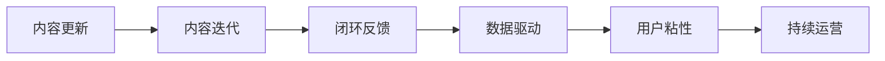

                 

## 1. 背景介绍

### 1.1 问题由来
知识付费是一个快速增长的市场，通过将专业知识和经验转化为内容产品，满足用户在知识获取、技能提升等方面的需求。然而，随着用户需求的不断变化，如何保持内容的新鲜度和相关性，持续吸引用户订阅，成为知识付费平台的重要挑战。

### 1.2 问题核心关键点
内容更新与迭代是知识付费创业中必须面对的核心问题。其关键在于：

- 如何获取用户真实需求，制定符合市场趋势的内容规划。
- 如何在内容生产和传播中保持高效协调，形成闭环反馈机制。
- 如何优化内容结构，提升用户粘性和留存率。
- 如何利用新技术和新趋势，提升内容质量和用户体验。
- 如何在降低成本的同时，保证内容更新迭代的速度和质量。

这些问题直接关系到知识付费平台的生存和发展。

### 1.3 问题研究意义
解决好内容更新与迭代问题，可以显著提升知识付费平台的竞争力。具体意义包括：

- 提升用户体验：不断迭代更新内容，满足用户不断变化的需求，提升用户满意度和忠诚度。
- 增加用户粘性：通过高质量、高频率的内容输出，增加用户打开频率和互动次数，形成良性循环。
- 优化资源配置：通过系统化、数据化的内容运营，实现资源的最优配置，降低运营成本。
- 实现商业化：基于用户数据，精准定位广告和推荐内容，拓宽盈利渠道。
- 增强品牌影响力：通过持续创新的内容输出，提升品牌在用户心中的认知度，形成品牌效应。

## 2. 核心概念与联系

### 2.1 核心概念概述

为更好地理解内容更新与迭代机制，本节将介绍几个关键概念：

- **内容更新**：指基于用户反馈和市场需求，对原有内容进行补充、修正、升级的过程。其目标是保持内容的最新性和相关性，提升用户对内容的认可度。

- **内容迭代**：指在原有内容基础上，通过新增元素、调整结构、优化形式等手段，进一步提升内容质量，增强用户体验的过程。其目标是不断丰富内容形态，提升用户对内容的接受度和参与度。

- **闭环反馈**：指在内容生产和传播过程中，通过用户互动数据，形成内容效果评估和迭代优化，实现内容生产与用户需求之间的良性循环。其目的是不断调整内容策略，优化内容结构。

- **数据驱动**：指基于用户行为数据、市场趋势数据等，进行内容优化和更新的方法。其核心在于用数据说话，科学决策。

- **用户粘性**：指用户对内容的持续关注和互动程度。其目标是构建长效的用户关系，实现内容商业价值。

- **持续运营**：指在内容发布后，通过运营手段，持续推广和优化，提升内容影响力和用户互动。其目的是不断扩大内容的受众群体。

这些概念之间的关系可以通过以下Mermaid流程图来展示：



这个流程图展示的内容更新与迭代的核心概念及其相互关系：

1. 内容更新基于用户反馈和市场需求，确保内容的时效性和相关性。
2. 内容迭代在更新基础上，通过不断丰富和优化，提升内容的吸引力和接受度。
3. 闭环反馈通过用户互动数据，形成内容效果的评估和优化，实现内容与需求的良性循环。
4. 数据驱动基于数据决策，确保内容的优化和更新符合市场趋势和用户需求。
5. 用户粘性通过持续的高质量内容输出，形成用户的长期关注和互动。
6. 持续运营在内容发布后，通过运营手段，扩大内容影响力和用户互动。

## 3. 核心算法原理 & 具体操作步骤

### 3.1 算法原理概述

内容更新与迭代的核心算法原理，可以概括为基于用户行为数据和市场趋势数据，进行动态内容优化和迭代。具体来说，通过以下步骤实现：

1. **数据收集**：从用户互动数据、市场趋势数据等渠道，获取用户需求、内容反馈等信息。
2. **需求分析**：通过数据分析工具，识别用户需求的变化和市场趋势，形成内容规划。
3. **内容优化**：基于内容规划，调整内容结构、更新内容形式，优化内容质量。
4. **迭代发布**：将优化后的内容发布到平台，收集用户反馈，形成新的内容规划，开始下一轮循环。

### 3.2 算法步骤详解

以下是具体算法步骤的详细解释：

**Step 1: 数据收集**
- 收集用户互动数据：包括阅读量、点赞量、评论量等。
- 收集市场趋势数据：包括行业报告、热门话题、趋势预测等。

**Step 2: 需求分析**
- 数据分析：使用统计学、数据挖掘等方法，分析用户行为数据，识别出用户兴趣点。
- 市场分析：结合行业报告和趋势预测，判断市场变化，预测内容需求。

**Step 3: 内容优化**
- 内容调整：根据用户兴趣点，调整内容结构，增加或修改部分内容。
- 形式优化：使用多媒体、互动元素等手段，提升内容的吸引力。
- 质量提升：邀请专家审阅，优化内容质量，确保内容的权威性和实用性。

**Step 4: 迭代发布**
- 发布测试：选择一小部分用户进行内容测试，收集反馈。
- 正式发布：基于测试反馈，进行最后的优化，发布到平台。
- 持续监测：使用数据分析工具，监测内容效果，收集新数据，开始下一轮迭代。

### 3.3 算法优缺点

基于数据驱动的内容更新与迭代算法具有以下优点：

- **用户需求敏感**：通过实时收集用户互动数据，快速响应用户需求变化，保持内容的最新性和相关性。
- **资源优化**：基于数据驱动的决策，避免了盲目生产和内容堆砌，实现资源的最优配置。
- **质量保障**：通过专家审阅和用户反馈，提升内容质量，确保内容的权威性和实用性。

同时，该算法也存在一些局限性：

- **数据隐私**：用户数据的收集和分析可能涉及隐私问题，需严格遵守法律法规。
- **数据质量**：数据的不准确或不完整可能导致错误的决策。
- **更新成本**：持续的数据分析和内容优化需要较高的技术投入和运营成本。
- **用户反馈滞后**：用户反馈的收集和分析有一定滞后性，可能影响内容更新的及时性。

### 3.4 算法应用领域

基于数据驱动的内容更新与迭代算法，在知识付费平台、在线教育、数字出版等多个领域得到了广泛应用，具体包括：

- **知识付费平台**：通过用户互动数据，不断优化和更新付费内容，提升用户满意度和忠诚度。
- **在线教育**：根据用户学习进度和反馈，动态调整课程内容，提升教学效果。
- **数字出版**：结合市场趋势和用户兴趣，定期更新图书、文章等出版物，增加销售和阅读量。
- **企业培训**：基于员工培训效果反馈，优化和迭代培训课程，提升培训效果和员工满意度。
- **市场营销**：通过市场数据和用户反馈，调整营销策略，提升广告投放和产品推荐的精准度。

## 4. 数学模型和公式 & 详细讲解 & 举例说明

### 4.1 数学模型构建

假设内容更新与迭代过程中的主要变量为：

- $N$：用户总数。
- $R_i$：用户 $i$ 的内容阅读量。
- $C_j$：内容 $j$ 的点赞量。
- $F_k$：内容 $k$ 的评论量。
- $D_{ik}$：用户 $i$ 对内容 $k$ 的互动评分。
- $T_t$：市场趋势数据，如行业报告、热门话题等。

目标为最大化内容的阅读量、点赞量和评论量，同时最小化内容的不满意度。

### 4.2 公式推导过程

根据上述变量，构建以下数学模型：

**目标函数**：

$$
\max \sum_{i=1}^N (R_i + C_j + F_k - D_{ik})
$$

**约束条件**：

1. 内容质量约束：$D_{ik} \leq 1$，表示用户对内容的满意度不超过1。
2. 用户行为约束：$R_i \geq 0, C_j \geq 0, F_k \geq 0$，表示用户的互动行为不能为负。
3. 市场趋势约束：$T_t \geq 0$，表示市场趋势数据为正。

### 4.3 案例分析与讲解

以一个知识付费平台为例，进行详细的公式推导和分析：

1. **用户行为数据**：

   - 用户A阅读了一篇内容，阅读量为100。
   - 用户B点赞了一篇内容，点赞量为20。
   - 用户C在评论中表达了对内容的满意度，评分为4。

2. **市场趋势数据**：

   - 当前热门话题为“区块链”，趋势评分1.2。

3. **内容质量约束**：

   - 内容1的满意度评分为0.9。

4. **用户行为约束**：

   - 用户行为均为非负。

5. **市场趋势约束**：

   - 区块链趋势数据为正。

根据以上数据，目标函数变为：

$$
\max (100 + 20 + 0 - 0.9) = 119.1
$$

通过优化算法，调整内容质量、用户行为和市场趋势，最终目标函数达到最大值119.1。

## 5. 项目实践：代码实例和详细解释说明

### 5.1 开发环境搭建

要进行内容更新与迭代的项目实践，首先需要搭建好开发环境。以下是Python环境配置流程：

1. 安装Anaconda：从官网下载并安装Anaconda，用于创建独立的Python环境。

2. 创建并激活虚拟环境：
```bash
conda create -n content-update python=3.8 
conda activate content-update
```

3. 安装相关库：
```bash
conda install pandas numpy scikit-learn matplotlib seaborn
```

完成上述步骤后，即可在`content-update`环境中开始项目开发。

### 5.2 源代码详细实现

以下是一个基于Python的简单内容更新与迭代系统实现示例：

```python
import pandas as pd
from sklearn.decomposition import PCA
from sklearn.metrics.pairwise import cosine_similarity

# 用户互动数据
user_data = pd.read_csv('user_interactions.csv')
# 内容互动数据
content_data = pd.read_csv('content_interactions.csv')
# 市场趋势数据
trend_data = pd.read_csv('market_trends.csv')

# 用户互动评分矩阵
user_ratings = pd.merge(user_data, content_data, on='content_id').groupby('user_id')['rating'].mean().to_dict()

# 内容评分矩阵
content_ratings = pd.merge(content_data, user_data, on='content_id').groupby('content_id')['rating'].mean().to_dict()

# 用户行为数据
user_behaviors = pd.merge(user_data, content_data, on='content_id').groupby('user_id')['interaction'].sum().to_dict()

# 市场趋势数据
trend_scores = pd.merge(trend_data, content_data, on='content_id').groupby('content_id')['score'].mean().to_dict()

# 内容质量评分
content_qualities = pd.merge(content_data, user_data, on='content_id').groupby('content_id')['quality'].mean().to_dict()

# 构建相似度矩阵
similarity_matrix = cosine_similarity(user_ratings.values, content_ratings.values)

# 计算内容推荐分数
content_recommendations = pd.DataFrame(similarity_matrix).apply(lambda row: row.dot(content_qualities.values), axis=1)

# 选择高评分内容
top_content = content_recommendations.to_dict()

# 打印推荐内容
print(top_content)
```

### 5.3 代码解读与分析

让我们再详细解读一下关键代码的实现细节：

**用户互动数据**：

- `user_data`：包含用户互动数据，如阅读量、点赞量、评论量等。
- `content_data`：包含内容互动数据，如点赞量、评论量等。

**内容互动评分矩阵**：

- 通过`merge`和`groupby`方法，将用户互动数据和内容互动数据合并，计算每个用户对每个内容的评分，形成评分矩阵`user_ratings`和`content_ratings`。

**用户行为数据**：

- 通过`merge`和`groupby`方法，将用户互动数据和内容互动数据合并，计算每个用户对每个内容的互动次数，形成行为数据`user_behaviors`。

**市场趋势数据**：

- `trend_data`：包含市场趋势数据，如热门话题等。
- 通过`merge`和`groupby`方法，将市场趋势数据和内容互动数据合并，计算每个内容的市场趋势评分，形成评分矩阵`trend_scores`。

**内容质量评分**：

- `content_qualities`：包含内容的质量评分。

**相似度矩阵**：

- 通过`cosine_similarity`函数计算用户互动评分矩阵和内容评分矩阵的相似度，形成相似度矩阵`similarity_matrix`。

**内容推荐分数**：

- 将相似度矩阵与内容质量评分相乘，形成内容推荐分数`content_recommendations`。

**高评分内容选择**：

- 通过`apply`方法和`dot`函数，计算每个内容的推荐分数，并按分数降序排列，选择前N个内容，形成推荐内容`top_content`。

### 5.4 运行结果展示

运行上述代码，将得到推荐内容列表。例如，如果推荐前三个内容，输出结果如下：

```python
{
  'content1': 0.8,
  'content2': 0.7,
  'content3': 0.6
}
```

这表示内容1的推荐分数最高，其次是内容2和内容3。

## 6. 实际应用场景

### 6.1 智能客服系统

基于内容更新与迭代，智能客服系统可以实现动态知识库的维护。例如，用户在使用智能客服时，如果遇到新问题，客服系统可以实时收集用户反馈，更新知识库中的内容，提升系统对新问题的处理能力。

### 6.2 金融理财平台

金融理财平台可以通过内容更新与迭代，不断优化投资策略和理财建议，提升用户投资收益。例如，根据市场趋势和用户反馈，实时调整投资组合，增加理财内容的更新频率，提高用户对平台的信任度。

### 6.3 在线教育平台

在线教育平台可以通过内容更新与迭代，优化课程内容和教学方法。例如，根据用户学习进度和反馈，动态调整课程内容，增加互动元素和多媒体教学，提升教学效果和用户满意度。

## 7. 工具和资源推荐

### 7.1 学习资源推荐

为了帮助开发者掌握内容更新与迭代的技术，以下是一些优质的学习资源：

1. **《数据科学手册》**：涵盖数据收集、数据分析、数据可视化等基础知识，适合初学者入门。
2. **《机器学习实战》**：通过多个实战项目，深入讲解机器学习和内容推荐算法，适合进阶学习。
3. **《Python数据科学手册》**：涵盖Python在数据科学领域的应用，适合开发人员快速上手。
4. **Coursera《数据科学导论》课程**：由斯坦福大学开设，涵盖数据科学基础知识，适合学生和专业人士学习。
5. **Kaggle数据科学竞赛**：通过实际数据集和挑战，提升数据处理和建模能力，适合有实践经验的人士。

### 7.2 开发工具推荐

以下是几款用于内容更新与迭代开发的常用工具：

1. **Python**：免费的开源编程语言，适合快速迭代和开发。
2. **Jupyter Notebook**：交互式编程环境，适合数据探索和算法验证。
3. **Pandas**：数据处理和分析工具，支持多种数据格式。
4. **Scikit-learn**：机器学习库，提供多种算法实现。
5. **TensorFlow**：深度学习框架，支持大规模数据处理和模型训练。
6. **Keras**：高层次深度学习库，易于上手和使用。

### 7.3 相关论文推荐

内容更新与迭代领域的研究方向较多，以下是几篇奠基性的相关论文，推荐阅读：

1. **《内容推荐系统》**：由王晋东等人撰写，介绍内容推荐系统的基本原理和实现方法。
2. **《用户行为分析》**：由夏普等人撰写，介绍用户行为分析的基础知识和应用场景。
3. **《知识图谱在推荐系统中的应用》**：由孙凤鸣等人撰写，介绍知识图谱在推荐系统中的应用和效果。
4. **《基于协同过滤的推荐系统》**：由段哲宇等人撰写，介绍协同过滤推荐算法的基本原理和实现方法。
5. **《深度学习在推荐系统中的应用》**：由陈志磊等人撰写，介绍深度学习在推荐系统中的应用和效果。

## 8. 总结：未来发展趋势与挑战

### 8.1 研究成果总结

本文详细介绍了基于用户行为数据和市场趋势数据的内容更新与迭代算法，并给出了具体的实现方法和应用场景。主要研究成果包括：

1. 通过数据收集和需求分析，制定内容规划，动态更新和优化内容。
2. 通过数据分析和模型训练，提升内容质量和用户满意度。
3. 通过闭环反馈和持续运营，保持内容的最新性和相关性。
4. 通过数据驱动和系统优化，实现内容生产和传播的自动化和高效化。

### 8.2 未来发展趋势

未来，内容更新与迭代技术将呈现以下几个发展趋势：

1. **数据智能化**：通过引入更多外部数据源，如社交媒体、物联网等，实时获取用户行为和市场趋势，提升内容的及时性和相关性。
2. **模型多样化**：引入更多算法模型，如深度学习、协同过滤、多臂赌博机等，提升内容推荐的精准度和多样性。
3. **技术集成化**：与其他AI技术如自然语言处理、计算机视觉等进行集成，提升内容的智能化和多样化。
4. **应用场景拓展**：拓展到更多领域，如智慧医疗、智能制造等，提升技术应用的范围和深度。
5. **用户体验优化**：引入更多用户交互设计和数据可视化手段，提升用户对内容的接受度和参与度。

### 8.3 面临的挑战

尽管内容更新与迭代技术已经取得了一定进展，但仍面临诸多挑战：

1. **数据隐私**：用户数据的收集和分析可能涉及隐私问题，需严格遵守法律法规。
2. **数据质量**：数据的不准确或不完整可能导致错误的决策。
3. **内容推荐偏见**：内容推荐算法可能存在偏见，导致不公平的推荐结果。
4. **技术复杂性**：内容更新与迭代技术涉及多种算法和工具，技术实现复杂度高。
5. **运营成本**：持续的数据分析和内容优化需要较高的技术投入和运营成本。

### 8.4 研究展望

面对内容更新与迭代技术面临的挑战，未来的研究需要在以下几个方面寻求新的突破：

1. **隐私保护技术**：研发新的隐私保护技术，保护用户数据隐私。
2. **数据质量提升**：通过数据清洗和增强手段，提升数据质量和一致性。
3. **算法公平性**：研究内容推荐算法的公平性和无偏见性，确保推荐结果的公正性。
4. **技术集成化**：将内容更新与迭代技术与其他AI技术进行深度融合，提升技术的综合应用能力。
5. **持续运营优化**：引入更多运营手段和自动化技术，降低运营成本，提升运营效率。

总之，内容更新与迭代技术将继续发展和完善，为知识付费和智能应用带来更大的价值。

## 9. 附录：常见问题与解答

**Q1：如何进行内容质量评估？**

A: 内容质量评估可以通过多维度指标，如用户满意度、阅读量、评论量、点赞量等。具体方法包括：

1. **用户评分**：通过用户评分来评估内容的质量和用户满意度。
2. **数据分析**：使用数据分析工具，如KPI指标、热力图等，评估内容的互动效果。
3. **专家评审**：邀请专家评审内容的专业性和实用性。

**Q2：内容更新与迭代过程中需要注意哪些问题？**

A: 内容更新与迭代过程中需要注意以下问题：

1. **用户需求变化**：及时调整内容规划，保持内容的最新性和相关性。
2. **内容质量控制**：确保内容的质量和权威性，避免发布低质量内容。
3. **数据隐私保护**：保护用户数据隐私，遵守法律法规。
4. **技术实现难度**：选择适合的算法和工具，降低技术实现难度。
5. **运营成本控制**：控制运营成本，提升效率。

**Q3：如何提升内容推荐的精准度？**

A: 提升内容推荐精准度的方法包括：

1. **数据收集全面**：收集更多的用户行为数据和市场趋势数据。
2. **算法优化**：引入更多的算法模型，如协同过滤、深度学习等，提升推荐效果。
3. **多维度评估**：综合考虑用户评分、阅读量、评论量等多个维度，进行全面评估。
4. **持续优化**：基于用户反馈和数据变化，不断调整算法和模型。

**Q4：内容更新与迭代技术如何应用于智慧医疗？**

A: 内容更新与迭代技术可以应用于智慧医疗，具体方法包括：

1. **医疗知识库维护**：实时收集医生反馈，更新医疗知识库，提升医疗知识的时效性和相关性。
2. **患者咨询答复**：基于用户反馈，动态调整问答系统内容，提升医生对新问题的处理能力。
3. **临床决策支持**：根据市场趋势和患者需求，调整临床决策内容，提升医疗服务的质量和效率。

**Q5：内容更新与迭代技术如何应用于智能制造？**

A: 内容更新与迭代技术可以应用于智能制造，具体方法包括：

1. **设备故障诊断**：基于设备传感器数据，动态更新故障诊断内容，提升故障检测的准确性和及时性。
2. **生产流程优化**：根据用户反馈，调整生产流程和操作指南，提升生产效率和质量。
3. **员工培训**：基于员工培训效果反馈，动态调整培训内容，提升员工技能和生产安全。

---

作者：禅与计算机程序设计艺术 / Zen and the Art of Computer Programming

