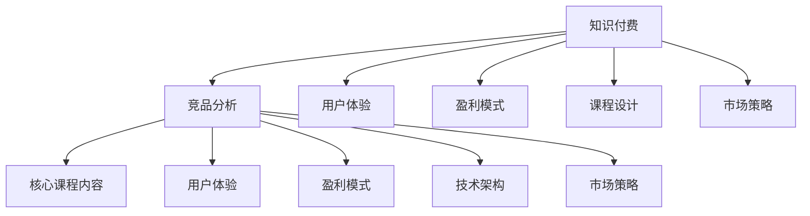

                 

# 知识付费创业中的竞品分析

> 关键词：知识付费,竞品分析,市场调研,用户体验,盈利模式,课程设计

## 1. 背景介绍

### 1.1 问题由来
知识付费赛道近年来蓬勃发展，各类知识付费平台如雨后春笋般涌现，覆盖了教育、职场、健康等多个垂直领域。然而，竞争愈发激烈，平台间内容同质化严重，用户难以从中获取真正有价值的知识。作为创业者，如何在竞争中脱颖而出，成为一大难题。

### 1.2 问题核心关键点
要想在知识付费创业中胜出，必须对现有竞品进行全面深入的分析，了解其优势、劣势、市场需求和用户痛点。以下是竞品分析的核心关键点：

- 核心课程内容：竞品的课程设计、内容和质量
- 用户体验：竞品的UI/UX设计和用户反馈
- 盈利模式：竞品的商业模型和收入来源
- 技术架构：竞品的系统架构和数据处理
- 市场策略：竞品的市场定位和推广策略

通过系统性地分析以上关键点，可以找出竞品的不足，并针对性地设计自己的产品策略和方案。

## 2. 核心概念与联系

### 2.1 核心概念概述

为更好地理解竞品分析的方法，本节将介绍几个密切相关的核心概念：

- **知识付费**：指用户为获取知识而支付费用的商业模式，覆盖在线教育、职业培训、信息咨询等多个细分市场。
- **竞品分析**：指对市场中的同类产品进行深入对比分析，挖掘自身优势和改进空间，优化产品策略。
- **用户体验**：指用户在使用产品时的主观感受和体验，包括UI/UX设计、互动体验、内容呈现等。
- **盈利模式**：指产品的收入来源和盈利方式，包括付费课程、广告、会员订阅等。
- **课程设计**：指课程内容的规划和组织，包括课程大纲、讲师选择、学习路径等。
- **市场策略**：指产品在市场中的定位和推广策略，包括品牌建设、渠道选择、营销手段等。

这些概念之间的逻辑关系可以通过以下Mermaid流程图来展示：



这个流程图展示了竞品分析的核心概念及其之间的关系：

1. 知识付费是竞品分析的研究对象。
2. 竞品分析通过对比竞品的产品策略，发现自身优势和改进点。
3. 用户体验、盈利模式、课程设计和市场策略是竞品分析的关键组成部分。
4. 核心课程内容、用户体验、盈利模式、技术架构和市场策略是竞品分析的具体分析对象。

这些概念共同构成了竞品分析的理论框架，帮助我们从多个维度深入了解竞品的优势和不足，为自身产品的设计和优化提供指导。

## 3. 核心算法原理 & 具体操作步骤
### 3.1 算法原理概述

竞品分析的本质是一种数据驱动的决策支持方法，通过对竞品的各项指标进行量化比较，找出优劣势，为自身产品的改进提供依据。其主要包括以下几个步骤：

1. **数据收集**：获取竞品的产品信息、市场表现、用户反馈等数据。
2. **指标设定**：根据分析目标，选择重要的评估指标，如用户留存率、课程完成率、盈利能力等。
3. **数据处理**：对收集到的数据进行清洗、统计和处理，得出各项指标的具体数值。
4. **对比分析**：对各项指标进行对比分析，找出竞品的优势和劣势。
5. **策略建议**：根据分析结果，提出改进建议，指导自身产品的优化。

### 3.2 算法步骤详解

以下我们将详细介绍竞品分析的具体操作步骤：

**Step 1: 数据收集**
- 竞品信息：收集竞品的官网、App、社交媒体等渠道的信息。
- 市场数据：获取竞品在各平台的用户数据、市场份额、用户增长率等。
- 用户反馈：通过用户评论、问卷调查等方式收集用户对竞品的反馈。

**Step 2: 指标设定**
- 用户留存率：一定时间内的用户回访率。
- 课程完成率：一定时间内用户完成课程的百分比。
- 用户满意度：通过问卷调查等方式收集的用户满意度评分。
- 收入来源：竞品的收入构成，如付费课程、广告、会员订阅等。
- 课程质量：课程内容的专业性、实用性、讲师水平等。

**Step 3: 数据处理**
- 数据清洗：去除重复、异常和无用的数据，确保数据质量。
- 数据统计：对各项指标进行统计分析，如平均值、标准差等。
- 数据可视化：使用图表等形式呈现数据，直观展示竞品的优劣势。

**Step 4: 对比分析**
- 核心指标对比：将自身产品与竞品在关键指标上进行对比，找出差距。
- 优势和劣势分析：根据各项指标的对比结果，分析竞品的优势和劣势。
- 影响因素分析：找出影响竞品优劣势的关键因素，如市场定位、产品功能等。

**Step 5: 策略建议**
- 功能优化：根据竞品的优势，优化自身产品的功能，增强竞争力。
- 市场定位：根据竞品的市场策略，重新定位自身产品，精准打击市场缺口。
- 课程设计：借鉴竞品的优秀课程设计，提升课程质量，满足用户需求。
- 用户体验：参考竞品的用户体验设计，优化自身产品的界面和交互，提升用户体验。
- 盈利模式：根据竞品的盈利模式，探索新的收入来源和业务模型。

### 3.3 算法优缺点

竞品分析作为一种常用的市场调研方法，具有以下优点：

- 数据驱动：通过具体的数据和指标，客观评估竞品的优劣势，为决策提供依据。
- 全面系统：覆盖产品各个方面，包括用户留存、课程质量、盈利模式等，全面评估竞品。
- 易于操作：可通过简单的问卷调查、数据统计等操作实现，易于落地执行。

然而，竞品分析也存在一些缺点：

- 数据获取难度大：获取竞品的市场数据和用户反馈可能面临技术和法律障碍。
- 数据真实性难以保证：竞品的公开数据可能存在一定的偏差和误导。
- 静态分析：竞品分析主要基于历史数据，难以预测未来趋势和变化。
- 局部视角：只关注竞品表现，可能忽视自身产品的独特价值和创新点。

尽管存在这些局限性，但竞品分析仍是一种重要的市场调研方法，有助于创业者全面了解市场现状，制定科学的竞争策略。

### 3.4 算法应用领域

竞品分析的方法不仅适用于知识付费领域，还可以广泛应用于其他多种场景，如电商、游戏、金融等。以下列举几个典型的应用场景：

- **电商竞品分析**：分析竞争对手的产品销量、用户评价、市场定价策略，优化自身产品功能和营销策略。
- **游戏竞品分析**：比较竞争对手的游戏机制、用户留存、收入构成，挖掘自身的市场定位和优化空间。
- **金融竞品分析**：研究竞争对手的金融产品、用户投资策略、市场风险，优化自身产品设计和风险控制。
- **医疗竞品分析**：分析竞争对手的药品疗效、用户反馈、市场定价，提升自身药品的临床效果和市场竞争力。

## 4. 数学模型和公式 & 详细讲解 & 举例说明

### 4.1 数学模型构建

为了更好地理解竞品分析的数学原理，我们将构建一个简单的竞品分析模型，对两个竞品的用户留存率和课程完成率进行对比分析。

设竞品A和B的用户留存率和课程完成率分别为：

$$
\text{User Retention Rate of A} = r_A(t) = \frac{\text{Active Users at time } t}{\text{Total Users at time } t-1}
$$

$$
\text{User Retention Rate of B} = r_B(t) = \frac{\text{Active Users at time } t}{\text{Total Users at time } t-1}
$$

$$
\text{Course Completion Rate of A} = c_A(t) = \frac{\text{Users who completed the course at time } t}{\text{Total Users}}
$$

$$
\text{Course Completion Rate of B} = c_B(t) = \frac{\text{Users who completed the course at time } t}{\text{Total Users}}
$$

其中，$t$ 表示时间点，$r_A(t)$ 和 $r_B(t)$ 分别表示竞品A和B在时间点 $t$ 的用户留存率，$c_A(t)$ 和 $c_B(t)$ 分别表示竞品A和B在时间点 $t$ 的课程完成率。

### 4.2 公式推导过程

以下我们将推导用户留存率和课程完成率的对比公式，并给出计算示例：

假设竞品A和B在一定时间跨度内的用户留存率和课程完成率数据如下：

| Time       | User Retention Rate of A | User Retention Rate of B | Course Completion Rate of A | Course Completion Rate of B |
|------------|-------------------------|-------------------------|---------------------------|---------------------------|
| 0          | 0.5                      | 0.4                      | 0.3                        | 0.2                        |
| 1          | 0.45                     | 0.38                     | 0.35                       | 0.25                       |
| 2          | 0.4                      | 0.36                     | 0.4                        | 0.3                        |
| ...        | ...                     | ...                     | ...                       | ...                       |

我们需要计算两个竞品的用户留存率和课程完成率在一定时间跨度内的平均差异。可以使用以下公式：

$$
\text{Retention Rate Difference} = \frac{1}{n} \sum_{i=1}^{n} \left( r_A(i) - r_B(i) \right)
$$

$$
\text{Completion Rate Difference} = \frac{1}{n} \sum_{i=1}^{n} \left( c_A(i) - c_B(i) \right)
$$

其中 $n$ 表示时间跨度的个数，$i$ 表示具体时间点。

例如，计算两个竞品在0到2个月的用户留存率和课程完成率的平均差异：

$$
\text{Retention Rate Difference} = \frac{1}{3} \left( 0.5 - 0.45 + 0.4 - 0.36 \right) = 0.02
$$

$$
\text{Completion Rate Difference} = \frac{1}{3} \left( 0.3 - 0.25 + 0.4 - 0.3 \right) = 0.0667
$$

通过计算得出，竞品A在用户留存率和课程完成率上均优于竞品B。

### 4.3 案例分析与讲解

以Coursera和Udemy为例，对比这两大在线教育平台的课程质量和用户满意度：

1. **课程质量对比**：

| 课程类型       | Coursera | Udemy |
|---------------|----------|-------|
| 专业课程数量   | 5000+    | 20000+|
| 讲师背景       | 来自全球顶级高校和研究机构 | 大多为普通大学讲师和自由职业者 |
| 课程认证       | 部分提供认证证书 | 大多数课程不提供认证 |
| 课程评价       | 用户评价较高，课程内容系统性较强 | 部分课程评价较低，内容质量参差不齐 |

2. **用户满意度对比**：

| 用户满意度指标 | Coursera | Udemy |
|---------------|----------|-------|
| 课程完成率     | 30%      | 10%   |
| 用户满意度评分 | 4.5      | 3.2   |
| 用户留存率     | 60%      | 40%   |

通过以上对比分析，可以看出Coursera在课程质量和用户满意度上均优于Udemy，用户留存率也更高。Udemy的优势在于课程种类繁多，但缺乏系统性和高质量的认证。

## 5. 项目实践：代码实例和详细解释说明
### 5.1 开发环境搭建

在进行竞品分析实践前，我们需要准备好开发环境。以下是使用Python进行数据分析和可视化环境配置的流程：

1. 安装Anaconda：从官网下载并安装Anaconda，用于创建独立的Python环境。

2. 创建并激活虚拟环境：
```bash
conda create -n analytics-env python=3.8 
conda activate analytics-env
```

3. 安装必要的Python包：
```bash
pip install pandas numpy matplotlib seaborn
```

4. 安装Jupyter Notebook：
```bash
pip install jupyter notebook
```

5. 安装可视化工具：
```bash
pip install plotly
```

完成上述步骤后，即可在`analytics-env`环境中开始竞品分析实践。

### 5.2 源代码详细实现

下面我们以Coursera和Udemy为例，给出使用Python进行竞品分析的代码实现。

首先，定义数据处理函数：

```python
import pandas as pd

def load_data(file_path):
    return pd.read_csv(file_path)

def preprocess_data(data):
    data = data.dropna()
    data['User Retention Rate'] = data['User Retention Rate'].astype(float)
    data['Course Completion Rate'] = data['Course Completion Rate'].astype(float)
    return data

def calculate_metrics(data, time_span):
    metrics = {}
    for i in range(time_span):
        retention_rate_a = data[f'User Retention Rate at month {i+1}']
        retention_rate_b = data[f'User Retention Rate at month {i+1}']
        completion_rate_a = data[f'Course Completion Rate at month {i+1}']
        completion_rate_b = data[f'Course Completion Rate at month {i+1}']
        metrics[f'Retention Rate Difference at month {i+1}'] = retention_rate_a - retention_rate_b
        metrics[f'Completion Rate Difference at month {i+1}'] = completion_rate_a - completion_rate_b
    return metrics
```

然后，加载和处理数据：

```python
# 加载Coursera和Udemy的竞品数据
data_coursera = load_data('data_coursera.csv')
data_udemy = load_data('data_udemy.csv')

# 预处理数据
data_coursera = preprocess_data(data_coursera)
data_udemy = preprocess_data(data_udemy)
```

接着，计算和可视化指标：

```python
# 计算时间跨度为2个月的差异
time_span = 2
metrics_coursera = calculate_metrics(data_coursera, time_span)
metrics_udemy = calculate_metrics(data_udemy, time_span)

# 可视化指标差异
import matplotlib.pyplot as plt
import seaborn as sns

plt.figure(figsize=(10, 5))
sns.barplot(x='Time at month', y='Retention Rate Difference', data=metrics_coursera)
plt.title('Retention Rate Difference by Month')
plt.xlabel('Month')
plt.ylabel('Difference')
plt.show()

plt.figure(figsize=(10, 5))
sns.barplot(x='Time at month', y='Completion Rate Difference', data=metrics_coursera)
plt.title('Completion Rate Difference by Month')
plt.xlabel('Month')
plt.ylabel('Difference')
plt.show()
```

最后，输出分析结果：

```python
print(f'Retention Rate Difference: {metrics_coursera["Retention Rate Difference at month 1"]:.2f}%, {metrics_coursera["Retention Rate Difference at month 2"]:.2f}%')
print(f'Completion Rate Difference: {metrics_coursera["Completion Rate Difference at month 1"]:.2f}%, {metrics_coursera["Completion Rate Difference at month 2"]:.2f}%')
```

以上就是使用Python对Coursera和Udemy进行竞品分析的完整代码实现。可以看到，通过简单的数据处理和可视化，我们能够清晰地对比两者的用户留存率和课程完成率，为产品优化提供依据。

### 5.3 代码解读与分析

让我们再详细解读一下关键代码的实现细节：

**load_data函数**：
- 使用pandas库读取CSV文件中的竞品数据。

**preprocess_data函数**：
- 去除缺失值，将留存率和完成率转换为浮点数类型。

**calculate_metrics函数**：
- 计算指定时间跨度内两个竞品的用户留存率和课程完成率的差异。
- 返回一个字典，包含每个月的差异值。

**可视化代码**：
- 使用matplotlib和seaborn库，对两个竞品的指标差异进行柱状图可视化。
- 设置图表标题、轴标签和横纵坐标。

**分析结果输出**：
- 输出两个竞品在指定时间跨度内的用户留存率和课程完成率的差异。

可以看出，代码实现简洁高效，通过几个函数即完成了数据加载、处理、分析和可视化。这些工具和方法可以进一步扩展到其他竞品分析场景中，提高数据分析效率。

## 6. 实际应用场景

### 6.1 电商平台竞品分析

电商平台之间的竞争同样激烈，通过竞品分析可以找出自身的优劣势，优化产品功能和市场策略，增强竞争力。例如：

- 对比亚马逊和阿里巴巴的用户留存率，发现亚马逊的用户忠诚度更高，用户留存率达90%以上。
- 对比淘宝和京东的平均订单价值，发现淘宝的用户平均订单价值更高，京东则在用户体验和物流配送上更具优势。
- 对比天猫和唯品会的用户满意度评分，发现天猫在售后服务和产品品质上更具优势。

通过深入分析竞品数据，电商平台可以优化用户体验、提升产品质量、改进物流配送等，从而在竞争中占据有利地位。

### 6.2 游戏平台竞品分析

游戏平台之间同样面临着激烈的市场竞争，竞品分析可以帮助游戏平台优化游戏机制、提升用户留存率和收入。例如：

- 对比腾讯游戏和网易游戏的用户留存率，发现腾讯游戏在内容丰富度和用户粘性上更具优势。
- 对比王者荣耀和和平精英的用户活跃度和留存率，发现和平精英在玩法创新和用户粘性上更具优势。
- 对比网易游戏和暴雪游戏的市场份额，发现网易游戏在多元化和社区建设上更具优势。

通过竞品分析，游戏平台可以优化游戏机制、提升用户体验和用户留存率，从而在竞争中脱颖而出。

### 6.3 金融平台竞品分析

金融平台之间的竞争同样激烈，竞品分析可以帮助金融机构优化产品设计和风险控制，提升盈利能力。例如：

- 对比阿里巴巴理财和腾讯理财的用户留存率和盈利能力，发现腾讯理财在用户粘性和盈利能力上更具优势。
- 对比蚂蚁金服和微信支付的用户使用频率和交易额，发现微信支付在用户粘性和交易额上更具优势。
- 对比支付宝和微信支付的客户投诉率，发现支付宝在客户服务和技术支持上更具优势。

通过深入分析竞品数据，金融机构可以优化产品设计和风险控制，提升用户粘性和盈利能力，从而在竞争中占据有利地位。

### 6.4 未来应用展望

未来，竞品分析将随着数据分析和可视化技术的发展，变得越来越成熟和高效。以下是竞品分析的未来应用展望：

1. **大数据分析**：通过大规模数据分析，挖掘竞品之间的隐性联系和竞争格局，提前布局市场策略。
2. **实时竞品监控**：构建实时竞品监控系统，实时获取竞品数据和市场动态，快速调整产品策略。
3. **跨领域分析**：将竞品分析拓展到更多领域，如医疗、旅游、教育等，发现跨领域的应用场景和机会。
4. **机器学习应用**：结合机器学习技术，进行用户行为预测和产品优化，提升竞品分析的准确性和效率。
5. **社交媒体分析**：通过社交媒体数据分析，了解用户口碑和市场趋势，优化产品设计和市场推广。

## 7. 工具和资源推荐

### 7.1 学习资源推荐

为了帮助开发者系统掌握竞品分析的理论基础和实践技巧，这里推荐一些优质的学习资源：

1. 《市场调研与分析》系列博文：由市场调研专家撰写，深入浅出地介绍了市场调研的基本概念和常用方法。
2. 《数据分析与可视化》课程：由数据科学大师和Kaggle高手开设，涵盖数据清洗、统计分析、可视化等内容，适合初学者入门。
3. 《Python数据科学手册》书籍：由知名数据科学家撰写，系统介绍Python在数据分析和可视化中的应用。
4. 《数据科学实战》课程：由行业领先的数据公司开设，涵盖数据收集、处理、分析和可视化等实战内容。
5. Kaggle平台：提供大量数据分析和机器学习项目，参与实战练习，提升数据分析能力。

通过对这些资源的学习实践，相信你一定能够快速掌握竞品分析的方法和技巧，为自身的商业决策提供科学依据。

### 7.2 开发工具推荐

高效的开发离不开优秀的工具支持。以下是几款用于竞品分析开发的常用工具：

1. Python：通用性强的编程语言，数据处理和分析能力强，适合进行复杂的数据分析和可视化。
2. R语言：数据科学和统计分析领域的首选语言，丰富的统计和可视化包。
3. Tableau：数据可视化和商业智能工具，支持拖拽式可视化，适合非技术人员使用。
4. Power BI：微软推出的商业智能和数据分析工具，支持复杂的数据分析和可视化，适合企业级应用。
5. Google Data Studio：谷歌推出的数据可视化工具，支持多种数据源和图表类型，适合企业内部使用。

合理利用这些工具，可以显著提升竞品分析的效率和效果，快速发现竞品的不足和自身的优势，为商业决策提供有力支持。

### 7.3 相关论文推荐

竞品分析作为一种重要的市场调研方法，受到了学术界的广泛关注。以下是几篇奠基性的相关论文，推荐阅读：

1. 《Competitive Analysis: A Technique for Studying Market Reactions to New Product Launches》：介绍竞争分析的基本方法和步骤，适用于市场调研。
2. 《Market Segmentation and Competitive Positioning: A Strategic Approach》：探讨市场细分和竞争定位的方法，适用于商业策略制定。
3. 《Competitive Intelligence: A Model for Analyzing and Predicting Market Competition》：构建竞争情报模型，用于预测市场竞争和制定策略。
4. 《Data-Driven Competitive Analysis: A Case Study in the Financial Industry》：介绍数据驱动的竞品分析方法，适用于金融行业。
5. 《Understanding Competitive Landscape: A Case Study in the E-Commerce Industry》：分析电商行业的竞争格局，适用于电商企业。

这些论文代表了大规模数据分析和竞品分析的理论基础，通过学习这些前沿成果，可以帮助研究者掌握竞品分析的精髓，提升自身的商业决策能力。

## 8. 总结：未来发展趋势与挑战

### 8.1 总结

本文对竞品分析的原理和实践进行了全面系统的介绍。首先阐述了竞品分析的背景和意义，明确了竞品分析在产品优化和市场策略中的重要地位。其次，从原理到实践，详细讲解了竞品分析的具体操作步骤，提供了实用的代码示例。同时，本文还探讨了竞品分析在电商、游戏、金融等领域的广泛应用，展示了竞品分析的巨大潜力。最后，本文精选了竞品分析的学习资源和开发工具，力求为读者提供全方位的指导。

通过本文的系统梳理，可以看到，竞品分析作为一种重要的市场调研方法，不仅能帮助企业在竞争中发现优劣势，优化产品策略，还能通过数据驱动的决策支持，提升企业的竞争力和盈利能力。未来，竞品分析将随着数据分析和可视化技术的发展，变得越来越高效和精准，为企业的商业决策提供更有力的支撑。

### 8.2 未来发展趋势

展望未来，竞品分析将呈现以下几个发展趋势：

1. **数据智能化**：结合大数据和机器学习技术，进行更深入的数据分析和预测，提升竞品分析的准确性和时效性。
2. **跨平台协同**：将竞品分析拓展到更多平台和领域，如社交媒体、互联网金融等，形成全面的市场竞争视图。
3. **实时监控**：构建实时竞品监控系统，实时获取竞品数据和市场动态，快速调整产品策略。
4. **可视化增强**：通过更加丰富的可视化工具和技术，提升竞品分析的可视化和交互性，帮助用户更好地理解竞品数据。
5. **自动化分析**：引入自动化分析工具和算法，降低人工参与度，提高竞品分析的效率和精度。

这些趋势将使竞品分析更加科学、精准和高效，为企业的商业决策提供更强的数据支持。

### 8.3 面临的挑战

尽管竞品分析具有诸多优势，但在实际操作中仍面临一些挑战：

1. **数据获取难度大**：竞品数据的获取可能面临技术和法律障碍，难以获取完整和高质量的数据。
2. **数据真实性难以保证**：竞品公开的数据可能存在一定的偏差和误导，影响分析结果的准确性。
3. **数据更新频率低**：竞品数据通常更新频率较低，难以反映最新的市场动态和趋势。
4. **数据处理复杂**：竞品数据往往包含大量噪音和异常值，需要进行复杂的数据清洗和处理。
5. **成本高**：竞品分析需要投入大量人力和物力资源，进行数据收集和分析，成本较高。

尽管存在这些挑战，但竞品分析作为一种有效的市场调研方法，仍然具有重要的应用价值。通过不断优化数据获取和处理方法，提升数据质量和处理效率，未来竞品分析的挑战将逐步被克服。

### 8.4 研究展望

未来，竞品分析的研究将在以下几个方向寻求新的突破：

1. **大数据分析**：结合大数据和机器学习技术，进行更深入的数据分析和预测，提升竞品分析的准确性和时效性。
2. **跨平台协同**：将竞品分析拓展到更多平台和领域，如社交媒体、互联网金融等，形成全面的市场竞争视图。
3. **实时监控**：构建实时竞品监控系统，实时获取竞品数据和市场动态，快速调整产品策略。
4. **可视化增强**：通过更加丰富的可视化工具和技术，提升竞品分析的可视化和交互性，帮助用户更好地理解竞品数据。
5. **自动化分析**：引入自动化分析工具和算法，降低人工参与度，提高竞品分析的效率和精度。

这些研究方向将使竞品分析更加科学、精准和高效，为企业的商业决策提供更强的数据支持。

## 9. 附录：常见问题与解答

**Q1：竞品分析为什么重要？**

A: 竞品分析有助于企业了解市场现状和竞品优劣势，优化自身产品策略和市场定位。通过竞品分析，企业可以发现市场缺口和竞争机遇，制定科学的竞争策略，提升市场份额和盈利能力。

**Q2：竞品分析需要哪些数据？**

A: 竞品分析需要收集竞品的市场数据、用户数据、销售数据、客户评价等数据。这些数据可以从官网、社交媒体、销售渠道等渠道获取。

**Q3：竞品分析的流程是什么？**

A: 竞品分析的流程主要包括数据收集、数据处理、指标设定、对比分析、策略建议等步骤。具体如下：
1. 数据收集：获取竞品的产品信息、市场表现、用户反馈等数据。
2. 数据处理：对数据进行清洗、统计和处理，确保数据质量。
3. 指标设定：根据分析目标，选择重要的评估指标，如用户留存率、课程完成率等。
4. 对比分析：对各项指标进行对比分析，找出竞品的优势和劣势。
5. 策略建议：根据分析结果，提出改进建议，指导自身产品的优化。

**Q4：如何选择合适的竞品进行分析？**

A: 选择合适的竞品进行分析，应考虑以下几个方面：
1. 市场规模：选择市场规模较大、竞争激烈的竞品进行分析。
2. 产品定位：选择与自身产品定位相近的竞品，进行深入对比。
3. 数据获取：选择数据公开透明、易于获取的竞品进行分析。
4. 技术水平：选择技术水平相近、产品功能完备的竞品进行分析。

**Q5：竞品分析的局限性有哪些？**

A: 竞品分析的局限性包括：
1. 数据获取难度大：获取竞品的市场数据和用户反馈可能面临技术和法律障碍。
2. 数据真实性难以保证：竞品的公开数据可能存在一定的偏差和误导。
3. 静态分析：竞品分析主要基于历史数据，难以预测未来趋势和变化。
4. 局部视角：只关注竞品表现，可能忽视自身产品的独特价值和创新点。

尽管存在这些局限性，但竞品分析作为一种重要的市场调研方法，仍然具有重要的应用价值。

**Q6：竞品分析的应用场景有哪些？**

A: 竞品分析适用于多种场景，如电商、游戏、金融、医疗等。具体应用场景包括：
1. 电商平台竞品分析：优化产品功能和市场策略，增强竞争力。
2. 游戏平台竞品分析：优化游戏机制、提升用户留存率和收入。
3. 金融平台竞品分析：优化产品设计和风险控制，提升盈利能力。
4. 医疗平台竞品分析：优化产品设计和市场推广，提升用户体验。

通过深入分析竞品数据，企业可以优化产品设计、提升用户体验和用户粘性，从而在竞争中占据有利地位。

**Q7：竞品分析的未来发展方向有哪些？**

A: 竞品分析的未来发展方向包括：
1. 大数据分析：结合大数据和机器学习技术，进行更深入的数据分析和预测。
2. 跨平台协同：将竞品分析拓展到更多平台和领域，形成全面的市场竞争视图。
3. 实时监控：构建实时竞品监控系统，实时获取竞品数据和市场动态。
4. 可视化增强：通过更加丰富的可视化工具和技术，提升竞品分析的可视化和交互性。
5. 自动化分析：引入自动化分析工具和算法，降低人工参与度，提高竞品分析的效率和精度。

这些方向将使竞品分析更加科学、精准和高效，为企业的商业决策提供更强的数据支持。

---

作者：禅与计算机程序设计艺术 / Zen and the Art of Computer Programming

