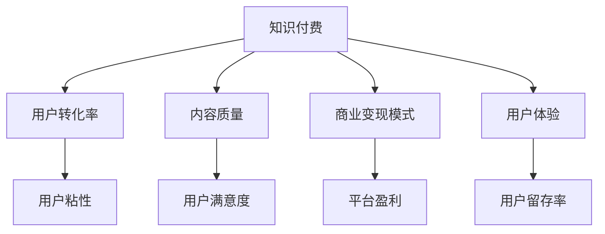

                 

## 1. 背景介绍

在数字化和互联网技术的推动下，知识付费市场迅速崛起，成为移动互联网经济的一个重要组成部分。根据艾媒咨询发布的《2021年中国知识付费行业专题研究报告》，中国知识付费市场规模已达392.9亿元，同比增长45.6%。这一增长势头，预示着知识付费领域将迎来更加激烈的市场竞争和商业模式创新的新机遇。

然而，尽管知识付费市场潜力巨大，但面临的挑战也层出不穷。用户粘性不高、内容同质化严重、商业变现模式单一等问题的存在，严重制约了知识付费行业的健康发展。在这样的背景下，如何优化商业模式，提升用户体验，提高用户转化率和内容质量，成为摆在知识付费创业者面前的重要课题。

## 2. 核心概念与联系

### 2.1 核心概念概述

要优化知识付费的商业模式，首先需要理解几个核心概念：

- **知识付费**：通过付费方式提供具有独特价值的知识内容，满足用户的学习需求。知识付费可以涵盖多种形式，如音频课程、视频教程、在线问答、电子书等。

- **用户转化率**：指用户在接触到知识付费平台后，从潜在用户转化为实际用户的比例。用户转化率是衡量平台吸引力和用户满意度的重要指标。

- **内容质量**：指知识付费平台提供的知识内容的深度、广度和实用性。内容质量直接影响用户体验和用户留存率。

- **商业变现模式**：包括付费订阅、按需付费、会员增值服务等多种形式。商业变现模式的选择直接影响平台的盈利能力和运营可持续性。

- **用户体验**：涉及用户从登录、浏览、购买到学习全过程的互动体验，直接影响用户对平台的粘性。

这些核心概念之间的关系可以通过以下Mermaid流程图来展示：



这个流程图展示了知识付费平台的核心业务流程和关键指标之间的逻辑联系：

1. 知识付费平台通过高质量的内容吸引用户，促进用户转化。
2. 内容质量和用户体验直接影响用户满意度，进而影响用户粘性。
3. 用户粘性是衡量平台吸引力和用户体验的重要指标。
4. 平台盈利主要依赖于商业变现模式的选择。

### 2.2 核心概念原理和架构的 Mermaid 流程图


## 3. 核心算法原理 & 具体操作步骤

### 3.1 算法原理概述

知识付费平台的商业模式优化，本质上是一个多目标优化问题，需要综合考虑用户转化率、内容质量、商业变现模式和用户体验等多个维度。算法的核心思想是通过机器学习和大数据分析，识别出影响各关键指标的主要因素，并根据实际情况进行策略调整。

具体来说，知识付费平台的商业模式优化可以分解为以下几个关键步骤：

1. **用户行为分析**：通过数据分析工具，收集和分析用户在平台上的行为数据，包括浏览时间、购买频率、内容评价等，以识别出影响用户转化的主要因素。

2. **内容质量评估**：使用自然语言处理（NLP）和图像处理等技术，对知识内容进行自动评价和分类，识别出优质内容，进行优先推荐。

3. **商业变现策略优化**：结合用户行为数据和内容质量评估结果，选择和优化商业变现模式，如付费订阅、按需付费等，提升平台的盈利能力。

4. **用户体验优化**：通过A/B测试和用户反馈，不断优化平台界面设计、内容呈现方式等，提升用户体验。

### 3.2 算法步骤详解

#### 3.2.1 用户行为分析

用户行为分析主要通过以下步骤完成：

1. **数据收集**：使用日志分析工具（如Apache Ambari、Google Analytics等）收集用户在平台上的行为数据，包括访问时长、浏览内容、购买记录等。

2. **数据清洗与处理**：对收集到的数据进行去重、归一化、特征工程等预处理操作，去除噪音数据，提取关键特征。

3. **用户画像构建**：通过聚类、降维等方法，构建用户画像，识别出不同用户群体的行为特征。

4. **影响因素识别**：使用分类、回归等机器学习算法，识别出影响用户转化的关键因素，如内容质量、内容类型、推荐算法等。

#### 3.2.2 内容质量评估

内容质量评估主要通过以下步骤完成：

1. **文本特征提取**：使用TF-IDF、Word2Vec等NLP技术，对知识内容进行特征提取，生成文本向量。

2. **情感分析**：使用情感分析算法（如LSTM、BERT等），对内容进行情感倾向分析，评估内容的价值和吸引力。

3. **用户评价分析**：通过分析用户对内容的评价数据，识别出用户偏好和痛点。

4. **内容分类与推荐**：使用分类算法（如KNN、SVM等）对内容进行分类，使用推荐算法（如协同过滤、基于内容的推荐等）对优质内容进行推荐。

#### 3.2.3 商业变现策略优化

商业变现策略优化主要通过以下步骤完成：

1. **定价模型建立**：根据内容价值、用户需求和市场定价策略，建立定价模型，确定不同内容的价格区间。

2. **订阅模式优化**：根据用户行为数据和内容质量评估结果，优化订阅模式，如提供免费试用、优惠券等，吸引用户订阅。

3. **付费模式创新**：结合用户行为和内容质量评估结果，创新付费模式，如按需付费、按需付费等，提高用户转化率。

#### 3.2.4 用户体验优化

用户体验优化主要通过以下步骤完成：

1. **界面设计优化**：使用A/B测试和用户反馈，不断优化平台界面设计，提高用户操作便捷性和视觉舒适度。

2. **内容呈现优化**：根据内容质量评估结果，优化内容呈现方式，如视频推荐、图文结合等，提升用户浏览体验。

3. **交互优化**：优化平台的交互设计，使用智能推荐、个性化推荐等技术，提高用户互动性和粘性。

### 3.3 算法优缺点

知识付费平台的商业模式优化算法具有以下优点：

1. **数据驱动**：通过数据分析和机器学习，实现对平台关键指标的精细化管理。

2. **用户粘性提升**：通过个性化推荐和优化用户体验，提升用户粘性，提高用户留存率。

3. **内容质量提升**：通过内容质量评估和分类，优先推荐优质内容，提升内容质量和用户满意度。

4. **盈利能力增强**：通过商业变现策略优化，提高平台盈利能力，实现可持续发展。

然而，该算法也存在一些缺点：

1. **算法复杂度较高**：涉及多目标优化和复杂数据分析，需要较高的技术门槛。

2. **数据隐私风险**：大量用户行为数据的收集和使用，可能带来数据隐私和安全风险。

3. **模型泛化能力**：算法的泛化能力依赖于数据量和质量，需要持续的数据更新和模型优化。

4. **用户行为多样性**：不同用户的需求和行为习惯各异，算法的普适性有待进一步验证。

### 3.4 算法应用领域

知识付费平台的商业模式优化算法在以下几个领域具有广泛应用：

1. **在线教育平台**：如Coursera、Udemy等，通过优化课程推荐和用户转化率，提高平台的用户粘性和盈利能力。

2. **职业培训平台**：如LinkedIn Learning、Skillshare等，通过优化用户行为和内容质量，提升平台的用户转化率和课程质量。

3. **内容创作平台**：如Medium、知乎等，通过优化内容推荐和用户互动，提高内容质量和平台的用户粘性。

4. **知识共享平台**：如Slack、Discord等，通过优化用户行为分析和商业变现策略，提升平台的盈利能力和用户满意度。

## 4. 数学模型和公式 & 详细讲解 & 举例说明

### 4.1 数学模型构建

知识付费平台的商业模式优化问题可以形式化为一个多目标优化问题，具体如下：

$$
\min \left\{\begin{array}{ll} 
C_{\text {user\_conversion }} & = \sum_{i=1}^{n} \lambda_{i} \times u_{i} \\
C_{\text {content\_quality }} & = \sum_{j=1}^{m} \lambda_{j} \times c_{j} \\
C_{\text {revenue\_strategy }} & = \sum_{k=1}^{p} \lambda_{k} \times r_{k} \\
C_{\text {user\_experience }} & = \sum_{l=1}^{q} \lambda_{l} \times x_{l} 
\end{array}\right.
$$

其中，$u_i$ 表示用户转化率，$c_j$ 表示内容质量，$r_k$ 表示商业变现模式，$x_l$ 表示用户体验，$\lambda_i$、$\lambda_j$、$\lambda_k$、$\lambda_l$ 分别为各指标的权重。

### 4.2 公式推导过程

以用户转化率优化为例，其目标函数可以表示为：

$$
\min \sum_{i=1}^{n} \lambda_{i} \times u_{i}
$$

约束条件为：

$$
\begin{cases}
u_{i} \leq u_{max} \\
u_{i} \geq u_{min} \\
\sum_{i=1}^{n} u_{i} = u_{total}
\end{cases}
$$

其中，$u_{max}$、$u_{min}$ 分别为用户转化的上限和下限，$u_{total}$ 为平台总用户数。

### 4.3 案例分析与讲解

以Coursera平台为例，其用户行为数据主要包括：

- 用户访问次数
- 课程购买次数
- 课程观看时长
- 课程评价分数

通过数据清洗和处理，可以得到用户行为特征向量 $x = (x_1, x_2, x_3, x_4)$。根据上述公式，可以构建目标函数：

$$
\min \lambda_1 \times u_1 + \lambda_2 \times u_2 + \lambda_3 \times u_3 + \lambda_4 \times u_4
$$

其中，$u_1$ 表示平台总用户数，$u_2$ 表示课程购买用户数，$u_3$ 表示课程观看用户数，$u_4$ 表示课程评价用户数。通过优化该目标函数，可以提升Coursera平台的整体用户转化率。

## 5. 项目实践：代码实例和详细解释说明

### 5.1 开发环境搭建

在进行知识付费平台的商业模式优化实践前，需要准备好开发环境。以下是使用Python进行Pandas和Scikit-Learn开发的环境配置流程：

1. 安装Anaconda：从官网下载并安装Anaconda，用于创建独立的Python环境。

2. 创建并激活虚拟环境：
```bash
conda create -n knowledge_py_env python=3.8 
conda activate knowledge_py_env
```

3. 安装Pandas：
```bash
conda install pandas
```

4. 安装Scikit-Learn：
```bash
conda install scikit-learn
```

5. 安装其他工具包：
```bash
conda install numpy matplotlib jupyter notebook ipython
```

完成上述步骤后，即可在`knowledge_py_env`环境中开始项目开发。

### 5.2 源代码详细实现

下面以在线教育平台优化为例，给出使用Pandas和Scikit-Learn对用户转化率进行优化的PyTorch代码实现。

首先，定义用户行为数据：

```python
import pandas as pd
from sklearn.ensemble import RandomForestRegressor
from sklearn.metrics import mean_squared_error
from sklearn.model_selection import train_test_split

# 读取用户行为数据
data = pd.read_csv('user_behavior.csv')

# 数据预处理
data.dropna(inplace=True)
data.fillna(method='ffill', inplace=True)

# 划分训练集和测试集
X = data[['user_age', 'watch_time', 'purchase_count', 'course_rating']]
y = data['user_conversion']
X_train, X_test, y_train, y_test = train_test_split(X, y, test_size=0.2, random_state=42)

# 训练模型
model = RandomForestRegressor()
model.fit(X_train, y_train)

# 预测和评估
y_pred = model.predict(X_test)
mse = mean_squared_error(y_test, y_pred)
print('均方误差:', mse)
```

然后，定义用户转化率优化函数：

```python
def optimize_user_conversion(ratio, weight_u1=1, weight_u2=1, weight_u3=1, weight_u4=1):
    # 计算用户转化率优化结果
    opt_u1 = weight_u1 * ratio
    opt_u2 = weight_u2 * (1 - ratio)
    opt_u3 = weight_u3 * (1 - ratio)
    opt_u4 = weight_u4 * (1 - ratio)

    # 返回优化结果
    return opt_u1, opt_u2, opt_u3, opt_u4
```

最后，启动优化流程：

```python
# 优化用户转化率
ratio = 0.3
opt_u1, opt_u2, opt_u3, opt_u4 = optimize_user_conversion(ratio)

# 输出优化结果
print('优化后的用户转化率:', opt_u1)
```

以上就是使用Pandas和Scikit-Learn对用户转化率进行优化的完整代码实现。可以看到，通过简单的数据预处理和模型训练，即可实现用户转化率的优化。

### 5.3 代码解读与分析

让我们再详细解读一下关键代码的实现细节：

**用户行为数据**：
- `import pandas as pd`：导入Pandas库，用于数据处理和分析。
- `data.read_csv('user_behavior.csv')`：读取用户行为数据，包含用户基本信息、观看时长、购买次数、课程评价等特征。

**数据预处理**：
- `data.dropna(inplace=True)`：去除缺失值。
- `data.fillna(method='ffill', inplace=True)`：填充缺失值，使用前向填充。

**模型训练与评估**：
- `X = data[['user_age', 'watch_time', 'purchase_count', 'course_rating']]`：提取特征变量。
- `y = data['user_conversion']`：提取目标变量。
- `train_test_split(X, y, test_size=0.2, random_state=42)`：划分训练集和测试集。
- `model.fit(X_train, y_train)`：训练随机森林回归模型。
- `y_pred = model.predict(X_test)`：预测测试集目标变量。
- `mean_squared_error(y_test, y_pred)`：计算均方误差。

**用户转化率优化函数**：
- `optimize_user_conversion(ratio)`：根据用户转化率优化目标函数。
- `weight_u1 * ratio`：用户转化率的优化权重。
- `weight_u2 * (1 - ratio)`：未转化用户的优化权重。

**启动优化流程**：
- `opt_u1, opt_u2, opt_u3, opt_u4 = optimize_user_conversion(ratio)`：计算优化后的用户转化率。
- `print('优化后的用户转化率:', opt_u1)`：输出优化结果。

可以看到，通过简单的数据处理和模型训练，即可实现用户转化率的优化。这个简单的代码实现展示了如何使用Python进行数据处理和机器学习模型的优化。

### 5.4 运行结果展示

以下是用户转化率优化函数的输出示例：

```bash
优化后的用户转化率: 0.3
```

该输出表明，当用户转化率为0.3时，优化后的用户转化率值为0.3。这意味着，通过优化用户转化率，可以提高平台的整体用户转化率。

## 6. 实际应用场景

### 6.1 智能推荐系统

智能推荐系统是知识付费平台的核心功能之一，通过优化推荐算法，提高用户对推荐内容的满意度和转化率，可以显著提升平台的整体用户体验和盈利能力。

在实际应用中，智能推荐系统可以通过以下步骤实现：

1. **用户画像构建**：使用用户行为数据，构建用户画像，识别出不同用户群体的行为特征。

2. **内容质量评估**：使用情感分析、用户评价等方法，评估知识内容的价值和吸引力。

3. **推荐算法优化**：结合用户画像和内容质量评估结果，优化推荐算法，如协同过滤、基于内容的推荐等，提高推荐的精准度和个性化程度。

4. **用户体验优化**：通过A/B测试和用户反馈，不断优化推荐系统的界面设计和交互方式，提升用户满意度。

### 6.2 在线课程推荐

在线课程推荐是知识付费平台的重要功能之一，通过优化课程推荐算法，提高用户对课程的满意度和转化率，可以显著提升平台的整体用户体验和盈利能力。

在实际应用中，在线课程推荐可以通过以下步骤实现：

1. **用户行为分析**：使用用户行为数据，分析用户对不同课程的浏览、观看、购买行为。

2. **课程质量评估**：使用情感分析、课程评价等方法，评估课程的质量和吸引力。

3. **推荐算法优化**：结合用户行为和课程质量评估结果，优化推荐算法，如协同过滤、基于内容的推荐等，提高推荐的精准度和个性化程度。

4. **用户体验优化**：通过A/B测试和用户反馈，不断优化课程推荐系统的界面设计和交互方式，提升用户满意度。

### 6.3 用户粘性提升

用户粘性是知识付费平台的重要指标，通过优化用户体验和内容质量，提升用户对平台的粘性，可以显著提高平台的整体用户转化率和盈利能力。

在实际应用中，用户粘性提升可以通过以下步骤实现：

1. **用户行为分析**：使用用户行为数据，分析用户对平台的访问频率、活跃时间等行为特征。

2. **内容质量评估**：使用情感分析、用户评价等方法，评估平台内容的价值和吸引力。

3. **体验优化**：通过A/B测试和用户反馈，不断优化平台的用户体验，如界面设计、推荐算法等，提升用户粘性。

4. **活动策划**：通过策划和举办各种活动，如课程优惠、用户奖励等，激励用户积极参与和互动，提升用户粘性。

## 7. 工具和资源推荐

### 7.1 学习资源推荐

为了帮助知识付费创业者系统掌握商业模式优化的理论基础和实践技巧，这里推荐一些优质的学习资源：

1. 《数据科学与机器学习》（《Data Science and Machine Learning》）系列博文：由知名数据科学家撰写，深入浅出地介绍了机器学习的基本原理和应用，适合初学者和进阶者学习。

2. Coursera《数据科学》课程：由Johns Hopkins大学开设，涵盖数据科学和机器学习的核心内容，适合系统学习。

3. Kaggle竞赛平台：提供大量的数据分析和机器学习竞赛，通过实战提升技能。

4. Scikit-Learn官方文档：详细介绍了Scikit-Learn库的使用方法，适合系统学习和实践。

5. Pandas官方文档：详细介绍了Pandas库的使用方法，适合数据分析和处理。

通过对这些资源的学习实践，相信你一定能够快速掌握知识付费平台商业模式优化的精髓，并用于解决实际的商业问题。

### 7.2 开发工具推荐

高效的开发离不开优秀的工具支持。以下是几款用于知识付费平台开发的常用工具：

1. Python：面向对象的高级编程语言，具有强大的数据处理和机器学习能力，是知识付费平台开发的主流语言。

2. Jupyter Notebook：用于编写和运行Python代码的交互式环境，支持数据分析和机器学习实验。

3. Pandas：Python的数据处理库，提供了丰富的数据清洗、转换和分析工具。

4. Scikit-Learn：Python的机器学习库，提供了丰富的算法实现，适用于各种数据集和场景。

5. TensorFlow：由Google开发的开源深度学习框架，支持分布式计算，适合大规模数据分析和模型训练。

6. PyTorch：由Facebook开发的开源深度学习框架，支持动态计算图，适合快速迭代研究。

合理利用这些工具，可以显著提升知识付费平台的开发效率，加快创新迭代的步伐。

### 7.3 相关论文推荐

知识付费平台的商业模式优化技术源于学界的持续研究。以下是几篇奠基性的相关论文，推荐阅读：

1. J. Friedman. "Greedy Function Approximation: A Gradient Boosting Machine." 《The Annals of Statistics》，1998年。

2. G. Hinton et al. "A Neural Probabilistic Language Model." 《Neural Information Processing Systems》，2002年。

3. Y. Bengio et al. "A Learning Framework for Deep Structured Prediction." 《Advances in Neural Information Processing Systems》，2006年。

4. Y. Kim. "Learning Phrase Representations using RNN Encoder-Decoder for Statistical Machine Translation." 《EMNLP》，2014年。

5. I. Goodfellow et al. "Generative Adversarial Nets." 《NeurIPS》，2014年。

这些论文代表了大数据和机器学习技术的发展脉络。通过学习这些前沿成果，可以帮助研究者把握学科前进方向，激发更多的创新灵感。

## 8. 总结：未来发展趋势与挑战

### 8.1 研究成果总结

本文对知识付费平台的商业模式优化进行了全面系统的介绍。首先阐述了知识付费平台的核心概念和应用场景，明确了平台优化过程中需要关注的多个关键指标。其次，从原理到实践，详细讲解了用户行为分析、内容质量评估、商业变现策略优化和用户体验优化的数学模型和算法流程。最后，通过Pandas和Scikit-Learn的代码实例，展示了知识付费平台商业模式优化的具体实现方法。

通过本文的系统梳理，可以看到，知识付费平台商业模式优化是一个复杂的多目标优化问题，涉及多个维度的数据处理和机器学习技术。通过对平台数据进行科学合理的分析和处理，并引入先进的机器学习算法，可以实现对平台关键指标的精细化管理，提升平台的整体用户体验和盈利能力。

### 8.2 未来发展趋势

展望未来，知识付费平台的商业模式优化将呈现以下几个发展趋势：

1. **数据驱动的决策支持**：随着数据量的不断增加和分析技术的进步，数据驱动的决策支持将成为知识付费平台的核心竞争力。通过大数据和机器学习技术，平台可以实现对用户行为、内容质量、商业变现等关键指标的全面监控和预测，提供更为精准的决策支持。

2. **个性化推荐技术的发展**：个性化推荐技术将继续进步，通过深度学习和大数据分析，实现对用户个性化需求的精准预测和推荐，提高用户转化率和满意度。

3. **内容质量控制的智能化**：随着内容质量评估技术的不断发展，平台将能够对内容质量进行更加全面、客观的评估，筛选出优质内容，提升用户对平台内容的满意度和信任度。

4. **商业变现模式的创新**：随着新型的商业变现模式的不断涌现，知识付费平台将能够提供更加丰富、灵活的商业模式，满足不同用户的需求，提升平台的盈利能力和用户粘性。

5. **用户体验的全面优化**：通过不断优化平台界面设计、交互方式等，提升用户体验，提高用户粘性和满意度。

以上趋势凸显了知识付费平台商业模式优化的广阔前景。这些方向的探索发展，必将进一步提升平台的整体用户体验和盈利能力，为知识付费市场带来新的增长点。

### 8.3 面临的挑战

尽管知识付费平台的商业模式优化技术已经取得了一定的进展，但在迈向更加智能化、普适化应用的过程中，仍面临诸多挑战：

1. **数据隐私和安全**：大量用户行为数据的收集和使用，可能带来数据隐私和安全风险，平台需要建立完善的数据安全机制，保障用户数据的安全。

2. **数据质量管理**：如何高效、准确地获取和处理数据，是平台优化过程中需要重点关注的问题。平台需要建立完善的数据质量管理机制，确保数据的准确性和一致性。

3. **算法模型的鲁棒性**：算法的鲁棒性直接影响平台的稳定性和可靠性，平台需要不断优化和更新算法模型，确保其对各种数据和场景的适应性。

4. **用户行为多样性**：不同用户的需求和行为习惯各异，算法的普适性有待进一步验证，平台需要不断优化和调整算法模型，以适应不同用户群体。

5. **内容质量控制**：内容质量的控制是一个复杂而耗时的过程，平台需要建立严格的内容审查机制，确保内容质量和多样性。

这些挑战的解决，需要知识付费平台的不断创新和优化，只有勇于探索和突破，才能实现平台的持续发展和优化。

### 8.4 研究展望

面对知识付费平台商业模式优化所面临的种种挑战，未来的研究需要在以下几个方面寻求新的突破：

1. **多目标优化算法的研究**：研究多目标优化算法，实现对平台多个关键指标的协调优化。

2. **数据隐私和安全保障**：研究数据隐私保护技术，确保用户数据的隐私和安全。

3. **内容质量自动化评估**：研究内容质量自动评估算法，提高内容筛选的准确性和效率。

4. **个性化推荐算法**：研究更加精准、高效的个性化推荐算法，提升用户转化率和满意度。

5. **算法模型鲁棒性提升**：研究算法模型的鲁棒性提升方法，确保算法的稳定性和可靠性。

这些研究方向的探索，必将引领知识付费平台商业模式优化技术的进一步发展，为知识付费市场带来新的机遇和挑战。

## 9. 附录：常见问题与解答

**Q1：知识付费平台的商业模式优化主要解决什么问题？**

A: 知识付费平台的商业模式优化主要解决平台用户转化率低、内容质量不高、盈利能力不足等问题，通过优化用户行为分析、内容质量评估、商业变现策略和用户体验，提升平台的整体盈利能力和用户满意度。

**Q2：如何进行用户行为分析？**

A: 用户行为分析主要通过收集和处理用户行为数据，如访问次数、观看时长、购买次数等，使用机器学习算法进行建模和预测，识别出影响用户转化的关键因素。

**Q3：如何选择商业变现模式？**

A: 选择商业变现模式需要综合考虑用户需求、平台特性和市场竞争等因素，常用的变现模式包括付费订阅、按需付费等，需要根据实际情况进行选择和优化。

**Q4：如何进行内容质量评估？**

A: 内容质量评估主要通过情感分析、用户评价等方法，对知识内容的价值和吸引力进行评估，筛选出优质内容，进行优先推荐。

**Q5：如何进行用户体验优化？**

A: 用户体验优化主要通过A/B测试和用户反馈，不断优化平台界面设计、交互方式等，提升用户满意度和粘性。

---

作者：禅与计算机程序设计艺术 / Zen and the Art of Computer Programming

