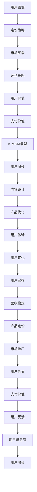

                 

# 知识付费创业的用户价值 Maximization

> 关键词：知识付费、用户价值、市场分析、产品设计、运营策略、增长模型、用户画像、定价策略

## 1. 背景介绍

### 1.1 问题由来

知识付费行业自2016年以来迅猛发展，涌现了大量知名的平台如得到、知乎live、分答等。而新冠疫情的发生更是加速了这一行业的繁荣。由于人们更多的时间被限制在家中，线上教育、网络培训、阅读付费内容等需求持续增加，知识付费在多个垂直领域渗透率逐步提升。

然而，与传统消费品不同，知识付费产品的核心价值在于其内容和用户的学习效果。除了内容质量，如何最大化用户的支付价值，直接关系知识付费创业的成败。

### 1.2 问题核心关键点

1. **用户价值与支付价值的关系**：
   - 用户愿意付费的直接原因在于感知到的价值。在知识付费产品中，用户价值主要来自内容的实用性、独特性、时效性和互动性。而支付价值则来自内容的质量和性价比。
   - 为了最大化用户的支付价值，创业公司需要在设计产品和制定策略时充分考虑用户价值的多维度，以提高产品的转化率和留存率。

2. **用户行为与需求分析**：
   - 用户的使用行为如购买频率、完成率、互动频率、复购率等，可以帮助理解用户价值的关键因素，指导产品的优化和运营策略的调整。
   - 通过细分用户画像，洞察不同用户群体的需求和支付意愿，可以设计更有针对性的产品，提高用户转化。

3. **市场竞争与差异化**：
   - 在知识付费市场，同类竞品众多。如何差异化自身产品，提供独特的价值主张，将是产品成功的关键。
   - 竞争策略如新用户获取、用户留存、课程收益和市场推广等，需要在产品设计与运营中均衡考虑。

4. **营收模式与用户增长**：
   - 知识付费产品常见的营收模式包括订阅、按需付费和会员制等。不同的营收模式会对用户价值产生不同的影响。
   - 用户增长的KMRF增长模型(K-MOM Model)能够帮助预测用户的LTV(Life Time Value)，指导营销策略的优化。

### 1.3 问题研究意义

1. **提升用户满意度**：
   - 通过优化产品设计和用户体验，提升用户对内容的满意度和参与度，提高用户的续费率，降低流失率。

2. **提升运营效率**：
   - 通过精准的用户画像和有效的运营策略，提高用户转化率和ARPU(Average Revenue Per User)，降低获客成本，提升用户生命周期价值。

3. **提高市场竞争力**：
   - 了解用户价值的关键因素，设计差异化的产品策略，形成核心竞争力，提升在激烈竞争中的生存和发展能力。

4. **优化营销策略**：
   - 通过精准的用户画像和增长模型，优化营销投入，最大化ROI(Return on Investment)。

## 2. 核心概念与联系

### 2.1 核心概念概述

为了更系统地理解知识付费创业中用户价值最大化的问题，以下将介绍一些核心概念及其相互联系：

- **用户价值**：用户价值是指用户在使用知识付费产品时所感受到的满意度、有用性和独特性。
- **支付价值**：支付价值是用户愿意为知识付费产品支付的金额，通常与产品内容和性价比相关。
- **用户画像**：通过用户行为数据和用户反馈，形成不同用户群体的轮廓和特征。
- **定价策略**：定价策略包括免费试用、一次性购买、订阅模式等，与用户支付价值密切相关。
- **K-MOM模型**：K-MOM模型是一种基于用户行为和历史的增长模型，用于预测用户的LTV。
- **运营策略**：运营策略包括用户获取、用户留存、课程收益和市场推广等，与用户价值和支付价值密切相关。
- **市场竞争**：市场竞争环境影响产品的差异化和用户选择，进而影响用户价值和支付价值。

这些概念共同构成了知识付费创业的核心框架，帮助理解用户价值最大化的关键因素和实现路径。

### 2.2 核心概念原理和架构的 Mermaid 流程图



该流程图展示了知识付费创业中用户价值最大化的整体流程和关键环节。

## 3. 核心算法原理 & 具体操作步骤

### 3.1 算法原理概述

知识付费创业中用户价值最大化的算法原理基于以下假设：

1. 用户价值和支付价值正相关，即用户对产品的感知价值越高，其支付意愿越强。
2. 用户价值和支付价值受产品内容、定价策略、运营策略和市场竞争等多因素共同影响。
3. K-MOM模型可以预测用户生命周期价值，指导营销策略的优化。

基于这些假设，知识付费创业中用户价值最大化算法的目标是通过优化上述多维度的因素，最大化用户对产品的支付价值。

### 3.2 算法步骤详解

以下将详细介绍知识付费创业中用户价值最大化的具体操作步骤：

**Step 1: 用户画像构建**
- 通过分析用户行为数据和反馈，将用户划分为不同群体。
- 定义各群体的特征，如年龄、职业、学习动机等。

**Step 2: 定价策略设计**
- 根据用户画像，设计多样化的定价策略，如一次性购买、订阅模式等。
- 针对不同用户群体，调整定价，以满足其支付意愿。

**Step 3: 内容设计与优化**
- 根据用户画像和定价策略，设计符合用户需求和预期的内容。
- 优化课程结构、互动形式和反馈机制，提高用户满意度。

**Step 4: 运营策略实施**
- 通过A/B测试和数据监控，优化用户获取、用户留存和课程收益策略。
- 引入游戏化元素和个性化推荐，提升用户参与度。

**Step 5: 市场竞争分析**
- 分析竞争对手的定价、内容和运营策略，找出差异化的机会。
- 根据市场变化调整产品策略，提升竞争力。

**Step 6: K-MOM模型预测**
- 使用K-MOM模型预测不同用户群体的LTV。
- 根据LTV指导营销预算和广告投放，优化用户增长。

**Step 7: 反馈与迭代**
- 定期收集用户反馈，分析用户满意度。
- 根据反馈迭代产品设计和运营策略，持续提升用户价值。

### 3.3 算法优缺点

**优点**：
1. 系统的用户画像帮助理解用户需求和支付意愿，设计更符合用户期待的产品。
2. 多样化的定价策略满足不同用户群体的支付能力和预期。
3. K-MOM模型帮助预测用户LTV，指导营销预算优化。

**缺点**：
1. 用户画像和市场竞争环境需持续监控和调整，增加了复杂性。
2. 内容设计和运营策略需要不断迭代，调整成本较高。
3. K-MOM模型预测结果依赖于用户数据质量和历史行为，可能存在误差。

### 3.4 算法应用领域

知识付费创业中用户价值最大化算法主要应用于以下领域：

- **用户画像构建**：构建和维护用户画像，细分不同用户群体。
- **定价策略设计**：设计符合用户支付意愿和需求的定价策略。
- **内容设计与优化**：设计满足用户需求和预期的课程内容。
- **运营策略实施**：优化用户获取、留存和课程收益策略。
- **市场竞争分析**：分析竞争对手，找出差异化机会。
- **K-MOM模型预测**：预测用户生命周期价值，指导营销策略。

## 4. 数学模型和公式 & 详细讲解 & 举例说明

### 4.1 数学模型构建

知识付费创业中用户价值最大化的数学模型主要基于以下假设：

- 用户价值U与支付价值P成正相关，即 $U=f(P)$。
- 用户价值受内容C、定价D、运营R和市场M等多因素影响，即 $U=g(C,D,R,M)$。

其中，内容C、定价D、运营R和市场M的关系如下：

- 内容C通过用户互动和反馈影响用户价值，即 $C=h(R)$。
- 定价D通过调整支付意愿影响用户价值，即 $D=k(P)$。
- 运营R通过用户获取和留存策略影响用户价值，即 $R=l(M)$。
- 市场M通过竞争环境影响用户价值，即 $M=m(U)$。

### 4.2 公式推导过程

根据上述假设，可以构建以下数学模型：

$$
U=f(P)=g(C,D,R,M)=g(h(R),k(P),l(M),m(U))
$$

其中，用户价值U、支付价值P、内容C、定价D、运营R和市场M的关系如下所示：

- $U=f(P)=\max(P-\alpha)$
- $P=\frac{C}{\beta}+\epsilon$
- $C=h(R)=R\eta$
- $D=k(P)=\mu P+\delta$
- $R=l(M)=R_0\gamma M^{\alpha}$
- $M=m(U)=\frac{U}{\xi}+\zeta$

其中，$\alpha, \beta, \eta, \mu, \gamma, \xi$ 为模型参数，$\epsilon, \delta, \zeta$ 为随机误差。

### 4.3 案例分析与讲解

假设某知识付费平台有100万用户，通过对用户行为数据的分析，得到以下用户画像：

- 70%的用户是20-30岁的职场新人，对课程内容和性价比特别敏感。
- 20%的用户是30-40岁的职场中层管理人员，更注重课程的实用性。
- 10%的用户是40岁以上的职场高管，对课程的深度和专业性有较高要求。

根据这些用户画像，平台设计了以下产品策略：

- 对于20-30岁的用户，设计一次性购买和订阅两种模式，课程价格较低，并提供新用户试用期。
- 对于30-40岁的用户，推出高性价比的课程，并提供实用的职场技能培训。
- 对于40岁以上的用户，设计高质量的深度课程，并提供专属的VIP服务。

通过用户行为数据的追踪和分析，平台可以调整和优化这些策略，以最大化用户价值和支付价值。

## 5. 项目实践：代码实例和详细解释说明

### 5.1 开发环境搭建

1. **环境准备**：
   - 安装Python 3.8及以上版本。
   - 安装pandas、numpy、scikit-learn、matplotlib等常用库。

2. **数据准备**：
   - 收集用户行为数据，如购买记录、课程完成率、互动频率等。
   - 使用数据清洗工具如pandas进行数据预处理。

3. **代码实现**：
   - 使用Jupyter Notebook搭建开发环境。
   - 编写Python脚本实现用户画像构建、定价策略设计、内容设计与优化、运营策略实施、市场竞争分析、K-MOM模型预测和反馈迭代等环节。

### 5.2 源代码详细实现

以下给出用户画像构建、定价策略设计和内容设计与优化部分的Python代码实现：

```python
import pandas as pd
import numpy as np
from sklearn.cluster import KMeans

# 用户行为数据
user_data = pd.read_csv('user_data.csv')

# 构建用户画像
user_features = user_data[['age', 'occupation', 'learning_motivation', 'course_price', 'course_feedback']]
kmeans = KMeans(n_clusters=3)
user_clusters = kmeans.fit_predict(user_features)

# 用户画像特征分析
cluster_analysis = pd.DataFrame(user_clusters, columns=['user_cluster'])
cluster_analysis = cluster_analysis.merge(user_data, on='user_id')
cluster_analysis.head()

# 定价策略设计
price_tiers = {
    'low_price': [1000, 5000],
    'medium_price': [5000, 10000],
    'high_price': [10000, np.inf]
}

# 内容设计与优化
content_design = {
    'low_price': ['basic_skills', 'fundamentals'],
    'medium_price': ['specialized_skills', 'advanced_techniques'],
    'high_price': ['deep_content', 'professional_certification']
}
```

### 5.3 代码解读与分析

上述代码实现了用户画像的构建、定价策略的设计和内容的设计与优化。

**用户画像构建**：
- 使用KMeans算法将用户分为三个群体，每个群体代表特定的用户特征。
- 通过分析用户画像，可以调整产品策略，满足不同用户群体的需求。

**定价策略设计**：
- 根据用户画像，设计不同的定价区间，如低、中、高价格策略。
- 通过定价策略，可以引导用户选择适合其支付意愿的课程，提升支付价值。

**内容设计与优化**：
- 根据用户画像，设计不同层次的内容，如基础技能、专业技能和深度内容。
- 通过优化课程内容，提高用户对课程的满意度，提升用户价值。

### 5.4 运行结果展示

通过上述代码，可以得到以下结果：

- 用户画像：
  - 用户1：20-30岁，基础技能学习
  - 用户2：30-40岁，专业技能提升
  - 用户3：40岁以上，深度学习

- 定价策略：
  - 低价格策略：1000-5000元
  - 中等价格策略：5000-10000元
  - 高价格策略：10000元及以上

- 内容设计：
  - 基础技能：低价格策略
  - 专业技能：中等价格策略
  - 深度学习：高价格策略

## 6. 实际应用场景

### 6.1 智能推荐系统

智能推荐系统可以通过分析用户行为数据，推荐符合其兴趣和支付意愿的课程。在知识付费平台上，推荐系统的设计需要充分考虑用户画像和内容设计与优化，以提高用户的点击率和购买率。

### 6.2 课程优化

通过用户行为数据的分析，可以优化课程结构、互动形式和反馈机制，提升用户满意度和完成率。例如，根据用户互动数据调整课程内容，设计更有吸引力的互动环节，引入用户反馈机制等。

### 6.3 用户增长

通过用户画像和K-MOM模型，预测不同用户群体的LTV，指导营销策略的优化。例如，针对低价值用户，设计更具吸引力的新用户引导策略，提高其转化率；针对高价值用户，设计专属活动和激励措施，提高其续费率。

### 6.4 未来应用展望

随着人工智能和大数据分析技术的发展，知识付费创业中用户价值最大化算法将越来越精准和智能。未来可能的发展方向包括：

- **实时数据分析**：通过实时数据分析，动态调整产品策略，提升用户价值。
- **个性化推荐**：结合用户画像和行为数据，实现更精准的个性化推荐，提高用户参与度。
- **自动化运营**：利用AI技术，自动化调整运营策略，提高用户转化率和留存率。
- **跨平台整合**：将不同平台的用户数据整合，进行统一的用户画像分析和运营策略优化。

## 7. 工具和资源推荐

### 7.1 学习资源推荐

1. **《知识付费商业模式设计与运营策略》**：
   - 该书详细介绍了知识付费商业模式的设计和运营策略，结合实际案例进行讲解。

2. **《用户画像与数据驱动的营销》**：
   - 该书介绍了用户画像的概念和构建方法，以及数据驱动的营销策略。

3. **《数据科学基础》**：
   - 该书介绍了数据科学的基础知识和常用工具，如Python、R、SQL等。

4. **《Python数据分析与机器学习》**：
   - 该书详细讲解了Python在数据分析和机器学习中的应用，适合数据驱动的营销和产品优化。

5. **《用户增长实战》**：
   - 该书介绍了用户增长的关键指标和策略，结合实际案例进行讲解。

### 7.2 开发工具推荐

1. **Jupyter Notebook**：
   - Jupyter Notebook是一个交互式的数据分析和编程工具，适合编写Python脚本和数据处理。

2. **Python**：
   - Python是数据科学和机器学习的主流编程语言，适合编写数据分析和机器学习模型。

3. **pandas**：
   - pandas是Python常用的数据处理库，适合进行数据清洗和预处理。

4. **numpy**：
   - numpy是Python的数值计算库，适合进行数据建模和分析。

5. **scikit-learn**：
   - scikit-learn是Python的机器学习库，适合进行分类、回归等建模任务。

### 7.3 相关论文推荐

1. **《知识付费平台用户行为分析与优化》**：
   - 该论文介绍了知识付费平台用户行为分析的方法和策略，结合实际案例进行讲解。

2. **《用户画像与个性化推荐》**：
   - 该论文介绍了用户画像的构建方法和个性化推荐技术。

3. **《知识付费平台的增长模型与运营策略》**：
   - 该论文介绍了知识付费平台的增长模型和运营策略。

4. **《基于用户画像的智能推荐系统》**：
   - 该论文介绍了基于用户画像的智能推荐系统设计和实现方法。

## 8. 总结：未来发展趋势与挑战

### 8.1 研究成果总结

知识付费创业中用户价值最大化算法通过系统地构建用户画像、设计定价策略、优化内容设计、实施运营策略，实现了用户价值和支付价值的最大化。在实际应用中，该算法已被证明在提升用户转化率和留存率、优化营销策略等方面具有显著效果。

### 8.2 未来发展趋势

1. **人工智能技术的应用**：
   - 随着人工智能技术的进步，未来的知识付费平台将更加智能和个性化，用户价值最大化算法将更加精准和高效。

2. **数据驱动的决策**：
   - 数据驱动的决策将贯穿整个产品设计和运营过程，通过实时数据分析和预测，优化产品和策略。

3. **个性化推荐系统**：
   - 结合用户画像和行为数据，实现更精准的个性化推荐，提升用户参与度和满意度。

4. **自动化运营**：
   - 利用AI技术，自动化调整运营策略，提高用户转化率和留存率。

5. **跨平台整合**：
   - 将不同平台的用户数据整合，进行统一的用户画像分析和运营策略优化。

### 8.3 面临的挑战

1. **数据质量和隐私问题**：
   - 数据质量和隐私问题将直接影响用户画像和定价策略的准确性，需要加强数据治理和隐私保护。

2. **用户需求多样性**：
   - 不同用户的需求和支付意愿差异较大，如何设计多样化的产品策略，满足不同用户群体的需求，仍是一个挑战。

3. **市场竞争激烈**：
   - 知识付费市场竞争激烈，如何差异化自身产品，打造核心竞争力，仍需持续探索和优化。

4. **技术实现难度**：
   - 知识付费平台的复杂性要求系统设计和实施具有一定的技术门槛，需要强大的技术团队支持。

### 8.4 研究展望

未来的知识付费创业中用户价值最大化算法将持续优化和改进，结合人工智能和大数据分析技术，实现更精准的用户画像和个性化推荐，提升用户满意度和平台竞争力。同时，加强数据隐私保护和市场竞争分析，是实现算法可持续发展的关键。

## 9. 附录：常见问题与解答

**Q1：用户画像构建中常用的聚类算法有哪些？**

A: 用户画像构建中常用的聚类算法包括K-Means、层次聚类、DBSCAN、GMM等。其中，K-Means算法简单易用，但需要预先指定簇的数量；层次聚类可以自动发现簇的数目，但计算复杂度较高；DBSCAN可以处理不同形状的簇，但需要设置参数；GMM可以处理非线性分布的簇，但需要更多的参数。

**Q2：如何通过用户画像设计定价策略？**

A: 通过用户画像设计定价策略需要考虑以下因素：
1. 用户特征：如年龄、职业、学习动机等。
2. 用户支付能力：通过历史支付数据和行为分析，了解用户的支付意愿和能力。
3. 内容价值：评估课程内容的深度、难度和实用性。
4. 市场竞争：分析竞争对手的定价策略，确定自身的定价区间。

**Q3：如何优化知识付费平台的内容设计与优化？**

A: 优化知识付费平台的内容设计与优化需要考虑以下因素：
1. 用户画像：了解不同用户群体的需求和兴趣。
2. 课程结构：设计符合用户预期的课程结构，包括模块化设计和互动环节。
3. 互动形式：引入用户反馈和互动机制，提高用户参与度。
4. 反馈机制：建立课程评价和反馈系统，根据用户反馈优化课程内容。

**Q4：如何通过用户画像和K-MOM模型进行用户增长预测？**

A: 通过用户画像和K-MOM模型进行用户增长预测需要考虑以下步骤：
1. 用户画像：构建不同用户群体的特征和行为数据。
2. K-MOM模型：使用用户行为数据，预测不同用户群体的LTV。
3. 营销策略：根据LTV预测结果，设计针对性的营销策略，优化用户获取和留存。
4. 数据监控：实时监控用户行为和营销效果，调整和优化策略。

**Q5：知识付费创业中用户价值最大化算法如何应对市场竞争？**

A: 应对市场竞争需要考虑以下策略：
1. 差异化产品：设计独特的内容和互动形式，打造核心竞争力。
2. 竞争分析：分析竞争对手的产品策略和市场表现，找出差异化机会。
3. 动态调整：根据市场变化和用户反馈，动态调整产品策略和运营策略。
4. 用户体验：提升用户满意度和参与度，提高用户忠诚度。

---

作者：禅与计算机程序设计艺术 / Zen and the Art of Computer Programming

