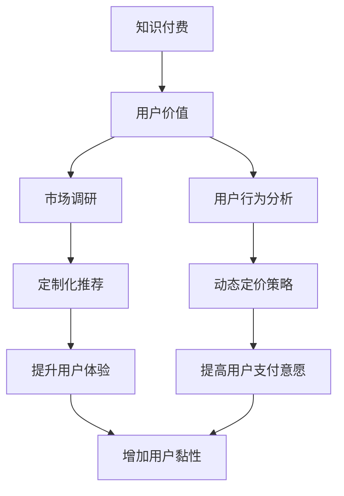

                 

# 知识付费创业的用户价值挖掘技巧

> 关键词：知识付费,用户价值,市场调研,用户体验,用户行为分析,定制化推荐,动态定价策略

## 1. 背景介绍

### 1.1 问题由来
在知识付费领域，用户价值的挖掘是创业成功的关键。面对多样化的用户需求，如何精准定位、提供优质内容、保持用户黏性，是每一个知识付费平台必须解决的问题。随着用户期望值日益提升，内容质量和服务体验成为用户关注的焦点，平台亟需挖掘用户价值，打造差异化竞争优势。

### 1.2 问题核心关键点
本节将详细介绍如何通过市场调研、用户行为分析等方法，洞察用户真实需求，并通过定制化推荐和动态定价策略，最大化用户价值，实现平台盈利。

### 1.3 问题研究意义
掌握知识付费用户价值的挖掘技巧，不仅有助于创业平台提升用户满意度和忠诚度，还能有效降低获客成本，增强市场竞争力，最终实现可持续发展。通过对用户需求和行为深入研究，可以洞察市场趋势，优化产品设计，吸引更多用户加入，促进平台健康成长。

## 2. 核心概念与联系

### 2.1 核心概念概述

本节将介绍几个密切相关的核心概念，以帮助我们更好地理解用户价值挖掘的原理和架构。

- 知识付费：指通过付费机制，向用户提供有价值的知识内容，如在线课程、专栏文章、音频视频等。
- 用户价值：指用户在使用平台服务过程中产生的经济和社会效益，包括学习效果、满意度、用户粘性等。
- 市场调研：指通过调查、分析用户需求和行为数据，识别市场机会和用户痛点。
- 用户行为分析：指通过数据挖掘技术，分析用户行为模式，揭示用户真实需求。
- 定制化推荐：指根据用户偏好和行为历史，推荐符合其兴趣和需求的内容，提升用户体验和转化率。
- 动态定价策略：指根据市场需求和用户行为变化，实时调整定价策略，提高用户支付意愿。

这些概念之间的逻辑关系可以通过以下Mermaid流程图来展示：



这个流程图展示了知识付费平台的用户价值挖掘路径：通过市场调研和用户行为分析，洞察用户需求和痛点，进而设计定制化推荐和动态定价策略，以提升用户体验和转化率，最终实现用户价值的最大化。

## 3. 核心算法原理 & 具体操作步骤
### 3.1 算法原理概述

用户价值挖掘的算法原理主要包括以下几个方面：

- **用户画像构建**：通过收集用户基本信息、行为数据等，构建详细的用户画像，准确描述用户特征和需求。
- **内容推荐系统**：利用机器学习算法，根据用户画像和行为数据，动态推荐符合用户兴趣的内容，提升用户满意度和留存率。
- **定价策略优化**：结合市场需求和用户支付意愿，实时调整定价策略，实现收益最大化。

### 3.2 算法步骤详解

#### 3.2.1 用户画像构建

1. **数据收集**：通过注册信息、学习记录、搜索历史等渠道，收集用户基本信息和行为数据。

2. **特征提取**：对收集到的数据进行清洗和处理，提取用户的关键特征，如年龄、职业、学习偏好、消费能力等。

3. **画像建模**：使用机器学习算法（如聚类、分类、回归等），将用户特征映射到画像标签上，形成详细的用户画像。

#### 3.2.2 内容推荐系统

1. **内容特征提取**：对平台上的内容进行特征提取，如关键词、时长、难度等级等。

2. **用户行为建模**：利用协同过滤、基于内容的推荐等算法，建立用户与内容的关联矩阵，捕捉用户行为模式。

3. **推荐算法优化**：根据用户画像和行为模式，选择适当的推荐算法（如矩阵分解、深度学习等），实时生成推荐结果。

#### 3.2.3 定价策略优化

1. **市场需求分析**：通过用户调研、市场趋势分析等手段，评估不同内容的市场需求。

2. **定价模型建立**：结合市场需求和用户支付意愿，设计动态定价模型，如基于价值的定价、动态捆绑销售等。

3. **策略调整**：根据实时反馈和用户行为变化，动态调整定价策略，保持用户支付意愿和平台收益平衡。

### 3.3 算法优缺点

用户价值挖掘算法具有以下优点：

1. **个性化推荐**：根据用户画像和行为数据，实现个性化内容推荐，提高用户满意度和留存率。
2. **动态定价**：实时调整定价策略，最大化平台收益，降低用户流失率。
3. **数据驱动决策**：基于数据挖掘和机器学习，客观评估用户需求和市场机会，提升决策的科学性和准确性。

同时，该算法也存在以下局限性：

1. **数据隐私风险**：用户数据涉及隐私保护，需要严格遵守数据使用规范，避免用户信息泄露。
2. **模型复杂度高**：算法涉及多维度数据处理和复杂计算，需要较高的技术实现门槛。
3. **用户行为变化**：用户行为具有随机性，模型的准确性受用户行为变化影响较大。

### 3.4 算法应用领域

用户价值挖掘的算法在知识付费平台、在线教育、内容订阅等多个领域有着广泛的应用。例如：

- 在线教育平台：通过个性化推荐和动态定价，提升课程订阅率，增加用户学习效果。
- 内容订阅服务：根据用户偏好，推荐符合其兴趣的杂志、报纸、电子书等，提升用户订阅率和阅读体验。
- 课程销售平台：通过市场调研和用户画像分析，优化课程内容和定价策略，增加销售量。

## 4. 数学模型和公式 & 详细讲解  
### 4.1 数学模型构建

用户价值挖掘的数学模型主要包括以下几个部分：

1. **用户画像构建**：使用聚类算法（如K-means）对用户特征进行分类，构建详细的用户画像。
2. **内容推荐系统**：使用协同过滤算法（如ALS），建立用户-内容关联矩阵，生成推荐结果。
3. **定价策略优化**：使用回归算法（如线性回归、决策树等），评估用户对不同价格的支付意愿，优化定价策略。

### 4.2 公式推导过程

#### 4.2.1 用户画像构建

假设用户特征为 $X=\{x_1, x_2, ..., x_n\}$，使用K-means算法对 $X$ 进行聚类，得到 $k$ 个用户画像 $P=\{P_1, P_2, ..., P_k\}$。聚类过程的数学公式如下：

$$
P = \underset{P}{\operatorname{arg\,minimize}}\left\{\sum_{i=1}^{k}\sum_{x \in P_i}||x-\mu_i||^2\right\}
$$

其中 $\mu_i$ 为簇 $P_i$ 的质心。

#### 4.2.2 内容推荐系统

假设用户行为数据为 $B=\{(x_i, c_i)\}_{i=1}^N$，其中 $x_i$ 为内容特征向量，$c_i$ 为用户的兴趣标签。使用ALS算法（交替最小二乘）对 $B$ 进行矩阵分解，得到用户画像 $U$ 和内容画像 $V$，计算用户对内容 $j$ 的兴趣 $r$：

$$
\hat{r}_{ij} = \left\langle U_{(i)}, V_{(j)} \right\rangle = \sum_{k=1}^{n}U_{ik}V_{kj}
$$

其中 $\left\langle \cdot, \cdot \right\rangle$ 为向量内积。

#### 4.2.3 定价策略优化

假设市场需求为 $D=\{(d_i, p_i)\}_{i=1}^M$，其中 $d_i$ 为用户对内容 $i$ 的支付意愿，$p_i$ 为内容价格。使用线性回归模型拟合 $D$，得到定价函数 $f(x)$：

$$
f(x) = \alpha_0 + \alpha_1 x_1 + \alpha_2 x_2 + ... + \alpha_n x_n
$$

其中 $\alpha_k$ 为回归系数。

### 4.3 案例分析与讲解

以在线教育平台为例，分析用户画像构建、内容推荐系统和定价策略优化：

1. **用户画像构建**：收集用户的基本信息（如年龄、性别）和行为数据（如学习时长、课程选择偏好），使用K-means算法对用户进行聚类，得到不同画像的特征。

2. **内容推荐系统**：对平台上的课程进行特征提取（如课程名称、难度等级、教师资历等），使用ALS算法对用户和课程的特征进行矩阵分解，生成推荐结果。

3. **定价策略优化**：通过用户调研和市场趋势分析，评估课程的市场需求，使用线性回归模型拟合用户对不同价格的支付意愿，优化课程定价策略。

## 5. 项目实践：代码实例和详细解释说明
### 5.1 开发环境搭建

在进行用户价值挖掘的实践前，我们需要准备好开发环境。以下是使用Python进行TensorFlow开发的简单环境配置流程：

1. 安装Anaconda：从官网下载并安装Anaconda，用于创建独立的Python环境。

2. 创建并激活虚拟环境：
```bash
conda create -n tf-env python=3.7 
conda activate tf-env
```

3. 安装TensorFlow：根据CUDA版本，从官网获取对应的安装命令。例如：
```bash
conda install tensorflow=2.5
```

4. 安装各类工具包：
```bash
pip install numpy pandas scikit-learn matplotlib tqdm jupyter notebook ipython
```

完成上述步骤后，即可在`tf-env`环境中开始实践。

### 5.2 源代码详细实现

以下是使用TensorFlow对用户画像构建和内容推荐系统进行代码实现。

首先，定义用户画像构建函数：

```python
import tensorflow as tf
from sklearn.cluster import KMeans

def build_user_profile(user_data, num_clusters=3):
    user_features = tf.keras.layers.DenseFeatures(user_data.columns)

    # 使用K-means算法对用户特征进行聚类
    kmeans = KMeans(n_clusters=num_clusters, random_state=42)
    kmeans.fit(user_features)
    user_profile = tf.keras.layers.Lambda(lambda x: tf.one_hot(kmeans.labels_, depth=num_clusters))(user_features)

    return user_profile
```

然后，定义内容推荐系统函数：

```python
import tensorflow as tf
from tensorflow.keras.layers import Input, Embedding, Dot, Dense

def build_content_recommender(user_profile, num_users, num_items):
    user_input = Input(shape=(num_users, ), name='user')
    item_input = Input(shape=(num_items, ), name='item')

    # 定义用户画像和内容画像的嵌入层
    user_embedding = Embedding(num_users, 128)(user_input)
    item_embedding = Embedding(num_items, 128)(item_input)

    # 计算用户与内容的相似度
    similarity = Dot(axes=1)([user_embedding, item_embedding])

    # 定义推荐模型
    recommender = Dense(num_items, activation='sigmoid')(similarity)

    return recommender
```

最后，定义定价策略优化函数：

```python
import tensorflow as tf
from sklearn.linear_model import LinearRegression

def optimize_pricing(user_profile, num_items, prices):
    # 使用线性回归模型拟合用户对不同价格的支付意愿
    price_model = LinearRegression()
    price_model.fit(user_profile, prices)

    # 预测用户对不同价格的支付意愿
    predicted_prices = price_model.predict(user_profile)

    return predicted_prices
```

### 5.3 代码解读与分析

让我们再详细解读一下关键代码的实现细节：

**build_user_profile函数**：
- 定义用户特征的DenseFeatures层，将用户数据转化为特征向量。
- 使用K-means算法对用户特征进行聚类，生成不同画像的特征。

**build_content_recommender函数**：
- 定义用户画像和内容画像的嵌入层，使用Embedding将特征向量转化为密集向量。
- 计算用户与内容的相似度，使用Dot层进行内积计算。
- 定义推荐模型，使用Dense层对相似度进行sigmoid激活，生成推荐结果。

**optimize_pricing函数**：
- 使用LinearRegression线性回归模型，拟合用户对不同价格的支付意愿。
- 预测用户对不同价格的支付意愿，生成定价策略。

这些函数分别对应了用户画像构建、内容推荐系统和定价策略优化的核心步骤，通过实际代码可以更好地理解模型的实现逻辑。

### 5.4 运行结果展示

假设我们有以下用户数据和内容数据：

```python
user_data = pd.DataFrame({
    'user_id': [1, 2, 3, 4, 5],
    'age': [25, 30, 35, 40, 45],
    'gender': ['male', 'female', 'male', 'female', 'male'],
    'learning_hours': [10, 15, 20, 25, 30],
    'preferred_subject': ['math', 'english', 'math', 'english', 'math']
})

content_data = pd.DataFrame({
    'item_id': [1, 2, 3, 4, 5],
    'title': ['Introduction to Machine Learning', 'Natural Language Processing', 'Deep Learning', 'Computer Vision', 'Reinforcement Learning'],
    'difficulty': ['easy', 'medium', 'hard', 'easy', 'hard'],
    'instructor': ['John Smith', 'Jane Doe', 'Tom Brown', 'Anna Johnson', 'Michael White']
})
```

我们可以先构建用户画像：

```python
user_profile = build_user_profile(user_data)
```

然后，定义内容画像，并进行内容推荐：

```python
num_users = len(user_data['user_id'].unique())
num_items = len(content_data['item_id'].unique())

content_profile = build_content_recommender(user_profile, num_users, num_items)
```

最后，进行定价策略优化：

```python
prices = content_data['price'].values
predicted_prices = optimize_pricing(user_profile, num_items, prices)
```

运行这些代码，将输出用户画像、内容画像和定价策略结果。

## 6. 实际应用场景

### 6.1 教育平台个性化推荐

在线教育平台通过用户画像构建和内容推荐系统，能够为不同用户推荐最适合的课程和资料，提升学习效果。例如，对于偏好数学和科学的用户，平台可以推荐相关的科学课程和实验视频。对于偏好文学和艺术的用户，则可以推荐文学赏析和艺术创作课程。

### 6.2 在线书店个性化推荐

在线书店通过用户画像和内容推荐，能够为用户推荐其感兴趣的书籍，提升购买转化率。例如，对于喜欢推理小说的用户，平台可以推荐最新的推理小说和悬疑电影；对于喜欢历史的用户，则可以推荐经典的历史书籍和纪录片。

### 6.3 移动应用个性化推荐

移动应用平台通过用户画像和内容推荐系统，能够为用户推荐符合其兴趣的娱乐内容，提升用户粘性和使用时长。例如，对于喜欢电影的用户，平台可以推荐最新的电影和电视剧；对于喜欢游戏和直播的用户，则可以推荐热门游戏和主播。

### 6.4 未来应用展望

未来，用户价值挖掘技术将在更多领域得到应用，推动知识付费和数字内容产业的升级。随着算力和数据量的不断增长，用户画像和内容推荐系统的精度将进一步提升，为用户提供更精准、个性化的服务。

在智慧城市、智慧医疗、智能交通等领域，用户价值挖掘技术也将发挥重要作用，通过数据分析和机器学习，优化城市治理、医疗服务和交通管理，提升公共服务水平。

## 7. 工具和资源推荐
### 7.1 学习资源推荐

为了帮助开发者系统掌握用户价值挖掘的理论基础和实践技巧，这里推荐一些优质的学习资源：

1. 《推荐系统原理与实践》书籍：由机器学习专家撰写，全面介绍了推荐系统的工作原理和经典算法。

2. Coursera《推荐系统》课程：斯坦福大学开设的推荐系统课程，涵盖推荐系统的基本概念和核心算法，适合入门学习。

3. Kaggle数据竞赛：参加Kaggle的推荐系统竞赛，通过实战练习，提升推荐系统开发能力。

4. GitHub开源项目：如TensorFlow推荐系统库、Spark推荐系统库等，提供大量推荐系统样例代码，帮助开发者快速上手。

通过对这些资源的学习实践，相信你一定能够快速掌握用户价值挖掘的精髓，并用于解决实际的推荐问题。

### 7.2 开发工具推荐

高效的开发离不开优秀的工具支持。以下是几款用于用户价值挖掘开发的常用工具：

1. TensorFlow：由Google主导开发的开源深度学习框架，灵活动态的计算图，适合快速迭代研究。

2. PyTorch：Facebook开发的开源深度学习框架，动态计算图，易于调试和优化。

3. Jupyter Notebook：免费的交互式编程环境，支持Python、R等多种语言，适合数据科学和机器学习任务。

4. Weights & Biases：模型训练的实验跟踪工具，可以记录和可视化模型训练过程中的各项指标，方便对比和调优。

5. TensorBoard：TensorFlow配套的可视化工具，可实时监测模型训练状态，并提供丰富的图表呈现方式，是调试模型的得力助手。

合理利用这些工具，可以显著提升用户价值挖掘任务的开发效率，加快创新迭代的步伐。

### 7.3 相关论文推荐

用户价值挖掘技术的发展源于学界的持续研究。以下是几篇奠基性的相关论文，推荐阅读：

1. Large-scale Collaborative Filtering for Recommendation：提出ALS算法，用于推荐系统的矩阵分解优化。

2. Scalable Tree-structured Factorization Models for Top-N Recommendations：提出树形分解模型，提升推荐系统的泛化性能。

3. Multi-view Learning with Multi-task Cascaded Neural Network for Recommendation Systems：提出多视图学习模型，提高推荐系统的个性化和多样性。

4. Multi-Task Transfer Learning with Long-Term Memory for Recommendation Systems：提出多任务转移学习模型，提升推荐系统的迁移学习能力。

5. Deep Neural Networks for Video Recommendation with Multiple Semantic Features：提出深度神经网络，结合多模态特征，提升视频推荐系统的性能。

这些论文代表了大语言模型微调技术的发展脉络。通过学习这些前沿成果，可以帮助研究者把握学科前进方向，激发更多的创新灵感。

## 8. 总结：未来发展趋势与挑战
### 8.1 总结

本文对用户价值挖掘进行了全面系统的介绍。首先阐述了用户价值挖掘在知识付费领域的应用背景和研究意义，明确了用户价值挖掘在提升用户体验、增加用户黏性等方面的关键作用。其次，从原理到实践，详细讲解了用户画像构建、内容推荐系统和定价策略优化的数学模型和算法实现，给出了完整的代码实例。同时，本文还广泛探讨了用户价值挖掘技术在教育、在线书店、移动应用等多个行业领域的应用前景，展示了其在推动产业升级方面的巨大潜力。此外，本文精选了用户价值挖掘技术的学习资源和开发工具，力求为读者提供全方位的技术指引。

通过本文的系统梳理，可以看到，用户价值挖掘技术正在成为知识付费和数字内容产业的重要范式，极大地提升了平台的用户体验和运营效率。未来，伴随算力、数据量的不断增长，用户画像和内容推荐系统的精度将进一步提升，为用户提供更精准、个性化的服务。与此同时，隐私保护、模型公平性等伦理问题也将日益重要，如何在提升用户价值的同时，保障用户权益，将是未来研究的重要方向。

### 8.2 未来发展趋势

展望未来，用户价值挖掘技术将呈现以下几个发展趋势：

1. **深度学习与协同过滤结合**：结合深度学习和协同过滤，提高推荐系统的精度和泛化能力，增强用户粘性和转化率。

2. **多模态特征融合**：将用户的行为数据、社交网络数据、多媒体数据等多模态信息融合，提供更全面、个性化的服务。

3. **实时动态调整**：通过实时数据分析和机器学习，动态调整推荐策略，提升用户满意度和平台收益。

4. **隐私保护与安全**：在推荐系统中引入隐私保护技术，如差分隐私、联邦学习等，保护用户数据隐私。

5. **模型公平性**：通过公平性优化算法，确保推荐系统不产生偏见，避免对特定群体的歧视。

这些趋势凸显了用户价值挖掘技术的广阔前景。这些方向的探索发展，必将进一步提升推荐系统的性能和用户体验，为知识付费和数字内容产业带来新的变革。

### 8.3 面临的挑战

尽管用户价值挖掘技术已经取得了瞩目成就，但在迈向更加智能化、普适化应用的过程中，它仍面临诸多挑战：

1. **数据隐私问题**：用户数据涉及隐私保护，需要严格遵守数据使用规范，避免用户信息泄露。

2. **模型复杂度高**：用户画像和内容推荐系统涉及多维度数据处理和复杂计算，需要较高的技术实现门槛。

3. **用户行为变化**：用户行为具有随机性，模型的准确性受用户行为变化影响较大。

4. **推荐系统的冷启动问题**：对于新用户或新内容的推荐，需要设计合适的策略，以快速积累用户行为数据。

5. **模型公平性**：在推荐过程中避免偏见和歧视，确保不同用户获得公平的服务。

6. **算力和存储成本**：用户数据量巨大，需要高效的算法和硬件支持，降低计算和存储成本。

正视用户价值挖掘面临的这些挑战，积极应对并寻求突破，将是大语言模型微调走向成熟的必由之路。相信随着学界和产业界的共同努力，这些挑战终将一一被克服，用户价值挖掘技术必将在构建人机协同的智能系统过程中发挥更大的作用。

### 8.4 研究展望

面向未来，用户价值挖掘技术的研究需要在新兴方向寻求新的突破：

1. **因果推断与推荐系统结合**：引入因果推断方法，评估推荐系统对用户行为的影响，优化推荐策略。

2. **强化学习在推荐系统中的应用**：利用强化学习算法，动态调整推荐策略，提高用户满意度和平台收益。

3. **个性化推荐算法的多样化**：探索更多个性化推荐算法，如基于图的推荐、混合推荐等，提升推荐系统的多样性和稳定性。

4. **跨领域推荐系统的构建**：将推荐系统扩展到更多领域，如社交网络、金融投资、医疗健康等，提升跨领域推荐能力。

5. **隐私保护与联邦学习**：结合隐私保护和联邦学习技术，保护用户数据隐私，同时提升推荐系统的准确性。

这些研究方向将推动用户价值挖掘技术不断进步，提升推荐系统的性能和用户体验，为知识付费和数字内容产业带来新的变革。

## 9. 附录：常见问题与解答

**Q1：用户画像构建时，如何选择最优的聚类数目？**

A: 选择聚类数目时，通常可以使用肘部法则（Elbow Method），即绘制不同聚类数目下的模型误差曲线，找到误差显著下降而增加聚类数目不再有明显效果的拐点。此外，也可以通过轮廓系数（Silhouette Coefficient）评估不同聚类数目下的聚类效果。

**Q2：内容推荐系统中的协同过滤算法有哪些？**

A: 协同过滤算法主要分为基于用户的协同过滤和基于项目的协同过滤。基于用户的协同过滤通过用户之间的相似性计算推荐，如K-Nearest Neighbors（KNN）；基于项目的协同过滤通过物品之间的相似性计算推荐，如ALS（Alternating Least Squares）。

**Q3：动态定价策略优化时，如何选择合适的回归模型？**

A: 选择合适的回归模型需要考虑数据类型、模型复杂度、预测效果等因素。通常可以使用线性回归、逻辑回归、决策树等，评估不同模型在训练集和测试集上的性能，选择预测效果最佳的模型。

**Q4：用户画像构建中，如何处理缺失数据和异常值？**

A: 处理缺失数据可以采用插值法、均值填补法等，保留有效信息。处理异常值可以采用截断、替换等方法，避免异常值对聚类结果的影响。

**Q5：如何评估推荐系统的推荐效果？**

A: 评估推荐系统通常使用准确率、召回率、F1分数、用户满意度等指标。可以通过A/B测试、离线评估、在线点击率等手段，评估推荐系统的实际效果。

通过对这些问题的解答，相信你对用户价值挖掘技术有了更深入的理解，并能在实际开发中灵活应用。

---

作者：禅与计算机程序设计艺术 / Zen and the Art of Computer Programming

