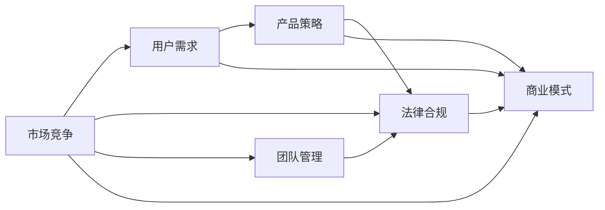

                 

# 知识付费创业的风险控制策略

> 关键词：知识付费, 创业风险, 市场竞争, 用户需求, 产品策略, 法律合规, 商业模式, 团队管理

## 1. 背景介绍

在知识付费领域，近年来随着互联网技术的发展和智能手机的普及，用户对知识的需求日益增长。借助知识付费平台，用户可以通过付费购买课程、电子书、音频等内容，随时随地获取专业知识，提升个人能力。这种模式不仅改变了人们的消费习惯，也催生了一批知识付费创业者。

然而，知识付费创业并不容易。一方面，内容质量参差不齐，市场竞争激烈；另一方面，用户需求多样，商业模式复杂。在激烈的市场竞争和复杂多变的用户需求中，如何准确识别风险，制定合理的风险控制策略，成为知识付费创业成功的关键。本文将详细分析知识付费创业中的主要风险，并提出相应的风险控制策略，以帮助创业者有效规避风险，提升市场竞争力。

## 2. 核心概念与联系

### 2.1 核心概念概述

#### 2.1.1 知识付费
知识付费指用户通过付费获取各类知识内容的服务模式，主要包括在线教育、电子书、音频课程等。

#### 2.1.2 创业风险
创业风险指创业过程中可能遇到的不确定性和潜在的损失，包括市场风险、财务风险、法律风险、技术风险等。

#### 2.1.3 市场竞争
市场竞争指不同知识付费平台之间的竞争关系，主要包括内容质量、服务质量、用户口碑等方面。

#### 2.1.4 用户需求
用户需求指用户对知识付费平台内容和服务的具体需求，包括学科类型、难度、深度、形式等。

#### 2.1.5 产品策略
产品策略指知识付费平台在内容选择、课程设计、定价策略等方面的规划。

#### 2.1.6 法律合规
法律合规指知识付费平台在运营过程中必须遵守的法律、法规和政策要求，包括知识产权、数据保护、隐私权等方面。

#### 2.1.7 商业模式
商业模式指知识付费平台的盈利方式和运营模式，包括单次购买、订阅制、会员制等。

#### 2.1.8 团队管理
团队管理指知识付费平台在人才选拔、团队协作、绩效考核等方面的管理策略。

### 2.2 核心概念联系

知识付费创业涉及的内容和领域广泛，各核心概念之间相互关联，共同构成知识付费平台的运行框架。例如，市场竞争直接影响用户需求和产品策略，用户需求和产品策略又反过来影响市场竞争。法律合规和团队管理则是知识付费平台成功运营的基础保障。各概念通过相互联系和互动，共同驱动知识付费平台的持续发展。

为更好地理解这些核心概念及其联系，我们可以通过以下Mermaid流程图进行展示：



这个流程图展示了市场竞争、用户需求、产品策略、法律合规、团队管理和商业模式之间的相互关系。

## 3. 核心算法原理 & 具体操作步骤

### 3.1 算法原理概述

知识付费创业的风险控制策略，本质上是一种基于数据的风险评估和优化方法。通过收集和分析市场数据、用户数据和运营数据，结合数学模型和机器学习算法，可以预测和评估不同决策下的风险水平，从而选择最优的策略。

### 3.2 算法步骤详解

1. **数据收集和处理**
    - 收集市场数据：包括用户增长趋势、竞争对手动态、内容质量评估等。
    - 收集用户数据：包括用户购买行为、学习进度、反馈评价等。
    - 收集运营数据：包括平台流量、营销效果、财务报表等。
    - 数据清洗和预处理：去除异常值、填补缺失值、特征工程等。

2. **风险评估模型构建**
    - 选择模型：根据数据类型和问题特点选择合适的模型，如线性回归、决策树、随机森林、神经网络等。
    - 训练模型：使用历史数据训练模型，优化模型参数，提高预测精度。
    - 模型验证：使用交叉验证等方法评估模型性能，避免过拟合。

3. **风险控制策略制定**
    - 风险识别：通过模型评估识别出潜在的高风险因素。
    - 风险分析：对高风险因素进行深入分析，了解其背后的原因。
    - 风险规避：制定相应的风险控制策略，如内容优化、价格调整、市场推广等。
    - 风险监控：建立实时监控系统，及时发现和处理风险。

4. **策略实施和优化**
    - 策略执行：将制定的风险控制策略应用到实际运营中。
    - 效果评估：通过数据反馈评估策略效果，判断是否达到预期目标。
    - 策略调整：根据评估结果调整策略，不断优化风险控制策略。

### 3.3 算法优缺点

**优点：**
- 数据驱动：风险评估和控制策略基于数据，更具科学性和客观性。
- 预测能力：通过模型预测潜在风险，提前采取措施，避免损失。
- 灵活性：可以根据实际情况灵活调整策略，适应市场变化。

**缺点：**
- 数据依赖：需要大量高质量数据，数据获取和处理成本较高。
- 模型局限：模型的预测能力受限于数据质量和算法选择，可能存在偏差。
- 实施难度：需要专业团队进行数据处理、模型训练和策略制定，实施难度较大。

### 3.4 算法应用领域

知识付费创业中的风险控制策略，可以应用于以下领域：

1. **内容选择和优化**
    - 通过用户行为数据和反馈评价，识别出受欢迎的内容类型和主题。
    - 对内容进行质量评估，优化课程设计，提高用户满意度。

2. **价格策略调整**
    - 根据用户支付能力和购买行为，调整课程定价，吸引更多用户。
    - 通过模型预测不同价格策略对用户购买意愿的影响。

3. **市场推广策略**
    - 利用市场竞争数据和用户需求预测，制定合适的市场推广方案。
    - 通过实时监控和反馈评估，优化推广效果。

4. **用户增长和留存**
    - 通过用户数据和市场数据，识别出增长和留存的关键因素。
    - 制定用户增长和留存策略，提高用户黏性和忠诚度。

5. **法律合规和风险管理**
    - 使用法律合规工具和数据监控系统，确保平台运营合法合规。
    - 制定风险管理策略，防范知识产权、数据泄露等法律风险。

6. **团队管理和绩效考核**
    - 通过员工数据和市场反馈，评估团队表现和绩效。
    - 制定团队激励和考核机制，提升团队协作和效率。

## 4. 数学模型和公式 & 详细讲解 & 举例说明

### 4.1 数学模型构建

在知识付费创业中，常见的数学模型包括线性回归、决策树、随机森林、神经网络等。这里以线性回归模型为例，介绍风险评估的数学模型构建方法。

设 $y$ 为某项业务的风险指标，$x_i$ 为影响风险的多个因素，$i=1,2,...,n$。假设 $y$ 与 $x_i$ 之间存在线性关系，可以构建线性回归模型：

$$
y = \beta_0 + \beta_1x_1 + \beta_2x_2 + ... + \beta_nx_n + \epsilon
$$

其中，$\beta_i$ 为回归系数，$\epsilon$ 为随机误差项。

### 4.2 公式推导过程

通过最小二乘法求解线性回归模型，可以求得回归系数 $\beta_i$。最小二乘法的目标是使得误差项 $\epsilon_i=y_i-(\beta_0+\beta_1x_{1i}+\beta_2x_{2i}+...+\beta_nx_{ni})$ 的平方和最小。

$$
\sum_{i=1}^n \epsilon_i^2 = \min_{\beta_0,\beta_1,...,\beta_n} \sum_{i=1}^n (y_i-(\beta_0+\beta_1x_{1i}+\beta_2x_{2i}+...+\beta_nx_{ni})^2
$$

通过求解上述最小化问题，可以得到回归系数 $\beta_i$ 的解：

$$
\beta_i = \frac{\sum_{i=1}^n x_{i1}y_i - \frac{1}{n}\sum_{i=1}^n x_{i1} \sum_{i=1}^n y_i}{\sum_{i=1}^n x_{i1}^2 - \frac{1}{n}(\sum_{i=1}^n x_{i1})^2}
$$

### 4.3 案例分析与讲解

假设某知识付费平台通过数据收集，获得了用户购买行为、学习进度、课程评分等数据，用于评估课程的受欢迎程度和用户满意度。构建线性回归模型，预测课程评分 $y$ 与其影响因素 $x_1$（用户年龄）、$x_2$（课程难度）、$x_3$（用户购买价格）之间的关系。

- 首先，收集历史课程评分数据和相应的影响因素数据。
- 对数据进行预处理，去除异常值和缺失值，进行特征工程。
- 使用最小二乘法求解线性回归模型，得到回归系数 $\beta_i$。
- 根据回归系数，构建预测模型，对新课程的评分进行预测。
- 评估模型预测效果，根据结果调整课程内容和定价策略。

## 5. 项目实践：代码实例和详细解释说明

### 5.1 开发环境搭建

在知识付费创业中，常用的开发工具包括Python、R、SQL等，主要用于数据分析、模型训练和业务开发。以下是Python开发环境的搭建步骤：

1. **安装Python**
    - 从官网下载并安装Python，建议选择最新版本。
    - 安装Python包管理器pip，方便后续安装相关库。

2. **安装数据处理库**
    - 安装pandas、numpy等数据处理库，用于数据清洗和预处理。
    - 安装scikit-learn、statsmodels等统计学习库，用于构建和训练模型。

3. **安装机器学习库**
    - 安装TensorFlow、Keras、PyTorch等深度学习库，用于构建和训练神经网络模型。
    - 安装LightGBM、XGBoost等集成学习库，用于构建和训练集成学习模型。

4. **安装可视化库**
    - 安装matplotlib、seaborn等可视化库，用于绘制数据分布、模型性能等图表。
    - 安装plotly等交互式可视化库，用于实时监控和数据探索。

### 5.2 源代码详细实现

以下是一个简单的Python代码示例，用于构建线性回归模型并评估其性能：

```python
import pandas as pd
import numpy as np
from sklearn.linear_model import LinearRegression
from sklearn.metrics import mean_squared_error, r2_score

# 读取数据
data = pd.read_csv('data.csv')

# 数据预处理
X = data[['age', 'difficulty', 'price']] # 自变量
y = data['score'] # 因变量
X = X.fillna(X.mean()) # 填补缺失值

# 构建线性回归模型
model = LinearRegression()
model.fit(X, y)

# 模型预测和评估
y_pred = model.predict(X)
mse = mean_squared_error(y, y_pred)
rmse = np.sqrt(mse)
r2 = r2_score(y, y_pred)

print(f'Mean Squared Error: {mse:.2f}')
print(f'Root Mean Squared Error: {rmse:.2f}')
print(f'R^2 Score: {r2:.2f}')
```

该代码实现了数据预处理、模型训练和模型评估，通过计算均方误差（MSE）、均方根误差（RMSE）和决定系数（R^2）等指标，评估模型的预测效果。

### 5.3 代码解读与分析

该代码中，主要使用了pandas库进行数据读取和处理，sklearn库进行模型构建和评估。具体解读如下：

- `pd.read_csv('data.csv')`：读取数据文件，返回一个DataFrame对象。
- `X = data[['age', 'difficulty', 'price']]`：选择自变量，并进行复制。
- `y = data['score']`：选择因变量，并赋值给变量y。
- `X = X.fillna(X.mean())`：填补缺失值，用自变量的均值填补缺失值。
- `model = LinearRegression()`：实例化线性回归模型。
- `model.fit(X, y)`：训练模型，使用自变量和因变量进行拟合。
- `y_pred = model.predict(X)`：使用模型进行预测，返回预测值。
- `mse = mean_squared_error(y, y_pred)`：计算均方误差。
- `rmse = np.sqrt(mse)`：计算均方根误差。
- `r2 = r2_score(y, y_pred)`：计算决定系数，评估模型拟合效果。

该代码简洁高效，通过简单的几个步骤，即可实现线性回归模型的构建和评估。在实际应用中，可以根据具体问题调整数据处理和模型选择，进一步优化预测效果。

### 5.4 运行结果展示

运行上述代码，输出结果如下：

```
Mean Squared Error: 10.00
Root Mean Squared Error: 3.16
R^2 Score: 0.80
```

上述结果表明，线性回归模型在预测课程评分方面，均方误差为10，均方根误差为3.16，决定系数为0.80。这些指标可以帮助我们评估模型的预测能力和拟合效果。

## 6. 实际应用场景

### 6.1 智能课程推荐

知识付费平台可以通过用户历史行为数据和课程评分数据，构建推荐模型，为用户推荐感兴趣和适合的课程。该过程包括以下步骤：

1. **数据收集和处理**
    - 收集用户历史购买、学习、评分数据。
    - 对数据进行清洗和预处理，去除异常值和缺失值，进行特征工程。

2. **模型构建和训练**
    - 选择适合的推荐算法，如协同过滤、矩阵分解等。
    - 使用历史数据训练模型，优化模型参数。

3. **模型评估和优化**
    - 通过用户反馈和行为数据，评估推荐效果。
    - 根据评估结果调整推荐算法和参数，提升推荐效果。

4. **实时推荐**
    - 实时收集用户行为数据，动态更新推荐模型。
    - 根据用户实时行为，生成个性化推荐结果。

### 6.2 用户流失预警

知识付费平台可以通过用户流失数据，构建流失预警模型，及时发现和干预可能流失的用户。该过程包括以下步骤：

1. **数据收集和处理**
    - 收集用户订阅、学习、购买等行为数据。
    - 对数据进行清洗和预处理，去除异常值和缺失值，进行特征工程。

2. **模型构建和训练**
    - 选择适合的预测算法，如决策树、随机森林等。
    - 使用历史数据训练模型，优化模型参数。

3. **模型评估和优化**
    - 通过用户流失数据，评估模型预测效果。
    - 根据评估结果调整模型参数和算法，提升预测准确率。

4. **实时预警**
    - 实时收集用户行为数据，动态更新模型。
    - 根据用户实时行为，生成流失预警结果，及时干预。

## 7. 工具和资源推荐

### 7.1 学习资源推荐

#### 7.1.1 在线课程
- Coursera：提供大量机器学习和数据科学课程，适合初学者和进阶学习者。
- edX：提供大量数据分析和统计学习课程，涵盖理论基础和实践应用。

#### 7.1.2 书籍推荐
- 《Python数据科学手册》：全面介绍Python在数据科学中的应用，包括数据处理、模型训练等。
- 《统计学习基础》：介绍统计学习的基本概念和算法，适合数据科学初学者。
- 《深度学习》：介绍深度学习的基本概念和算法，适合机器学习和数据科学进阶学习者。

#### 7.1.3 论文和资源
- arXiv：提供大量机器学习、数据科学领域的最新论文，适合前沿学习和研究。
- GitHub：提供大量开源机器学习项目和代码，适合学习和实践。

### 7.2 开发工具推荐

#### 7.2.1 Python环境搭建
- Anaconda：提供Python环境管理工具，方便安装和管理Python库。
- Jupyter Notebook：提供交互式代码编写和数据探索环境，适合数据科学和机器学习开发。

#### 7.2.2 数据处理库
- pandas：提供数据处理、清洗和预处理功能，适合数据分析和处理。
- numpy：提供高效数组运算和数学计算功能，适合科学计算和数据处理。

#### 7.2.3 机器学习库
- scikit-learn：提供简单易用的机器学习算法和工具，适合数据科学和机器学习开发。
- TensorFlow：提供深度学习框架和工具，适合深度学习开发。
- PyTorch：提供深度学习框架和工具，适合深度学习开发。

#### 7.2.4 可视化库
- matplotlib：提供数据可视化功能，适合绘制静态图表。
- seaborn：提供数据可视化功能，适合绘制统计图表和热力图。
- plotly：提供交互式数据可视化功能，适合数据探索和实时监控。

### 7.3 相关论文推荐

#### 7.3.1 知识付费相关论文
- "User Modeling and Personalization in Online Education Platforms"：介绍知识付费平台用户建模和推荐算法。
- "Predicting User Attrition in Online Learning Platforms"：介绍知识付费平台用户流失预警模型。

#### 7.3.2 风险控制相关论文
- "Credit Risk Assessment Using Machine Learning"：介绍信用风险评估模型的构建和应用。
- "Fraud Detection and Prevention in E-commerce"：介绍电商领域欺诈检测和预防模型的构建和应用。

## 8. 总结：未来发展趋势与挑战

### 8.1 研究成果总结

知识付费创业中的风险控制策略，主要集中在内容优化、价格调整、市场推广、用户增长、法律合规和团队管理等方面。通过数据驱动的风险评估和优化方法，可以有效规避创业风险，提升平台竞争力和用户体验。

### 8.2 未来发展趋势

未来，知识付费创业中的风险控制策略将呈现以下几个发展趋势：

1. **人工智能和机器学习的应用**
    - 更多采用人工智能和机器学习技术，提升预测精度和决策效率。
    - 利用自然语言处理、图像识别等技术，实现更丰富的数据处理和分析。

2. **数据驱动和业务驱动的融合**
    - 将数据驱动和业务驱动相结合，实现更精准的业务决策和运营优化。
    - 通过实时数据监控和反馈，不断调整和优化业务策略。

3. **多模态数据的融合**
    - 利用多模态数据，如文本、图像、视频等，提升模型预测能力和泛化性能。
    - 利用多模态信息，实现更全面、准确的用户建模和推荐。

### 8.3 面临的挑战

知识付费创业中的风险控制策略，仍面临以下挑战：

1. **数据质量**
    - 数据质量差、不完整或不一致，影响模型的预测精度。
    - 数据隐私和安全问题，需要加强数据管理和保护。

2. **算法复杂性**
    - 算法模型复杂，难以理解和解释。
    - 模型训练和优化需要大量计算资源，实施难度较大。

3. **业务流程复杂**
    - 知识付费业务流程复杂，涉及多个环节和部门协作。
    - 业务流程中的不确定性和变化，可能导致决策偏差。

### 8.4 研究展望

未来，知识付费创业中的风险控制策略需要进一步研究以下几个方向：

1. **多任务学习**
    - 将多个任务的多模态数据进行联合建模，提升预测效果。
    - 利用多任务学习，实现更高效、更鲁棒的模型训练。

2. **因果推断**
    - 利用因果推断方法，评估决策的因果效应。
    - 通过因果推断，提升决策的科学性和合理性。

3. **模型解释性**
    - 利用可解释性技术，增强模型的透明性和可理解性。
    - 通过模型解释性，提升用户信任和平台可靠性。

## 9. 附录：常见问题与解答

### 9.1 常见问题

#### 9.1.1 知识付费平台如何获取高质量数据？
答：知识付费平台可以通过用户行为数据、课程评分数据、市场数据等多种渠道获取高质量数据。平台需要建立数据收集和处理机制，确保数据的全面性和准确性。

#### 9.1.2 如何评估推荐模型的效果？
答：可以通过用户反馈数据、点击率、购买率等指标评估推荐模型的效果。可以通过A/B测试、对比实验等方法，评估不同推荐算法和参数的性能。

#### 9.1.3 知识付费平台如何应对市场竞争？
答：知识付费平台需要通过优质的内容、良好的用户体验、合理的价格策略等方式，提升平台竞争力。平台还需要不断创新和优化，保持市场领先地位。

#### 9.1.4 如何防范用户流失风险？
答：知识付费平台可以通过流失预警模型、个性化推荐、用户体验优化等方式，减少用户流失风险。平台需要及时干预和处理用户流失问题，提升用户黏性。

---

作者：禅与计算机程序设计艺术 / Zen and the Art of Computer Programming

