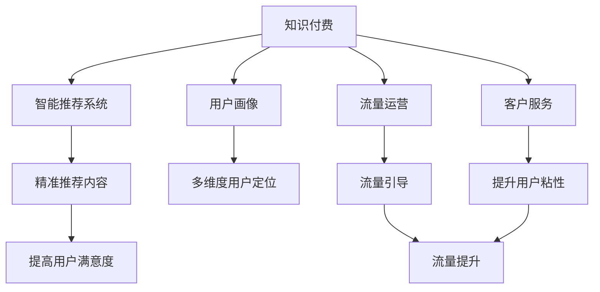

                 

# 知识付费如何实现全渠道营销与销售？

## 1. 背景介绍

### 1.1 问题由来

随着知识经济的兴起，知识付费平台逐渐成为信息消费的主流。从内容创作到分销销售，从品牌营销到用户互动，全渠道营销与销售正在成为知识付费产业链的重要环节。然而，知识付费的线上线下多渠道融合仍存在诸多挑战，传统营销理念已无法满足实际需求，亟需新技术、新方法进行支撑。

### 1.2 问题核心关键点

知识付费的全渠道营销与销售涉及到内容创作、用户互动、分销渠道、流量运营、客户服务等多个环节，要求平台能够跨多渠道协同互动、精准定位目标用户、实现高效转化，是典型的多维复杂问题。

本文聚焦于基于人工智能技术，特别是自然语言处理(NLP)和推荐系统的知识付费平台全渠道营销与销售，探讨如何通过优化内容推荐、用户互动和运营策略，实现知识付费的精准营销和高效销售。

## 2. 核心概念与联系

### 2.1 核心概念概述

为更好地理解基于AI的知识付费全渠道营销与销售方法，本节将介绍几个密切相关的核心概念：

- **知识付费**：指通过平台、内容创作者或品牌方提供付费阅读、付费课程、付费咨询等内容，从而实现知识传播和消费的经济活动。
- **全渠道营销**：指利用线上线下多渠道平台，通过整合内容、产品、流量、数据和运营策略，实现用户全方位、全生命周期的精准营销。
- **智能推荐系统**：指通过AI技术，自动分析用户行为数据和内容特征，实现内容个性化推荐，提升用户满意度。
- **用户画像**：指基于用户行为数据和消费行为，构建用户多维度的个人特征模型，从而实现更精准的用户定位和营销。
- **流量运营**：指通过各类运营活动和渠道策略，引导用户流量，提升平台流量和转化率。
- **客户服务**：指通过智能客服、内容互动、社群运营等方式，提高用户粘性和满意度，提升知识付费的转化效果。

这些核心概念之间的逻辑关系可以通过以下Mermaid流程图来展示：



这个流程图展示了这个多维问题的核心概念及其之间的关系：

1. 知识付费平台利用智能推荐系统，提升内容匹配度，提高用户满意度。
2. 用户画像通过多维度特征建模，实现精准的用户定位和营销。
3. 流量运营通过各类运营活动和渠道策略，提升流量和转化率。
4. 客户服务通过智能客服、社群运营等方式，提升用户粘性和满意度。
5. 精准推荐和用户定位提高用户满意度，流量引导和运营提升流量和转化率。

这些概念共同构成了知识付费平台的精准营销与高效销售框架，使得知识付费服务能够更全面、高效地触达目标用户。

## 3. 核心算法原理 & 具体操作步骤
### 3.1 算法原理概述

基于AI的知识付费全渠道营销与销售，主要利用自然语言处理(NLP)和推荐系统等技术，实现内容推荐、用户画像和流量运营的优化。其核心思想是：

- **内容推荐**：通过NLP技术，分析内容文本，提取语义特征，并结合用户画像和行为数据，实现个性化内容推荐。
- **用户画像**：基于用户行为数据，构建多维度特征模型，以实现精准的用户定位和营销。
- **流量运营**：通过多渠道运营策略和AI分析，优化广告投放、用户引导等环节，实现流量提升和转化率优化。
- **客户服务**：通过智能客服和内容互动，提升用户体验，提高用户粘性和满意度。

### 3.2 算法步骤详解

基于AI的知识付费全渠道营销与销售一般包括以下几个关键步骤：

**Step 1: 数据准备与特征提取**

- 收集用户行为数据，包括浏览历史、购买记录、评论反馈等。
- 对内容文本进行分词、去除停用词、词性标注等预处理，提取文本的语义特征。
- 将用户画像数据与内容特征数据整合，构建用户-内容交互矩阵。

**Step 2: 模型训练与内容推荐**

- 使用协同过滤、深度学习等方法，训练内容推荐模型，实现个性化内容推荐。
- 对推荐模型进行A/B测试，优化推荐算法和参数设置。
- 定期更新推荐模型，以保证内容推荐的实时性和准确性。

**Step 3: 用户画像构建**

- 基于用户行为数据，提取用户画像特征，如兴趣偏好、消费能力等。
- 利用聚类、关联规则等方法，构建用户的多维度特征模型。
- 对用户画像模型进行可视化展示，便于理解和优化。

**Step 4: 流量运营策略**

- 根据用户画像和内容推荐结果，优化广告投放、推荐位置等运营策略。
- 利用AI分析工具，实时监控运营效果，进行策略调整。
- 通过A/B测试，评估运营策略的实际效果。

**Step 5: 客户服务优化**

- 集成智能客服系统，提高用户咨询效率。
- 通过内容互动，提升用户粘性和满意度。
- 构建社群运营机制，增强用户互动和参与度。

以上是基于AI的知识付费全渠道营销与销售的一般流程。在实际应用中，还需要针对具体平台和业务特点，对各个环节进行优化设计，如改进内容推荐算法，引入更多的用户画像特征，设计更灵活的运营策略等。

### 3.3 算法优缺点

基于AI的知识付费全渠道营销与销售方法具有以下优点：

- **精准定位**：通过用户画像和多维度特征建模，实现精准的用户定位和营销。
- **高效转化**：基于个性化推荐和内容匹配，提高用户转化率和满意度。
- **自动化运营**：借助AI自动化分析工具，优化运营策略，提高运营效率。
- **提升用户体验**：通过智能客服和内容互动，提升用户粘性和满意度。

同时，该方法也存在一定的局限性：

- **数据依赖**：需要大量高质量的数据支撑，包括用户行为数据和内容特征数据，获取成本较高。
- **算法复杂**：涉及多维数据分析、推荐算法和运营策略，模型实现较为复杂。
- **效果难以预测**：由于涉及多因素交互影响，运营效果难以完全预测，需要不断调整和优化。
- **技术门槛高**：需要具备较强的AI技术背景和数据分析能力，对平台运营团队要求较高。

尽管存在这些局限性，但就目前而言，基于AI的全渠道营销与销售方法仍是大规模知识付费平台的主要选择。未来相关研究的重点在于如何进一步降低数据获取成本，提高模型的自动化程度，同时兼顾运营效果的可预测性和运营策略的灵活性。

### 3.4 算法应用领域

基于AI的知识付费全渠道营销与销售方法，在多个领域得到了广泛应用，例如：

- 在线教育平台：通过推荐系统，提高课程推荐准确度，提升学生满意度。
- 在线医疗平台：通过内容推荐和用户画像，提高用户粘性和转化率。
- 专业咨询平台：通过推荐系统和智能客服，提高用户咨询效率和满意度。
- 内容付费平台：通过个性化推荐和智能客服，提高内容消费转化率。
- 企业知识管理平台：通过内容推荐和用户画像，实现知识高效传播和共享。

除了上述这些经典应用外，AI技术还广泛应用于多行业领域的知识付费服务，为各行业数字化转型升级提供了新的思路和方案。

## 4. 数学模型和公式 & 详细讲解 & 举例说明

### 4.1 数学模型构建

本文基于自然语言处理(NLP)和推荐系统等技术，构建了知识付费平台全渠道营销与销售的数学模型。

记用户行为数据为 $U = \{u_1, u_2, ..., u_N\}$，内容特征数据为 $C = \{c_1, c_2, ..., c_M\}$，其中 $u_i$ 和 $c_j$ 分别表示用户和内容的特征向量。设用户与内容的交互矩阵为 $A \in \mathbb{R}^{N \times M}$，$A_{ij} = 1$ 表示用户 $u_i$ 与内容 $c_j$ 存在交互，$A_{ij} = 0$ 表示不存在交互。

定义推荐模型为 $F(\mathbf{A}, \mathbf{U}, \mathbf{C})$，其中 $\mathbf{U}$ 和 $\mathbf{C}$ 分别为用户和内容的特征矩阵。推荐模型输出 $Y \in \mathbb{R}^{N \times M}$，$Y_{ij}$ 表示内容 $c_j$ 对用户 $u_i$ 的推荐分数。

### 4.2 公式推导过程

推荐模型的目标是最小化用户与内容之间的误差，即：

$$
\min_{F} \sum_{i=1}^N \sum_{j=1}^M (y_{ij} - F(\mathbf{A}, \mathbf{U}, \mathbf{C}))^2
$$

其中 $y_{ij}$ 为用户 $u_i$ 对内容 $c_j$ 的真实评分，可以通过用户行为数据进行估计。

常见的推荐模型包括矩阵分解、协同过滤、深度学习等。以矩阵分解模型为例，推荐分数 $Y_{ij}$ 可以通过矩阵分解表示为：

$$
Y_{ij} = \mathbf{W}_i \mathbf{V}_j^T
$$

其中 $\mathbf{W}_i$ 和 $\mathbf{V}_j$ 分别为用户和内容的低维特征表示。通过最小化损失函数，可以得到推荐模型参数 $\mathbf{W}$ 和 $\mathbf{V}$：

$$
\mathbf{W}, \mathbf{V} = \arg\min_{\mathbf{W}, \mathbf{V}} \sum_{i=1}^N \sum_{j=1}^M (y_{ij} - \mathbf{W}_i \mathbf{V}_j^T)^2
$$

### 4.3 案例分析与讲解

以某在线教育平台为例，分析基于推荐系统的个性化推荐过程。

假设平台有 $N=10,000$ 名用户和 $M=5,000$ 门课程，平台收集到 $A \in \mathbb{R}^{N \times M}$ 的用户与课程交互矩阵。设 $\mathbf{U} \in \mathbb{R}^{N \times D}$ 为 $N$ 个用户的行为特征矩阵，$\mathbf{C} \in \mathbb{R}^{M \times D}$ 为 $M$ 门课程的特征矩阵。其中 $D=100$，代表用户和课程的100维特征。

推荐模型 $F(\mathbf{A}, \mathbf{U}, \mathbf{C})$ 输出 $Y \in \mathbb{R}^{N \times M}$，表示课程对用户的推荐分数。平台可以通过推荐分数排序，为用户推荐最感兴趣的课程。

## 5. 项目实践：代码实例和详细解释说明
### 5.1 开发环境搭建

在进行项目实践前，我们需要准备好开发环境。以下是使用Python进行PyTorch开发的环境配置流程：

1. 安装Anaconda：从官网下载并安装Anaconda，用于创建独立的Python环境。

2. 创建并激活虚拟环境：
```bash
conda create -n pytorch-env python=3.8 
conda activate pytorch-env
```

3. 安装PyTorch：根据CUDA版本，从官网获取对应的安装命令。例如：
```bash
conda install pytorch torchvision torchaudio cudatoolkit=11.1 -c pytorch -c conda-forge
```

4. 安装Tensorflow：如果需要进行跨平台开发，需要安装Tensorflow。

5. 安装各类工具包：
```bash
pip install numpy pandas scikit-learn matplotlib tqdm jupyter notebook ipython
```

完成上述步骤后，即可在`pytorch-env`环境中开始项目实践。

### 5.2 源代码详细实现

这里我们以在线教育平台为例，给出基于推荐系统的知识付费平台全渠道营销与销售的Python代码实现。

首先，定义推荐模型的数据处理函数：

```python
import torch
from torch import nn
from torch.nn import functional as F

class RecommendationModel(nn.Module):
    def __init__(self, user_dim, course_dim, embed_dim):
        super(RecommendationModel, self).__init__()
        self.user_embed = nn.Embedding(user_dim, embed_dim)
        self.course_embed = nn.Embedding(course_dim, embed_dim)
        self.bmm = nn.Bmm()

    def forward(self, user, course):
        user_embed = self.user_embed(user)
        course_embed = self.course_embed(course)
        return self.bmm(user_embed, course_embed)

# 构建推荐模型
model = RecommendationModel(user_dim=10000, course_dim=5000, embed_dim=100)

# 定义优化器和损失函数
optimizer = torch.optim.Adam(model.parameters(), lr=0.001)
loss_fn = nn.MSELoss()
```

然后，定义推荐模型的训练函数：

```python
def train(model, data_loader, num_epochs):
    for epoch in range(num_epochs):
        model.train()
        for batch in data_loader:
            user, course, target = batch
            optimizer.zero_grad()
            pred = model(user, course)
            loss = loss_fn(pred, target)
            loss.backward()
            optimizer.step()
```

最后，启动训练流程并测试推荐效果：

```python
# 定义数据集和数据加载器
dataset = ...  # 用户与课程交互数据集
data_loader = torch.utils.data.DataLoader(dataset, batch_size=100, shuffle=True)

# 训练模型
train(model, data_loader, num_epochs=10)

# 测试推荐效果
with torch.no_grad():
    user_test, course_test, target_test = ...
    pred = model(user_test, course_test)
    print("推荐效果:", loss_fn(pred, target_test).item())
```

以上就是使用PyTorch实现在线教育平台个性化推荐系统的完整代码实现。可以看到，借助深度学习框架，我们可以快速搭建和训练推荐模型，实现个性化推荐功能。

### 5.3 代码解读与分析

让我们再详细解读一下关键代码的实现细节：

**RecommendationModel类**：
- `__init__`方法：初始化模型参数，包括用户和课程的嵌入层以及点积运算层。
- `forward`方法：定义前向传播过程，计算用户和课程的嵌入向量的点积。

**训练函数**：
- 定义训练循环，对数据集进行批处理。
- 在每个批次上，计算预测值和真实值之间的均方误差。
- 反向传播更新模型参数。

**测试推荐效果**：
- 在测试集上，计算模型预测值与真实值之间的均方误差。

代码实现相对简单，但包含了许多关键的AI模型训练和评估流程。借助深度学习框架，我们可以在很短的时间内构建和训练推荐模型，提升知识付费平台的推荐效果。

## 6. 实际应用场景

### 6.1 在线教育平台

基于推荐系统的知识付费平台，可以显著提升在线教育平台的课程推荐效果，提高用户满意度和转化率。

具体而言，平台可以利用用户的行为数据（如浏览、点击、购买等）构建用户画像，利用课程的特征（如教师、科目、时长等）构建课程特征矩阵，并通过推荐算法生成个性化的课程推荐列表。通过展示推荐列表，用户能够更快找到适合自己的课程，从而提高购买和学习的转化率。

### 6.2 在线医疗平台

在线医疗平台也可以应用推荐系统，提升医疗咨询和服务的精准度，提高用户粘性。

平台可以利用用户的搜索历史、浏览记录等行为数据，结合医生的专业背景、病人画像等特征，构建用户-医生推荐矩阵，推荐最匹配的医生和诊疗方案。通过个性化推荐，用户能够更快找到满意的医生和方案，提升平台的转化率和用户满意度。

### 6.3 专业咨询平台

专业咨询平台通过推荐系统和智能客服，提高用户咨询效率和满意度。

平台可以基于用户的搜索历史、咨询记录等行为数据，构建用户画像，利用专家库和咨询内容的数据特征，构建用户-专家推荐矩阵，推荐最匹配的专家和咨询内容。通过智能客服和推荐系统，用户能够快速找到满意的咨询专家和内容，提升平台的粘性和用户满意度。

### 6.4 未来应用展望

随着推荐系统和大数据分析技术的发展，基于AI的知识付费平台将在更多领域得到应用，为各行各业带来变革性影响。

在智慧医疗领域，推荐系统可以应用于医生推荐、诊疗方案推荐、药品推荐等环节，提高医疗服务的智能化水平。

在智能教育领域，推荐系统可以应用于课程推荐、教师推荐、学习路径推荐等环节，提升教育服务的精准度和用户体验。

在企业知识管理平台，推荐系统可以应用于知识推荐、专家推荐、问题解答推荐等环节，实现知识的高效传播和共享。

此外，在智慧城市、智能金融、智能客服等众多领域，基于AI的知识付费平台也将不断涌现，为经济社会发展注入新的动力。相信随着技术的日益成熟，知识付费平台必将在更广阔的应用领域大放异彩，深刻影响人类的生产生活方式。

## 7. 工具和资源推荐
### 7.1 学习资源推荐

为了帮助开发者系统掌握基于AI的知识付费全渠道营销与销售的理论基础和实践技巧，这里推荐一些优质的学习资源：

1. 《深度学习自然语言处理》系列博文：由大模型技术专家撰写，深入浅出地介绍了深度学习在自然语言处理中的应用，包括推荐系统等前沿话题。

2. Coursera《机器学习》课程：斯坦福大学开设的经典机器学习课程，涵盖了监督学习、无监督学习、半监督学习等基本概念和算法。

3. 《推荐系统：算法与实现》书籍：详细介绍了推荐系统的原理和实现方法，包括协同过滤、深度学习等常用技术。

4. 《机器学习实战》书籍：介绍了机器学习中的基本算法和技术，并提供了大量的实战案例和代码示例。

5. Kaggle：机器学习竞赛平台，提供丰富的推荐系统竞赛数据集和代码示例，适合实践和竞赛。

通过对这些资源的学习实践，相信你一定能够快速掌握基于AI的知识付费全渠道营销与销售的精髓，并用于解决实际的营销问题。

### 7.2 开发工具推荐

高效的开发离不开优秀的工具支持。以下是几款用于AI推荐系统开发的常用工具：

1. PyTorch：基于Python的开源深度学习框架，灵活动态的计算图，适合快速迭代研究。

2. TensorFlow：由Google主导开发的开源深度学习框架，生产部署方便，适合大规模工程应用。

3. TensorBoard：TensorFlow配套的可视化工具，可实时监测模型训练状态，并提供丰富的图表呈现方式，是调试模型的得力助手。

4. Weights & Biases：模型训练的实验跟踪工具，可以记录和可视化模型训练过程中的各项指标，方便对比和调优。

5. Keras：基于Python的深度学习库，简单易用，适合快速原型开发和模型部署。

6. Scikit-learn：Python的机器学习库，提供了丰富的机器学习算法和工具，适合数据分析和模型评估。

合理利用这些工具，可以显著提升AI推荐系统的开发效率，加快创新迭代的步伐。

### 7.3 相关论文推荐

基于AI的知识付费全渠道营销与销售技术的发展源于学界的持续研究。以下是几篇奠基性的相关论文，推荐阅读：

1. "Collaborative Filtering for Implicit Feedback Datasets"（协同过滤推荐算法）：P. Reshef, T. Finin, R. Srebro，ICML'2009。

2. "Deep Matrix Factorization"（深度矩阵分解推荐算法）：H. He, Y. Chen, D. Lee，IJCAI'2017。

3. "Neural Collaborative Filtering"（神经网络协同过滤推荐算法）：S. He, S. Zhu，SIGIR'2017。

4. "Learning Deep Architectures for AI"（深度学习架构）：Y. LeCun，Nature'2015。

5. "Deep Learning for Recommender Systems: A Review and Outlook"（深度学习在推荐系统中的应用）：H. He，SIGKDD'2021。

这些论文代表了大规模推荐系统的发展脉络。通过学习这些前沿成果，可以帮助研究者把握学科前进方向，激发更多的创新灵感。

## 8. 总结：未来发展趋势与挑战

### 8.1 总结

本文对基于AI的知识付费全渠道营销与销售方法进行了全面系统的介绍。首先阐述了全渠道营销与销售在知识付费平台中的重要性，明确了推荐系统、用户画像和流量运营等核心概念及其相互关系。其次，从原理到实践，详细讲解了推荐系统的数学模型和关键算法，给出了推荐任务开发的完整代码实例。同时，本文还广泛探讨了推荐系统在知识付费平台中的应用场景，展示了其巨大的潜力。

通过本文的系统梳理，可以看到，基于AI的全渠道营销与销售方法正在成为知识付费平台的重要选择，极大地提升了平台的推荐效果和用户满意度。未来，伴随推荐系统和大数据分析技术的发展，知识付费平台将在更多领域得到应用，为各行各业带来变革性影响。

### 8.2 未来发展趋势

展望未来，知识付费全渠道营销与销售技术将呈现以下几个发展趋势：

1. **智能推荐系统**：推荐系统将通过深度学习和大数据分析，实现内容更加精准的推荐，提升用户体验。

2. **多渠道运营**：通过整合多渠道平台和数据，实现全渠道的精准营销和流量引导，提升运营效率。

3. **个性化服务**：基于用户画像和行为数据，实现个性化的内容推荐和互动服务，提高用户粘性和满意度。

4. **智能客服和社群运营**：通过智能客服和社群运营机制，提升用户咨询效率和平台互动性。

5. **大数据分析**：利用大数据分析工具，实时监控和优化运营策略，提升平台效果。

6. **AI技术融合**：融合AI技术如自然语言处理、因果推断等，提升推荐系统和营销策略的智能水平。

以上趋势凸显了AI技术在知识付费全渠道营销与销售中的重要地位。这些方向的探索发展，必将进一步提升平台的推荐效果和运营效率，为知识付费平台的健康发展提供有力保障。

### 8.3 面临的挑战

尽管基于AI的全渠道营销与销售方法已经取得了一定的成果，但在迈向更加智能化、普适化应用的过程中，仍面临诸多挑战：

1. **数据质量**：推荐系统依赖于高质量的数据支撑，包括用户行为数据和内容特征数据，获取成本较高，且数据质量难以保证。

2. **模型复杂性**：推荐模型涉及多维数据分析和复杂算法，模型实现较为复杂，技术门槛较高。

3. **效果预测难度**：推荐系统涉及多因素交互影响，运营效果难以完全预测，需要不断调整和优化。

4. **技术融合难度**：融合多种AI技术如自然语言处理、因果推断等，需要强大的技术能力和团队合作。

5. **隐私保护问题**：推荐系统涉及用户行为数据隐私保护，如何在保障数据隐私和安全的前提下进行精准推荐，是重要挑战。

6. **用户接受度**：AI技术的融入可能引发用户接受度问题，平台需要在用户教育和互动中逐步提升用户信任。

正视这些挑战，积极应对并寻求突破，将是大规模知识付费平台成功实现全渠道营销与销售的关键。相信随着学界和产业界的共同努力，这些挑战终将一一被克服，AI推荐系统必将在知识付费平台上大放异彩。

### 8.4 研究展望

面对知识付费全渠道营销与销售所面临的诸多挑战，未来的研究需要在以下几个方面寻求新的突破：

1. **提升数据质量**：通过多源数据融合、数据清洗和预处理，提升数据质量和可用性。

2. **简化模型实现**：开发更加轻量级、易于部署的推荐算法和模型，降低技术门槛。

3. **优化效果预测**：引入因果推断等方法，提高推荐系统的效果预测精度。

4. **技术融合创新**：融合多种AI技术如自然语言处理、因果推断等，提升推荐系统的智能水平。

5. **隐私保护机制**：研究隐私保护技术，如差分隐私、联邦学习等，保护用户数据隐私。

6. **用户教育与互动**：通过用户教育和技术互动，提升用户对AI技术的接受度和信任感。

这些研究方向的探索，必将引领知识付费平台全渠道营销与销售技术迈向更高的台阶，为知识付费平台的健康发展提供有力保障。面向未来，知识付费平台需要在数据、算法、工程、业务等多个维度协同发力，共同推动AI技术在垂直行业的落地应用。

## 9. 附录：常见问题与解答

**Q1：如何优化推荐系统的推荐效果？**

A: 优化推荐系统的推荐效果主要从以下几个方面入手：

1. **数据质量**：保证用户行为数据和内容特征数据的完整性和准确性。
2. **特征工程**：通过特征选择和特征提取，提升模型的表达能力。
3. **模型选择**：选择适合的推荐算法，如矩阵分解、协同过滤、深度学习等，根据实际需求进行优化。
4. **参数调优**：通过A/B测试和超参数调优，优化模型参数和推荐策略。
5. **用户反馈**：引入用户反馈和评分机制，实时调整推荐策略。

**Q2：推荐系统如何应对长尾问题？**

A: 长尾问题是推荐系统面临的重要挑战之一。主要通过以下方法应对：

1. **冷启动策略**：对于新用户和新内容，引入冷启动策略，如基于内容的推荐、基于标签的推荐等。
2. **多模态融合**：融合多种数据模态，如文本、图像、视频等，提升推荐系统的多样性和精准度。
3. **上下文推荐**：引入上下文信息，如时间、地点、设备等，提升推荐系统的实时性和个性化。
4. **模型优化**：引入深度学习等技术，提升推荐系统的复杂度和泛化能力。

**Q3：如何保护用户隐私和数据安全？**

A: 保护用户隐私和数据安全是推荐系统的核心问题。主要通过以下方法实现：

1. **差分隐私**：通过添加噪声，保护用户数据的隐私性。
2. **联邦学习**：在用户端进行数据训练，在云端进行模型优化，避免数据泄露。
3. **加密技术**：使用加密技术，保护数据在传输和存储过程中的安全性。
4. **匿名化处理**：对用户数据进行匿名化处理，防止数据泄露。
5. **访问控制**：设置严格的访问控制机制，限制数据访问权限。

这些措施将有助于提升推荐系统的隐私保护能力，保障用户数据的安全性。

**Q4：推荐系统如何应对多渠道数据融合？**

A: 推荐系统如何应对多渠道数据融合主要通过以下方法实现：

1. **数据对齐**：对不同渠道的数据进行对齐，建立统一的用户画像和内容画像。
2. **数据融合**：利用多渠道数据进行融合，提升模型的泛化能力和精准度。
3. **数据清洗**：对多渠道数据进行清洗和预处理，提升数据质量和可用性。
4. **模型优化**：引入多模态融合等技术，提升推荐系统的多样性和精准度。

通过这些方法，可以有效应对多渠道数据融合带来的挑战，提升推荐系统的综合能力。

---

作者：禅与计算机程序设计艺术 / Zen and the Art of Computer Programming

