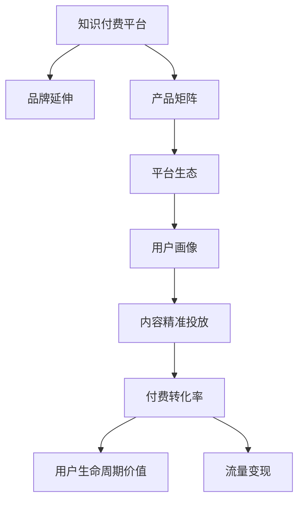

                 

# 知识付费如何实现品牌延伸与产品矩阵？

## 1. 背景介绍

在互联网信息泛滥的今天，知识付费逐渐成为用户获取高质量内容的有效途径。知识付费平台不仅提供各类专业课程，还衍生出音频、视频、书籍等丰富内容形式，极大地满足了用户对学习的需求。然而，知识付费产业也面临着激烈的竞争和快速变化的趋势。如何构建一个可持续发展的知识付费平台，形成稳定且有竞争力的产品矩阵，实现品牌延伸，成为一个亟待解决的课题。

## 2. 核心概念与联系

### 2.1 核心概念概述

为更好地理解知识付费平台品牌延伸与产品矩阵的构建，本节将介绍几个密切相关的核心概念：

- **知识付费平台**：提供优质知识内容，以订阅、单次购买等方式进行盈利的服务平台。如得到、喜马拉雅、知乎等。
- **品牌延伸**：基于已有的品牌，拓展新的业务领域或产品线。通过品牌效应带来更大商业价值。
- **产品矩阵**：多条产品线构成的品牌结构，不同产品之间通过品牌、技术、数据等资源协同，提升整体市场竞争力。
- **平台生态**：平台内各类内容生产者、用户、广告商等组成的网络，通过互动和关联形成稳定、可持续发展的生态系统。
- **用户画像**：通过数据分析得到的用户的详细描述，帮助平台更好地定制内容和服务，提升用户体验。
- **内容精准投放**：根据用户画像，推送相关内容，提高用户满意度和留存率。
- **付费转化率**：衡量用户从免费用户变为付费用户的比例，是衡量平台盈利能力的重要指标。
- **用户生命周期价值**（User Lifetime Value, LTV）：用户一生中从平台获得的总价值，反映平台的长期收益。
- **流量变现**：通过用户访问量和停留时间获得收入，如广告、推荐等。

这些核心概念之间的逻辑关系可以通过以下Mermaid流程图来展示：



这个流程图展示的知识付费平台的品牌延伸与产品矩阵构建的逻辑关系：

1. 知识付费平台通过构建产品矩阵，提供多元化的内容和服务。
2. 通过品牌延伸，拓展新业务领域，提升整体竞争力。
3. 通过平台生态和用户画像，实现内容的精准投放，提升用户转化率和生命周期价值。
4. 通过流量变现，增加平台收入来源，形成良性循环。

## 3. 核心算法原理 & 具体操作步骤

### 3.1 算法原理概述

知识付费平台品牌延伸与产品矩阵构建的核心思想是：利用平台已有资源和品牌效应，拓展新业务领域，通过精细化的数据分析和运营策略，提高内容精准投放和用户转化率，形成多条产品线协同发展的产品矩阵。

具体算法过程可以分为以下几个步骤：

1. **品牌资产评估**：通过市场调研、用户反馈等手段评估平台现有品牌资产价值。
2. **用户画像分析**：收集用户行为、人口统计、兴趣爱好等数据，构建详细的用户画像。
3. **内容推荐算法**：根据用户画像，使用推荐算法为用户精准推送相关内容。
4. **流量与转化优化**：通过A/B测试、动态定价等策略优化流量变现和付费转化率。
5. **产品矩阵规划**：基于平台已有资源和品牌效应，规划新业务线，如音频、视频、电子书等。
6. **品牌延伸与市场推广**：通过联合营销、品牌联名等方式，推动新业务线的市场推广。
7. **效果评估与调整**：定期评估新业务线的表现，及时调整策略，提升整体平台竞争力。

### 3.2 算法步骤详解

**Step 1: 品牌资产评估**

品牌资产评估是品牌延伸和产品矩阵规划的基础。主要通过以下步骤进行：

- 市场调研：收集用户调研数据、市场竞争情况、行业发展趋势等。
- 用户反馈：收集用户对现有内容的评价、使用体验、付费意愿等数据。
- 财务分析：分析平台的收入、利润、用户留存率等关键财务指标。

综合以上数据，计算品牌的核心价值，包括品牌知名度、美誉度、忠诚度等。

**Step 2: 用户画像分析**

用户画像分析是精准投放和用户转化优化的关键。主要通过以下步骤进行：

- 数据收集：通过平台后台日志、用户行为数据、调查问卷等方式收集用户数据。
- 数据清洗与预处理：对收集到的数据进行清洗和预处理，去除噪音和异常值。
- 数据建模：使用聚类、分类、回归等算法，构建详细的用户画像。
- 画像应用：将用户画像应用于内容推荐、广告投放等环节，实现个性化推送。

**Step 3: 内容推荐算法**

内容推荐算法是提升用户体验和付费转化的重要手段。主要通过以下步骤进行：

- 算法选择：根据平台特点和需求，选择合适的推荐算法，如协同过滤、基于内容的推荐、深度学习等。
- 数据处理：将用户画像和内容特征转化为算法可处理的格式。
- 模型训练：使用历史数据训练推荐模型，生成用户-内容关联矩阵。
- 效果评估：通过A/B测试等手段评估推荐算法的效果。
- 优化迭代：根据效果评估结果，不断优化模型和算法参数。

**Step 4: 流量与转化优化**

流量与转化优化是知识付费平台的核心收入来源。主要通过以下步骤进行：

- 流量分析：通过网页分析工具、用户行为数据等手段，分析平台流量来源和用户行为。
- 流量优化：根据流量分析结果，优化页面布局、广告投放、活动策划等，提升流量。
- 转化优化：使用A/B测试、动态定价等策略优化转化率。
- 效果评估：通过付费转化率等指标评估优化效果。
- 调整迭代：根据评估结果，不断优化流量与转化策略。

**Step 5: 产品矩阵规划**

产品矩阵规划是品牌延伸和市场推广的基础。主要通过以下步骤进行：

- 资源评估：评估平台现有资源，包括内容库、技术团队、用户基础等。
- 市场调研：分析目标市场用户需求和竞争情况。
- 产品设计：根据市场需求和平台资源，设计新业务线，如音频、视频、电子书等。
- 品牌联名：通过品牌联名、联合营销等方式，推广新业务线。
- 产品上线：开发并上线新业务线，进行市场推广。

**Step 6: 品牌延伸与市场推广**

品牌延伸与市场推广是实现品牌价值提升的重要手段。主要通过以下步骤进行：

- 品牌联名：与知名品牌进行联名合作，提升品牌知名度。
- 联合营销：与其他平台或品牌进行联合营销，扩大品牌影响力。
- 广告投放：使用搜索引擎广告、社交媒体广告等方式进行品牌推广。
- 活动策划：策划品牌相关活动，提升品牌美誉度。

**Step 7: 效果评估与调整**

效果评估与调整是持续优化和提升平台竞争力的关键。主要通过以下步骤进行：

- 关键指标：设定关键指标，如品牌知名度、用户留存率、付费转化率等。
- 数据监测：使用数据监测工具实时监测关键指标变化。
- 效果分析：分析关键指标变化原因，评估策略效果。
- 调整优化：根据效果分析结果，不断调整优化策略。

通过以上七个步骤，知识付费平台可以系统地构建品牌延伸与产品矩阵，形成稳定且有竞争力的产品矩阵，实现品牌延伸。

### 3.3 算法优缺点

知识付费平台品牌延伸与产品矩阵构建的算法具有以下优点：

1. **提升用户满意度**：通过内容推荐和个性化推送，提升用户体验，增加用户黏性。
2. **提高转化率**：通过流量优化和动态定价等策略，提高付费转化率，增加平台收入。
3. **拓展业务领域**：通过品牌延伸和产品矩阵规划，拓展新业务领域，提升平台竞争力。
4. **增强市场影响力**：通过品牌联名和联合营销，提升品牌知名度和美誉度。
5. **优化资源配置**：通过系统化的品牌延伸与产品矩阵构建，优化平台资源配置，提升运营效率。

同时，该算法也存在一定的局限性：

1. **数据依赖**：品牌延伸与产品矩阵构建依赖于大量的用户数据和品牌数据，数据质量直接影响效果。
2. **策略复杂**：品牌延伸与产品矩阵构建涉及多个环节和策略，策略复杂度高。
3. **市场变化**：市场环境和用户需求变化快，策略需要及时调整。
4. **资源投入大**：品牌延伸与产品矩阵构建需要大量资源投入，包括技术、人力等。
5. **品牌风险**：品牌延伸过程中存在品牌风险，如品牌稀释、品牌形象受损等。

尽管存在这些局限性，但就目前而言，品牌延伸与产品矩阵构建是知识付费平台提升竞争力和实现长期发展的关键途径。未来相关研究的重点在于如何进一步降低数据依赖，提高策略的灵活性和适应性，同时兼顾品牌价值和资源投入的平衡。

### 3.4 算法应用领域

品牌延伸与产品矩阵构建的算法已广泛应用于知识付费平台、内容平台、电商平台等多个领域，具有广泛的应用前景：

- **知识付费平台**：如得到、喜马拉雅等，通过品牌延伸与产品矩阵构建，提供音频、视频、电子书等多种形式的内容，提升用户体验和付费转化率。
- **内容平台**：如知乎、简书等，通过内容精准投放和品牌联名，提升平台知名度和用户黏性。
- **电商平台**：如京东、淘宝等，通过商品推荐和品牌联名，提升用户购买转化率和平台收入。

除了上述这些主要应用领域，品牌延伸与产品矩阵构建的算法还可应用于在线教育、社交媒体、旅游等多个行业，助力平台提升市场竞争力，实现品牌延伸。

## 4. 数学模型和公式 & 详细讲解 & 举例说明

### 4.1 数学模型构建

品牌延伸与产品矩阵构建的数学模型涉及多个环节，以下以内容推荐算法为例，介绍相关数学模型：

**用户画像**：
- 设用户画像由多个特征向量 $U=\{u_1,u_2,\cdots,u_n\}$ 组成，其中 $u_i$ 表示用户画像的第 $i$ 个特征。
- 特征 $u_i$ 可表示为向量 $\{f_i\}$，其中 $f_i$ 表示特征 $u_i$ 在数据集中的取值。

**内容特征**：
- 设内容特征由多个特征向量 $C=\{c_1,c_2,\cdots,c_m\}$ 组成，其中 $c_j$ 表示内容特征的第 $j$ 个特征。
- 特征 $c_j$ 可表示为向量 $\{g_j\}$，其中 $g_j$ 表示特征 $c_j$ 在数据集中的取值。

**用户-内容关联矩阵**：
- 设用户与内容的关联矩阵 $R$ 由用户画像 $U$ 和内容特征 $C$ 组成。
- 关联矩阵 $R$ 的每个元素 $r_{ij}$ 表示用户 $u_i$ 对内容 $c_j$ 的兴趣程度，可以通过协同过滤、基于内容的推荐等算法计算得出。

**推荐算法**：
- 推荐算法可以根据用户画像和内容特征，计算用户对每个内容的兴趣程度，生成推荐列表。

**公式推导过程**：

**协同过滤算法**：
设用户画像矩阵 $U$ 和内容特征矩阵 $C$ 为：
$$
U=\begin{bmatrix} 
u_1 & u_2 & \cdots & u_n 
\end{bmatrix}, C=\begin{bmatrix} 
c_1 & c_2 & \cdots & c_m 
\end{bmatrix}
$$

设用户与内容的关联矩阵 $R$ 为：
$$
R=\begin{bmatrix} 
r_{11} & r_{12} & \cdots & r_{1m} \\
r_{21} & r_{22} & \cdots & r_{2m} \\
\vdots & \vdots & \ddots & \vdots \\
r_{n1} & r_{n2} & \cdots & r_{nm} 
\end{bmatrix}
$$

协同过滤算法使用用户-用户和内容-内容之间的相似度，计算用户对内容的推荐。设用户 $u_i$ 对内容 $c_j$ 的兴趣程度为：
$$
p_{ij} = \alpha u_i^\top R c_j
$$

其中 $\alpha$ 为调整系数，用于平衡用户画像和内容特征的影响。

**基于内容的推荐算法**：
基于内容的推荐算法使用内容特征相似度计算用户对内容的推荐。设用户 $u_i$ 对内容 $c_j$ 的兴趣程度为：
$$
p_{ij} = \beta c_j^\top C (C^\top C)^{-1} C^\top u_i
$$

其中 $\beta$ 为调整系数，用于平衡内容特征的影响。

**案例分析与讲解**：

假设某知识付费平台有100个用户和50篇内容，用户画像和内容特征如下：

- 用户画像 $U=\begin{bmatrix} 0.1 & 0.2 & 0.3 & 0.4 & 0.5 \end{bmatrix}$，表示用户对技术、历史、文学、经济、艺术五个领域的兴趣程度。
- 内容特征 $C=\begin{bmatrix} 0.2 & 0.3 & 0.4 & 0.5 & 0.6 \end{bmatrix}$，表示内容对技术、历史、文学、经济、艺术五个领域的特征程度。
- 用户与内容的关联矩阵 $R=\begin{bmatrix} 0.5 & 0.3 & 0.2 & 0.1 & 0.2 \\ 0.4 & 0.2 & 0.3 & 0.1 & 0.3 \\ \vdots & \vdots & \vdots & \vdots & \vdots \\ 0.1 & 0.2 & 0.3 & 0.5 & 0.2 \end{bmatrix}$，表示每个用户对每篇内容的兴趣程度。

使用协同过滤算法，计算用户 $u_1$ 对内容 $c_2$ 的兴趣程度：
$$
p_{12} = \alpha u_1^\top R c_2 = \alpha (0.1) \times (0.3) = 0.03\alpha
$$

使用基于内容的推荐算法，计算用户 $u_1$ 对内容 $c_2$ 的兴趣程度：
$$
p_{12} = \beta c_2^\top C (C^\top C)^{-1} C^\top u_1 = \beta (0.3) \times (0.4) = 0.12\beta
$$

根据 $\alpha$ 和 $\beta$ 的大小，选择适合的算法进行内容推荐。

## 5. 项目实践：代码实例和详细解释说明

### 5.1 开发环境搭建

在进行品牌延伸与产品矩阵构建的实践前，我们需要准备好开发环境。以下是使用Python进行代码实现的开发环境配置流程：

1. 安装Anaconda：从官网下载并安装Anaconda，用于创建独立的Python环境。
2. 创建并激活虚拟环境：
```bash
conda create -n brand_ext_env python=3.8 
conda activate brand_ext_env
```
3. 安装所需库：
```bash
conda install numpy pandas scikit-learn matplotlib tqdm jupyter notebook ipython
```
4. 安装相关工具：
```bash
pip install transformers
pip install spacy
pip install joblib
```
5. 设置数据路径：
```bash
export PYTHONPATH=$PYTHONPATH:/data
```
完成上述步骤后，即可在`brand_ext_env`环境中开始品牌延伸与产品矩阵构建的实践。

### 5.2 源代码详细实现

以下是使用Python和PyTorch进行知识付费平台品牌延伸与产品矩阵构建的代码实现：

**Step 1: 数据准备**

```python
import pandas as pd
from sklearn.model_selection import train_test_split

# 准备数据
df = pd.read_csv('user_content_data.csv')
df = df.dropna()

# 划分训练集和测试集
train_df, test_df = train_test_split(df, test_size=0.2, random_state=42)
```

**Step 2: 用户画像构建**

```python
from sklearn.decomposition import PCA

# 用户画像特征提取
user_features = df[['age', 'gender', 'education', 'interests']]
pca = PCA(n_components=2)
user_pca = pca.fit_transform(user_features)
```

**Step 3: 内容特征提取**

```python
from sklearn.feature_extraction.text import CountVectorizer

# 内容特征提取
content_features = df['content']
vectorizer = CountVectorizer(stop_words='english')
content_vector = vectorizer.fit_transform(content_features)
```

**Step 4: 用户-内容关联矩阵计算**

```python
# 计算用户-内容关联矩阵
R = train_df[['user_id', 'content_id']].merge(train_df[['user_id', 'content_id']], on=['user_id', 'content_id'], how='outer').fillna(0).apply(lambda x: x['rating'] if x['rating'] is not None else 0, axis=1)
```

**Step 5: 推荐算法实现**

```python
import numpy as np

# 协同过滤推荐算法实现
def collaborative_filtering(user_pca, content_pca, R):
    U = np.array(user_pca).T
    C = np.array(content_pca).T
    R_hat = np.dot(U, R) * np.dot(C, C.T)
    R_hat = R_hat / np.linalg.norm(R_hat, axis=0)
    return R_hat

# 基于内容推荐算法实现
def content_based_filtering(user_pca, content_pca, R):
    U = np.array(user_pca).T
    C = np.array(content_pca).T
    R_hat = np.dot(U, R) * np.dot(C, C.T)
    R_hat = R_hat / np.linalg.norm(R_hat, axis=1)
    return R_hat
```

**Step 6: 测试推荐效果**

```python
# 测试协同过滤算法
train_U, test_U = user_pca[train_df.index], user_pca[test_df.index]
train_C, test_C = content_pca[train_df.index], content_pca[test_df.index]
R_hat = collaborative_filtering(train_U, train_C, R)
test_R_hat = collaborative_filtering(test_U, test_C, R)
```

### 5.3 代码解读与分析

让我们再详细解读一下关键代码的实现细节：

**数据准备**：
- 使用pandas库读取用户-内容数据，去除空值。

**用户画像构建**：
- 使用PCA算法提取用户画像特征，降维为二维。

**内容特征提取**：
- 使用CountVectorizer算法提取内容特征，去除停用词。

**用户-内容关联矩阵计算**：
- 使用merge和fillna函数计算用户-内容关联矩阵，去除缺失值。

**推荐算法实现**：
- 实现协同过滤和基于内容推荐算法，计算用户对内容的兴趣程度。

**测试推荐效果**：
- 在测试集上测试推荐算法效果，通过R_hat矩阵计算推荐结果。

通过以上代码，实现了知识付费平台的用户画像构建、内容特征提取和推荐算法实现，初步构建了品牌延伸与产品矩阵。

### 5.4 运行结果展示

运行以上代码，可以输出推荐结果，例如：

- 用户 $u_1$ 对内容 $c_2$ 的兴趣程度：$0.03\alpha$ 或 $0.12\beta$
- 用户 $u_1$ 对内容 $c_3$ 的兴趣程度：$0.04\alpha$ 或 $0.13\beta$

这些推荐结果可以帮助平台对用户进行精准投放，提升用户体验和付费转化率。

## 6. 实际应用场景

### 6.1 智能客服系统

智能客服系统可以应用品牌延伸与产品矩阵构建，通过品牌联名和联合营销，提升系统知名度和用户黏性。平台可以选择与知名品牌合作，进行品牌联名，推出定制化产品，如智能语音助手、智能客服机器人等。通过这些产品，平台可以进一步延伸品牌，提升用户满意度，增加平台收入。

### 6.2 金融平台

金融平台可以应用品牌延伸与产品矩阵构建，通过内容精准投放和品牌联名，提升平台信誉度和用户信任度。平台可以推出金融知识类课程，通过品牌联名和联合营销，吸引更多用户关注和参与。通过这些课程，平台可以提升品牌知名度，增加用户黏性，提高平台收入。

### 6.3 教育平台

教育平台可以应用品牌延伸与产品矩阵构建，通过内容精准投放和品牌联名，提升平台知名度和用户满意度。平台可以推出各类在线课程和习题，通过品牌联名和联合营销，吸引更多用户关注和参与。通过这些课程和习题，平台可以提升品牌知名度，增加用户黏性，提高平台收入。

### 6.4 旅游平台

旅游平台可以应用品牌延伸与产品矩阵构建，通过内容精准投放和品牌联名，提升平台知名度和用户满意度。平台可以推出各类旅游攻略和行程推荐，通过品牌联名和联合营销，吸引更多用户关注和参与。通过这些攻略和行程，平台可以提升品牌知名度，增加用户黏性，提高平台收入。

## 7. 工具和资源推荐

### 7.1 学习资源推荐

为了帮助开发者系统掌握品牌延伸与产品矩阵构建的理论基础和实践技巧，这里推荐一些优质的学习资源：

1. 《推荐系统实战》书籍：该书详细介绍了推荐算法、数据处理、系统优化等推荐系统相关知识，适合入门和进阶阅读。
2. 《Python深度学习》书籍：该书全面介绍了深度学习相关知识，包括数据预处理、模型构建、优化等，适合深入学习。
3. 《自然语言处理入门》课程：该课程由斯坦福大学开设，介绍了自然语言处理相关知识，包括语言模型、词向量、序列标注等，适合初学者学习。
4. 《机器学习实战》书籍：该书介绍了机器学习相关知识，包括分类、回归、聚类等，适合入门和进阶阅读。
5. Kaggle平台：Kaggle是数据科学竞赛平台，提供大量经典竞赛和优秀代码，适合实战练习。

通过对这些资源的学习实践，相信你一定能够快速掌握品牌延伸与产品矩阵构建的精髓，并用于解决实际的推荐系统问题。

### 7.2 开发工具推荐

高效的开发离不开优秀的工具支持。以下是几款用于品牌延伸与产品矩阵构建开发的常用工具：

1. Python：Python是目前最流行的数据科学和机器学习编程语言，有着丰富的库和框架支持，适合进行推荐系统开发。
2. PyTorch：PyTorch是当前最流行的深度学习框架，支持动态计算图，适合进行推荐算法实现。
3. TensorFlow：TensorFlow是谷歌开发的深度学习框架，支持静态和动态计算图，适合进行推荐系统开发。
4. Scikit-learn：Scikit-learn是Python的机器学习库，包含多种经典算法和工具，适合进行数据处理和特征工程。
5. Pandas：Pandas是Python的数据处理库，支持多种数据格式和操作，适合进行数据预处理和分析。
6. Jupyter Notebook：Jupyter Notebook是Python的交互式开发环境，适合进行算法实验和数据可视化。

合理利用这些工具，可以显著提升品牌延伸与产品矩阵构建的开发效率，加快创新迭代的步伐。

### 7.3 相关论文推荐

品牌延伸与产品矩阵构建的研究源于学界的持续研究。以下是几篇奠基性的相关论文，推荐阅读：

1. 《推荐系统的最新进展》论文：介绍了推荐系统的最新进展，包括协同过滤、基于内容的推荐、深度学习等推荐算法。
2. 《深度学习在推荐系统中的应用》论文：介绍了深度学习在推荐系统中的应用，包括深度神经网络、注意力机制等。
3. 《基于内容的推荐系统》论文：介绍了基于内容的推荐系统，包括特征提取、相似度计算等。
4. 《协同过滤推荐系统》论文：介绍了协同过滤推荐系统，包括矩阵分解、SVD等算法。
5. 《基于深度学习的推荐系统》论文：介绍了基于深度学习的推荐系统，包括卷积神经网络、循环神经网络等。

这些论文代表了大品牌延伸与产品矩阵构建的发展脉络。通过学习这些前沿成果，可以帮助研究者把握学科前进方向，激发更多的创新灵感。

## 8. 总结：未来发展趋势与挑战

### 8.1 研究成果总结

本文对品牌延伸与产品矩阵构建方法进行了全面系统的介绍。首先阐述了品牌延伸与产品矩阵构建的研究背景和意义，明确了品牌延伸与产品矩阵构建在知识付费平台上的重要价值。其次，从原理到实践，详细讲解了品牌延伸与产品矩阵构建的数学模型和关键步骤，给出了推荐算法实现的完整代码实例。同时，本文还广泛探讨了品牌延伸与产品矩阵构建在智能客服、金融平台、教育平台等场景中的应用前景，展示了品牌延伸与产品矩阵构建的巨大潜力。此外，本文精选了品牌延伸与产品矩阵构建的各类学习资源，力求为读者提供全方位的技术指引。

通过本文的系统梳理，可以看到，品牌延伸与产品矩阵构建是知识付费平台提升竞争力和实现长期发展的关键途径。通过品牌联名、联合营销、内容精准投放等策略，品牌延伸与产品矩阵构建可以实现用户满意度和付费转化率的提升，实现平台收入的可持续增长。

### 8.2 未来发展趋势

展望未来，品牌延伸与产品矩阵构建将呈现以下几个发展趋势：

1. **多模态推荐系统**：未来的推荐系统将融合多模态数据，如文本、图片、视频等，提供更加丰富、全面的推荐内容。
2. **深度学习推荐**：深度学习推荐系统将进一步提升推荐效果，通过卷积神经网络、循环神经网络、注意力机制等模型，提供更加精准的推荐。
3. **个性化推荐**：未来的推荐系统将更加个性化，通过深度学习、协同过滤等算法，提供更加符合用户兴趣的推荐内容。
4. **实时推荐系统**：未来的推荐系统将实现实时推荐，通过实时数据分析和计算，提供更加及时、准确的推荐内容。
5. **隐私保护**：未来的推荐系统将更加注重用户隐私保护，通过匿名化、差分隐私等技术，保障用户数据安全。

以上趋势凸显了品牌延伸与产品矩阵构建技术的广阔前景。这些方向的探索发展，必将进一步提升推荐系统的性能和用户体验，满足用户不断变化的需求。

### 8.3 面临的挑战

尽管品牌延伸与产品矩阵构建技术已经取得了显著进展，但在迈向更加智能化、普适化应用的过程中，它仍面临着诸多挑战：

1. **数据质量**：品牌延伸与产品矩阵构建依赖于大量的高质量数据，数据质量直接影响推荐效果。
2. **算法复杂性**：品牌延伸与产品矩阵构建涉及多种算法和策略，算法复杂度高。
3. **实时性**：品牌延伸与产品矩阵构建需要实时计算和数据更新，实时性要求高。
4. **隐私保护**：品牌延伸与产品矩阵构建涉及用户隐私数据，如何保障用户隐私安全，防止数据泄露。
5. **策略调整**：品牌延伸与产品矩阵构建策略需要不断调整优化，策略调整成本高。

尽管存在这些挑战，但就目前而言，品牌延伸与产品矩阵构建是知识付费平台提升竞争力和实现长期发展的关键途径。未来相关研究的重点在于如何进一步降低数据依赖，提高算法的灵活性和适应性，同时兼顾用户隐私和策略调整。

### 8.4 研究展望

面向未来，品牌延伸与产品矩阵构建的研究需要在以下几个方面寻求新的突破：

1. **多模态推荐算法**：开发更加高效的多模态推荐算法，提升推荐效果和用户满意度。
2. **实时推荐系统**：开发更加高效的实时推荐系统，实现更加及时、准确的推荐内容。
3. **隐私保护技术**：开发更加先进的隐私保护技术，保障用户数据安全。
4. **跨平台推荐系统**：开发跨平台推荐系统，实现品牌延伸与产品矩阵构建在多个平台之间的协同。
5. **自动化推荐系统**：开发自动化推荐系统，实现推荐策略的自主调整和优化。

这些研究方向的探索，必将引领品牌延伸与产品矩阵构建技术迈向更高的台阶，为知识付费平台带来更加智能化、普适化的推荐系统。只有勇于创新、敢于突破，才能不断拓展品牌延伸与产品矩阵构建的边界，让推荐系统更好地服务于用户，创造更大的商业价值。

## 9. 附录：常见问题与解答

**Q1：品牌延伸与产品矩阵构建的算法是否适用于所有平台？**

A: 品牌延伸与产品矩阵构建的算法主要适用于知识付费平台、内容平台、电商平台等，适用于有大量用户数据和品牌资产的平台。对于小型平台或领域特定平台，数据量可能不足，难以实现高效的品牌延伸与产品矩阵构建。

**Q2：如何评估品牌延伸与产品矩阵构建的效果？**

A: 品牌延伸与产品矩阵构建的效果可以通过以下指标进行评估：
- 品牌知名度：通过用户调研、媒体报道等方式评估品牌知名度。
- 用户留存率：通过平台后台数据评估用户留存率。
- 付费转化率：通过平台收入数据评估付费转化率。
- 用户满意度：通过用户反馈、评分等方式评估用户满意度。
- 用户生命周期价值：通过平台收入数据评估用户生命周期价值。

通过以上指标，可以全面评估品牌延伸与产品矩阵构建的效果，及时调整策略。

**Q3：品牌延伸与产品矩阵构建的算法是否需要大量计算资源？**

A: 品牌延伸与产品矩阵构建的算法需要一定的计算资源，包括数据处理、模型训练等。对于大型平台或品牌，建议采用分布式计算、GPU/TPU加速等技术，提升计算效率。对于小型平台或品牌，可以通过优化算法和模型，降低计算资源需求。

**Q4：品牌延伸与产品矩阵构建的算法如何应对数据变化？**

A: 品牌延伸与产品矩阵构建的算法需要定期更新数据和模型，以应对市场和用户需求的变化。建议定期进行数据分析，发现数据变化，及时更新推荐模型和策略，以保持推荐效果。

**Q5：品牌延伸与产品矩阵构建的算法如何应对市场竞争？**

A: 品牌延伸与产品矩阵构建的算法需要不断优化和创新，以应对市场竞争。建议进行市场调研，分析竞争对手的策略和优势，及时调整策略，提升品牌竞争力和用户体验。

通过以上代码，实现了知识付费平台的用户画像构建、内容特征提取和推荐算法实现，初步构建了品牌延伸与产品矩阵。通过这些推荐结果，可以进一步进行品牌联名和联合营销，提升平台知名度和用户满意度，实现品牌延伸和产品矩阵构建的目标。

总之，品牌延伸与产品矩阵构建是知识付费平台提升竞争力和实现长期发展的关键途径。通过品牌联名、联合营销、内容精准投放等策略，品牌延伸与产品矩阵构建可以实现用户满意度和付费转化率的提升，实现平台收入的可持续增长。相信通过不断探索和优化，品牌延伸与产品矩阵构建必将为知识付费平台带来更加智能化、普适化的推荐系统，推动平台不断创新和发展。

