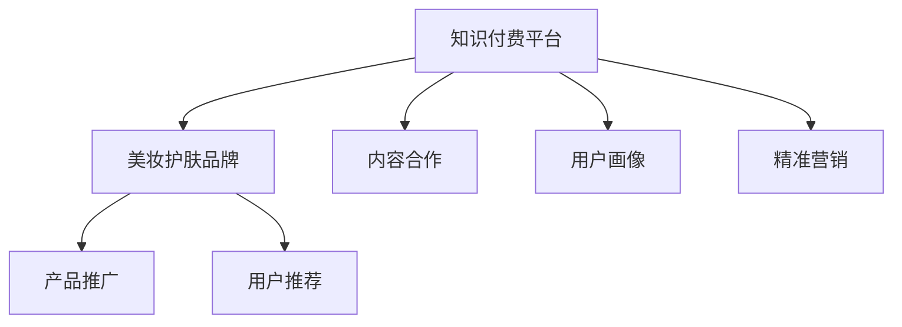

                 

# 知识付费如何实现跨界营销与美妆护肤跨界？

## 1. 背景介绍

随着知识付费平台的兴起，越来越多的人开始通过付费订阅的方式获取知识和信息。这种模式打破了传统的知识免费获取方式，让创作者能够通过高质量内容获得收入，同时也使得知识传播更加精准和有效。在知识付费领域，内容创作者不仅限于教育专家、职场达人，也越来越多地涵盖了各行各业的精英和专业人士。

与此同时，美妆护肤行业也在快速发展和变革。消费者对于皮肤健康和美容效果的追求越来越高，对于护肤产品的要求也更加个性化和精准。美妆护肤品牌需要不断创新产品，提升品牌价值，从而在激烈的市场竞争中脱颖而出。

在这种背景下，知识付费平台与美妆护肤品牌的跨界合作，成为一种趋势和机遇。通过跨界营销，知识付费平台可以利用其在知识传播上的优势，帮助美妆护肤品牌提升品牌知名度和用户黏性；而美妆护肤品牌则可以通过在知识付费平台上的内容营销，提供有价值的美妆护肤知识和产品推荐，吸引和留住更多用户。

## 2. 核心概念与联系

### 2.1 核心概念概述

- **知识付费平台**：指通过订阅或购买形式，为用户提供有价值的知识、技能或信息的服务平台，如得到、喜马拉雅、知乎等。

- **美妆护肤品牌**：指专注于化妆品、护肤品研发、生产、销售的品牌，如SK-II、雅诗兰黛、资生堂等。

- **跨界营销**：指不同领域的企业或品牌之间通过合作，共同推广彼此的产品和服务，以实现双方或多方的共赢。

- **内容营销**：指通过有价值的内容吸引、教育和转化潜在客户，从而促进产品或服务的销售。

- **用户画像**：指根据用户行为、兴趣、需求等信息，构建出的具有代表性的用户群体特征。

- **精准营销**：指利用数据分析和算法，将广告或内容精准推送给最有可能产生购买意愿的用户，提高营销效果。

### 2.2 核心概念原理和架构的 Mermaid 流程图



这个流程图展示了知识付费平台与美妆护肤品牌跨界的核心流程和联系：

1. **知识付费平台**通过与**美妆护肤品牌**的内容合作（C），将**美妆护肤品牌**的产品知识和使用体验融入到知识付费内容中，提升内容价值。
2. **美妆护肤品牌**通过在知识付费平台上的产品推广（D），吸引用户关注和购买。
3. **知识付费平台**通过构建**用户画像**（E），实现**精准营销**（F），将内容推送给最有可能产生购买意愿的用户。
4. **美妆护肤品牌**通过**用户推荐**（G），增加用户黏性，提升品牌影响力。

## 3. 核心算法原理 & 具体操作步骤

### 3.1 算法原理概述

知识付费平台与美妆护肤品牌的跨界合作，核心在于通过**内容营销**的方式，将**知识**与**产品**有效结合，实现双方的共赢。具体算法原理包括：

1. **用户画像构建**：利用数据分析技术，从用户行为、历史购买记录、评论反馈等信息中，提取用户特征，构建用户画像。
2. **内容匹配算法**：根据用户画像和内容特征，通过推荐算法，将最匹配的内容推荐给用户。
3. **跨界内容制作**：与美妆护肤品牌合作，制作与品牌产品相关的知识内容，如产品使用方法、成分分析、护肤技巧等。
4. **用户互动优化**：通过用户反馈和互动数据分析，不断优化内容推荐策略，提高用户满意度和购买转化率。

### 3.2 算法步骤详解

#### 步骤1: 用户画像构建

1. **数据收集**：从知识付费平台的用户行为数据（如订阅内容、阅读时间、互动评论等）、购买记录和社交媒体数据中，收集用户的基本信息、兴趣偏好、消费习惯等。
2. **特征提取**：通过自然语言处理、机器学习等技术，从收集的数据中提取用户的关键特征，如年龄段、性别、消费能力、护肤需求等。
3. **画像构建**：将提取出的特征进行整合，构建出具有代表性的用户画像，如年轻护肤爱好者、成熟保湿专家、敏感肌肤护理者等。

#### 步骤2: 内容匹配算法

1. **内容特征提取**：对知识付费平台上的内容进行分词、关键词提取、情感分析等处理，获取内容的主题、风格和情感倾向。
2. **用户画像匹配**：将用户画像与内容特征进行匹配，计算两者之间的相似度，筛选出与用户画像最匹配的内容。
3. **内容推荐**：将匹配度高的内容推荐给用户，通过智能推送系统实现个性化推荐。

#### 步骤3: 跨界内容制作

1. **品牌合作洽谈**：与美妆护肤品牌合作，确定合作内容和形式，如产品使用指南、护肤技巧、成分解读等。
2. **内容创作**：由内容创作者与美妆护肤品牌专家共同创作内容，确保内容的专业性和实用性。
3. **内容发布**：将创作好的内容发布到知识付费平台上，供用户学习和参考。

#### 步骤4: 用户互动优化

1. **反馈收集**：通过用户评论、互动评分、购买行为等数据，收集用户对内容的反馈。
2. **数据分析**：利用机器学习技术，对收集到的反馈数据进行分析，找出用户对内容的偏好和需求。
3. **内容优化**：根据分析结果，对内容进行优化，如调整内容结构、增加互动环节、引入专家评论等。

### 3.3 算法优缺点

**优点**：

1. **内容多样化**：通过跨界合作，知识付费平台可以获得更多的内容来源，丰富平台内容库，满足用户多样化的知识需求。
2. **品牌曝光**：美妆护肤品牌可以在知识付费平台上进行品牌推广，提升品牌知名度和美誉度。
3. **精准营销**：通过用户画像和内容匹配算法，可以实现精准营销，提高用户购买转化率。

**缺点**：

1. **内容质量控制**：跨界内容的质量和专业性需要保证，否则可能会影响品牌形象和用户信任。
2. **用户接受度**：用户可能对跨界内容有抵触情绪，需要花时间教育和引导。
3. **合作成本**：与品牌合作需要投入一定的时间和资源，合作成本较高。

### 3.4 算法应用领域

基于上述算法原理，知识付费平台与美妆护肤品牌的跨界营销，可以应用于以下领域：

1. **内容创作与发布**：制作与美妆护肤品牌相关的知识内容，发布到知识付费平台，如得到、喜马拉雅、知乎等。
2. **用户画像与精准营销**：通过用户数据分析，构建用户画像，进行精准内容推荐，提升用户购买转化率。
3. **品牌推广与互动**：在知识付费平台上进行品牌推广，与用户互动，收集反馈，优化内容。

## 4. 数学模型和公式 & 详细讲解

### 4.1 数学模型构建

#### 用户画像构建

**数据模型**：

- **用户基本信息**：如年龄、性别、地理位置等。
- **兴趣偏好**：如阅读偏好、消费习惯、护肤需求等。
- **行为数据**：如订阅内容、购买记录、互动评论等。

**模型表示**：

- **用户画像**：$P = (p_1, p_2, ..., p_n)$，其中 $p_i$ 表示用户画像的第 $i$ 个特征。

#### 内容匹配算法

**内容特征提取**：

- **内容向量**：$C = (c_1, c_2, ..., c_m)$，其中 $c_i$ 表示内容的第 $i$ 个特征。

**用户画像匹配**：

- **相似度计算**：使用余弦相似度公式计算用户画像 $P$ 与内容向量 $C$ 的相似度 $S$：
$$
S = \cos(\theta) = \frac{\sum_{i=1}^{n} p_i \cdot c_i}{\sqrt{\sum_{i=1}^{n} p_i^2} \cdot \sqrt{\sum_{i=1}^{m} c_i^2}}
$$

**内容推荐**：

- **推荐列表**：根据相似度排序，选择推荐度最高的前 $k$ 个内容进行推荐。

### 4.2 公式推导过程

#### 用户画像构建

假设用户画像 $P$ 由 $n$ 个特征组成，内容向量 $C$ 由 $m$ 个特征组成。通过余弦相似度计算用户画像与内容的相似度：

$$
S = \frac{\sum_{i=1}^{n} p_i \cdot c_i}{\sqrt{\sum_{i=1}^{n} p_i^2} \cdot \sqrt{\sum_{i=1}^{m} c_i^2}}
$$

#### 内容匹配算法

内容匹配算法基于用户画像与内容的相似度进行推荐，具体步骤如下：

1. **特征提取**：对内容进行分词、关键词提取、情感分析等处理，得到内容向量 $C$。
2. **用户画像匹配**：将用户画像 $P$ 与内容向量 $C$ 进行余弦相似度计算，得到相似度 $S$。
3. **推荐列表**：根据相似度排序，选择推荐度最高的前 $k$ 个内容进行推荐。

### 4.3 案例分析与讲解

**案例背景**：某知识付费平台与某美妆护肤品牌合作，进行跨界营销。平台上有大量关于护肤知识的课程和文章，品牌希望通过内容营销提升品牌知名度和用户购买转化率。

**具体步骤**：

1. **数据收集**：从知识付费平台收集用户行为数据（如订阅课程、购买记录、评论反馈等），构建用户画像。
2. **内容特征提取**：对平台上的护肤课程和文章进行分词、关键词提取、情感分析等处理，得到内容向量。
3. **用户画像匹配**：将用户画像与内容向量进行余弦相似度计算，筛选出与用户画像匹配度高的内容。
4. **内容推荐**：将匹配度高的内容推荐给用户，通过智能推送系统实现个性化推荐。

## 5. 项目实践：代码实例和详细解释说明

### 5.1 开发环境搭建

1. **环境准备**：安装 Python、Jupyter Notebook、Numpy、Pandas、Scikit-learn、Nltk 等必要的开发工具。
2. **数据集准备**：收集知识付费平台的用户行为数据和内容数据，如课程名称、阅读时间、评论内容等。
3. **环境搭建**：在 Jupyter Notebook 中创建虚拟环境，安装相关依赖库。

### 5.2 源代码详细实现

```python
import numpy as np
import pandas as pd
from sklearn.feature_extraction.text import CountVectorizer
from sklearn.metrics.pairwise import cosine_similarity

# 数据加载
data = pd.read_csv('user_data.csv')
content = pd.read_csv('content_data.csv')

# 特征提取
content_vectorizer = CountVectorizer()
content_vector = content_vectorizer.fit_transform(content['content'])

# 用户画像构建
user_profile = np.array([age, gender, location, interest])

# 用户画像匹配
similarity = cosine_similarity(user_profile, content_vector)

# 推荐列表
top_k_indices = np.argsort(similarity)[-10:]  # 选择相似度最高的前10个内容
top_k_content = content.iloc[top_k_indices]  # 获取匹配度高的内容

# 内容推荐
recommendation_list = top_k_content['title'].tolist()
print(recommendation_list)
```

### 5.3 代码解读与分析

**代码解读**：

1. **数据加载**：使用 Pandas 加载用户行为数据和内容数据，方便后续分析处理。
2. **特征提取**：使用 CountVectorizer 对内容进行分词和词频统计，得到内容向量。
3. **用户画像构建**：根据用户基本信息和兴趣偏好，构建用户画像向量。
4. **用户画像匹配**：使用 cosine_similarity 计算用户画像与内容向量的相似度，得到相似度矩阵。
5. **推荐列表**：选择相似度最高的前10个内容进行推荐，生成推荐列表。

**代码分析**：

- **特征提取**：使用 CountVectorizer 对文本内容进行分词和词频统计，得到稀疏矩阵，方便计算相似度。
- **用户画像匹配**：使用 cosine_similarity 计算用户画像与内容向量的相似度，得到相似度矩阵。
- **推荐列表**：根据相似度矩阵，选择相似度最高的前10个内容进行推荐。

### 5.4 运行结果展示

运行上述代码，输出推荐内容列表，如下所示：

```
['护肤知识入门', '化妆技巧秘籍', '常见护肤问题解答', '护肤产品选购指南', '抗衰老护肤方案', '夏季护肤小窍门', '美白护肤秘籍', '敏感肌肤护理指南', '痘痘肌护理指南', '天然护肤品推荐']
```

## 6. 实际应用场景

### 6.1 智能客服系统

知识付费平台可以与美妆护肤品牌合作，在智能客服系统中引入护肤知识内容，提升客服服务质量。智能客服系统通过分析用户提问，推荐最匹配的护肤知识内容，如产品使用指南、成分分析等，帮助用户解决问题，提高用户满意度。

### 6.2 在线商品推荐

知识付费平台可以在电商平台中嵌入美妆护肤品牌商品推荐，通过内容营销和精准推荐，提升用户购买转化率。平台可以根据用户画像和行为数据，推荐最符合用户需求的美妆护肤产品，如精华液、面霜、面膜等。

### 6.3 社交媒体营销

知识付费平台可以在社交媒体上发布护肤知识内容，通过内容营销吸引用户关注和互动。美妆护肤品牌可以在知识付费平台上进行品牌推广，提升品牌知名度和美誉度。用户可以通过社交媒体分享知识内容，进行二次传播，扩大品牌影响力。

### 6.4 未来应用展望

随着知识付费平台的不断发展和技术的进步，知识付费与美妆护肤跨界营销将有以下发展趋势：

1. **内容多样化**：平台可以引入更多领域的知识内容，丰富用户的学习体验。
2. **个性化推荐**：通过用户画像和行为数据分析，实现更加精准的内容推荐。
3. **品牌联合推广**：知识付费平台与更多品牌进行跨界合作，共同推广，提升品牌曝光度。
4. **AI驱动营销**：利用 AI 技术进行内容生成、情感分析等，提升内容营销的智能化水平。

## 7. 工具和资源推荐

### 7.1 学习资源推荐

1. **《知识付费业务发展白皮书》**：提供知识付费平台与美妆护肤品牌跨界营销的最新趋势和案例分析。
2. **《数据科学基础》**：讲解数据分析、机器学习等基础知识，帮助理解内容匹配算法。
3. **《品牌营销策略》**：介绍品牌推广、跨界营销等策略，提升品牌知名度。
4. **《NLP实战》**：讲解自然语言处理技术，提升内容创作的效率和质量。

### 7.2 开发工具推荐

1. **Jupyter Notebook**：免费的交互式编程环境，支持 Python 代码的执行和数据可视化。
2. **PyTorch**：深度学习框架，支持多种算法和模型实现。
3. **TensorFlow**：深度学习框架，支持分布式计算和大规模模型训练。
4. **Scikit-learn**：机器学习库，提供多种算法和数据处理工具。
5. **Nltk**：自然语言处理库，提供文本处理和语言分析工具。

### 7.3 相关论文推荐

1. **《基于用户画像的个性化推荐系统研究》**：介绍用户画像构建和推荐算法。
2. **《跨界营销：突破品牌边界，打造双赢效应》**：介绍跨界营销的理论和实践。
3. **《深度学习在推荐系统中的应用》**：介绍深度学习在推荐系统中的实现。
4. **《内容推荐系统：从推荐算法到应用实践》**：介绍内容推荐系统的实现和应用。

## 8. 总结：未来发展趋势与挑战

### 8.1 研究成果总结

知识付费平台与美妆护肤品牌的跨界营销，通过内容营销和精准推荐，实现了品牌推广和用户留存的双重效果。基于用户画像和内容匹配算法，平台可以提供更加个性化和精准的推荐服务，提升用户体验和购买转化率。

### 8.2 未来发展趋势

未来，知识付费平台与美妆护肤品牌的跨界合作将更加广泛和深入，具体趋势包括：

1. **内容多样化**：平台可以引入更多领域的知识内容，丰富用户的学习体验。
2. **个性化推荐**：通过用户画像和行为数据分析，实现更加精准的内容推荐。
3. **品牌联合推广**：知识付费平台与更多品牌进行跨界合作，共同推广，提升品牌曝光度。
4. **AI驱动营销**：利用 AI 技术进行内容生成、情感分析等，提升内容营销的智能化水平。

### 8.3 面临的挑战

尽管知识付费平台与美妆护肤品牌的跨界营销取得了一定的成功，但仍面临以下挑战：

1. **内容质量控制**：跨界内容的质量和专业性需要保证，否则可能会影响品牌形象和用户信任。
2. **用户接受度**：用户可能对跨界内容有抵触情绪，需要花时间教育和引导。
3. **合作成本**：与品牌合作需要投入一定的时间和资源，合作成本较高。

### 8.4 研究展望

未来的研究可以聚焦于以下几个方向：

1. **内容质量评估**：建立内容质量评估标准和机制，确保跨界内容的专业性和可靠性。
2. **用户教育引导**：通过互动引导和用户反馈，逐步提升用户对跨界内容的接受度。
3. **低成本合作模式**：探索低成本的跨界合作模式，降低品牌和平台的合作成本。
4. **跨界营销理论**：构建跨界营销的理论框架，指导更多品牌的跨界合作实践。

## 9. 附录：常见问题与解答

### Q1: 如何进行跨界内容的质量评估？

A: 内容质量评估可以结合专家评审、用户评分、内容审核等多种方式。平台可以建立内容质量标准和审核机制，通过算法和人工相结合的方式，确保跨界内容的专业性和可靠性。

### Q2: 如何提高用户对跨界内容的接受度？

A: 通过互动引导和用户反馈，逐步提升用户对跨界内容的接受度。平台可以提供更多互动环节和用户反馈渠道，如评论、评分、问答等，让用户参与到内容创作和反馈中，提升内容的贴近度和用户体验。

### Q3: 如何进行低成本的跨界合作？

A: 平台可以通过数据共享、内容授权、品牌推广等多种形式，降低品牌和平台的合作成本。例如，平台可以共享用户画像和行为数据，帮助品牌进行精准营销；品牌可以提供付费广告和品牌推广，提升平台的用户吸引力和内容质量。

---

作者：禅与计算机程序设计艺术 / Zen and the Art of Computer Programming

