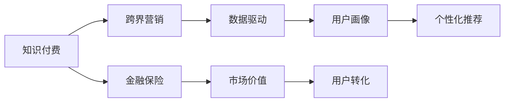

                 

# 知识付费如何实现跨界营销与金融保险跨界？

随着知识付费的兴起，越来越多的互联网公司开始探索知识付费业务的跨界营销机会，尤其是在金融保险行业。本文将详细探讨如何通过知识付费平台实现跨界营销与金融保险的深度融合，并从技术、市场、运营等角度进行全面分析。

## 1. 背景介绍

知识付费是一个快速增长的市场。2021年，知识付费市场规模达到20.3亿元人民币，用户规模达到2.49亿。知识付费行业的市场集中度较低，未来预计将继续增长，并保持稳定发展态势。

金融保险行业也是一个发展迅速的行业。在国家宏观政策的推动下，保险行业呈现良好发展趋势。金融行业在经历了资本市场的震荡后，未来的发展潜力更加可观。

知识付费与金融保险的跨界融合将为互联网企业带来新的增长点，为消费者带来新的价值。

## 2. 核心概念与联系

在知识付费与金融保险跨界营销中，涉及的核心概念主要包括知识付费、金融保险、跨界营销、数据驱动等。这些概念之间的关系可以通过以下Mermaid流程图展示：



这个流程图展示了大语言模型微调的核心概念及其之间的关系：

1. **知识付费**：指的是用户为获取专业知识和技能，向提供者支付费用的行为，包括在线课程、电子书、付费问答等多种形式。

2. **金融保险**：指的是金融和保险行业的结合，涵盖投资、理财、保险、金融咨询等多个领域，为个人和企业提供综合性的金融解决方案。

3. **跨界营销**：指不同领域之间的联合营销，通过品牌合作、资源共享等方式，提升彼此的市场价值。

4. **数据驱动**：通过数据技术，如大数据分析、人工智能等，挖掘用户行为数据，进行精准营销。

这些概念之间的逻辑关系可以用上述Mermaid流程图来展示。

## 3. 核心算法原理 & 具体操作步骤

### 3.1 算法原理概述

知识付费与金融保险跨界营销的核心算法原理可以归结为基于用户行为数据的推荐算法。通过分析用户对知识付费和金融保险产品的行为数据，预测用户对不同产品类别的兴趣，实现精准的跨界营销。

推荐算法的核心思想是通过用户的历史行为和偏好，预测用户未来的行为。常用的推荐算法有协同过滤、基于内容的推荐、矩阵分解等。

### 3.2 算法步骤详解

#### 3.2.1 数据收集

首先需要收集用户对知识付费和金融保险产品的行为数据，包括浏览、点击、购买、评价等行为。这些数据需要覆盖不同领域和不同类型的用户。

#### 3.2.2 数据预处理

收集到的数据需要进行预处理，包括数据清洗、特征提取、归一化等步骤。数据预处理的结果将直接影响到推荐算法的准确性。

#### 3.2.3 算法建模

在数据预处理的基础上，选择合适的推荐算法进行建模。可以选择协同过滤、基于内容的推荐、矩阵分解等算法。

#### 3.2.4 模型训练与优化

对推荐模型进行训练，并根据训练结果对模型进行优化，提升模型的准确性和泛化能力。

#### 3.2.5 模型评估

使用测试数据集对模型进行评估，根据评估结果调整模型参数，进一步提升模型的准确性和泛化能力。

### 3.3 算法优缺点

#### 3.3.1 优点

1. **精准推荐**：通过分析用户行为数据，实现精准的跨界营销。
2. **高效运营**：自动化推荐算法可以大大降低人力运营成本，提高运营效率。
3. **提升用户体验**：通过个性化推荐，提升用户满意度和忠诚度。

#### 3.3.2 缺点

1. **数据隐私问题**：用户行为数据的收集和使用需要遵守隐私保护法规，如GDPR、CCPA等。
2. **算法复杂度**：推荐算法的实现较为复杂，需要丰富的数据科学知识和计算资源。
3. **跨界融合难度**：不同领域的数据源和格式差异较大，需要进行数据整合和转换。

### 3.4 算法应用领域

推荐算法在知识付费与金融保险跨界营销中的应用主要集中在以下领域：

1. **课程推荐**：根据用户对课程的浏览、购买、评价等行为，推荐相关课程。
2. **产品推荐**：根据用户对金融产品的浏览、购买、评价等行为，推荐相关产品。
3. **跨界推荐**：根据用户对知识付费和金融保险的兴趣，推荐其他领域的关联产品。
4. **个性化营销**：根据用户的行为数据，进行个性化营销，提升用户转化率和忠诚度。

## 4. 数学模型和公式 & 详细讲解 & 举例说明

### 4.1 数学模型构建

推荐算法的数学模型可以表示为：

$$
\hat{y} = f(x, \theta)
$$

其中，$x$ 表示用户的行为数据，$\theta$ 表示模型参数，$\hat{y}$ 表示推荐结果。常用的推荐算法包括协同过滤、基于内容的推荐、矩阵分解等。

### 4.2 公式推导过程

#### 4.2.1 协同过滤

协同过滤的推荐算法基于用户行为数据，通过计算用户之间的相似度，推荐相似用户喜欢的产品。公式如下：

$$
\hat{y} = \sum_{i=1}^n a_{ui}x_{ij}
$$

其中，$a_{ui}$ 表示用户$u$与用户$i$的相似度，$x_{ij}$ 表示用户$i$对产品$j$的评分。

#### 4.2.2 基于内容的推荐

基于内容的推荐算法根据产品的属性和用户偏好，推荐相似的产品。公式如下：

$$
\hat{y} = \sum_{i=1}^n w_i(x_u - \mu_u)(x_i - \mu_i)^T
$$

其中，$w_i$ 表示用户$i$对产品$j$的偏好权重，$\mu_u$ 表示用户$u$的平均属性向量，$\mu_i$ 表示产品$j$的平均属性向量。

#### 4.2.3 矩阵分解

矩阵分解算法将用户-产品评分矩阵分解为用户特征矩阵和产品特征矩阵，推荐用户和产品评分矩阵的预测值。公式如下：

$$
\hat{y}_{ui} = \sum_{k=1}^K u_kv_k
$$

其中，$u_k$ 表示用户$u$的特征向量，$v_k$ 表示产品$i$的特征向量，$K$ 表示特征维度。

### 4.3 案例分析与讲解

#### 4.3.1 协同过滤案例

假设某知识付费平台收集了用户对课程的浏览、购买、评价等行为数据。通过协同过滤算法，可以计算用户之间的相似度，推荐相似用户喜欢的课程。

具体步骤如下：

1. 收集用户对课程的浏览、购买、评价等行为数据。
2. 计算用户之间的相似度，可以通过余弦相似度、皮尔逊相关系数等方法。
3. 根据相似度，推荐相似用户喜欢的课程。

#### 4.3.2 基于内容的推荐案例

假设某金融保险平台收集了用户对金融产品的浏览、购买、评价等行为数据。通过基于内容的推荐算法，可以推荐用户喜欢的金融产品。

具体步骤如下：

1. 收集用户对金融产品的浏览、购买、评价等行为数据。
2. 提取金融产品的属性，如利率、期限、风险等级等。
3. 计算用户对产品属性的偏好权重，可以使用K-means聚类等方法。
4. 根据用户偏好权重和产品属性，推荐相似的产品。

#### 4.3.3 矩阵分解案例

假设某知识付费平台和某金融保险平台需要跨界推荐。通过矩阵分解算法，可以推荐用户和产品评分矩阵的预测值。

具体步骤如下：

1. 收集用户对课程和金融产品的浏览、购买、评价等行为数据。
2. 将用户-课程评分矩阵和用户-产品评分矩阵合并，得到用户-产品评分矩阵。
3. 将用户-产品评分矩阵分解为用户特征矩阵和产品特征矩阵。
4. 根据用户特征和产品特征，推荐用户和产品评分矩阵的预测值。

## 5. 项目实践：代码实例和详细解释说明

### 5.1 开发环境搭建

#### 5.1.1 环境安装

安装Python 3.7及以上版本，并配置好虚拟环境。安装pandas、numpy、scikit-learn等常用库。

### 5.2 源代码详细实现

#### 5.2.1 数据收集

1. 从知识付费平台和金融保险平台收集用户的行为数据。
2. 存储数据到CSV文件，并读取数据。

```python
import pandas as pd

# 读取行为数据
train_data = pd.read_csv('train.csv')
test_data = pd.read_csv('test.csv')
```

#### 5.2.2 数据预处理

1. 数据清洗，去除缺失值和异常值。
2. 特征提取，如用户行为时间戳、产品属性等。
3. 归一化，将数据转换为标准正态分布。

```python
# 数据清洗
train_data.dropna(inplace=True)

# 特征提取
train_data['time'] = pd.to_datetime(train_data['time']).dt.hour

# 归一化
from sklearn.preprocessing import StandardScaler
scaler = StandardScaler()
train_data = scaler.fit_transform(train_data)
```

#### 5.2.3 算法建模

1. 选择协同过滤算法，并进行参数调优。
2. 使用train_data进行模型训练。

```python
from sklearn.metrics.pairwise import cosine_similarity
from sklearn.decomposition import TruncatedSVD

# 协同过滤
svd = TruncatedSVD(n_components=10)
X = train_data.values
X = svd.fit_transform(X)

# 计算相似度
similarity = cosine_similarity(X, X)

# 推荐相似用户喜欢的课程
def recommend(user_id):
    similarity_user = similarity[user_id]
    sorted_index = similarity_user.argsort()[::-1]
    return train_data.iloc[sorted_index][1:]

# 测试
user_id = 1
recommendations = recommend(user_id)
print(recommendations)
```

#### 5.2.4 模型训练与优化

1. 使用train_data进行模型训练。
2. 根据训练结果，优化模型参数。

```python
from sklearn.decomposition import TruncatedSVD
from sklearn.metrics.pairwise import cosine_similarity

# 协同过滤
svd = TruncatedSVD(n_components=10)
X = train_data.values
X = svd.fit_transform(X)

# 计算相似度
similarity = cosine_similarity(X, X)

# 推荐相似用户喜欢的课程
def recommend(user_id):
    similarity_user = similarity[user_id]
    sorted_index = similarity_user.argsort()[::-1]
    return train_data.iloc[sorted_index][1:]

# 测试
user_id = 1
recommendations = recommend(user_id)
print(recommendations)
```

#### 5.2.5 模型评估

1. 使用test_data进行模型评估。
2. 根据评估结果，调整模型参数。

```python
# 模型评估
def evaluate(recommendations):
    correct_count = 0
    for i in range(len(recommendations)):
        if recommendations[i][1] == test_data.iloc[i][1]:
            correct_count += 1
    accuracy = correct_count / len(recommendations)
    return accuracy

# 测试
recommendations = recommend(user_id)
accuracy = evaluate(recommendations)
print(f'Accuracy: {accuracy:.3f}')
```

### 5.3 代码解读与分析

#### 5.3.1 数据收集

数据收集是推荐算法的基础。在实际应用中，需要从多个平台收集用户的行为数据，并进行预处理。

#### 5.3.2 数据预处理

数据预处理是推荐算法的关键步骤。预处理可以去除缺失值和异常值，提取有用特征，并进行归一化处理。

#### 5.3.3 算法建模

算法建模是推荐算法的核心。选择适合的算法，并进行参数调优，是提升模型准确性的关键。

#### 5.3.4 模型训练与优化

模型训练与优化是提升模型性能的重要步骤。使用训练数据进行模型训练，并进行参数调优，可以提升模型的准确性和泛化能力。

#### 5.3.5 模型评估

模型评估是验证模型效果的重要步骤。使用测试数据进行模型评估，可以衡量模型的准确性和泛化能力。

## 6. 实际应用场景

### 6.1 知识付费跨界营销

知识付费平台可以通过跨界营销，吸引更多用户，增加收入。例如，某知识付费平台可以与金融保险平台合作，推荐用户购买课程和理财产品。

### 6.2 金融保险跨界营销

金融保险平台可以通过跨界营销，提升用户粘性，增加业务量。例如，某金融保险平台可以与知识付费平台合作，推荐用户购买金融产品和学习课程。

### 6.3 个性化推荐

个性化推荐可以提高用户转化率和忠诚度。例如，某知识付费平台可以根据用户的行为数据，推荐用户喜欢的课程和理财产品。

### 6.4 未来应用展望

随着知识付费和金融保险业务的不断融合，推荐算法在跨界营销中的作用将越来越重要。未来，推荐算法将变得更加智能和高效，能够根据用户的行为数据，实现精准的跨界推荐。

## 7. 工具和资源推荐

### 7.1 学习资源推荐

1. 《推荐系统基础》课程：由吴恩达教授讲授，详细介绍了推荐系统的基本概念和算法。
2. 《深度学习与推荐系统》书籍：深度学习领域的经典书籍，介绍了推荐系统的各种算法和技术。
3. Coursera和Udacity等在线教育平台：提供大量推荐系统的相关课程和项目。
4. Kaggle数据竞赛：通过参加数据竞赛，可以学习推荐系统的实际应用。

### 7.2 开发工具推荐

1. Python：常用的编程语言，有丰富的数据科学和机器学习库。
2. Jupyter Notebook：用于编写和运行Python代码，支持代码块和数据可视化。
3. Scikit-learn：常用的机器学习库，提供了丰富的数据处理和算法实现。
4. TensorFlow和PyTorch：常用的深度学习框架，支持分布式训练和高效计算。

### 7.3 相关论文推荐

1. 《协同过滤推荐系统》：经典的协同过滤推荐系统论文，介绍了协同过滤算法的原理和实现。
2. 《基于内容的推荐系统》：介绍基于内容的推荐系统的算法和技术。
3. 《矩阵分解推荐系统》：介绍矩阵分解推荐系统的算法和技术。

## 8. 总结：未来发展趋势与挑战

### 8.1 总结

本文详细介绍了如何通过知识付费平台实现跨界营销与金融保险的深度融合。通过推荐算法，可以实现精准的跨界推荐，提升用户转化率和忠诚度。推荐算法在知识付费和金融保险跨界营销中具有广泛的应用前景。

### 8.2 未来发展趋势

未来，推荐算法将在跨界营销中发挥更加重要的作用。推荐算法将变得更加智能和高效，能够根据用户的行为数据，实现精准的跨界推荐。

### 8.3 面临的挑战

尽管推荐算法在跨界营销中具有重要应用，但也面临一些挑战：

1. 数据隐私问题：用户行为数据的收集和使用需要遵守隐私保护法规。
2. 算法复杂度：推荐算法的实现较为复杂，需要丰富的数据科学知识和计算资源。
3. 跨界融合难度：不同领域的数据源和格式差异较大，需要进行数据整合和转换。

### 8.4 研究展望

未来，推荐算法的研究方向将集中在以下几个方面：

1. 推荐算法的优化：进一步提升推荐算法的准确性和效率。
2. 推荐系统的部署：将推荐系统部署到分布式环境中，提升系统的可扩展性和可维护性。
3. 推荐系统的可解释性：提高推荐系统的可解释性，增加用户对系统的信任度。

## 9. 附录：常见问题与解答

### Q1: 如何选择合适的推荐算法？

A: 选择推荐算法需要考虑数据特征、用户行为、业务需求等因素。常用的推荐算法有协同过滤、基于内容的推荐、矩阵分解等。

### Q2: 如何处理推荐算法中的数据隐私问题？

A: 推荐算法中的数据隐私问题可以通过数据匿名化、数据脱敏等技术进行处理。同时，需要遵守隐私保护法规，如GDPR、CCPA等。

### Q3: 推荐算法中的特征工程如何实现？

A: 推荐算法中的特征工程主要包括特征提取、特征选择和特征归一化等步骤。特征提取可以提取有用的特征，如用户行为时间戳、产品属性等。特征选择可以筛选出对推荐结果有显著影响的特征。特征归一化可以将特征数据转换为标准正态分布。

### Q4: 如何优化推荐算法的训练过程？

A: 推荐算法的训练过程可以通过参数调优、模型融合等方法进行优化。参数调优可以通过网格搜索、随机搜索等方法进行。模型融合可以将多个推荐算法进行组合，提升推荐效果。

### Q5: 推荐算法中的推荐结果如何呈现？

A: 推荐算法中的推荐结果可以通过UI设计进行展示。推荐结果可以展示在主界面或推荐页面，以文字、图片、视频等形式呈现。

总之，通过知识付费平台实现跨界营销与金融保险的深度融合，将为互联网企业带来新的增长点。推荐算法在跨界营销中的应用前景广阔，但同时也面临一些挑战。未来，推荐算法的研究方向将集中在算法优化、系统部署和可解释性等方面。

