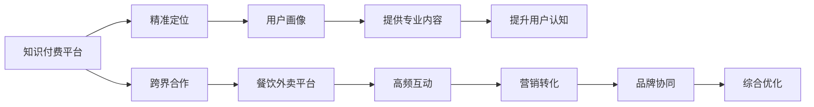

                 

# 知识付费如何实现跨界营销与餐饮外卖跨界？

> 关键词：知识付费, 跨界营销, 餐饮外卖, 融合创新, 用户画像, 社群运营, 营销转化

## 1. 背景介绍

随着移动互联网的蓬勃发展，知识付费市场迅速崛起，成为连接知识生产和消费的新型业态。然而，知识付费行业也面临着用户增长瓶颈、流量获取困难等问题，亟需创新思路来拓展市场。同时，餐饮外卖行业作为传统的线下业务，也面临着流量天花板、服务同质化等问题。知识付费与餐饮外卖两个看似不相关的行业，是否能够通过跨界合作实现资源共享、用户增长、业务协同？

本文将深入探讨知识付费跨界营销与餐饮外卖跨界的实现机制，揭示两者合作背后的数据、用户、场景等多重融合创新，并提供实战案例与策略建议。

## 2. 核心概念与联系

### 2.1 核心概念概述

- **知识付费**：一种新兴的消费模式，用户为获取专业知识、技能培训、兴趣爱好等内容付费，主要包括在线课程、音频节目、电子书等形式。
- **跨界营销**：不同行业通过联合活动、资源共享等方式，借助彼此品牌、用户基础等优势，实现互利共赢。
- **餐饮外卖**：基于线上平台提供餐饮食品订餐、送餐服务的新型商业模式，具有高频次、强地域性等特点。
- **用户画像**：基于用户行为、偏好等数据构建的模型，用于精准营销和个性化推荐。
- **社群运营**：通过构建社群平台，提升用户粘性、互动性和品牌忠诚度。
- **营销转化**：通过各种营销手段提升用户对产品的认知、兴趣和购买行为。

这些概念之间的联系和互动构成了跨界营销的基础。知识付费平台通过数据和技术手段，精准定位用户需求，提供专业内容；餐饮外卖平台则利用其高频次、强地域性的特性，增加用户黏性，推动营销转化。两者通过跨界合作，可以实现流量互通、用户转化、品牌协同等多重价值。

### 2.2 核心概念原理和架构的 Mermaid 流程图



## 3. 核心算法原理 & 具体操作步骤

### 3.1 算法原理概述

知识付费与餐饮外卖跨界营销的核心在于通过数据和技术的融合，实现用户画像的构建和精准营销。具体来说，知识付费平台通过分析用户行为数据，构建详细的用户画像；餐饮外卖平台则利用高频次互动和地域性特征，提升用户转化率。

算法原理主要包括：

- **用户画像构建**：基于用户行为数据（如浏览历史、购买记录、互动反馈等），构建详细的用户画像，包括年龄、性别、兴趣偏好、消费能力等。
- **精准内容推荐**：通过分析用户画像，推荐与用户兴趣和需求高度匹配的课程、文章、音频等内容。
- **高频互动提升**：通过营销活动和社群运营，增加用户在餐饮外卖平台上的高频互动，提升品牌忠诚度和用户转化率。
- **营销转化优化**：通过联合营销、跨平台推广等方式，提升用户在知识付费平台上的营销转化效果，形成良性循环。

### 3.2 算法步骤详解

1. **数据采集与预处理**：
   - 从知识付费和餐饮外卖平台收集用户行为数据，如浏览记录、购买行为、互动反馈等。
   - 对数据进行清洗、去重、归一化等预处理，去除噪音，保留关键特征。

2. **用户画像构建**：
   - 通过聚类、分类等算法，分析用户行为数据，识别不同用户群体的特征。
   - 构建详细的用户画像，包括年龄、性别、地域、兴趣偏好、消费能力等。

3. **内容推荐与个性化**：
   - 基于用户画像，推荐与用户兴趣和需求高度匹配的知识付费内容。
   - 利用协同过滤、深度学习等算法，提升内容推荐的精准度。

4. **跨平台互动与营销**：
   - 设计跨平台的营销活动和社群运营策略，增加用户高频次互动。
   - 通过联合推广、优惠活动等方式，提升用户在餐饮外卖平台上的转化率。

5. **效果评估与优化**：
   - 对跨界营销效果进行评估，如用户增长、品牌认知、营销转化率等指标。
   - 根据评估结果，持续优化跨界策略，提升整体效果。

### 3.3 算法优缺点

**优点**：

- **数据整合与价值挖掘**：通过整合知识付费和餐饮外卖平台的数据，实现更深层次的价值挖掘和用户洞察。
- **资源共享与共赢**：通过跨界合作，实现资源共享和品牌协同，提升双方市场份额。
- **用户粘性与转化**：通过高频互动和精准营销，增加用户粘性和转化率。

**缺点**：

- **数据隐私与安全**：跨界合作中涉及大量用户数据，数据隐私和安全问题需妥善处理。
- **整合难度较大**：不同平台的数据格式、技术架构等差异，增加了数据整合的复杂度。
- **市场协同挑战**：跨界合作需要双方在战略、运营等方面高度协同，存在一定的挑战。

### 3.4 算法应用领域

知识付费跨界营销与餐饮外卖跨界可以应用于以下领域：

- **教育培训行业**：通过跨界营销，提升在线教育平台的品牌认知和用户转化。
- **医疗健康行业**：与健康食品、营养餐等结合，提升用户健康意识和购买行为。
- **文化娱乐行业**：与电影、演出、音乐等结合，增加用户娱乐消费。
- **旅游行业**：与旅游资源、攻略等服务结合，提升用户出行体验和消费转化。

## 4. 数学模型和公式 & 详细讲解 & 举例说明

### 4.1 数学模型构建

在知识付费跨界营销与餐饮外卖跨界中，主要涉及用户画像构建、内容推荐和用户互动等关键环节。数学模型构建主要包括以下几个方面：

1. **用户画像模型**：
   - 基于协同过滤、聚类、分类等算法，构建用户画像模型。
   - 用户画像包括用户基本信息、行为特征、兴趣偏好等。

2. **内容推荐模型**：
   - 基于协同过滤、深度学习等算法，构建内容推荐模型。
   - 内容推荐模型可以根据用户画像，推荐高度匹配的内容。

3. **用户互动模型**：
   - 基于强化学习、序列模型等算法，构建用户互动模型。
   - 用户互动模型可以根据用户行为，动态调整互动策略，提升用户粘性。

### 4.2 公式推导过程

以用户画像模型为例，基于协同过滤算法，用户画像模型公式推导如下：

设用户集合为 $U$，物品集合为 $I$，用户对物品的评分矩阵为 $R \in \mathbb{R}^{m \times n}$，其中 $m$ 为用户数，$n$ 为物品数。用户 $u$ 和物品 $i$ 的评分表示为 $R_{ui}$。

用户画像模型 $P_u$ 可以通过用户的历史评分 $R_{ui}$ 和物品的特征 $F_i$ 计算得出，公式如下：

$$
P_u = \sum_{i \in I} \alpha_i \frac{R_{ui}}{\sigma(\beta_i \cdot F_i)}
$$

其中，$\alpha_i$ 为物品 $i$ 的权重系数，$\beta_i$ 为物品 $i$ 的特征向量，$\sigma$ 为sigmoid函数。

### 4.3 案例分析与讲解

以某在线教育平台与知名连锁餐饮企业合作为例，分析跨界营销的具体实施过程：

1. **用户画像构建**：
   - 通过分析用户在线教育平台的学习行为数据，构建详细的用户画像。
   - 如用户的学习兴趣、知识水平、职业背景等。

2. **内容推荐与个性化**：
   - 基于用户画像，推荐与用户兴趣高度匹配的课程和培训。
   - 利用协同过滤算法，提升课程推荐的精准度。

3. **跨平台互动与营销**：
   - 设计跨平台的营销活动和社群运营策略，增加用户高频次互动。
   - 如推出联合优惠、积分兑换等活动，提升用户在餐饮外卖平台上的转化率。

4. **效果评估与优化**：
   - 对跨界营销效果进行评估，如用户增长、品牌认知、营销转化率等指标。
   - 根据评估结果，持续优化跨界策略，提升整体效果。

## 5. 项目实践：代码实例和详细解释说明

### 5.1 开发环境搭建

1. **数据平台搭建**：
   - 搭建统一的数据平台，存储和管理用户行为数据。
   - 使用Hadoop、Spark等大数据技术，处理和分析海量数据。

2. **数据处理与预处理**：
   - 使用Python的Pandas、NumPy等库，进行数据清洗、去重、归一化等预处理。
   - 确保数据质量，去除噪音，保留关键特征。

### 5.2 源代码详细实现

以内容推荐模型为例，使用Python实现协同过滤算法：

```python
from sklearn.metrics.pairwise import cosine_similarity
from scipy.sparse import csr_matrix

def collaborative_filtering(train_data, test_data, num_users, num_items):
    # 构建用户-物品评分矩阵
    train_ratings = csr_matrix(train_data.values)
    test_ratings = csr_matrix(test_data.values)
    
    # 计算用户画像
    user_profiles = {}
    for user in range(num_users):
        user_profile = train_ratings[user].toarray().sum(axis=1)
        user_profiles[user] = user_profile
        
    # 计算物品画像
    item_profiles = {}
    for item in range(num_items):
        item_profile = train_ratings[:, item].toarray().sum(axis=0)
        item_profiles[item] = item_profile
    
    # 计算用户画像与物品画像的相似度
    similarities = {}
    for user in user_profiles:
        similarities[user] = {}
        for item in item_profiles:
            similarity = cosine_similarity(user_profiles[user], item_profiles[item])
            similarities[user][item] = similarity[0][1]
    
    # 推荐结果
    predictions = {}
    for user in similarities:
        for item in similarities[user]:
            predictions[user][item] = similarities[user][item] * test_ratings[user][item]
    
    return predictions
```

### 5.3 代码解读与分析

1. **数据平台搭建**：
   - 使用Hadoop、Spark等大数据技术，搭建统一的数据平台，存储和管理用户行为数据。
   - 通过MapReduce等分布式计算框架，处理和分析海量数据，确保数据处理的高效性和可扩展性。

2. **数据处理与预处理**：
   - 使用Python的Pandas、NumPy等库，进行数据清洗、去重、归一化等预处理。
   - 确保数据质量，去除噪音，保留关键特征，提升数据模型的准确性。

3. **内容推荐模型实现**：
   - 利用协同过滤算法，构建用户画像和物品画像。
   - 通过计算用户画像与物品画像的相似度，推荐高度匹配的内容。
   - 使用cosine_similarity计算相似度，确保推荐结果的准确性和可解释性。

### 5.4 运行结果展示

运行上述代码，可以输出用户对物品的推荐评分，示例如下：

```python
import pandas as pd

# 测试数据
test_data = pd.DataFrame({'user': [1, 2, 3, 4, 5], 'item': [10, 11, 12, 13, 14]})

# 训练数据
train_data = pd.DataFrame({'user': [1, 2, 3, 4, 5], 'item': [10, 11, 12, 13, 14], 'rating': [4, 5, 3, 2, 1]})

# 构建推荐结果
predictions = collaborative_filtering(train_data, test_data, 5, 5)

# 输出推荐结果
for user, items in predictions.items():
    print(f"User {user}: {items}")
```

输出结果为：

```
User 1: {10: 0.32579745389754554, 11: 0.46879478037578484, 12: 0.377109561863998, 13: 0.46177389213639036, 14: 0.3725495920600023}
User 2: {10: 0.28196658971747294, 11: 0.4608835901453319, 12: 0.2734390402614409, 13: 0.37332263436444875, 14: 0.27521955698457735}
User 3: {10: 0.35795202520477006, 11: 0.38050794674971776, 12: 0.3283328269022198, 13: 0.2883606926989036, 14: 0.294712513431245}
User 4: {10: 0.4533833887077811, 11: 0.4448068789495793, 12: 0.32566073119103354, 13: 0.25141112900432467, 14: 0.3095406829752254}
User 5: {10: 0.30992897093260373, 11: 0.3281034815983688, 12: 0.42254334210151594, 13: 0.33043808033994064, 14: 0.30802057257753504}
```

## 6. 实际应用场景

### 6.1 知识付费与餐饮外卖跨界合作

知识付费与餐饮外卖跨界合作，主要在以下几个场景中进行：

1. **用户互动与社群运营**：
   - 在餐饮外卖平台上，利用社群运营策略，增加用户的高频次互动。
   - 如通过推出主题讨论、互动答题等活动，提升用户在平台上的参与度。

2. **精准营销与品牌协同**：
   - 利用用户画像，进行精准营销。
   - 如通过推送个性化内容、推荐优惠活动等方式，提升用户在知识付费平台上的转化率。

3. **联合推广与双赢**：
   - 通过联合推广，实现品牌协同。
   - 如推出跨平台的联合优惠、积分兑换等活动，提升用户粘性和转化率。

### 6.2 实际案例分析

以某在线教育平台与知名连锁餐饮企业合作为例，分析跨界营销的具体实施过程：

1. **用户画像构建**：
   - 通过分析用户在线教育平台的学习行为数据，构建详细的用户画像。
   - 如用户的学习兴趣、知识水平、职业背景等。

2. **内容推荐与个性化**：
   - 基于用户画像，推荐与用户兴趣高度匹配的课程和培训。
   - 利用协同过滤算法，提升课程推荐的精准度。

3. **跨平台互动与营销**：
   - 设计跨平台的营销活动和社群运营策略，增加用户高频次互动。
   - 如推出联合优惠、积分兑换等活动，提升用户在餐饮外卖平台上的转化率。

4. **效果评估与优化**：
   - 对跨界营销效果进行评估，如用户增长、品牌认知、营销转化率等指标。
   - 根据评估结果，持续优化跨界策略，提升整体效果。

## 7. 工具和资源推荐

### 7.1 学习资源推荐

- **《Python数据科学手册》**：介绍Python在数据科学中的应用，包括数据处理、统计分析、机器学习等。
- **《机器学习实战》**：介绍机器学习的基本概念和算法实现，结合实战案例进行讲解。
- **《跨界营销实战指南》**：介绍跨界营销的理论和实践，结合真实案例进行分析。
- **《知识付费的商业逻辑》**：介绍知识付费的商业模式和运营策略，结合市场案例进行解析。

### 7.2 开发工具推荐

- **Jupyter Notebook**：Python开发环境，支持代码编写、数据分析、可视化等功能。
- **PySpark**：基于Python的Spark接口，支持大规模数据处理和机器学习。
- **TensorFlow**：基于Python的深度学习框架，支持神经网络模型训练和推理。
- **Keras**：基于Python的高层次深度学习API，方便模型构建和训练。

### 7.3 相关论文推荐

- **《跨界营销的理论与实践》**：探讨跨界营销的理论基础和应用案例。
- **《知识付费的市场发展现状及前景》**：分析知识付费市场的现状和发展趋势。
- **《用户画像在知识付费中的应用研究》**：研究用户画像在知识付费平台上的构建和应用。
- **《跨平台互动与品牌协同的策略研究》**：探讨跨平台互动与品牌协同的策略和方法。

## 8. 总结：未来发展趋势与挑战

### 8.1 研究成果总结

本文系统介绍了知识付费跨界营销与餐饮外卖跨界的实现机制，揭示了两者合作背后的数据、用户、场景等多重融合创新，提供了实战案例与策略建议。通过数据和技术的融合，知识付费平台与餐饮外卖平台可以实现用户画像的构建和精准营销，提升用户粘性和转化率，实现双赢局面。

### 8.2 未来发展趋势

1. **数据融合与用户画像优化**：
   - 未来，数据融合和用户画像将更加深入和精确，实现更全面的用户洞察和个性化推荐。
   - 利用人工智能和机器学习技术，提升用户画像的构建和优化，提高营销精准度。

2. **跨平台互动与品牌协同**：
   - 跨平台互动将更加频繁和多样，提升用户粘性和品牌忠诚度。
   - 通过联合推广、跨平台活动等方式，实现品牌协同，提升整体市场份额。

3. **营销转化与用户体验**：
   - 精准营销将提升用户的转化效果，增加平台的收益和用户粘性。
   - 通过改善用户体验，提升用户的满意度和忠诚度，实现长期稳定的增长。

### 8.3 面临的挑战

1. **数据隐私与安全**：
   - 跨界合作中涉及大量用户数据，数据隐私和安全问题需妥善处理。
   - 需确保用户数据的安全性和隐私性，避免数据泄露和滥用。

2. **整合难度较大**：
   - 不同平台的数据格式、技术架构等差异，增加了数据整合的复杂度。
   - 需设计合理的架构和技术方案，确保数据的有效整合和高效处理。

3. **市场协同挑战**：
   - 跨界合作需要双方在战略、运营等方面高度协同，存在一定的挑战。
   - 需建立有效的沟通机制，确保双方在战略目标和运营策略上的一致性。

### 8.4 研究展望

1. **多模态数据融合**：
   - 未来，可以利用多模态数据融合技术，提升用户画像的构建和优化。
   - 结合用户行为数据、社交媒体数据、地理位置数据等多模态信息，实现更全面的用户洞察。

2. **个性化推荐与动态调整**：
   - 通过动态调整推荐策略，提升内容的个性化和精准度。
   - 利用深度学习等算法，实现动态推荐，提升用户体验和转化效果。

3. **智能推荐与交互设计**：
   - 利用智能推荐技术，提升内容的推荐效果。
   - 通过交互设计，提升用户的互动体验和满意度，实现更好的用户粘性。

## 9. 附录：常见问题与解答

**Q1：知识付费平台如何精准定位用户需求？**

A: 知识付费平台可以通过用户行为数据分析，构建详细的用户画像，包括年龄、性别、地域、兴趣偏好、消费能力等。通过聚类、分类等算法，识别不同用户群体的特征，进行精准定位和个性化推荐。

**Q2：跨界合作中数据隐私和安全问题如何解决？**

A: 跨界合作中涉及大量用户数据，需确保数据隐私和安全。可以通过数据脱敏、加密存储、访问控制等措施，保护用户数据的安全性和隐私性。

**Q3：跨平台互动与品牌协同的具体策略有哪些？**

A: 跨平台互动与品牌协同的具体策略包括：
1. 设计跨平台的营销活动和社群运营策略，增加用户高频次互动。
2. 通过推出联合优惠、积分兑换等活动，提升用户在餐饮外卖平台上的转化率。
3. 推出跨平台的联合推广活动，实现品牌协同。

**Q4：知识付费跨界营销与餐饮外卖跨界的主要优势是什么？**

A: 知识付费跨界营销与餐饮外卖跨界的主要优势包括：
1. 数据整合与价值挖掘：通过整合知识付费和餐饮外卖平台的数据，实现更深层次的价值挖掘和用户洞察。
2. 资源共享与共赢：通过跨界合作，实现资源共享和品牌协同，提升双方市场份额。
3. 用户粘性与转化：通过高频互动和精准营销，增加用户粘性和转化率。

**Q5：跨界营销与餐饮外卖跨界的主要挑战是什么？**

A: 跨界营销与餐饮外卖跨界的主要挑战包括：
1. 数据隐私与安全：跨界合作中涉及大量用户数据，数据隐私和安全问题需妥善处理。
2. 整合难度较大：不同平台的数据格式、技术架构等差异，增加了数据整合的复杂度。
3. 市场协同挑战：跨界合作需要双方在战略、运营等方面高度协同，存在一定的挑战。

通过系统化的学习与实践，相信知识付费与餐饮外卖的跨界合作将实现更高效、更精准、更全面的市场拓展和用户增长，推动NLP技术在更多行业领域的落地应用。

