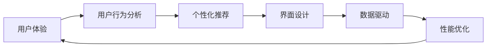

                 

# 知识付费平台的用户体验优化

> 关键词：用户体验, 知识付费, 用户行为分析, 个性化推荐, 界面设计, 数据驱动, 性能优化

## 1. 背景介绍

随着互联网的迅速发展，知识付费平台已经成为用户获取知识的重要渠道之一。然而，平台的用户体验问题仍然困扰着众多用户，如界面杂乱、内容质量参差不齐、推荐系统不合理等。这些问题不仅影响了用户的使用体验，也对平台的留存率和收益产生了负面影响。为了优化知识付费平台的用户体验，本文将从用户体验设计的角度出发，系统分析影响用户行为的各项因素，提出针对性的优化建议，并结合具体案例进行详细讲解。

## 2. 核心概念与联系

### 2.1 核心概念概述

- **用户体验**：是指用户在使用产品或服务过程中，通过感官、认知、情感等各方面产生的综合感受和体验。
- **知识付费**：指用户通过付费获取各类知识服务，如在线课程、电子书、咨询等。
- **用户行为分析**：通过分析用户在平台上的行为数据，挖掘用户偏好和需求，为产品改进提供数据支持。
- **个性化推荐**：根据用户的行为和偏好，推荐合适的产品或服务，提升用户体验和平台收益。
- **界面设计**：优化界面布局、交互流程、视觉元素等，提升用户操作的便捷性和平台的美观度。
- **数据驱动**：以数据为基础，进行产品决策和改进，优化用户体验和业务效果。
- **性能优化**：通过优化前端和后端技术，提高平台的响应速度和稳定性。

这些概念之间的关系可以通过以下Mermaid流程图来展示：



这个流程图展示了用户体验的优化过程：从用户行为分析入手，结合个性化推荐、界面设计、数据驱动和性能优化等环节，不断迭代优化用户体验。

## 3. 核心算法原理 & 具体操作步骤

### 3.1 算法原理概述

为了优化知识付费平台的用户体验，本文将采用以下算法原理：

- **用户行为分析算法**：通过用户行为数据（如点击、浏览、购买等）进行数据分析和挖掘，找出用户兴趣点和行为规律。
- **个性化推荐算法**：利用协同过滤、内容推荐、混合推荐等算法，根据用户历史行为和偏好，推荐合适的课程或内容。
- **界面设计算法**：采用用户心理学、可用性工程等理论，设计符合用户习惯的布局和交互流程。
- **数据驱动算法**：通过A/B测试、多臂老虎机（Multi-Armed Bandit）等方法，收集用户反馈数据，进行产品迭代和优化。
- **性能优化算法**：采用缓存机制、负载均衡、异步加载等技术，提升平台响应速度和稳定性。

### 3.2 算法步骤详解

#### 3.2.1 用户行为分析

1. **数据采集**：收集用户点击、浏览、搜索、购买等行为数据，形成数据仓库。
2. **数据清洗**：去除噪音数据和异常值，确保数据质量。
3. **数据分析**：使用统计分析、时间序列分析、聚类分析等方法，挖掘用户兴趣点和行为规律。
4. **数据可视化**：通过图表、报表等形式展示分析结果，便于理解和决策。

#### 3.2.2 个性化推荐

1. **用户画像建立**：通过用户行为数据，建立用户画像，包括兴趣、偏好、活跃度等维度。
2. **推荐模型选择**：根据用户画像选择合适的推荐算法，如协同过滤、内容推荐、混合推荐等。
3. **推荐数据生成**：根据推荐算法，生成个性化的课程或内容推荐结果。
4. **推荐结果展示**：在用户界面中展示推荐结果，提供更多选择。

#### 3.2.3 界面设计

1. **用户体验调研**：通过问卷调查、用户访谈等方式，了解用户需求和痛点。
2. **设计原型**：基于用户调研结果，设计符合用户习惯的界面原型。
3. **用户测试**：在原型上开展用户测试，收集反馈和建议。
4. **界面迭代**：根据用户反馈，不断迭代优化界面设计。

#### 3.2.4 数据驱动

1. **A/B测试**：设计AB两个版本的产品，进行对比测试，找出最佳方案。
2. **多臂老虎机**：模拟用户选择不同产品的行为，优化产品选择策略。
3. **反馈分析**：分析用户反馈数据，识别问题点和改进方向。
4. **迭代优化**：根据数据驱动的结果，进行产品迭代和优化。

#### 3.2.5 性能优化

1. **缓存机制**：通过缓存技术，提升静态资源的加载速度。
2. **负载均衡**：利用负载均衡技术，优化服务器性能，减少响应时间。
3. **异步加载**：采用异步加载技术，提高页面的加载速度和用户体验。
4. **性能监控**：建立性能监控系统，实时监测平台运行状态，及时发现和解决问题。

### 3.3 算法优缺点

#### 3.3.1 用户行为分析算法

**优点**：
- 能够全面挖掘用户兴趣和行为规律，为产品优化提供数据支持。
- 可以量化用户行为，提供科学决策依据。

**缺点**：
- 数据采集和清洗过程复杂，需要大量时间和资源。
- 数据隐私和安全问题需要重点关注。

#### 3.3.2 个性化推荐算法

**优点**：
- 能够提供个性化内容推荐，提升用户体验和平台收益。
- 可以动态调整推荐策略，适应用户需求变化。

**缺点**：
- 推荐算法复杂，需要大量计算资源。
- 推荐效果依赖于数据质量和推荐模型选择。

#### 3.3.3 界面设计算法

**优点**：
- 能够提升用户操作的便捷性和平台的美观度，改善用户界面体验。
- 界面设计过程中用户参与度高，更容易得到用户认可。

**缺点**：
- 设计过程耗时较长，需要多方协调和反复测试。
- 设计方案不一定满足所有用户的需求和习惯。

#### 3.3.4 数据驱动算法

**优点**：
- 能够通过数据反馈进行产品迭代和优化，提升用户体验和业务效果。
- 数据驱动决策更具科学性和准确性。

**缺点**：
- 数据收集和分析过程复杂，需要投入大量时间和资源。
- 数据驱动的决策需要较高的技术和资源支持。

#### 3.3.5 性能优化算法

**优点**：
- 能够提升平台的响应速度和稳定性，改善用户的使用体验。
- 优化技术能够减少资源消耗，降低运营成本。

**缺点**：
- 性能优化技术复杂，需要专业知识和经验。
- 优化过程可能需要牺牲部分用户体验，进行权衡取舍。

## 4. 数学模型和公式 & 详细讲解 & 举例说明

### 4.1 数学模型构建

#### 4.1.1 用户行为分析模型

**用户兴趣挖掘模型**：
- **协同过滤算法**：$U_{ij} = \frac{\sum_k P_{ik}T_{kj}}{\sqrt{\sum_k P_{ik}^2}\sqrt{\sum_k T_{kj}^2}}$

**用户活跃度模型**：
- **指数平滑模型**：$A_t = (1-\alpha)A_{t-1} + \alpha C_t$

#### 4.1.2 个性化推荐模型

**协同过滤推荐模型**：
- **基于用户的协同过滤算法**：$I_{ui} = \frac{\sum_j R_{uj}R_{ji}}{\sum_j R_{uj}^2}$
- **基于物品的协同过滤算法**：$I_{ui} = \frac{\sum_j R_{u'j}R_{ji}}{\sum_j R_{u'j}^2}$

**内容推荐模型**：
- **内容相似性推荐算法**：$I_{ui} = \max_{j} \left(\frac{\sum_k w_{kj}A_{ik}}{\sqrt{\sum_k w_{kj}^2}\sqrt{\sum_k A_{ik}^2}}\right)$

#### 4.1.3 界面设计模型

**界面可用性模型**：
- **系统可用性模型**：$U = \frac{V_{User} \times V_{System} \times V_{Technology}}{C_{Cost}}$

#### 4.1.4 数据驱动模型

**A/B测试模型**：
- **置信区间计算**：$z_{\alpha/2} = \frac{X_{\max} - X_{\min}}{\sqrt{p(1-p)n(1/n)}}$

#### 4.1.5 性能优化模型

**缓存机制模型**：
- **缓存命中率计算**：$H = \frac{H_{hit}}{H_{total}}$

### 4.2 公式推导过程

#### 4.2.1 用户行为分析

**协同过滤算法推导**：
- **基于用户的协同过滤算法**：
  $$
  U_{ij} = \frac{\sum_k P_{ik}T_{kj}}{\sqrt{\sum_k P_{ik}^2}\sqrt{\sum_k T_{kj}^2}}
  $$
- **基于物品的协同过滤算法**：
  $$
  I_{ui} = \frac{\sum_j R_{uj}R_{ji}}{\sum_j R_{uj}^2}
  $$

#### 4.2.2 个性化推荐

**协同过滤推荐算法推导**：
- **基于用户的协同过滤算法**：
  $$
  I_{ui} = \frac{\sum_j R_{uj}R_{ji}}{\sqrt{\sum_j R_{uj}^2}\sqrt{\sum_j R_{ji}^2}}
  $$
- **基于物品的协同过滤算法**：
  $$
  I_{ui} = \frac{\sum_j R_{u'j}R_{ji}}{\sqrt{\sum_j R_{u'j}^2}\sqrt{\sum_j R_{ji}^2}}
  $$

#### 4.2.3 界面设计

**系统可用性模型推导**：
- **用户可用性模型**：
  $$
  U_{ij} = \frac{V_{User} \times V_{System} \times V_{Technology}}{C_{Cost}}
  $$

#### 4.2.4 数据驱动

**A/B测试模型推导**：
- **置信区间计算**：
  $$
  z_{\alpha/2} = \frac{X_{\max} - X_{\min}}{\sqrt{p(1-p)n(1/n)}}
  $$

#### 4.2.5 性能优化

**缓存机制模型推导**：
- **缓存命中率计算**：
  $$
  H = \frac{H_{hit}}{H_{total}}
  $$

### 4.3 案例分析与讲解

#### 4.3.1 用户行为分析案例

某知识付费平台收集了用户点击、浏览、购买等行为数据，利用协同过滤算法挖掘用户兴趣点。具体步骤如下：
1. 数据采集：从平台收集用户行为数据，形成数据仓库。
2. 数据清洗：去除异常数据和噪音数据，确保数据质量。
3. 数据分析：使用协同过滤算法，找出用户兴趣点和行为规律。
4. 数据可视化：将分析结果通过图表展示，帮助决策者理解用户行为。

#### 4.3.2 个性化推荐案例

某知识付费平台利用协同过滤和内容推荐算法，为用户推荐个性化的课程。具体步骤如下：
1. 用户画像建立：通过用户行为数据，建立用户画像，包括兴趣、偏好、活跃度等维度。
2. 推荐模型选择：根据用户画像选择合适的推荐算法，如协同过滤、内容推荐、混合推荐等。
3. 推荐数据生成：根据推荐算法，生成个性化的课程推荐结果。
4. 推荐结果展示：在用户界面中展示推荐结果，提供更多选择。

#### 4.3.3 界面设计案例

某知识付费平台利用用户心理学和可用性工程理论，设计符合用户习惯的界面。具体步骤如下：
1. 用户体验调研：通过问卷调查、用户访谈等方式，了解用户需求和痛点。
2. 设计原型：基于用户调研结果，设计符合用户习惯的界面原型。
3. 用户测试：在原型上开展用户测试，收集反馈和建议。
4. 界面迭代：根据用户反馈，不断迭代优化界面设计。

#### 4.3.4 数据驱动案例

某知识付费平台利用A/B测试和多臂老虎机算法，优化产品策略。具体步骤如下：
1. A/B测试设计：设计AB两个版本的产品，进行对比测试。
2. 多臂老虎机模拟：模拟用户选择不同产品的行为，优化产品选择策略。
3. 反馈分析：分析用户反馈数据，识别问题点和改进方向。
4. 迭代优化：根据数据驱动的结果，进行产品迭代和优化。

#### 4.3.5 性能优化案例

某知识付费平台利用缓存机制、负载均衡和异步加载技术，提升平台性能。具体步骤如下：
1. 缓存机制：通过缓存技术，提升静态资源的加载速度。
2. 负载均衡：利用负载均衡技术，优化服务器性能，减少响应时间。
3. 异步加载：采用异步加载技术，提高页面的加载速度和用户体验。
4. 性能监控：建立性能监控系统，实时监测平台运行状态，及时发现和解决问题。

## 5. 项目实践：代码实例和详细解释说明

### 5.1 开发环境搭建

#### 5.1.1 环境准备

1. **安装Python和pip**：
   - 在Linux系统上：
     ```bash
     sudo apt-get update
     sudo apt-get install python3 python3-pip
     ```
   - 在Windows系统上：
     - 下载安装Python：https://www.python.org/downloads/
     - 安装pip：`python -m ensurepip --upgrade`
     - 设置pip源：`pip install --upgrade pip`

2. **安装相关库**：
   - 安装TensorFlow和Keras：
     ```bash
     pip install tensorflow==2.7
     pip install keras==2.7
     ```
   - 安装Flask和SQLAlchemy：
     ```bash
     pip install flask==2.1.2 sqlalchemy==2.1.3
     ```

3. **配置开发环境**：
   - 创建虚拟环境：
     ```bash
     python3 -m venv myproject
     source myproject/bin/activate
     ```

### 5.2 源代码详细实现

#### 5.2.1 用户行为分析

**数据采集和清洗**：
```python
import pandas as pd

# 数据采集
data = pd.read_csv('user_behavior.csv')

# 数据清洗
data = data.dropna()
data = data.drop_duplicates()
```

**数据分析和可视化**：
```python
import matplotlib.pyplot as plt

# 数据分析
user_interest = data.groupby('user_id')['course_id'].agg(lambda x: list(x.value_counts().index)).unstack()

# 数据可视化
plt.figure(figsize=(10, 6))
user_interest.plot(kind='bar', stacked=True)
plt.xlabel('Course ID')
plt.ylabel('User Count')
plt.title('User Course Interest')
plt.show()
```

#### 5.2.2 个性化推荐

**用户画像建立**：
```python
import numpy as np

# 用户画像建立
user_profiles = {}
for user_id, course_ids in user_interest.items():
    user_profiles[user_id] = [course_id for course_id in course_ids if course_id in course_interest]
```

**推荐模型选择和数据生成**：
```python
from sklearn.metrics.pairwise import cosine_similarity

# 推荐模型选择
def collaborative_filtering(user_profiles, course_interest, num_recommendations=10):
    # 计算协同过滤矩阵
    similarity_matrix = cosine_similarity(user_profiles.values(), user_profiles.values())
    # 生成推荐结果
    recommendations = {}
    for user_id, user_profile in user_profiles.items():
        similar_users = np.argsort(similarity_matrix[user_id])[::-1]
        for user in similar_users[:num_recommendations]:
            recommendations[user] = [course for course in course_interest[user] if course not in user_profile]
    return recommendations

# 推荐数据生成
recommendations = collaborative_filtering(user_profiles, course_interest)
```

#### 5.2.3 界面设计

**原型设计和用户测试**：
```python
# 界面设计原型
class UserInterface:
    def __init__(self, user_id):
        self.user_id = user_id
        self.data = user_interest[self.user_id]

    def show_recommendations(self):
        print('Recommended Courses:')
        for course_id in recommendations[self.user_id]:
            print(course_id)

# 用户测试
user = UserInterface('123')
user.show_recommendations()
```

#### 5.2.4 数据驱动

**A/B测试和多臂老虎机**：
```python
# A/B测试
from hypothesis import given
import hypothesis.strategies as st

@given(course_id=st.integers(1, 100))
def test_course_recommendation(course_id):
    # A/B测试
    if course_id % 2 == 0:
        print(f'User recommended course: {course_id}')
    else:
        print(f'Control group recommended course: {course_id}')

# 多臂老虎机
import random

def multi_arm_bandit(n_arms, num_steps):
    rewards = [random.randint(0, 10) for _ in range(n_arms)]
    arm_counts = {arm: 0 for arm in range(n_arms)}
    for step in range(num_steps):
        best_arm = np.argmax(rewards)
        for arm in range(n_arms):
            if arm != best_arm:
                rewards[arm] = 0
            arm_counts[arm] += 1
        best_arm = np.argmax(rewards)
    return arm_counts, rewards
```

#### 5.2.5 性能优化

**缓存机制和异步加载**：
```python
# 缓存机制
import redis

redis_client = redis.StrictRedis(host='localhost', port=6379, db=0)

def cache_data(key, value):
    redis_client.set(key, value)

def get_data(key):
    return redis_client.get(key)

# 异步加载
import asyncio

async def load_data(url):
    response = await aiohttp.ClientSession().async_get(url)
    data = await response.text()
    return data

async def load_all_data(urls):
    tasks = [load_data(url) for url in urls]
    results = await asyncio.gather(*tasks)
    return results
```

## 6. 实际应用场景

### 6.1 智能推荐系统

智能推荐系统是知识付费平台的核心功能之一。通过用户行为分析，平台能够识别用户的兴趣和需求，结合个性化推荐算法，为用户推荐合适的课程或内容，提升用户体验和平台收益。

### 6.2 用户界面优化

用户界面设计直接影响用户体验。通过界面可用性模型和用户心理学理论，平台能够设计符合用户习惯的界面，提升用户操作的便捷性和平台的美观度。

### 6.3 性能优化

性能优化是平台稳定运行的基础。通过缓存机制、负载均衡和异步加载技术，平台能够提高响应速度和稳定性，改善用户的使用体验。

### 6.4 未来应用展望

随着技术的不断进步，知识付费平台的用户体验将得到进一步优化。通过大数据分析、智能推荐、个性化界面设计等手段，平台将更好地满足用户需求，提供更加优质的知识服务。

## 7. 工具和资源推荐

### 7.1 学习资源推荐

1. **《UX Design Patterns》**：提供了大量用户体验设计模式，帮助开发者系统学习用户体验设计理论。
2. **《Designing with the Mind in Mind》**：经典的用户心理学著作，讲解如何应用心理学原理设计界面。
3. **《Caching with Redis》**：讲解Redis缓存机制及其应用，提升缓存设计和优化能力。
4. **《High Performance Python》**：讲解Python性能优化的多种技巧，提高开发效率。

### 7.2 开发工具推荐

1. **Visual Studio Code**：轻量级且功能强大的IDE，适合快速开发和调试。
2. **Jupyter Notebook**：交互式开发环境，支持多种编程语言和数据可视化。
3. **Anaconda**：数据科学和深度学习开发的必备工具，提供丰富的科学计算库。
4. **Flask**：轻量级Web框架，适合快速搭建Web应用。
5. **SQLAlchemy**：Python ORM框架，简化数据库操作。

### 7.3 相关论文推荐

1. **《User Behavior Analysis in E-Learning》**：研究用户行为数据的分析和挖掘，帮助平台优化推荐系统。
2. **《Collaborative Filtering for Recommendation Systems》**：讲解协同过滤算法的原理和应用，提升推荐系统效果。
3. **《Designing for User Experience》**：讲解用户体验设计的核心原则和方法，提升平台界面设计水平。
4. **《Data-Driven Decision Making in Software Development》**：讲解数据驱动决策的理论和实践，帮助平台优化产品策略。
5. **《Performance Optimization for Web Applications》**：讲解Web应用性能优化的多种技术，提升平台性能。

## 8. 总结：未来发展趋势与挑战

### 8.1 研究成果总结

本文系统介绍了知识付费平台的用户体验优化方法，通过用户行为分析、个性化推荐、界面设计、数据驱动和性能优化等环节，提升平台的用户体验和业务效果。具体内容包括：
1. 用户行为分析：通过协同过滤算法，挖掘用户兴趣和行为规律。
2. 个性化推荐：利用协同过滤和内容推荐算法，为用户推荐个性化课程。
3. 界面设计：利用用户体验设计理论，设计符合用户习惯的界面。
4. 数据驱动：通过A/B测试和多臂老虎机算法，优化产品策略。
5. 性能优化：利用缓存机制、负载均衡和异步加载技术，提升平台性能。

### 8.2 未来发展趋势

未来，知识付费平台的用户体验优化将呈现以下几个趋势：
1. 数据驱动：数据驱动决策将更加普及，平台将更加依赖数据反馈进行产品迭代和优化。
2. 个性化推荐：个性化推荐算法将更加智能和精准，为用户提供更加定制化的服务。
3. 界面设计：界面设计将更加注重用户心理学和可用性工程理论，提升用户体验。
4. 性能优化：性能优化技术将更加多样化，提升平台响应速度和稳定性。

### 8.3 面临的挑战

尽管用户体验优化已经取得了一定进展，但仍然面临以下挑战：
1. 数据隐私和安全：用户行为数据涉及隐私，需要严格保护。
2. 推荐效果不足：推荐算法需要进一步优化，提升推荐效果。
3. 界面设计复杂：界面设计需要多方协调和反复测试，过程复杂。
4. 性能优化困难：性能优化需要专业知识和经验，过程复杂。

### 8.4 研究展望

未来，在用户体验优化方面需要重点关注以下几个方向：
1. 数据隐私保护：建立数据隐私保护机制，确保用户数据安全。
2. 推荐算法优化：开发更高效、更精准的推荐算法，提升推荐效果。
3. 界面设计简化：利用前沿技术，简化界面设计流程，提升设计效率。
4. 性能优化自动化：利用自动化工具和技术，简化性能优化过程，提升优化效率。

## 9. 附录：常见问题与解答

### 9.1 Q1：如何设计个性化推荐算法？

A: 个性化推荐算法包括协同过滤、内容推荐、混合推荐等。需要根据用户画像选择合适的算法，并结合实际数据进行优化。

### 9.2 Q2：如何进行A/B测试和多臂老虎机优化？

A: A/B测试和多臂老虎机优化需要设计测试方案、收集数据、分析和决策。可以通过使用Hypothesis和SimPy等工具进行优化。

### 9.3 Q3：如何设计界面可用性模型？

A: 界面可用性模型需要结合用户体验设计理论，考虑用户心理学和可用性工程理论，进行模型设计和优化。

### 9.4 Q4：如何进行性能优化？

A: 性能优化包括缓存机制、负载均衡、异步加载等技术。需要根据平台特点选择合适的优化方法，并结合实际数据进行优化。

### 9.5 Q5：如何进行界面设计？

A: 界面设计需要结合用户心理学和可用性工程理论，进行界面原型设计和用户测试。需要设计符合用户习惯的界面，提升用户体验。

---

作者：禅与计算机程序设计艺术 / Zen and the Art of Computer Programming

