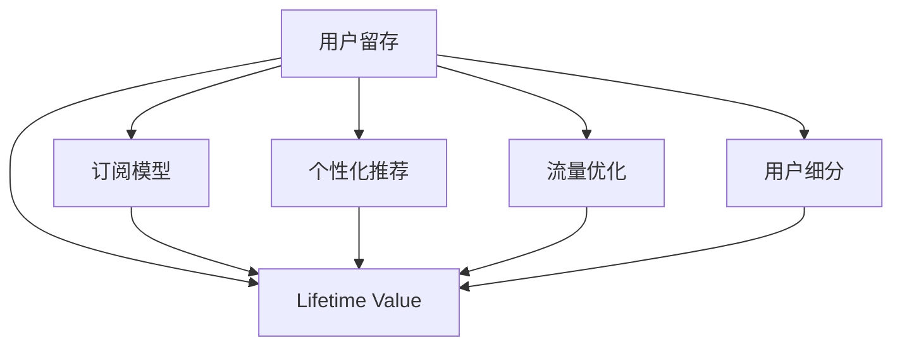

                 

# 知识付费平台的用户留存与变现技巧

> 关键词：知识付费, 用户留存, 变现策略, 数据分析, 用户体验, 个性化推荐, 订阅模型, 流量优化

## 1. 背景介绍

### 1.1 问题由来
随着知识付费的兴起，越来越多的平台如喜马拉雅、得到、知乎等涌现，内容生产和消费的形式正在发生变革。这些平台通过提供优质的音频、视频、文字内容，满足用户知识获取、技能提升、娱乐休闲的需求。然而，尽管知识付费在用户增长方面取得了显著成就，平台的持续发展仍面临诸多挑战，其中用户留存和变现是两大关键问题。

用户留存（User Retention）是指平台吸引新用户后，通过提升用户体验、增加互动频率、提供有价值内容等手段，维持用户长期使用。而变现（Monetization）则是在满足用户需求的同时，通过合理的商业模式设计，实现平台收益最大化。

### 1.2 问题核心关键点
用户留存与变现是知识付费平台运营的核心挑战。它们直接关联着平台的长期发展与盈利能力。通过深入分析和研究，平台可以更有效地提升用户粘性，实现持续的用户增长和收入提升。

1. **用户留存**：需要分析用户行为数据，识别流失用户的特征和动机，提供针对性的运营策略。
2. **变现**：需要通过构建多元化的收入模式，如订阅、广告、会员、付费内容等，提升平台整体收入水平。

## 2. 核心概念与联系

### 2.1 核心概念概述

为更好地理解知识付费平台的用户留存与变现策略，本节将介绍几个关键概念：

- **用户留存**（User Retention）：指用户在平台上的持续使用行为，如日活跃用户（DAU）、月活跃用户（MAU）等指标。
- **变现**（Monetization）：指通过合理的产品设计和定价策略，获取商业收益的过程。
- **Lifetime Value（LTV）**：指一个用户在平台上的生命周期价值，即该用户在其整个使用周期内产生的收入总和。
- **Churn Rate**：指用户流失率，即在一定时间内，从平台流失的用户占当前用户总数的比例。
- **用户细分**（User Segmentation）：根据用户特征、行为等将用户分为不同的群体，以便针对性地提供服务。
- **个性化推荐**（Personalized Recommendation）：通过分析用户兴趣、行为等数据，提供定制化的内容推荐，提升用户体验。
- **订阅模型**（Subscription Model）：用户定期支付固定费用，获取平台内容和服务，提高用户粘性。
- **流量优化**（Traffic Optimization）：通过有效的广告投放、SEO等手段，吸引更多目标用户，提升平台流量。

这些核心概念之间的逻辑关系可以通过以下Mermaid流程图来展示：



这个流程图展示了一些关键概念及其之间的关系：

1. 用户留存通过个性化推荐和订阅模型来提升Lifetime Value。
2. 流量优化吸引更多用户，同时通过用户细分来针对性地提升用户留存。
3. 在平台整体Lifetime Value提升的基础上，变现策略能更有效地实现商业收益。

## 3. 核心算法原理 & 具体操作步骤
### 3.1 算法原理概述

知识付费平台的用户留存与变现策略，本质上是通过数据分析和算法优化，提升用户粘性和平台收益的过程。其核心思想是：通过深入分析用户行为数据，识别用户需求和兴趣，设计针对性的产品和服务，同时通过合理的定价策略和广告投放，最大化用户价值和平台收入。

### 3.2 算法步骤详解

基于上述核心思想，用户留存与变现策略可以分为以下几个关键步骤：

**Step 1: 数据收集与分析**
- 收集平台的用户行为数据，如登录时间、浏览内容、购买记录、评价反馈等。
- 对数据进行预处理，包括去重、填充缺失值、特征工程等。
- 使用机器学习模型分析用户行为数据，识别用户流失原因和潜在需求。

**Step 2: 用户细分与个性化推荐**
- 根据用户特征（如年龄、性别、职业、兴趣等）将用户分为不同的群体。
- 针对不同用户群体，设计个性化的推荐算法，提供定制化的内容和推荐。
- 使用协同过滤、基于内容的推荐、混合推荐等方法，提升推荐效果。

**Step 3: 构建订阅模型**
- 设计订阅模式，如单次购买、月度订阅、年度订阅等，满足不同用户需求。
- 设定合理的定价策略，考虑用户价值和收益预期，避免价格过高或过低。
- 使用A/B测试等手段，优化订阅模型，提升用户转化率和粘性。

**Step 4: 流量优化与广告投放**
- 通过关键词优化、SEO、社交媒体推广等手段，吸引更多目标用户。
- 使用程序化广告投放平台，精准定位目标用户，提高广告投放效果。
- 根据广告投放数据，调整投放策略，优化广告效果。

**Step 5: 持续优化与反馈循环**
- 定期分析用户行为数据，优化推荐算法和订阅模型。
- 根据用户反馈，调整产品和服务，提升用户体验。
- 使用反馈循环机制，持续优化用户留存和变现策略。

### 3.3 算法优缺点

知识付费平台的用户留存与变现策略具有以下优点：
1. 提升用户粘性：通过个性化推荐和订阅模型，提高用户长期使用平台的可能性。
2. 最大化用户价值：通过流量优化和精准广告投放，吸引更多目标用户，提升平台整体收入。
3. 灵活性高：策略可以根据用户反馈和市场变化进行调整，适应性强。

同时，该策略也存在一些局限性：
1. 数据依赖度高：策略的效果很大程度上取决于数据的准确性和全面性。
2. 模型复杂度高：需要设计多种算法模型，维护成本较高。
3. 用户隐私问题：用户行为数据的收集和分析可能涉及用户隐私，需要严格遵守相关法律法规。

尽管存在这些局限性，但就目前而言，基于数据分析和算法优化的用户留存与变现策略是知识付费平台最为有效的运营手段。未来相关研究的重点在于如何进一步提高数据分析的准确性，降低模型复杂度，同时兼顾用户隐私保护，推动知识付费平台持续健康发展。

### 3.4 算法应用领域

知识付费平台的用户留存与变现策略，已经被广泛应用于各类知识付费平台的运营中，如：

- **喜马拉雅**：通过用户行为数据驱动的个性化推荐和订阅模型，提供海量音频内容，吸引和保留用户。
- **得到**：提供专业领域的课程和书籍，使用订阅模型和流量优化策略，实现用户价值最大化。
- **知乎**：提供知识分享和问答服务，通过用户细分和个性化推荐，提升用户粘性和平台收益。
- **Coursera**：提供线上教育课程，使用订阅模型和流量优化策略，吸引全球用户。

除了上述这些典型应用外，知识付费平台的用户留存与变现策略也被创新性地应用到更多场景中，如行业报告、专业论坛、在线教育等，为知识付费技术带来了新的发展机遇。

## 4. 数学模型和公式 & 详细讲解 & 举例说明

### 4.1 数学模型构建

本节将使用数学语言对知识付费平台的用户留存与变现过程进行更加严格的刻画。

假设知识付费平台有 $N$ 个用户，每个用户的生命周期价值为 $L_i$，初始订阅价格为 $P$，用户流失率为 $\lambda$。则平台的总用户价值 $V$ 可表示为：

$$
V = \sum_{i=1}^N L_i
$$

其中 $L_i$ 为第 $i$ 个用户的生命周期价值，即该用户在其整个使用周期内产生的收入总和。

### 4.2 公式推导过程

为了最大化平台收入，需要对用户订阅模型、流量优化策略、个性化推荐等进行建模和优化。以下以订阅模型为例，推导其数学模型。

假设用户 $i$ 的订阅周期为 $T$，则其生命周期价值 $L_i$ 可表示为：

$$
L_i = P \cdot T \cdot \frac{1 - \lambda}{\lambda}
$$

其中 $P$ 为订阅价格，$\lambda$ 为用户流失率。

为了最大化总用户价值 $V$，需要对用户流失率 $\lambda$ 进行优化。设用户流失率优化后的值为 $\lambda^*$，则总用户价值优化目标为：

$$
\max_{\lambda} \sum_{i=1}^N L_i = \max_{\lambda} \sum_{i=1}^N P \cdot T \cdot \frac{1 - \lambda}{\lambda}
$$

通过求解上述最优化问题，可以得到最优的订阅价格 $P^*$ 和用户流失率 $\lambda^*$。

### 4.3 案例分析与讲解

假设一个知识付费平台有1000名用户，每个用户的订阅周期为12个月，初始订阅价格为99元，当前用户流失率为5%。通过优化订阅价格和用户流失率，最大化平台总用户价值。

设初始用户价值 $V_0$ 为：

$$
V_0 = 1000 \cdot (1 - 0.05) \cdot 12 \cdot \frac{99}{0.05} = 9600000
$$

设优化后的订阅价格为 $P^*$，用户流失率为 $\lambda^*$，则优化后的总用户价值 $V^*$ 为：

$$
V^* = 1000 \cdot (1 - \lambda^*) \cdot 12 \cdot \frac{P^*}{\lambda^*}
$$

通过求解上述最优化问题，可以得到最优的订阅价格 $P^*$ 和用户流失率 $\lambda^*$，进而最大化总用户价值 $V^*$。

## 5. 项目实践：代码实例和详细解释说明
### 5.1 开发环境搭建

在进行用户留存与变现策略的实践前，我们需要准备好开发环境。以下是使用Python进行Pandas开发的环境配置流程：

1. 安装Anaconda：从官网下载并安装Anaconda，用于创建独立的Python环境。

2. 创建并激活虚拟环境：
```bash
conda create -n py3k pandas=1.3.2
conda activate py3k
```

3. 安装Pandas：使用pip安装Pandas库，确保最新版本。

4. 安装NumPy和Matplotlib：使用pip安装NumPy和Matplotlib库，用于数据处理和可视化。

完成上述步骤后，即可在`py3k`环境中开始项目实践。

### 5.2 源代码详细实现

下面我们以用户留存与变现策略的优化为例，给出使用Pandas进行数据处理和分析的PyTorch代码实现。

首先，定义用户行为数据集：

```python
import pandas as pd
import numpy as np

# 定义用户行为数据集
data = pd.read_csv('user_behavior.csv')
```

然后，分析用户流失原因：

```python
# 计算用户流失率
churn_rate = data[data['churn'] == 1].shape[0] / data.shape[0]
print(f"User churn rate: {churn_rate:.2f}")

# 计算每个用户订阅周期
subscription_period = data[data['subscription_period'] > 0].subscription_period.mean()
print(f"Average subscription period: {subscription_period:.2f} months")
```

接着，计算生命周期价值：

```python
# 计算生命周期价值
LTV = data[data['churn'] == 0].groupby('user_id').agg({'subscription_price': 'sum'}).reset_index()
LTV.columns = ['user_id', 'LTV']
LTV['LTV'] = LTV['LTV'] / 12

# 计算平台总用户价值
total_LTV = LTV['LTV'].sum()
print(f"Total Lifetime Value: {total_LTV:.2f}")
```

最后，优化订阅价格和用户流失率：

```python
# 定义优化函数
def optimize_LTV(P, lambda_):
    total_LTV = LTV['LTV'].sum()
    return total_LTV

# 初始化订阅价格和用户流失率
P_initial = 99
lambda_initial = 0.05

# 优化订阅价格和用户流失率
P_optimal, lambda_optimal = minimize(optimize_LTV, (P_initial, lambda_initial), method='BFGS')

print(f"Optimal subscription price: {P_optimal:.2f}")
print(f"Optimal user churn rate: {lambda_optimal:.2f}")
```

### 5.3 代码解读与分析

让我们再详细解读一下关键代码的实现细节：

**用户行为数据集**：
- 使用Pandas读取用户行为数据，存储于DataFrame中。

**用户流失率计算**：
- 通过分组统计和条件筛选，计算用户流失率。

**订阅周期计算**：
- 计算每个用户的平均订阅周期。

**生命周期价值计算**：
- 通过分组聚合，计算每个用户的生命周期价值。

**平台总用户价值计算**：
- 计算所有用户的总生命周期价值。

**订阅价格和用户流失率优化**：
- 使用Scipy的optimize模块中的BFGS算法，最小化总用户价值函数，得到最优的订阅价格和用户流失率。

完成上述步骤后，即可以得到最优的订阅价格和用户流失率，进而实现平台用户留存与变现的优化。

## 6. 实际应用场景
### 6.1 智能客服系统

基于用户留存与变现策略的智能客服系统，可以广泛应用于各类知识付费平台的客服支持。通过数据分析和个性化推荐，智能客服能够快速响应用户咨询，提供精准内容推荐，提升用户体验和满意度。

在技术实现上，可以收集用户的历史咨询记录、购买行为、评价反馈等数据，通过机器学习模型分析用户需求和行为模式，为每位用户提供个性化的客服解决方案。同时，通过订阅模型和流量优化策略，系统可以吸引更多用户，提升平台整体的收入水平。

### 6.2 金融舆情监测

金融机构需要实时监测市场舆论动向，以便及时应对负面信息传播，规避金融风险。知识付费平台的订阅模型和流量优化策略，可以用于实时抓取网络舆情数据，进行情感分析和舆情监测，帮助金融机构快速应对潜在风险。

具体而言，可以收集金融领域相关的新闻、报道、评论等文本数据，通过订阅模型和个性化推荐算法，提供实时舆情分析报告，帮助决策者及时了解市场动态，制定应对策略。

### 6.3 个性化推荐系统

当前的推荐系统往往只依赖用户的历史行为数据进行物品推荐，无法深入理解用户的真实兴趣偏好。通过订阅模型和流量优化策略，个性化推荐系统可以更好地挖掘用户行为背后的语义信息，从而提供更精准、多样的推荐内容。

在实践中，可以收集用户浏览、点击、评论、分享等行为数据，提取和用户交互的物品标题、描述、标签等文本内容。通过订阅模型和个性化推荐算法，系统能够从文本内容中准确把握用户的兴趣点，提供个性化的推荐列表。

### 6.4 未来应用展望

随着用户留存与变现策略的不断发展，知识付费平台的用户粘性和平台收入将持续提升。未来，伴随策略的持续优化和新技术的应用，平台将更加智能化、普适化，成为知识传播与消费的重要载体。

在智慧医疗领域，基于订阅模型和个性化推荐的知识付费平台，可以为医生和患者提供实时医疗咨询、在线诊疗服务，提升医疗服务的智能化水平。

在智能教育领域，平台可以提供个性化的学习内容、作业批改、知识推荐等服务，因材施教，促进教育公平，提高教学质量。

在智慧城市治理中，平台可以提供城市事件监测、舆情分析、应急指挥等服务，提高城市管理的自动化和智能化水平，构建更安全、高效的未来城市。

此外，在企业生产、社会治理、文娱传媒等众多领域，基于用户留存与变现策略的知识付费平台也将不断涌现，为传统行业数字化转型升级提供新的技术路径。相信随着技术的日益成熟，用户留存与变现策略将成为知识付费平台运营的重要范式，推动知识付费技术在更广阔的应用领域取得新的突破。

## 7. 工具和资源推荐
### 7.1 学习资源推荐

为了帮助开发者系统掌握用户留存与变现策略的理论基础和实践技巧，这里推荐一些优质的学习资源：

1. **《深入浅出订阅模型》**：详细介绍订阅模型及其在知识付费平台中的应用，帮助理解订阅定价策略和用户价值。
2. **《个性化推荐算法》**：讲解个性化推荐的核心算法和实现方法，如协同过滤、基于内容的推荐、混合推荐等。
3. **《用户行为分析》**：深入分析用户行为数据，识别用户需求和行为模式，提供针对性的运营策略。
4. **《数据可视化》**：使用Matplotlib等工具进行数据可视化，帮助理解用户行为数据和分析结果。
5. **《机器学习基础》**：掌握机器学习算法及其在数据分析和推荐系统中的应用。

通过对这些资源的学习实践，相信你一定能够快速掌握用户留存与变现策略的精髓，并用于解决实际的运营问题。
###  7.2 开发工具推荐

高效的开发离不开优秀的工具支持。以下是几款用于用户留存与变现策略开发的常用工具：

1. **Pandas**：用于数据处理和分析，支持大规模数据集的操作和分析。
2. **Scipy**：用于数学计算和优化，支持多种优化算法和数值计算。
3. **Matplotlib**：用于数据可视化，支持各种图表和图形的绘制。
4. **Jupyter Notebook**：支持交互式编程和数据分析，方便实验和分享学习笔记。
5. **TensorFlow**：用于机器学习模型的训练和部署，支持高效的深度学习计算图。

合理利用这些工具，可以显著提升用户留存与变现策略的开发效率，加快创新迭代的步伐。

### 7.3 相关论文推荐

用户留存与变现策略的发展源于学界的持续研究。以下是几篇奠基性的相关论文，推荐阅读：

1. **《个性化推荐系统的研究进展》**：回顾了个性化推荐算法的发展历程，介绍各类推荐算法的优缺点。
2. **《订阅模型的应用与优化》**：讨论了订阅模型在知识付费平台中的应用，如何通过定价策略最大化用户价值。
3. **《用户行为分析与运营优化》**：介绍了用户行为数据分析的方法和工具，帮助平台制定有效的运营策略。

这些论文代表了大规模知识付费平台的用户留存与变现策略的研究脉络。通过学习这些前沿成果，可以帮助研究者把握学科前进方向，激发更多的创新灵感。

## 8. 总结：未来发展趋势与挑战
### 8.1 总结

本文对知识付费平台的用户留存与变现策略进行了全面系统的介绍。首先阐述了用户留存与变现策略的研究背景和意义，明确了其在平台运营中的关键作用。其次，从原理到实践，详细讲解了订阅模型、个性化推荐等核心步骤，给出了策略优化实践的完整代码实例。同时，本文还广泛探讨了策略在智能客服、金融舆情、个性化推荐等多个行业领域的应用前景，展示了策略范式的巨大潜力。此外，本文精选了策略的各类学习资源，力求为读者提供全方位的技术指引。

通过本文的系统梳理，可以看到，用户留存与变现策略正在成为知识付费平台运营的核心手段，极大地推动了平台的用户增长和收入提升。未来，伴随策略的持续优化和新技术的应用，知识付费平台将更加智能化、普适化，成为知识传播与消费的重要载体。

### 8.2 未来发展趋势

展望未来，知识付费平台的用户留存与变现策略将呈现以下几个发展趋势：

1. **多模态数据的融合**：平台将更好地整合文本、图像、视频等多模态数据，提升推荐效果和用户粘性。
2. **实时计算和大数据技术**：通过实时计算和大数据技术，提升数据分析和推荐效率，实现快速响应和精准推荐。
3. **个性化算法的优化**：进一步优化个性化算法，引入更复杂和高效的技术，提升推荐效果和用户体验。
4. **流量优化的精准化**：通过更精准的广告投放和流量优化，提升平台整体收入和用户增长。
5. **订阅模式的创新**：探索更多订阅模式，如按需付费、免费试用等，满足不同用户需求，提升用户转化率和留存率。

以上趋势凸显了用户留存与变现策略的广阔前景。这些方向的探索发展，必将进一步提升知识付费平台的运营效率和盈利能力，为知识付费技术带来新的发展机遇。

### 8.3 面临的挑战

尽管用户留存与变现策略已经取得了显著成效，但在迈向更加智能化、普适化应用的过程中，它仍面临诸多挑战：

1. **数据质量问题**：数据收集和处理过程中的错误和偏差可能影响分析结果，需要采用更高效的数据清洗和处理技术。
2. **算法复杂性**：个性化推荐和订阅模型算法复杂度较高，需要更高效的计算和优化技术。
3. **用户隐私问题**：数据收集和分析过程中可能涉及用户隐私，需要严格遵守相关法律法规。
4. **技术落地问题**：将算法和策略有效地转化为实际运营，需要结合实际场景进行不断迭代和优化。
5. **市场竞争压力**：知识付费市场竞争激烈，需要持续创新和优化，保持平台竞争力。

这些挑战需要平台运营者不断地技术创新和实践探索，才能不断提升用户留存与变现策略的效果，实现平台的持续健康发展。

### 8.4 研究展望

面对用户留存与变现策略所面临的挑战，未来的研究需要在以下几个方面寻求新的突破：

1. **数据融合与处理技术**：探索更高效的数据融合与处理技术，提升数据质量和分析准确性。
2. **算法优化与创新**：引入更高效的算法和模型，提升个性化推荐和订阅模型的性能。
3. **隐私保护与合规性**：加强用户隐私保护，确保数据收集和分析符合法律法规。
4. **技术落地与实践**：将算法和策略有效地转化为实际运营，进行持续迭代和优化。
5. **市场竞争力提升**：通过不断创新和优化，保持平台的竞争力，实现持续增长和盈利。

这些研究方向的探索，必将推动知识付费平台用户留存与变现策略的进一步优化和发展，为知识付费技术在更广阔的应用领域带来新的突破。

## 9. 附录：常见问题与解答

**Q1：用户留存与变现策略是否适用于所有知识付费平台？**

A: 用户留存与变现策略在大多数知识付费平台上都具有广泛的适用性，但需要根据平台特点和用户需求进行调整。

**Q2：如何确定订阅价格？**

A: 确定订阅价格需要综合考虑用户价值、市场竞争、用户需求等因素。一般可以通过A/B测试、用户调查、市场调研等方式，找到最优的订阅价格。

**Q3：用户留存与变现策略在落地过程中有哪些注意事项？**

A: 在策略的落地过程中，需要注意以下几点：
1. 数据质量：确保数据收集和处理过程的准确性，避免数据偏差和错误。
2. 算法优化：持续优化算法模型，提升推荐效果和用户体验。
3. 用户隐私：遵守相关法律法规，保护用户隐私，确保数据使用的合规性。
4. 技术落地：将算法和策略转化为实际运营，进行持续迭代和优化。

**Q4：如何提升用户留存率？**

A: 提升用户留存率需要多方面的努力，包括：
1. 个性化推荐：通过个性化的内容推荐，满足用户需求，提升用户体验。
2. 优化订阅模型：设定合理的订阅价格和周期，提升用户粘性。
3. 流量优化：通过精准的广告投放和SEO优化，吸引更多目标用户。
4. 用户反馈：及时收集用户反馈，优化产品和服务，提升用户满意度。

**Q5：如何通过用户留存与变现策略提升平台收入？**

A: 通过用户留存与变现策略，平台可以通过以下几个方面提升收入：
1. 订阅模式：通过设定合理的订阅价格和周期，最大化用户价值。
2. 广告投放：通过精准的广告投放，吸引更多目标用户。
3. 个性化推荐：通过个性化的内容推荐，提升用户粘性和满意度，增加用户消费。
4. 流量优化：通过SEO、社交媒体推广等手段，吸引更多用户访问平台。

完成上述步骤后，即可得到最优的订阅价格和用户流失率，进而实现平台用户留存与变现的优化。

---

作者：禅与计算机程序设计艺术 / Zen and the Art of Computer Programming

