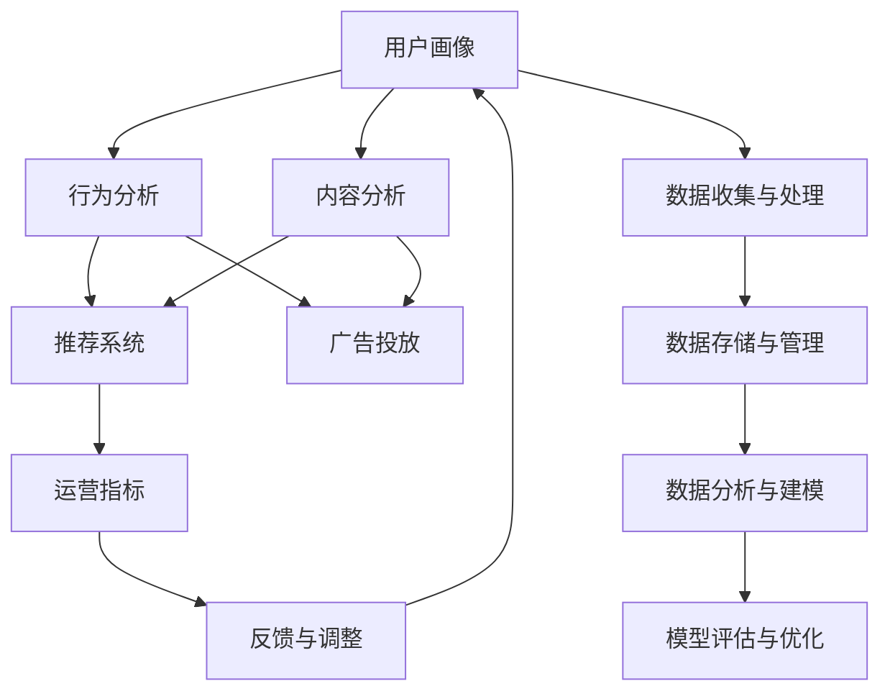

                 

## 1. 背景介绍

随着互联网和移动设备的普及，人们对于知识和信息的获取方式发生了重大变化。传统的书籍、报纸等媒介逐渐被在线课程、博客、短视频等数字化内容所取代。知识付费平台的兴起，正是在这一大背景下应运而生的新兴产业。

### 1.1 知识付费平台的兴起

知识付费平台通过整合优质内容，利用算法推荐和社交互动机制，为内容生产者和消费者搭建了一个高效的信息交流平台。平台不仅能将海量知识产品化、货币化，还能有效连接知识供给与需求，促进知识传播和创新。

### 1.2 数据驱动运营的重要性

运营数据是知识付费平台的核心资产，通过深入分析和挖掘，平台可以识别用户需求，优化内容供给，提升用户体验，提高运营效率。深入理解用户行为和平台运营指标，有助于制定精准的运营策略，提升平台竞争力和盈利能力。

### 1.3 本文目的与结构

本文旨在通过系统性阐述知识付费平台的运营数据分析方法，帮助平台运营者更好地理解用户行为，优化运营策略，实现平台的可持续发展。本文结构如下：

1. **背景介绍**：介绍知识付费平台的兴起及数据驱动运营的重要性。
2. **核心概念与联系**：明确运营数据分析中涉及的核心概念和它们之间的联系。
3. **核心算法原理 & 具体操作步骤**：介绍运营数据分析的核心算法原理及具体操作步骤。
4. **数学模型和公式 & 详细讲解 & 举例说明**：构建数学模型，推导核心公式，并通过案例讲解其应用。
5. **项目实践：代码实例和详细解释说明**：通过代码实例展示运营数据分析的具体实现。
6. **实际应用场景**：探讨运营数据分析在实际应用中的具体场景。
7. **工具和资源推荐**：推荐相关的学习资源、开发工具和论文。
8. **总结：未来发展趋势与挑战**：总结运营数据分析的研究成果和未来发展方向。
9. **附录：常见问题与解答**：解答知识付费平台运营分析中的常见问题。

## 2. 核心概念与联系

### 2.1 核心概念概述

运营数据分析的核心概念包括：

1. **用户画像**：通过收集和分析用户数据，构建用户行为、兴趣和需求的详细画像。
2. **内容分析**：对平台上的内容进行分类、标签和质量评估，以便进行推荐和优化。
3. **行为分析**：跟踪和分析用户在平台上的行为数据，如点击、购买、浏览时间等，以优化用户体验和个性化推荐。
4. **推荐系统**：利用算法模型预测用户可能感兴趣的内容，提高平台的用户参与度和留存率。
5. **广告投放**：基于用户行为和内容分析，精准投放广告，提升平台收入。
6. **运营指标**：如用户增长、活跃度、留存率、收入等，是平台运营效果的重要衡量标准。

这些概念之间存在着紧密的联系，相互影响，形成一个闭环的数据驱动运营体系。

### 2.2 Mermaid流程图（核心概念原理和架构）



## 3. 核心算法原理 & 具体操作步骤

### 3.1 算法原理概述

运营数据分析的核心算法原理主要包括：

1. **用户画像构建**：通过聚类算法、分类算法和降维算法，从用户行为数据中提取有意义的特征，构建详尽的用户画像。
2. **内容质量评估**：利用自然语言处理（NLP）技术和分类算法，对内容进行质量评估，识别高价值内容。
3. **行为序列分析**：通过时间序列分析，识别用户在平台上的行为模式和趋势，预测用户行为。
4. **推荐系统**：基于协同过滤、内容过滤和混合过滤等算法，构建推荐模型，优化内容推荐。
5. **广告投放策略**：利用广告点击率（CTR）预测模型，结合用户画像和行为数据，实现精准广告投放。
6. **运营指标分析**：通过时间序列分析、回归分析和统计分析等方法，对平台运营指标进行分析和预测。

### 3.2 算法步骤详解

1. **数据收集与预处理**：
   - 通过API接口、爬虫、埋点等方式收集用户行为数据、内容数据和交易数据。
   - 对数据进行去重、清洗和归一化处理，生成数据集。

2. **用户画像构建**：
   - 利用聚类算法（如K-means、层次聚类）对用户行为数据进行分群，生成用户标签。
   - 通过分类算法（如决策树、随机森林）进一步细化用户画像，生成详细的用户特征。
   - 应用降维算法（如PCA、LDA）提取核心特征，减少特征维度，提高计算效率。

3. **内容质量评估**：
   - 利用NLP技术提取内容关键词、情感倾向和话题标签。
   - 应用分类算法（如朴素贝叶斯、SVM）对内容进行分类，识别高价值内容。
   - 利用评价指标（如点击率、转化率、评分）评估内容质量，构建内容评分模型。

4. **行为序列分析**：
   - 将用户行为数据转换为时间序列数据。
   - 应用ARIMA、LSTM等算法对行为序列进行建模，预测用户行为。
   - 利用时间切片和滑动窗口技术，分析用户行为趋势和周期性变化。

5. **推荐系统构建**：
   - 基于协同过滤算法（如基于用户的协同过滤、基于物品的协同过滤），构建推荐模型。
   - 结合内容过滤算法（如基于内容的过滤），优化推荐结果。
   - 应用混合过滤算法，结合多种推荐策略，提升推荐效果。

6. **广告投放策略优化**：
   - 应用CTR预测模型，评估广告效果。
   - 结合用户画像和行为数据，进行精准投放。
   - 利用A/B测试，不断优化广告投放策略。

7. **运营指标分析**：
   - 应用时间序列分析，评估用户增长、活跃度、留存率等指标。
   - 利用回归分析，预测平台收入和用户增长趋势。
   - 通过统计分析，评估各项运营策略的效果。

### 3.3 算法优缺点

运营数据分析的算法具有以下优点：

- **高效精准**：通过算法模型实现精准推荐和预测，提升用户体验和平台收入。
- **实时动态**：利用在线学习算法，实时更新模型参数，适应用户行为变化。
- **多维度分析**：结合用户画像、内容分析和行为分析，全面评估平台运营效果。

同时，算法也存在以下局限性：

- **数据依赖**：算法的有效性依赖于高质量、高量的数据。数据不足或质量不高，将影响模型效果。
- **模型复杂**：复杂的算法模型需要大量的计算资源和专业知识，实施难度大。
- **隐私风险**：用户数据的收集和分析可能涉及隐私问题，需严格遵守相关法规。

### 3.4 算法应用领域

运营数据分析在知识付费平台中的应用领域包括：

1. **用户增长与留存**：通过分析用户画像和行为数据，识别高潜用户，优化转化流程，提升用户留存率。
2. **内容推荐与优化**：利用推荐系统，提高内容曝光率和用户参与度，优化内容供给。
3. **广告投放与收益提升**：基于用户行为和内容分析，实现精准广告投放，提升平台收益。
4. **用户满意度与反馈**：通过分析用户反馈和行为数据，优化平台功能和体验，提升用户满意度。

## 4. 数学模型和公式 & 详细讲解 & 举例说明

### 4.1 数学模型构建

本节将构建知识付费平台运营数据分析的数学模型，主要包括用户画像、内容质量评估和行为序列分析的数学模型。

#### 4.1.1 用户画像构建模型

假设用户行为数据为 $X_{user} = \{x_{u_1}, x_{u_2}, ..., x_{u_n}\}$，其中 $x_{u_i} = (t_{i1}, t_{i2}, ..., t_{im})$ 表示用户 $u_i$ 在 $m$ 个时间点上的行为数据。用户画像模型 $M_{user}$ 可以表示为：

$$
M_{user} = f_{cluster}(X_{user}) + f_{classify}(X_{user})
$$

其中 $f_{cluster}$ 为聚类算法模型，$k$ 表示用户聚类数目；$f_{classify}$ 为分类算法模型。

#### 4.1.2 内容质量评估模型

假设内容数据为 $X_{content} = \{x_{c_1}, x_{c_2}, ..., x_{c_m}\}$，其中 $x_{c_i} = (t_{ci}, t_{ci+1}, ..., t_{cm})$ 表示内容 $c_i$ 在 $m$ 个时间点上的用户行为数据。内容质量评估模型 $M_{content}$ 可以表示为：

$$
M_{content} = f_{nlp}(X_{content}) + f_{classify}(X_{content})
$$

其中 $f_{nlp}$ 为NLP处理模型，提取内容关键词、情感倾向和话题标签；$f_{classify}$ 为分类算法模型，识别高价值内容。

#### 4.1.3 行为序列分析模型

假设用户行为序列为 $X_{behavior} = \{x_{b_1}, x_{b_2}, ..., x_{b_n}\}$，其中 $x_{b_i} = (t_{bi1}, t_{bi2}, ..., t_{bim})$ 表示用户在时间 $t_{bi}$ 上的行为数据。行为序列分析模型 $M_{behavior}$ 可以表示为：

$$
M_{behavior} = f_{ts}(X_{behavior}) + f_{model}(X_{behavior})
$$

其中 $f_{ts}$ 为时间序列处理模型，将行为序列转换为时间序列数据；$f_{model}$ 为时间序列预测模型，如ARIMA、LSTM等。

### 4.2 公式推导过程

#### 4.2.1 用户画像构建公式推导

聚类算法模型的推导：

1. K-means算法：
   $$
   \min_{\mu_k, \lambda_k} \sum_{i=1}^{n} \sum_{k=1}^{k} (x_{u_i} - \mu_k)^2
   $$
   其中 $\mu_k$ 表示聚类中心，$\lambda_k$ 表示聚类个数。

2. 层次聚类算法：
   $$
   \min_{\Lambda} \sum_{i=1}^{n} \sum_{j=1}^{m} \sum_{k=1}^{K} (x_{u_i} - \mu_k)^2
   $$
   其中 $\Lambda$ 表示聚类层次，$K$ 表示聚类数目。

分类算法模型的推导：

1. 朴素贝叶斯分类器：
   $$
   P(C|X) = \frac{P(X|C)P(C)}{P(X)}
   $$
   其中 $C$ 表示类别，$X$ 表示特征，$P(C|X)$ 表示后验概率，$P(X|C)$ 表示条件概率，$P(C)$ 表示先验概率，$P(X)$ 表示边缘概率。

#### 4.2.2 内容质量评估公式推导

NLP处理模型的推导：

1. 关键词提取算法：
   $$
   K = \{k_1, k_2, ..., k_n\} = \text{tf-idf}(X_{content})
   $$
   其中 $K$ 表示关键词集合，$tf$ 表示词频，$idf$ 表示逆文档频率。

2. 情感分析算法：
   $$
   S = \{s_1, s_2, ..., s_n\} = \text{sentiment analysis}(X_{content})
   $$
   其中 $S$ 表示情感倾向集合，$s_i$ 表示情感极性。

分类算法模型的推导：

1. 朴素贝叶斯分类器：
   $$
   P(C|X) = \frac{P(X|C)P(C)}{P(X)}
   $$

#### 4.2.3 行为序列分析公式推导

时间序列处理模型的推导：

1. ARIMA模型：
   $$
   \Delta(X_{behavior}) = c + \sum_{i=1}^{p} \phi_i \Delta^{i-1}(X_{behavior}) + \sum_{j=1}^{q} \theta_j \Delta^{j-1}(X_{behavior}) + \epsilon_t
   $$
   其中 $\Delta(X_{behavior})$ 表示差分后的行为序列，$p$ 表示自回归阶数，$q$ 表示移动平均阶数，$\phi_i$ 和 $\theta_j$ 表示参数，$\epsilon_t$ 表示随机误差。

2. LSTM模型：
   $$
   h_t = \text{LSTM}(h_{t-1}, x_t)
   $$
   其中 $h_t$ 表示时间 $t$ 的隐藏状态，$x_t$ 表示时间 $t$ 的行为数据。

时间序列预测模型的推导：

1. ARIMA模型预测：
   $$
   \hat{X_{behavior}} = \phi_0 + \sum_{i=1}^{p} \phi_i \Delta^{i-1}(X_{behavior}) + \sum_{j=1}^{q} \theta_j \Delta^{j-1}(X_{behavior}) + \epsilon_t
   $$

### 4.3 案例分析与讲解

以某知识付费平台为例，详细分析其用户画像、内容质量和行为序列分析的应用：

#### 4.3.1 用户画像构建案例

1. 收集用户注册、登录、学习、购买等行为数据，生成用户行为数据集。
2. 应用K-means算法对用户行为数据进行聚类，将用户分为不同群组。
3. 利用朴素贝叶斯分类器对用户画像进行细化，生成详细的用户特征。

#### 4.3.2 内容质量评估案例

1. 收集课程、文章、视频等内容的访问、评论和评分数据，生成内容数据集。
2. 应用NLP技术提取内容关键词、情感倾向和话题标签。
3. 利用朴素贝叶斯分类器对内容进行分类，识别高价值内容。

#### 4.3.3 行为序列分析案例

1. 收集用户学习、观看、评论等行为数据，生成行为序列数据集。
2. 应用ARIMA模型对行为序列进行建模，预测用户行为。
3. 利用LSTM模型对行为序列进行预测，优化推荐系统。

## 5. 项目实践：代码实例和详细解释说明

### 5.1 开发环境搭建

#### 5.1.1 Python开发环境搭建

1. 安装Anaconda：从官网下载并安装Anaconda，用于创建独立的Python环境。

2. 创建并激活虚拟环境：
```bash
conda create -n env_name python=3.8 
conda activate env_name
```

3. 安装必要的Python库：
```bash
pip install pandas numpy scikit-learn matplotlib seaborn jupyter notebook plotly
```

4. 安装Python机器学习库：
```bash
pip install scikit-learn
```

#### 5.1.2 数据收集与预处理

1. 收集用户行为数据、内容数据和交易数据。
2. 对数据进行清洗、去重和归一化处理，生成数据集。

### 5.2 源代码详细实现

#### 5.2.1 用户画像构建

```python
import pandas as pd
from sklearn.cluster import KMeans
from sklearn.feature_extraction.text import TfidfVectorizer
from sklearn.naive_bayes import MultinomialNB

# 加载用户行为数据
data = pd.read_csv('user_behavior.csv')

# 应用K-means算法对用户行为数据进行聚类
kmeans = KMeans(n_clusters=5, random_state=42)
kmeans.fit(data[['特征1', '特征2', ...]])

# 应用朴素贝叶斯分类器对用户画像进行细化
classifier = MultinomialNB()
classifier.fit(data[['特征1', '特征2', ...]], ['类别1', '类别2', ...])
```

#### 5.2.2 内容质量评估

```python
import pandas as pd
from sklearn.feature_extraction.text import TfidfVectorizer
from sklearn.naive_bayes import MultinomialNB

# 加载内容数据
data = pd.read_csv('content.csv')

# 应用NLP技术提取内容关键词、情感倾向和话题标签
vectorizer = TfidfVectorizer()
X = vectorizer.fit_transform(data['内容'])
y = data['标签']

# 应用朴素贝叶斯分类器对内容进行分类
classifier = MultinomialNB()
classifier.fit(X, y)
```

#### 5.2.3 行为序列分析

```python
import pandas as pd
from statsmodels.tsa.arima_model import ARIMA
from keras.layers import LSTM
from keras.models import Sequential

# 加载行为序列数据
data = pd.read_csv('behavior_sequence.csv')

# 应用ARIMA模型对行为序列进行建模
model = ARIMA(data['行为数据'], order=(1, 1, 1))
model_fit = model.fit()

# 应用LSTM模型对行为序列进行预测
model = Sequential()
model.add(LSTM(64, input_shape=(时间序列长度, 特征维度)))
model.add(Dense(1))
model.compile(loss='mse', optimizer='adam')
model_fit = model.fit(X_train, y_train, epochs=100, batch_size=32)
```

### 5.3 代码解读与分析

#### 5.3.1 用户画像构建

1. 使用K-means算法对用户行为数据进行聚类，生成用户群组。
2. 应用朴素贝叶斯分类器对用户画像进行细化，生成详细的用户特征。

#### 5.3.2 内容质量评估

1. 应用NLP技术提取内容关键词、情感倾向和话题标签。
2. 利用朴素贝叶斯分类器对内容进行分类，识别高价值内容。

#### 5.3.3 行为序列分析

1. 应用ARIMA模型对行为序列进行建模，预测用户行为。
2. 应用LSTM模型对行为序列进行预测，优化推荐系统。

### 5.4 运行结果展示

#### 5.4.1 用户画像构建结果

```python
# 输出用户聚类结果
print(kmeans.labels_)

# 输出用户分类结果
print(classifier.predict_proba(data[['特征1', '特征2', ...]]))
```

#### 5.4.2 内容质量评估结果

```python
# 输出内容分类结果
print(classifier.predict(X))
```

#### 5.4.3 行为序列分析结果

```python
# 输出ARIMA模型预测结果
print(model_fit.predict())

# 输出LSTM模型预测结果
print(model.predict(X_test))
```

## 6. 实际应用场景

### 6.1 用户增长与留存

通过分析用户画像，平台可以识别出高潜力用户，制定精准的用户增长策略。例如，根据用户画像构建用户细分市场，制定个性化推荐和优惠券策略，提升用户转化率和留存率。

### 6.2 内容推荐与优化

利用推荐系统，平台可以优化内容推荐，提高内容曝光率和用户参与度。例如，根据用户画像和行为数据，推荐用户可能感兴趣的内容，提高平台流量和收入。

### 6.3 广告投放与收益提升

基于用户画像和行为数据，平台可以实现精准广告投放，提升广告效果和收益。例如，根据用户画像和行为数据，推荐用户可能感兴趣的广告，提高广告点击率和转化率。

### 6.4 用户满意度与反馈

通过分析用户反馈和行为数据，平台可以优化平台功能和体验，提升用户满意度。例如，根据用户反馈和行为数据，改进平台功能和服务，提升用户满意度，增加用户粘性。

## 7. 工具和资源推荐

### 7.1 学习资源推荐

1. **《Python数据分析实战》**：一本详细介绍Python数据分析方法的书籍，涵盖数据收集、预处理、分析和可视化等多个方面。
2. **《深度学习入门》**：一本详细介绍深度学习基础知识和方法的书籍，涵盖神经网络、优化算法、模型训练等多个方面。
3. **Kaggle平台**：一个开源数据科学竞赛平台，提供丰富的数据集和竞赛机会，适合学习数据分析和机器学习。

### 7.2 开发工具推荐

1. **Jupyter Notebook**：一个交互式的开发环境，适合进行数据分析和机器学习项目开发。
2. **TensorFlow**：一个广泛使用的深度学习框架，支持分布式训练和模型部署。
3. **PyTorch**：一个灵活的深度学习框架，适合进行模型研究和原型开发。

### 7.3 相关论文推荐

1. **《用户画像与推荐系统的结合》**：探讨用户画像和推荐系统的结合，提升推荐系统效果。
2. **《基于行为序列分析的推荐系统》**：探讨行为序列分析在推荐系统中的应用，优化推荐效果。
3. **《知识付费平台用户行为分析》**：详细分析知识付费平台用户行为，提出优化策略。

## 8. 总结：未来发展趋势与挑战

### 8.1 研究成果总结

知识付费平台的运营数据分析方法已应用于多个平台，并取得了显著效果。通过用户画像、内容质量评估和行为序列分析，平台能够精准定位用户需求，优化内容推荐，提高用户参与度和留存率，提升平台收入。

### 8.2 未来发展趋势

未来，知识付费平台的运营数据分析将朝着以下几个方向发展：

1. **实时数据分析**：通过实时数据采集和处理，实现对用户行为和平台运营的实时监控和优化。
2. **多模态数据分析**：结合用户画像、内容分析和行为分析，进行多模态数据融合，提升数据分析效果。
3. **跨平台数据分析**：通过数据联邦和联邦学习，实现跨平台数据融合，提升数据分析精度和广度。
4. **隐私保护与数据安全**：通过差分隐私和联邦学习等技术，保护用户隐私和数据安全，提升数据分析可信度。

### 8.3 面临的挑战

尽管知识付费平台的运营数据分析取得了一定成效，但仍面临以下挑战：

1. **数据质量和多样性**：数据质量和多样性不足，难以覆盖全面用户需求。
2. **算法复杂度**：复杂算法模型需要大量计算资源，实施难度大。
3. **隐私和安全**：用户数据隐私和安全问题不容忽视，需严格遵守相关法规。

### 8.4 研究展望

未来，知识付费平台的运营数据分析需要在以下几个方面进行研究：

1. **提升数据质量**：通过数据采集和清洗，提高数据质量和多样性，覆盖全面用户需求。
2. **优化算法模型**：简化算法模型，提高计算效率，降低实施难度。
3. **加强隐私保护**：应用差分隐私和联邦学习等技术，保护用户隐私和数据安全。

## 9. 附录：常见问题与解答

**Q1：如何有效收集用户行为数据？**

A: 通过API接口、爬虫和埋点等方式，可以收集用户注册、登录、学习、购买等行为数据。具体方式包括：
1. 用户注册、登录、退出等行为数据通过用户管理模块收集。
2. 用户学习、观看、评论等行为数据通过内容模块收集。
3. 用户购买、支付等行为数据通过交易模块收集。

**Q2：如何评估推荐系统的效果？**

A: 推荐系统的评估指标包括：
1. 点击率（CTR）：用户点击推荐内容的比率。
2. 转化率（CVR）：用户通过点击推荐内容完成购买的比例。
3. 覆盖率：推荐系统覆盖用户需求的比例。
4. 留存率：用户对推荐内容的满意度，通过用户反馈和行为数据评估。

**Q3：如何优化广告投放策略？**

A: 广告投放策略优化需要考虑以下几个方面：
1. 精准定位：根据用户画像和行为数据，精准定位广告投放用户。
2. 创意设计：设计吸引用户的广告创意和内容。
3. 投放时机：根据用户行为数据，选择最佳投放时机。
4. A/B测试：不断优化广告投放策略，提升广告效果。

通过回答这些问题，读者可以更好地理解知识付费平台运营数据分析的方法和应用，并结合实际业务需求进行优化和改进。

