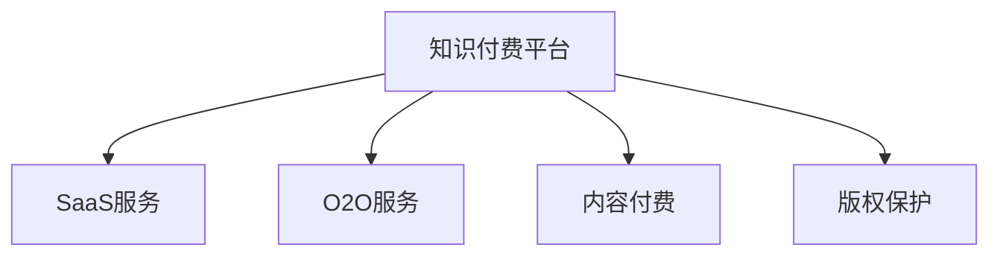

                 

# 知识付费的商业模式与盈利秘诀探究

## 1. 背景介绍

随着互联网技术的迅猛发展，知识付费正成为一种新的经济增长点。知识付费的商业模式主要通过向用户提供有价值的知识服务来盈利，它涵盖了从教育、职业培训、健康医疗到娱乐等多个领域。相较于传统媒体或传统教育机构，知识付费平台能以更低的成本和更高效的传播方式，为用户提供个性化、定制化的知识服务。

在知识付费兴起之前，我们更多是通过电视、报纸、书籍等传统媒体获得信息，但这些渠道往往成本高、周期长、覆盖面窄。互联网技术的普及使得信息传播更高效、更灵活，这也为知识付费平台的兴起提供了基础。同时，知识付费也符合人们对于快速、高效、个性化的信息获取需求，具有广阔的市场前景。

## 2. 核心概念与联系

### 2.1 核心概念概述

- **知识付费**：指的是以提供知识服务为目的，向用户收取费用的商业模式。它涵盖了教育培训、专业咨询、健康管理等多个领域。
- **SaaS(软件即服务)**：知识付费平台多采用SaaS模式，用户通过订阅服务获得持续的知识资源。
- **O2O(线上到线下)**：部分知识付费服务通过线上预约线下服务，提供个性化咨询、一对一辅导等。
- **内容付费**：知识付费平台的收入主要来源于内容付费，如购买课程、订阅文章等。
- **版权保护**：知识付费平台需要确保提供的内容合法合规，通过版权保护来保障自身和创作者权益。

### 2.2 核心概念原理和架构的 Mermaid 流程图



## 3. 核心算法原理 & 具体操作步骤

### 3.1 算法原理概述

知识付费平台的盈利主要基于用户订阅付费和单次付费的销售模式。这一过程通过以下步骤实现：

1. **内容创作与审核**：创作者提供知识内容，平台对内容进行审核，确保其质量和合法性。
2. **内容上架**：内容通过平台上架并接受用户订阅或单次购买。
3. **用户订阅或购买**：用户根据自身需求选择订阅或购买内容。
4. **内容分发与反馈**：平台分发内容至用户，收集用户反馈以优化服务。
5. **收益分成**：平台抽取一定比例的服务费，其余部分按比例分配给创作者。

### 3.2 算法步骤详解

#### 3.2.1 内容创作与审核

创作者需提供高质量、具有实用价值的内容。平台通常会建立内容审核机制，确保内容的合规性和实用性。

**步骤1**：创作者创作内容。创作者需遵循平台的指导方针，使用清晰的语言和逻辑，提供详实、具体的内容。

**步骤2**：平台审核内容。平台需设立审核团队，对创作者提供的内容进行审核，主要检查内容是否符合平台标准，如是否存在违法违规内容、是否具有实际价值等。

**步骤3**：内容上架。平台将审核通过的内容上架，并对内容进行分类、标签化，便于用户查找。

#### 3.2.2 用户订阅与购买

平台提供灵活的订阅和单次购买机制，用户可以根据自己的需求和经济能力选择购买。

**步骤1**：用户选择订阅或单次购买。用户进入平台，浏览已上架内容，选择合适的订阅计划或单次购买产品。

**步骤2**：用户订阅或购买。用户完成支付，并取得相应的服务权限。

**步骤3**：内容分发。平台按用户订阅计划或单次购买记录，定期或按需分发内容至用户端。

#### 3.2.3 收益分成

平台在用户订阅或购买内容时抽取一定比例作为服务费，其余部分按比例分配给创作者。

**步骤1**：平台抽取服务费。平台根据平台政策抽取服务费，一般约为30%-50%。

**步骤2**：分配收益给创作者。平台将剩余收益按约定的比例分配给创作者，激励更多的优质内容创作。

### 3.3 算法优缺点

**优点**：

1. **高效信息传播**：知识付费平台以低成本、高效方式提供定制化、个性化的知识服务，满足用户对快速、精准、个性化信息的需求。
2. **用户粘性强**：用户通过订阅付费，获得持续的知识资源，大大增强了用户粘性。
3. **激励优质内容创作**：通过收益分成机制，激励创作者提供高质量、实用性强的内容。

**缺点**：

1. **成本较高**：知识付费平台需支付平台运营费用、内容审核费用、创作者分成费用等，运营成本较高。
2. **用户体验要求高**：平台需不断优化用户体验，确保内容易用、内容分发顺畅、服务稳定，以保持用户粘性。
3. **版权保护复杂**：知识付费平台需确保所有内容合法合规，涉及复杂的版权保护和版权管理。

### 3.4 算法应用领域

知识付费模式广泛应用于教育、职业培训、健康管理、娱乐等多个领域。

- **教育领域**：如编程课程、外语学习、数学物理等基础学科课程。
- **职业培训**：如会计、律师、编程等职业资格培训。
- **健康管理**：如心理辅导、营养健康、健身训练等。
- **娱乐领域**：如电子书、音乐、影视等。

## 4. 数学模型和公式 & 详细讲解 & 举例说明

### 4.1 数学模型构建

知识付费平台的盈利模型主要基于订阅模式，设平台总用户数为 $N$，每位用户的订阅价格为 $P$，平台抽取比例为 $R$，订阅时长为 $T$。平台每年总收入为 $I$，则可构建如下数学模型：

$$ I = N \times P \times T \times (1 - R) $$

其中：
- $N$：平台总用户数
- $P$：每位用户的订阅价格
- $T$：订阅时长（月/年）
- $R$：平台抽取比例

### 4.2 公式推导过程

在上述公式中，$I$ 为平台总收入，$N \times P \times T$ 为平台总潜在收入，$(1 - R)$ 为平台抽取比例。假设平台抽取比例为30%，用户订阅时长为1年，用户订阅价格为50元/月，则平台总收入 $I$ 计算如下：

$$ I = N \times 50 \times 12 \times (1 - 0.3) = N \times 30 \times 50 $$

根据用户规模 $N$，平台总收入 $I$ 可进行预估。

### 4.3 案例分析与讲解

**案例1：某知识付费平台用户订阅情况**

某知识付费平台总用户数 $N = 100$ 万，每位用户订阅价格 $P = 50$ 元/月，订阅时长 $T = 1$ 年，平台抽取比例 $R = 0.3$。则该平台总收入为：

$$ I = 100 \times 10^6 \times 50 \times 12 \times (1 - 0.3) = 1.8 \times 10^9 $$

即该平台年收入可达18亿元。

**案例2：某在线教育平台单次购买情况**

某在线教育平台单次课程售价 $P = 199$ 元，每门课程内容时长为3个月，单门课程用户数 $N = 1000$，平台抽取比例 $R = 0.3$。则平台总收入为：

$$ I = 1000 \times 1 \times 199 \times 3 \times (1 - 0.3) = 5.97 \times 10^5 $$

即平台每月总收入可达57.7万元。

## 5. 项目实践：代码实例和详细解释说明

### 5.1 开发环境搭建

1. 选择合适的开发语言和框架，如Python+Flask、Java+Spring等。
2. 搭建云服务器环境，如AWS、阿里云等，确保服务器稳定、可靠。
3. 安装数据库和数据存储系统，如MySQL、MongoDB等，存储用户数据、内容数据等。
4. 安装第三方支付平台，如支付宝、微信支付等，处理用户支付。

### 5.2 源代码详细实现

以下以Python+Flask为例，介绍知识付费平台的开发实现。

```python
from flask import Flask, request, render_template, redirect, url_for

app = Flask(__name__)

@app.route('/')
def index():
    return render_template('index.html')

@app.route('/subscribe', methods=['POST'])
def subscribe():
    user_id = request.form['user_id']
    plan_id = request.form['plan_id']
    price = request.form['price']
    duration = request.form['duration']
    start_date = request.form['start_date']
    end_date = request.form['end_date']
    
    # 处理订阅信息
    # 调用第三方支付接口完成支付
    
    # 返回订阅成功页面
    return redirect(url_for('success', user_id=user_id, plan_id=plan_id))

@app.route('/success', methods=['GET'])
def success(user_id, plan_id):
    # 返回订阅成功提示页面
    return render_template('success.html')

@app.route('/purchase', methods=['POST'])
def purchase():
    course_id = request.form['course_id']
    price = request.form['price']
    duration = request.form['duration']
    start_date = request.form['start_date']
    end_date = request.form['end_date']
    
    # 处理单次购买信息
    # 调用第三方支付接口完成支付
    
    # 返回购买成功页面
    return redirect(url_for('purchase_success', course_id=course_id))

@app.route('/purchase_success', methods=['GET'])
def purchase_success(course_id):
    # 返回购买成功提示页面
    return render_template('purchase_success.html')
```

### 5.3 代码解读与分析

1. **Flask框架**：Flask是Python常用的轻量级Web框架，适合快速搭建知识付费平台的后台系统。
2. **路由处理**：通过路由处理用户订阅和单次购买请求，确保数据安全、高效传递。
3. **模板渲染**：使用模板渲染页面，提升用户体验。
4. **第三方支付接口**：调用第三方支付接口完成用户支付，确保支付过程便捷、安全。

### 5.4 运行结果展示

在运行上述代码后，通过访问指定路由，用户可以在页面上进行订阅或单次购买操作，平台根据用户操作返回相应的成功提示页面。

## 6. 实际应用场景

知识付费平台在多个场景中都有广泛应用，以下列举几个典型应用案例：

### 6.1 企业培训

企业培训需要定期更新知识内容，以保持员工竞争力。知识付费平台通过订阅机制，为员工提供最新的课程和培训内容，帮助员工不断提升技能。

**案例**：某大型企业每年投入大量资金进行员工培训，但培训内容更新不及时，员工技能未能跟上技术发展步伐。企业引入知识付费平台，定期更新课程内容，提升员工技能，获得员工高度认可。

### 6.2 在线教育

在线教育通过知识付费平台，为学生提供多样化、个性化的学习资源，提升学习效果。

**案例**：某在线教育平台提供编程、外语、数学物理等多门课程，通过知识付费平台，学生可以按需订阅课程，提高学习效率。平台每月订阅收入达百万级。

### 6.3 健康管理

健康管理平台通过知识付费模式，为用户提供健康咨询、饮食指导、健身训练等服务，帮助用户管理健康。

**案例**：某健康管理平台提供营养健康、心理辅导等服务，通过知识付费模式，用户可以按需订阅课程，提升生活质量。平台每月收入达数百万元。

## 7. 工具和资源推荐

### 7.1 学习资源推荐

- **Coursera、Udacity**：提供丰富的在线课程，涵盖教育、职业培训、健康管理等多个领域，适合知识付费平台的内容创作者。
- **Project Management Pro**：提供项目管理知识付费平台，包括项目管理技巧、项目规划、团队管理等课程，适合企业培训场景。
- **Khan Academy**：提供免费的高质量教育资源，适合在线教育平台的学习用户。

### 7.2 开发工具推荐

- **AWS**：提供丰富的云服务资源，如云服务器、数据库、存储等，适合搭建知识付费平台的云环境。
- **MongoDB**：提供灵活的数据存储解决方案，适合存储用户数据、内容数据等。
- **Flask**：轻量级Web框架，适合快速开发知识付费平台的后台系统。

### 7.3 相关论文推荐

- **知识付费平台盈利模式研究**：介绍知识付费平台的盈利模式和运营策略，适合企业参考。
- **订阅经济对知识付费平台的影响**：探讨订阅经济对知识付费平台的影响，适合研究者参考。
- **知识付费平台的商业模型分析**：分析知识付费平台的商业模型，适合平台运营人员参考。

## 8. 总结：未来发展趋势与挑战

### 8.1 研究成果总结

知识付费平台作为新兴的经济模式，已经在教育、职业培训、健康管理等多个领域取得显著成果。其高效的信息传播方式、灵活的用户订阅机制、激励内容创作机制，使其在用户中具有较强的粘性和认可度。

### 8.2 未来发展趋势

1. **平台智能化**：未来知识付费平台将进一步智能化，通过大数据分析、人工智能等技术，为用户提供更精准、个性化的推荐服务。
2. **内容多样化**：知识付费平台将进一步拓展内容形式，如视频、音频、图文等，提升用户体验。
3. **国际化扩展**：知识付费平台将拓展海外市场，提供多语言、多文化的内容服务，提升国际影响力。
4. **融合多模态技术**：知识付费平台将融合多模态技术，如视觉、语音等，提供更丰富的学习方式和互动体验。

### 8.3 面临的挑战

1. **内容质量控制**：平台需确保内容的高质量，避免劣质内容影响用户体验。
2. **平台运营成本高**：知识付费平台运营成本较高，需有效控制运营成本。
3. **用户粘性保持**：平台需不断提升服务质量，保持用户粘性，避免用户流失。
4. **版权保护**：平台需确保内容合法合规，涉及复杂的版权保护和版权管理。

### 8.4 研究展望

知识付费平台作为新兴的经济模式，具有广阔的市场前景和巨大的发展潜力。未来，平台需要通过不断优化用户体验、提升内容质量、拓展服务领域，保持竞争优势。同时，平台还需加强版权保护、控制运营成本，确保平台稳定健康发展。

## 9. 附录：常见问题与解答

**Q1：知识付费平台如何确保内容质量？**

A: 平台需建立完善的内容审核机制，设立专门的审核团队，对创作者提供的内容进行审核，确保内容高质量、合法合规。同时，平台可通过用户反馈机制，不断优化内容推荐算法，提升内容质量。

**Q2：知识付费平台如何降低运营成本？**

A: 平台需优化运营流程，提高运营效率，降低人力、物力等运营成本。同时，平台可采用订阅经济模式，通过用户长期订阅，稳定平台收入，降低单次交易成本。

**Q3：知识付费平台如何保持用户粘性？**

A: 平台需不断提升服务质量，提供个性化、定制化的知识服务，满足用户多样化需求。同时，平台可通过社交互动、内容推荐等方式，增强用户粘性。

**Q4：知识付费平台如何加强版权保护？**

A: 平台需建立完善的版权保护机制，确保所有内容合法合规。同时，平台需与创作者签订版权协议，明确版权归属和授权使用方式，保障双方权益。

---

作者：禅与计算机程序设计艺术 / Zen and the Art of Computer Programming

