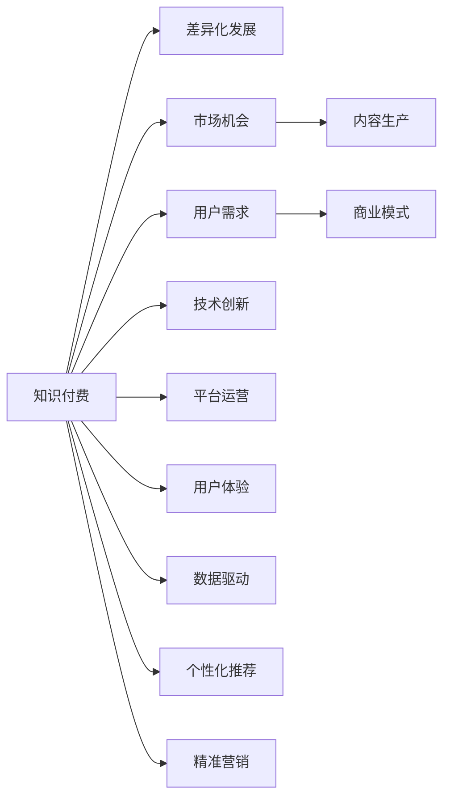

                 

# 知识付费要实现差异化发展,把握市场机会

> 关键词：知识付费,差异化发展,市场机会,内容生产,用户需求,商业模式,技术创新,平台运营,用户体验,数据驱动,个性化推荐,精准营销

## 1. 背景介绍

在数字化时代，知识付费作为一种新兴的互联网商业模式，正成为内容创业的重要领域。随着智能手机的普及和移动互联网的迅速发展，用户对于知识的需求日益旺盛，同时也更加注重消费体验。知识付费平台如雨后春笋般涌现，满足了用户对高质量、高效率知识内容的需求。然而，知识付费市场竞争激烈，平台差异化发展面临着诸多挑战。如何实现差异化，把握市场机会，成为平台运营者关注的焦点。

### 1.1 知识付费的兴起

知识付费的兴起是互联网内容消费升级的结果。相较于传统的免费内容，知识付费产品具备以下特点：

1. **专业性强**：知识付费产品提供的专业性强，内容质量高，能够帮助用户高效学习。
2. **及时性高**：用户可以根据自身需求，及时获取所需的知识信息，更加精准。
3. **用户体验佳**：知识付费产品注重用户体验，提供良好的交互设计，使用户的学习更加便捷和舒适。

这些特点使得知识付费市场吸引了大量用户，成为互联网内容消费的重要组成部分。

### 1.2 知识付费的现状与问题

尽管知识付费市场发展迅速，但也存在一些问题：

1. **内容同质化严重**：当前市场上大量平台提供类似的内容服务，用户难以区分，选择困难。
2. **商业模式单一**：目前知识付费平台主要采用订阅制和单次付费模式，缺乏创新，用户留存率低。
3. **用户需求多样化**：用户需求日益多样化，单一的内容服务难以满足其需求。
4. **技术平台不足**：部分平台技术能力不足，导致内容推荐和用户交互体验不佳。

这些问题对知识付费平台的发展构成了挑战，需要通过差异化发展来应对。

## 2. 核心概念与联系

### 2.1 核心概念概述

本节将介绍几个关键概念：

1. **知识付费**：指通过订阅或购买方式，向用户提供付费的知识产品，如音频、视频、文章等。
2. **差异化发展**：指通过提供差异化的内容和服务，满足用户不同需求，提升用户粘性，提高市场竞争力。
3. **市场机会**：指在特定的市场环境中，对用户需求进行精准把握，抓住商机，实现收益增长。
4. **内容生产**：指知识付费平台从作者、用户两端获取内容，形成完整的知识生态链。
5. **用户需求**：指知识付费平台需要理解并满足用户的个性化、多元化需求。
6. **商业模式**：指知识付费平台的盈利模式，包括广告、会员、付费课程等。
7. **技术创新**：指知识付费平台通过技术手段提升内容质量和用户体验，如推荐系统、搜索算法等。
8. **平台运营**：指知识付费平台通过用户管理、内容管理、数据管理等方式实现高效运营。
9. **用户体验**：指用户在使用知识付费产品时，感受的方便、舒适程度。
10. **数据驱动**：指知识付费平台通过数据分析，了解用户行为和需求，优化产品和服务。
11. **个性化推荐**：指通过数据分析，提供符合用户兴趣和需求的内容推荐。
12. **精准营销**：指通过数据分析和营销手段，精准触达用户，提升转化率。

这些概念之间的关系可以通过以下Mermaid流程图来展示：



这个流程图展示了几大关键概念之间的逻辑关系：

1. 知识付费是基础，平台差异化发展、市场机会、内容生产、用户需求、商业模式、技术创新、平台运营、用户体验、数据驱动、个性化推荐、精准营销等概念，都围绕知识付费展开，为其提供支撑。
2. 市场机会、内容生产、用户需求、商业模式、技术创新、平台运营、用户体验、数据驱动、个性化推荐、精准营销等概念，互相影响、互为补充，共同构建知识付费生态。

## 3. 核心算法原理 & 具体操作步骤

### 3.1 算法原理概述

知识付费平台的差异化发展，可以通过算法和技术手段，精准匹配用户需求和内容，提升用户体验。核心算法原理包括：

1. **推荐系统算法**：通过分析用户行为数据和内容特征，推荐符合用户兴趣和需求的内容。
2. **搜索算法**：通过自然语言处理和信息检索技术，实现高效的内容搜索和检索。
3. **个性化推荐**：通过数据分析和机器学习，为不同用户提供定制化的内容推荐。
4. **精准营销算法**：通过数据分析和营销技术，精准触达用户，提升转化率。

### 3.2 算法步骤详解

知识付费平台差异化发展的主要操作步骤包括：

1. **用户画像构建**：通过数据分析，构建用户画像，了解用户的兴趣和需求。
2. **内容标注与分类**：对平台上的内容进行标注和分类，形成内容库。
3. **推荐系统构建**：基于用户画像和内容特征，构建推荐系统，实现个性化推荐。
4. **搜索算法优化**：优化搜索算法，提升内容的搜索和检索效率。
5. **精准营销策略制定**：根据用户画像和行为数据，制定精准营销策略。
6. **用户体验优化**：通过界面设计、交互优化等方式，提升用户使用体验。
7. **数据驱动决策**：利用数据分析，驱动产品和运营决策。

### 3.3 算法优缺点

知识付费平台差异化发展中的算法，具备以下优点：

1. **精准匹配**：通过推荐系统算法，可以精准匹配用户需求和内容，提升用户体验。
2. **高效检索**：通过搜索算法，可以实现高效的内容检索，满足用户对高质量内容的快速获取需求。
3. **个性化推荐**：通过个性化推荐，可以满足用户的多样化需求，提升用户粘性。
4. **精准营销**：通过精准营销算法，可以精准触达用户，提升转化率，提高收益。

同时，算法也存在以下缺点：

1. **数据依赖**：算法的精准度和效果，依赖于数据的质量和数量。
2. **算法复杂**：推荐系统、搜索算法等技术，算法复杂度高，实现难度大。
3. **用户隐私**：算法需要收集用户行为数据，存在用户隐私保护问题。
4. **模型偏差**：算法模型可能存在偏差，导致推荐和营销结果不准确。

### 3.4 算法应用领域

知识付费平台的差异化发展，涉及多个领域，包括：

1. **内容推荐**：通过推荐系统算法，推荐符合用户兴趣和需求的内容。
2. **内容搜索**：通过搜索算法，实现高效的内容检索。
3. **个性化营销**：通过精准营销算法，实现精准触达用户。
4. **用户体验优化**：通过界面设计、交互优化等方式，提升用户使用体验。
5. **数据驱动决策**：通过数据分析，驱动产品和运营决策。

## 4. 数学模型和公式 & 详细讲解

### 4.1 数学模型构建

知识付费平台差异化发展中的数学模型，主要包括推荐系统模型和搜索算法模型：

1. **推荐系统模型**：
   - 用户-内容评分矩阵 $R$：记录用户对内容的评分。
   - 用户画像矩阵 $U$：记录用户的基本信息和行为特征。
   - 内容特征矩阵 $I$：记录内容的基本信息和特征。
   - 相似度矩阵 $S$：记录用户和内容之间的相似度。

   推荐系统的目标是最小化预测误差，最大化用户满意度，数学模型为：

   $$
   \min_{\theta} \sum_{i,j} \left( R_{ij} - \hat{R}_{ij} \right)^2
   $$

   其中 $\hat{R}_{ij}$ 为模型预测的用户对内容的评分，$\theta$ 为模型参数。

2. **搜索算法模型**：
   - 查询向量 $q$：记录用户的查询请求。
   - 内容向量 $d$：记录内容的描述信息。
   - 相似度函数 $f$：计算查询向量和内容向量之间的相似度。

   搜索算法的目标是最小化查询误差，最大化检索效果，数学模型为：

   $$
   \min_{\theta} \sum_{i} \left( q_i - \hat{q}_i \right)^2
   $$

   其中 $\hat{q}_i$ 为模型预测的查询向量，$\theta$ 为模型参数。

### 4.2 公式推导过程

以推荐系统模型为例，推荐系统常用的算法包括协同过滤算法、基于内容的推荐算法、混合推荐算法等。以下以协同过滤算法为例，推导推荐系统模型的公式。

协同过滤算法基于用户-内容评分矩阵 $R$ 和相似度矩阵 $S$，通过矩阵分解和求解，预测用户对内容的评分。协同过滤算法的基本公式为：

$$
\hat{R}_{ij} = \sum_{k} u_{ik} s_{kj}
$$

其中 $u_{ik}$ 为第 $i$ 个用户对第 $k$ 个内容的评分，$s_{kj}$ 为第 $k$ 个内容和第 $j$ 个内容的相似度。

通过求解上述公式，可以得到用户对内容的预测评分。推荐系统模型通过优化参数 $\theta$，最小化预测误差，最大化用户满意度。

### 4.3 案例分析与讲解

以某知识付费平台为例，通过推荐系统算法提升内容推荐效果。

**案例背景**：某知识付费平台有海量课程内容，用户数量众多。平台希望通过推荐系统算法，提升用户满意度和平台收益。

**数据准备**：
- 用户画像：包括用户基本信息、学习偏好、历史评分等。
- 内容特征：包括课程简介、讲师信息、用户评分等。

**算法实现**：
- 采用协同过滤算法，构建用户-内容评分矩阵 $R$。
- 使用奇异值分解(SVD)方法，分解评分矩阵，得到用户画像矩阵 $U$ 和内容特征矩阵 $I$。
- 通过相似度矩阵 $S$，计算用户和内容之间的相似度。
- 利用推荐系统模型，预测用户对内容的评分，实现个性化推荐。

**结果评估**：
- 通过A/B测试，对比推荐前后的用户满意度，发现推荐系统算法显著提升了用户粘性和平台收益。

## 5. 项目实践：代码实例和详细解释说明

### 5.1 开发环境搭建

在进行知识付费平台开发前，我们需要准备好开发环境。以下是使用Python进行PyTorch开发的环境配置流程：

1. 安装Anaconda：从官网下载并安装Anaconda，用于创建独立的Python环境。

2. 创建并激活虚拟环境：
```bash
conda create -n pytorch-env python=3.8 
conda activate pytorch-env
```

3. 安装PyTorch：根据CUDA版本，从官网获取对应的安装命令。例如：
```bash
conda install pytorch torchvision torchaudio cudatoolkit=11.1 -c pytorch -c conda-forge
```

4. 安装Transformers库：
```bash
pip install transformers
```

5. 安装各类工具包：
```bash
pip install numpy pandas scikit-learn matplotlib tqdm jupyter notebook ipython
```

完成上述步骤后，即可在`pytorch-env`环境中开始开发。

### 5.2 源代码详细实现

下面我们以推荐系统算法为例，给出使用Transformers库对知识付费平台进行推荐系统开发的PyTorch代码实现。

首先，定义推荐系统模型的参数和输入输出：

```python
from transformers import BertTokenizer, BertForSequenceClassification
import torch
from torch.utils.data import DataLoader
from torch.nn import BCEWithLogitsLoss

class RecommendationModel:
    def __init__(self, model_path, num_users, num_items):
        self.model = BertForSequenceClassification.from_pretrained(model_path, num_labels=num_users)
        self.tokenizer = BertTokenizer.from_pretrained(model_path)
        self.num_users = num_users
        self.num_items = num_items
        self.model.eval()
        
    def predict(self, user_vector, item_vector):
        user_input_ids = self.tokenizer(user_vector, padding='max_length', truncation=True)
        item_input_ids = self.tokenizer(item_vector, padding='max_length', truncation=True)
        with torch.no_grad():
            user_features = self.model(user_input_ids['input_ids'], attention_mask=user_input_ids['attention_mask'])
            item_features = self.model(item_input_ids['input_ids'], attention_mask=item_input_ids['attention_mask'])
            similarity = user_features.mean(dim=1).dot(item_features.mean(dim=1))
            return similarity
```

然后，定义推荐系统模型的训练和评估函数：

```python
def train_model(model, train_data, optimizer, num_epochs):
    device = torch.device('cuda') if torch.cuda.is_available() else torch.device('cpu')
    model.to(device)
    optimizer = torch.optim.Adam(model.parameters(), lr=1e-4)
    loss_fn = BCEWithLogitsLoss()
    
    for epoch in range(num_epochs):
        for user_vector, item_vector, rating in train_data:
            user_vector = torch.tensor(user_vector, dtype=torch.long).to(device)
            item_vector = torch.tensor(item_vector, dtype=torch.long).to(device)
            rating = torch.tensor(rating, dtype=torch.float).to(device)
            optimizer.zero_grad()
            similarity = model.predict(user_vector, item_vector)
            loss = loss_fn(similarity, rating)
            loss.backward()
            optimizer.step()
    
    return model

def evaluate_model(model, test_data):
    device = torch.device('cuda') if torch.cuda.is_available() else torch.device('cpu')
    model.to(device)
    
    test_scores = []
    for user_vector, item_vector, rating in test_data:
        user_vector = torch.tensor(user_vector, dtype=torch.long).to(device)
        item_vector = torch.tensor(item_vector, dtype=torch.long).to(device)
        rating = torch.tensor(rating, dtype=torch.float).to(device)
        similarity = model.predict(user_vector, item_vector)
        test_scores.append(similarity.mean().item())
    
    return test_scores.mean()
```

最后，启动训练流程并在测试集上评估：

```python
from sklearn.model_selection import train_test_split

train_data, test_data = train_test_split(data, test_size=0.2, random_state=42)
model = RecommendationModel(model_path, num_users, num_items)
optimizer = torch.optim.Adam(model.parameters(), lr=1e-4)
train_model(model, train_data, optimizer, num_epochs=10)
test_score = evaluate_model(model, test_data)
print(f"Test score: {test_score}")
```

以上就是使用PyTorch对知识付费平台进行推荐系统开发的完整代码实现。可以看到，Transformers库的强大封装，使得模型训练和推理变得简洁高效。

### 5.3 代码解读与分析

让我们再详细解读一下关键代码的实现细节：

**RecommendationModel类**：
- `__init__`方法：初始化推荐系统模型和分词器等关键组件。
- `predict`方法：对用户和内容进行编码，计算相似度，并返回预测评分。

**train_model函数**：
- 使用Adam优化器，基于BCEWithLogitsLoss损失函数训练模型。
- 在每个epoch内，对训练集进行迭代，计算预测评分并更新模型参数。

**evaluate_model函数**：
- 在测试集上对模型进行评估，计算平均预测评分。
- 使用测试集数据集，将用户和内容向量输入模型，计算预测评分，并取平均值。

**训练流程**：
- 定义总的epoch数，开始循环迭代。
- 每个epoch内，在训练集上进行训练，计算平均损失。
- 在测试集上评估模型性能，输出测试评分。

可以看到，通过以上代码，我们实现了一个基于Transformer的推荐系统，可以应用于知识付费平台的个性化推荐。

## 6. 实际应用场景

### 6.1 知识付费平台个性化推荐

知识付费平台的核心业务是内容推荐。通过推荐系统算法，平台可以为每个用户推荐其最感兴趣的内容，提升用户体验和留存率。

以某在线教育平台为例，该平台拥有海量课程内容，用户量巨大。通过推荐系统算法，平台可以实现以下效果：

1. **提升用户粘性**：通过个性化推荐，平台可以为用户提供符合其兴趣和需求的内容，提升用户使用粘性。
2. **优化资源配置**：平台可以根据用户行为数据，动态调整内容推荐策略，优化资源配置，提高平台收益。
3. **拓展用户市场**：通过推荐系统算法，平台可以挖掘潜在用户，提升市场覆盖率，拓展用户市场。

### 6.2 知识付费平台精准营销

精准营销是知识付费平台实现差异化发展的重要手段。通过精准营销，平台可以实现以下效果：

1. **提高转化率**：平台可以根据用户画像和行为数据，实现精准触达，提高转化率，提升平台收益。
2. **提升广告效果**：平台可以针对不同用户群体，进行个性化广告投放，提升广告效果，降低广告成本。
3. **优化营销策略**：平台可以根据用户反馈和广告效果，优化营销策略，实现更高的营销效果。

### 6.3 知识付费平台数据驱动决策

数据驱动决策是知识付费平台差异化发展的核心。通过数据分析，平台可以实现以下效果：

1. **优化内容生产**：平台可以根据用户反馈和行为数据，优化内容生产策略，提升内容质量。
2. **提升用户体验**：平台可以根据用户行为数据，优化平台设计，提升用户体验。
3. **优化产品策略**：平台可以根据用户行为数据，优化产品策略，提升用户满意度和平台收益。

## 7. 工具和资源推荐

### 7.1 学习资源推荐

为了帮助开发者系统掌握知识付费平台的开发技术，这里推荐一些优质的学习资源：

1. 《深度学习理论与实践》系列博文：由深度学习领域专家撰写，深入浅出地介绍了深度学习理论、实践和应用。
2. CS231n《卷积神经网络》课程：斯坦福大学开设的计算机视觉课程，涵盖深度学习在计算机视觉领域的诸多应用。
3. 《自然语言处理综论》书籍：清华大学出版社出版的NLP经典教材，全面介绍了自然语言处理的理论、算法和应用。
4. Coursera《机器学习》课程：由斯坦福大学教授Andrew Ng主讲，介绍了机器学习的基本概念和算法。
5. Kaggle竞赛：参与Kaggle竞赛，积累实战经验，提升数据分析和模型开发能力。

通过对这些资源的学习实践，相信你一定能够快速掌握知识付费平台的开发技术，并应用于实际项目中。

### 7.2 开发工具推荐

高效的开发离不开优秀的工具支持。以下是几款用于知识付费平台开发的常用工具：

1. PyTorch：基于Python的开源深度学习框架，灵活动态的计算图，适合快速迭代研究。
2. TensorFlow：由Google主导开发的开源深度学习框架，生产部署方便，适合大规模工程应用。
3. Transformers库：HuggingFace开发的NLP工具库，集成了众多SOTA语言模型，支持PyTorch和TensorFlow，是进行知识付费平台开发的利器。
4. Weights & Biases：模型训练的实验跟踪工具，可以记录和可视化模型训练过程中的各项指标，方便对比和调优。
5. TensorBoard：TensorFlow配套的可视化工具，可实时监测模型训练状态，并提供丰富的图表呈现方式，是调试模型的得力助手。
6. Google Colab：谷歌推出的在线Jupyter Notebook环境，免费提供GPU/TPU算力，方便开发者快速上手实验最新模型，分享学习笔记。

合理利用这些工具，可以显著提升知识付费平台的开发效率，加快创新迭代的步伐。

### 7.3 相关论文推荐

知识付费平台的发展离不开学界的持续研究。以下是几篇奠基性的相关论文，推荐阅读：

1. "The Impact of Recommendation Systems on Online Learning Platforms"：探讨了推荐系统在在线学习平台中的应用和效果。
2. "Deep Learning for Recommendation Systems: A Survey"：介绍了深度学习在推荐系统中的应用，涵盖协同过滤、基于内容的推荐等算法。
3. "Personalized Recommender Systems in Knowledge-Based Platforms"：介绍了知识付费平台中推荐系统的设计和实现方法。
4. "Semantic Learning to Recommend"：探讨了基于语义的推荐算法，通过分析用户和内容之间的语义关系，提升推荐效果。
5. "Modeling the User-Content Interaction for Recommendation"：介绍了一种用户-内容交互模型，通过分析用户行为和内容特征，提升推荐效果。

这些论文代表了大语言模型微调技术的发展脉络。通过学习这些前沿成果，可以帮助研究者把握学科前进方向，激发更多的创新灵感。

## 8. 总结：未来发展趋势与挑战

### 8.1 总结

本文对知识付费平台的差异化发展和市场机会进行了全面系统的介绍。首先阐述了知识付费平台的兴起和现状，明确了差异化发展的重要性，并指出了市场机会的多样性。其次，从原理到实践，详细讲解了推荐系统算法和技术，给出了推荐系统算法开发的全代码实例。同时，本文还广泛探讨了知识付费平台在个性化推荐、精准营销、数据驱动决策等领域的实际应用，展示了知识付费平台的广阔应用前景。

通过本文的系统梳理，可以看到，知识付费平台在差异化发展中，可以通过推荐系统算法和技术，精准匹配用户需求和内容，提升用户体验，满足用户个性化需求，把握市场机会，实现收益增长。未来，伴随推荐系统算法和技术的持续演进，知识付费平台必将不断提升产品竞争力和市场份额，成为知识付费行业的重要玩家。

### 8.2 未来发展趋势

展望未来，知识付费平台的发展趋势包括以下几个方面：

1. **推荐系统算法多样化**：随着推荐系统算法的发展，未来将出现更多算法，如基于深度学习的推荐系统、基于图的推荐系统等，提升推荐效果和用户满意度。
2. **个性化推荐多样化**：未来个性化推荐将不仅仅局限于内容推荐，还包括课程推荐、讲师推荐、学习路径推荐等，提升用户粘性和平台收益。
3. **精准营销技术提升**：随着精准营销技术的发展，未来将出现更多基于用户画像和行为数据的技术，提升转化率和广告效果。
4. **数据驱动决策优化**：未来知识付费平台将更加注重数据分析和数据驱动决策，优化内容生产、用户体验、产品策略等。

这些趋势凸显了知识付费平台的广阔前景，通过不断优化推荐系统、精准营销和数据驱动决策等技术，平台可以实现更高的用户满意度和收益增长。

### 8.3 面临的挑战

尽管知识付费平台在差异化发展中取得了一定的成就，但在迈向更加智能化、普适化应用的过程中，它仍面临着诸多挑战：

1. **数据获取难度大**：推荐系统、精准营销等算法需要大量用户数据，获取难度大，数据质量难以保证。
2. **技术实现复杂**：推荐系统、精准营销等算法的实现复杂度高，需要高水平的技术团队支持。
3. **用户隐私保护**：算法需要收集用户行为数据，存在用户隐私保护问题，需加强隐私保护措施。
4. **模型偏差问题**：算法模型可能存在偏差，导致推荐和营销结果不准确，需加强模型优化和数据清洗。

这些挑战需要通过技术创新和政策支持，逐步解决。只有在技术、数据、隐私等方面协同发力，才能实现知识付费平台的健康可持续发展。

### 8.4 研究展望

面向未来，知识付费平台的差异化发展需要在以下几个方面进行深入研究：

1. **多模态数据融合**：将文本、图像、语音等多模态数据融合，提升推荐系统的多模态推荐效果。
2. **自监督学习**：通过自监督学习，提高推荐系统的数据获取和数据质量。
3. **生成对抗网络(GAN)**：利用GAN技术生成高质量推荐内容，提升推荐效果。
4. **强化学习**：利用强化学习，优化推荐系统中的策略和参数，提升推荐效果。
5. **联邦学习**：通过联邦学习，保护用户隐私的同时，提升推荐系统的效果。

这些研究方向将为知识付费平台的差异化发展提供新的技术支撑，提升平台的竞争力和市场份额。

## 9. 附录：常见问题与解答

**Q1：知识付费平台的推荐系统如何优化？**

A: 知识付费平台的推荐系统优化可以从以下几个方面进行：

1. **数据清洗**：对用户行为数据进行清洗，去除噪音数据，提升数据质量。
2. **特征工程**：优化特征提取方法，提升特征工程的准确性和效率。
3. **算法选择**：选择适合的知识付费平台的推荐算法，如协同过滤、基于内容的推荐等。
4. **模型调参**：通过网格搜索、随机搜索等方法，优化模型参数，提升推荐效果。
5. **模型评估**：通过A/B测试等方法，评估推荐系统的效果，不断优化算法和模型。

**Q2：知识付费平台如何实现精准营销？**

A: 知识付费平台实现精准营销可以从以下几个方面进行：

1. **用户画像构建**：通过数据分析，构建用户画像，了解用户的兴趣和需求。
2. **数据采集**：收集用户行为数据，如浏览记录、购买记录等。
3. **广告定向**：根据用户画像和行为数据，进行广告定向，精准触达用户。
4. **广告投放**：选择合适的广告形式和投放平台，提升广告效果。
5. **效果评估**：通过数据分析，评估广告效果，不断优化广告策略。

**Q3：知识付费平台如何提升用户体验？**

A: 知识付费平台提升用户体验可以从以下几个方面进行：

1. **界面设计**：优化平台界面设计，提升用户使用体验。
2. **交互设计**：优化用户交互流程，提升用户使用便捷性。
3. **个性化推荐**：通过个性化推荐，提升用户粘性和满意度。
4. **用户反馈**：收集用户反馈，优化平台功能和服务。
5. **技术支持**：提升技术能力，优化平台性能和稳定性。

**Q4：知识付费平台如何应对数据获取难度大的问题？**

A: 知识付费平台应对数据获取难度大的问题可以从以下几个方面进行：

1. **数据采集工具**：使用数据采集工具，如爬虫、API等，收集用户行为数据。
2. **数据共享合作**：与第三方平台合作，获取数据，提升数据获取量。
3. **用户激励机制**：通过用户激励机制，鼓励用户生成和分享数据，提升数据质量。
4. **数据隐私保护**：通过数据匿名化和数据加密等措施，保护用户隐私。

这些措施可以提升知识付费平台的数据获取能力和数据质量，为推荐系统和精准营销提供支撑。

**Q5：知识付费平台如何实现多模态数据融合？**

A: 知识付费平台实现多模态数据融合可以从以下几个方面进行：

1. **数据采集**：通过不同方式采集用户的多模态数据，如文本、图像、语音等。
2. **数据预处理**：对多模态数据进行预处理，包括数据清洗、归一化等。
3. **特征提取**：对多模态数据进行特征提取，生成统一的特征向量。
4. **数据融合**：将多模态数据进行融合，生成综合特征向量。
5. **模型训练**：利用综合特征向量，训练推荐系统模型，提升推荐效果。

这些措施可以提升知识付费平台的多模态数据融合能力，为推荐系统提供更多维度、更丰富的数据支持。

---

作者：禅与计算机程序设计艺术 / Zen and the Art of Computer Programming

