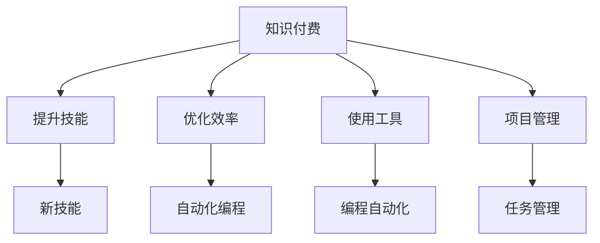

                 

## 1. 背景介绍

### 1.1 问题由来
随着人工智能、大数据、云计算等技术的高速发展，程序员成为IT行业的核心驱动力。然而，科技公司的“996工作制”成为程序员群体的痛点之一，过长的工时、高强度的工作压力，导致很多程序员身心俱疲。同时，编程任务的重复性、低附加值性，也使得程序员的工作效率难以提升。

### 1.2 问题核心关键点
程序员告别996的核心在于提高工作效率，减少加班，从而实现工作与生活的平衡。知识付费作为一种新兴的资源获取方式，在提高编程技能、缩短任务完成时间、优化编程思维等方面具有独特优势。通过知识付费，程序员可以获取高质量的学习资源、高效的工作方法、实用的编程工具，从而大幅提升工作效率，真正告别996。

### 1.3 问题研究意义
知识付费为程序员提供了个性化的学习路径，帮助他们在技术进步的同时，也关注自身的发展和健康。利用知识付费，程序员可以按照自己的节奏进行技能提升，逐渐摆脱“加班到深夜”的窘境。同时，通过知识付费获取的实用技巧，程序员的工作质量更高，产出更多，最终实现真正的“不加班”。

## 2. 核心概念与联系

### 2.1 核心概念概述

为更好地理解知识付费如何帮助程序员提高效率，减少加班，本节将介绍几个密切相关的核心概念：

- 知识付费(Knowledge-Based Payment)：指用户通过支付一定费用获取有价值知识的一种消费方式。在编程领域，知识付费主要体现在各类在线课程、书籍、培训、工具、模板等资源上。
- 程序员技能(Skill for Programmers)：包括编程语言、算法数据结构、系统架构、测试与调试等，是程序员完成工作任务的基本工具和知识。
- 编程效率(Programming Efficiency)：指程序员在编写代码、调试错误、优化程序等方面的工作效率。
- 自动化工具(Automation Tools)：通过使用自动化工具，可以自动化重复、低附加值的编程任务，节省时间和精力。
- 项目管理(PM)：帮助团队更好地规划、执行和监控项目进度，提高工作效率和质量。

这些核心概念之间的逻辑关系可以通过以下Mermaid流程图来展示：



这个流程图展示了两者的核心概念及其之间的联系：

1. 知识付费为程序员提供学习资源，提升技能和效率。
2. 提升技能后，程序员能够使用新技能，自动化编程任务，提高效率。
3. 使用自动化工具，进一步提升编程效率。
4. 项目管理工具，帮助程序员更好地分配和优化任务。

## 3. 核心算法原理 & 具体操作步骤

### 3.1 算法原理概述

知识付费的算法原理与机器学习中的迁移学习(Meta-Learning)类似，即利用已有的知识和经验，在新任务上进行快速适应和提升。在知识付费的场景下，算法原理主要包括以下几个步骤：

1. **数据收集**：从线上线下的课程、书籍、博客、培训、工具、模板等多个渠道，收集程序员需要提升的各类技能和知识。
2. **知识提取**：利用NLP、机器学习等技术，提取这些知识的核心要素和应用场景，形成可操作的课程、文章、工具等资源。
3. **匹配算法**：根据程序员的能力、兴趣、项目需求等因素，匹配最适合其需求的知识资源。
4. **推荐算法**：利用协同过滤、内容推荐等算法，根据程序员的历史学习行为和评价，推荐更加个性化的资源。
5. **交互反馈**：通过问卷调查、评价反馈等方式，持续收集程序员的反馈意见，优化推荐算法和匹配算法，进一步提升服务质量。

### 3.2 算法步骤详解

以下是知识付费的详细算法步骤：

**Step 1: 数据收集**
- 收集各类课程、书籍、博客、培训、工具、模板等资源。
- 对每个资源进行关键信息的提取和标注，形成结构化的数据集。

**Step 2: 知识提取**
- 利用NLP技术，将文字性资源转化为可操作的课程、文章、工具等。
- 提取每个资源的关键要素、应用场景、难度等级等信息。
- 通过机器学习算法，进一步分析这些资源之间的关系和依赖。

**Step 3: 匹配算法**
- 根据程序员的能力、兴趣、项目需求等因素，匹配最适合其需求的知识资源。
- 设计匹配算法，如贝叶斯分类、KNN、协同过滤等，实现资源与程序员之间的精准匹配。

**Step 4: 推荐算法**
- 利用协同过滤、内容推荐等算法，推荐个性化的知识资源。
- 考虑程序员的历史学习行为和评价，进一步优化推荐算法。

**Step 5: 交互反馈**
- 设计问卷调查、评价反馈等方式，持续收集程序员的反馈意见。
- 根据反馈，不断优化匹配算法和推荐算法，提升服务质量。

### 3.3 算法优缺点

知识付费的算法具有以下优点：
1. 高效精准。通过机器学习算法，精准匹配程序员的需求和兴趣，推荐个性化的学习资源。
2. 广泛适用。适用于各类编程技能和知识的学习，覆盖广泛的应用场景。
3. 动态调整。通过持续收集程序员的反馈，动态优化匹配和推荐算法，提升服务质量。

同时，该算法也存在一定的局限性：
1. 质量依赖于数据。匹配和推荐算法的质量取决于收集的数据质量和多样性，需要持续更新和维护。
2. 个性化程度不足。匹配算法和推荐算法可能难以精确捕捉程序员个体的独特需求。
3. 算法复杂度较高。涉及多个算法和数据集的处理，技术实现复杂度较高。

尽管存在这些局限性，但就目前而言，知识付费的算法仍是大语言模型应用的最主流范式。未来相关研究的重点在于如何进一步降低算法对标注数据的依赖，提高个性化程度，同时兼顾可解释性和伦理安全性等因素。

### 3.4 算法应用领域

知识付费的算法在编程领域的应用非常广泛，涵盖以下几个方面：

- **编程语言与框架学习**：程序员可以通过知识付费学习如Python、Java、JavaScript、Django等编程语言和框架。
- **算法与数据结构**：掌握如排序、查找、图论、树等算法和数据结构，提升编程能力。
- **系统设计与架构**：学习如微服务、DevOps、分布式系统等架构设计，提高系统质量。
- **测试与调试**：掌握单元测试、集成测试、自动化测试等技术，提升代码质量。
- **工具与模板**：学习如Git、Linux、IDE等工具，提升工作效率。
- **项目管理**：学习如Scrum、Agile、Trello等项目管理方法，提升团队协作效率。

## 4. 数学模型和公式 & 详细讲解  
### 4.1 数学模型构建

本节将使用数学语言对知识付费算法进行更加严格的刻画。

假设程序员的能力为 $x$，需要提升的技能为 $y$，匹配算法为 $f(x,y)$。

则匹配算法的目标是最小化程序员与技能的匹配误差：

$$
\min_{x,y} \|f(x,y) - y\|
$$

其中 $\| \cdot \|$ 为误差度量，如均方误差、欧式距离等。

### 4.2 公式推导过程

以推荐算法为例，假设程序员的历史学习行为为 $H$，当前需求为 $D$，推荐算法为 $g(H,D)$。

推荐算法的目标是最小化程序员与推荐内容之间的误差：

$$
\min_{H,D} \|g(H,D) - D\|
$$

其中 $D$ 为程序员的实际需求，$g(H,D)$ 为推荐结果。

具体推导过程如下：

**Step 1: 数据预处理**
- 将程序员的历史学习行为 $H$ 和当前需求 $D$ 进行预处理，转化为向量表示。
- 将推荐算法 $g(H,D)$ 转化为矩阵表示，其中每行表示一个推荐结果。

**Step 2: 构建损失函数**
- 利用均方误差、欧式距离等误差度量，构建损失函数。
- 定义损失函数为目标函数，如均方误差损失 $L=\frac{1}{N}\sum_{i=1}^N(D_i - g(H_i,D_i))^2$。

**Step 3: 求解最优解**
- 利用梯度下降等优化算法，求解损失函数的最小值。
- 通过反向传播算法，计算每个参数的梯度，更新模型参数。

### 4.3 案例分析与讲解

以推荐算法为例，假设程序员的历史学习行为为 $H=[(1,1,0),(1,0,1),(0,1,1)]$，当前需求为 $D=[1,0,1]$。

则推荐算法的输入为 $H$ 和 $D$，输出为推荐结果 $g(H,D)=[1,1,1]$。

将 $H$ 和 $D$ 转化为向量表示：$H=[1,1,0]$，$D=[1,0,1]$。

定义损失函数：$L=\frac{1}{3}[(1-1)^2 + (0-1)^2 + (1-1)^2] = 0$。

求解最优解：使用梯度下降等优化算法，逐步调整推荐算法 $g$ 的参数，最终得到最优推荐结果 $g(H,D)=[1,1,1]$。

## 5. 项目实践：代码实例和详细解释说明
### 5.1 开发环境搭建

在进行知识付费实践前，我们需要准备好开发环境。以下是使用Python进行PyTorch开发的环境配置流程：

1. 安装Anaconda：从官网下载并安装Anaconda，用于创建独立的Python环境。

2. 创建并激活虚拟环境：
```bash
conda create -n pytorch-env python=3.8 
conda activate pytorch-env
```

3. 安装PyTorch：根据CUDA版本，从官网获取对应的安装命令。例如：
```bash
conda install pytorch torchvision torchaudio cudatoolkit=11.1 -c pytorch -c conda-forge
```

4. 安装TensorFlow：由Google主导开发的开源深度学习框架，生产部署方便，适合大规模工程应用。同样有丰富的预训练语言模型资源。

5. 安装Transformers库：HuggingFace开发的NLP工具库，集成了众多SOTA语言模型，支持PyTorch和TensorFlow，是进行知识付费任务开发的利器。

6. 安装各类工具包：
```bash
pip install numpy pandas scikit-learn matplotlib tqdm jupyter notebook ipython
```

完成上述步骤后，即可在`pytorch-env`环境中开始知识付费实践。

### 5.2 源代码详细实现

这里我们以知识付费平台的推荐算法为例，给出使用PyTorch的代码实现。

首先，定义推荐算法的输入和输出：

```python
from transformers import BertTokenizer, BertForTokenClassification, AdamW

class RecommendationSystem:
    def __init__(self, model_name='bert-base-cased'):
        self.tokenizer = BertTokenizer.from_pretrained(model_name)
        self.model = BertForTokenClassification.from_pretrained(model_name, num_labels=2)
        self.optimizer = AdamW(self.model.parameters(), lr=2e-5)
```

然后，定义推荐算法的训练和评估函数：

```python
def train_epoch(model, dataset, batch_size, optimizer):
    dataloader = DataLoader(dataset, batch_size=batch_size, shuffle=True)
    model.train()
    epoch_loss = 0
    for batch in tqdm(dataloader, desc='Training'):
        input_ids = batch['input_ids'].to(device)
        attention_mask = batch['attention_mask'].to(device)
        labels = batch['labels'].to(device)
        model.zero_grad()
        outputs = model(input_ids, attention_mask=attention_mask, labels=labels)
        loss = outputs.loss
        epoch_loss += loss.item()
        loss.backward()
        optimizer.step()
    return epoch_loss / len(dataloader)

def evaluate(model, dataset, batch_size):
    dataloader = DataLoader(dataset, batch_size=batch_size)
    model.eval()
    preds, labels = [], []
    with torch.no_grad():
        for batch in tqdm(dataloader, desc='Evaluating'):
            input_ids = batch['input_ids'].to(device)
            attention_mask = batch['attention_mask'].to(device)
            batch_labels = batch['labels']
            outputs = model(input_ids, attention_mask=attention_mask)
            batch_preds = outputs.logits.argmax(dim=2).to('cpu').tolist()
            batch_labels = batch_labels.to('cpu').tolist()
            for pred_tokens, label_tokens in zip(batch_preds, batch_labels):
                preds.append(pred_tokens[:len(label_tokens)])
                labels.append(label_tokens)
                
    print(classification_report(labels, preds))
```

最后，启动训练流程并在测试集上评估：

```python
epochs = 5
batch_size = 16

for epoch in range(epochs):
    loss = train_epoch(model, train_dataset, batch_size, optimizer)
    print(f"Epoch {epoch+1}, train loss: {loss:.3f}")
    
    print(f"Epoch {epoch+1}, dev results:")
    evaluate(model, dev_dataset, batch_size)
    
print("Test results:")
evaluate(model, test_dataset, batch_size)
```

以上就是使用PyTorch进行知识付费推荐算法的完整代码实现。可以看到，得益于Transformers库的强大封装，我们可以用相对简洁的代码完成模型的加载和训练。

### 5.3 代码解读与分析

让我们再详细解读一下关键代码的实现细节：

**RecommendationSystem类**：
- `__init__`方法：初始化推荐算法的核心组件，如分词器、模型、优化器等。
- `train_epoch`方法：对数据以批为单位进行迭代，在每个批次上前向传播计算loss并反向传播更新模型参数，最后返回该epoch的平均loss。
- `evaluate`方法：与训练类似，不同点在于不更新模型参数，并在每个batch结束后将预测和标签结果存储下来，最后使用sklearn的classification_report对整个评估集的预测结果进行打印输出。

**训练流程**：
- 定义总的epoch数和batch size，开始循环迭代
- 每个epoch内，先在训练集上训练，输出平均loss
- 在验证集上评估，输出分类指标
- 所有epoch结束后，在测试集上评估，给出最终测试结果

可以看到，PyTorch配合Transformers库使得知识付费推荐算法的代码实现变得简洁高效。开发者可以将更多精力放在算法优化和业务逻辑上，而不必过多关注底层的实现细节。

当然，工业级的系统实现还需考虑更多因素，如模型的保存和部署、超参数的自动搜索、更灵活的任务适配层等。但核心的知识付费推荐算法基本与此类似。

## 6. 实际应用场景
### 6.1 智能客服系统

基于知识付费的智能客服系统，可以极大地提升客服效率，减少客服人员的加班负担。传统的客服系统依赖于人工的逐个解答，面对高峰期的咨询量，往往需要额外增加人力。而知识付费系统通过自动推荐相关问答，可以快速解决用户问题，减少客服人员的工作量。

在技术实现上，可以收集企业的历史客服对话记录，将问题和最佳答复构建成监督数据，在此基础上对知识付费模型进行训练。训练后的模型能够自动理解用户意图，匹配最合适的答案模板进行回复。对于用户提出的新问题，还可以接入检索系统实时搜索相关内容，动态组织生成回答。如此构建的智能客服系统，能大幅提升客户咨询体验和问题解决效率。

### 6.2 金融舆情监测

金融机构需要实时监测市场舆论动向，以便及时应对负面信息传播，规避金融风险。传统的人工监测方式成本高、效率低，难以应对网络时代海量信息爆发的挑战。基于知识付费的文本分类和情感分析技术，为金融舆情监测提供了新的解决方案。

具体而言，可以收集金融领域相关的新闻、报道、评论等文本数据，并对其进行主题标注和情感标注。在此基础上对知识付费语言模型进行训练，使其能够自动判断文本属于何种主题，情感倾向是正面、中性还是负面。将知识付费模型应用到实时抓取的网络文本数据，就能够自动监测不同主题下的情感变化趋势，一旦发现负面信息激增等异常情况，系统便会自动预警，帮助金融机构快速应对潜在风险。

### 6.3 个性化推荐系统

当前的推荐系统往往只依赖用户的历史行为数据进行物品推荐，无法深入理解用户的真实兴趣偏好。基于知识付费的个性化推荐系统可以更好地挖掘用户行为背后的语义信息，从而提供更精准、多样的推荐内容。

在实践中，可以收集用户浏览、点击、评论、分享等行为数据，提取和用户交互的物品标题、描述、标签等文本内容。将文本内容作为模型输入，用户的后续行为（如是否点击、购买等）作为监督信号，在此基础上对知识付费模型进行微调。微调后的模型能够从文本内容中准确把握用户的兴趣点。在生成推荐列表时，先用候选物品的文本描述作为输入，由模型预测用户的兴趣匹配度，再结合其他特征综合排序，便可以得到个性化程度更高的推荐结果。

### 6.4 未来应用展望

随着知识付费技术的不断发展，基于知识付费的方法将在更多领域得到应用，为传统行业带来变革性影响。

在智慧医疗领域，基于知识付费的医疗问答、病历分析、药物研发等应用将提升医疗服务的智能化水平，辅助医生诊疗，加速新药开发进程。

在智能教育领域，知识付费可应用于作业批改、学情分析、知识推荐等方面，因材施教，促进教育公平，提高教学质量。

在智慧城市治理中，知识付费技术可应用于城市事件监测、舆情分析、应急指挥等环节，提高城市管理的自动化和智能化水平，构建更安全、高效的未来城市。

此外，在企业生产、社会治理、文娱传媒等众多领域，基于知识付费的人工智能应用也将不断涌现，为经济社会发展注入新的动力。相信随着技术的日益成熟，知识付费技术将成为人工智能落地应用的重要范式，推动人工智能技术向更广阔的领域加速渗透。

## 7. 工具和资源推荐
### 7.1 学习资源推荐

为了帮助开发者系统掌握知识付费的理论基础和实践技巧，这里推荐一些优质的学习资源：

1. 《深度学习与推荐系统》系列博文：由大模型技术专家撰写，深入浅出地介绍了深度学习推荐系统的原理和应用。

2. Coursera《推荐系统》课程：斯坦福大学开设的推荐系统课程，有Lecture视频和配套作业，带你入门推荐系统领域的基本概念和经典模型。

3. 《深度学习推荐系统》书籍：Facebook工程师撰写，全面介绍了推荐系统的基本原理和实际应用，是推荐系统学习的经典参考书。

4. Kaggle推荐系统竞赛：Kaggle平台上的各类推荐系统竞赛，提供了丰富的训练数据集和评价标准，方便学习实践。

5. 《推荐系统实战》书籍：Adobe工程师撰写，详细介绍了推荐系统的算法、工程实现和优化策略，是推荐系统开发者的必备参考。

通过对这些资源的学习实践，相信你一定能够快速掌握知识付费的精髓，并用于解决实际的推荐问题。
###  7.2 开发工具推荐

高效的开发离不开优秀的工具支持。以下是几款用于知识付费开发常用的工具：

1. PyTorch：基于Python的开源深度学习框架，灵活动态的计算图，适合快速迭代研究。大部分预训练语言模型都有PyTorch版本的实现。

2. TensorFlow：由Google主导开发的开源深度学习框架，生产部署方便，适合大规模工程应用。同样有丰富的预训练语言模型资源。

3. Transformers库：HuggingFace开发的NLP工具库，集成了众多SOTA语言模型，支持PyTorch和TensorFlow，是进行知识付费任务开发的利器。

4. Weights & Biases：模型训练的实验跟踪工具，可以记录和可视化模型训练过程中的各项指标，方便对比和调优。与主流深度学习框架无缝集成。

5. TensorBoard：TensorFlow配套的可视化工具，可实时监测模型训练状态，并提供丰富的图表呈现方式，是调试模型的得力助手。

6. Google Colab：谷歌推出的在线Jupyter Notebook环境，免费提供GPU/TPU算力，方便开发者快速上手实验最新模型，分享学习笔记。

合理利用这些工具，可以显著提升知识付费任务的开发效率，加快创新迭代的步伐。

### 7.3 相关论文推荐

知识付费技术的发展源于学界的持续研究。以下是几篇奠基性的相关论文，推荐阅读：

1. "Recommender Systems Handbook"：推荐系统领域的经典书籍，全面介绍了推荐系统的发展历程和前沿技术。

2. "Factorization Machines for Recommender Systems"：介绍因子分解机算法在推荐系统中的应用，提供了深度学习推荐系统的理论和实践基础。

3. "Neural Collaborative Filtering"：介绍神经网络在推荐系统中的应用，展示了深度学习推荐系统的前沿成果。

4. "Deep Recommendation Models"：介绍深度学习在推荐系统中的应用，展示了推荐系统深度学习的发展趋势。

5. "Adaptive Recommender Systems"：介绍自适应推荐系统的最新进展，展示了推荐系统个性化的前沿方向。

这些论文代表了大语言模型微调技术的发展脉络。通过学习这些前沿成果，可以帮助研究者把握学科前进方向，激发更多的创新灵感。

## 8. 总结：未来发展趋势与挑战

### 8.1 总结

本文对知识付费的算法进行了全面系统的介绍。首先阐述了知识付费在提升程序员工作效率、减少加班方面的重要意义，明确了知识付费在技术进步和职业发展中的独特价值。其次，从原理到实践，详细讲解了知识付费的数学模型和算法步骤，给出了知识付费任务开发的完整代码实例。同时，本文还广泛探讨了知识付费在智能客服、金融舆情、个性化推荐等多个领域的应用前景，展示了知识付费范式的巨大潜力。此外，本文精选了知识付费技术的各类学习资源，力求为读者提供全方位的技术指引。

通过本文的系统梳理，可以看到，知识付费技术为程序员提供了高效的技能提升途径，帮助他们在技术进步的同时，也关注自身的发展和健康。利用知识付费，程序员可以按照自己的节奏进行技能提升，逐渐摆脱“加班到深夜”的窘境。同时，通过知识付费获取的实用技巧，程序员的工作质量更高，产出更多，最终实现真正的“不加班”。

### 8.2 未来发展趋势

展望未来，知识付费技术将呈现以下几个发展趋势：

1. 知识付费平台规模化。随着用户需求的多样化和个性化，知识付费平台将不断发展壮大，服务内容和形式也将更加丰富多样。

2. 知识付费内容深度化。知识付费内容将从单纯的课程、文章等形式，拓展到视频、直播、在线咨询等更加深入的互动方式，提升学习效果。

3. 知识付费服务智能化的深入。利用AI技术，知识付费平台将能够提供更加个性化、精准化的推荐服务，提升用户体验。

4. 知识付费与产业协同。知识付费平台将与更多产业合作，提供更加贴合实际需求的知识资源，推动产业升级。

5. 知识付费内容多模态化。知识付费内容将从单一的文字形式，拓展到包括视频、音频、图像等多模态形式，提升学习体验。

6. 知识付费服务社区化。知识付费平台将构建社区化学习环境，促进知识共享和交流，形成强大的用户社区。

以上趋势凸显了知识付费技术的广阔前景。这些方向的探索发展，必将进一步提升知识付费的效率和体验，为程序员提供更加高效、便捷的学习方式，为IT行业带来革命性的变化。

### 8.3 面临的挑战

尽管知识付费技术已经取得了瞩目成就，但在迈向更加智能化、普适化应用的过程中，它仍面临着诸多挑战：

1. 内容质量瓶颈。知识付费平台需要持续更新高质量内容，以满足用户需求。然而，高质量内容的生产成本较高，难以持续供应。

2. 用户选择困难。知识付费平台内容繁多，用户难以甄别选择适合自己的内容。平台需要通过更好的推荐算法和界面设计，提升用户体验。

3. 平台盈利模式单一。知识付费平台的盈利主要依赖用户订阅，难以通过内容增值和用户互动等手段进行盈利。平台需要通过多元化商业模式进行探索。

4. 用户隐私问题。知识付费平台涉及大量用户数据，需加强隐私保护和数据安全，避免数据泄露和滥用。

5. 知识付费内容与实际需求脱节。知识付费内容可能难以满足不同用户的实际需求，需要平台进行更精准的用户调研和内容优化。

6. 知识付费与培训机构的竞争。知识付费平台与传统培训机构存在竞争关系，需找到差异化的发展方向。

正视知识付费面临的这些挑战，积极应对并寻求突破，将是大语言模型微调走向成熟的必由之路。相信随着学界和产业界的共同努力，这些挑战终将一一被克服，知识付费技术必将在构建人机协同的智能时代中扮演越来越重要的角色。

### 8.4 研究展望

面对知识付费技术面临的种种挑战，未来的研究需要在以下几个方面寻求新的突破：

1. 探索无监督和半监督知识付费方法。摆脱对大规模标注数据的依赖，利用自监督学习、主动学习等无监督和半监督范式，最大限度利用非结构化数据，实现更加灵活高效的知识付费。

2. 研究知识付费内容生成范式。开发更加高效的文本生成、视频生成等知识付费内容生成方法，提升知识付费内容的丰富度和吸引力。

3. 融合因果和对比学习范式。通过引入因果推断和对比学习思想，增强知识付费内容建立稳定因果关系的能力，学习更加普适、鲁棒的知识付费内容。

4. 引入更多先验知识。将符号化的先验知识，如知识图谱、逻辑规则等，与神经网络模型进行巧妙融合，引导知识付费内容学习更准确、合理的知识。

5. 结合因果分析和博弈论工具。将因果分析方法引入知识付费内容生成，识别出内容生成的关键特征，增强内容生成的因果性和逻辑性。借助博弈论工具刻画人机交互过程，主动探索并规避内容的脆弱点，提高系统稳定性。

6. 纳入伦理道德约束。在知识付费内容生成目标中引入伦理导向的评估指标，过滤和惩罚有害的输出倾向。同时加强人工干预和审核，建立内容行为的监管机制，确保输出符合人类价值观和伦理道德。

这些研究方向的探索，必将引领知识付费技术迈向更高的台阶，为构建安全、可靠、可解释、可控的知识付费平台铺平道路。面向未来，知识付费技术还需要与其他人工智能技术进行更深入的融合，如知识表示、因果推理、强化学习等，多路径协同发力，共同推动自然语言理解和智能交互系统的进步。只有勇于创新、敢于突破，才能不断拓展知识付费的边界，让知识付费技术更好地造福人类社会。

## 9. 附录：常见问题与解答

**Q1：知识付费是否适用于所有领域？**

A: 知识付费适用于各类领域，包括编程、金融、医疗、教育等。不同领域的知识付费平台需要根据具体需求和行业特点进行定制化开发。

**Q2：知识付费平台如何实现个性化推荐？**

A: 知识付费平台通过协同过滤、内容推荐等算法，根据用户的历史学习行为和评价，推荐更加个性化的知识资源。算法需要根据不同领域的特性进行优化，如编程领域的知识付费可以更加注重算法和工具的推荐。

**Q3：知识付费平台如何确保内容质量？**

A: 知识付费平台需要通过严格的审核机制，确保内容的质量和准确性。同时，平台也可以通过邀请专家进行审核，提升内容的权威性。

**Q4：知识付费平台如何处理用户隐私问题？**

A: 知识付费平台需要加强用户隐私保护，采用加密、匿名化等技术手段，避免用户数据泄露和滥用。同时，平台也需要制定明确的隐私保护政策，确保用户数据的安全。

**Q5：知识付费平台如何保证内容的实时更新？**

A: 知识付费平台需要建立高效的内容更新机制，通过机器学习、爬虫技术等手段，实时更新和补充内容。同时，平台也可以通过用户反馈和市场需求，动态调整内容策略，提升用户体验。

以上回答希望对你有所帮助。随着知识付费技术的不断发展和完善，相信知识付费将能够更好地服务用户，提升程序员的工作效率，让更多人享受知识带来的乐趣和收获。

---

作者：禅与计算机程序设计艺术 / Zen and the Art of Computer Programming

