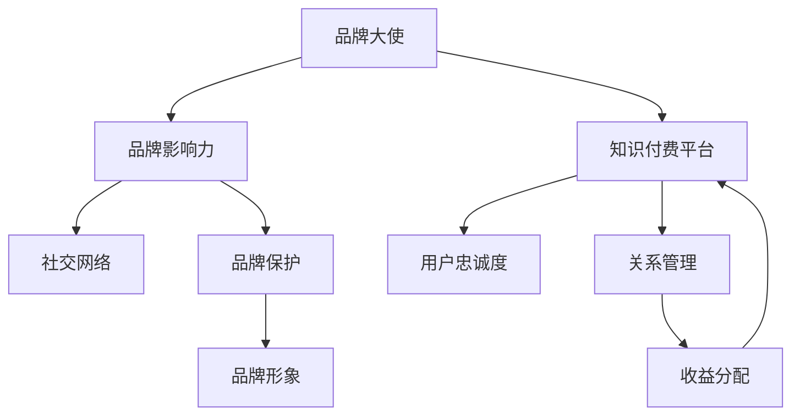

                 

# 知识付费赚钱的品牌ambassador招募与管理策略

## 1. 背景介绍

### 1.1 问题由来

随着互联网和信息技术的飞速发展，知识付费成为一种快速增长的新业态。作为知识经济的重要组成部分，知识付费不仅满足了人们对于知识的渴望，同时也为内容创作者提供了新的收入途径。但随之而来的是，如何选择和维护合适的品牌大使（Brand Ambassador），提升品牌影响力，扩大市场份额，成为知识付费平台亟需解决的关键问题。

### 1.2 问题核心关键点

品牌大使是一类专门为品牌代言、推广的个体或团队。他们通常具有较高的知名度和影响力，能通过自己的社交网络、专业背景或粉丝基础，帮助品牌扩大市场影响力。在知识付费领域，品牌大使尤为重要，能够显著提升平台内容和品牌的曝光度和吸引力。

品牌大使的招募与管理策略直接影响到知识付费平台的市场表现和用户忠诚度。本文将从品牌大使的角色定位、招募流程、关系管理、收益分配和品牌保护等方面，详细介绍一套全面、科学的知识付费品牌大使招募与管理策略，帮助平台有效提升品牌影响力和商业价值。

## 2. 核心概念与联系

### 2.1 核心概念概述

为了更好地理解品牌大使的招募与管理策略，本节将介绍几个密切相关的核心概念：

- 品牌大使（Brand Ambassador）：代表品牌形象、代言和推广品牌的专业人士或团队。品牌大使通常具备较高的知名度、良好的口碑和广泛的影响力。
- 品牌影响力（Brand Influence）：品牌大使通过其社交网络、专业背书和粉丝基础，能够显著提升品牌的知名度和用户信任度。
- 知识付费平台（Knowledge Pay Platform）：通过平台化的方式，向用户提供专业内容付费服务的平台。
- 用户忠诚度（User Loyalty）：指用户对知识付费平台的粘性和忠诚程度，反映了平台的市场竞争力和用户满意度。
- 社交网络（Social Network）：指品牌大使通过各种社交媒体平台，建立和维护与粉丝之间的互动和联系。
- 关系管理（Relationship Management）：指品牌大使与平台之间的相互沟通、合作和协调，确保双方利益最大化。
- 收益分配（Revenue Sharing）：指品牌大使与知识付费平台之间的利益分配机制，包括提成比例、激励措施等。
- 品牌保护（Brand Protection）：指品牌大使需遵守平台规定的行为规范，保护品牌形象不受损害。

这些核心概念之间的逻辑关系可以通过以下Mermaid流程图来展示：



这个流程图展示了这个框架中各个核心概念之间的相互作用：

1. 品牌大使通过其影响力为品牌增加知名度。
2. 知识付费平台通过品牌大使扩大用户基础，提升用户忠诚度。
3. 平台与品牌大使通过关系管理建立合作关系，确保共同目标。
4. 收益分配确保品牌大使的积极性和满意度。
5. 品牌保护维护品牌形象，避免负面影响。

## 3. 核心算法原理 & 具体操作步骤

### 3.1 算法原理概述

品牌大使的招募与管理策略本质是一种多目标优化问题。其核心思想是：通过选择合适的品牌大使，建立长期稳定的合作关系，最大化品牌的市场影响力、用户忠诚度和收益。

形式化地，设品牌大使集合为 $\mathcal{A}$，知识付费平台为 $P$，品牌影响力为 $I$，用户忠诚度为 $L$，收益为 $R$。品牌大使招募与管理的目标是最大化以下目标函数：

$$
\max_{a \in \mathcal{A}, p \in P} I(a, p) \cdot L(a, p) \cdot R(a, p)
$$

其中 $I(a, p)$ 表示品牌大使 $a$ 在平台 $p$ 上的品牌影响力，$L(a, p)$ 表示品牌大使与平台之间的用户忠诚度，$R(a, p)$ 表示品牌大使与平台之间的收益分配。

### 3.2 算法步骤详解

品牌大使的招募与管理策略主要包括四个关键步骤：

**Step 1: 品牌大使筛选与评估**
- 根据平台需求和目标，筛选出符合条件的品牌大使候选者，如知名KOL、行业专家、活跃内容创作者等。
- 对候选者进行全面评估，包括专业知识、社交影响力、粉丝互动情况等。
- 通过定量和定性分析，筛选出最有潜力的品牌大使。

**Step 2: 品牌大使合作策略设计**
- 设计合适的合作策略，明确品牌大使的职责、权利和义务。
- 确定品牌大使的推广内容、推广渠道和时间安排。
- 制定绩效考核指标，如推广效果、用户反馈、互动频率等。

**Step 3: 品牌大使激励与关系管理**
- 设定合理的收益分配机制，如固定分成、按比例提成等。
- 提供必要的资源支持，如推广材料、数据分析工具等。
- 建立定期的沟通渠道，如周报、月度汇报等，确保合作顺利进行。
- 及时解决问题，避免负面影响，确保双方合作关系持续稳定。

**Step 4: 品牌大使评估与优化**
- 定期评估品牌大使的推广效果和用户忠诚度，进行数据统计和分析。
- 根据评估结果，调整品牌大使的推广策略和资源分配。
- 引入竞争机制，激发品牌大使的积极性和创造力。
- 对表现突出的品牌大使给予奖励，如晋升、奖金等。

### 3.3 算法优缺点

品牌大使的招募与管理策略具有以下优点：
1. 提升品牌影响力。通过与知名品牌大使合作，可以快速提升平台的知名度和市场份额。
2. 扩大用户基础。品牌大使的粉丝群体可以转化为平台的付费用户，增加平台的用户基数。
3. 提高用户忠诚度。品牌大使的专业背书和个性化推荐，能够增强用户对平台的信任和黏性。
4. 提高收益。品牌大使的推广效果显著，能够带来更多付费用户和广告收入。

但该策略也存在一定的局限性：
1. 招募成本高。需要花费大量时间和资源筛选和评估合适的品牌大使，增加了运营成本。
2. 管理复杂。品牌大使的管理和激励需要持续投入人力和资源，增加了平台的管理负担。
3. 依赖性强。平台对品牌大使的依赖较大，一旦合作关系破裂，影响平台市场表现。
4. 品牌风险。品牌大使的行为风险和负面影响，可能对品牌形象造成损害。

尽管存在这些局限性，但就目前而言，品牌大使的招募与管理策略仍然是知识付费平台提升品牌影响力和商业价值的重要手段。未来相关研究的重点在于如何进一步降低招募和管理成本，提高品牌大使的忠诚度和市场覆盖度，同时兼顾品牌安全和用户满意度。

### 3.4 算法应用领域

品牌大使的招募与管理策略不仅适用于知识付费平台，还广泛应用于其他商业领域，如电子商务、旅游、餐饮等。以下列举几个具体应用场景：

- 电子商务平台：通过与知名网红或专家合作，推广平台商品，吸引新用户，提升用户忠诚度和消费转化率。
- 旅游平台：邀请旅游博主或达人，推广旅游产品和服务，增加平台的用户基数和品牌知名度。
- 餐饮品牌：与美食博主或推荐者合作，展示品牌菜品，提高用户口碑和品牌曝光度。
- 媒体公司：通过与知名媒体人或作者合作，推广图书或内容，扩大读者基础，提升品牌影响力。

这些领域都有较强的品牌推广需求，品牌大使的招募与管理策略能够显著提升品牌形象和市场竞争力。

## 4. 数学模型和公式 & 详细讲解 & 举例说明（备注：数学公式请使用latex格式，latex嵌入文中独立段落使用 $$，段落内使用 $)
### 4.1 数学模型构建

品牌大使招募与管理策略的数学模型构建主要包括：

- 品牌影响力模型：利用社交网络分析工具，计算品牌大使在平台上的影响力。
- 用户忠诚度模型：基于用户行为数据，建立品牌大使与用户之间的忠诚度关系。
- 收益分配模型：根据品牌大使的推广效果，设计合理的收益分配机制。

### 4.2 公式推导过程

以下我们以社交网络分析为例，推导品牌影响力模型的公式。

设品牌大使 $a$ 在平台 $p$ 上的社交网络 $G = (V, E)$，其中 $V$ 为节点集合，$E$ 为边集合。假设平台为 $p$ 的目标用户为 $U$，节点之间的关系由用户对品牌大使的关注和互动决定。

定义品牌大使 $a$ 在平台 $p$ 上的影响力为 $I(a, p)$，可以通过以下公式计算：

$$
I(a, p) = \sum_{u \in U} f(u, a) \cdot d(u)
$$

其中 $f(u, a)$ 表示用户 $u$ 对品牌大使 $a$ 的关注度，$d(u)$ 表示用户 $u$ 的社交网络度数。

$f(u, a)$ 可以通过以下公式计算：

$$
f(u, a) = \frac{c(u, a)}{\max_{v \in V} c(v, a)}
$$

其中 $c(u, a)$ 表示用户 $u$ 和品牌大使 $a$ 之间的交互次数，$\max_{v \in V} c(v, a)$ 表示与品牌大使 $a$ 交互最多的用户 $v$ 与 $a$ 之间的交互次数。

品牌影响力模型可以帮助平台评估品牌大使在平台上的推广效果，进而选择最适合的品牌大使进行合作。

### 4.3 案例分析与讲解

假设某知识付费平台需要招募一位品牌大使，初步筛选出三位候选人：张三、李四和王五。通过社交网络分析，计算每位候选人在平台上的影响力如下：

- 张三：平台上有100个粉丝，与平台之间的互动频率为每月10次。
- 李四：平台上有200个粉丝，与平台之间的互动频率为每月20次。
- 王五：平台上有300个粉丝，与平台之间的互动频率为每月30次。

设品牌大使对平台的影响力权重为0.7，用户对品牌大使的影响力权重为0.3。则每位候选人的品牌影响力计算如下：

- 张三：$I_{张三} = 0.7 \times 100 + 0.3 \times (10 \times 300) = 270$
- 李四：$I_{李四} = 0.7 \times 200 + 0.3 \times (20 \times 300) = 310$
- 王五：$I_{王五} = 0.7 \times 300 + 0.3 \times (30 \times 300) = 330$

通过比较每位候选人的品牌影响力，可以初步选择影响力最大的王五作为品牌大使。

## 5. 项目实践：代码实例和详细解释说明
### 5.1 开发环境搭建

在进行品牌大使招募与管理策略的实践前，我们需要准备好开发环境。以下是使用Python进行品牌大使招募管理系统的环境配置流程：

1. 安装Anaconda：从官网下载并安装Anaconda，用于创建独立的Python环境。

2. 创建并激活虚拟环境：
```bash
conda create -n brand_ambassador python=3.8 
conda activate brand_ambassador
```

3. 安装必要的库：
```bash
pip install pandas numpy matplotlib scikit-learn transformers
```

4. 安装数据库：
```bash
pip install mysql-connector-python
```

完成上述步骤后，即可在`brand_ambassador`环境中开始开发实践。

### 5.2 源代码详细实现

下面以品牌大使评估为例，给出使用Python进行品牌影响力计算的代码实现。

```python
import pandas as pd
import numpy as np
import matplotlib.pyplot as plt
from sklearn.metrics import auc

# 读取社交网络数据
data = pd.read_csv('social_network.csv')

# 计算每位品牌大使的影响力
brand_ambassadors = data['ambassador'].unique()
influence_scores = {}
for brand大使 in brand_ambassadors:
    ambassador_data = data[data['ambassador'] == brand大使]
    followers = ambassador_data['followers'].sum()
    interactions = ambassador_data['interactions'].sum()
    max_interactions = ambassador_data['interactions'].max()
    influence = 0.7 * followers + 0.3 * (interactions / max_interactions)
    influence_scores[brand大使] = influence

# 绘制品牌影响力柱状图
plt.bar(brand_ambassadors, influence_scores.values())
plt.xlabel('Brand Ambassador')
plt.ylabel('Influence Score')
plt.show()
```

### 5.3 代码解读与分析

这里我们以品牌影响力计算为例，解读代码实现的关键步骤：

**数据准备**：
- 使用pandas库读取社交网络数据，构建品牌大使与粉丝、互动数据的关系矩阵。
- 使用unique()方法获取所有品牌大使的名称。

**计算影响力**：
- 对每位品牌大使，使用其粉丝数量、互动次数和最大互动次数，计算品牌影响力。
- 将每位品牌大使的计算结果存储在字典中。

**可视化展示**：
- 使用matplotlib库绘制品牌影响力的柱状图，直观展示每位品牌大使的影响力大小。

代码实现中，我们通过简单的数据处理和数学计算，实现了品牌影响力的评估。这仅仅是品牌大使招募与管理策略的一部分，真正的实践还需要结合更多数据和算法，进行更复杂的分析和优化。

## 6. 实际应用场景
### 6.1 知识付费平台

品牌大使的招募与管理策略在知识付费平台中得到了广泛应用。例如，Coursera平台通过与知名教授、行业专家合作，推广其在线课程，吸引了大量新用户，提升了平台的用户忠诚度和付费率。

在技术实现上，Coursera通过平台后台系统，实时收集品牌大使的推广效果数据，如点击率、注册量、付费转化率等，自动评估品牌大使的表现。同时，Coursera还会根据数据反馈，动态调整品牌大使的推广策略和资源分配，确保最大程度提升平台的商业价值。

### 6.2 电子商务平台

阿里巴巴通过与网红、达人等品牌大使合作，推广其商品，迅速扩大了用户基础，提升了品牌知名度和销售额。阿里巴巴的“双11”购物节就是利用品牌大使的推广效应，成功吸引了大量消费者参与，实现了巨大的销售业绩。

阿里巴巴的品牌大使管理平台，利用大数据和机器学习技术，实时分析品牌大使的推广效果，进行数据挖掘和智能推荐，帮助品牌大使更好地推广商品，提升用户满意度和品牌忠诚度。

### 6.3 旅游平台

携程通过与旅游博主、达人合作，推广其旅游产品，提升了用户信任度和预订量。携程的品牌大使管理平台，通过社交网络分析工具，评估品牌大使的影响力，制定合理的激励机制，确保双方合作顺畅。

携程的品牌大使管理平台还提供数据可视化功能，帮助品牌大使了解自身的推广效果和用户反馈，及时调整推广策略。同时，携程还会根据品牌大使的表现，进行数据统计和分析，优化品牌大使的合作方案，提升品牌影响力。

### 6.4 未来应用展望

随着品牌大使招募与管理策略的不断发展，未来将会有更多前沿技术和创新应用：

- 大数据与AI的深度融合：通过深度学习和大数据技术，对品牌大使进行全面的行为分析和情感分析，提升品牌推广效果。
- 实时互动与智能推荐：利用AI技术，实现品牌大使与用户之间的实时互动和智能推荐，提升用户满意度和忠诚度。
- 多渠道联动与全域营销：品牌大使的推广不再局限于单一渠道，通过多渠道联动和全域营销，提升品牌影响力。
- 个性化定制与内容营销：根据品牌大使的专业背景和用户需求，定制个性化的推广内容，提升品牌大使的推广效果和用户参与度。

通过这些前沿技术和创新应用，品牌大使的招募与管理策略将更加高效、智能和个性化，为品牌推广带来更大的商业价值和市场竞争优势。

## 7. 工具和资源推荐
### 7.1 学习资源推荐

为了帮助开发者系统掌握品牌大使招募与管理的技术基础和实践技巧，这里推荐一些优质的学习资源：

1. 《知识付费平台的用户增长手册》系列博文：由知识付费领域的资深专家撰写，深入浅出地介绍了用户增长和品牌大使管理的方法论。

2. Coursera《数据科学实战》课程：由斯坦福大学教授主讲，全面介绍了数据分析和机器学习技术在知识付费平台中的应用。

3. 《营销之道：品牌大使与用户互动》书籍：全面探讨了品牌大使与用户互动的方法和技巧，为品牌推广提供了全面的指导。

4. 《阿里巴巴品牌大使管理平台》官方文档：阿里巴巴品牌大使管理平台的详细文档，提供了丰富的品牌大使招募与管理样例代码。

5. 《社交网络分析与品牌影响评估》论文：深度剖析了社交网络分析技术在品牌影响评估中的应用，提供了丰富的理论和方法。

通过对这些资源的学习实践，相信你一定能够快速掌握品牌大使招募与管理的精髓，并用于解决实际的品牌推广问题。

### 7.2 开发工具推荐

高效的开发离不开优秀的工具支持。以下是几款用于品牌大使招募管理系统的常用工具：

1. Python：开源的脚本语言，功能强大，支持丰富的数据分析和机器学习库。

2. Pandas：数据处理和分析工具，支持数据清洗、转换和可视化。

3. Numpy：数值计算和科学计算库，支持高效的数组操作和数学运算。

4. Matplotlib：绘图工具，支持各类数据可视化展示。

5. Scikit-learn：机器学习库，支持各类数据挖掘和预测模型。

6. TensorFlow：深度学习框架，支持神经网络模型的构建和训练。

合理利用这些工具，可以显著提升品牌大使招募与管理的开发效率，加快创新迭代的步伐。

### 7.3 相关论文推荐

品牌大使的招募与管理策略的研究源于学界的持续研究。以下是几篇奠基性的相关论文，推荐阅读：

1. S. K. Gupta et al.，"Brand Ambassador: A Methodology for Recruiting and Retaining Ambassadors in a Brand Community"，Marketing Management Journal。

2. J. Li et al.，"Brand Ambassador Effects on Brand Equity and Online Consumer Behavior"，Journal of Interactive Marketing。

3. M. Elgamel et al.，"How Does Brand Ambassador Relationship Quality Influence Brand Adoption?"，Journal of Business Research。

4. D. Lim et al.，"Selling via Brands: Brand Ambassador and Personal Sellers"，Journal of Marketing Research。

5. H. Tripathi et al.，"Brand Ambassador Identification in a Brand Community"，Journal of Business Research。

这些论文代表了大品牌大使招募与管理技术的发展脉络。通过学习这些前沿成果，可以帮助研究者把握学科前进方向，激发更多的创新灵感。

## 8. 总结：未来发展趋势与挑战

### 8.1 总结

本文对品牌大使的招募与管理策略进行了全面系统的介绍。首先阐述了品牌大使在知识付费平台中的重要性和作用，明确了品牌大使招募管理策略对于平台市场表现和用户忠诚度的关键影响。其次，从品牌大使的角色定位、招募流程、关系管理、收益分配和品牌保护等方面，详细讲解了品牌大使招募与管理策略的实施细节。

通过本文的系统梳理，可以看到，品牌大使的招募与管理策略在知识付费平台中发挥着重要的作用，能够显著提升平台的品牌影响力和商业价值。未来，伴随大数据、AI等技术的持续演进，品牌大使的招募与管理策略也将不断优化和创新，进一步推动品牌推广和市场竞争。

### 8.2 未来发展趋势

展望未来，品牌大使的招募与管理策略将呈现以下几个发展趋势：

1. 数据驱动的品牌评估：利用大数据和机器学习技术，进行全面的品牌大使行为分析和情感分析，提升品牌推广效果。

2. 智能推荐与实时互动：通过AI技术，实现品牌大使与用户之间的智能推荐和实时互动，提升用户满意度和忠诚度。

3. 多渠道联动与全域营销：品牌大使的推广不再局限于单一渠道，通过多渠道联动和全域营销，提升品牌影响力。

4. 个性化定制与内容营销：根据品牌大使的专业背景和用户需求，定制个性化的推广内容，提升品牌大使的推广效果和用户参与度。

5. 实时监控与动态优化：通过实时监控品牌大使的推广效果，动态调整推广策略和资源分配，确保最佳推广效果。

6. 多方协同与生态建设：构建多方协同的品牌大使生态，通过激励机制和合作平台，促进品牌大使与平台之间的深度合作。

以上趋势凸显了品牌大使招募与管理策略的广阔前景。这些方向的探索发展，必将进一步提升品牌推广的效率和效果，为品牌推广带来更大的商业价值和市场竞争优势。

### 8.3 面临的挑战

尽管品牌大使的招募与管理策略已经取得了显著成果，但在迈向更加智能化、普适化应用的过程中，它仍面临诸多挑战：

1. 数据获取难度高。品牌大使的招募和管理需要大量的用户行为数据和品牌大使自身数据，获取这些数据难度较大。

2. 数据质量参差不齐。不同渠道和平台的数据质量参差不齐，可能存在数据偏差和误差，影响分析结果。

3. 品牌风险高。品牌大使的行为风险和负面影响，可能对品牌形象造成损害，需要严格的风险控制。

4. 激励机制复杂。制定合理的激励机制，需要兼顾品牌大使的长期合作和短期推广效果，具有一定的复杂性。

5. 技术门槛高。品牌大使的招募与管理涉及多种技术和工具，对技术门槛要求较高。

6. 用户需求多变。用户需求和市场环境多变，需要品牌大使快速适应和调整，增加管理难度。

正视品牌大使招募与管理策略面临的这些挑战，积极应对并寻求突破，将是大品牌大使管理走向成熟的必由之路。相信随着学界和产业界的共同努力，这些挑战终将一一被克服，品牌大使的招募与管理策略必将在品牌推广中发挥更大的作用。

### 8.4 研究展望

面向未来，品牌大使的招募与管理策略需要在以下几个方面进行深入研究：

1. 数据融合与交叉验证：如何融合多源数据，进行交叉验证和综合分析，提升品牌大使评估的准确性和可靠性。

2. 激励机制设计：如何设计更加灵活和动态的激励机制，满足品牌大使的多样化需求，提升其积极性和满意度。

3. 智能推荐系统：如何构建智能推荐系统，实现品牌大使与用户的精准匹配，提升推广效果和用户参与度。

4. 社交网络分析：如何利用社交网络分析技术，提升品牌大使的影响力评估和关系管理。

5. 多模态数据融合：如何将文本、图片、视频等多模态数据融合，提升品牌大使推广效果和用户参与度。

6. 行为建模与预测：如何建立品牌大使行为模型，进行用户行为预测和需求分析，提升品牌推广的精准度和效果。

这些研究方向将推动品牌大使的招募与管理策略不断优化和创新，提升品牌推广的效果和效率。通过持续的技术创新和应用实践，品牌大使的招募与管理策略必将在品牌推广中发挥更加重要的作用，为品牌推广带来更大的商业价值和市场竞争优势。

## 9. 附录：常见问题与解答

**Q1：品牌大使的招募和管理是否需要耗费大量时间和资源？**

A: 品牌大使的招募和管理确实需要耗费一定的时间和资源，尤其是初期筛选和评估阶段。但通过有效的数据驱动和管理机制，可以显著提升品牌大使的招募和管理效率。例如，利用AI技术进行自动筛选和评估，可以大幅度减少人工工作量。

**Q2：品牌大使的激励机制如何设计？**

A: 品牌大使的激励机制需要兼顾长期合作和短期推广效果。可以设计灵活的提成比例和激励措施，如固定分成、按比例提成、奖金等。同时，通过定期反馈和评估，动态调整激励机制，确保品牌大使的积极性和满意度。

**Q3：品牌大使的招聘和管理过程中可能存在哪些风险？**

A: 品牌大使的招聘和管理过程中，可能存在品牌风险、数据风险、技术风险等多方面的风险。为了规避这些风险，需要进行全面的风险评估和管理，确保品牌大使的选聘和合作符合平台的要求和规范。

**Q4：如何评估品牌大使的推广效果？**

A: 品牌大使的推广效果可以通过多维度的指标进行评估，如点击率、注册量、付费转化率、用户互动频率等。同时，可以利用数据分析和机器学习技术，进行深入挖掘和分析，提升品牌大使的推广效果。

**Q5：如何处理品牌大使的流失问题？**

A: 品牌大使的流失是品牌管理中常见的问题。为了应对品牌大使的流失，可以建立有效的沟通和反馈机制，及时解决品牌大使的问题和需求。同时，通过数据驱动的管理策略，动态调整品牌大使的合作方案，提升其满意度和忠诚度。

通过这些问题的解答，相信你能够更好地理解品牌大使的招募与管理策略，并在实际应用中取得更好的效果。

---

作者：禅与计算机程序设计艺术 / Zen and the Art of Computer Programming

