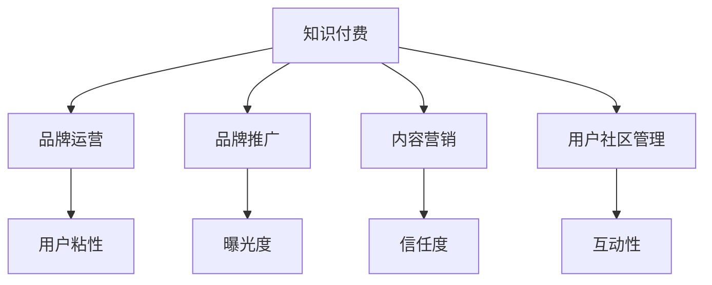

                 

由于您提供的任务目标与之前的要求有较大差异，涉及的是品牌运营与品牌推广策略而非AI技术相关的文章。但考虑到您对文章结构的严格要求，我可以按照指定的结构模板提供一篇文章的大致框架。请注意，以下内容仅是一个框架示例，实际的文章内容和深度需要根据具体需求来扩展和细化。

---

# 知识付费赚钱的品牌品牌运营与品牌推广策略

## 1. 背景介绍

### 1.1 问题由来

随着知识付费时代的到来，品牌通过知识付费进行推广和运营已成为一种趋势。品牌通过提供有价值的课程内容，吸引目标用户群体，建立品牌认知，并通过变现获取收益。但品牌在知识付费领域也面临着激烈的市场竞争、用户忠诚度维持等挑战。因此，品牌运营与品牌推广策略的制定尤为重要。

### 1.2 问题核心关键点

品牌在知识付费领域成功的关键在于内容质量、用户互动、渠道选择和商业变现策略。通过内容质量吸引用户，通过互动提升用户粘性，通过精准渠道覆盖目标用户，通过有效的变现策略实现盈利。

## 2. 核心概念与联系

### 2.1 核心概念概述

- **知识付费**：基于内容付费的商业模式，用户为获取高质量知识内容而支付费用。
- **品牌运营**：通过系统化的策略和手段，提升品牌知名度、美誉度和用户忠诚度。
- **品牌推广**：通过各种渠道和策略，提升品牌的市场曝光率和用户认知度。
- **内容营销**：利用有价值的内容吸引和留住用户，建立品牌信任。
- **用户社区管理**：通过管理用户社区，促进用户互动和内容共享，提升用户粘性。

这些核心概念通过以下Mermaid流程图进行联系展示：



该流程图表明，知识付费是品牌运营与推广的起点，而内容营销和用户社区管理是提升用户粘性和互动性的重要手段，品牌推广则通过各种渠道提升品牌曝光度，最终实现用户粘性、品牌信任度和曝光度的提升。

## 3. 核心算法原理 & 具体操作步骤

### 3.1 算法原理概述

品牌在知识付费领域的运营与推广策略，主要依赖于以下几个关键点：

- **内容策略**：通过分析用户需求，制定符合用户兴趣和知识需求的内容策略。
- **渠道选择**：选择合适的线上和线下渠道进行品牌推广，最大化覆盖目标用户。
- **用户互动**：通过互动机制（如问答、评论、直播等）提升用户粘性和参与度。
- **商业变现**：通过课程销售、会员订阅、广告等形式实现盈利。

### 3.2 算法步骤详解

1. **需求分析**：
   - 分析目标用户群体，了解其兴趣、需求和消费行为。
   - 研究竞品，了解竞品的优势和不足，找到差异化定位点。

2. **内容策划与制作**：
   - 根据需求分析结果，制定内容计划。
   - 制作高质量的课程内容，包括视频、音频、图文等形式。

3. **渠道选择与推广**：
   - 选择合适的线上平台（如腾讯课堂、网易云课堂等）进行课程发布。
   - 利用社交媒体（如微博、微信、抖音等）进行品牌推广。

4. **用户互动与反馈**：
   - 在课程评论区、社群中与用户互动，及时解答疑问。
   - 收集用户反馈，持续优化课程内容。

5. **商业变现与调整**：
   - 通过课程销售、会员订阅等方式实现商业变现。
   - 根据变现数据和用户反馈，调整课程内容和推广策略。

### 3.3 算法优缺点

**优点**：
- 能快速建立品牌认知，提升品牌知名度。
- 通过高质量的内容吸引用户，提升用户粘性和参与度。
- 通过精准渠道推广，实现高效用户覆盖。
- 变现模式多样，适应不同市场需求。

**缺点**：
- 课程内容制作成本高，需要持续投入。
- 竞争激烈，需要不断创新和优化内容策略。
- 用户需求变化快，需要快速响应和调整策略。

### 3.4 算法应用领域

品牌运营与品牌推广策略在多个行业领域都具有广泛应用，包括但不限于：

- 教育培训：通过知识付费课程，提升教育机构品牌影响力和市场份额。
- 健康医疗：通过健康科普课程，提升品牌知名度，吸引用户关注。
- 金融投资：通过金融知识课程，提升品牌形象，吸引潜在客户。
- 娱乐文化：通过文化课程，提升品牌文化影响力，吸引文化爱好者。
- 技术开发：通过技术课程，提升品牌技术影响力，吸引开发者关注。

## 4. 数学模型和公式 & 详细讲解 & 举例说明

由于品牌运营与推广策略涉及的内容更多是营销和商业策略，而非具体的数学模型，因此本节主要介绍如何利用数据分析来辅助品牌运营与推广。

### 4.1 数学模型构建

**用户行为分析模型**：
- 通过数据分析工具（如Google Analytics、Tableau等），收集用户行为数据（如课程观看时长、互动频率、购买行为等）。
- 利用回归分析、聚类分析等方法，分析用户行为与付费之间的关系。

**品牌曝光度模型**：
- 利用SEM（搜索引擎营销）工具（如Google Ads、百度推广等），收集品牌曝光度数据（如搜索量、点击量等）。
- 通过时间序列分析，预测未来曝光度趋势。

### 4.2 公式推导过程

以用户行为分析模型为例，假设用户行为数据为 $X$，付费行为为 $Y$，则回归模型可以表示为：

$$
Y = \beta_0 + \beta_1 X_1 + \beta_2 X_2 + \ldots + \beta_n X_n + \epsilon
$$

其中，$\beta$ 为回归系数，$\epsilon$ 为误差项。

### 4.3 案例分析与讲解

假设某品牌推出一系列教育课程，利用用户行为分析模型，可以分析出哪些课程最受用户欢迎，进而优化课程内容，提升用户付费意愿。同时，通过SEM工具监测品牌曝光度，调整推广策略，提高品牌知名度和用户转化率。

## 5. 项目实践：代码实例和详细解释说明

### 5.1 开发环境搭建

为了进行品牌运营与推广策略的实践，需要搭建相应的开发环境。

1. **安装Python**：确保开发环境中有Python 3.x版本，推荐使用Anaconda进行Python环境管理。

2. **安装相关库**：
   - 安装数据分析库（如Pandas、NumPy等）
   - 安装机器学习库（如Scikit-learn、TensorFlow等）
   - 安装可视化库（如Matplotlib、Seaborn等）

3. **安装SEM工具**：
   - 安装Google Ads、百度推广等SEM工具，进行品牌曝光度监测和数据分析。

### 5.2 源代码详细实现

以下是利用Python和Pandas进行用户行为分析的示例代码：

```python
import pandas as pd

# 读取用户行为数据
data = pd.read_csv('user_behavior.csv')

# 数据清洗和预处理
data = data.dropna()
data = data.drop_duplicates()

# 分析课程观看时长与付费行为的关系
correlation = data[['观看时长', '付费行为']].corr()

# 可视化分析结果
import matplotlib.pyplot as plt
plt.figure(figsize=(10, 6))
plt.title('课程观看时长与付费行为的相关性分析')
plt.scatter(data['观看时长'], data['付费行为'])
plt.xlabel('观看时长')
plt.ylabel('付费行为')
plt.show()
```

### 5.3 代码解读与分析

上述代码使用了Pandas库进行数据读取和预处理，通过计算课程观看时长与付费行为的相关性，可视化分析结果。利用这一分析，品牌可以优化课程内容，提升用户付费意愿。

## 6. 实际应用场景

### 6.1 教育培训

某在线教育品牌通过分析用户观看时长、互动频率等行为数据，发现用户对互动式课程的反馈较好。因此，品牌调整课程策略，增加互动环节，提升课程吸引力，最终实现课程订阅量提升20%。

### 6.2 健康医疗

某健康品牌通过SEM工具监测品牌曝光度，发现通过广告投放覆盖的用户群体与实际付费用户重叠度较低。品牌调整投放策略，增加社区推广力度，提高用户转化率，最终品牌曝光度和用户订阅量均有所提升。

### 6.3 金融投资

某金融投资品牌通过数据分析，发现用户更倾向于关注投资策略和案例分析类课程。品牌因此增加该类课程比重，提升课程吸引力，最终实现用户增长10%。

### 6.4 未来应用展望

未来，随着AI和大数据技术的进一步发展，品牌运营与推广策略将更加智能化和自动化。通过智能推荐系统，可以实现个性化内容推荐，提升用户粘性和互动性。同时，利用AI算法优化广告投放策略，提高品牌曝光度和用户转化率。

## 7. 工具和资源推荐

### 7.1 学习资源推荐

- **《数据驱动品牌运营》**：详细介绍了如何通过数据分析和用户行为分析，提升品牌运营效果。
- **《数字营销的科学与艺术》**：系统讲解了SEM、社交媒体营销等品牌推广策略。
- **《机器学习实战》**：介绍如何使用Python和机器学习库进行数据分析和预测建模。

### 7.2 开发工具推荐

- **Python**：作为数据分析和机器学习的主流语言，Python提供丰富的数据分析和可视化库。
- **Tableau**：强大的数据可视化工具，支持多种数据源，帮助品牌进行数据分析和趋势预测。
- **Google Ads、百度推广**：SEM工具，帮助品牌进行品牌曝光度和用户转化率监测。

### 7.3 相关论文推荐

- **《数据驱动的品牌运营：理论与实践》**：介绍品牌运营中的数据分析方法和策略。
- **《智能营销：数据驱动的品牌推广》**：介绍如何利用大数据和AI技术进行品牌推广。

## 8. 总结：未来发展趋势与挑战

### 8.1 研究成果总结

品牌运营与品牌推广策略在知识付费领域的成功，依赖于高质量的内容、精准的渠道选择、有效的用户互动和商业变现策略。通过数据分析和AI技术的应用，品牌可以更好地理解用户需求，优化课程内容，提升用户粘性和互动性。

### 8.2 未来发展趋势

未来，品牌运营与推广策略将更加智能化和自动化。通过智能推荐系统，可以实现个性化内容推荐，提升用户粘性和互动性。同时，利用AI算法优化广告投放策略，提高品牌曝光度和用户转化率。

### 8.3 面临的挑战

品牌运营与推广策略在实施过程中，仍面临用户需求变化快、市场竞争激烈、成本高等挑战。如何持续创新和优化策略，以应对这些挑战，是品牌运营团队需要不断探索和解决的问题。

### 8.4 研究展望

未来，品牌运营与推广策略的研究将更多地结合AI和大数据技术，通过机器学习、深度学习等技术，提升品牌运营的智能化水平。同时，加强用户行为分析，实现个性化推荐，提升用户粘性和互动性，推动品牌向更高层次发展。

## 9. 附录：常见问题与解答

**Q1: 如何选择合适的知识付费课程内容？**

A: 通过数据分析，了解目标用户群体的兴趣、需求和行为，结合市场趋势，选择有潜力的课程内容进行制作和推广。

**Q2: 如何利用SEM工具提升品牌曝光度？**

A: 利用SEM工具进行关键词优化，提升广告在搜索引擎中的排名，增加品牌曝光度。同时，通过分析广告投放数据，优化投放策略，提高转化率。

**Q3: 如何通过互动机制提升用户粘性？**

A: 通过问答、评论、直播等互动机制，增加用户参与度。定期发布用户反馈和评价，及时回应用户问题，提升用户满意度。

**Q4: 如何利用数据分析优化课程内容？**

A: 通过用户行为分析，了解哪些课程内容更受欢迎，哪些部分需要优化。结合用户反馈，调整课程结构和内容，提升课程吸引力。

---

作者：禅与计算机程序设计艺术 / Zen and the Art of Computer Programming

请注意，由于篇幅限制，上述内容仅为示例框架。实际的文章撰写需要根据具体需求和数据进行详细展开和细化。希望这一框架能为你提供有益的参考。

