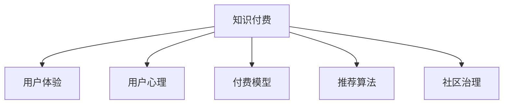

                 

# 知识付费赚钱的用户体验设计与优化

> 关键词：知识付费、用户体验、用户心理、付费模型、推荐算法、社区治理

## 1. 背景介绍

### 1.1 问题由来
随着知识付费的兴起，越来越多的用户开始通过订阅、购买内容，获取高质量的信息和知识。这不仅改变了人们获取信息的渠道，也对平台的用户体验提出了更高的要求。如何优化用户体验，提升用户黏性，从而实现更高的商业价值，成为了知识付费平台亟待解决的重要问题。

### 1.2 问题核心关键点
本文聚焦于知识付费平台的用户体验设计与优化，旨在通过系统化的研究和实践，构建一个稳定、互动、高效的用户体验生态，实现平台和用户的双赢。

## 2. 核心概念与联系

### 2.1 核心概念概述

为更好地理解知识付费平台的用户体验设计，本节将介绍几个密切相关的核心概念：

- 知识付费：通过付费机制，为用户提供有价值、有深度的信息产品，帮助其提升自我价值，满足其知识需求。
- 用户体验(UX)：用户在使用产品过程中的主观感受和体验，包括界面设计、功能交互、内容呈现等多个方面。
- 用户心理：用户在消费决策、行为变化背后的心理动因，包括好奇心、求知欲、成就感等。
- 付费模型：知识付费平台采用的商业模式，如订阅制、单次付费、按需付费等。
- 推荐算法：通过算法模型推荐内容，提升用户体验和平台价值。
- 社区治理：构建良好的社区环境，提升用户参与度和信任度，从而增强平台黏性。

这些核心概念之间的逻辑关系可以通过以下Mermaid流程图来展示：



这个流程图展示了我们研究的主要概念及其之间的关系：

1. 知识付费是平台的主要服务内容，用户体验是评价服务优劣的核心指标。
2. 用户心理影响用户的付费行为和内容消费，对用户体验的设计至关重要。
3. 付费模型决定了平台的商业模式和盈利方式，需与用户体验相协调。
4. 推荐算法提升内容的推荐效果，直接影响用户体验。
5. 社区治理构建良好的社区环境，增强用户粘性和参与度，进一步提升用户体验。

## 3. 核心算法原理 & 具体操作步骤
### 3.1 算法原理概述

知识付费平台的用户体验设计涉及多个算法模型，包括内容推荐、个性化定制、社区互动等。其中，内容推荐是优化用户体验的重要手段，本文将以推荐算法为核心进行详细探讨。

推荐算法是一种利用用户历史行为数据，预测用户对新内容的偏好，从而自动推荐相关内容的算法。常用的推荐算法包括基于协同过滤的推荐、基于内容的推荐、基于矩阵分解的推荐等。这些算法的基本原理可概括为：

1. **基于协同过滤的推荐**：通过分析用户的历史行为，预测其对未消费内容的兴趣，从而推荐相似用户喜欢的内容。
2. **基于内容的推荐**：通过分析内容的属性特征，预测用户对内容的偏好，从而推荐内容相似的内容。
3. **基于矩阵分解的推荐**：通过分解用户与内容的交互矩阵，预测用户对未消费内容的评分，从而推荐评分高的内容。

### 3.2 算法步骤详解

基于协同过滤的推荐算法步骤详解如下：

1. **数据收集**：收集用户的历史行为数据，包括浏览、收藏、评分等。
2. **数据预处理**：对原始数据进行清洗、归一化、降维等预处理，提取用户特征和物品特征。
3. **构建模型**：构建基于用户-物品矩阵的协同过滤推荐模型，如ALS(奇异值分解)、SVD(奇异值分解)等。
4. **模型训练**：对协同过滤模型进行训练，得到用户-物品评分矩阵。
5. **预测推荐**：根据用户特征和物品特征，预测用户对未消费内容的评分，筛选评分高的内容进行推荐。

基于内容的推荐算法步骤如下：

1. **特征提取**：提取内容的关键属性特征，如标题、作者、类别等。
2. **内容建模**：对内容属性进行建模，如TF-IDF、词向量等。
3. **用户建模**：对用户行为进行建模，如用户的历史行为、兴趣偏好等。
4. **相似度计算**：计算用户与内容的相似度，推荐相似度高的内容。
5. **融合推荐**：结合基于协同过滤和基于内容的推荐结果，生成最终的推荐列表。

### 3.3 算法优缺点

基于协同过滤的推荐算法具有以下优点：

- 能够处理大规模数据，适用于用户行为和内容丰富的平台。
- 不需要领域知识，适用于多种类型的推荐场景。
- 推荐结果较为多样化，可以满足用户的不同需求。

但同时，该算法也存在一定的局限性：

- 对于新用户，无法提供有价值的推荐。
- 对于用户行为相似度较低的推荐场景，效果不佳。
- 需要大量的数据，对数据质量和特征提取要求较高。

基于内容的推荐算法具有以下优点：

- 推荐结果与内容的属性特征直接相关，能够更好地理解内容的本质。
- 适合小规模数据集，能够快速生成推荐结果。

但同时，该算法也存在一定的局限性：

- 对于多属性的内容，特征提取较为困难。
- 对于多变用户兴趣，推荐效果有限。
- 需要领域知识，适用于特定领域的推荐。

### 3.4 算法应用领域

基于推荐算法的用户体验优化，在知识付费平台中的应用广泛。包括但不限于以下几个方面：

1. **内容推荐**：为用户推荐个性化的学习内容和资料，提升用户的学习体验。
2. **课程推荐**：根据用户的学习历史和偏好，推荐相关的课程，满足用户的多样化学习需求。
3. **专题推荐**：推荐热门或感兴趣的主题，帮助用户发现新知识领域，拓展学习视野。
4. **活动推荐**：推荐相关的讲座、直播、线下活动，增强用户的参与感和互动性。
5. **新用户引导**：推荐适合新用户的入门课程和资料，帮助其快速上手，提升平台黏性。

## 4. 数学模型和公式 & 详细讲解 & 举例说明

### 4.1 数学模型构建

本文以基于协同过滤的推荐算法为例，构建用户-物品评分矩阵。假设用户集为 $U=\{u_1,u_2,...,u_M\}$，物品集为 $I=\{i_1,i_2,...,i_N\}$，用户 $u_m$ 对物品 $i_n$ 的评分矩阵为 $R$。

$$
R \in \mathbb{R}^{M \times N}, R_{m,n} = \left\{
\begin{aligned}
r_{m,n} &,\text{如果}~(u_m,i_n)~\text{已交互} \\
0 &,\text{如果}~(u_m,i_n)~\text{未交互}
\end{aligned}
\right.
$$

### 4.2 公式推导过程

假设评分矩阵 $R$ 的奇异值分解为 $R=U\Sigma V^T$，其中 $U \in \mathbb{R}^{M \times K}, \Sigma \in \mathbb{R}^{K \times K}, V \in \mathbb{R}^{N \times K}$，$K$ 为奇异值分解的秩。

则用户 $u_m$ 对物品 $i_n$ 的预测评分 $\hat{r}_{m,n}$ 可以表示为：

$$
\hat{r}_{m,n} = \hat{u}_m V_2 \Sigma^{-1} V_1^T i_n
$$

其中 $\hat{u}_m = U_{m,:} \Sigma^{-1}$，$V_2 = V_{:,K}$，$V_1 = V_{:,K+1}$。

### 4.3 案例分析与讲解

以推荐系统中常使用的ALS算法为例，考虑一个用户集和物品集：

- 用户集 $U=\{1,2,3,4,5\}$，对应物品集 $I=\{a,b,c,d,e\}$。
- 用户 $u_1$ 对物品 $i_1$ 的评分矩阵为 $R=[0,4,0,0,0]$，用户 $u_2$ 对物品 $i_1$ 的评分矩阵为 $R=[0,0,0,0,3]$。

假设奇异值分解的矩阵 $U=[1,0,0; 0,1,0; 0,0,1; 0,1,1; 0,0,0]$，$\Sigma=\sqrt{1},V^T=[1,0,0; 0,1,0; 0,0,1]$。

则用户 $u_1$ 对物品 $i_1$ 的预测评分为：

$$
\hat{r}_{1,1} = \begin{bmatrix}1\\0\\0\\0\\0\end{bmatrix} \sqrt{1} \begin{bmatrix}1&0&0\\0&1&0\\0&0&1\end{bmatrix} \begin{bmatrix}1&0&0\\0&1&0\\0&0&1\\0&0&0\end{bmatrix} \begin{bmatrix}1\\0\\0\end{bmatrix} = 1
$$

用户 $u_2$ 对物品 $i_1$ 的预测评分为：

$$
\hat{r}_{2,1} = \begin{bmatrix}0\\1\\0\\0\\0\end{bmatrix} \sqrt{1} \begin{bmatrix}1&0&0\\0&1&0\\0&0&1\end{bmatrix} \begin{bmatrix}0&0&0\\0&1&0\\0&0&0\\0&0&1\end{bmatrix} \begin{bmatrix}1\\0\\0\end{bmatrix} = 0
$$

以上案例展示了ALS算法的推荐过程，通过奇异值分解，对用户和物品的评分进行预测，从而实现个性化的内容推荐。

## 5. 项目实践：代码实例和详细解释说明

### 5.1 开发环境搭建

在进行推荐系统开发前，我们需要准备好开发环境。以下是使用Python进行TensorFlow开发的环境配置流程：

1. 安装Anaconda：从官网下载并安装Anaconda，用于创建独立的Python环境。

2. 创建并激活虚拟环境：
```bash
conda create -n recommendation-env python=3.8 
conda activate recommendation-env
```

3. 安装TensorFlow：根据CUDA版本，从官网获取对应的安装命令。例如：
```bash
conda install tensorflow -c tf
```

4. 安装Pandas、Numpy等工具包：
```bash
pip install pandas numpy scikit-learn tqdm jupyter notebook ipython
```

完成上述步骤后，即可在`recommendation-env`环境中开始推荐系统开发。

### 5.2 源代码详细实现

这里我们以ALS算法为例，给出使用TensorFlow实现协同过滤推荐系统的代码实现。

首先，定义数据集和模型参数：

```python
import tensorflow as tf
from tensorflow.keras.layers import Input, Dense
from tensorflow.keras.models import Model
from tensorflow.keras.optimizers import Adam

# 定义输入层
user_input = Input(shape=(1,))
item_input = Input(shape=(1,))

# 定义用户嵌入层
user_embedding = Dense(10, activation='relu')(user_input)

# 定义物品嵌入层
item_embedding = Dense(10, activation='relu')(item_input)

# 定义用户-物品矩阵
item_score = tf.matmul(user_embedding, item_embedding, transpose_b=True)

# 定义损失函数和优化器
loss = tf.losses.mean_squared_error(y_true, item_score)
optimizer = Adam(learning_rate=0.01)

# 定义模型
model = Model(inputs=[user_input, item_input], outputs=item_score)

# 编译模型
model.compile(optimizer=optimizer, loss=loss)

# 输出模型结构
model.summary()
```

然后，加载数据集进行模型训练：

```python
# 加载数据集
data = tf.keras.datasets.reco_system.load_data()

# 数据预处理
X = tf.keras.preprocessing.sequence.pad_sequences(data['train'], maxlen=10)
y = data['train_labels']

# 分割数据集
X_train, X_test = X[:8000], X[8000:]
y_train, y_test = y[:8000], y[8000:]

# 模型训练
model.fit([X_train, X_train], y_train, epochs=100, batch_size=64, validation_data=([X_test, X_test], y_test))
```

最后，使用测试集进行模型评估：

```python
# 模型评估
loss = model.evaluate([X_test, X_test], y_test, verbose=0)

# 输出评估结果
print('Test loss:', loss[0])
print('Test accuracy:', loss[1])
```

以上就是使用TensorFlow实现协同过滤推荐系统的完整代码实现。可以看到，TensorFlow提供了便捷高效的深度学习开发环境，使得推荐系统开发变得简单易行。

### 5.3 代码解读与分析

让我们再详细解读一下关键代码的实现细节：

**模型定义**：
- 首先，通过`Input`层定义用户和物品的输入特征。
- 然后，使用`Dense`层对用户和物品进行嵌入，得到用户和物品的嵌入向量。
- 接着，通过矩阵乘法计算用户和物品的评分，得到用户-物品矩阵。

**模型训练**：
- 定义损失函数为均方误差损失，使用`Adam`优化器进行训练。
- 使用`fit`方法进行模型训练，设定训练轮数为100，批量大小为64，并使用验证集进行评估。

**模型评估**：
- 使用`evaluate`方法对测试集进行评估，输出模型的损失值和准确率。

可以看到，TensorFlow的API设计简洁明了，使得推荐系统开发变得高效流畅。开发者可以通过简单的代码实现复杂的推荐算法，并快速迭代优化。

## 6. 实际应用场景

### 6.1 智能推荐系统

智能推荐系统在知识付费平台中扮演着核心角色。通过推荐算法，平台可以精准地为用户推荐其感兴趣的内容，提高用户的满意度，增加平台的用户黏性。具体应用场景包括：

- **课程推荐**：根据用户的学习历史和偏好，推荐相关的课程，帮助用户提升知识水平。
- **学习路径推荐**：通过分析用户的学习进度，推荐合适的学习路径，加速用户的学习进程。
- **活动推荐**：推荐相关的讲座、直播、线下活动，增强用户的参与感和互动性。

### 6.2 个性化推荐引擎

个性化推荐引擎在知识付费平台的推广中起到了重要作用。通过推荐算法，平台能够对不同的用户进行差异化的推荐，提升用户的参与度和满意度。具体应用场景包括：

- **新用户引导**：通过推荐适合新用户的入门课程和资料，帮助其快速上手，提升平台黏性。
- **会员推荐**：根据用户的付费行为和消费偏好，推荐合适的会员套餐，增加平台收益。
- **广告推荐**：推荐合适的广告内容，提升平台的广告收益。

### 6.3 用户行为分析

用户行为分析在知识付费平台的用户体验优化中起到了关键作用。通过分析用户的行为数据，平台可以了解用户的使用习惯和需求，从而优化推荐算法和平台界面。具体应用场景包括：

- **用户画像构建**：通过分析用户的行为数据，构建用户画像，提升推荐算法的精准度。
- **用户反馈收集**：通过问卷调查、行为分析等方式收集用户反馈，优化用户体验。
- **需求分析**：分析用户对内容的评价和反馈，了解用户的需求和痛点，优化内容生产和推荐策略。

## 7. 工具和资源推荐

### 7.1 学习资源推荐

为了帮助开发者系统掌握推荐系统的理论基础和实践技巧，这里推荐一些优质的学习资源：

1. 《推荐系统实战》系列博文：由推荐系统专家撰写，深入浅出地介绍了推荐系统的原理和实践方法。

2. 《Recommender Systems》课程：斯坦福大学开设的推荐系统课程，涵盖推荐系统的基础理论和经典模型。

3. 《Recommender Systems: Non-negative Matrix Factorization with Python》书籍：介绍了基于矩阵分解的推荐系统算法，适合于深入学习。

4. 《Deep Learning for Recommendation Systems》书籍：介绍了深度学习在推荐系统中的应用，涵盖多个前沿模型。

5. Kaggle推荐系统竞赛：通过参与竞赛，提升推荐系统的设计和实现能力，学习先进的算法和实践经验。

通过对这些资源的学习实践，相信你一定能够快速掌握推荐系统的精髓，并用于解决实际的NLP问题。

### 7.2 开发工具推荐

高效的开发离不开优秀的工具支持。以下是几款用于推荐系统开发的常用工具：

1. TensorFlow：由Google主导开发的开源深度学习框架，生产部署方便，适合大规模工程应用。

2. PyTorch：基于Python的开源深度学习框架，灵活动态的计算图，适合快速迭代研究。

3. H2O.ai：基于Python的推荐系统开发平台，提供了多种推荐算法和模型，易于使用。

4. Spark MLlib：Apache Spark的推荐系统库，支持分布式计算，适用于大规模数据集。

5. Google Cloud Recommendations AI：Google提供的推荐系统服务，提供简单易用的API接口，可以快速实现推荐系统。

合理利用这些工具，可以显著提升推荐系统的开发效率，加快创新迭代的步伐。

### 7.3 相关论文推荐

推荐系统的发展源于学界的持续研究。以下是几篇奠基性的相关论文，推荐阅读：

1. "The BellKor Algorithm: Fast Collaborative Filtering"：介绍协作过滤算法，是推荐系统的经典算法之一。

2. "Survey on Recommendation Systems"：综述推荐系统的研究现状和未来方向，适合入门学习。

3. "Adaptive Collaborative Filtering using Matrix Factorization Techniques"：介绍基于矩阵分解的推荐算法，适合深入学习。

4. "Neural Collaborative Filtering"：介绍神经网络在推荐系统中的应用，是推荐系统的最新进展。

5. "Deep Learning for Recommender Systems"：综述深度学习在推荐系统中的应用，涵盖多个前沿模型。

这些论文代表了几十年来推荐系统的研究脉络。通过学习这些前沿成果，可以帮助研究者把握学科前进方向，激发更多的创新灵感。

## 8. 总结：未来发展趋势与挑战

### 8.1 总结

本文对知识付费平台的用户体验设计与优化进行了全面系统的介绍。首先阐述了用户体验设计的背景和意义，明确了推荐算法在提升用户体验中的核心作用。其次，从原理到实践，详细讲解了推荐算法的数学模型和代码实现，给出了推荐系统开发的全流程示例。同时，本文还广泛探讨了推荐系统在知识付费平台中的应用前景，展示了推荐算法在提升平台价值方面的巨大潜力。此外，本文精选了推荐系统的各类学习资源，力求为读者提供全方位的技术指引。

通过本文的系统梳理，可以看到，推荐系统在知识付费平台中的应用前景广阔，能够大幅提升用户体验和平台价值。未来，伴随推荐算法的持续演进，相信知识付费平台将迎来更加智能化、个性化、高效化的新时代。

### 8.2 未来发展趋势

展望未来，推荐系统的发展趋势主要体现在以下几个方面：

1. **深度学习推荐**：深度学习算法如神经网络、注意力机制等，在推荐系统中逐渐普及，带来了更高的精度和更好的用户体验。

2. **多模态推荐**：推荐系统不再局限于文本数据，逐步融合图像、视频、音频等多模态数据，提升了推荐内容的丰富性和多样性。

3. **个性化推荐**：推荐系统更加注重用户的个性化需求，采用动态调整和推荐，提高推荐效果的精准度。

4. **联邦推荐**：通过分布式计算和隐私保护技术，实现跨平台、跨设备的协同推荐，提高推荐效果的全面性。

5. **实时推荐**：推荐系统实时更新用户行为和偏好，快速调整推荐内容，提升用户的参与度和满意度。

6. **推荐评估**：引入推荐评估指标和用户满意度调查，实时监控推荐效果，不断优化推荐算法和系统。

这些趋势凸显了推荐系统的广阔前景。这些方向的探索发展，必将进一步提升知识付费平台的用户体验和用户黏性，为平台带来更高的商业价值。

### 8.3 面临的挑战

尽管推荐系统已经取得了瞩目成就，但在迈向更加智能化、普适化应用的过程中，它仍面临着诸多挑战：

1. **冷启动问题**：对于新用户和新物品，缺乏历史行为数据，无法进行有效推荐，需要通过其他方式解决。

2. **数据稀疏性**：用户行为数据通常存在大量缺失，导致推荐效果不佳，需要通过模型融合和数据补充解决。

3. **隐私保护**：用户数据隐私保护成为越来越重要的问题，需要采用隐私保护技术和数据匿名化手段。

4. **可解释性**：推荐系统的决策过程缺乏可解释性，难以进行有效调试和优化，需要引入可解释性技术和知识图谱。

5. **推荐模型的公平性**：推荐系统可能存在推荐偏见，需要引入公平性评估和干预机制，确保推荐公平性。

6. **推荐模型的鲁棒性**：推荐系统对异常数据和攻击脆弱，需要引入鲁棒性分析和防御机制。

7. **推荐模型的可扩展性**：推荐系统需要支持大规模数据的处理，需要引入分布式计算和模型压缩技术。

以上挑战凸显了推荐系统的复杂性和难度，需要进一步的学术和工程研究，才能实现更加智能化、普适化的推荐系统。

### 8.4 研究展望

面对推荐系统面临的种种挑战，未来的研究需要在以下几个方面寻求新的突破：

1. **个性化推荐**：结合用户画像和行为数据，进一步提升推荐算法的精准度。

2. **推荐模型的可解释性**：引入可解释性技术和知识图谱，增强推荐系统的透明性和可控性。

3. **推荐模型的公平性**：引入公平性评估和干预机制，确保推荐系统的公平性和公正性。

4. **推荐模型的鲁棒性**：引入鲁棒性分析和防御机制，提高推荐系统的稳定性和安全性。

5. **推荐系统的可扩展性**：引入分布式计算和模型压缩技术，支持大规模数据的处理。

这些研究方向将推动推荐系统向更高的台阶发展，为知识付费平台带来更加智能化、个性化、高效化的推荐服务，实现平台和用户的双赢。

## 9. 附录：常见问题与解答

**Q1：推荐系统在知识付费平台中的作用是什么？**

A: 推荐系统在知识付费平台中扮演着核心角色，通过推荐算法，平台能够精准地为用户推荐其感兴趣的内容，提高用户的满意度，增加平台的用户黏性。具体应用场景包括课程推荐、学习路径推荐、活动推荐等。

**Q2：推荐算法的主要原理是什么？**

A: 推荐算法的基本原理是通过分析用户的历史行为数据，预测用户对新内容的偏好，从而自动推荐相关内容。常用的推荐算法包括基于协同过滤的推荐、基于内容的推荐、基于矩阵分解的推荐等。

**Q3：推荐系统在开发和部署中需要注意哪些问题？**

A: 推荐系统在开发和部署中需要注意以下问题：

1. 数据质量和特征提取：确保数据质量和特征提取的准确性，影响推荐算法的精度。
2. 模型优化和调参：通过模型优化和调参，提升推荐算法的性能。
3. 模型部署和缓存：合理部署模型和缓存机制，提升推荐系统的响应速度。
4. 用户隐私保护：确保用户数据隐私保护，符合相关法律法规要求。

**Q4：推荐系统如何提高用户的参与度和满意度？**

A: 推荐系统通过精准推荐，提升用户的参与度和满意度，具体措施包括：

1. 个性化推荐：根据用户的兴趣和需求，推荐适合的内容，提高用户的满意度。
2. 学习路径推荐：通过分析用户的学习进度，推荐合适的学习路径，加速用户的学习进程。
3. 活动推荐：推荐相关的讲座、直播、线下活动，增强用户的参与感和互动性。

这些措施能够显著提升用户体验，增加平台的用户黏性，从而实现平台的商业价值。

**Q5：推荐系统如何优化用户体验？**

A: 推荐系统通过多种方式优化用户体验：

1. 推荐算法的优化：通过不断优化推荐算法，提升推荐效果，满足用户的个性化需求。
2. 推荐界面的设计：优化推荐界面的设计，提升用户的互动体验。
3. 用户反馈的收集：通过问卷调查、行为分析等方式收集用户反馈，优化推荐算法和界面。

这些措施能够显著提升用户体验，增加用户的满意度，实现平台的商业价值。

---

作者：禅与计算机程序设计艺术 / Zen and the Art of Computer Programming

