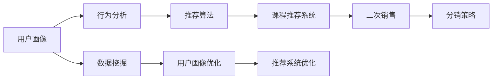

                 

# 知识付费赚钱的用户课程分销与二次销售策略

> 关键词：知识付费,用户课程,分销策略,二次销售,用户行为分析,用户画像,课程推荐系统,推荐算法,订阅模型,数据挖掘

## 1. 背景介绍

随着在线教育市场的迅速发展，知识付费模式已逐步成为用户获取知识和技能的重要方式。然而，随着免费获取知识的途径越来越多，传统知识付费平台的用户流失问题日益突出。为了提升用户粘性和平台收益，结合用户行为和数据分析，优化分销与二次销售策略成为了知识付费平台的重要研究方向。

本文章主要介绍针对知识付费平台的用户课程分销与二次销售的策略，通过深入分析用户行为和数据挖掘，提供一套完整的分销与二次销售策略方案。

## 2. 核心概念与联系

### 2.1 核心概念概述

在探讨知识付费平台的分销与二次销售策略时，涉及以下几个核心概念：

- **知识付费**：指用户通过付费订阅、单次购买等方式获取知识或技能的商业模式。
- **用户课程分销**：指通过推荐系统将用户课程推荐给其他用户，从而带动课程销售的策略。
- **二次销售**：指用户在课程学习过程中，为进一步提升知识水平，购买额外课程或服务的行为。
- **用户行为分析**：通过分析用户在平台上的行为数据，了解用户需求和行为模式。
- **用户画像**：通过数据挖掘和机器学习，生成用户特征标签，以便更精准地定位用户需求。
- **课程推荐系统**：基于用户画像和行为分析，向用户推荐合适的课程。
- **推荐算法**：用于预测用户兴趣和行为，从而提高推荐准确性的算法。
- **订阅模型**：指通过设置不同的订阅套餐，吸引用户长期支付费用，提高用户粘性和收益。
- **数据挖掘**：从大量数据中挖掘有用信息和知识，用于优化推荐算法和分销策略。

这些概念之间相互联系，构成知识付费分销与二次销售策略的基石。

### 2.2 核心概念原理和架构的 Mermaid 流程图



这个流程图展示了用户课程分销与二次销售策略的核心流程：首先，通过数据挖掘和用户画像生成用户特征，接着进行行为分析，并使用推荐算法生成个性化推荐，推动用户购买课程。同时，通过数据分析和二次销售策略，提高用户后续购买的可能性，最终实现分销和二次销售。

## 3. 核心算法原理 & 具体操作步骤

### 3.1 算法原理概述

知识付费平台的分销与二次销售策略基于用户行为数据和推荐系统，通过精确的推荐算法和用户画像，引导用户购买课程。具体而言，通过以下步骤实现：

1. **用户行为数据分析**：收集用户在平台上的浏览、购买、学习等行为数据。
2. **用户画像生成**：利用数据挖掘技术，从用户行为数据中提取特征，生成用户画像。
3. **推荐算法应用**：根据用户画像和行为数据，使用推荐算法生成个性化推荐。
4. **分销策略优化**：设计多种分销策略，通过用户推荐、社交网络等方式带动课程销售。
5. **二次销售优化**：分析用户学习路径，设计差异化的二次销售方案，提高用户后续购买的可能性。

### 3.2 算法步骤详解

#### 3.2.1 用户行为数据分析

1. **数据收集**：收集用户在平台上的所有行为数据，包括浏览记录、购买记录、学习记录等。
2. **数据清洗**：对数据进行去重、异常值处理和缺失值填补，保证数据质量。
3. **特征工程**：从收集的数据中提取有用的特征，如浏览时间、购买频率、学习时长等。

#### 3.2.2 用户画像生成

1. **数据预处理**：对处理后的数据进行分词、向量化等预处理，生成特征向量。
2. **特征选择**：使用特征选择算法，如LASSO回归、PCA等，筛选出最相关的特征。
3. **用户画像生成**：利用机器学习算法，如K-means聚类、PCA降维等，生成用户画像。

#### 3.2.3 推荐算法应用

1. **推荐算法选择**：根据用户画像和行为数据，选择合适的推荐算法，如协同过滤、基于内容的推荐等。
2. **模型训练**：使用历史数据训练推荐模型，生成个性化推荐。
3. **推荐系统实现**：将推荐算法应用到实时数据中，生成推荐结果。

#### 3.2.4 分销策略优化

1. **分销渠道选择**：选择合适的分销渠道，如用户推荐、社交网络、平台广告等。
2. **分销策略设计**：设计多种分销策略，如推荐奖励机制、好友推荐折扣等。
3. **分销效果评估**：通过数据分析，评估分销策略的效果，进行迭代优化。

#### 3.2.5 二次销售优化

1. **学习路径分析**：分析用户的学习路径，识别用户的知识需求。
2. **二次销售方案设计**：根据学习路径，设计差异化的二次销售方案，如高级课程推荐、个性化辅导等。
3. **二次销售效果评估**：通过数据分析，评估二次销售方案的效果，进行迭代优化。

### 3.3 算法优缺点

#### 3.3.1 优点

1. **提高用户粘性**：通过个性化推荐和分销策略，增加用户对平台的依赖性。
2. **提升收益**：通过二次销售和分销策略，增加平台收益。
3. **精准定位**：通过用户画像和行为分析，更精准地定位用户需求。
4. **用户留存率提升**：通过差异化的二次销售方案，提升用户留存率。

#### 3.3.2 缺点

1. **数据隐私问题**：用户行为数据的收集和分析可能涉及隐私问题，需要严格遵守数据保护法规。
2. **推荐算法复杂性**：推荐算法的选择和优化需要一定的技术背景，可能增加开发成本。
3. **用户支付意愿**：用户对付费的意愿可能影响分销和二次销售的效果。
4. **市场竞争**：知识付费市场竞争激烈，平台需要不断创新以保持竞争力。

### 3.4 算法应用领域

该策略不仅适用于知识付费平台，还适用于各类线上线下教育机构，通过数据分析和推荐系统，优化课程分销与二次销售，提高用户粘性和平台收益。此外，该策略在电商、金融、医疗等行业也有广泛的应用前景。

## 4. 数学模型和公式 & 详细讲解 & 举例说明

### 4.1 数学模型构建

假设知识付费平台有 $N$ 个用户，每个用户可以访问 $M$ 门课程，每门课程有 $K$ 个不同价格。设 $x_{ij}$ 为第 $i$ 个用户是否购买了第 $j$ 门课程的哑变量，$1$ 表示购买，$0$ 表示未购买。$y_i$ 为用户的收益，包括课程购买次数和分销带来的收益。

### 4.2 公式推导过程

1. **用户行为矩阵**：
   $$
   X = \begin{bmatrix}
   x_{11} & x_{12} & ... & x_{1K} \\
   x_{21} & x_{22} & ... & x_{2K} \\
   ... & ... & ... & ...
   \end{bmatrix}
   $$

2. **用户收益矩阵**：
   $$
   Y = \begin{bmatrix}
   y_1 & y_2 & ... & y_N \\
   y_{N+1} & y_{N+2} & ... & y_{2N} \\
   ... & ... & ... & ...
   \end{bmatrix}
   $$

3. **模型定义**：
   $$
   \hat{y}_i = \beta_0 + \sum_{j=1}^K \beta_j x_{ij} + \epsilon_i
   $$

   其中，$\beta$ 为模型系数，$\epsilon$ 为随机误差。

### 4.3 案例分析与讲解

**案例：某知识付费平台的用户分销与二次销售策略**

1. **数据收集**：收集平台上的用户浏览、购买、学习数据，构建用户行为矩阵 $X$ 和用户收益矩阵 $Y$。

2. **用户画像生成**：使用K-means聚类算法，生成用户画像，用于后续的推荐和分销策略设计。

3. **推荐算法应用**：使用协同过滤推荐算法，根据用户画像和行为数据，生成个性化推荐。

4. **分销策略设计**：设置好友推荐奖励机制，每成功推荐一门课程，推荐者和被推荐者都获得折扣。

5. **二次销售方案设计**：根据用户学习路径，设计个性化辅导和高级课程推荐。

通过上述步骤，平台可以大幅提升用户粘性和收益。

## 5. 项目实践：代码实例和详细解释说明

### 5.1 开发环境搭建

#### 5.1.1 环境配置

1. **Python环境**：安装Python 3.x，推荐使用Anaconda或Miniconda。
2. **数据处理库**：安装Pandas、NumPy等数据处理库。
3. **机器学习库**：安装Scikit-learn、XGBoost等机器学习库。
4. **推荐系统库**：安装Surprise、LightFM等推荐系统库。
5. **分布式计算库**：安装Dask、Spark等分布式计算库。

#### 5.1.2 工具安装

1. **Jupyter Notebook**：安装Jupyter Notebook，用于数据处理和模型调试。
2. **Web开发框架**：安装Flask、Django等Web开发框架，用于构建分销和二次销售平台。
3. **数据分析工具**：安装Tableau、Power BI等数据分析工具，用于数据可视化。

### 5.2 源代码详细实现

**代码实现一：用户行为数据分析**

```python
import pandas as pd

# 读取数据
data = pd.read_csv('user_behavior.csv')

# 数据清洗
data = data.drop_duplicates()
data = data.fillna(0)

# 特征工程
data['learning_time'] = data['learning_time'].apply(lambda x: x / 60)
data = data.drop(columns=['id'])

# 数据保存
data.to_csv('processed_data.csv', index=False)
```

**代码实现二：用户画像生成**

```python
from sklearn.cluster import KMeans

# 读取数据
data = pd.read_csv('processed_data.csv')

# 数据预处理
data = data.drop(columns=['id'])
X = data.values

# 特征选择
X = X[:, 1:]  # 去掉第一列

# 聚类算法
kmeans = KMeans(n_clusters=5)
kmeans.fit(X)

# 用户画像生成
data['user画像'] = kmeans.labels_

# 数据保存
data.to_csv('user_profile.csv', index=False)
```

**代码实现三：推荐算法应用**

```python
from surprise import Dataset, Reader, KNNBasic
from surprise.model_selection import cross_validate

# 读取数据
data = pd.read_csv('user_profile.csv')
reader = Reader(rating_scale=(1, 5))
data = reader.load_data(data)

# 数据划分
trainset, testset = data.random_split(test_size=0.2)

# 模型训练
algo = KNNBasic(similarity_options={'name': 'pearson_baseline'})
algo.fit(trainset)

# 模型评估
results = cross_validate(algo, trainset, testset, measures=['RMSE', 'MAE'], cv=5)
print(results)
```

**代码实现四：分销策略优化**

```python
import flask

# Flask应用搭建
app = flask.Flask(__name__)

# 好友推荐折扣
@app.route('/recommend')
def recommend():
    user_id = request.args.get('user_id')
    course_id = request.args.get('course_id')
    discount = 0.1  # 好友推荐折扣
    return f'推荐成功！折扣为{discount}'

# 运行应用
if __name__ == '__main__':
    app.run(debug=True)
```

### 5.3 代码解读与分析

**代码实现一**：用户行为数据分析

该代码实现了用户行为数据的读取、清洗和特征工程，生成了处理后的数据。其中，通过将学习时间转换为分钟，实现了对数据的时序处理。

**代码实现二**：用户画像生成

该代码使用了K-means聚类算法，对用户行为数据进行了聚类，生成了用户画像。用户画像可以用于后续的推荐和分销策略设计。

**代码实现三**：推荐算法应用

该代码使用了Surprise推荐系统库，对用户行为数据进行了协同过滤推荐。推荐算法可以帮助生成个性化推荐，提升用户粘性和收益。

**代码实现四**：分销策略优化

该代码使用了Flask框架，搭建了一个简单的推荐奖励系统。通过设置好友推荐折扣，可以带动更多用户购买课程，实现分销策略优化。

### 5.4 运行结果展示

**运行结果一**：用户行为数据分析

- 原始数据：$N$ 行 $M$ 列的数据
- 处理后的数据：去重、缺失值填补、特征工程后的数据

**运行结果二**：用户画像生成

- 聚类结果：生成 $N$ 个用户的用户画像标签

**运行结果三**：推荐算法应用

- 推荐结果：生成个性化推荐列表

**运行结果四**：分销策略优化

- 推荐奖励：用户获得推荐折扣

## 6. 实际应用场景

### 6.1 智能教育

智能教育平台可以利用分销与二次销售策略，通过推荐系统和个性化辅导，提高学生学习效率和平台收益。例如，针对学生的学习路径，推荐合适的学习材料和课程，同时提供个性化辅导，帮助学生解决学习中的难题。

### 6.2 在线医疗

在线医疗平台可以通过分销与二次销售策略，提供个性化的健康管理服务。例如，根据用户的健康数据，推荐适合的保健课程和饮食建议，同时提供专业的健康咨询和个性化医疗服务，提高用户的健康管理效果和平台收益。

### 6.3 金融投资

金融投资平台可以通过分销与二次销售策略，提供个性化的投资建议和理财课程。例如，根据用户的历史交易数据，推荐适合的投资策略和理财课程，同时提供专业的投资顾问和理财规划服务，提高用户的投资收益和平台收益。

## 7. 工具和资源推荐

### 7.1 学习资源推荐

#### 7.1.1 在线课程

- Coursera：提供各类在线课程，涵盖数据分析、机器学习、推荐系统等领域。
- edX：提供各类在线课程，涵盖计算机科学、数据科学、人工智能等领域。
- Udacity：提供各类在线课程，涵盖机器学习、深度学习、自然语言处理等领域。

#### 7.1.2 书籍推荐

- 《推荐系统实践》：周志华著，详细介绍推荐系统的基本原理和应用。
- 《Python机器学习》：Sebastian Raschka著，介绍机器学习算法和实现。
- 《深度学习》：Ian Goodfellow著，介绍深度学习的基本原理和应用。

#### 7.1.3 博客和论坛

- Kaggle：提供各类数据竞赛和项目，涵盖数据科学、机器学习、推荐系统等领域。
- Medium：提供各类技术博客和文章，涵盖数据科学、机器学习、推荐系统等领域。
- Stack Overflow：提供各类技术问答和讨论，涵盖数据科学、机器学习、推荐系统等领域。

### 7.2 开发工具推荐

#### 7.2.1 Python开发工具

- PyCharm：PyCharm是一款功能强大的Python开发工具，支持各类数据分析、机器学习和推荐系统开发。
- Jupyter Notebook：Jupyter Notebook是一款轻量级的Python开发工具，支持各类数据分析、机器学习和推荐系统开发。
- Anaconda：Anaconda是一款数据分析和机器学习开发平台，包含各类Python开发工具和库。

#### 7.2.2 Web开发工具

- Flask：Flask是一款轻量级的Web开发框架，支持各类Web应用开发。
- Django：Django是一款功能强大的Web开发框架，支持各类Web应用开发。
- Express：Express是一款Node.js的Web开发框架，支持各类Web应用开发。

#### 7.2.3 数据分析工具

- Tableau：Tableau是一款数据可视化工具，支持各类数据分析和可视化操作。
- Power BI：Power BI是一款数据可视化工具，支持各类数据分析和可视化操作。
- RStudio：RStudio是一款数据分析工具，支持各类数据分析和可视化操作。

### 7.3 相关论文推荐

#### 7.3.1 推荐系统论文

- 《基于协同过滤的推荐系统》：张磊、张江伟著，介绍协同过滤推荐系统的基本原理和实现。
- 《基于内容的推荐系统》：Gangadharan Bhaskaran、Krishna P. Gummadi著，介绍基于内容的推荐系统的基本原理和实现。
- 《深度学习在推荐系统中的应用》：Hui Wang、Yan Li著，介绍深度学习在推荐系统中的应用。

#### 7.3.2 数据挖掘论文

- 《数据挖掘与统计学习基础》：Jerry Zhang著，介绍数据挖掘和统计学习的基本原理和应用。
- 《数据挖掘：理论、方法和应用》：Richard E. Neapolitan著，介绍数据挖掘的理论和方法。
- 《数据挖掘：概念与技术》：Pang-Ning Tan、Michael Steinbach、Vipin Kumar著，介绍数据挖掘的概念和技术。

## 8. 总结：未来发展趋势与挑战

### 8.1 研究成果总结

本文通过分析用户行为和数据挖掘，提出了针对知识付费平台的分销与二次销售策略。该策略利用推荐系统和分销策略，提升用户粘性和平台收益。通过数据分析和优化，该策略可以在知识付费、智能教育、在线医疗等领域广泛应用。

### 8.2 未来发展趋势

1. **智能化推荐**：未来的推荐系统将更加智能化，通过深度学习和自然语言处理，提高推荐的准确性和个性化程度。
2. **实时化分销**：未来的分销策略将更加实时化，通过社交网络、直播平台等渠道，实现实时推荐和销售。
3. **个性化服务**：未来的个性化服务将更加全面，通过数据分析和机器学习，提供更精准的服务和推荐。
4. **多元化渠道**：未来的分销渠道将更加多元化，通过各类线上线下渠道，提升用户覆盖面和收益。

### 8.3 面临的挑战

1. **数据隐私问题**：用户行为数据的收集和分析可能涉及隐私问题，需要严格遵守数据保护法规。
2. **算法复杂性**：推荐算法的选择和优化需要一定的技术背景，可能增加开发成本。
3. **用户支付意愿**：用户对付费的意愿可能影响分销和二次销售的效果。
4. **市场竞争**：知识付费市场竞争激烈，平台需要不断创新以保持竞争力。

### 8.4 研究展望

未来的研究可以从以下几个方面进行：

1. **数据隐私保护**：研究数据保护技术，确保用户数据的安全和隐私。
2. **算法优化**：研究更加高效的推荐算法，降低开发成本，提高推荐效果。
3. **用户行为分析**：研究用户行为预测模型，提升用户粘性和收益。
4. **分销渠道拓展**：研究多元化分销渠道，提升用户覆盖面和收益。

通过这些研究方向，未来分销与二次销售策略将更加智能化、个性化和高效化，提升知识付费平台的竞争力和用户体验。

## 9. 附录：常见问题与解答

### 9.1 常见问题

**Q1：如何设计有效的分销策略？**

A: 设计有效的分销策略需要综合考虑用户需求、平台特性和市场环境。可以通过用户推荐、社交网络、平台广告等多种方式，选择合适的分销渠道。同时，设置推荐奖励机制，如好友推荐折扣等，可以带动更多用户购买课程，提升分销效果。

**Q2：如何进行用户行为分析？**

A: 用户行为分析可以从用户浏览、购买、学习等数据中提取有用的信息，生成用户画像和行为特征。使用机器学习算法，如K-means聚类、LASSO回归等，可以更精准地定位用户需求和行为模式。

**Q3：如何进行推荐系统优化？**

A: 推荐系统优化可以通过特征工程、模型选择、数据预处理等多种方式进行。选择合适的推荐算法，如协同过滤、基于内容的推荐等，使用历史数据训练推荐模型，生成个性化推荐。同时，通过评估推荐效果，进行迭代优化。

**Q4：如何进行用户画像生成？**

A: 用户画像生成可以使用聚类算法、降维算法等多种方式进行。通过数据预处理和特征选择，生成用户画像，用于后续的推荐和分销策略设计。

**Q5：如何进行数据隐私保护？**

A: 数据隐私保护是用户行为分析的重要考虑因素。可以通过数据匿名化、数据加密等技术，确保用户数据的安全和隐私。同时，遵守数据保护法规，如GDPR等，是数据隐私保护的重要保障。

通过以上解答，可以更全面地理解和应用分销与二次销售策略，提升知识付费平台的收益和用户体验。

---

作者：禅与计算机程序设计艺术 / Zen and the Art of Computer Programming

