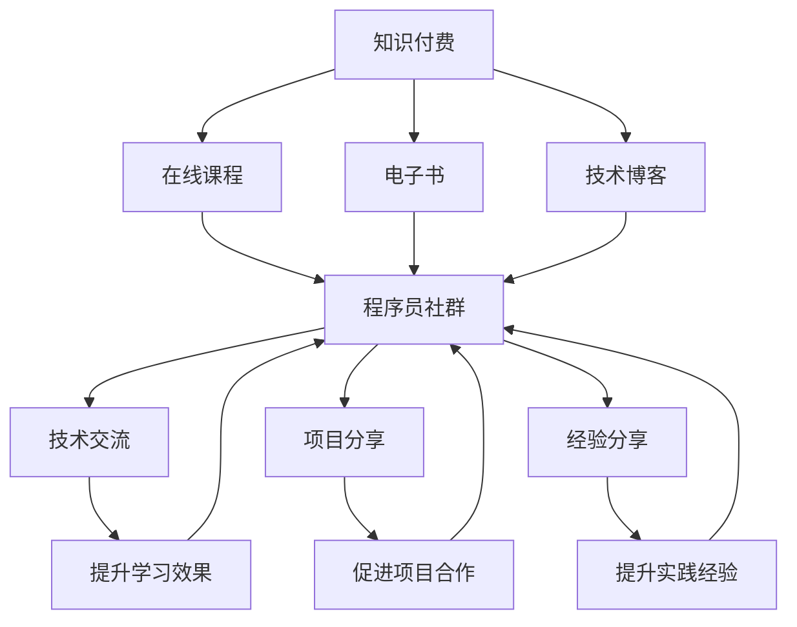

                 

# 知识付费：程序员的社群运营战术

> 关键词：知识付费, 程序员, 社群运营, 技术传播, 在线教育

## 1. 背景介绍

### 1.1 问题由来

在互联网高速发展的今天，知识的传播途径变得多样化。传统的线下培训、书籍出版等传统教育方式，逐渐被在线课程、知识社区等新型教育形态所取代。尤其在技术领域，知识付费现象尤为明显。无论是编程、区块链、人工智能等技术，都拥有庞大的用户群体，并且支付意愿极强。

对于程序员来说，在繁重的编程任务之外，如何进行自我提升和学习，成为一个亟需解决的问题。程序员社群作为一种新型学习方式，结合了知识付费和技术社交的特点，为他们提供了高效的学习途径和丰富的交流平台。

本文旨在探讨程序员社群运营的战术，结合知识付费和社区建设的优势，探讨如何更好地满足程序员的学习需求，帮助他们在技术领域取得进步，并促进社群的良性发展。

### 1.2 问题核心关键点

要回答这个问题，我们需要明确以下几个关键点：

1. 如何构建一个有效的程序员社群？
2. 如何提升程序员社群的影响力和参与度？
3. 如何通过知识付费实现社群的良性运营和可持续发展？

本文将围绕这三个关键点，结合实际案例，深入分析并提出具体的运营策略。

## 2. 核心概念与联系

### 2.1 核心概念概述

在探讨程序员社群的运营战术之前，首先需要明确几个核心概念：

- **知识付费**：一种新兴的学习模式，用户通过付费获取高质量的内容，如在线课程、电子书、技术博客等。
- **程序员社群**：由程序员组成，以技术交流、项目分享、经验分享为主要内容的在线社区。
- **社群运营**：通过一系列策略和手段，提升社群的活跃度、影响力和持续发展能力。

这些概念之间存在紧密的联系，知识付费提供了优质的学习内容，而程序员社群则搭建了一个技术交流的平台，两者结合可以实现技术的传播和知识的积累。

### 2.2 核心概念原理和架构的 Mermaid 流程图



这个流程图展示了知识付费、在线课程、电子书、技术博客与程序员社群之间的联系和作用。通过在线课程、电子书和技术博客，用户可以获取高质量的学习内容；而在程序员社群中，用户可以通过技术交流、项目分享和经验分享，提升学习效果、促进项目合作和积累实践经验，从而提升整个社群的活力和影响力。

## 3. 核心算法原理 & 具体操作步骤

### 3.1 算法原理概述

在构建程序员社群的过程中，算法原理和操作步骤是非常关键的。本文将通过几个核心算法原理，详细介绍如何实现有效的社群运营。

- **用户画像算法**：通过分析用户的行为数据，构建用户画像，了解用户的学习偏好和需求，实现个性化推荐。
- **内容匹配算法**：将用户的学习内容与用户的画像进行匹配，推荐最符合用户需求的内容。
- **社群活跃度提升算法**：通过一系列策略，如话题引导、奖励机制等，提升社群的活跃度和参与度。

### 3.2 算法步骤详解

#### 3.2.1 用户画像算法

用户画像算法的核心在于通过数据分析，构建用户的学习兴趣和行为特征，从而实现个性化推荐。以下是一个简单的用户画像算法流程：

1. **数据采集**：收集用户在社群中的行为数据，如浏览历史、学习时间、参与讨论等。
2. **特征提取**：从行为数据中提取关键特征，如偏好的技术领域、常用的学习平台、学习频率等。
3. **聚类分析**：对提取的特征进行聚类分析，形成用户画像，即每个用户的学习特征集合。
4. **推荐模型训练**：基于用户画像，构建推荐模型，如协同过滤、内容推荐等，进行内容推荐。

#### 3.2.2 内容匹配算法

内容匹配算法的核心在于将用户画像与内容进行匹配，实现内容的精准推荐。以下是一个内容匹配算法的流程：

1. **内容标签提取**：将学习内容（如课程、博客、文档等）进行标签化，如Java、Python、机器学习等。
2. **内容相似度计算**：计算用户画像与内容之间的相似度，找到最匹配的内容。
3. **推荐排序**：根据相似度计算结果，对内容进行排序，推荐最符合用户需求的内容。

#### 3.2.3 社群活跃度提升算法

社群活跃度提升算法的核心在于通过一系列策略，提升社群的参与度和活跃度。以下是一个社群活跃度提升算法的流程：

1. **话题引导**：通过创建热门话题和标签，引导用户参与讨论，增加社群的互动性。
2. **奖励机制**：设计积分、勋章、排行榜等奖励机制，激励用户积极参与社群活动。
3. **内容分享**：鼓励用户分享学习心得、项目成果，提升社群的知名度和影响力。
4. **互动工具**：使用聊天室、论坛等工具，提供实时的交流平台，提升用户的参与体验。

### 3.3 算法优缺点

#### 3.3.1 优点

- **精准推荐**：用户画像和内容匹配算法可以实现个性化的内容推荐，提升用户的学习效果。
- **高效互动**：话题引导、奖励机制和互动工具等策略，可以提升社群的活跃度和参与度。

#### 3.3.2 缺点

- **数据隐私**：用户画像的构建需要收集用户行为数据，可能存在隐私泄露的风险。
- **内容质量**：高质量的内容是知识付费和社群运营的基础，但内容的审核和筛选需要耗费大量人力。

### 3.4 算法应用领域

这些算法原理在程序员社群运营中的应用非常广泛，可以覆盖以下几个领域：

- **在线教育平台**：如Coursera、Udemy等，通过用户画像和内容匹配算法，实现个性化推荐。
- **技术社区**：如Stack Overflow、GitHub等，通过话题引导、奖励机制和互动工具等策略，提升社区的活跃度。
- **企业内部培训**：通过内容匹配和社群活跃度提升算法，提升内部员工的学习效果和参与度。

## 4. 数学模型和公式 & 详细讲解 & 举例说明

### 4.1 数学模型构建

在程序员社群运营中，我们可以构建一个数学模型，来描述用户画像、内容匹配和社群活跃度之间的关系。以下是一个简单的数学模型：

设用户集为 $U$，内容集为 $C$，社群活跃度为 $A$。则有：

$$
A = f(U, C)
$$

其中 $f$ 为一个映射函数，表示社群活跃度与用户和内容之间的关系。

### 4.2 公式推导过程

假设用户 $u$ 对内容 $c$ 的学习兴趣为 $I(u, c)$，用户画像为 $P(u)$，内容标签为 $L(c)$，社群活跃度为 $A$。则有：

$$
A = \sum_{u \in U} \sum_{c \in C} I(u, c) \cdot P(u) \cdot \text{cosine}(P(u), L(c))
$$

其中 $\text{cosine}$ 表示余弦相似度，用于衡量用户画像与内容标签之间的匹配度。

### 4.3 案例分析与讲解

假设有一个程序员社群，用户集 $U = \{u_1, u_2, ..., u_n\}$，内容集 $C = \{c_1, c_2, ..., c_m\}$。用户 $u_i$ 对内容 $c_j$ 的学习兴趣为 $I(u_i, c_j)$，用户画像为 $P(u_i)$，内容标签为 $L(c_j)$。则有：

- 用户画像 $P(u_i)$ 由行为数据 $D(u_i)$ 生成，如浏览历史、学习时间等。
- 内容标签 $L(c_j)$ 由内容特征 $F(c_j)$ 生成，如技术领域、课程难度等。
- 社群活跃度 $A$ 由用户兴趣 $I(u_i, c_j)$、用户画像 $P(u_i)$ 和内容标签 $L(c_j)$ 生成，公式如下：

$$
A = \sum_{i=1}^n \sum_{j=1}^m I(u_i, c_j) \cdot P(u_i) \cdot \text{cosine}(P(u_i), L(c_j))
$$

### 4.4 案例分析与讲解

假设用户 $u_1$ 对内容 $c_1$ 的学习兴趣为 $I(u_1, c_1) = 0.8$，用户画像 $P(u_1) = [0.3, 0.7, 0.1]$，内容标签 $L(c_1) = [0.4, 0.6, 0.2]$。则有：

$$
A = 0.8 \cdot 0.3 \cdot 0.4 + 0.8 \cdot 0.7 \cdot 0.6 + 0.8 \cdot 0.1 \cdot 0.2 = 0.8 \cdot (0.3 \cdot 0.4 + 0.7 \cdot 0.6 + 0.1 \cdot 0.2) = 0.8 \cdot 0.84 = 0.672
$$

## 5. 项目实践：代码实例和详细解释说明

### 5.1 开发环境搭建

在进行程序员社群运营的项目实践前，我们需要准备好开发环境。以下是使用Python进行Django开发的环境配置流程：

1. 安装Python：从官网下载并安装Python，为保证兼容性，建议选择最新版本。
2. 安装Django：在命令行中运行 `pip install django`，完成Django的下载安装。
3. 创建Django项目：在命令行中运行 `django-admin startproject project_name`，完成项目的创建。
4. 创建Django应用：在命令行中运行 `python manage.py startapp app_name`，完成应用的创建。
5. 配置数据库：在Django项目的 `settings.py` 文件中，配置好数据库连接信息。
6. 运行开发服务器：在命令行中运行 `python manage.py runserver`，启动开发服务器。

### 5.2 源代码详细实现

以下是使用Django实现的程序员社群运营平台的源代码实现：

```python
# models.py
from django.db import models

class User(models.Model):
    name = models.CharField(max_length=50)
    email = models.EmailField()
    interests = models.CharField(max_length=255)
    joined_at = models.DateTimeField(auto_now_add=True)

class Content(models.Model):
    title = models.CharField(max_length=255)
    description = models.TextField()
    tags = models.CharField(max_length=255)
    created_at = models.DateTimeField(auto_now_add=True)

# views.py
from django.shortcuts import render
from django.http import HttpResponse

def index(request):
    users = User.objects.all()
    contents = Content.objects.all()
    return render(request, 'index.html', {'users': users, 'contents': contents})

# templates/index.html
<html>
<head>
    <title>程序员社群</title>
</head>
<body>
    <h1>欢迎来到程序员社群</h1>
    <ul>
        
            <li>{{ user.name }} - {{ user.interests }}</li>
        
    </ul>
    <ul>
        
            <li>{{ content.title }} - {{ content.tags }}</li>
        
    </ul>
</body>
</html>
```

### 5.3 代码解读与分析

在上述代码中，我们使用了Django框架来构建一个简单的程序员社群运营平台。该平台包括以下几个关键部分：

- **用户模型**：定义了用户的基本信息，如姓名、邮箱、兴趣等。
- **内容模型**：定义了学习内容的标题、描述、标签等信息。
- **视图函数**：实现了展示用户和内容的逻辑，通过模板渲染的方式展示在页面上。

### 5.4 运行结果展示

运行上述代码，在浏览器中访问 `http://localhost:8000`，即可展示所有用户和内容的信息。通过这个简单的示例，可以初步了解Django的基本使用方法，以及如何构建一个程序员社群运营平台。

## 6. 实际应用场景

### 6.1 智能推荐系统

智能推荐系统是程序员社群运营中的核心功能之一。通过用户画像和内容匹配算法，可以为用户推荐最符合其需求的内容，提升其学习效果。

在实际应用中，我们可以通过收集用户的行为数据，构建用户画像，再结合内容标签，实现内容的精准推荐。例如，某用户对Java编程感兴趣，我们可以根据其浏览历史和互动数据，推荐最新的Java编程教程、案例分析等内容，提升其学习效果。

### 6.2 社区互动平台

社区互动平台是程序员社群运营中的另一个重要功能。通过话题引导、奖励机制和互动工具等策略，可以提升社群的活跃度和参与度。

在实际应用中，我们可以创建热门话题和标签，引导用户参与讨论。例如，创建一个关于“Python编程最佳实践”的话题，鼓励用户分享自己的经验和技术，并在社区中发布相关内容。同时，可以设计积分、勋章、排行榜等奖励机制，激励用户积极参与社群活动。

### 6.3 项目管理工具

项目管理工具是程序员社群运营中的关键功能之一。通过内容分享和项目合作，可以促进社群的资源共享和协同开发。

在实际应用中，我们可以创建一个项目库，让用户上传自己的项目代码、文档和总结。同时，可以提供协作编辑、代码审查等功能，方便用户进行项目合作和交流。例如，某用户上传了一个Java编程项目，其他用户可以对其进行评论、建议和优化，提升项目的质量和覆盖面。

## 7. 工具和资源推荐

### 7.1 学习资源推荐

为了帮助开发者系统掌握程序员社群运营的理论基础和实践技巧，这里推荐一些优质的学习资源：

1. **《Python网络爬虫开发实战》**：介绍如何使用Python进行数据采集和用户画像构建，是学习社群运营的基础。
2. **《数据科学导论》**：介绍了机器学习、数据挖掘、统计分析等基础理论，适合构建内容匹配算法。
3. **《Django实战》**：详细介绍Django框架的使用，适合构建社群运营平台。
4. **《DevOps实践指南》**：介绍DevOps理念和实践，适合构建社区项目管理工具。

通过对这些资源的学习实践，相信你一定能够快速掌握程序员社群运营的精髓，并用于解决实际的运营问题。

### 7.2 开发工具推荐

高效的开发离不开优秀的工具支持。以下是几款用于程序员社群运营开发的常用工具：

1. **Jupyter Notebook**：提供交互式编程环境，适合数据分析和模型构建。
2. **GitHub**：提供代码托管和版本控制功能，适合项目管理。
3. **JIRA**：提供项目管理工具，支持任务分配、进度跟踪等功能。
4. **Slack**：提供即时通讯工具，适合社群互动和项目管理。
5. **Zoom**：提供在线视频会议工具，适合社区讲座和在线讨论。

合理利用这些工具，可以显著提升程序员社群运营的开发效率，加快创新迭代的步伐。

### 7.3 相关论文推荐

程序员社群运营技术的发展源于学界的持续研究。以下是几篇奠基性的相关论文，推荐阅读：

1. **《推荐系统实践》**：介绍了推荐系统的构建和优化，适合学习内容匹配算法。
2. **《社区建设与维护》**：介绍了社区建设和运营的策略，适合学习社群活跃度提升算法。
3. **《用户画像建模与分析》**：介绍了用户画像的构建和应用，适合学习用户画像算法。

这些论文代表了大语言模型微调技术的发展脉络。通过学习这些前沿成果，可以帮助研究者把握学科前进方向，激发更多的创新灵感。

## 8. 总结：未来发展趋势与挑战

### 8.1 研究成果总结

本文对程序员社群运营的战术进行了全面系统的介绍。首先阐述了程序员社群的运营背景和意义，明确了运营战术的核心关键点。其次，从原理到实践，详细讲解了用户画像、内容匹配和社群活跃度提升等核心算法，给出了社群运营平台的完整代码实现。同时，本文还探讨了程序员社群运营在智能推荐、社区互动和项目管理中的应用场景，展示了社群运营的广泛潜力。最后，本文推荐了学习资源和开发工具，为读者提供了全方位的技术指引。

通过本文的系统梳理，可以看到，程序员社群运营技术正在成为社群建设的重要手段，极大地提升了社群的学习效果和用户参与度，为技术传播和知识共享提供了新的途径。未来，伴随社群运营技术的不断演进，相信程序员社群必将在技术领域发挥更大的作用，为技术社区的发展提供新的动力。

### 8.2 未来发展趋势

展望未来，程序员社群运营技术将呈现以下几个发展趋势：

1. **自动化推荐**：随着推荐算法的发展，未来可以实现自动化的内容推荐，提升用户体验和学习效果。
2. **社区智能化**：通过AI技术，实现社区的智能互动，如智能话题引导、智能讨论推荐等，提升社区的活跃度和参与度。
3. **多模态协作**：未来可以引入多模态数据，如视频、音频、图像等，提升社区互动和项目管理的效果。
4. **去中心化运营**：通过区块链等技术，实现社区的去中心化运营，提升社区的透明度和可信度。
5. **生态系统建设**：通过社区合作和资源共享，构建更加丰富和完善的社区生态系统，提升社区的价值和影响力。

以上趋势凸显了程序员社群运营技术的广阔前景。这些方向的探索发展，必将进一步提升社区的运营效率和用户体验，为技术社区的可持续发展提供新的思路。

### 8.3 面临的挑战

尽管程序员社群运营技术已经取得了瞩目成就，但在迈向更加智能化、普适化应用的过程中，它仍面临着诸多挑战：

1. **数据隐私**：用户画像的构建需要收集用户行为数据，可能存在隐私泄露的风险。
2. **内容质量**：高质量的内容是知识付费和社群运营的基础，但内容的审核和筛选需要耗费大量人力。
3. **用户参与度**：社区的活跃度和参与度需要持续的运营策略，才能保持长久的活力。
4. **技术复杂度**：社群运营平台需要综合多种技术手段，如推荐算法、互动工具、项目管理等，技术复杂度较高。
5. **资源限制**：社群运营需要大量的资源投入，包括人力、物力和财力，资源限制是发展的重要障碍。

### 8.4 研究展望

面对程序员社群运营所面临的挑战，未来的研究需要在以下几个方面寻求新的突破：

1. **自动化技术**：开发自动化的推荐和互动算法，提升社群运营的效率和效果。
2. **去中心化技术**：探索去中心化的运营模式，提升社区的透明度和可信度。
3. **数据隐私保护**：研究数据隐私保护技术，保护用户隐私，提升用户信任度。
4. **多模态协作**：引入多模态数据和AI技术，提升社区互动和项目管理的效果。
5. **社区生态建设**：构建社区合作和资源共享机制，提升社区的价值和影响力。

这些研究方向的探索，必将引领程序员社群运营技术迈向更高的台阶，为技术社区的可持续发展提供新的动力。面向未来，程序员社群运营技术还需要与其他人工智能技术进行更深入的融合，如知识表示、因果推理、强化学习等，多路径协同发力，共同推动技术社区的发展。只有勇于创新、敢于突破，才能不断拓展社群运营的边界，让技术社区更好地服务于技术人才的成长和技术的传播。

## 9. 附录：常见问题与解答

**Q1：程序员社群运营是否适用于所有技术领域？**

A: 程序员社群运营不仅适用于编程、软件开发等传统技术领域，也适用于数据科学、人工智能等新兴技术领域。只要有一个明确的目标和技术兴趣点，就可以通过社群运营的方式，实现知识的传播和共享。

**Q2：如何保证社群内容的优质性？**

A: 保证社群内容的优质性，需要从多个方面进行把控：
1. 严格筛选内容提供者，选择有资质的技术专家和开发者进行内容创作。
2. 对内容进行审核和筛选，去除低质量、误导性的内容。
3. 引入社区评审机制，鼓励用户对内容进行评价和反馈，提升内容质量。

**Q3：如何提升社群的活跃度？**

A: 提升社群活跃度需要多方面的策略：
1. 创建热门话题和标签，引导用户参与讨论。
2. 设计积分、勋章、排行榜等奖励机制，激励用户积极参与。
3. 使用聊天室、论坛等互动工具，提供实时的交流平台。
4. 定期举办线上线下活动，增强社区凝聚力。

**Q4：如何保证社群的安全性？**

A: 保证社群的安全性需要多方面的措施：
1. 采用加密技术，保护用户数据隐私。
2. 制定社区规则，打击恶意行为和垃圾信息。
3. 引入第三方审核机制，对内容进行审核和监督。
4. 建立举报和投诉机制，及时处理用户反馈。

这些问题的解答，可以帮助开发者更好地理解和实践程序员社群运营的战术，为技术社区的发展提供有力保障。

