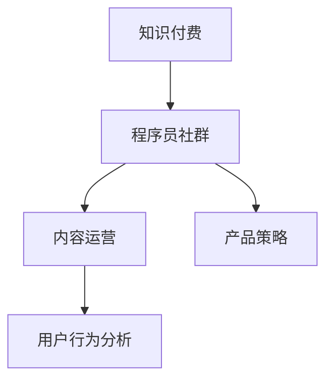

                 

# 知识付费：程序员的社群运营窍门

> 关键词：知识付费, 程序员社群, 内容运营, 产品策略, 用户行为分析

## 1. 背景介绍

### 1.1 问题由来
随着信息爆炸时代的到来，知识的获取和分享变得越来越便捷。然而，信息的质量和深度却在很大程度上变得参差不齐，用户在海量信息中很难找到真正有价值的内容。知识付费的兴起，正是基于这一背景，通过平台和内容创造者之间的利益分配机制，保障了内容的高质量和高价值，同时给予了内容创造者应有的回报。

程序员作为知识创造和应用的主力军，拥有大量的专业知识和实战经验，但在传统的知识分享渠道中，这部分价值并未得到充分的认可和利用。随着知识付费平台的兴起，程序员社群的运营者们开始探索如何通过知识付费机制，将程序员的专业知识、实战经验和职业见解进行更有效的传播和变现。

### 1.2 问题核心关键点
本文将围绕知识付费这一主题，从产品策略、内容运营、用户行为分析等多个维度，探讨程序员社群如何通过知识付费机制，实现价值变现，提升社群的用户粘性和参与度。我们将在接下来的篇章中，详细分析当前知识付费市场的主流模式，程序员社群运营的痛点和机会，并提出具体的运营策略。

## 2. 核心概念与联系

### 2.1 核心概念概述

为更好地理解知识付费这一主题，我们首先需要明确几个核心概念：

- 知识付费（Knowledge Paywall）：通过平台和内容创造者之间的利益分配机制，保障内容的高质量和高价值，同时给予内容创造者应有的回报。
- 程序员社群（Developer Community）：由程序员组成，以共享知识、交流经验、合作项目为主要活动内容的在线社区或线下组织。
- 内容运营（Content Operation）：通过一系列策略和手段，对内容生产、内容传播、内容互动进行系统管理和优化，以提升内容的价值和用户的粘性。
- 产品策略（Product Strategy）：基于用户需求和市场环境，对产品的功能、定位、推广等进行策略性规划和执行。
- 用户行为分析（User Behavior Analysis）：通过对用户行为数据的收集、分析和应用，了解用户需求和行为特征，指导产品优化和市场推广。

这些核心概念之间的逻辑关系可以通过以下Mermaid流程图来展示：



这个流程图展示出知识付费作为连接程序员社群和内容运营、产品策略的桥梁，通过用户行为分析，实现价值变现和社群发展的良性循环。

## 3. 核心算法原理 & 具体操作步骤
### 3.1 算法原理概述

知识付费的算法原理主要基于以下几个方面：

- **需求匹配**：通过用户行为数据的分析，了解用户的具体需求和兴趣点，匹配最合适的内容。
- **推荐算法**：根据用户的阅读历史和行为，推荐可能感兴趣的内容，提升用户体验。
- **价值评估**：通过用户对内容的支付行为和互动反馈，评估内容的实际价值，指导内容的优化和更新。
- **动态定价**：根据内容的受欢迎程度和用户的购买行为，动态调整内容价格，平衡内容创造者的回报和用户满意度。

### 3.2 算法步骤详解

以下是知识付费的算法步骤详细步骤：

**Step 1: 用户画像构建**
- 通过用户的注册信息、阅读行为、支付记录等数据，构建用户画像，包括用户的兴趣、需求、消费能力等。

**Step 2: 内容标签化**
- 对内容进行标签化，包括技术栈、难度、应用场景等，方便内容与用户需求的对接。

**Step 3: 推荐系统搭建**
- 基于用户画像和内容标签，搭建推荐系统，通过协同过滤、内容匹配等算法，为每个用户推荐可能感兴趣的内容。

**Step 4: 动态定价机制**
- 根据内容的热度和用户的支付行为，动态调整内容价格，保证内容创造者的回报，同时保持用户满意度。

**Step 5: 反馈循环优化**
- 通过用户对内容的评价和反馈，调整推荐算法和内容策略，提升内容的匹配度和用户满意度。

### 3.3 算法优缺点

知识付费的算法具有以下优点：

- **提升内容价值**：通过用户行为分析和动态定价机制，保障内容的高质量和用户满意度，提升内容的实际价值。
- **精准匹配需求**：通过推荐算法和用户画像分析，实现内容与用户需求的精准匹配，提升用户体验。
- **平衡各方利益**：通过动态定价机制，平衡内容创造者、平台和用户三方的利益，促进知识付费生态的健康发展。

同时，该算法也存在一定的局限性：

- **数据隐私问题**：用户行为数据的收集和分析，可能引发用户隐私保护的关注。
- **算法公平性**：推荐算法可能存在一定的偏见，导致内容推荐的公平性不足。
- **价格敏感性**：用户对价格的敏感性可能导致内容付费意愿降低，影响收入。

### 3.4 算法应用领域

知识付费的算法应用领域广泛，不仅限于程序员社群，还包括教育、金融、健康等多个行业。具体来说，在程序员社群中，知识付费的算法可以应用于：

- 技术教程付费：程序员上传自己的技术教程，获取社区内用户的支付和认可。
- 项目合作付费：程序员提供自己的开发经验和案例，获取合作项目的机会。
- 咨询答疑付费：程序员提供专业咨询和答疑服务，解决其他程序员的实际问题。
- 设计模式付费：程序员分享自己的设计模式和经验，帮助其他程序员提高编程水平。

## 4. 数学模型和公式 & 详细讲解  
### 4.1 数学模型构建

知识付费的数学模型主要基于以下几个要素：

- 用户画像 $U = (u_1, u_2, ..., u_n)$：描述每个用户的兴趣、需求、消费能力等。
- 内容标签 $C = (c_1, c_2, ..., c_m)$：描述每个内容的特性和属性。
- 用户-内容互动矩阵 $I = (i_{u_j,c_i})$：记录每个用户与每个内容的互动情况，如阅读、评价、支付等。
- 内容-内容相似度矩阵 $S = (s_{c_j,c_i})$：根据内容的标签，计算内容之间的相似度。

基于以上要素，我们可以构建知识付费的数学模型，用于推荐系统、动态定价等功能的实现。

### 4.2 公式推导过程

以推荐系统为例，常用的推荐算法包括协同过滤和基于内容的推荐。下面我们将分别推导这两种算法的公式。

**协同过滤算法**
协同过滤算法基于用户-内容互动矩阵 $I$，通过计算用户与内容之间的相似度，为用户推荐可能感兴趣的内容。

设用户 $u_j$ 对内容 $c_i$ 的评分（或互动次数）为 $i_{u_j,c_i}$，其他用户 $u_k$ 对内容 $c_i$ 的评分（或互动次数）为 $i_{u_k,c_i}$。计算用户 $u_j$ 与用户 $u_k$ 的相似度 $sim(u_j, u_k)$，通过加权平均的方式，为用户 $u_j$ 推荐可能感兴趣的内容。

**基于内容的推荐算法**
基于内容的推荐算法根据内容标签 $C$ 和相似度矩阵 $S$，为用户推荐相关内容。

设内容 $c_j$ 和内容 $c_i$ 的相似度为 $s_{c_j,c_i}$，内容 $c_i$ 的用户 $u_j$ 的评分（或互动次数）为 $i_{u_j,c_i}$。计算内容 $c_j$ 对用户 $u_j$ 的预测评分 $pred_{u_j,c_j}$，推荐评分最高的内容。

### 4.3 案例分析与讲解

假设我们有一个程序员社群，用户画像 $U = (u_1, u_2, ..., u_n)$，内容标签 $C = (c_1, c_2, ..., c_m)$，互动矩阵 $I = (i_{u_j,c_i})$。

用户 $u_1$ 对内容 $c_1$ 的互动次数为 $i_{u_1,c_1} = 10$，其他用户对内容 $c_1$ 的互动次数分别为 $i_{u_2,c_1} = 5$，$i_{u_3,c_1} = 8$。设用户 $u_1$ 与用户 $u_2$ 的相似度为 $sim(u_1, u_2) = 0.8$，用户 $u_3$ 与用户 $u_1$ 的相似度为 $sim(u_1, u_3) = 0.6$。

使用协同过滤算法，为用户 $u_1$ 推荐内容 $c_3$，评分预测值为：

$$
pred_{u_1,c_3} = \frac{sim(u_1, u_3)}{sim(u_1, u_3) + sim(u_1, u_2)} \times i_{u_3,c_3} + \frac{sim(u_1, u_2)}{sim(u_1, u_3) + sim(u_1, u_2)} \times i_{u_2,c_3}
$$

设内容 $c_2$ 与内容 $c_1$ 的相似度为 $s_{c_2,c_1} = 0.9$，内容 $c_2$ 的用户 $u_1$ 的互动次数为 $i_{u_1,c_2} = 7$。使用基于内容的推荐算法，为用户 $u_1$ 推荐内容 $c_2$，预测评分为：

$$
pred_{u_1,c_2} = s_{c_2,c_1} \times i_{u_1,c_1} = 0.9 \times 10 = 9
$$

通过上述推导，我们可以看到，协同过滤和基于内容的推荐算法能够根据用户的互动历史和内容标签，为用户推荐可能感兴趣的内容，提升用户体验。

## 5. 项目实践：代码实例和详细解释说明
### 5.1 开发环境搭建

在进行知识付费系统的开发前，我们需要准备好开发环境。以下是使用Python进行Flask框架开发的环境配置流程：

1. 安装Anaconda：从官网下载并安装Anaconda，用于创建独立的Python环境。

2. 创建并激活虚拟环境：
```bash
conda create -n flask-env python=3.8 
conda activate flask-env
```

3. 安装Flask：使用pip安装Flask框架及其依赖库，确保环境配置正确。

4. 安装所需的第三方库，如SQLAlchemy、Flask-RESTful、Flask-User等，用于数据库操作、API接口设计和用户认证等。

5. 安装必要的开发工具，如Git、GitHub、Jupyter Notebook等，用于版本控制、代码管理和交互式开发。

完成上述步骤后，即可在`flask-env`环境中开始知识付费系统的开发。

### 5.2 源代码详细实现

以下是一个简单的知识付费系统代码实现，包括用户管理、内容发布、支付和推荐等功能。

首先，定义用户模型和内容模型：

```python
from flask_sqlalchemy import SQLAlchemy
from flask_user import UserMixin, UserManager

db = SQLAlchemy()

class User(db.Model, UserMixin):
    id = db.Column(db.Integer, primary_key=True)
    email = db.Column(db.String(255), unique=True, nullable=False)
    username = db.Column(db.String(255), unique=True, nullable=False)
    password = db.Column(db.String(255), nullable=False)
    activated = db.Column('activated', db.Boolean(), default=False)

class Content(db.Model):
    id = db.Column(db.Integer, primary_key=True)
    title = db.Column(db.String(255), nullable=False)
    description = db.Column(db.Text, nullable=False)
    label = db.Column(db.String(255), nullable=False)
    price = db.Column(db.Float, nullable=False)
    author_id = db.Column(db.Integer, db.ForeignKey('user.id'), nullable=False)
    interaction = db.relationship('Interaction', backref='content', lazy='dynamic')
```

然后，定义支付和推荐功能：

```python
from flask_user import current_user

class Payment(db.Model):
    id = db.Column(db.Integer, primary_key=True)
    content_id = db.Column(db.Integer, db.ForeignKey('content.id'), nullable=False)
    user_id = db.Column(db.Integer, db.ForeignKey('user.id'), nullable=False)
    paid = db.Column(db.Boolean(), default=False)

class Interaction(db.Model):
    id = db.Column(db.Integer, primary_key=True)
    content_id = db.Column(db.Integer, db.ForeignKey('content.id'), nullable=False)
    user_id = db.Column(db.Integer, db.ForeignKey('user.id'), nullable=False)
    interaction_time = db.Column(db.DateTime(), nullable=False)
    interaction_type = db.Column(db.String(255), nullable=False)

@app.route('/purchase/<content_id>', methods=['POST'])
def purchase(content_id):
    content = Content.query.get(content_id)
    user = User.query.get(current_user.id)
    if user.id == content.author_id:
        return jsonify({'status': 'fail', 'message': 'You cannot purchase your own content'})
    elif user in content.interaction:
        return jsonify({'status': 'fail', 'message': 'You have already purchased this content'})
    else:
        interaction = Interaction(user_id=user.id, content_id=content.id, interaction_type='purchase')
        db.session.add(interaction)
        content.interaction.append(interaction)
        db.session.commit()
        return jsonify({'status': 'success', 'message': 'Purchase successful'})
```

最后，定义推荐功能：

```python
from sklearn.metrics.pairwise import cosine_similarity

def recommend_content(user_id):
    user = User.query.get(user_id)
    interactions = user.interaction
    interaction_ids = [i.content_id for i in interactions]
    contents = Content.query.filter(Content.id.in_(interaction_ids)).all()
    labels = [c.label for c in contents]
    similarities = cosine_similarity([[1.0]] * len(contents), labels)
    similarities = similarities[0]
    recommended_contents = sorted(range(len(contents)), key=lambda x: similarities[x], reverse=True)
    return recommended_contents[:10]
```

### 5.3 代码解读与分析

让我们再详细解读一下关键代码的实现细节：

**User类**：
- 定义了用户的基本属性，如邮箱、用户名、密码、激活状态等。
- 通过Flask-User扩展，实现了用户认证和授权功能。

**Content类**：
- 定义了内容的基本属性，如标题、描述、标签、价格、作者ID等。
- 通过关系映射，将内容与用户互动数据进行关联。

**Payment类**：
- 记录了用户的购买信息，包括购买内容ID、用户ID和支付状态。

**Interaction类**：
- 记录了用户的互动数据，包括互动内容ID、用户ID和互动类型。

**/purchase路由**：
- 处理用户的购买请求，根据用户ID和内容ID进行验证和记录。

**recommend_content函数**：
- 通过计算用户与内容之间的相似度，推荐可能感兴趣的内容。

通过上述代码实现，我们可以看到，知识付费系统的核心在于用户管理、内容发布和推荐功能的实现。开发者可以将更多精力放在优化推荐算法和提升用户体验上。

## 6. 实际应用场景
### 6.1 程序员技术分享平台

知识付费在程序员社群中的应用，最典型的例子是程序员技术分享平台。通过平台，程序员可以将自己的技术教程、实战经验、项目案例等内容进行上传，并通过知识付费机制获得回报。平台通过收集用户的行为数据，使用推荐算法为用户推荐可能感兴趣的内容，提升用户的参与度和满意度。

**实际案例**：
- GitHub上的一些开源项目，允许用户通过支付小额费用，获取项目的详细文档、代码示例和开发经验。
- Medium等技术博客平台，提供付费订阅服务，让用户在平台上支持他们喜欢的作者。

### 6.2 程序员知识社区

知识付费还可以应用于程序员知识社区，通过平台对知识进行变现，提升社区的活跃度和价值。

**实际案例**：
- Stack Overflow上的专家解答，用户可以付费咨询专家，获取高质量的编程建议和解决方案。
- 程序员在线咨询平台，如CodinGame，提供付费咨询服务，帮助用户解决编程中的难题。

### 6.3 程序员在线教育平台

在线教育平台通过知识付费机制，激励优秀教师和专家分享知识，提升教学质量和效果。

**实际案例**：
- Udemy等在线教育平台，提供付费课程和认证服务，让用户在平台上学习编程技能。
- Codecademy等平台，提供付费订阅服务，让用户获得更多的学习资源和指导。

### 6.4 未来应用展望

未来，知识付费在程序员社群中的应用将更加广泛，涵盖更多的场景和领域。以下是几个可能的发展方向：

1. **知识图谱构建**：通过知识付费平台，积累大量的高质量知识内容，构建程序员社区的知识图谱，提升知识的共享和传承。
2. **项目协作平台**：知识付费平台可以成为程序员项目协作的重要工具，通过支付激励，提升协作效率和项目成功率。
3. **职业发展服务**：知识付费平台可以提供职业发展服务，如简历优化、面试指导、职业规划等，帮助程序员提升职业竞争力。
4. **社区广告和赞助**：知识付费平台可以通过社区广告和赞助，获得稳定的收入，同时提升社区的品牌价值。
5. **跨领域合作**：知识付费平台可以成为跨领域合作的重要平台，通过支付激励，促进程序员与行业外的专家、公司进行合作。

## 7. 工具和资源推荐
### 7.1 学习资源推荐

为了帮助开发者系统掌握知识付费的理论基础和实践技巧，这里推荐一些优质的学习资源：

1. **《知识付费与平台运营》系列博文**：由知识付费领域的专家撰写，详细介绍了知识付费的基本概念、市场趋势和运营策略。
2. **Coursera《数字货币与区块链技术》课程**：了解区块链和数字货币的基本原理，帮助理解知识付费平台的底层技术。
3. **《内容营销与社群运营》书籍**：全面介绍了内容营销和社群运营的理论和方法，结合实际案例进行分析。
4. **Google Analytics官方文档**：了解用户行为数据的收集和分析方法，提升平台的数据驱动能力。
5. **CodinGame官方文档**：了解在线编程平台的技术架构和运营策略，学习如何通过知识付费提升平台的用户粘性和价值。

通过对这些资源的学习实践，相信你一定能够快速掌握知识付费技术的精髓，并用于解决实际的运营问题。

### 7.2 开发工具推荐

高效的开发离不开优秀的工具支持。以下是几款用于知识付费系统开发的常用工具：

1. **Flask框架**：基于Python的开源Web框架，灵活、易用，适合快速迭代研究。
2. **SQLAlchemy**：Python的ORM库，用于数据库操作，支持多种数据库类型。
3. **Flask-RESTful**：Flask的扩展，用于构建RESTful API接口。
4. **Flask-User**：Flask的扩展，用于用户认证和授权功能。
5. **SQLAlchemy ORM**：Python的ORM库，用于数据库操作，支持多种数据库类型。
6. **Flask-RESTful**：Flask的扩展，用于构建RESTful API接口。
7. **GitHub**：全球最大的开源平台，用于版本控制和代码共享。

合理利用这些工具，可以显著提升知识付费系统的开发效率，加快创新迭代的步伐。

### 7.3 相关论文推荐

知识付费技术的发展源于学界的持续研究。以下是几篇奠基性的相关论文，推荐阅读：

1. **《知识付费平台的用户行为研究》**：探讨知识付费平台的用户行为模式和价值实现。
2. **《基于推荐系统的知识付费平台设计》**：介绍推荐系统的构建方法和应用场景。
3. **《知识付费平台的用户留存策略》**：研究知识付费平台的用户留存策略和优化方法。
4. **《知识付费平台的内容定价机制》**：探讨知识付费平台的内容定价模型和动态调整策略。
5. **《知识付费平台的用户激励机制》**：分析知识付费平台的用户激励机制和设计思路。

这些论文代表了大语言模型微调技术的发展脉络。通过学习这些前沿成果，可以帮助研究者把握学科前进方向，激发更多的创新灵感。

## 8. 总结：未来发展趋势与挑战
### 8.1 总结

本文对知识付费这一主题进行了全面系统的介绍。首先阐述了知识付费的兴起背景和重要性，明确了知识付费在程序员社群运营中的独特价值。其次，从产品策略、内容运营、用户行为分析等多个维度，详细讲解了知识付费的算法原理和具体操作步骤。最后，本文探讨了知识付费在程序员社群中的实际应用场景，并给出了相关的工具和资源推荐。

通过本文的系统梳理，我们可以看到，知识付费作为程序员社群运营的重要手段，具有广泛的应用前景。未来，随着知识付费平台的不断创新和优化，必将在程序员社群中发挥更大的作用，推动程序员社群的成长和进化。

### 8.2 未来发展趋势

展望未来，知识付费技术将呈现以下几个发展趋势：

1. **内容多样化**：知识付费平台将提供更加多样化的内容形式，如视频、直播、互动问答等，提升用户参与度和体验。
2. **知识图谱化**：知识付费平台将构建更加丰富的知识图谱，通过知识关联和知识图谱查询，提升内容的共享和传承。
3. **平台去中心化**：知识付费平台将逐步去中心化，通过社区自治和用户生成内容，提升平台的活跃度和价值。
4. **技术智能化**：知识付费平台将引入人工智能和大数据技术，提升内容推荐、用户分析、平台运营等方面的智能化水平。
5. **市场细分**：知识付费平台将细分市场，根据不同领域、不同层次的用户需求，提供个性化和精准化的服务。

### 8.3 面临的挑战

尽管知识付费技术已经取得了瞩目成就，但在迈向更加智能化、普适化应用的过程中，它仍面临着诸多挑战：

1. **内容质量**：如何保障内容的真实性、准确性和实用性，避免假冒伪劣内容的传播。
2. **用户隐私**：如何保护用户的行为数据和隐私，避免数据泄露和滥用。
3. **支付体验**：如何优化支付流程和支付方式，提升用户的支付意愿和满意度。
4. **平台安全**：如何防范网络攻击和欺诈行为，保障平台的安全性和稳定性。
5. **知识冲突**：如何处理不同知识体系之间的冲突和矛盾，提升知识的全面性和包容性。

### 8.4 研究展望

面对知识付费面临的这些挑战，未来的研究需要在以下几个方面寻求新的突破：

1. **内容质量控制**：通过AI和大数据技术，实现内容真实性、准确性和实用性的智能审查和筛选。
2. **隐私保护机制**：设计更加严格的隐私保护机制，保障用户的行为数据和隐私安全。
3. **智能支付系统**：引入区块链等技术，实现更加安全和便捷的支付系统。
4. **平台安全技术**：引入先进的身份认证和加密技术，提升平台的安全性和稳定性。
5. **知识融合框架**：构建跨领域、跨学科的知识融合框架，提升知识的全面性和包容性。

这些研究方向的探索，必将引领知识付费技术的不断发展，为程序员社群运营提供更加智能、普适、安全的知识共享平台。面向未来，知识付费技术还需要与其他人工智能技术进行更深入的融合，如自然语言处理、计算机视觉、增强现实等，共同推动知识付费平台的技术创新和价值提升。总之，知识付费技术的不断进步，将为程序员社群运营带来新的机遇和挑战，推动程序员社群的成长和进化。

## 9. 附录：常见问题与解答
**Q1：知识付费的盈利模式有哪些？**

A: 知识付费平台的盈利模式主要包括以下几种：
1. **内容销售**：用户购买单个内容的付费服务。
2. **订阅制**：用户购买内容订阅服务，获取多篇文章或视频。
3. **广告收入**：平台通过广告联盟，获得广告收入。
4. **会员制**：用户购买会员资格，获得特权服务，如免费下载、定制内容等。
5. **知识付费联盟**：平台与内容创造者分成收益，鼓励更多优质内容的生产。

**Q2：如何保障知识付费平台的内容质量？**

A: 保障知识付费平台的内容质量，需要从以下几个方面入手：
1. **严格的内容审查机制**：平台建立严格的内容审查机制，对内容进行真实性、准确性和实用性的智能审查。
2. **用户评价系统**：引入用户评价系统，对内容进行综合评价，筛选高质量内容。
3. **专家审核制度**：引入专家审核制度，对高价值内容进行独立审核和认证。
4. **激励机制**：通过奖励机制，激励内容创造者生产高质量内容。

**Q3：如何提升知识付费平台的用户粘性？**

A: 提升知识付费平台的用户粘性，需要从以下几个方面入手：
1. **优质内容**：平台需要提供优质的内容，满足用户的学习需求。
2. **多样化内容形式**：引入视频、直播、互动问答等多种内容形式，提升用户体验。
3. **社交互动**：引入社交功能，增加用户之间的互动和交流，提升用户粘性。
4. **个性化推荐**：通过推荐算法，为用户推荐个性化内容，提升用户满意度。

**Q4：知识付费平台的用户数据应该如何保护？**

A: 知识付费平台的用户数据保护需要从以下几个方面入手：
1. **数据匿名化**：对用户行为数据进行匿名化处理，避免用户隐私泄露。
2. **加密存储**：采用加密存储技术，保障用户数据在存储过程中的安全性。
3. **访问控制**：设置严格的访问控制机制，确保只有授权人员才能访问用户数据。
4. **安全审计**：定期进行安全审计，发现和修复潜在的安全漏洞。

通过上述常见问题的解答，我们希望读者能够更好地理解知识付费技术的实际应用和挑战，掌握知识付费平台的运营策略，推动知识付费技术在程序员社群中的广泛应用和持续创新。

---

作者：禅与计算机程序设计艺术 / Zen and the Art of Computer Programming

