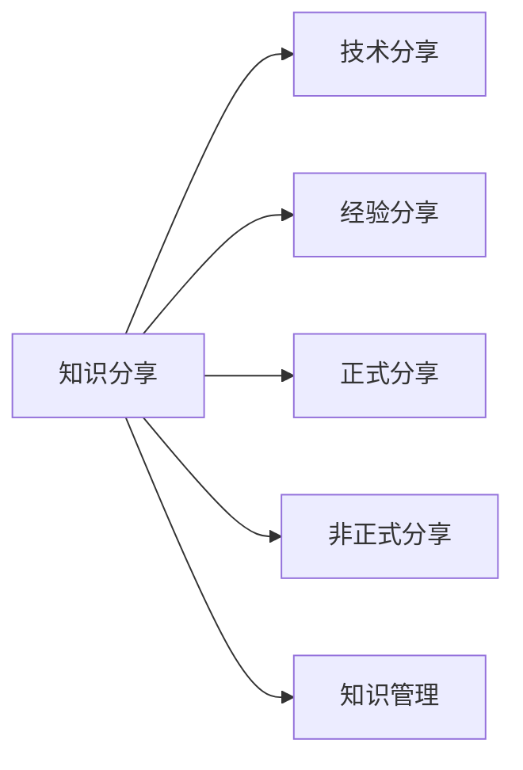

                 

# 知识分享在团队中的重要性

在当今高度协作的工作环境中，知识的共享与传递显得尤为重要。无论是技术团队还是跨领域项目组，知识共享不仅仅是对项目成功的助力，更是对团队成员个人职业发展的推动。本文将深入探讨知识分享在团队中的重要性，从其作用、实践方法、挑战与策略等层面，全面阐释这一核心管理命题。

## 1. 背景介绍

### 1.1 问题的由来
随着全球化和技术迭代速度的加快，团队工作愈发依赖于成员间的有效沟通与知识传递。在科技公司中，产品快速迭代和市场竞争使得员工必须快速学习和应用新技术，而知识分享成为这一过程中不可或缺的一环。与此同时，知识分享还是培养团队文化、提升团队成员技能、促进团队协作的重要手段。

### 1.2 问题核心关键点
知识分享的核心在于其对个人和团队的多重价值。通过知识分享，个人能提升技能、拓宽视野，而团队则能积累集体智慧、加速创新。但实践中，知识分享面临诸多挑战，如信息过载、缺乏有效机制、文化差异等。如何有效推动知识分享，成为管理层和团队成员共同关注的重点。

### 1.3 问题研究意义
对于管理者而言，有效的知识分享策略能够显著提升团队整体绩效，增强团队凝聚力。对于成员而言，知识分享不仅促进了职业发展，还加深了对团队目标和文化的认同感。

## 2. 核心概念与联系

### 2.1 核心概念概述

知识分享(Knowledge Sharing)：在团队中，通过沟通、文档、培训等多种方式传递和使用知识的过程。知识分享可以形式多样，既包括技术类知识，也包括经验、见解等软技能。

**相关核心概念**：
- 技术分享(技术类知识分享)
- 经验分享(软技能和业务经验分享)
- 正式分享(通过培训、讲座等方式)
- 非正式分享(日常沟通、案例讨论等)
- 知识管理(Knowledge Management，知识的搜集、整理和应用)

这些概念通过知识共享的过程有机地连接在一起，形成了一个完整的知识分享框架。

### 2.2 核心概念原理和架构的 Mermaid 流程图



**图表说明**：知识分享通过技术分享、经验分享、正式分享和非正式分享等形式，实现知识的收集和整理，并通过知识管理，使得知识得以在团队中有效流通。

## 3. 核心算法原理 & 具体操作步骤

### 3.1 算法原理概述

知识共享的原理是利用集体智慧解决问题。每个团队成员所掌握的知识在某种程度上都是其他成员未曾接触过的，通过分享，将这些信息汇总并应用到实际工作中，从而提升团队整体能力。

### 3.2 算法步骤详解

1. **需求分析**：明确团队内外的知识需求，包括技术问题、业务挑战、项目进展等。
2. **知识收集**：通过团队成员日常交流、文档记录、内部论坛等多种渠道收集知识。
3. **知识整理**：对收集到的知识进行分类、归档和整理，便于检索和应用。
4. **知识分享**：选择合适的分享方式，如定期的技术分享会、内部的知识库、即时通讯工具等。
5. **反馈与改进**：收集知识分享的效果反馈，不断调整和优化知识管理策略。

### 3.3 算法优缺点

**优点**：
- 加速技能提升：团队成员可以快速学习新技术、新方法，提升工作效能。
- 促进协作：知识共享能增强团队成员的信任和沟通，提升协作效率。
- 推动创新：集体的智慧可以带来新的创意和解决方案，加速技术创新。

**缺点**：
- 信息过载：过多的信息可能导致团队成员不堪重负，难以消化。
- 文化差异：不同背景和习惯的成员可能对知识共享的接受度不一。
- 形式多样性：如何统一和标准化知识共享方式，是一个复杂的管理问题。

### 3.4 算法应用领域

知识分享不仅限于技术团队，实际上在各个行业和组织中都有广泛应用。以下是几个典型领域：

- **IT与软件开发**：通过代码审查、技术分享会、内部论坛等形式，促进技术积累和团队协作。
- **医疗行业**：共享医疗知识、病例分析、新技术应用等，提高诊疗质量和效率。
- **制造业**：在生产、维护、研发等方面共享经验，提升产品品质和生产效率。
- **教育**：教师间、教师与学生间共享知识和资源，提升教学质量和学生学习能力。

## 4. 数学模型和公式 & 详细讲解 & 举例说明

### 4.1 数学模型构建

知识共享过程可以通过以下数学模型来描述：

设团队中共享的知识量为 $K$，共享的速度为 $v$，团队成员数为 $N$，每个成员的知识获取能力为 $C_i$，知识应用效率为 $E_i$。知识共享的效果 $E$ 可以表示为：

$$
E = K \times \sum_{i=1}^{N} C_i \times E_i
$$

式中，$K$ 为团队共享的知识量，$C_i$ 为第 $i$ 个成员的知识获取能力，$E_i$ 为第 $i$ 个成员的知识应用效率。

### 4.2 公式推导过程

将公式 $E = K \times \sum_{i=1}^{N} C_i \times E_i$ 进一步展开，假设每个成员的知识应用效率相同，可以简化为：

$$
E = K \times C \times N
$$

其中 $C$ 为每个成员的平均知识获取和应用能力。这表明，团队共享的知识越多，成员获取和应用能力越强，知识共享的效果就越好。

### 4.3 案例分析与讲解

**案例一：IT团队的知识共享**

某IT团队共有20名成员，每个成员的知识获取能力为 $C_i = 0.8$（即能掌握80%的知识），知识应用效率为 $E_i = 0.9$（即能高效应用所掌握的知识）。若团队每月新增的知识量为 $K = 500$。则团队的知识共享效果为：

$$
E = 500 \times 0.8 \times 0.9 \times 20 = 7200
$$

这表明，通过有效知识共享，团队每月可以提升7200点知识总量。

**案例二：制造业的知识共享**

假设某制造业工厂有50名工程师，每个工程师的知识获取能力为 $C_i = 0.9$，知识应用效率为 $E_i = 0.85$。若每月新增的知识量为 $K = 1000$。则工厂的知识共享效果为：

$$
E = 1000 \times 0.9 \times 0.85 \times 50 = 38250
$$

可以看出，制造业的知识共享效果更为显著，这与制造业技术复杂、问题多样有关。

## 5. 项目实践：代码实例和详细解释说明

### 5.1 开发环境搭建

为了实现知识共享，需要搭建一个基于Web的知识管理平台。本节将介绍如何搭建这样一个平台。

1. **选择工具和技术栈**：
   - 前端：React、Vue.js 等框架。
   - 后端：Node.js、Django 等框架。
   - 数据库：MySQL、MongoDB 等。

2. **环境搭建**：
   - 安装Node.js、npm。
   - 安装React、Vue.js。
   - 安装Django、MySQL。

### 5.2 源代码详细实现

以下是使用Node.js和Express框架搭建知识共享平台的示例代码。

**服务器端代码**：

```javascript
const express = require('express');
const app = express();
const port = 3000;

// 示例路由
app.get('/knowledge', (req, res) => {
  res.send('欢迎访问知识共享平台');
});

app.listen(port, () => {
  console.log(`知识共享平台已启动，访问地址：http://localhost:${port}`);
});
```

**客户端代码**：

```javascript
// 示例组件
class KnowledgeSharing extends React.Component {
  render() {
    return (
      <div>
        <h1>欢迎访问知识共享平台</h1>
        <p>这里可以分享你的知识，让更多人受益！</p>
      </div>
    );
  }
}

ReactDOM.render(<KnowledgeSharing />, document.getElementById('root'));
```

**数据库配置**：

```javascript
const mysql = require('mysql');

// 连接数据库
const connection = mysql.createConnection({
  host: 'localhost',
  user: 'root',
  password: 'password',
  database: 'knowledge-sharing'
});

// 示例查询
connection.query('SELECT * FROM articles', (error, results, fields) => {
  if (error) throw error;
  console.log(results);
});

connection.end();
```

### 5.3 代码解读与分析

在搭建知识共享平台时，需要注意以下几点：

1. **前后端分离**：前端负责展示和交互，后端负责数据存储和处理。
2. **安全性**：确保用户数据的安全，防止未授权访问。
3. **可扩展性**：平台应支持多种知识类型和格式，方便用户分享和检索。
4. **用户体验**：界面简洁直观，用户能快速发布和查看知识。
5. **版本控制**：实现知识版本管理，避免数据混乱和丢失。

**运行结果展示**：

1. 通过访问 `http://localhost:3000/knowledge`，用户可以看到知识共享平台的欢迎界面。
2. 用户可以在平台上发布文章、评论、分享等，查看其他成员的发布内容。

## 6. 实际应用场景

### 6.1 教育行业的知识共享

在教育领域，知识共享尤为重要。教师可以通过平台分享教学资源、研究成果、教学心得等，学生则可以自由查阅、评论、讨论。例如，某高校使用知识共享平台，教师们分享了数百篇学术论文、案例教学视频和实验报告，学生在课下可以自由查阅，提升学习效率。

### 6.2 制造业的知识共享

在制造业，知识共享可以显著提高生产效率和产品质量。工程师们通过平台分享技术文档、故障分析、新材料应用等，积累并共享经验。例如，某制造企业通过知识共享平台，积累了几百篇工程师分享的技术文档，显著提升了产品质量和生产效率。

### 6.3 医疗行业的知识共享

在医疗领域，知识共享可以推动医疗技术的进步。医生们通过平台分享病例分析、治疗方案、新技术应用等，积累并共享经验。例如，某医院通过知识共享平台，累计发布了几千篇医生分享的治疗方案，显著提高了临床诊疗水平。

## 7. 工具和资源推荐

### 7.1 学习资源推荐

1. **《知识管理：从创建到实施》**：介绍知识管理的理论和方法，帮助团队系统化管理知识。
2. **《团队协作的艺术》**：探讨团队合作的最佳实践，提高团队协作效率。
3. **《知识共享：让组织更聪明》**：介绍知识共享的具体方法和案例，推动知识共享文化的形成。

### 7.2 开发工具推荐

1. **Confluence**：用于知识文档管理和团队协作的平台，支持文档分类、检索和版本控制。
2. **Slack**：用于团队即时通讯和信息共享的平台，支持创建频道、发布消息和共享文件。
3. **Google Drive**：用于文件存储和共享的平台，支持在线编辑和版本控制。

### 7.3 相关论文推荐

1. **《知识共享在组织中的作用》**：分析知识共享对组织绩效的影响。
2. **《基于Web的知识管理系统的设计与实现》**：介绍知识管理系统的前端和后端设计和实现。
3. **《知识共享与创新绩效的关系研究》**：研究知识共享对创新绩效的影响。

## 8. 总结：未来发展趋势与挑战

### 8.1 总结

本文从理论到实践，全面阐述了知识共享在团队中的重要性，并介绍了如何构建和优化知识共享平台。通过案例分析，展示了知识共享在不同行业的应用效果。通过这些分析，我们可以看出，知识共享不仅是提高团队绩效的有效手段，更是推动个人职业发展的重要工具。

### 8.2 未来发展趋势

展望未来，知识共享将继续在各行各业发挥重要作用。技术的发展将进一步推动知识共享方式的创新，如人工智能辅助的知识推荐、区块链技术保障的知识安全等。知识共享文化也将进一步成熟，知识共享的普及和深入，将带来更多的商业机会和创新突破。

### 8.3 面临的挑战

尽管知识共享有诸多优势，但在实施过程中仍面临诸多挑战：

1. **知识过载**：过多的信息可能导致团队成员难以消化和应用。
2. **文化差异**：不同背景和习惯的成员可能对知识共享的接受度不一。
3. **信息质量**：低质量的信息可能误导团队成员，影响决策和执行。

### 8.4 研究展望

未来，知识共享的研究方向将更多地关注以下问题：

1. **个性化推荐**：开发智能推荐系统，根据用户兴趣和需求推荐知识。
2. **内容质量控制**：建立知识审核机制，保证分享的信息质量和可信度。
3. **跨文化交流**：设计跨文化知识共享平台，促进不同背景成员之间的交流和协作。

## 9. 附录：常见问题与解答

**Q1: 如何推动团队成员参与知识共享？**

A: 可以通过以下方式推动团队成员参与知识共享：
1. **领导示范**：管理者率先分享知识，树立榜样。
2. **激励机制**：设立知识分享奖励，如表扬、奖励积分等。
3. **培训和指导**：提供相关培训，帮助成员掌握知识分享技巧。

**Q2: 如何在团队中建立有效的知识分享机制？**

A: 建立有效的知识分享机制需要从多个方面入手：
1. **明确目标**：明确知识共享的目标和价值，统一团队成员的认识。
2. **选择合适的平台**：选择合适的知识管理工具，如Confluence、Slack等。
3. **制度建设**：建立知识共享的制度和规范，如定期分享会、知识库维护等。
4. **文化建设**：通过培训和文化宣传，培养知识共享的文化氛围。

**Q3: 如何避免知识共享过程中的信息过载？**

A: 避免信息过载可以采取以下措施：
1. **分类管理**：对知识进行分类管理，设置不同的访问权限。
2. **推荐算法**：开发智能推荐系统，根据用户兴趣推荐相关知识。
3. **内容质量控制**：建立知识审核机制，保证分享的信息质量。
4. **定期清理**：定期清理过时或无用的知识，保持知识库的整洁和有序。

通过这些策略，可以有效推动知识共享，提升团队整体绩效和个人职业发展。总之，知识共享是团队协作和创新发展的关键，只有在实践中不断优化和完善，才能真正发挥其潜力。

---

作者：禅与计算机程序设计艺术 / Zen and the Art of Computer Programming

