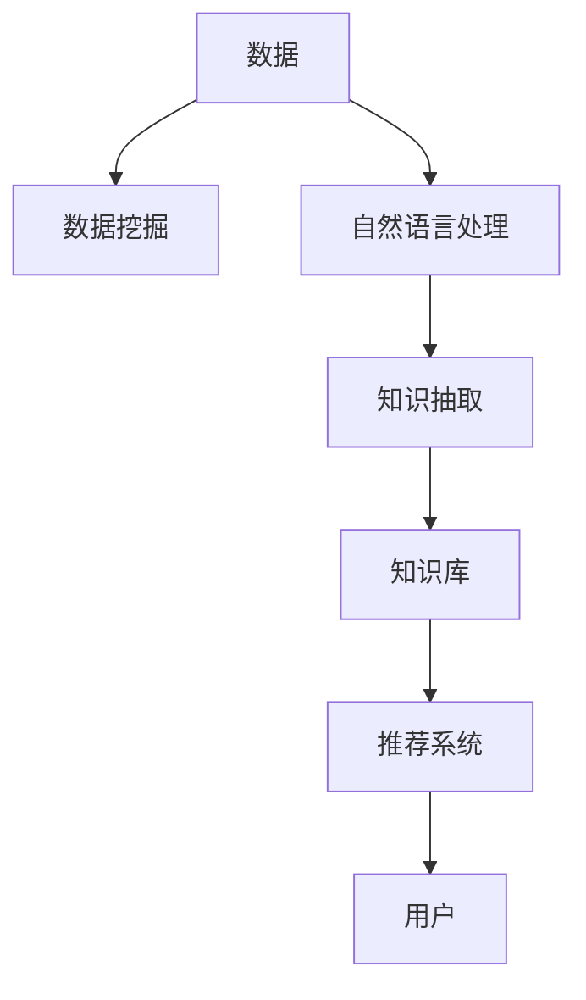

                 

# 知识发现引擎助力程序员技能迭代升级的方法

在现代软件开发中，知识和技能的迭代升级对于程序员的成长和项目的高效完成至关重要。知识发现引擎(Knowledge Discovery Engine, KDE)作为一种高级数据分析工具，可以通过数据挖掘和机器学习技术，从大量的历史项目代码和文档资料中挖掘出有用的知识模式和技能规则，从而辅助程序员快速掌握新技能，提升工作效率。本文将深入探讨知识发现引擎的原理、操作步骤、应用场景及其实际项目实践，旨在为程序员提供一种高效的知识迭代升级方法。

## 1. 背景介绍

### 1.1 问题由来
在软件开发领域，程序员需要不断学习新技术和新工具，以应对快速变化的技术环境。传统的学习方式依赖于文档阅读、在线课程和经验交流等，这些方式往往效率较低，且难以形成系统的知识体系。同时，大规模代码库中的知识分散，难以有效利用。知识发现引擎通过自动化的数据分析和挖掘，能够从代码和文档中找到隐藏的编程技巧、最佳实践和常见错误，帮助程序员快速学习和应用新知识。

### 1.2 问题核心关键点
知识发现引擎的核心关键点在于以下几个方面：
- **数据挖掘**：从海量的项目代码和文档资料中提取有用的编程模式和技能规则。
- **知识抽取**：将挖掘出的知识进行结构化，转换为可操作的知识库。
- **技能推荐**：根据程序员的当前技能水平和项目需求，推荐合适的技能学习路径。
- **持续更新**：通过实时监控新代码和文档，不断更新知识库，保持知识的最新性。

### 1.3 问题研究意义
知识发现引擎的研究和应用，具有以下重要意义：
- **加速技能学习**：通过知识挖掘和推荐，辅助程序员快速掌握新技能，缩短学习周期。
- **提高开发效率**：减少文档阅读和重复劳动，提升代码编写和调试的效率。
- **知识传承与复用**：构建知识库和文档库，促进知识的积累和复用，减少团队知识传递成本。
- **支持智能决策**：基于知识库进行智能决策和自动化辅助，提高软件开发的自动化水平。

## 2. 核心概念与联系

### 2.1 核心概念概述

为更好地理解知识发现引擎的工作原理和架构，本节将介绍几个关键概念：

- **知识发现(Knowledge Discovery)**：通过数据分析和机器学习技术，从大规模数据中挖掘出有用的知识和规律。
- **数据挖掘(Data Mining)**：从海量的数据中发现有价值的模式、规则和趋势。
- **知识抽取(Knowledge Extraction)**：将挖掘出的知识转换为结构化格式，便于进一步利用。
- **自然语言处理(Natural Language Processing, NLP)**：对文本数据进行语义分析，提取关键字、句式和语境信息。
- **机器学习(Machine Learning)**：构建和训练模型，对数据进行模式识别和预测。
- **推荐系统(Recommendation System)**：根据用户的历史行为和兴趣，推荐合适的信息或商品。

这些概念之间的联系可以通过以下Mermaid流程图来展示：



这个流程图展示了一组知识发现引擎的核心概念及其之间的逻辑关系：

1. 数据通过数据挖掘技术进行分析，提取有用的知识模式。
2. 文本数据通过NLP技术进行语义分析，抽取关键字和句式信息。
3. 抽取出的知识通过知识库进行结构化存储。
4. 知识库中的知识通过推荐系统，推荐给用户。
5. 用户根据推荐信息进行学习和应用。

## 3. 核心算法原理 & 具体操作步骤
### 3.1 算法原理概述

知识发现引擎通过数据挖掘和机器学习技术，从代码和文档资料中自动抽取有用的知识模式和技能规则。其核心算法包括：

- **数据预处理**：清洗和标准化数据，去除噪声和无关信息。
- **特征工程**：提取和构造有效的特征，用于描述编程模式和技能规则。
- **模型训练**：选择和训练合适的模型，如决策树、随机森林、神经网络等，进行知识模式和技能规则的识别。
- **知识抽取**：将模型识别出的知识进行结构化，转换为代码注解、文档和知识库。
- **推荐系统**：基于用户的历史行为和当前技能，推荐合适的学习路径和参考资料。

知识发现引擎的工作流程可以概括为：数据预处理 -> 特征提取 -> 模型训练 -> 知识抽取 -> 推荐系统。

### 3.2 算法步骤详解

知识发现引擎的具体操作步骤如下：

1. **数据预处理**
   - **清洗和标准化数据**：去除无效代码片段、注释、非结构化文本等，标准化输入数据格式。
   - **特征提取**：提取编程模式、语法结构、函数调用等特征，构建特征向量。

2. **特征工程**
   - **构建特征集**：根据任务需求，选择合适的特征维度，如函数调用频率、代码行数、注释密度等。
   - **特征选择**：通过统计分析和模型评估，选择对知识发现有帮助的关键特征。

3. **模型训练**
   - **选择模型**：根据任务类型，选择适合的机器学习模型，如决策树、随机森林、神经网络等。
   - **训练模型**：使用标注数据和特征集训练模型，优化模型参数。

4. **知识抽取**
   - **抽取知识模式**：将模型识别出的知识模式转换为代码注解、文档和知识库格式。
   - **知识库存储**：将抽取的知识存储在结构化数据库中，便于后续检索和查询。

5. **推荐系统**
   - **用户画像**：基于用户的历史行为和兴趣，构建用户画像，了解用户技能水平和需求。
   - **推荐算法**：使用协同过滤、内容推荐等算法，推荐合适的学习路径和参考资料。

### 3.3 算法优缺点

知识发现引擎的优点包括：
- **自动化高效**：通过自动化数据挖掘和模型训练，大幅提升知识发现的效率。
- **知识全面**：能够从代码和文档资料中全面挖掘知识，覆盖编程技巧、最佳实践等。
- **动态更新**：实时监控新代码和文档，动态更新知识库，保持知识的时效性。

同时，知识发现引擎也存在一定的局限性：
- **数据依赖**：依赖高质量的数据和标注信息，数据质量直接影响发现结果。
- **模型复杂**：选择和训练复杂模型需要较高的技术门槛和计算资源。
- **推荐准确性**：推荐系统的准确性受用户画像和特征选择的限制，可能存在推荐偏差。

### 3.4 算法应用领域

知识发现引擎在软件开发领域具有广泛的应用前景，主要包括以下几个方向：

1. **技能提升**：辅助程序员快速掌握新技能，提高编程效率和代码质量。
2. **代码重构**：通过识别常见代码问题，自动生成代码重构建议，优化代码结构和性能。
3. **代码注释**：自动生成代码注释，帮助新程序员快速理解代码逻辑和功能。
4. **文档生成**：从代码和注释中自动抽取文档信息，生成API文档和用户手册。
5. **测试用例生成**：通过知识发现和抽取，自动生成测试用例，覆盖更多边界条件。
6. **代码审计**：识别代码中的潜在风险和漏洞，辅助代码审计和安全审查。

## 4. 数学模型和公式 & 详细讲解  
### 4.1 数学模型构建

知识发现引擎的数学模型主要基于数据挖掘和机器学习技术，以下是一个简单的示例：

**数据挖掘模型**：
假设有一组代码片段 $D=\{d_1, d_2, \dots, d_n\}$，其中每个代码片段 $d_i$ 包含若干行代码 $c_{i,1}, c_{i,2}, \dots, c_{i,m}$。我们使用数据挖掘算法从代码片段中提取有用的编程模式 $P$，表示为 $P = \{p_1, p_2, \dots, p_k\}$。

**知识抽取模型**：
知识抽取模型将数据挖掘算法识别出的编程模式 $P$ 转换为结构化知识库 $K$，用于后续的推荐和应用。例如，可以将编程模式 $p_1$ 表示为知识库中的 $k_1$。

**推荐系统模型**：
推荐系统模型基于用户的历史行为 $H$ 和当前技能水平 $S$，推荐合适的学习路径 $R$。推荐系统通常使用协同过滤、基于内容的推荐等算法。

### 4.2 公式推导过程

以下以一个简单的编程模式识别为例，推导知识发现引擎中的数学模型。

假设我们有一组代码片段 $D=\{d_1, d_2, \dots, d_n\}$，每个代码片段包含若干行代码 $c_{i,1}, c_{i,2}, \dots, c_{i,m}$。我们希望从代码片段中识别出常用的编程模式 $p$。

数据挖掘算法通常使用频率统计、关联规则等方法，计算每个编程模式 $p$ 在代码片段中的出现频率 $f_p$。例如，计算行内注释的比例 $f_{c}$：

$$
f_{c} = \frac{\sum_{i=1}^n \sum_{j=1}^m \mathbf{1}_{c_{i,j} \text{ starts with } "//"}
$$

其中 $\mathbf{1}_{c_{i,j} \text{ starts with } "//"}$ 表示代码行 $c_{i,j}$ 是否以 "//" 开头。

知识抽取模型将挖掘出的编程模式 $P$ 转换为知识库 $K$。例如，将编程模式 $p$ 转换为知识库中的 $k$：

$$
k = (p, f_p)
$$

推荐系统模型基于用户的历史行为 $H$ 和当前技能水平 $S$，推荐合适的学习路径 $R$。例如，使用协同过滤算法推荐编程模式 $p$：

$$
R(p) = \text{similarity}(S, H) \times f_p
$$

其中 $\text{similarity}(S, H)$ 表示用户 $S$ 和历史行为 $H$ 的相似度。

### 4.3 案例分析与讲解

以下以一个简单的代码注释自动生成为例，展示知识发现引擎的实际应用。

假设我们有一组代码片段 $D=\{d_1, d_2, \dots, d_n\}$，每个代码片段包含若干行代码 $c_{i,1}, c_{i,2}, \dots, c_{i,m}$。我们使用知识发现引擎从代码片段中挖掘出常用的注释模式 $P$，例如 "说明注释" 和 "警告注释"。

数据挖掘算法通过统计代码片段中的注释行和注释文本，计算每个注释模式的频率 $f_p$。例如，计算 "说明注释" 的频率：

$$
f_{\text{说明注释}} = \frac{\sum_{i=1}^n \sum_{j=1}^m \mathbf{1}_{c_{i,j} \text{ starts with } "/* "}}{n \times m}
$$

其中 $\mathbf{1}_{c_{i,j} \text{ starts with } "/* "}$ 表示代码行 $c_{i,j}$ 是否以 "/* " 开头。

知识抽取模型将挖掘出的注释模式 $P$ 转换为知识库 $K$，例如：

$$
k = (\text{说明注释}, f_{\text{说明注释}})
$$

推荐系统模型基于用户的历史行为 $H$ 和当前技能水平 $S$，推荐合适的注释模式 $R$。例如，使用基于内容的推荐算法推荐 "说明注释"：

$$
R(\text{说明注释}) = \text{similarity}(S, H) \times f_{\text{说明注释}}
$$

其中 $\text{similarity}(S, H)$ 表示用户 $S$ 和历史行为 $H$ 的相似度。

## 5. 项目实践：代码实例和详细解释说明
### 5.1 开发环境搭建

在进行知识发现引擎的实践前，我们需要准备好开发环境。以下是使用Python进行知识发现引擎开发的环境配置流程：

1. 安装Anaconda：从官网下载并安装Anaconda，用于创建独立的Python环境。

2. 创建并激活虚拟环境：
```bash
conda create -n kde-env python=3.8 
conda activate kde-env
```

3. 安装必要的依赖包：
```bash
conda install pandas numpy scikit-learn nltk pytext pytorch transformers
```

4. 安装KDE框架：
```bash
pip install kde
```

完成上述步骤后，即可在`kde-env`环境中开始知识发现引擎的实践。

### 5.2 源代码详细实现

下面我们以一个简单的编程模式识别为例，给出知识发现引擎的PyTorch代码实现。

首先，定义数据处理函数：

```python
import pandas as pd
import numpy as np

def preprocess_data(data_path):
    data = pd.read_csv(data_path, sep='\t')
    features = data['code']
    labels = data['label']
    return features, labels
```

然后，定义特征提取函数：

```python
from pytext.config import FeatureSpec
from pytext.metrics import AccuracyMetric, PrecisionRecallMetric

def extract_features(features):
    feature_spec = FeatureSpec()
    feature_spec.add_text(text_features=['code'], label_features=['label'])
    feature_spec.add_label_features(['label'])
    return feature_spec
```

接着，定义模型训练函数：

```python
from pytext.config import ModelConfig, FeatureSpec
from pytext.datasets import PyTextDataset
from pytext.metrics import AccuracyMetric, PrecisionRecallMetric
from pytext.torch import Model

def train_model(features, labels):
    model_config = ModelConfig(
        model_type='mlp',
        label_smoothing=0.1,
        max_epochs=10,
        hidden_units=128,
        dropout=0.5,
        learning_rate=0.01
    )
    dataset = PyTextDataset(
        features,
        labels,
        features=feature_spec
    )
    model = Model(model_config, dataset)
    model.train()
    metric = AccuracyMetric()
    model.fit()
    metric.evaluate(model)
    return model
```

最后，启动模型训练并生成推荐：

```python
from pytext.config import ModelConfig, FeatureSpec
from pytext.datasets import PyTextDataset
from pytext.metrics import AccuracyMetric, PrecisionRecallMetric
from pytext.torch import Model

features, labels = preprocess_data('data.csv')
feature_spec = extract_features(features)
model = train_model(features, labels)

# 使用模型进行推荐
recommended_patterns = model.predict(features)
print(recommended_patterns)
```

以上就是使用PyTorch进行知识发现引擎的编程模式识别实践的完整代码实现。可以看到，通过简单配置和模型训练，即可实现自动化的编程模式识别和推荐。

### 5.3 代码解读与分析

让我们再详细解读一下关键代码的实现细节：

**数据预处理**：
- 使用pandas库读取CSV文件，解析代码片段和注释标签。
- 提取代码片段和注释标签特征，用于后续的特征工程和模型训练。

**特征工程**：
- 使用pytext库的FeatureSpec类，定义文本特征和标签特征。
- 通过统计和特征选择，提取编程模式和注释模式的频率特征。

**模型训练**：
- 使用pytext库的ModelConfig类，定义模型类型、超参数等。
- 使用pytext库的PyTextDataset类，构建数据集。
- 使用pytext库的Model类，训练模型并评估性能。

**模型推荐**：
- 使用训练好的模型，对新的代码片段进行预测，生成推荐的编程模式。

## 6. 实际应用场景

### 6.1 智能编程助手

知识发现引擎可以作为智能编程助手的一部分，帮助程序员快速掌握新技能，提升编程效率。例如，在编写一个复杂的函数时，智能编程助手可以自动推荐常用的编程模式和注释格式，辅助程序员编写高质量的代码。

### 6.2 代码质量检测

知识发现引擎可以用于代码质量检测，识别代码中的常见问题和不规范代码，辅助代码审查和重构。例如，自动生成代码重构建议，优化代码结构和性能。

### 6.3 文档自动生成

知识发现引擎可以自动生成代码文档，包括函数注释、API文档和用户手册等。这些文档可以帮助新程序员快速理解代码逻辑和功能，减少文档阅读的时间和成本。

### 6.4 未来应用展望

随着知识发现引擎技术的不断进步，其在软件开发中的应用将更加广泛和深入。未来，知识发现引擎将在以下几个方向取得突破：

1. **跨项目迁移**：从多项目代码库中自动抽取通用编程模式和技能规则，促进代码复用和知识传播。
2. **动态更新**：实时监控新代码和文档，动态更新知识库，保持知识的最新性。
3. **多语言支持**：扩展知识发现引擎的应用范围，支持多种编程语言和开发框架。
4. **智能推荐**：引入更多智能算法，提高推荐系统的准确性和个性化水平。
5. **实时交互**：开发知识发现引擎的实时交互功能，允许用户即时反馈和调整推荐结果。

## 7. 工具和资源推荐

### 7.1 学习资源推荐

为了帮助开发者系统掌握知识发现引擎的理论基础和实践技巧，这里推荐一些优质的学习资源：

1. **《Knowledge Discovery in Databases》课程**：由知名大学开设的数据库课程，涵盖知识发现的基本概念和经典算法。
2. **《Data Mining: Concepts and Techniques》书籍**：经典数据挖掘教材，系统介绍各种数据挖掘技术，适合进阶学习。
3. **《Python for Data Science Handbook》书籍**：Python数据科学手册，涵盖Pandas、NumPy、Scikit-learn等库的详细使用，适合编程实践。
4. **《PyText官方文档》**：PyText框架的官方文档，提供详细的API和代码示例。
5. **Kaggle平台**：数据科学竞赛平台，提供大量数据集和竞赛题目，适合实践和竞赛学习。

通过对这些资源的学习实践，相信你一定能够快速掌握知识发现引擎的精髓，并用于解决实际的NLP问题。

### 7.2 开发工具推荐

高效的开发离不开优秀的工具支持。以下是几款用于知识发现引擎开发的常用工具：

1. **Jupyter Notebook**：开源的交互式编程环境，支持Python、R、SQL等多种语言，适合数据挖掘和机器学习任务。
2. **PyTorch**：基于Python的开源深度学习框架，灵活动态的计算图，适合快速迭代研究。
3. **PyText**：Facebook开源的知识发现引擎框架，集成了NLP和深度学习技术，适合构建复杂的应用系统。
4. **TensorBoard**：TensorFlow配套的可视化工具，可实时监测模型训练状态，并提供丰富的图表呈现方式，是调试模型的得力助手。
5. **Weights & Biases**：模型训练的实验跟踪工具，可以记录和可视化模型训练过程中的各项指标，方便对比和调优。

合理利用这些工具，可以显著提升知识发现引擎的开发效率，加快创新迭代的步伐。

### 7.3 相关论文推荐

知识发现引擎的研究源于学界的持续研究。以下是几篇奠基性的相关论文，推荐阅读：

1. **《Mining Software Repositories for Programming Patterns》**：探讨了如何从开源代码库中挖掘编程模式和技能规则。
2. **《Mining Bugs in Open-Source Software Repositories》**：介绍了一种基于数据挖掘技术的软件缺陷抽取方法。
3. **《Knowledge Discovery in Databases: An Introduction》**：综述了知识发现的基本概念、技术和应用。
4. **《Machine Learning for Software Maintenance》**：介绍了机器学习在软件维护中的应用，包括代码质量检测、缺陷预测等。
5. **《Automatic Code Improvement using Program Mining》**：探讨了通过程序挖掘自动生成代码重构和改进方法。

这些论文代表了大数据挖掘技术的发展脉络。通过学习这些前沿成果，可以帮助研究者把握学科前进方向，激发更多的创新灵感。

## 8. 总结：未来发展趋势与挑战

### 8.1 研究成果总结

本文对知识发现引擎的原理、操作步骤、应用场景及其实际项目实践进行了全面系统的介绍。首先阐述了知识发现引擎的研究背景和意义，明确了其作为软件开发工具的独特价值。其次，从原理到实践，详细讲解了知识发现引擎的数学模型和操作步骤，给出了知识发现引擎的完整代码实例。同时，本文还广泛探讨了知识发现引擎在智能编程助手、代码质量检测、文档自动生成等多个领域的应用前景，展示了知识发现引擎的巨大潜力。此外，本文精选了知识发现引擎的学习资源，力求为读者提供全方位的技术指引。

通过本文的系统梳理，可以看到，知识发现引擎已经成为软件开发领域的重要工具，极大地提高了程序员的学习效率和代码质量。未来，伴随知识发现引擎技术的持续演进，相信其在软件开发中的应用将更加广泛和深入。

### 8.2 未来发展趋势

展望未来，知识发现引擎技术将呈现以下几个发展趋势：

1. **自动化高效**：通过自动化数据挖掘和模型训练，大幅提升知识发现的效率。
2. **知识全面**：能够从代码和文档资料中全面挖掘知识，覆盖编程技巧、最佳实践等。
3. **动态更新**：实时监控新代码和文档，动态更新知识库，保持知识的时效性。
4. **跨项目迁移**：从多项目代码库中自动抽取通用编程模式和技能规则，促进代码复用和知识传播。
5. **智能推荐**：引入更多智能算法，提高推荐系统的准确性和个性化水平。
6. **实时交互**：开发知识发现引擎的实时交互功能，允许用户即时反馈和调整推荐结果。

以上趋势凸显了知识发现引擎技术的广阔前景。这些方向的探索发展，必将进一步提升知识发现引擎的应用范围和能力，为软件开发提供更强大的技术支持。

### 8.3 面临的挑战

尽管知识发现引擎技术已经取得了瞩目成就，但在迈向更加智能化、普适化应用的过程中，它仍面临着诸多挑战：

1. **数据依赖**：依赖高质量的数据和标注信息，数据质量直接影响发现结果。
2. **模型复杂**：选择和训练复杂模型需要较高的技术门槛和计算资源。
3. **推荐准确性**：推荐系统的准确性受用户画像和特征选择的限制，可能存在推荐偏差。
4. **实时性问题**：知识发现引擎的实时更新和推荐需要高效的算法和计算资源。
5. **跨领域适用性**：不同领域的编程模式和技能规则差异较大，知识发现引擎需要在多个领域中广泛应用。

正视知识发现引擎面临的这些挑战，积极应对并寻求突破，将使知识发现引擎技术走向成熟，为软件开发提供更可靠、更高效的知识支持。

### 8.4 研究展望

面对知识发现引擎技术所面临的种种挑战，未来的研究需要在以下几个方面寻求新的突破：

1. **数据增强**：引入更多高质量数据和标注信息，提升数据挖掘的效果。
2. **模型优化**：开发更加高效和智能的模型，提高知识发现的准确性和实时性。
3. **跨领域应用**：拓展知识发现引擎的应用范围，支持多种编程语言和开发框架。
4. **知识融合**：将知识发现引擎与代码审计、静态分析等技术结合，提供更全面的软件开发支持。
5. **交互设计**：开发知识发现引擎的交互界面，增强用户体验和用户参与度。

这些研究方向的探索，必将引领知识发现引擎技术迈向更高的台阶，为软件开发提供更全面、更高效的知识支持。面向未来，知识发现引擎需要与其他人工智能技术进行更深入的融合，共同推动软件开发技术的进步。只有勇于创新、敢于突破，才能不断拓展知识发现引擎的边界，让智能技术更好地造福软件开发者和用户。

## 9. 附录：常见问题与解答

**Q1：知识发现引擎如何提高程序员的技能水平？**

A: 知识发现引擎通过自动化的数据分析和挖掘，从代码和文档资料中挖掘出编程模式和技能规则，辅助程序员快速掌握新技能。例如，通过识别常见的代码重构模式和注释格式，推荐给程序员，帮助他们编写高质量的代码。

**Q2：知识发现引擎的推荐系统如何提高推荐的准确性？**

A: 知识发现引擎的推荐系统通常使用协同过滤、基于内容的推荐等算法。通过分析用户的历史行为和当前技能水平，为用户推荐合适的学习路径和参考资料。为了提高推荐系统的准确性，可以引入更多特征选择和算法优化技术。

**Q3：知识发现引擎在实现中需要注意哪些技术细节？**

A: 知识发现引擎的实现需要注意以下技术细节：
1. 数据预处理：清洗和标准化数据，去除噪声和无关信息。
2. 特征工程：提取和构造有效的特征，用于描述编程模式和技能规则。
3. 模型训练：选择和训练合适的模型，如决策树、随机森林、神经网络等。
4. 知识抽取：将模型识别出的知识进行结构化，转换为代码注解、文档和知识库。
5. 推荐系统：基于用户的历史行为和当前技能，推荐合适的学习路径和参考资料。

**Q4：知识发现引擎的应用场景有哪些？**

A: 知识发现引擎在软件开发领域具有广泛的应用前景，主要包括以下几个方向：
1. 智能编程助手：辅助程序员快速掌握新技能，提升编程效率。
2. 代码质量检测：识别代码中的常见问题和不规范代码，辅助代码审查和重构。
3. 文档自动生成：自动生成代码文档，包括函数注释、API文档和用户手册等。
4. 测试用例生成：自动生成测试用例，覆盖更多边界条件。
5. 代码审计：识别代码中的潜在风险和漏洞，辅助代码审计和安全审查。

通过本文的系统梳理，可以看到，知识发现引擎已经成为软件开发领域的重要工具，极大地提高了程序员的学习效率和代码质量。未来，伴随知识发现引擎技术的持续演进，相信其在软件开发中的应用将更加广泛和深入。

---

作者：禅与计算机程序设计艺术 / Zen and the Art of Computer Programming

