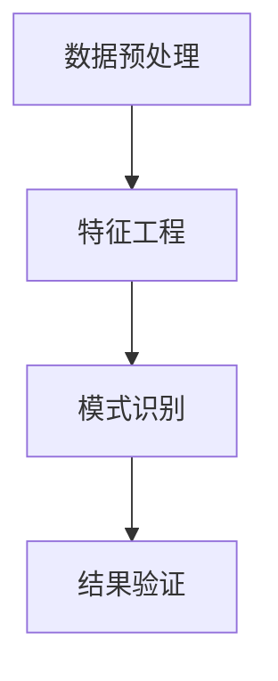

                 

# 知识发现引擎在体育科学中的应用

## 1. 背景介绍

### 1.1 问题由来

体育科学是一门多学科交叉的学科，涉及到生物学、物理学、心理学等多个领域的知识。近年来，随着数据科学和人工智能技术的快速发展，体育科学家们开始借助先进的技术手段，深入挖掘体育领域的潜在知识，优化训练策略，提升运动员的竞技水平。其中，知识发现引擎(Knowledge Discovery Engine, KDE)作为一种数据驱动的技术手段，在体育科学中的应用日益受到重视。

### 1.2 问题核心关键点

知识发现引擎是一种用于自动分析和挖掘数据中的隐含知识和规律的技术。在体育科学中，通过应用知识发现引擎，可以从大量的训练、比赛数据中，发现运动员的生理、心理特征与比赛表现之间的关系，辅助教练制定科学的训练方案，提升运动员的综合素质和比赛成绩。

知识发现引擎的核心在于以下几个方面：

1. **数据预处理**：对原始数据进行清洗、转换和标准化，使之适合于后续的分析工作。
2. **特征工程**：通过提取、选择和转换特征，提高数据的质量和可解释性。
3. **模式识别**：利用机器学习和深度学习技术，自动发现数据中的潜在模式和规律。
4. **结果验证**：通过交叉验证、因果推断等方法，验证发现的模式和规律的有效性。

## 2. 核心概念与联系

### 2.1 核心概念概述

为了更好地理解知识发现引擎在体育科学中的应用，本节将介绍几个关键概念：

- **知识发现(Knowledge Discovery)**：指从原始数据中提取有用的知识和模式，包括但不限于数据挖掘、模式识别、信息提取等。
- **数据预处理(Data Preprocessing)**：指对原始数据进行清洗、转换、归一化等处理，使之适合于后续的分析和建模工作。
- **特征工程(Feature Engineering)**：指通过对数据进行特征提取、选择和转换，提高数据的质量和可解释性，为模型训练提供更好的输入。
- **机器学习(Machine Learning)**：指通过算法和模型，自动从数据中学习规律和知识，用于预测、分类、聚类等任务。
- **深度学习(Deep Learning)**：指使用多层神经网络，自动从数据中学习高层次的抽象特征，用于更复杂的任务。

这些概念之间的逻辑关系可以通过以下Mermaid流程图来展示：



这个流程图展示了知识发现引擎的整个流程：

1. 首先对原始数据进行清洗和转换。
2. 然后通过特征提取和选择，提升数据的质量和可解释性。
3. 利用机器学习和深度学习技术，自动发现数据中的模式和规律。
4. 最后通过交叉验证等方法，验证发现的模式和规律的有效性。

## 3. 核心算法原理 & 具体操作步骤
### 3.1 算法原理概述

知识发现引擎在体育科学中的应用，主要基于数据驱动的机器学习和深度学习方法。其核心思想是通过对运动员的训练、比赛数据进行分析，发现其中隐藏的规律和知识，用于指导训练和比赛。

知识发现引擎的核心算法包括但不限于：

- 决策树算法(Decision Tree)
- 随机森林算法(Random Forest)
- 支持向量机算法(Support Vector Machine, SVM)
- 神经网络算法(Neural Network)
- 深度学习算法(如卷积神经网络、循环神经网络等)

这些算法可以用于分类、回归、聚类等不同类型的任务，发现数据中的潜在模式和规律。

### 3.2 算法步骤详解

知识发现引擎在体育科学中的应用，一般包括以下几个关键步骤：

**Step 1: 数据采集与预处理**

- 收集运动员的训练数据、比赛数据、生理数据、心理数据等。
- 对数据进行清洗和转换，包括去除异常值、处理缺失值、归一化等。
- 对数据进行标准化处理，使之适合于后续的机器学习建模工作。

**Step 2: 特征提取与选择**

- 通过特征工程，提取和选择对预测目标有重要影响的特征。
- 对提取的特征进行转换，如PCA降维、LDA降维等。
- 对特征进行可视化，了解特征之间的相关性。

**Step 3: 模型训练与验证**

- 选择合适的机器学习或深度学习模型，训练数据集。
- 使用交叉验证等方法，验证模型的泛化能力。
- 调整模型参数，提高模型的性能。

**Step 4: 结果分析与应用**

- 对模型预测结果进行分析，理解模型输出的物理意义。
- 将模型应用于训练和比赛中，优化训练方案和比赛策略。
- 持续收集新数据，更新模型，提高预测准确率。

### 3.3 算法优缺点

知识发现引擎在体育科学中的应用，具有以下优点：

- **自动化**：能够自动从大量数据中发现规律和知识，减少人工干预。
- **可解释性**：通过特征工程和模型选择，提高模型的可解释性，便于教练理解和应用。
- **灵活性**：适用于各种类型的体育数据，能够处理不同来源和形式的数据。

但同时，知识发现引擎也存在以下局限：

- **数据依赖**：依赖于高质量、丰富多样化的数据集，数据质量差将影响分析结果。
- **模型复杂性**：需要选择合适的模型和参数，模型过于复杂可能导致过拟合。
- **解释难度**：某些深度学习模型如神经网络，其决策过程复杂，难以解释。

## 4. 数学模型和公式 & 详细讲解 & 举例说明
### 4.1 数学模型构建

知识发现引擎在体育科学中的应用，涉及多个数学模型。这里以分类任务为例，介绍常见的数学模型和公式。

假设运动员的生理数据、心理数据和比赛成绩可以用特征向量 $X$ 表示，分类任务的标签用 $Y$ 表示。常用的分类模型包括逻辑回归、支持向量机、决策树等。这里以逻辑回归为例，其数学模型为：

$$
P(Y=1|X;\theta) = \frac{1}{1+\exp(-\theta^TX)}
$$

其中 $\theta$ 为模型的参数向量，$P(Y=1|X;\theta)$ 表示在特征向量 $X$ 下，标签 $Y=1$ 的概率。

### 4.2 公式推导过程

以逻辑回归为例，模型的损失函数为交叉熵损失函数：

$$
L(\theta) = -\frac{1}{N}\sum_{i=1}^N [y_i\log P(Y=1|X_i;\theta) + (1-y_i)\log P(Y=0|X_i;\theta)]
$$

通过梯度下降等优化算法，最小化损失函数，得到模型的参数：

$$
\theta \leftarrow \theta - \eta \nabla_{\theta}L(\theta)
$$

其中 $\eta$ 为学习率。

### 4.3 案例分析与讲解

以篮球比赛为例，应用知识发现引擎可以分析不同球员的技术特点与比赛表现之间的关系。假设收集了球员在比赛中的投篮次数、命中率、助攻次数、篮板次数等数据，以及比赛结果。通过逻辑回归模型，可以建立球员的技术特点与比赛结果之间的关系，预测不同技术特点的球员在比赛中的表现。

## 5. 项目实践：代码实例和详细解释说明
### 5.1 开发环境搭建

在进行体育科学数据分析和建模之前，我们需要准备好开发环境。以下是使用Python进行Scikit-learn开发的环境配置流程：

1. 安装Anaconda：从官网下载并安装Anaconda，用于创建独立的Python环境。

2. 创建并激活虚拟环境：
```bash
conda create -n sports-env python=3.8 
conda activate sports-env
```

3. 安装Scikit-learn：
```bash
conda install scikit-learn
```

4. 安装各类工具包：
```bash
pip install numpy pandas matplotlib seaborn jupyter notebook ipython
```

完成上述步骤后，即可在`sports-env`环境中开始体育科学数据分析和建模。

### 5.2 源代码详细实现

下面我们以篮球比赛数据为例，给出使用Scikit-learn进行球员技术特点与比赛表现关系分析的Python代码实现。

首先，定义数据处理函数：

```python
import pandas as pd
from sklearn.model_selection import train_test_split
from sklearn.preprocessing import StandardScaler

def load_data(filename):
    data = pd.read_csv(filename)
    return data

def preprocess_data(data, target):
    X = data.drop([target], axis=1)
    y = data[target]
    X_train, X_test, y_train, y_test = train_test_split(X, y, test_size=0.2, random_state=42)
    scaler = StandardScaler()
    X_train = scaler.fit_transform(X_train)
    X_test = scaler.transform(X_test)
    return X_train, X_test, y_train, y_test
```

然后，定义模型训练函数：

```python
from sklearn.linear_model import LogisticRegression
from sklearn.metrics import accuracy_score

def train_model(X_train, y_train, X_test, y_test):
    model = LogisticRegression()
    model.fit(X_train, y_train)
    y_pred = model.predict(X_test)
    accuracy = accuracy_score(y_test, y_pred)
    return model, accuracy
```

接着，定义结果输出函数：

```python
def output_results(model, accuracy):
    print("Accuracy: {:.2f}%".format(accuracy*100))
    feature_importances = model.coef_[0]
    features = list(data.columns[1:])  # 排除目标变量
    for i, feature in enumerate(features):
        print("{}: {:.2f}%".format(feature, feature_importances[i]*100))
```

最后，启动模型训练流程：

```python
filename = 'basketball.csv'
data = load_data(filename)
X_train, X_test, y_train, y_test = preprocess_data(data, 'win')
model, accuracy = train_model(X_train, y_train, X_test, y_test)
output_results(model, accuracy)
```

以上就是使用Scikit-learn进行篮球比赛数据分析和建模的完整代码实现。可以看到，得益于Scikit-learn的强大封装，我们能够用相对简洁的代码完成模型的训练和预测。

### 5.3 代码解读与分析

让我们再详细解读一下关键代码的实现细节：

**load_data函数**：
- 使用Pandas库读取CSV文件，返回一个DataFrame对象。

**preprocess_data函数**：
- 将数据集划分为训练集和测试集，并进行标准化处理。

**train_model函数**：
- 定义逻辑回归模型，并进行训练和预测。
- 计算模型在测试集上的准确率。

**output_results函数**：
- 输出模型的准确率，并打印每个特征的权重。

**main流程**：
- 定义数据文件路径。
- 加载数据并进行预处理。
- 定义模型并进行训练。
- 输出模型的准确率和特征权重。

可以看到，Scikit-learn提供了简单易用的接口，使得模型训练和分析变得非常简单。

当然，工业级的系统实现还需考虑更多因素，如模型的保存和部署、超参数的自动搜索、更灵活的任务适配层等。但核心的建模流程基本与此类似。

## 6. 实际应用场景
### 6.1 运动员伤病预测

运动员的伤病状况直接关系到其竞技状态和比赛表现。通过应用知识发现引擎，可以从运动员的历史训练和比赛数据中，发现伤病与比赛表现之间的关系，辅助教练及时调整训练计划和比赛策略，避免伤病发生。

在技术实现上，可以收集运动员的训练数据、比赛数据、生理数据、心理数据等，对数据进行预处理和特征工程，建立预测伤病的模型。例如，使用决策树模型，对运动员的训练强度、比赛强度、心理压力等因素进行分析，预测其伤病发生的概率。

### 6.2 运动能力评估

运动员的运动能力是衡量其竞技水平的重要指标。通过应用知识发现引擎，可以从运动员的训练数据中，发现运动能力与比赛表现之间的关系，辅助教练制定科学的训练方案。

在技术实现上，可以收集运动员的训练数据，对数据进行预处理和特征工程，建立评估运动能力的模型。例如，使用随机森林模型，对运动员的爆发力、耐力、速度等因素进行分析，预测其在不同项目中的表现。

### 6.3 比赛策略优化

比赛的策略制定是影响比赛结果的关键因素。通过应用知识发现引擎，可以从运动员的历史比赛数据中，发现策略与比赛表现之间的关系，辅助教练制定最优的比赛策略。

在技术实现上，可以收集运动员的比赛数据，对数据进行预处理和特征工程，建立优化比赛策略的模型。例如，使用支持向量机模型，对运动员的传球、射门、防守等因素进行分析，预测不同策略下的比赛结果。

### 6.4 未来应用展望

随着知识发现引擎在体育科学中的应用不断深入，未来有望在更多领域得到广泛应用，为体育事业带来革命性影响。

在智慧体育领域，知识发现引擎可以用于赛事预测、观众分析、球票销售等方面，提高赛事的组织和管理水平，提升观众的体验。

在运动训练领域，知识发现引擎可以用于个性化训练计划制定、运动损伤预防、体能评估等方面，提升训练效果，保障运动员健康。

在体育管理领域，知识发现引擎可以用于运动数据监控、赛事数据分析、比赛策略分析等方面，提高体育管理的科学性和效率。

此外，在青少年体育、社区体育、体育教育等领域，知识发现引擎也有望发挥重要作用，推动体育事业的普及和发展。

## 7. 工具和资源推荐
### 7.1 学习资源推荐

为了帮助开发者系统掌握知识发现引擎在体育科学中的应用，这里推荐一些优质的学习资源：

1. 《Python数据科学手册》系列博文：由数据科学专家撰写，深入浅出地介绍了Python在数据分析和建模中的应用，包括Scikit-learn的使用。

2. Coursera《数据科学导论》课程：由斯坦福大学开设的在线课程，系统讲解数据科学的基本概念和常见算法，包括机器学习和深度学习。

3. 《数据科学与Python编程》书籍：全面介绍了数据科学的技术栈和实践方法，适合初学者和中级开发者。

4. Scikit-learn官方文档：提供了丰富的机器学习算法和工具库，是学习知识发现引擎的重要资料。

5. Kaggle比赛平台：提供了大量体育科学领域的数据集和比赛，通过实践可以积累丰富的经验。

通过对这些资源的学习实践，相信你一定能够快速掌握知识发现引擎在体育科学中的应用，并用于解决实际的体育问题。
###  7.2 开发工具推荐

高效的开发离不开优秀的工具支持。以下是几款用于知识发现引擎开发的常用工具：

1. Jupyter Notebook：基于Python的交互式开发环境，支持代码块、图形化界面和数据可视化。

2. Matplotlib和Seaborn：数据可视化工具，用于绘制各类图表，便于数据展示和分析。

3. Pandas：数据处理和分析工具，用于数据清洗、转换和分析。

4. Scikit-learn：Python机器学习库，提供了丰富的算法和工具，支持数据预处理、特征工程、模型训练等。

5. TensorFlow和PyTorch：深度学习框架，支持复杂模型的训练和推理。

6. Weights & Biases：模型训练的实验跟踪工具，记录和可视化模型训练过程中的各项指标，方便对比和调优。

7. TensorBoard：TensorFlow配套的可视化工具，实时监测模型训练状态，提供丰富的图表呈现方式。

合理利用这些工具，可以显著提升知识发现引擎的开发效率，加快创新迭代的步伐。

### 7.3 相关论文推荐

知识发现引擎在体育科学中的应用，已有多篇前沿论文进行研究，推荐阅读：

1. "A Survey of Machine Learning Approaches for Sports Science"：综述了各类机器学习方法在体育科学中的应用，包括数据预处理、特征工程、模型训练等。

2. "K-Nearest Neighbor Algorithms for Sports Analytics"：探讨了KNN算法在体育数据分析中的应用，介绍了其优缺点和适用场景。

3. "Application of Data Mining in Sports Science"：介绍了一系列数据挖掘方法在体育科学中的应用，如聚类、关联规则、异常检测等。

4. "Deep Learning in Sports Analytics: A Review"：综述了深度学习在体育数据分析中的应用，包括卷积神经网络、循环神经网络等。

这些论文代表了大语言模型微调技术的发展脉络。通过学习这些前沿成果，可以帮助研究者把握学科前进方向，激发更多的创新灵感。

## 8. 总结：未来发展趋势与挑战

### 8.1 总结

本文对知识发现引擎在体育科学中的应用进行了全面系统的介绍。首先阐述了知识发现引擎在体育科学中的应用背景和意义，明确了知识发现引擎在优化训练方案、提升比赛成绩方面的独特价值。其次，从原理到实践，详细讲解了知识发现引擎的数学模型和关键步骤，给出了体育科学数据分析和建模的完整代码实例。同时，本文还广泛探讨了知识发现引擎在体育科学中的应用场景，展示了知识发现引擎的广阔前景。

通过本文的系统梳理，可以看到，知识发现引擎在体育科学中的应用已经初具规模，为体育训练和比赛带来了新的思路和工具。未来，伴随技术不断进步，知识发现引擎必将在更多领域得到应用，为体育事业带来更深远的变革。

### 8.2 未来发展趋势

展望未来，知识发现引擎在体育科学中的应用将呈现以下几个发展趋势：

1. **数据整合能力增强**：随着数据采集技术的不断发展，体育数据的类型和来源将更加多样。知识发现引擎需要具备更加强大的数据整合能力，能够处理和融合多种来源的数据。

2. **模型多样化和集成化**：除了传统的机器学习算法，未来知识发现引擎将引入更多先进算法，如深度学习、强化学习等。同时，模型之间也将更加集成化，通过融合多种算法，提高预测的准确性和鲁棒性。

3. **实时化和智能推荐**：未来知识发现引擎将具备更强的实时处理能力，能够实时分析体育数据，提供即时的决策支持。同时，通过智能推荐系统，可以更加个性化地服务教练和运动员，提升其训练和比赛效果。

4. **多学科融合**：体育科学涉及多学科知识，知识发现引擎将更加注重多学科融合，综合利用生物学、物理学、心理学等多领域的知识，提高模型的全面性和普适性。

5. **用户交互优化**：知识发现引擎将更加注重用户交互，通过用户反馈不断优化模型，提供更符合用户需求的服务。

以上趋势凸显了知识发现引擎在体育科学中的应用前景。这些方向的探索发展，必将进一步提升体育训练和比赛的智能化水平，推动体育事业的科学化、信息化、智能化发展。

### 8.3 面临的挑战

尽管知识发现引擎在体育科学中的应用已经取得了一定进展，但在迈向更加智能化、普适化应用的过程中，它仍面临着诸多挑战：

1. **数据质量问题**：体育数据采集和存储的不规范，导致数据质量参差不齐。如何保证数据的一致性和完整性，是知识发现引擎面临的首要挑战。

2. **算法复杂性**：知识发现引擎的应用需要复杂的算法和模型，对开发者要求较高。如何降低算法复杂性，提高模型的可解释性和可操作性，是未来的重要课题。

3. **资源消耗高**：知识发现引擎的训练和推理过程需要大量的计算资源，如何降低资源消耗，提高计算效率，是实际应用中需要解决的问题。

4. **模型可解释性不足**：深度学习模型在体育科学中的应用，存在可解释性不足的问题。如何提高模型的可解释性，增强用户对模型的信任，是亟需解决的问题。

5. **算法偏见**：知识发现引擎的算法和模型可能存在偏见，导致预测结果的不公平。如何消除算法偏见，保证预测结果的公正性，是必须面对的挑战。

6. **数据隐私保护**：体育数据涉及运动员的个人隐私，如何在保障数据隐私的前提下，进行有效的分析和建模，是知识发现引擎应用的重要保障。

正视知识发现引擎面临的这些挑战，积极应对并寻求突破，将是知识发现引擎在体育科学中不断进步的关键。

### 8.4 研究展望

面对知识发现引擎在体育科学中的应用所面临的挑战，未来的研究需要在以下几个方面寻求新的突破：

1. **提升数据质量**：建立数据采集和存储的标准化流程，提高数据的一致性和完整性，确保数据的质量和可靠性。

2. **简化算法复杂性**：开发更加易于理解和操作的算法和模型，提高模型的可解释性和可操作性，降低对开发者的要求。

3. **优化资源消耗**：通过模型压缩、量化加速等技术，提高模型的推理速度和计算效率，降低计算资源消耗。

4. **增强模型可解释性**：引入可解释性技术，如特征重要性分析、模型可视化等，提高模型的可解释性，增强用户对模型的信任。

5. **消除算法偏见**：开发更加公平的算法和模型，消除偏见，保证预测结果的公正性。

6. **保护数据隐私**：采用差分隐私、联邦学习等技术，保护体育数据的隐私和安全，确保数据的使用合规。

这些研究方向的发展，将进一步推动知识发现引擎在体育科学中的应用，为体育事业的科学化、信息化、智能化发展提供新的动力。

## 9. 附录：常见问题与解答

**Q1：知识发现引擎在体育科学中的应用是否适用于所有体育项目？**

A: 知识发现引擎在体育科学中的应用，适用于各种类型的体育项目。但不同项目的特征和目标不同，需要针对性地设计和选择特征和模型。例如，篮球项目的运动员技术和比赛表现关系，与田径项目的运动员体能和比赛表现关系可能有所不同。

**Q2：知识发现引擎在体育科学中的应用是否依赖于高质量的数据？**

A: 是的，知识发现引擎在体育科学中的应用，对数据质量的要求较高。高质量的数据有助于发现规律和知识，提高模型的预测准确率。因此，在数据采集和处理阶段，需要特别注意数据的完整性、一致性和可靠性。

**Q3：知识发现引擎在体育科学中的应用是否容易受到算法偏见的影响？**

A: 是的，知识发现引擎的算法和模型可能存在偏见，导致预测结果的不公平。因此，在设计和选择算法时，需要考虑算法的公平性和公正性，避免算法偏见的影响。可以通过引入公平性约束、对抗训练等技术，减少算法偏见。

**Q4：知识发现引擎在体育科学中的应用是否需要大量的计算资源？**

A: 是的，知识发现引擎的训练和推理过程需要大量的计算资源，尤其是深度学习模型。因此，在实际应用中，需要选择合适的硬件设备和优化算法，提高计算效率和模型推理速度。

**Q5：知识发现引擎在体育科学中的应用是否易于理解和操作？**

A: 目前的知识发现引擎算法和模型较为复杂，对开发者要求较高。但随着技术的不断发展，未来的知识发现引擎将更加易于理解和操作，通过可视化工具和解释性技术，使普通用户也能轻松使用。

---

作者：禅与计算机程序设计艺术 / Zen and the Art of Computer Programming

