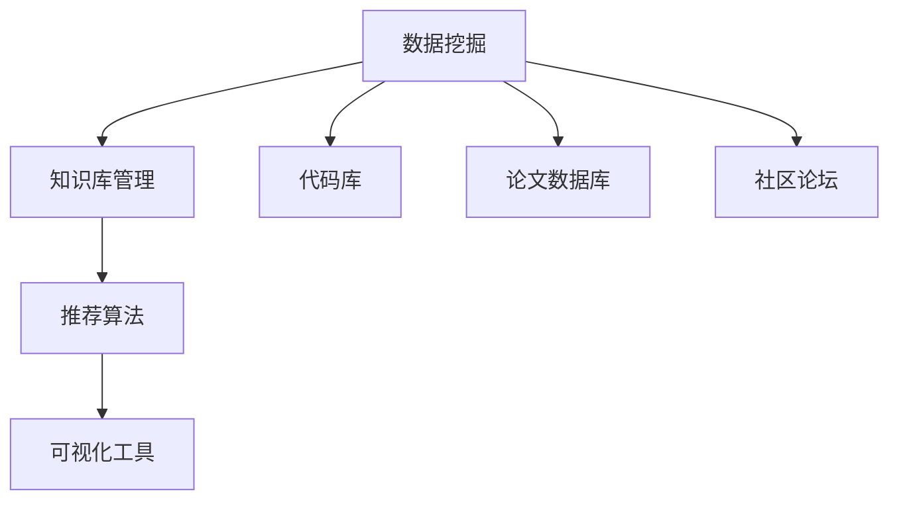

                 

# 知识发现引擎如何帮助程序员快速成长

## 1. 背景介绍

### 1.1 问题由来
随着技术的发展和市场需求的增加，程序员面临的学习和开发压力越来越大。如何有效利用可用资源，提升编程技能，成为每一个程序员都关心的问题。知识发现引擎(Knowledge Discovery Engine, KDE)作为一种自动化、智能化的技术手段，正逐渐成为程序员快速成长的重要工具。

### 1.2 问题核心关键点
知识发现引擎是一种通过数据挖掘和机器学习技术，自动从大量代码、文档、论文等资源中提取知识，并提供给程序员的技术。其核心思想是通过智能推荐、数据探索等方式，帮助程序员学习新知识、掌握新技术，加速技能提升。

### 1.3 问题研究意义
知识发现引擎为程序员提供了一个高效、智能的学习平台，可以显著降低学习成本，提升学习效率，推动技术创新。通过系统的知识发现和技能培养，程序员能够更加高效地适应技术变化，加速个人职业发展。

## 2. 核心概念与联系

### 2.1 核心概念概述

知识发现引擎是指利用数据挖掘、机器学习等技术手段，自动从大规模知识库中抽取有价值信息，并通过推荐系统、搜索系统等方式提供给用户的技术。其关键组件包括：

- 数据挖掘模块：从代码库、论文、社区等数据源中提取知识元组。
- 知识库管理模块：存储和管理知识元组，支持搜索和推荐。
- 推荐算法模块：根据用户兴趣和行为，推荐相关知识。
- 可视化工具：以图表、报告等形式呈现发现的知识和推荐内容。

这些模块通过合理的数据流动和算法模型，实现了从原始数据到有用知识的自动化发现过程。

### 2.2 核心概念原理和架构的 Mermaid 流程图



### 2.3 核心概念联系

知识发现引擎通过以下方式将核心组件联系起来：
- 数据挖掘模块从多源数据中提取知识元组，存储到知识库管理模块。
- 推荐算法根据用户行为和偏好，从知识库中提取相关知识并推荐给用户。
- 可视化工具将发现的知识以图表、报告等形式呈现，帮助用户更好地理解和学习。

这些组件通过数据流动和算法计算，形成了一个完整的知识发现和推荐系统。

## 3. 核心算法原理 & 具体操作步骤

### 3.1 算法原理概述

知识发现引擎的核心算法主要基于机器学习和数据挖掘技术。其核心思想是通过对大规模数据源的自动分析和挖掘，提取有价值的信息，并通过推荐算法和可视化工具，将知识传递给用户。

具体算法流程如下：

1. **数据挖掘**：从代码库、论文数据库、社区论坛等数据源中提取知识元组，如代码片段、技术文档、论坛帖子等。
2. **知识元组表示**：将提取的知识元组转换为机器可理解的形式，如词向量、句子表示等。
3. **推荐算法**：根据用户的历史行为和兴趣，选择最相关的知识元组进行推荐。
4. **知识可视化**：将推荐的知识以图表、报告等形式展示，帮助用户理解和学习。

### 3.2 算法步骤详解

#### 3.2.1 数据预处理
- **数据清洗**：过滤掉噪声数据和不相关数据。
- **数据规范化**：统一数据格式和表示，便于后续处理。
- **特征提取**：将文本、代码等原始数据转换为机器可理解的形式，如TF-IDF、word2vec、BERT等。

#### 3.2.2 知识表示
- **词向量表示**：通过Word2Vec、GloVe等算法，将单词表示为向量形式。
- **句子和段落表示**：通过TextRank、BERT等算法，将句子或段落表示为向量形式。

#### 3.2.3 推荐算法
- **协同过滤**：通过用户-项目评分矩阵，计算用户与知识元组的相似度。
- **内容过滤**：通过分析知识元组的内容特征，推荐相关内容。
- **混合推荐**：结合协同过滤和内容过滤，提升推荐精度。

#### 3.2.4 知识可视化
- **静态可视化**：通过图表、报告等形式，展示推荐知识的核心信息。
- **交互可视化**：允许用户通过界面操作，筛选、排序、放大等，进一步理解知识。

### 3.3 算法优缺点

#### 3.3.1 优点
- **自动化程度高**：可以自动从大规模数据源中提取知识，减轻人工工作量。
- **个性化推荐**：根据用户兴趣和行为，提供个性化的学习资源。
- **信息全面**：覆盖代码库、论文、社区等多样化数据源，提供丰富的学习资源。
- **高效便捷**：利用机器学习和数据挖掘技术，显著提高知识发现和学习的效率。

#### 3.3.2 缺点
- **数据依赖性强**：需要大规模高质量的数据源，数据采集和处理成本较高。
- **算法复杂度高**：机器学习算法复杂，需要较强的计算能力和硬件支持。
- **知识局限性**：知识表示和推荐算法有一定的局限性，难以发现所有相关知识。
- **用户依赖性强**：需要用户主动参与数据标注和模型训练，用户行为会影响推荐结果。

### 3.4 算法应用领域

知识发现引擎在多个领域都有广泛应用，例如：

- **软件开发**：提取代码片段、技术文档、开源库等资源，帮助开发者学习和理解新技术。
- **学术研究**：提取论文摘要、参考文献、研究报告等，帮助研究人员了解最新研究动态和成果。
- **技术培训**：提取课程大纲、教学视频、练习题等，帮助学习者掌握专业技能。
- **项目管理**：提取项目文档、需求文档、进度报告等，帮助项目经理了解项目情况和风险。

## 4. 数学模型和公式 & 详细讲解 & 举例说明

### 4.1 数学模型构建

知识发现引擎的数学模型主要包括以下几个部分：

1. **知识表示模型**：将知识元组表示为向量形式，便于后续的机器学习处理。
2. **推荐算法模型**：根据用户行为和兴趣，计算推荐得分。
3. **优化模型**：通过优化算法，提升推荐算法的准确性和效率。

### 4.2 公式推导过程

#### 4.2.1 知识表示

知识元组 $x$ 表示为向量 $x = [x_1, x_2, ..., x_n]$，其中 $x_i$ 表示第 $i$ 个特征。

**词向量表示**：

$$
w_i = \text{word2vec}(x_i)
$$

**句子和段落表示**：

$$
p_j = \text{TextRank}(x_j)
$$

#### 4.2.2 推荐算法

**协同过滤**：假设用户 $u$ 对知识元组 $i$ 的评分 $r_{ui} = \alpha_i + \beta_u$，其中 $\alpha_i$ 表示知识元组的评分，$\beta_u$ 表示用户的评分。

**内容过滤**：假设知识元组 $i$ 和用户 $u$ 的相似度为 $s_{iu}$，则 $r_{ui} = \alpha_i \cdot s_{iu}$。

#### 4.2.3 优化模型

使用梯度下降等优化算法，最小化损失函数：

$$
\mathcal{L}(\theta) = \frac{1}{N} \sum_{i=1}^N \sum_{u=1}^U (r_{ui} - \hat{r}_{ui})^2
$$

其中 $\hat{r}_{ui}$ 表示推荐系统预测的评分。

### 4.3 案例分析与讲解

**案例1：代码片段推荐**

假设有一个开源库，包含多个代码片段。可以通过提取这些代码片段的词向量表示，计算用户对代码片段的评分，并结合协同过滤和内容过滤算法，推荐最相关的代码片段给用户。

**案例2：学术论文推荐**

假设有一个学术论文数据库，包含大量论文摘要。可以通过提取摘要的句子表示，计算用户对论文的评分，并结合内容过滤算法，推荐最相关的论文给用户。

## 5. 项目实践：代码实例和详细解释说明

### 5.1 开发环境搭建

要实现一个知识发现引擎，需要搭建以下几个环境：

1. **数据库**：用于存储和查询知识元组。
2. **数据预处理工具**：用于清洗和规范化数据。
3. **特征提取工具**：用于提取文本、代码等数据特征。
4. **机器学习框架**：用于训练推荐算法模型。
5. **可视化工具**：用于展示推荐结果。

### 5.2 源代码详细实现

以下是一个简单的代码示例，展示如何使用TensorFlow实现一个基于协同过滤的推荐系统。

```python
import tensorflow as tf
import numpy as np

# 构建数据集
data = np.array([[0, 1, 1, 1, 1], [1, 0, 1, 0, 0], [1, 1, 0, 1, 0], [1, 0, 1, 1, 1]])
user_num, item_num = data.shape

# 构建用户-项目评分矩阵
rating = np.array([[2, 5, 4, 3, 4], [4, 3, 2, 5, 4]])

# 构建模型
model = tf.keras.Sequential([
    tf.keras.layers.Dense(64, activation='relu', input_shape=(user_num,)),
    tf.keras.layers.Dense(32, activation='relu'),
    tf.keras.layers.Dense(item_num, activation='softmax')
])

# 定义损失函数
def loss_fn(y_true, y_pred):
    return tf.reduce_mean(tf.nn.softmax_cross_entropy_with_logits_v2(labels=y_true, logits=y_pred))

# 定义优化器
optimizer = tf.keras.optimizers.Adam(learning_rate=0.01)

# 定义训练过程
@tf.function
def train_step(x, y):
    with tf.GradientTape() as tape:
        y_pred = model(x)
        loss = loss_fn(y, y_pred)
    gradients = tape.gradient(loss, model.trainable_variables)
    optimizer.apply_gradients(zip(gradients, model.trainable_variables))

# 训练模型
for epoch in range(10):
    for i in range(len(data)):
        x = np.reshape(data[i], (1, user_num))
        y = rating[i]
        train_step(x, y)
```

### 5.3 代码解读与分析

**数据预处理**：

- **构建数据集**：将用户-项目评分矩阵转换为numpy数组。
- **构建用户-项目评分矩阵**：假设用户对多个项目评分，将评分转换为矩阵形式。

**模型定义**：

- **构建模型**：使用多层神经网络定义模型结构。
- **定义损失函数**：使用交叉熵损失函数。
- **定义优化器**：使用Adam优化器。

**训练过程**：

- **定义训练步骤**：使用梯度下降更新模型参数。
- **训练模型**：循环多次迭代，更新模型参数，最小化损失函数。

### 5.4 运行结果展示

训练完成后，可以使用以下代码进行推荐测试：

```python
# 测试推荐结果
test_data = np.array([[1, 0, 1, 1, 1]])
x = np.reshape(test_data, (1, user_num))
y_pred = model(x)

# 输出推荐结果
print(y_pred)
```

## 6. 实际应用场景

### 6.1 软件开发

知识发现引擎在软件开发中的应用非常广泛，可以帮助开发者快速学习新技术、掌握新工具。例如：

- **代码片段推荐**：根据用户的编码习惯和项目需求，推荐相关的代码片段，提高开发效率。
- **技术文档推荐**：根据用户的代码和文档阅读历史，推荐相关的技术文档，帮助用户深入理解技术细节。
- **开源库推荐**：根据用户的使用情况和需求，推荐合适的开源库，加速项目开发。

### 6.2 学术研究

知识发现引擎在学术研究中的应用也非常重要，可以帮助研究人员快速了解最新研究动态和成果。例如：

- **论文推荐**：根据用户的阅读历史和兴趣，推荐相关的学术论文，帮助研究人员掌握最新研究进展。
- **研究报告推荐**：根据用户的研究方向，推荐相关的研究报告，提供深入的案例分析。
- **会议论文推荐**：根据用户的参会情况和研究方向，推荐相关的会议论文，拓展研究视野。

### 6.3 技术培训

知识发现引擎在技术培训中的应用也非常重要，可以帮助学习者快速掌握专业技能。例如：

- **课程推荐**：根据学习者的学习历史和兴趣，推荐相关的课程大纲和教学视频，帮助学习者系统掌握知识。
- **练习题推荐**：根据学习者的学习进度和掌握情况，推荐相关的练习题，帮助学习者巩固知识点。
- **项目案例推荐**：根据学习者的实践需求，推荐相关的项目案例，提供实际应用场景。

### 6.4 项目管理

知识发现引擎在项目管理中的应用也非常重要，可以帮助项目经理快速了解项目情况和风险。例如：

- **项目文档推荐**：根据项目经理的需求，推荐相关的项目文档，帮助项目经理了解项目进展和风险。
- **需求文档推荐**：根据项目经理的需求，推荐相关的需求文档，帮助项目经理理解需求细节。
- **进度报告推荐**：根据项目经理的需求，推荐相关的进度报告，帮助项目经理掌握项目进度和风险。

## 7. 工具和资源推荐

### 7.1 学习资源推荐

为了帮助程序员掌握知识发现引擎的理论基础和实践技巧，这里推荐一些优质的学习资源：

1. **《Python深度学习》**：李沐等著，详细介绍了深度学习的基本概念和应用。
2. **《推荐系统实践》**：蓝博、耿军等著，介绍了推荐系统的设计和实现。
3. **《数据挖掘与统计学习》**：李航著，介绍了数据挖掘和统计学习的理论基础。
4. **《机器学习实战》**：Peter Harrington著，提供了丰富的机器学习实践案例。
5. **《TensorFlow实战》**：李沐等著，介绍了TensorFlow的基本用法和应用。

通过对这些资源的学习实践，相信你一定能够快速掌握知识发现引擎的核心技术，并应用于实际项目中。

### 7.2 开发工具推荐

为了实现知识发现引擎，以下几款工具是非常有用的：

1. **TensorFlow**：开源的机器学习框架，支持大规模分布式计算。
2. **Scikit-learn**：开源的机器学习库，提供了丰富的数据处理和模型训练工具。
3. **NLTK**：自然语言处理工具包，支持文本数据处理和分析。
4. **PyTorch**：开源的深度学习框架，支持动态图计算。
5. **ElasticSearch**：开源的搜索引擎，支持大规模数据存储和查询。

合理利用这些工具，可以显著提高知识发现引擎的开发效率，实现快速迭代和优化。

### 7.3 相关论文推荐

知识发现引擎的研究非常活跃，以下是几篇代表性的论文，推荐阅读：

1. **《Focusing on the Future: A Comprehensive Survey on Recommendation Systems》**：由Riccardo Campello等著，详细介绍了推荐系统的分类和应用。
2. **《An Overview of Knowledge Discovery》**：由Jullien Doré、Jean-François Bailly等著，介绍了知识发现的基本概念和应用。
3. **《A Survey on Knowledge Discovery and Mining in Big Data》**：由Jing Liang等著，介绍了大数据环境下知识发现的研究现状和发展趋势。
4. **《A Survey on Deep Learning-Based Recommendation Systems》**：由Ean Sui Keng Kwek等著，介绍了深度学习在推荐系统中的应用。
5. **《Knowledge Discovery in Databases》**：由Jianbo Shi等著，介绍了数据库中的知识发现技术。

通过学习这些前沿成果，可以帮助研究者把握学科前进方向，激发更多的创新灵感。

## 8. 总结：未来发展趋势与挑战

### 8.1 研究成果总结

知识发现引擎作为一种智能化的技术手段，已经在多个领域得到了广泛应用，取得了显著的效果。其核心思想是通过机器学习和数据挖掘技术，自动从大规模数据源中提取有价值的信息，并通过推荐算法和可视化工具，将知识传递给用户。

### 8.2 未来发展趋势

展望未来，知识发现引擎将呈现以下几个发展趋势：

1. **多源数据融合**：知识发现引擎将从单一数据源扩展到多源数据融合，涵盖代码库、论文、社区等多种数据源，提供更加全面和丰富的学习资源。
2. **个性化推荐**：推荐算法将更加注重个性化推荐，根据用户的行为和兴趣，提供更加精准和多样化的学习资源。
3. **实时化处理**：知识发现引擎将实现实时化处理，快速响应用户需求，提供实时更新的学习资源。
4. **交互式可视化**：可视化工具将更加交互式，允许用户通过界面操作，筛选、排序、放大等，进一步理解知识。

### 8.3 面临的挑战

尽管知识发现引擎已经取得了瞩目成就，但在迈向更加智能化、普适化应用的过程中，仍面临诸多挑战：

1. **数据质量问题**：数据采集和处理成本较高，数据质量和多样性不足，难以覆盖所有相关知识。
2. **算法复杂性**：机器学习算法复杂，需要较强的计算能力和硬件支持，难以在大规模数据上实现高效的推荐。
3. **用户参与度**：需要用户主动参与数据标注和模型训练，用户行为会影响推荐结果，难以实现完全自动化的知识发现。
4. **隐私和安全**：用户隐私和安全问题，需要严格控制数据访问和使用，避免数据泄露和滥用。

### 8.4 研究展望

为了应对这些挑战，未来的研究需要在以下几个方面寻求新的突破：

1. **多源数据融合**：开发更加高效的数据融合算法，整合多种数据源，提供更全面和丰富的学习资源。
2. **算法优化**：优化推荐算法，提高算法效率和精度，支持大规模数据处理和实时推荐。
3. **用户互动**：增加用户互动和反馈机制，提升知识发现的准确性和用户满意度。
4. **隐私和安全**：开发隐私保护和安全机制，保障用户数据安全，避免数据泄露和滥用。

## 9. 附录：常见问题与解答

### Q1：如何构建知识元组？

A: 知识元组可以通过从代码库、论文数据库、社区论坛等数据源中提取信息，如代码片段、技术文档、论坛帖子等。常用的特征提取方法包括TF-IDF、word2vec、BERT等。

### Q2：知识发现引擎的推荐算法有哪些？

A: 常见的推荐算法包括协同过滤、内容过滤、混合推荐等。协同过滤通过用户-项目评分矩阵，计算用户与知识元组的相似度。内容过滤通过分析知识元组的内容特征，推荐相关内容。混合推荐结合协同过滤和内容过滤，提升推荐精度。

### Q3：知识发现引擎的开发环境需要哪些工具？

A: 知识发现引擎的开发环境需要数据库、数据预处理工具、特征提取工具、机器学习框架、可视化工具等。常用的工具包括TensorFlow、Scikit-learn、NLTK、PyTorch、ElasticSearch等。

### Q4：知识发现引擎在实际应用中需要注意哪些问题？

A: 知识发现引擎在实际应用中需要注意数据质量、算法复杂性、用户参与度、隐私和安全等问题。数据质量不高、算法复杂度高、用户参与度低、隐私和安全问题等都会影响知识发现引擎的效果和应用范围。

### Q5：如何评估知识发现引擎的效果？

A: 知识发现引擎的效果可以通过准确率、召回率、F1-score等指标进行评估。具体方法包括AUC、ROC曲线、推荐精度等。同时还可以通过用户满意度、使用率等指标进行综合评估。

---

作者：禅与计算机程序设计艺术 / Zen and the Art of Computer Programming

