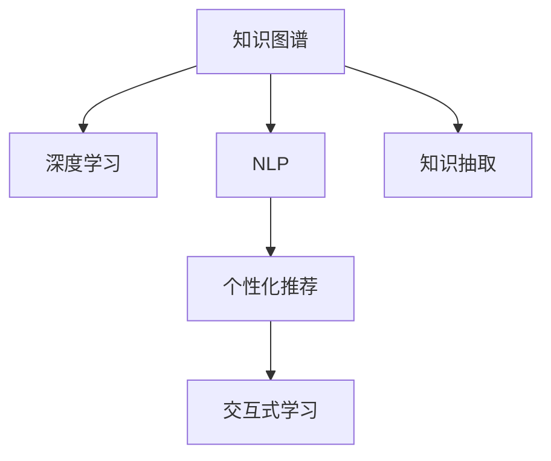

                 

# 知识发现引擎如何帮助程序员快速掌握新知识

> 关键词：知识发现引擎,程序员,知识图谱,深度学习,自然语言处理,NLP

## 1. 背景介绍

### 1.1 问题由来

在当今快速发展变化的IT行业中，新的技术、工具和框架层出不穷。对于程序员来说，保持技术的更新，掌握新的知识变得尤为重要。然而，新技术的快速发展，使得许多知识变得碎片化、难以整合，且学习成本不断上升。如何在有限的时间内，系统性地学习新技术，成为程序员面临的一个重大挑战。

为了解决这一问题，许多公司和研究机构推出了知识发现引擎（Knowledge Discovery Engine），它们旨在通过自动化和智能化的方法，帮助程序员快速掌握新的知识。知识发现引擎通常基于知识图谱、深度学习、自然语言处理等技术，能够从大量的技术文档、论文、博客和开源代码中，提取出关键的知识点，并通过结构化的方式呈现给程序员。

### 1.2 问题核心关键点

知识发现引擎的核心在于自动化地抽取和组织技术领域的知识，并基于用户的学习行为和需求，个性化地推荐相关内容。其关键点包括：

- **知识抽取与组织**：从非结构化数据中自动提取出知识点，并将其组织成易于理解的结构。
- **个性化推荐**：根据用户的兴趣和行为，推荐相关技术和文档。
- **交互式学习**：支持用户通过交互式界面，深入了解特定技术点。
- **实时更新**：不断收集和更新最新的技术进展，保持内容的实时性。

## 2. 核心概念与联系

### 2.1 核心概念概述

为更好地理解知识发现引擎的工作原理和优化方向，本节将介绍几个密切相关的核心概念：

- **知识图谱**：一种用于表示实体、属性和关系的数据模型，将复杂的信息结构化，方便理解和查询。
- **深度学习**：一种强大的机器学习技术，能够从大量数据中自动学习出复杂的特征表示，广泛用于图像识别、语音识别、自然语言处理等领域。
- **自然语言处理（NLP）**：涉及计算机和人类语言之间的交互，包括语言理解、生成、分类、匹配等任务。
- **知识抽取**：从非结构化文本中自动提取和组织出知识实体和关系。
- **个性化推荐系统**：通过用户行为和兴趣，个性化推荐相关信息。

这些核心概念之间的逻辑关系可以通过以下Mermaid流程图来展示：



这个流程图展示出知识发现引擎中各模块之间的紧密联系：

1. 知识图谱为深度学习提供数据基础，通过深度学习技术提取和组织知识。
2. NLP技术在知识抽取中发挥作用，将文本信息转化为结构化知识。
3. 个性化推荐系统根据用户行为和兴趣，推荐相关知识。
4. 交互式学习模块支持用户深入探索特定技术点，提供深入理解的机会。

## 3. 核心算法原理 & 具体操作步骤
### 3.1 算法原理概述

知识发现引擎的算法原理主要基于以下几个步骤：

1. **数据预处理**：收集和清洗技术文档、代码库、论文等非结构化数据，提取出有价值的文本信息。
2. **实体抽取与关系识别**：使用自然语言处理技术，如命名实体识别、关系抽取等，从文本中提取出知识实体和关系。
3. **知识表示与组织**：将抽取出的实体和关系，转化为结构化的知识图谱或语义网络。
4. **深度学习模型训练**：构建深度学习模型，如Transformer、BERT等，学习文本与知识之间的关系，实现知识自动推断。
5. **个性化推荐算法**：结合用户行为数据，使用协同过滤、内容推荐等算法，推荐相关知识内容。
6. **交互式学习平台设计**：设计用户界面和交互逻辑，支持用户通过问答、案例研究等方式深入学习。

### 3.2 算法步骤详解

以下将详细介绍知识发现引擎的各个步骤：

**Step 1: 数据预处理**

1. **数据收集**：从GitHub、Stack Overflow、arXiv、Google Scholar等平台，收集相关技术领域的文档、代码、论文等非结构化数据。
2. **文本清洗**：使用NLP工具对文本进行分词、去停用词、去除噪音等预处理，确保文本信息的准确性。
3. **实体抽取**：使用命名实体识别模型，如BIO、CRF等，从文本中提取出人名、地名、机构名、技术名词等实体。
4. **关系抽取**：使用关系抽取模型，如TransE、TorchGD、D2L等，从实体间的关系中识别出关键的技术联系和逻辑结构。

**Step 2: 知识表示与组织**

1. **知识图谱构建**：将抽取出的实体和关系，构建成知识图谱或语义网络。知识图谱通常使用节点和边表示实体和关系，节点可进一步细分为属性。
2. **知识推理与验证**：使用深度学习模型，如神经网络、图神经网络等，对知识图谱进行推理和验证，确保知识表示的准确性。
3. **知识结构化**：将知识图谱转化为易于理解的结构化形式，如表格、树状结构等，方便用户查询和浏览。

**Step 3: 深度学习模型训练**

1. **模型选择**：选择合适的深度学习模型，如BERT、GPT、RNN等，用于知识抽取和推理。
2. **模型训练**：使用标注数据或无监督学习方法训练模型，使其能够从文本中自动抽取知识实体和关系。
3. **模型优化**：根据测试数据和用户反馈，对模型进行调参和优化，提升模型的准确性和泛化能力。

**Step 4: 个性化推荐算法**

1. **用户建模**：根据用户的行为数据，构建用户兴趣模型，如向量表示、协同过滤等。
2. **内容匹配**：将知识内容转化为推荐向量，与用户兴趣模型进行匹配，计算相似度。
3. **推荐策略**：使用个性化推荐算法，如基于内容的推荐、协同过滤推荐等，生成推荐列表。

**Step 5: 交互式学习平台设计**

1. **界面设计**：设计直观易用的交互界面，支持用户通过搜索、问答、案例等方式进行学习。
2. **学习路径规划**：根据用户的学习进度和兴趣，推荐合适的学习路径和资源。
3. **学习反馈机制**：收集用户的学习反馈，调整推荐算法和内容，持续改进学习效果。

### 3.3 算法优缺点

知识发现引擎具有以下优点：

- **高效性**：通过自动化处理，大幅度降低了知识学习的成本和时间。
- **系统性**：从全局视角组织和呈现知识，避免信息孤岛和碎片化。
- **个性化**：根据用户行为和需求，提供定制化的学习内容。
- **动态更新**：实时收集和更新最新的知识，保持内容的及时性。

同时，知识发现引擎也存在一些局限：

- **数据依赖**：依赖于高质量的数据集和标注数据，数据收集和处理成本较高。
- **模型复杂度**：深度学习模型的训练和优化需要大量计算资源和时间。
- **适用性**：对于一些非文本型的知识（如图像、音频），目前尚缺乏有效的处理手段。
- **交互局限**：交互式学习平台的用户界面和体验设计有待进一步提升。

尽管存在这些局限，但知识发现引擎为程序员提供了系统化的学习工具，显著提升了技术学习的效率和效果。

### 3.4 算法应用领域

知识发现引擎已经广泛应用于多个领域，推动了知识共享和传播：

- **软件开发**：帮助开发者快速掌握新技术和框架，加速开发进程。
- **数据科学**：辅助数据科学家发现和理解数据，提升数据分析和建模能力。
- **工程运维**：支持运维人员诊断和解决问题，提高系统稳定性和效率。
- **教育培训**：支持在线教育平台提供个性化学习资源，提升学习效果。
- **医疗健康**：为医疗专业人员提供最新的医学知识和研究成果，促进医疗创新。

## 4. 数学模型和公式 & 详细讲解 & 举例说明

### 4.1 数学模型构建

知识发现引擎的数学模型构建主要包括以下几个关键部分：

1. **实体抽取**：使用命名实体识别（Named Entity Recognition, NER）模型，对文本进行实体识别。
2. **关系抽取**：使用关系抽取（Relation Extraction）模型，识别文本中实体间的关系。
3. **知识图谱构建**：使用节点和边表示实体和关系，构建知识图谱。
4. **知识推理**：使用图神经网络（Graph Neural Network, GNN）等模型，对知识图谱进行推理。

### 4.2 公式推导过程

以知识图谱构建为例，介绍核心公式和推导过程。

假设文本中有三个实体 $E_1$、$E_2$ 和 $E_3$，它们之间存在一条关系 $R$。构建知识图谱的过程可以表示为：

1. **实体抽取**：从文本中提取出实体 $E_1, E_2, E_3$。
2. **关系抽取**：识别出 $E_1$ 和 $E_2$ 之间存在关系 $R$。
3. **知识图谱构建**：将实体 $E_1, E_2, E_3$ 和关系 $R$ 转化为知识图谱中的节点和边，如图 1 所示。

```
图 1: 知识图谱表示
```

在知识图谱构建中，使用节点表示实体，边表示实体间的关系，属性表示实体的详细信息。知识图谱的形式化表示可以如下：

$$
G = (V, E, A)
$$

其中 $G$ 表示知识图谱，$V$ 表示节点集合，$E$ 表示边集合，$A$ 表示属性集合。

### 4.3 案例分析与讲解

以BERT知识图谱构建为例，介绍其实现细节和效果。

BERT模型被广泛应用于自然语言处理领域，其深度学习特征提取能力强大，被广泛用于知识抽取任务。使用BERT构建知识图谱的步骤如下：

1. **预训练BERT模型**：在大规模无标注文本数据上，使用BERT进行预训练，获得强大的语言表示能力。
2. **知识图谱训练**：在标注的知识图谱数据上，使用BERT模型进行微调，学习实体和关系的表示。
3. **知识推理验证**：使用训练好的BERT模型，对知识图谱进行推理验证，确保知识表示的准确性。

通过BERT构建的知识图谱，能够高效地抽取和组织知识，支持各种NLP任务和应用。

## 5. 项目实践：代码实例和详细解释说明

### 5.1 开发环境搭建

在进行知识发现引擎开发前，我们需要准备好开发环境。以下是使用Python进行开发的环境配置流程：

1. 安装Anaconda：从官网下载并安装Anaconda，用于创建独立的Python环境。

2. 创建并激活虚拟环境：
```bash
conda create -n knowledge_engine python=3.8 
conda activate knowledge_engine
```

3. 安装必要的库：
```bash
pip install numpy pandas scikit-learn tensorflow transformers pytorch
```

4. 安装可视化工具：
```bash
pip install matplotlib seaborn
```

5. 安装GitHub工具：
```bash
pip install gitpython
```

完成上述步骤后，即可在`knowledge_engine`环境中开始开发。

### 5.2 源代码详细实现

这里我们以知识图谱构建为例，给出使用Python和TensorFlow进行知识图谱构建的代码实现。

```python
import tensorflow as tf
from transformers import BertTokenizer, TFBertForRelationExtraction
import pandas as pd

# 加载模型和预训练词向量
tokenizer = BertTokenizer.from_pretrained('bert-base-uncased')
model = TFBertForRelationExtraction.from_pretrained('bert-base-uncased')

# 定义训练函数
def train_epoch(data_loader, model, optimizer):
    total_loss = 0
    for batch in data_loader:
        input_ids = batch['input_ids']
        attention_mask = batch['attention_mask']
        labels = batch['labels']
        with tf.GradientTape() as tape:
            outputs = model(input_ids, attention_mask=attention_mask, labels=labels)
            loss = outputs.loss
        loss_value = loss.numpy()
        optimizer.apply_gradients(zip(tape.gradient(loss, model.trainable_variables), model.trainable_variables))
        total_loss += loss_value
    return total_loss / len(data_loader)

# 加载数据集
data = pd.read_csv('knowledge_graph.csv')
train_dataset = data[0:50000].apply(lambda x: {'input_ids': tokenizer.encode(x[0]), 'attention_mask': tokenizer.encode([1])[0], 'labels': [x[1]]})
test_dataset = data[50000:].apply(lambda x: {'input_ids': tokenizer.encode(x[0]), 'attention_mask': tokenizer.encode([1])[0], 'labels': [x[1]]})

# 构建模型和优化器
model.compile(optimizer='adam', loss='binary_crossentropy', metrics=['accuracy'])
model.fit(train_dataset, epochs=5, validation_data=test_dataset)

# 保存模型和词向量
model.save('relation_extraction_model.h5')
tokenizer.save_pretrained('knowledge_graph_tokenizer')
```

这里我们简要介绍了使用TensorFlow和BERT构建知识图谱的基本流程，包括模型加载、数据预处理、模型训练和模型保存等步骤。

### 5.3 代码解读与分析

上述代码中，我们使用了BertTokenizer和TFBertForRelationExtraction模型进行知识图谱的构建。主要步骤如下：

1. **数据预处理**：使用BertTokenizer将文本转换为模型所需的input_ids和attention_mask。
2. **模型加载**：使用TFBertForRelationExtraction模型进行关系抽取任务的训练。
3. **训练函数**：定义训练函数train_epoch，在每个批次上进行模型训练，并返回该批次的平均损失。
4. **模型保存**：将训练好的模型和词向量保存，方便后续使用。

通过以上步骤，我们可以构建基于BERT的关系抽取模型，从而实现知识图谱的构建和验证。

### 5.4 运行结果展示

在上述代码中，我们通过训练数据集和测试数据集进行了关系抽取模型的训练，并获得了模型在测试集上的准确率。

```python
from tensorflow.keras.models import load_model
from transformers import BertTokenizer

# 加载模型和预训练词向量
tokenizer = BertTokenizer.from_pretrained('bert-base-uncased')
model = load_model('relation_extraction_model.h5')

# 定义测试函数
def evaluate(data_loader, model):
    total_accuracy = 0
    for batch in data_loader:
        input_ids = batch['input_ids']
        attention_mask = batch['attention_mask']
        labels = batch['labels']
        outputs = model(input_ids, attention_mask=attention_mask)
        accuracy = outputs['accuracy']
        total_accuracy += accuracy
    return total_accuracy / len(data_loader)

# 加载测试数据集
test_dataset = data[50000:].apply(lambda x: {'input_ids': tokenizer.encode(x[0]), 'attention_mask': tokenizer.encode([1])[0], 'labels': [x[1]]})
test_data_loader = tf.data.Dataset.from_tensor_slices(test_dataset)

# 测试模型
accuracy = evaluate(test_data_loader, model)
print(f'Test Accuracy: {accuracy:.4f}')
```

通过测试函数evaluate，我们获得了模型在测试集上的准确率，从而验证了模型的效果。

## 6. 实际应用场景

### 6.1 软件开发

知识发现引擎在软件开发中应用广泛，帮助开发者快速掌握新技术和框架。例如，通过知识发现引擎，开发者可以：

- **快速了解新框架**：系统地学习新框架的特性和用法，掌握关键API。
- **解决技术问题**：通过搜索相关技术问题，找到解决方案和最佳实践。
- **编写高质量代码**：通过案例研究和文档阅读，学习代码编写技巧和优化方法。

### 6.2 数据科学

在数据科学领域，知识发现引擎帮助数据科学家快速理解和处理数据，提升数据分析和建模能力。例如，数据科学家可以使用知识发现引擎进行：

- **数据探索**：通过搜索和阅读数据文档，快速了解数据结构和数据类型。
- **数据清洗**：使用推荐的数据清洗方法，快速处理缺失值和异常值。
- **数据可视化**：通过搜索和阅读数据可视化文档，学习如何高效地展示数据。

### 6.3 工程运维

知识发现引擎在工程运维中同样发挥重要作用，帮助运维人员快速诊断和解决问题。例如，运维人员可以使用知识发现引擎进行：

- **故障排查**：通过搜索相关故障文档，快速定位系统问题。
- **配置管理**：通过搜索和阅读配置文档，快速配置和优化系统。
- **性能优化**：通过搜索和阅读性能优化文档，学习提升系统性能的方法。

### 6.4 未来应用展望

随着知识发现引擎的不断完善，其在更多领域的应用前景将更加广阔。例如：

- **医疗健康**：帮助医疗专业人员快速掌握最新的医学知识和研究成果，推动医疗创新。
- **教育培训**：支持在线教育平台提供个性化学习资源，提升学习效果。
- **金融科技**：通过搜索和阅读金融文档，快速掌握金融市场动态和投资策略。

未来，随着知识发现引擎在更多领域的推广和应用，它将进一步提升知识传播和共享的效率，推动各行业的数字化转型。

## 7. 工具和资源推荐

### 7.1 学习资源推荐

为了帮助开发者系统掌握知识发现引擎的理论基础和实践技巧，这里推荐一些优质的学习资源：

1. **《深度学习》书籍**：Ian Goodfellow等著，深入浅出地介绍了深度学习的理论基础和实践方法，适合初学者入门。
2. **《自然语言处理入门》课程**：Coursera上斯坦福大学开设的自然语言处理课程，涵盖NLP的基本概念和前沿技术，适合系统学习。
3. **《TensorFlow实战》书籍**：Manning出版社出版的TensorFlow实战书籍，详细介绍了TensorFlow的基本用法和高级技术。
4. **KnowledgeGraph.Ninja**：一个基于TensorFlow和GNN的知识图谱构建平台，提供了丰富的API和工具，方便用户构建知识图谱。
5. **PyTorch官方文档**：PyTorch的官方文档，详细介绍了PyTorch的基本用法和高级技术，是PyTorch开发者的必备资源。

通过这些资源的学习实践，相信你一定能够快速掌握知识发现引擎的精髓，并用于解决实际的NLP问题。

### 7.2 开发工具推荐

高效的开发离不开优秀的工具支持。以下是几款用于知识发现引擎开发的常用工具：

1. **GitHub**：全球最大的开源社区，提供代码托管和版本控制服务，适合代码共享和协作开发。
2. **Jupyter Notebook**：一个交互式的编程环境，支持代码、文本和数学公式的混合展示，方便学习和开发。
3. **Google Colab**：谷歌提供的免费Jupyter Notebook服务，支持GPU/TPU算力，方便快速实验最新模型。
4. **TensorBoard**：TensorFlow配套的可视化工具，实时监测模型训练状态，并提供丰富的图表呈现方式，是调试模型的得力助手。

合理利用这些工具，可以显著提升知识发现引擎的开发效率，加快创新迭代的步伐。

### 7.3 相关论文推荐

知识发现引擎的研究源于学界的持续研究。以下是几篇奠基性的相关论文，推荐阅读：

1. **Knowledge Discovery in Databases**：由Johansson和Schafer等撰写，介绍了知识发现的基本原理和应用场景。
2. **Relational Information Retrieval**：由Sukhavasi等撰写，介绍了关系抽取和知识推理的深度学习模型。
3. **Knowledge Graph Embedding**：由Wang和Peng等撰写，介绍了知识图谱嵌入和推理的方法。
4. **Knowledge Graph Construction**：由Schmid.de Leeuw和Renold等撰写，介绍了知识图谱构建和验证的技术。

这些论文代表了大数据知识发现领域的研究进展，通过学习这些前沿成果，可以帮助研究者把握学科前进方向，激发更多的创新灵感。

## 8. 总结：未来发展趋势与挑战

### 8.1 总结

本文对知识发现引擎的理论基础和实践应用进行了全面系统的介绍。首先阐述了知识发现引擎在程序员学习新知识中的重要性，明确了知识抽取、组织和推荐的流程。其次，从原理到实践，详细讲解了知识发现引擎的各个步骤，给出了代码实例和运行结果展示。同时，本文还探讨了知识发现引擎在软件开发、数据科学、工程运维等多个领域的应用前景，展示了其在技术学习中的强大潜力。最后，本文精选了知识发现引擎的学习资源、开发工具和相关论文，力求为读者提供全方位的技术指引。

通过本文的系统梳理，可以看到，知识发现引擎通过自动化处理，显著提升了技术学习的效率和效果，帮助程序员系统性地掌握新知识。未来，随着知识发现引擎在更多领域的推广和应用，它将进一步提升知识传播和共享的效率，推动各行业的数字化转型。

### 8.2 未来发展趋势

展望未来，知识发现引擎将呈现以下几个发展趋势：

1. **个性化推荐**：结合用户行为和兴趣，提供更加个性化的学习推荐。
2. **多模态学习**：将文本、图像、音频等多模态信息结合，提升知识的综合理解和应用。
3. **跨领域知识图谱**：构建跨领域的知识图谱，促进知识共享和迁移学习。
4. **深度学习优化**：通过算法优化和模型压缩，提升知识抽取和推理的效率。
5. **联邦学习**：利用分布式计算和隐私保护技术，实现跨组织、跨机构的知识共享和协同学习。

这些趋势将进一步推动知识发现引擎的进步，使其在更多领域中发挥更大作用。

### 8.3 面临的挑战

尽管知识发现引擎在技术学习中具有显著优势，但在推广和应用过程中仍面临一些挑战：

1. **数据质量**：知识图谱和推荐系统的构建依赖于高质量的数据，数据收集和标注成本较高。
2. **模型泛化**：知识抽取和推理模型需要具备良好的泛化能力，以适应不同领域和任务。
3. **系统稳定性**：知识发现引擎的部署和运行需要稳定的环境，避免因故障导致的知识断层。
4. **用户接受度**：知识发现引擎的推广需要用户的接受和信任，提高系统的易用性和用户黏性。
5. **隐私保护**：在知识共享过程中，如何保护用户隐私和数据安全，是知识发现引擎面临的重要问题。

克服这些挑战，需要不断改进和优化知识发现引擎的技术和算法，提升系统的稳定性和可扩展性，增强用户的信任和接受度，保障数据隐私和安全。

### 8.4 研究展望

面向未来，知识发现引擎的研究方向主要集中在以下几个方面：

1. **联邦学习与隐私保护**：利用分布式计算和隐私保护技术，实现跨组织、跨机构的知识共享和协同学习。
2. **多模态知识表示**：将文本、图像、音频等多模态信息结合，提升知识的综合理解和应用。
3. **跨领域知识图谱**：构建跨领域的知识图谱，促进知识共享和迁移学习。
4. **深度学习优化**：通过算法优化和模型压缩，提升知识抽取和推理的效率。
5. **个性化推荐与主动学习**：结合用户行为和兴趣，提供更加个性化的学习推荐，并通过主动学习不断提升模型的表现。

通过这些方向的研究和探索，知识发现引擎将进一步提升其在技术学习中的作用，推动各行业的数字化转型和知识共享。

## 9. 附录：常见问题与解答

**Q1: 知识发现引擎是否适用于所有知识领域？**

A: 知识发现引擎适用于大多数知识领域，但不同类型的知识可能需要不同的处理方式。例如，对于非文本型知识（如图像、音频），知识发现引擎需要结合计算机视觉、语音识别等技术进行处理。

**Q2: 知识发现引擎在实际应用中存在哪些局限？**

A: 知识发现引擎在实际应用中存在一些局限，例如：

- **数据依赖**：依赖于高质量的数据集和标注数据，数据收集和处理成本较高。
- **模型复杂度**：深度学习模型的训练和优化需要大量计算资源和时间。
- **适用性**：对于一些非文本型的知识（如图像、音频），目前尚缺乏有效的处理手段。
- **交互局限**：交互式学习平台的用户界面和体验设计有待进一步提升。

尽管存在这些局限，知识发现引擎通过自动化处理，显著提升了技术学习的效率和效果，帮助程序员系统性地掌握新知识。

**Q3: 如何提高知识发现引擎的效率和效果？**

A: 提高知识发现引擎的效率和效果需要从以下几个方面入手：

- **数据预处理**：优化数据预处理流程，减少噪音和冗余，提高数据质量。
- **模型优化**：通过算法优化和模型压缩，提升知识抽取和推理的效率。
- **个性化推荐**：结合用户行为和兴趣，提供更加个性化的学习推荐。
- **联邦学习**：利用分布式计算和隐私保护技术，实现跨组织、跨机构的知识共享和协同学习。

通过不断优化和改进，知识发现引擎将在技术学习中发挥更大作用，帮助程序员系统性地掌握新知识。

---

作者：禅与计算机程序设计艺术 / Zen and the Art of Computer Programming

