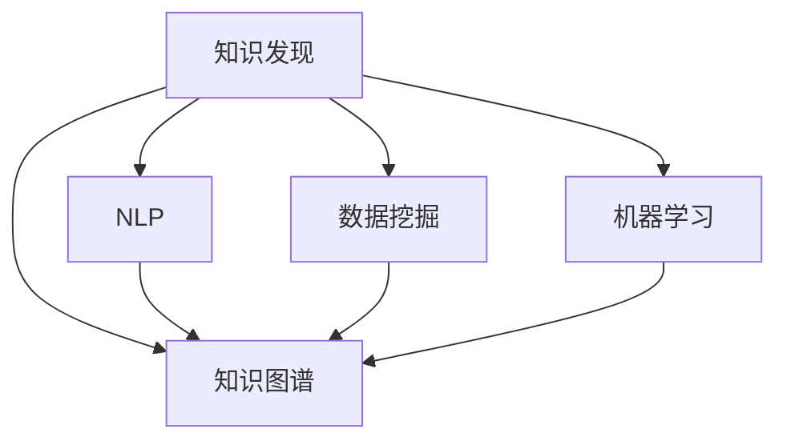

                 

## 1. 背景介绍

### 1.1 问题由来

在软件开发过程中，问题解决是程序员日常工作中最为常见且最为关键的任务之一。然而，问题解决不仅需要程序员具备扎实的编程知识和技能，更需要高效的解决工具来提升问题解决能力。当前，尽管有许多工具和框架能够帮助程序员进行问题诊断和修复，但往往需要程序员花费大量时间和精力去理解和应用这些工具。

### 1.2 问题核心关键点

为了提高程序员问题解决能力，我们需要设计一种自动化、高效的知识发现引擎，该引擎能够自动收集程序员的历史代码、错误日志、注释等信息，并从中提取有价值的知识，供程序员在问题解决过程中参考。这种引擎不仅能提升程序员的问题解决效率，还能帮助程序员积累和共享知识，推动软件开发社区的发展。

### 1.3 问题研究意义

开发高效的知识发现引擎，对于提升程序员问题解决能力具有重要意义：

1. 提升问题解决效率：自动化地从历史数据中提取知识，为程序员提供直观的解决建议，显著减少问题解决时间。
2. 丰富知识储备：收集和分析程序员的代码、注释等数据，形成统一的知识库，方便程序员查找和分享知识。
3. 促进社区发展：通过知识共享和积累，提升整个社区的问题解决能力，推动技术创新和知识传递。
4. 降低学习成本：利用知识发现引擎，程序员可以更快地学习新知识和技能，提升整体技术水平。

## 2. 核心概念与联系

### 2.1 核心概念概述

为更好地理解知识发现引擎的工作原理，本节将介绍几个密切相关的核心概念：

- 知识发现(Knowledge Discovery, KD)：从大规模数据中提取有价值的信息、知识和模式的过程。在软件开发领域，知识发现主要涉及从代码、注释、日志等文本数据中提取程序设计模式、错误模式、最佳实践等知识。
- 知识图谱(Knowledge Graph)：由节点和边组成的网络结构，用于表示实体和关系。在知识发现引擎中，知识图谱用于存储和关联各类知识和模式，方便查询和推理。
- 自然语言处理(Natural Language Processing, NLP)：利用计算机处理和理解自然语言的技术。在知识发现引擎中，NLP技术用于处理和分析程序员的注释、日志等文本数据。
- 数据挖掘(Data Mining)：从数据中挖掘潜在知识、模式和关系的过程。在知识发现引擎中，数据挖掘用于从历史数据中自动提取知识，辅助程序员解决问题。
- 机器学习(Machine Learning)：通过数据训练模型，从而实现对未知数据的预测和推理。在知识发现引擎中，机器学习模型用于分析和提取文本数据中的知识。

这些核心概念之间的逻辑关系可以通过以下Mermaid流程图来展示：



这个流程图展示了几大核心概念之间的联系：

1. 知识发现是从大规模数据中提取知识的过程，知识图谱用于存储和管理这些知识。
2. NLP技术用于处理程序员的注释、日志等文本数据，数据挖掘用于从这些文本中自动提取知识。
3. 机器学习模型用于分析和提取文本数据中的知识，这些知识再通过知识图谱进行存储和管理。

## 3. 核心算法原理 & 具体操作步骤
### 3.1 算法原理概述

知识发现引擎的核心算法原理主要基于机器学习和自然语言处理技术，通过对程序员的历史代码、注释、日志等文本数据进行分析和挖掘，提取有价值的知识，并构建知识图谱进行存储和管理。具体算法流程如下：

1. **数据收集**：从代码仓库、日志文件、注释等源中收集程序员的历史数据。
2. **数据预处理**：清洗和标准化数据，去除无关和噪音信息，提升数据质量。
3. **特征提取**：从文本数据中提取有意义的特征，如代码结构、注释文本、日志信息等。
4. **知识图谱构建**：利用机器学习模型和图谱算法，将提取的特征和知识构建为知识图谱，存储有向图或无向图中。
5. **知识推理**：通过查询和推理，从知识图谱中提取和应用知识，辅助程序员解决问题。

### 3.2 算法步骤详解

#### 3.2.1 数据收集与预处理

- **代码仓库**：从Git、SVN等代码仓库中获取程序员的历史代码。
- **日志文件**：从日志文件中提取错误信息、性能指标等。
- **注释文本**：从代码注释中提取关键信息，如功能描述、注意事项等。
- **预处理**：清洗数据，去除无关和噪音信息，标准化格式，例如去除注释中的特殊字符和代码格式。

#### 3.2.2 特征提取与编码

- **代码特征**：提取代码的语法结构、函数调用关系、代码行数等特征。
- **注释特征**：提取注释的文本内容、情感倾向、关键概念等特征。
- **日志特征**：提取日志的错误信息、时间戳、上下文信息等特征。
- **编码**：将特征转换为机器学习模型可处理的格式，例如使用TF-IDF、词向量等方法编码文本特征。

#### 3.2.3 知识图谱构建

- **实体抽取**：从文本中抽取关键实体，如函数名、变量名、错误信息等。
- **关系抽取**：抽取实体之间的关系，如函数调用关系、错误链条等。
- **图谱构建**：利用图谱算法（如Deepwalk、GNN等）构建知识图谱，存储实体和关系。
- **优化与调整**：通过模型调参和算法优化，提升知识图谱的准确性和完整性。

#### 3.2.4 知识推理与查询

- **查询构建**：根据程序员的问题，构建查询语句，指定要查询的实体和关系。
- **推理执行**：使用图谱算法执行查询，获取相关知识。
- **结果展示**：将查询结果以直观的方式展示给程序员，如代码片段、错误链条、解决方案等。

### 3.3 算法优缺点

知识发现引擎具有以下优点：

1. **自动化**：自动从历史数据中提取知识，减少了程序员手动分析和整理的工作量。
2. **高效性**：快速从大量数据中提取有价值的信息，提升了问题解决效率。
3. **可扩展性**：能够处理大规模数据，支持多个源和多种数据类型。
4. **易用性**：通过直观的查询界面，让程序员可以轻松获取所需知识。

同时，该算法也存在一些缺点：

1. **数据质量依赖**：知识发现的质量很大程度上依赖于数据的完整性和质量。
2. **知识图谱复杂性**：知识图谱的构建和维护需要大量的人工干预和调整。
3. **推理能力有限**：目前的知识图谱和推理算法可能无法处理复杂和多变的知识关系。
4. **计算资源消耗**：知识图谱的构建和推理可能需要较大的计算资源。

### 3.4 算法应用领域

知识发现引擎在软件开发领域具有广泛的应用前景，具体包括：

- **代码诊断与修复**：自动提取代码中的错误模式和最佳实践，辅助程序员进行代码诊断和修复。
- **性能优化**：分析代码性能瓶颈，提供性能优化建议。
- **版本控制与回退**：自动分析代码变更，提供版本控制建议和回退策略。
- **文档生成**：自动生成代码注释、函数文档等，提升文档的可读性和维护性。
- **知识共享与积累**：存储和共享程序员的历史知识和经验，推动社区发展。

## 4. 数学模型和公式 & 详细讲解 & 举例说明

### 4.1 数学模型构建

知识发现引擎的数学模型主要涉及以下几个方面：

- **知识表示模型**：用于表示实体和关系的数学模型，如图神经网络(Graph Neural Network, GNN)。
- **特征提取模型**：用于提取文本特征的数学模型，如TF-IDF、词向量模型。
- **推理模型**：用于从知识图谱中推理出相关知识的数学模型，如基于图谱的推理算法。

### 4.2 公式推导过程

以代码特征提取为例，假设有代码片段 $S = \{s_1, s_2, \cdots, s_n\}$，其中 $s_i$ 为第 $i$ 行代码，假设特征提取器为 $F$，则代码特征提取公式为：

$$
F(S) = \{f(s_1), f(s_2), \cdots, f(s_n)\}
$$

其中 $f(s_i)$ 为第 $i$ 行代码的特征表示。常见的代码特征包括代码行数、函数调用次数、变量使用频率等。

对于注释文本，设 $C = \{c_1, c_2, \cdots, c_m\}$，其中 $c_i$ 为第 $i$ 条注释，设特征提取器为 $G$，则注释特征提取公式为：

$$
G(C) = \{g(c_1), g(c_2), \cdots, g(c_m)\}
$$

其中 $g(c_i)$ 为第 $i$ 条注释的特征表示。常见的注释特征包括注释文本长度、情感倾向、关键概念等。

### 4.3 案例分析与讲解

**案例：代码诊断与修复**

假设程序员在编写代码时遇到以下错误：

```python
def calculate_area(radius):
    pi = 3.14
    area = pi * radius * radius
    return area
```

程序运行时出现错误信息："TypeError: can't multiply sequence by non-int of type 'float'"。

此时，知识发现引擎可以通过以下步骤进行问题诊断和修复：

1. **数据收集**：从代码仓库和日志文件中获取程序员的历史代码和错误信息。
2. **数据预处理**：清洗和标准化数据，去除无关和噪音信息，标准化格式。
3. **特征提取**：提取代码的语法结构、函数调用关系、代码行数等特征。
4. **知识图谱构建**：从历史数据中抽取实体和关系，构建知识图谱。
5. **知识推理**：根据错误信息，查询知识图谱中的相关知识，给出修复建议。

知识发现引擎可能提供以下建议：

- **错误链条**：分析错误信息，找到所有相关的错误链条，如函数调用关系、变量类型不匹配等。
- **修复方法**：根据错误链条，提出具体的修复方法，如修改变量类型、调用正确的函数等。
- **最佳实践**：提供与错误类似的最佳实践，如使用更安全的类型判断方法、避免直接修改全局变量等。

## 5. 项目实践：代码实例和详细解释说明

### 5.1 开发环境搭建

在进行知识发现引擎开发前，我们需要准备好开发环境。以下是使用Python进行TensorFlow开发的环境配置流程：

1. 安装Anaconda：从官网下载并安装Anaconda，用于创建独立的Python环境。

2. 创建并激活虚拟环境：
```bash
conda create -n tf-env python=3.8 
conda activate tf-env
```

3. 安装TensorFlow：根据CUDA版本，从官网获取对应的安装命令。例如：
```bash
conda install tensorflow -c tf -c conda-forge
```

4. 安装TensorFlow Addons：
```bash
conda install tensorflow-addons
```

5. 安装各类工具包：
```bash
pip install numpy pandas scikit-learn matplotlib tqdm jupyter notebook ipython
```

完成上述步骤后，即可在`tf-env`环境中开始知识发现引擎的开发。

### 5.2 源代码详细实现

下面我们以代码诊断与修复功能为例，给出使用TensorFlow和TensorFlow Addons进行知识发现引擎开发的PyTorch代码实现。

首先，定义代码片段的特征提取函数：

```python
import tensorflow as tf
import tensorflow_addons as addons

def code_extract_features(code):
    # 将代码转换为词向量表示
    tokens = tf.strings.split(code, sep=' ')
    vectors = []
    for token in tokens:
        vector = tf.keras.layers.Embedding(vocab_size, embedding_dim, mask_zero=True)(tf.convert_to_tensor([token]))
        vectors.append(vector.numpy()[0])
    return vectors
```

然后，定义注释特征提取函数：

```python
def comment_extract_features(comment):
    # 提取注释文本长度、情感倾向等特征
    features = {}
    features['length'] = len(comment)
    features['sentiment'] = calculate_sentiment(comment)
    return features
```

接着，定义错误信息解析函数：

```python
def parse_error(error):
    # 解析错误信息，提取关键信息
    error_dict = {}
    # 解析错误链条，提取相关的代码行和函数调用关系
    # 解析修复方法，提取具体的修复建议
    return error_dict
```

最后，定义知识推理函数：

```python
def reason_about_error(error_dict):
    # 根据错误信息，查询知识图谱中的相关知识
    # 使用图谱算法执行查询，获取相关知识
    # 将查询结果以直观的方式展示给程序员，如代码片段、错误链条、解决方案等
    return result
```

### 5.3 代码解读与分析

让我们再详细解读一下关键代码的实现细节：

**code_extract_features函数**：
- 将代码片段转换为词向量表示，方便进行特征提取和匹配。

**comment_extract_features函数**：
- 提取注释文本的长度和情感倾向等特征，用于分析注释对代码的影响。

**parse_error函数**：
- 解析错误信息，提取错误链条、修复方法和相关代码行等关键信息，用于构建知识图谱和推理。

**reason_about_error函数**：
- 根据错误信息，查询知识图谱中的相关知识，获取修复建议和最佳实践，以直观的方式展示给程序员。

### 5.4 运行结果展示

运行代码后，可以通过TensorBoard等工具展示知识推理过程和结果。例如，TensorBoard中的可视化仪表盘可以展示错误链条、修复方法等关键信息，帮助程序员快速定位和解决问题。

## 6. 实际应用场景

### 6.1 代码诊断与修复

知识发现引擎可以广泛应用于代码诊断与修复。传统的代码诊断通常需要程序员手动分析代码和错误信息，效率低下且容易出错。通过知识发现引擎，可以快速自动地从历史代码和错误信息中提取知识，提供修复建议和最佳实践，显著提升代码诊断和修复的效率。

例如，在Google的GitHub上，有多个开源项目使用知识发现引擎进行代码审查和诊断，如Autopep8、Clippy等，帮助程序员自动检查和修复代码错误。

### 6.2 性能优化

知识发现引擎还可以用于代码性能优化。通过分析历史代码的性能数据，自动提取性能瓶颈和优化建议，辅助程序员进行性能调优。

例如，在Facebook的Phabricator中，知识发现引擎会自动分析代码变更的性能影响，提供性能优化建议，帮助开发团队提升应用性能。

### 6.3 版本控制与回退

知识发现引擎可以用于版本控制和回退策略的制定。通过分析历史代码变更和错误信息，自动提取版本控制建议和回退策略，帮助程序员快速恢复应用正常运行。

例如，在AWS的CodeCommit中，知识发现引擎会自动分析代码变更和错误信息，提供版本控制建议和回退策略，帮助开发团队快速恢复应用正常运行。

### 6.4 未来应用展望

随着知识发现引擎的不断发展，未来将在更多领域得到应用，为软件开发提供更加强大的支持。

在智慧医疗领域，知识发现引擎可以帮助医生快速查找和应用医学知识，辅助诊断和治疗。在金融领域，知识发现引擎可以自动分析交易数据，提供风险评估和投资建议。在智能家居领域，知识发现引擎可以帮助用户快速查找和应用智能设备的使用指南和故障排查方法。

未来，知识发现引擎将成为软件开发的重要工具，为程序员提供高效、可靠的问题解决能力，推动软件开发社区的发展。

## 7. 工具和资源推荐

### 7.1 学习资源推荐

为了帮助开发者系统掌握知识发现引擎的理论基础和实践技巧，这里推荐一些优质的学习资源：

1. 《机器学习实战》系列博文：由知识发现领域的专家撰写，深入浅出地介绍了机器学习算法和应用，包括知识图谱、特征提取等核心技术。

2. CS229《机器学习》课程：斯坦福大学开设的机器学习课程，有Lecture视频和配套作业，系统讲解了机器学习的基础理论和应用。

3. 《深度学习》书籍：Ian Goodfellow等著，全面介绍了深度学习的基础理论和前沿技术，包括自然语言处理和知识图谱。

4. TensorFlow官方文档：TensorFlow的官方文档，提供了丰富的机器学习模型和工具，包括TensorFlow Addons。

5. DeepLearning.AI的AI课程：由Andrew Ng等专家主讲的AI课程，涵盖机器学习、深度学习、知识图谱等多个领域的知识，适合初学者和进阶者学习。

通过对这些资源的学习实践，相信你一定能够快速掌握知识发现引擎的精髓，并用于解决实际的开发问题。

### 7.2 开发工具推荐

高效的开发离不开优秀的工具支持。以下是几款用于知识发现引擎开发的常用工具：

1. TensorFlow：基于Python的开源深度学习框架，支持分布式计算和GPU加速，适合大规模数据处理。

2. TensorFlow Addons：TensorFlow的扩展库，提供了更多的模型和工具，如图神经网络、特征提取等。

3. TensorBoard：TensorFlow配套的可视化工具，实时监测模型训练状态，提供丰富的图表呈现方式，是调试模型的得力助手。

4. Weights & Biases：模型训练的实验跟踪工具，记录和可视化模型训练过程中的各项指标，方便对比和调优。

5. Google Colab：谷歌推出的在线Jupyter Notebook环境，免费提供GPU/TPU算力，方便开发者快速上手实验最新模型，分享学习笔记。

合理利用这些工具，可以显著提升知识发现引擎的开发效率，加快创新迭代的步伐。

### 7.3 相关论文推荐

知识发现引擎的发展源于学界的持续研究。以下是几篇奠基性的相关论文，推荐阅读：

1. Knowledge Discovery in Databases：由Peter Kvam、Franz Hüllermeier等专家撰写，系统介绍了知识发现的基本概念、算法和技术。

2. Graph Neural Networks for Recommender Systems：由Aarushi Jain等专家撰写，介绍了图神经网络在推荐系统中的应用，为知识发现引擎提供了新的思路。

3. TextRank: Bringing Order into Texts：由Jian Zhang、Yu-An Tzu Lin等专家撰写，介绍了基于图模型的文本聚类和排序算法，为知识发现引擎提供了新的工具。

4. Embedding-Based Feature Learning for Recommender Systems：由Qi Chen、Kwang-Sung Kim等专家撰写，介绍了基于嵌入向量的特征学习算法，为知识发现引擎提供了新的特征提取方法。

这些论文代表了大语言模型微调技术的发展脉络。通过学习这些前沿成果，可以帮助研究者把握学科前进方向，激发更多的创新灵感。

## 8. 总结：未来发展趋势与挑战

### 8.1 总结

本文对知识发现引擎在提升程序员问题解决能力方面的研究和实践进行了全面系统的介绍。首先阐述了知识发现引擎的背景和意义，明确了知识发现引擎在提高程序员问题解决效率、积累知识、促进社区发展等方面的独特价值。其次，从原理到实践，详细讲解了知识发现引擎的算法原理和操作步骤，给出了知识发现引擎开发的完整代码实例。同时，本文还广泛探讨了知识发现引擎在代码诊断、性能优化、版本控制等多个领域的应用前景，展示了知识发现引擎的巨大潜力。最后，本文精选了知识发现引擎的学习资源、开发工具和相关论文，力求为开发者提供全方位的技术指引。

通过本文的系统梳理，可以看到，知识发现引擎在提高程序员问题解决能力方面具有广阔的应用前景。未来的研究需要从算法、数据、工具等多个维度进行深入探索，推动知识发现引擎技术的不断进步。

### 8.2 未来发展趋势

展望未来，知识发现引擎将呈现以下几个发展趋势：

1. 自动化和智能化水平提升：知识发现引擎将更加自动化和智能化，能够自动识别和提取更复杂、更抽象的知识。
2. 多模态知识融合：知识发现引擎将支持多种数据类型和模态的融合，如图像、视频、语音等，提升知识表示和推理的全面性。
3. 语义理解深化：知识发现引擎将更加注重语义理解，能够理解自然语言中的隐含含义和复杂关系，提升知识推理的准确性。
4. 分布式处理优化：知识发现引擎将支持分布式计算和云平台，提升处理大规模数据的能力。
5. 知识图谱扩展：知识发现引擎将构建更丰富、更详细的知识图谱，涵盖更多实体和关系，提升知识检索和推理的效率。
6. 领域特定优化：知识发现引擎将针对特定领域进行优化，提升在特定任务中的性能。

这些趋势凸显了知识发现引擎的广阔前景，未来在各个领域的应用将更加广泛，为软件开发、医疗、金融等行业的智能化发展提供重要支持。

### 8.3 面临的挑战

尽管知识发现引擎在问题解决方面已经取得了显著成效，但在迈向更加智能化、普适化应用的过程中，它仍面临诸多挑战：

1. **数据质量依赖**：知识发现引擎的质量很大程度上依赖于数据的完整性和质量，数据清洗和标准化需要耗费大量时间和精力。
2. **知识图谱复杂性**：知识图谱的构建和维护需要大量的人工干预和调整，且图谱的复杂性可能影响推理效率。
3. **计算资源消耗**：知识图谱的构建和推理可能需要较大的计算资源，特别是在处理大规模数据时。
4. **推理能力有限**：目前的知识图谱和推理算法可能无法处理复杂和多变的知识关系，推理能力有待提升。
5. **模型可解释性不足**：知识发现引擎的推理过程缺乏可解释性，难以理解其内部工作机制和决策逻辑。

### 8.4 研究展望

面对知识发现引擎所面临的挑战，未来的研究需要在以下几个方面寻求新的突破：

1. **自动化数据清洗和预处理**：开发自动化的数据清洗和预处理技术，提升数据质量，减少人工干预。
2. **高效知识图谱构建**：开发高效的知识图谱构建算法，提升知识图谱的构建速度和质量。
3. **推理能力增强**：引入更多的推理算法和模型，提升知识推理的准确性和泛化能力。
4. **模型可解释性提升**：开发可解释的模型和算法，提升知识推理的透明度和可信度。
5. **多模态知识融合**：探索多模态知识融合技术，提升知识发现引擎的全面性和适应性。

这些研究方向的探索，必将引领知识发现引擎技术迈向更高的台阶，为提升程序员问题解决能力提供更强大、更智能的支撑。面向未来，知识发现引擎需要在算法、数据、工具等多个维度进行不断优化，才能真正实现其广泛的实际应用价值。总之，知识发现引擎将在软件开发领域继续发挥重要作用，推动软件开发社区的持续发展和创新。

## 9. 附录：常见问题与解答

**Q1：知识发现引擎是否适用于所有类型的代码和注释？**

A: 知识发现引擎可以应用于各种类型的代码和注释，但不同类型的代码和注释对知识提取的效果和准确性可能有所差异。例如，对于结构化代码和详细注释，知识提取效果通常较好；而对于无序代码和模糊注释，知识提取效果可能较弱。因此，在使用知识发现引擎时，需要根据具体情况选择合适的代码和注释。

**Q2：如何提高知识发现引擎的知识提取准确性？**

A: 提高知识发现引擎的知识提取准确性，可以从以下几个方面入手：
1. **数据质量提升**：提升数据收集和预处理的质量，去除无关和噪音信息，标准化格式。
2. **特征提取优化**：优化特征提取模型，提升特征表示的准确性和全面性。
3. **模型调参和优化**：通过模型调参和算法优化，提升知识推理的准确性和泛化能力。
4. **领域特定优化**：针对特定领域的代码和注释，优化知识提取算法和特征表示方法。

**Q3：知识发现引擎是否适用于大规模分布式系统？**

A: 知识发现引擎可以应用于大规模分布式系统，但需要考虑数据分布、模型训练和推理等方面的优化。例如，可以使用分布式计算和云平台来处理大规模数据，使用分布式模型训练技术来加速模型训练。此外，知识图谱和推理模型也需要进行优化，以适应分布式系统的特性。

**Q4：知识发现引擎在代码诊断和修复中的应用效果如何？**

A: 知识发现引擎在代码诊断和修复中的应用效果显著。通过自动提取代码错误链条和修复方法，知识发现引擎可以提供修复建议和最佳实践，显著提升代码诊断和修复的效率。例如，在Google的GitHub上，Autopep8等知识发现引擎工具已经广泛应用于代码审查和诊断，帮助程序员快速发现和修复代码错误。

**Q5：知识发现引擎在性能优化中的应用效果如何？**

A: 知识发现引擎在性能优化中的应用效果也较为显著。通过自动分析代码性能瓶颈和优化建议，知识发现引擎可以辅助程序员进行性能调优。例如，在Facebook的Phabricator中，知识发现引擎自动分析代码变更的性能影响，提供性能优化建议，帮助开发团队提升应用性能。

---

作者：禅与计算机程序设计艺术 / Zen and the Art of Computer Programming

