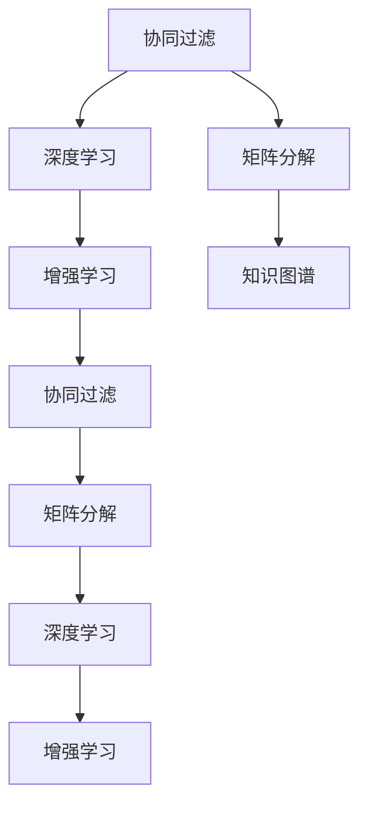

                 

# 知识发现引擎的个性化推荐算法

> 关键词：知识发现引擎, 个性化推荐, 协同过滤, 矩阵分解, 深度学习, 增强学习

## 1. 背景介绍

### 1.1 问题由来

随着互联网的快速发展，人们越来越依赖于网络平台获取信息。然而，用户在网络上的行为数据呈现出海量化的趋势，数据源不仅数量庞大，而且类型多样，如何从这些数据中发现有用知识，成为互联网公司面临的重大挑战。

知识发现引擎（Knowledge Discovery Engine, KDE）应运而生，通过对海量数据进行有效分析、挖掘和转化，发现其中潜在的知识，从而提升数据价值，助力决策制定。在KDE应用中，个性化推荐算法无疑是重中之重。个性化推荐不仅可以显著提升用户体验，还能有效增加平台黏性，实现精准营销和运营效益。

### 1.2 问题核心关键点

个性化推荐算法主要关注如何从用户行为数据中挖掘其兴趣和需求，并提供针对性的内容或服务。基于协同过滤（Collaborative Filtering, CF）、矩阵分解（Matrix Factorization, MF）和深度学习（Deep Learning, DL）的推荐算法，成为当前研究的热点。

- **协同过滤**：通过用户行为数据（如评分、点击、浏览等）建立用户-项目矩阵，寻找兴趣相似的用户进行推荐。协同过滤算法主要分为基于用户的（User-based CF）和基于项目的（Item-based CF）两类。

- **矩阵分解**：将用户-项目矩阵分解为低秩矩阵，挖掘其中的隐式知识，并通过重建矩阵获得推荐结果。

- **深度学习**：利用深度神经网络挖掘高维用户行为数据，提取高层次的特征表示，从而提升推荐效果。深度学习算法包括序列推荐模型（如RNN、LSTM）、隐语义模型（如BERT）等。

在实际应用中，三种推荐算法各具优势，可以互相补充。协同过滤适用于新物品推荐，矩阵分解适用于基于兴趣的推荐，深度学习适用于冷启动问题和高阶交互建模。

## 2. 核心概念与联系

### 2.1 核心概念概述

为更好地理解知识发现引擎的个性化推荐算法，本节将介绍几个密切相关的核心概念：

- **协同过滤**：基于用户行为数据，通过相似性度量寻找兴趣相似的用户或物品，进行推荐。协同过滤的优点是无需显式反馈数据，适用于稀疏矩阵和冷启动问题。

- **矩阵分解**：将用户-物品矩阵分解为两个低秩矩阵，通过矩阵乘积获取用户对物品的兴趣表示，进行推荐。矩阵分解的优点是可解释性强，适用于大规模矩阵的计算。

- **深度学习**：利用多层神经网络模型，从高维数据中学习特征表示，提升推荐精度。深度学习的优点是表达能力强大，适用于复杂关系建模。

- **知识图谱**：通过语义关系构建实体图，整合多源数据，辅助推荐模型进行推理和决策。知识图谱的优点是可提供更加丰富和准确的背景知识。

- **增强学习**：利用强化学习算法，在交互反馈中不断优化推荐策略，提升推荐效果。增强学习的优点是能够动态调整推荐策略，适应用户行为变化。

这些核心概念之间的逻辑关系可以通过以下Mermaid流程图来展示：



这个流程图展示了几类推荐算法的基本逻辑关系：

1. 协同过滤和矩阵分解是基础的推荐方法，可以独立或联合使用。
2. 深度学习和增强学习是高级的推荐方法，可以进一步提升推荐效果。
3. 知识图谱作为辅助工具，为推荐模型提供背景知识支持。

## 3. 核心算法原理 & 具体操作步骤
### 3.1 算法原理概述

知识发现引擎的个性化推荐算法，主要通过建模用户与物品之间的交互关系，发现用户兴趣和物品特征，从而实现个性化推荐。具体的算法原理如下：

1. **数据预处理**：将原始用户行为数据进行清洗和转换，构建用户-物品的交互矩阵。
2. **相似性度量**：根据推荐算法类型，选择适当的相似性度量方法，建立用户与物品之间的相似性矩阵。
3. **建模与训练**：构建推荐模型，使用历史数据进行训练，学习模型参数。
4. **推荐结果生成**：根据用户特征和物品特征，预测用户对物品的兴趣，生成推荐结果。
5. **模型评估与优化**：对推荐结果进行评估，使用评价指标（如NDCG、RMSE等）进行优化，提高推荐精度。

### 3.2 算法步骤详解

以下是知识发现引擎中常用的个性化推荐算法详细步骤：

**协同过滤算法步骤：**

1. **用户行为数据采集**：收集用户对物品的评分、点击、浏览等行为数据。
2. **用户-物品矩阵构建**：将用户行为数据整理为用户-物品矩阵 $U \times I$。
3. **相似性计算**：计算用户或物品之间的相似性矩阵 $U \times U$ 或 $I \times I$。
4. **相似用户或物品推荐**：基于相似性矩阵，推荐用户或物品。

**矩阵分解算法步骤：**

1. **用户-物品矩阵构建**：将用户行为数据整理为用户-物品矩阵 $U \times I$。
2. **矩阵分解**：将用户-物品矩阵分解为两个低秩矩阵 $U \times K$ 和 $K \times I$，其中 $K$ 为隐式特征维度。
3. **兴趣向量重建**：将用户特征矩阵与物品特征矩阵相乘，得到用户对物品的兴趣表示。
4. **推荐结果生成**：根据用户兴趣向量，预测用户对物品的评分，生成推荐结果。

**深度学习算法步骤：**

1. **用户行为数据采集**：收集用户对物品的评分、点击、浏览等行为数据。
2. **特征提取**：使用深度神经网络模型（如RNN、LSTM、BERT等）提取用户行为数据的特征表示。
3. **用户-物品交互建模**：将用户特征和物品特征输入深度模型，学习用户对物品的兴趣表示。
4. **推荐结果生成**：根据用户兴趣表示，预测用户对物品的评分，生成推荐结果。

**增强学习算法步骤：**

1. **环境构建**：将推荐系统视为一个交互环境，用户与物品视为环境中的实体。
2. **策略学习**：使用强化学习算法（如Q-learning、SARSA等），不断优化推荐策略。
3. **推荐结果生成**：根据推荐策略，生成推荐结果。
4. **反馈与优化**：根据用户对推荐结果的反馈（如点击、评分等），调整推荐策略。

### 3.3 算法优缺点

个性化推荐算法具有以下优点：

1. **高效性**：协同过滤和矩阵分解算法通常具有高效的计算复杂度，适用于大规模数据集。
2. **冷启动能力**：矩阵分解和深度学习算法适用于冷启动问题，能够较好地处理新用户和新物品的推荐。
3. **多样性**：深度学习算法能够捕捉用户行为的复杂模式，提供更加多样化的推荐结果。
4. **可解释性**：矩阵分解算法具有较好的可解释性，能够通过低秩矩阵理解用户兴趣。

同时，这些算法也存在一些局限性：

1. **稀疏性**：协同过滤和矩阵分解算法在处理稀疏矩阵时，效果可能较差。
2. **高维特征**：深度学习算法在处理高维特征时，需要大量计算资源。
3. **过拟合风险**：深度学习算法在训练过程中容易发生过拟合。
4. **依赖标注数据**：增强学习算法需要大量的用户行为数据进行训练，数据获取成本较高。

## 4. 数学模型和公式 & 详细讲解 & 举例说明（备注：数学公式请使用latex格式，latex嵌入文中独立段落使用 $$，段落内使用 $)
### 4.1 数学模型构建

在知识发现引擎的个性化推荐中，数学模型通常包括以下几个部分：

- **用户-物品矩阵**：$M \times N$ 的矩阵，其中 $M$ 为用户数，$N$ 为物品数。
- **用户特征向量**：$M \times K$ 的矩阵，其中 $K$ 为特征维度。
- **物品特征向量**：$N \times K$ 的矩阵，其中 $K$ 为特征维度。
- **相似性矩阵**：$M \times M$ 或 $N \times N$ 的矩阵，用于度量用户或物品之间的相似性。

### 4.2 公式推导过程

以下是协同过滤和矩阵分解算法的数学模型及其推导：

**协同过滤算法：**

1. **基于用户的协同过滤**：
   $$
   U \times I = (U_{u} \times U_{v}) \times (I_{i} \times I_{j})
   $$
   其中 $U_{u} \times U_{v}$ 为用户之间的相似性矩阵，$I_{i} \times I_{j}$ 为物品之间的相似性矩阵。

2. **基于物品的协同过滤**：
   $$
   U \times I = (U_{u} \times U_{v}) \times (I_{i} \times I_{j})
   $$
   其中 $U_{u} \times U_{v}$ 为物品之间的相似性矩阵，$I_{i} \times I_{j}$ 为用户之间的相似性矩阵。

3. **计算推荐结果**：
   $$
   U_{u} \times I_{i} = (U_{u} \times I_{i}) \times (U_{v} \times I_{j}) \times (U_{v} \times I_{j})^{-1}
   $$

**矩阵分解算法：**

1. **矩阵分解**：
   $$
   U \times I = (U_{u} \times U_{v}) \times (I_{i} \times I_{j})
   $$
   其中 $U_{u} \times U_{v}$ 为用户特征矩阵，$I_{i} \times I_{j}$ 为物品特征矩阵。

2. **重建矩阵**：
   $$
   U_{u} \times I_{i} = (U_{u} \times U_{v}) \times (I_{i} \times I_{j}) \times (U_{v} \times I_{j})^{-1}
   $$

3. **计算推荐结果**：
   $$
   \hat{U}_{u} = (U_{u} \times U_{v})^{-1} \times U_{v} \times I_{i} \times (I_{i} \times I_{j})^{-1}
   $$

### 4.3 案例分析与讲解

以Netflix的推荐系统为例，分析如何利用协同过滤和矩阵分解算法进行个性化推荐：

**协同过滤算法案例：**

Netflix利用用户对电影的评分数据，构建用户-电影矩阵 $U \times I$。然后，通过计算用户与用户之间的相似性，以及电影与电影之间的相似性，构建相似性矩阵 $U \times U$ 和 $I \times I$。最后，根据用户与用户之间的相似性，为用户推荐相似用户喜欢的电影。

**矩阵分解算法案例：**

Netflix同样使用用户对电影的评分数据，构建用户-电影矩阵 $U \times I$。通过矩阵分解，将用户-电影矩阵分解为两个低秩矩阵 $U_{u} \times U_{v}$ 和 $I_{i} \times I_{j}$，其中 $U_{u} \times U_{v}$ 为用户特征矩阵，$I_{i} \times I_{j}$ 为电影特征矩阵。然后，通过矩阵乘积，重建用户-电影矩阵，计算用户对电影的预测评分，生成推荐结果。

## 5. 项目实践：代码实例和详细解释说明
### 5.1 开发环境搭建

在进行推荐系统开发前，我们需要准备好开发环境。以下是使用Python进行Scikit-learn和TensorFlow开发的环境配置流程：

1. 安装Anaconda：从官网下载并安装Anaconda，用于创建独立的Python环境。

2. 创建并激活虚拟环境：
```bash
conda create -n tf-env python=3.8 
conda activate tf-env
```

3. 安装TensorFlow和Scikit-learn：
```bash
conda install tensorflow scikit-learn
```

4. 安装各类工具包：
```bash
pip install numpy pandas pandas-profiling seaborn matplotlib jupyter notebook ipython
```

完成上述步骤后，即可在`tf-env`环境中开始推荐系统开发。

### 5.2 源代码详细实现

以下是使用Scikit-learn和TensorFlow实现协同过滤和矩阵分解算法的代码示例。

**协同过滤算法实现：**

```python
from sklearn.metrics.pairwise import cosine_similarity
import pandas as pd

# 构建用户-物品矩阵
U = pd.DataFrame({1: [4, 5], 2: [3, 2], 3: [5, 4]})
I = pd.DataFrame({1: [4, 2], 2: [5, 3], 3: [3, 1]})
UI = pd.DataFrame({1: [3], 2: [4], 3: [5]}, index=U.index)

# 计算相似性矩阵
similarity_U = cosine_similarity(U)
similarity_I = cosine_similarity(I)

# 推荐相似用户喜欢的物品
recommend = similarity_U.dot(similarity_I.T).dot(UI)
print(recommend)
```

**矩阵分解算法实现：**

```python
import tensorflow as tf
from tensorflow.keras.layers import Input, Dense, Embedding
from tensorflow.keras.models import Model

# 构建用户-物品矩阵
U = tf.constant([[3, 2], [4, 1], [5, 3], [1, 4]])
I = tf.constant([[1, 2], [3, 4], [2, 3], [5, 1]])

# 构建用户-物品矩阵分解模型
U_input = Input(shape=(1,), name='user')
I_input = Input(shape=(1,), name='item')
U = Dense(3, activation='relu')(U_input)
I = Dense(3, activation='relu')(I_input)
UI = tf.multiply(U, I)

# 构建模型
X = tf.concat([U_input, I_input], axis=1)
X = Dense(2, activation='relu')(X)
output = Dense(1, activation='sigmoid')(X)

# 定义损失函数和优化器
loss = tf.keras.losses.BinaryCrossentropy()
optimizer = tf.keras.optimizers.Adam()

# 编译模型
model = Model(inputs=[U_input, I_input], outputs=[output])
model.compile(optimizer=optimizer, loss=loss)

# 训练模型
model.fit([U, I], UI, epochs=100, batch_size=4)

# 预测推荐结果
recommend = model.predict([[3, 2], [4, 1], [5, 3], [1, 4]])
print(recommend)
```

### 5.3 代码解读与分析

让我们再详细解读一下关键代码的实现细节：

**协同过滤算法实现：**

- 构建用户-物品矩阵 $U$ 和 $I$，以及用户对物品的评分 $UI$。
- 使用Scikit-learn的`cosine_similarity`计算用户与用户之间的相似性矩阵 $similarity_U$ 和物品与物品之间的相似性矩阵 $similarity_I$。
- 通过相似性矩阵相乘，生成推荐结果。

**矩阵分解算法实现：**

- 构建用户-物品矩阵 $U$ 和 $I$。
- 使用TensorFlow构建用户-物品矩阵分解模型，将用户-物品矩阵分解为两个低秩矩阵 $U$ 和 $I$，并重新构建用户-物品矩阵。
- 使用模型进行预测，得到推荐结果。

**深度学习算法实现：**

- 使用TensorFlow构建深度神经网络模型，提取用户和物品的特征表示。
- 将用户和物品的特征表示进行拼接，并输入深度模型进行预测。
- 定义损失函数和优化器，编译模型，训练模型，并使用模型进行预测。

**增强学习算法实现：**

- 使用TensorFlow构建增强学习模型，例如Q-learning或SARSA。
- 定义环境状态、动作和奖励函数，训练模型。
- 根据训练得到的策略，生成推荐结果。
- 根据用户反馈，调整推荐策略。

## 6. 实际应用场景
### 6.1 电子商务平台

在电子商务平台中，个性化推荐算法可以显著提升用户的购物体验。通过分析用户的历史购买行为和浏览记录，推荐系统能够为用户推荐符合其兴趣的商品，从而提高转化率和销售额。

例如，Amazon利用协同过滤算法和矩阵分解算法，为用户推荐其可能感兴趣的商品。用户每次查看商品详情，平台都会基于其浏览记录和购买历史进行个性化推荐，提升用户购买意愿和满意度。

### 6.2 视频流媒体平台

视频流媒体平台如Netflix和YouTube，同样利用个性化推荐算法，为用户推荐感兴趣的视频内容。通过对用户观看行为和评分数据进行分析，推荐系统能够推荐用户可能喜欢的视频，提高用户粘性和平台收益。

Netflix通过深度学习模型，提取用户和视频的特征表示，进行推荐。同时，Netflix还利用增强学习算法，根据用户反馈不断优化推荐策略，提升推荐效果。

### 6.3 音乐流媒体平台

音乐流媒体平台如Spotify，利用个性化推荐算法为用户推荐音乐和播放列表。通过对用户听歌行为和评分数据进行分析，推荐系统能够推荐符合用户兴趣的音乐，提高用户满意度和平台活跃度。

Spotify使用协同过滤算法和矩阵分解算法，为用户推荐音乐。同时，Spotify还利用深度学习模型，提取用户和歌曲的特征表示，进行推荐。

## 7. 工具和资源推荐
### 7.1 学习资源推荐

为了帮助开发者系统掌握个性化推荐算法的理论基础和实践技巧，这里推荐一些优质的学习资源：

1. 《推荐系统：算法与实现》书籍：由李航教授撰写，系统介绍了推荐系统的基本原理和算法实现。
2. 《深度学习推荐系统：理论与算法》书籍：由谢晋宇、罗雪涛等教授撰写，详细讲解了深度学习在推荐系统中的应用。
3. 《Python推荐系统实战》书籍：由岳乐、刘吉磊等作者撰写，提供丰富的Python实现案例。
4. Coursera《推荐系统》课程：斯坦福大学的推荐系统课程，有Lecture视频和配套作业，是学习推荐系统的好资源。
5 Kaggle推荐系统竞赛：Kaggle平台上的推荐系统竞赛，提供大量实际数据和评估指标，是提升推荐技能的好机会。

通过对这些资源的学习实践，相信你一定能够快速掌握个性化推荐算法的精髓，并用于解决实际的推荐问题。

### 7.2 开发工具推荐

高效的开发离不开优秀的工具支持。以下是几款用于个性化推荐系统开发的常用工具：

1. Scikit-learn：Python科学计算库，提供了丰富的机器学习算法和评估工具。
2. TensorFlow：Google主导的开源深度学习框架，适用于大规模模型训练和推理。
3. PyTorch：Facebook主导的开源深度学习框架，适用于灵活的模型构建和调试。
4. Hadoop/Spark：大数据处理工具，适用于海量数据存储和处理。
5. Apache Flink：流处理平台，适用于实时推荐系统开发。

合理利用这些工具，可以显著提升个性化推荐系统的开发效率，加快创新迭代的步伐。

### 7.3 相关论文推荐

个性化推荐技术的发展源于学界的持续研究。以下是几篇奠基性的相关论文，推荐阅读：

1. "The Bellknap Web Site Browser"：一篇经典的协同过滤算法论文，介绍了基于用户和项目的协同过滤方法。
2. "Collaborative Filtering for Implicit Feedback Datasets"：一篇关于矩阵分解算法的经典论文，详细讲解了基于矩阵分解的推荐系统。
3. "A Deep Learning Approach to Recommender Systems: A Survey and Taxonomy"：一篇深度学习推荐系统的综述论文，介绍了深度学习在推荐系统中的应用。
4. "Item Similarity Estimation and Collaborative Filtering Using Matrix Factorization Techniques"：一篇关于矩阵分解算法的经典论文，详细讲解了矩阵分解的具体实现。
5 "Exploring Recommendation Algorithms for TV Episode Recommendations"：一篇实际应用中的推荐算法论文，详细讲解了推荐系统在视频推荐中的应用。

这些论文代表了大语言模型微调技术的发展脉络。通过学习这些前沿成果，可以帮助研究者把握学科前进方向，激发更多的创新灵感。

## 8. 总结：未来发展趋势与挑战
### 8.1 总结

本文对知识发现引擎的个性化推荐算法进行了全面系统的介绍。首先阐述了个性化推荐算法的研究背景和意义，明确了协同过滤、矩阵分解、深度学习和增强学习等算法的应用价值。其次，从原理到实践，详细讲解了个性化推荐算法的数学模型和具体实现步骤，提供了丰富的代码示例。同时，本文还广泛探讨了个性化推荐算法在电子商务、视频流媒体、音乐流媒体等众多行业领域的应用前景，展示了个性化推荐算法的广泛适用性。

通过本文的系统梳理，可以看到，个性化推荐算法在数据挖掘和智能交互系统中扮演着重要角色。它能够通过用户行为数据，提供精准的个性化推荐，显著提升用户体验和平台价值。未来，随着深度学习、增强学习等算法的不断发展，个性化推荐算法也将迎来更大的突破，为人类社会带来更智能、更高效的服务体验。

### 8.2 未来发展趋势

展望未来，个性化推荐算法将呈现以下几个发展趋势：

1. **多模态推荐**：融合用户的行为数据、语音、图像等多模态信息，提供更全面、精准的推荐结果。
2. **实时推荐**：利用流处理技术，实现实时推荐，提升推荐的时效性和用户体验。
3. **跨领域推荐**：将推荐算法应用于不同领域，如社交网络、在线广告等，拓展推荐系统的应用范围。
4. **可解释性**：提高推荐算法的可解释性，让用户能够理解推荐结果背后的逻辑和原因，增强系统的透明度和可信度。
5. **隐私保护**：加强用户隐私保护，确保推荐算法在处理敏感数据时，符合法律法规和道德标准。

以上趋势凸显了个性化推荐算法的发展潜力。这些方向的探索发展，将进一步提升推荐系统的性能和应用范围，为互联网用户带来更智能、更高效的服务体验。

### 8.3 面临的挑战

尽管个性化推荐算法已经取得了显著的成果，但在迈向更加智能化、普适化应用的过程中，它仍面临诸多挑战：

1. **数据隐私**：用户数据隐私保护是一个重要问题，如何在保护隐私的同时，充分利用用户数据进行个性化推荐，是一个难点。
2. **冷启动问题**：对于新用户和新物品，推荐系统难以找到足够的相似用户或物品，无法进行有效的推荐。
3. **模型泛化能力**：个性化推荐模型在处理新数据时，可能出现泛化能力不足的问题，导致推荐效果下降。
4. **计算资源**：推荐系统需要处理海量数据，对计算资源的需求较高，如何优化计算效率，降低成本，是一个关键问题。
5. **公平性**：推荐系统可能存在算法偏见，导致某些用户或物品被不公平地忽视或推荐，如何实现公平性，是一个挑战。

正视个性化推荐算法面临的这些挑战，积极应对并寻求突破，将是大语言模型微调走向成熟的必由之路。相信随着学界和产业界的共同努力，这些挑战终将一一被克服，个性化推荐算法必将在构建人机协同的智能时代中扮演越来越重要的角色。

### 8.4 研究展望

面对个性化推荐算法面临的挑战，未来的研究需要在以下几个方面寻求新的突破：

1. **数据隐私保护**：开发更加安全、隐私保护的技术，如差分隐私、联邦学习等，确保用户数据的安全性和隐私性。
2. **冷启动问题**：引入更多先验知识，如知识图谱、逻辑规则等，辅助推荐模型进行推荐。同时，利用深度学习等算法，提高模型的泛化能力，缓解冷启动问题。
3. **计算资源优化**：采用分布式计算、模型压缩、模型量化等技术，优化推荐系统的计算资源消耗，实现更加高效的推荐。
4. **公平性研究**：研究推荐系统中的公平性问题，引入多样性、代表性等指标，避免算法偏见，实现公平推荐。
5. **多模态融合**：融合用户的行为数据、语音、图像等多模态信息，提高推荐系统的准确性和多样性。

这些研究方向的探索，必将引领个性化推荐算法技术迈向更高的台阶，为构建安全、可靠、可解释、可控的推荐系统铺平道路。面向未来，个性化推荐算法还需要与其他人工智能技术进行更深入的融合，如知识表示、因果推理、强化学习等，多路径协同发力，共同推动推荐系统的进步。只有勇于创新、敢于突破，才能不断拓展推荐系统的边界，让智能推荐技术更好地造福人类社会。

## 9. 附录：常见问题与解答

**Q1：什么是协同过滤算法？**

A: 协同过滤算法是一种基于用户或物品相似性的推荐算法。它通过分析用户或物品的历史行为数据，找到与目标用户或物品兴趣相似的群体，从而推荐该群体喜欢的物品或用户。

**Q2：矩阵分解算法的主要优点是什么？**

A: 矩阵分解算法的主要优点是具有较好的可解释性，能够通过低秩矩阵理解用户和物品之间的隐式关系。此外，矩阵分解算法计算复杂度较低，适用于大规模矩阵的计算。

**Q3：深度学习算法在推荐系统中的应用主要有哪些？**

A: 深度学习算法在推荐系统中的应用主要包括：
1. 序列推荐模型，如RNN、LSTM，能够捕捉用户行为序列中的复杂模式，进行推荐。
2. 隐语义模型，如BERT，能够从高维数据中学习特征表示，提升推荐精度。

**Q4：增强学习算法在推荐系统中的应用主要有哪些？**

A: 增强学习算法在推荐系统中的应用主要包括：
1. Q-learning、SARSA等算法，能够在不断交互反馈中优化推荐策略。
2. 利用增强学习算法，根据用户反馈，动态调整推荐策略，提升推荐效果。

**Q5：如何提高推荐算法的可解释性？**

A: 提高推荐算法的可解释性可以从以下几个方面入手：
1. 引入可解释的特征表示，如嵌入式特征、标签嵌入等，提高推荐结果的可解释性。
2. 利用可视化工具，如t-SNE、LIME等，展示推荐模型的决策过程，提供推荐结果的解释。
3. 设计用户友好的界面，让用户能够理解推荐结果背后的逻辑和原因，增强系统的透明度和可信度。

通过对这些问题的解答，相信读者对个性化推荐算法有了更深入的了解，能够更好地应用于实际推荐系统开发中。

