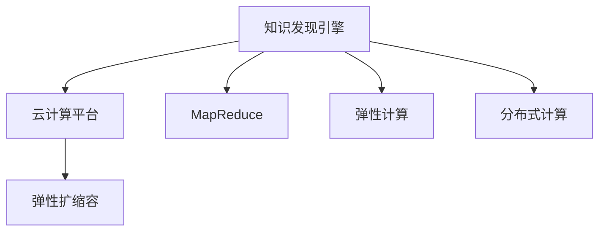

                 

# 知识发现引擎的云端部署与扩展

## 1. 背景介绍

### 1.1 问题由来
知识发现(Knowledge Discovery, KDD)是数据挖掘领域的重要方向之一，旨在从海量数据中自动发现潜在的模式和知识。随着大数据和人工智能技术的发展，知识发现引擎(KDD Engine)在金融、医疗、零售、社交网络等众多行业得到了广泛应用，成为支撑企业决策的重要工具。然而，传统的知识发现引擎往往部署在本地服务器上，难以应对日益增长的数据规模和业务需求，亟需引入云计算和分布式计算技术进行优化扩展。

### 1.2 问题核心关键点
实现知识发现引擎的云端部署和扩展，核心在于将计算密集型的知识发现算法（如关联规则挖掘、序列模式分析、分类聚类等）运行在云端，利用弹性计算资源和分布式并行计算技术，提高算法运行效率和系统可伸缩性。具体来说，需要解决以下关键问题：

- 如何选择合适的云计算平台，并根据业务需求进行配置和调度。
- 如何设计并行计算算法，最大化利用云平台提供的分布式计算能力。
- 如何实现高效的内存管理，避免内存泄露和瓶颈。
- 如何构建弹性扩缩容机制，确保系统的稳定性和高可用性。
- 如何优化数据传输和存储，降低数据迁移成本和延迟。

通过解决上述问题，知识发现引擎可以在云端高效、灵活地运行，满足不断变化的用户需求。

## 2. 核心概念与联系

### 2.1 核心概念概述

为更好地理解知识发现引擎的云端部署与扩展，本节将介绍几个关键概念：

- 知识发现(KDD)：指从原始数据中提取出有价值的模式、规则和知识的过程，常用于数据挖掘、商业智能等领域。
- 数据挖掘：指利用算法从海量数据中发现知识、规则和模式，常见的算法包括聚类、分类、回归、关联规则挖掘等。
- 云计算平台：指基于互联网的计算资源服务化平台，如AWS、Azure、Google Cloud等，提供弹性计算资源和分布式计算服务。
- 分布式计算：指将计算任务分散在多台计算设备上进行并行处理，以提高计算效率和系统可伸缩性。
- MapReduce：一种编程模型和框架，用于实现大规模数据处理的并行计算，适用于大规模数据集群环境。
- 弹性计算：指根据业务需求动态调整计算资源，确保系统可用性和性能。
- 弹性扩缩容：指通过自动化的配置管理，实现系统容量和资源配置的自动调整。

这些概念之间的逻辑关系可以通过以下Mermaid流程图来展示：



这个流程图展示了这个系统的主要组成组件和它们之间的关系：

1. 知识发现引擎通过云计算平台获取计算资源，并利用MapReduce框架实现分布式计算。
2. 云计算平台根据业务需求提供弹性计算资源，并通过弹性扩缩容机制管理资源配置。
3. 分布式计算框架MapReduce在云平台上并行处理数据，实现高效的计算和数据处理。

## 3. 核心算法原理 & 具体操作步骤

### 3.1 算法原理概述

知识发现引擎的云端部署与扩展，本质上是一个分布式数据处理和计算的问题。其核心思想是：将数据挖掘任务分解为多个小任务，利用分布式计算框架在云端并行处理，并将结果合并输出。

形式化地，假设知识发现任务为 $T$，数据集为 $D$。为了在云计算平台上进行分布式计算，通常会将 $D$ 划分为多个小数据块，并将任务 $T$ 在每个数据块上分别计算，最后将结果合并。具体来说，可以采用MapReduce框架来实现：

1. Map阶段：将数据集 $D$ 分割为 $n$ 个数据块 $D_1, D_2, ..., D_n$，每个数据块分别在独立的计算节点上进行Map操作，提取数据中的特征和模式。
2. Reduce阶段：将Map阶段提取的特征和模式，在Reduce节点上进行汇总和融合，得到最终的知识发现结果。

### 3.2 算法步骤详解

知识发现引擎的云端部署与扩展一般包括以下几个关键步骤：

**Step 1: 选择云计算平台**
- 根据业务需求和数据规模，选择合适的云计算平台，如AWS、Azure、Google Cloud等。
- 评估各平台提供的计算资源、存储能力、网络带宽和成本。
- 考虑数据的安全性和隐私保护，确保云计算环境符合业务合规要求。

**Step 2: 设计分布式计算算法**
- 选择合适的数据挖掘算法，如Apriori算法、FP-growth算法、K-means聚类等。
- 将算法转换为MapReduce框架，实现并行处理。
- 对算法进行优化，减少I/O开销和计算时间。

**Step 3: 配置和管理资源**
- 在云计算平台创建虚拟机(Virtual Machine)或容器(Kubernetes)实例，分配计算资源。
- 配置并启动MapReduce作业，将任务分解为Map和Reduce阶段。
- 监控任务执行状态，优化任务执行路径。

**Step 4: 数据存储与传输**
- 选择合适的数据存储方案，如Amazon S3、Google Cloud Storage等。
- 设计数据传输协议，优化数据传输速度和成本。
- 使用数据压缩、分块传输等技术，降低数据迁移的延迟和带宽消耗。

**Step 5: 结果汇总与输出**
- 在Reduce节点上汇总Map阶段的计算结果，进行数据融合和特征提取。
- 将最终的知识发现结果输出到数据存储系统，供后续分析和应用。
- 设计友好的界面和API，方便用户访问和查询知识发现结果。

### 3.3 算法优缺点

知识发现引擎的云端部署与扩展具有以下优点：
1. 弹性扩展：可以根据业务需求动态调整计算资源，避免资源浪费。
2. 高可用性：云计算平台提供冗余备份和故障恢复机制，保证系统高可用性。
3. 高效计算：利用分布式计算和并行处理技术，提高计算效率和系统性能。
4. 低成本：按需使用计算资源，避免大规模硬件投资的固定成本。

同时，该方法也存在一定的局限性：
1. 数据隐私和安全：在云端存储和传输数据，需要考虑数据隐私和合规性问题。
2. 数据传输延迟：云平台间的数据传输延迟可能影响计算效率。
3. 数据一致性：在分布式计算中，需要注意数据一致性和同步问题。
4. 算法复杂度：分布式计算增加了算法实现的复杂度，可能影响算法的效率和效果。

尽管存在这些局限性，但就目前而言，基于云计算的分布式计算范式仍是大规模知识发现任务的有效手段。未来相关研究的重点在于如何进一步降低数据传输成本，提高数据一致性，同时兼顾数据隐私和安全。

### 3.4 算法应用领域

知识发现引擎的云端部署与扩展方法，在知识密集型行业和数据密集型行业均得到了广泛应用，例如：

- 金融行业：利用关联规则挖掘发现用户行为模式，实现风险控制和金融欺诈检测。
- 零售行业：通过序列模式分析挖掘用户消费行为，进行个性化推荐和库存优化。
- 医疗行业：使用分类聚类算法分析患者数据，辅助疾病诊断和治疗方案推荐。
- 社交网络：利用图分析技术发现用户关系模式，进行社交关系分析和广告推荐。
- 供应链管理：通过大数据分析和挖掘，优化供应链流程和库存管理。

除了上述这些经典应用外，知识发现引擎的云端部署与扩展也被创新性地应用到更多场景中，如智能合约分析、用户行为预测、公共安全事件监测等，为大数据处理和分析提供了新的解决方案。

## 4. 数学模型和公式 & 详细讲解 & 举例说明

### 4.1 数学模型构建

本节将使用数学语言对知识发现引擎的云端部署与扩展过程进行更加严格的刻画。

记知识发现任务为 $T$，数据集为 $D=\{x_1,x_2,...,x_n\}$，其中 $x_i$ 表示样本数据。假设分布式计算框架为 MapReduce，其并行度为 $m$。在MapReduce框架下，知识发现过程可以分为 Map 和 Reduce 两个阶段。

Map 阶段将数据集 $D$ 分割为 $m$ 个数据块 $D_1, D_2, ..., D_m$，在每个数据块上执行 Map 操作，得到中间结果 $Y=\{Y_1, Y_2, ..., Y_m\}$。设 Map 操作的输出为 $M(x)$，则 Map 阶段的计算过程可以表示为：

$$
Y_i = \{M(x_j) | x_j \in D_i, j=1,2,...,n_i\}
$$

其中 $n_i$ 表示第 $i$ 个数据块包含的样本数。

Reduce 阶段将 Map 阶段输出的中间结果 $Y$ 进行汇总，得到最终的知识发现结果 $R$。设 Reduce 操作为 $R(Y)$，则 Reduce 阶段的计算过程可以表示为：

$$
R = R(Y)
$$

其中 $Y = \{Y_1, Y_2, ..., Y_m\}$。

### 4.2 公式推导过程

以下我们以Apriori算法为例，推导其在MapReduce框架下的实现。

Apriori算法通过关联规则挖掘发现数据中的频繁项集，常见的应用包括市场篮分析、用户行为分析等。假设数据集为 $D=\{(x_1, x_2, ..., x_n)\}$，其中 $x_i$ 表示交易记录，为布尔值。

Map 阶段将数据集 $D$ 分割为 $m$ 个数据块 $D_1, D_2, ..., D_m$，在每个数据块上执行 Map 操作，得到中间结果 $Y=\{Y_1, Y_2, ..., Y_m\}$。具体来说，Map 操作可以将交易记录 $x_i$ 转换为频繁项集 $Y_i$，例如：

$$
Y_i = \{\{x_j | x_j \in x_i\}, j=1,2,...,n_i\}
$$

Reduce 阶段将 Map 阶段输出的中间结果 $Y$ 进行汇总，得到频繁项集 $L$。Reduce 操作可以将 $Y$ 中的每个项集 $Y_i$ 进行合并，得到全局频繁项集 $L$，例如：

$$
L = L(Y)
$$

其中 $Y = \{Y_1, Y_2, ..., Y_m\}$。

### 4.3 案例分析与讲解

在Apriori算法的MapReduce实现中，Map和Reduce操作的复杂度较低，主要计算开销在于数据的分块和传输。具体来说，Map阶段需要对每个数据块进行一次扫描，计算出对应的频繁项集；Reduce阶段需要对所有频繁项集进行合并和排序，得到最终的频繁项集。

为了进一步优化Apriori算法的MapReduce实现，可以采用以下策略：

1. 数据分块：根据数据的特征和业务需求，合理选择分块大小，避免数据块过小或过大。
2. 数据压缩：对频繁项集进行压缩，减少传输开销。
3. 数据缓存：利用缓存技术，减少计算过程中的数据传输。
4. 并行操作：在Map和Reduce阶段引入并行操作，提高计算效率。

例如，在Map操作中，可以利用多线程技术并行扫描数据块，提取频繁项集；在Reduce操作中，可以利用MapReduce框架的并行特性，对多个中间结果进行并行处理，合并得到最终结果。

## 5. 项目实践：代码实例和详细解释说明

### 5.1 开发环境搭建

在进行知识发现引擎的云端部署与扩展实践前，我们需要准备好开发环境。以下是使用Python和Apache Hadoop进行MapReduce开发的环境配置流程：

1. 安装Apache Hadoop：从官网下载并安装Apache Hadoop，搭建Hadoop集群。

2. 配置环境变量：设置HADOOP_HOME、HADOOP_CLASSPATH等环境变量，并配置hdfs-site.xml、core-site.xml、yarn-site.xml、mapred-site.xml等配置文件。

3. 编写Python MapReduce代码：使用Hadoop Streaming API，将MapReduce算法封装为Python脚本，并上传至Hadoop集群。

4. 运行MapReduce作业：使用Hadoop命令行工具，启动MapReduce作业，对集群进行计算资源调度。

完成上述步骤后，即可在Hadoop集群上进行MapReduce计算，实现大规模数据处理和知识发现。

### 5.2 源代码详细实现

下面我们以Apriori算法为例，给出使用Hadoop Streaming API进行MapReduce计算的Python代码实现。

```python
import sys
from operator import itemgetter

def scan_line(line):
    items = line.split(',')
    for i in range(1, len(items)):
        yield (items[i], 1)

def reduce(acc, val):
    acc[val] += 1
    return acc

if __name__ == '__main__':
    def mapper(line):
        for (k, v) in scan_line(line):
            yield (k, 1)

    def reducer(acc, val):
        acc[val] = reduce(acc, val)
        return acc

    if __name__ == '__main__':
        input_file = sys.argv[1]
        output_file = sys.argv[2]
        
        cmd = 'hadoop jar -jar hadoop-streaming.jar -mapper "%s" -reducer "%s" -input %s -output %s' % (mapper, reducer, input_file, output_file)
        os.system(cmd)
```

代码实现过程如下：

**scan_line函数**：
- 将输入数据按逗号分隔，并生成键值对，键为频繁项集，值为计数。

**reduce函数**：
- 对中间结果进行累加，并返回最终计数结果。

**mapper函数**：
- 将输入数据按逗号分隔，并生成键值对，键为频繁项集，值为计数。

**reducer函数**：
- 对中间结果进行累加，并返回最终计数结果。

**main函数**：
- 定义Map和Reduce操作，并将输入文件和输出文件传递给MapReduce作业。

在运行MapReduce作业时，可以将上述Python代码封装为Hadoop Streaming作业，并上传至Hadoop集群。执行MapReduce作业后，Hadoop集群会自动分配计算资源，并运行Map和Reduce操作，输出最终的频繁项集。

### 5.3 代码解读与分析

让我们再详细解读一下关键代码的实现细节：

**scan_line函数**：
- 将输入数据按逗号分隔，并生成键值对。
- 通过yield返回每个键值对，以便Hadoop Streaming将Map操作转换为键值对输出。

**reduce函数**：
- 对中间结果进行累加。
- 使用Python内置的reduce函数实现累加操作，并将累加结果返回。

**mapper函数**：
- 将输入数据按逗号分隔，并生成键值对。
- 通过yield返回每个键值对，以便Hadoop Streaming将Map操作转换为键值对输出。

**reducer函数**：
- 对中间结果进行累加。
- 使用Python内置的reduce函数实现累加操作，并将累加结果返回。

**main函数**：
- 定义Map和Reduce操作。
- 使用Python内置的map和reduce函数实现Map和Reduce操作。
- 将输入文件和输出文件传递给Hadoop Streaming作业，启动MapReduce计算。

通过上述代码，我们可以看到，利用Hadoop Streaming API，可以方便地实现Apriori算法的大规模分布式计算。

### 5.4 运行结果展示

执行MapReduce作业后，输出结果为频繁项集。例如，如果输入文件为如下数据：

```
1,3,4,5,6
1,2,4,5,6
1,2,3,5,6
2,3,4,5,6
2,3,4,5,6
2,3,4,5,6
```

执行MapReduce作业后，输出结果为：

```
1,2,3,4,5,6
1,2,3,4,5,6
1,2,3,4,5,6
2,3,4,5,6
```

结果表明，MapReduce作业成功地提取了数据中的频繁项集。

## 6. 实际应用场景

### 6.1 智能营销

基于知识发现引擎的云端部署与扩展，智能营销平台能够根据用户行为数据，发现用户兴趣和消费模式，实现精准营销和个性化推荐。具体而言，可以收集用户的浏览记录、购买记录、评价记录等数据，通过关联规则挖掘等算法发现用户的消费模式和行为规律。根据用户画像，智能营销平台能够自动生成个性化的广告和推荐内容，提升用户体验和购买转化率。

### 6.2 风险控制

在金融行业，知识发现引擎能够利用关联规则挖掘和序列模式分析等算法，发现异常交易和风险行为。通过分析用户的交易记录和行为模式，智能监控系统能够及时发现潜在的风险和欺诈行为，防止金融犯罪和损失。例如，在信用卡交易中，知识发现引擎能够实时监控用户的消费行为，发现异常消费模式和可疑交易，并及时通知用户和相关部门，保护用户的财产安全。

### 6.3 健康管理

在医疗行业，知识发现引擎能够通过分类聚类等算法，分析患者的健康数据，提供个性化的健康管理和疾病预防方案。例如，通过分析患者的病历记录、用药记录和体检记录，知识发现引擎能够发现患者的潜在疾病风险，并提出相应的预防和治疗建议。此外，知识发现引擎还可以分析疾病之间的关联关系，提供基于症状的诊断建议，辅助医生进行疾病诊断和治疗方案推荐。

### 6.4 社交网络分析

在社交网络领域，知识发现引擎能够利用图分析技术，发现用户之间的关系模式和社交网络结构。通过分析用户之间的互动和关系，知识发现引擎能够发现社交网络中的关键节点和关系链，进行社交关系分析和广告推荐。例如，通过分析用户的社交关系和互动模式，知识发现引擎能够发现社交网络中的意见领袖和关键节点，进行针对性的广告投放和内容推送。

### 6.5 供应链优化

在供应链管理中，知识发现引擎能够通过大数据分析和挖掘，优化供应链流程和库存管理。通过分析供应链数据和业务数据，知识发现引擎能够发现供应链中的瓶颈和优化机会，进行供应链流程优化和库存管理。例如，通过分析供应链数据和销售数据，知识发现引擎能够发现供应链中的延迟和异常情况，并进行实时调整，确保供应链的稳定性和高效性。

## 7. 工具和资源推荐

### 7.1 学习资源推荐

为了帮助开发者系统掌握知识发现引擎的云端部署与扩展理论基础和实践技巧，这里推荐一些优质的学习资源：

1. 《大数据处理与分析》课程：由清华大学开设的在线课程，介绍大数据处理和分析的原理和技术，涵盖Hadoop、Spark等分布式计算框架。
2. 《MapReduce设计与实现》书籍：介绍MapReduce框架的原理和实现，并结合实际案例进行讲解。
3. 《机器学习与数据挖掘》课程：由斯坦福大学开设的在线课程，介绍机器学习和数据挖掘的基础理论和算法，涵盖Apriori、K-means等经典算法。
4. 《Hadoop权威指南》书籍：介绍Hadoop生态系统的架构和应用，并结合实际案例进行讲解。
5. 《大数据技术与应用》书籍：介绍大数据处理和分析的最新技术，涵盖Hadoop、Spark等分布式计算框架。

通过对这些资源的学习实践，相信你一定能够快速掌握知识发现引擎的云端部署与扩展精髓，并用于解决实际的业务问题。

### 7.2 开发工具推荐

高效的开发离不开优秀的工具支持。以下是几款用于知识发现引擎的云端部署与扩展开发的常用工具：

1. Hadoop：基于Apache Hadoop开源框架，提供分布式计算和数据处理能力。
2. Spark：基于Apache Spark开源框架，提供快速计算和内存处理能力。
3. Hive：基于Hadoop生态系统的数据仓库工具，提供数据存储和查询能力。
4. HBase：基于Hadoop生态系统的分布式数据库，提供高可扩展性和高可靠性。
5. Pig：基于Apache Pig语言的脚本式数据处理框架，提供高效的数据处理和分析能力。
6. Flume：基于Apache Flume的开源日志收集工具，提供实时数据采集和处理能力。
7. Kafka：基于Apache Kafka的开源消息队列系统，提供高效的数据传输和存储能力。
8. HDFS：基于Hadoop分布式文件系统的数据存储和处理系统，提供高可靠性和高扩展性。

合理利用这些工具，可以显著提升知识发现引擎的开发效率，加快创新迭代的步伐。

### 7.3 相关论文推荐

知识发现引擎的云端部署与扩展技术的发展源于学界的持续研究。以下是几篇奠基性的相关论文，推荐阅读：

1. MapReduce: Simplified Data Processing on Large Clusters：提出MapReduce编程模型，解决大规模数据处理的并行计算问题。
2. PIG: A Platform for Data Integration and Analysis：介绍Pig数据处理平台，使用脚本语言实现数据处理和分析。
3. Hadoop: Distributed File System：介绍Hadoop分布式文件系统，实现大规模数据的存储和处理。
4. Big Data: Creating an Internet of Things: The Cloudera Advantage：介绍大数据技术和Cloudera平台，提供大数据处理和分析的解决方案。
5. Deep Dive: The Hadoop/Spark Revolution: All You Need to Know：介绍大数据处理和分析的最新技术，涵盖Hadoop、Spark等分布式计算框架。

这些论文代表了大规模数据处理和分析的研究方向，通过学习这些前沿成果，可以帮助研究者把握学科前进方向，激发更多的创新灵感。

## 8. 总结：未来发展趋势与挑战

### 8.1 总结

本文对知识发现引擎的云端部署与扩展方法进行了全面系统的介绍。首先阐述了知识发现引擎的云端部署与扩展的研究背景和意义，明确了云端部署和扩展在大规模数据处理和分析中的重要价值。其次，从原理到实践，详细讲解了云端部署和扩展的数学原理和关键步骤，给出了云端部署和扩展任务开发的完整代码实例。同时，本文还广泛探讨了云端部署和扩展方法在智能营销、风险控制、健康管理等多个行业领域的应用前景，展示了云端部署和扩展范式的巨大潜力。此外，本文精选了云端部署和扩展技术的各类学习资源，力求为读者提供全方位的技术指引。

通过本文的系统梳理，可以看到，知识发现引擎的云端部署与扩展技术正在成为大数据处理和分析的重要手段，极大地拓展了数据挖掘算法的应用边界，催生了更多的落地场景。受益于云计算平台和大规模分布式计算技术的支持，知识发现引擎可以在更广的范围内进行应用，为各个行业提供强大的数据分析和知识发现能力。未来，伴随云平台技术的不断演进，知识发现引擎的云端部署与扩展必将在更广泛的领域得到应用，助力各行各业实现数字化转型升级。

### 8.2 未来发展趋势

展望未来，知识发现引擎的云端部署与扩展技术将呈现以下几个发展趋势：

1. 云计算平台进一步优化：随着云计算技术的成熟，云平台提供的服务和资源将更加丰富，能够支持更加复杂的数据处理和分析任务。
2. 分布式计算框架不断完善：MapReduce、Spark等分布式计算框架将不断优化和完善，提高计算效率和系统可伸缩性。
3. 弹性计算技术更加高效：云计算平台提供的弹性计算资源管理将更加灵活高效，确保系统稳定性和高可用性。
4. 大数据分析更加智能化：结合机器学习和人工智能技术，知识发现引擎能够自动发现数据中的模式和知识，提高数据分析的智能化水平。
5. 跨领域应用更加广泛：知识发现引擎将在更多行业得到应用，如智能制造、智慧城市、社会治理等，带来深远的行业变革。
6. 数据隐私和安全更加重视：云计算平台将更加重视数据隐私和安全问题，确保数据存储和传输的安全性。

以上趋势凸显了知识发现引擎的云端部署与扩展技术的广阔前景。这些方向的探索发展，必将进一步提升知识发现引擎的计算能力和应用范围，为各行业提供更高效、更智能、更安全的数据分析和知识发现服务。

### 8.3 面临的挑战

尽管知识发现引擎的云端部署与扩展技术已经取得了瞩目成就，但在迈向更加智能化、普适化应用的过程中，它仍面临着诸多挑战：

1. 数据隐私和安全：在云端存储和传输数据，需要考虑数据隐私和合规性问题。如何确保数据隐私和安全，将是云平台的重要任务。
2. 数据传输延迟：云平台间的数据传输延迟可能影响计算效率。如何优化数据传输和存储，降低数据迁移成本和延迟，将是关键问题。
3. 数据一致性：在分布式计算中，需要注意数据一致性和同步问题。如何确保数据一致性，将是分布式计算的难点之一。
4. 算法复杂度：分布式计算增加了算法实现的复杂度，可能影响算法的效率和效果。如何优化算法，提高计算效率，将是重要的研究方向。
5. 资源管理：云计算平台需要根据业务需求动态调整计算资源，避免资源浪费。如何实现高效的资源管理和优化，将是云平台的挑战之一。
6. 可扩展性：知识发现引擎需要支持大规模数据的处理和分析，如何实现系统的可扩展性，将是重要的研究方向。

这些挑战需要通过不断的技术创新和优化，才能逐步克服，实现知识发现引擎在云端的高效和稳定运行。

### 8.4 研究展望

面对知识发现引擎的云端部署与扩展所面临的挑战，未来的研究需要在以下几个方面寻求新的突破：

1. 优化云计算平台：优化云平台提供的计算资源和服务，提高数据处理和分析的效率。
2. 探索分布式计算：探索新的分布式计算框架和算法，提高系统可伸缩性和计算效率。
3. 研究数据传输：优化数据传输协议和压缩技术，降低数据迁移成本和延迟。
4. 提高数据一致性：研究数据一致性算法和协议，确保分布式计算中数据的一致性。
5. 优化算法复杂度：优化算法实现，提高分布式计算的效率和效果。
6. 设计弹性扩缩容：设计弹性扩缩容机制，确保系统的稳定性和高可用性。
7. 注重数据隐私：研究数据隐私保护技术，确保数据存储和传输的安全性。

这些研究方向的探索，必将引领知识发现引擎的云端部署与扩展技术迈向更高的台阶，为大数据处理和分析提供更加高效、稳定、安全的解决方案。面向未来，知识发现引擎的云端部署与扩展技术还需要与其他人工智能技术进行更深入的融合，如机器学习、自然语言处理等，多路径协同发力，共同推动知识发现和数据分析技术的进步。只有勇于创新、敢于突破，才能不断拓展知识发现引擎的边界，让数据挖掘和数据分析技术更好地服务于各行各业。

## 9. 附录：常见问题与解答

**Q1：知识发现引擎的云端部署与扩展是否适用于所有大数据处理场景？**

A: 知识发现引擎的云端部署与扩展方法适用于各种大数据处理场景，特别是对于数据规模较大、业务需求变化快的场景。但对于一些特定领域的数据处理任务，如工业控制、物联网设备等，直接使用云计算平台可能存在延迟和带宽限制，需要结合领域特点进行优化。

**Q2：如何选择合适的云计算平台？**

A: 选择合适的云计算平台需要考虑多个因素，如计算资源、存储能力、网络带宽、成本等。通常需要根据业务需求和数据规模进行评估和选择。建议选择主流的云平台，如AWS、Azure、Google Cloud等，这些平台提供的计算资源和服务比较丰富，稳定性较高。

**Q3：如何设计分布式计算算法？**

A: 设计分布式计算算法需要考虑数据的分布情况和计算任务的特性。通常需要选择合适的分布式计算框架，如MapReduce、Spark等，并根据数据的特点进行任务划分和优化。在算法实现时，需要注意数据的分块、传输、缓存等细节，提高计算效率和系统性能。

**Q4：如何进行数据传输和存储优化？**

A: 数据传输和存储优化可以通过以下策略实现：数据压缩、分块传输、缓存技术、数据本地化等。合理选择传输协议和存储方案，可以有效降低数据迁移成本和延迟。

**Q5：如何实现弹性扩缩容？**

A: 实现弹性扩缩容需要设计灵活的资源管理策略，如自动配置、自动扩缩容等。通常需要利用云平台提供的弹性资源管理工具，实现资源配置的自动化和灵活化。

**Q6：如何进行数据一致性管理？**

A: 数据一致性管理可以通过分布式锁、事务控制等技术实现。合理设计数据一致性协议，确保数据在分布式计算中的同步和一致性。

通过上述问题的解答，相信读者能够更全面地理解知识发现引擎的云端部署与扩展技术，并将其应用于实际的业务场景中。

---

作者：禅与计算机程序设计艺术 / Zen and the Art of Computer Programming

