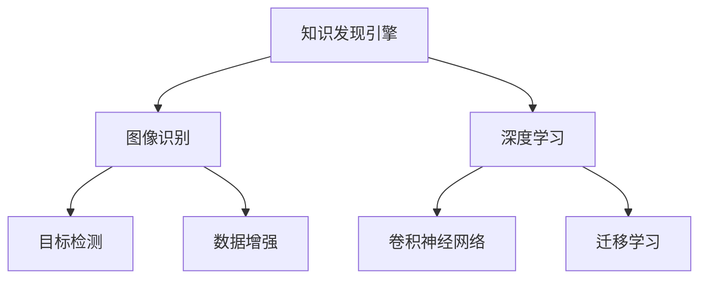

                 

# 知识发现引擎的图像识别技术应用

> 关键词：知识发现引擎(Knowledge Discovery Engine, KDE), 图像识别(Image Recognition), 深度学习(Deep Learning), 卷积神经网络(Convolutional Neural Network, CNN), 迁移学习(Transfer Learning), 目标检测(Object Detection), 数据增强(Data Augmentation)

## 1. 背景介绍

### 1.1 问题由来

在当今信息爆炸的时代，各类海量数据无处不在，如何从海量数据中提取有价值的信息，进行知识发现和数据挖掘，成为信息时代的重要课题。知识发现引擎(KDE)作为一种重要的数据挖掘工具，近年来在学术界和工业界得到了广泛关注和深入研究。其中，图像识别作为KDE的核心任务之一，其应用广泛且具有代表性，因此值得深入探讨。

### 1.2 问题核心关键点

知识发现引擎的核心目标是从大量数据中自动发现并抽取隐含的有价值信息。图像识别作为KDE的主要应用之一，指通过算法识别图像中的目标物，提取其特征，并进行分类、检测、分割等任务。尽管近年来深度学习技术的飞速发展，使得图像识别技术取得了长足进步，但面对复杂多变的真实世界，图像识别仍面临着诸多挑战，如遮挡、光照变化、背景干扰等。

## 2. 核心概念与联系

### 2.1 核心概念概述

为更好地理解知识发现引擎中的图像识别技术，本节将介绍几个密切相关的核心概念：

- **知识发现引擎(KDE)**：一种数据挖掘工具，用于自动从大数据中发现模式、规律和关联，支持复杂问题的决策和知识构建。
- **图像识别(Image Recognition)**：通过算法自动识别图像中的目标物，提取其特征并进行分类、检测、分割等任务。
- **深度学习(Deep Learning)**：一种基于神经网络的技术，通过多层神经网络模拟人类神经系统处理信息的过程，广泛用于图像识别、语音识别、自然语言处理等领域。
- **卷积神经网络(CNN)**：一种特殊的深度神经网络，主要应用于图像处理和计算机视觉领域，通过卷积操作提取图像特征。
- **迁移学习(Transfer Learning)**：一种通过预训练模型在特定任务上微调获得新任务表现的技术，可以减少新任务训练的样本需求和时间成本。
- **目标检测(Object Detection)**：指在图像中检测出目标物，并对其位置和类别进行标注。
- **数据增强(Data Augmentation)**：通过在训练集上引入数据多样性，增强模型泛化能力，提高模型鲁棒性。

这些核心概念之间的逻辑关系可以通过以下Mermaid流程图来展示：



这个流程图展示了几大核心概念之间的联系：

1. 知识发现引擎通过图像识别等技术，从数据中抽取知识，支持决策和预测。
2. 深度学习为图像识别提供技术支持，尤其是卷积神经网络在图像处理中发挥重要作用。
3. 迁移学习利用预训练模型加速新任务训练，提高模型效率。
4. 目标检测和数据增强技术，进一步提升图像识别的准确性和鲁棒性。

## 3. 核心算法原理 & 具体操作步骤
### 3.1 算法原理概述

图像识别技术基于深度学习，主要通过卷积神经网络(CNN)等模型，对输入图像进行特征提取和分类。其核心算法流程包括：数据预处理、模型构建、训练、测试和部署等步骤。

### 3.2 算法步骤详解

**Step 1: 数据预处理**
- 收集标注数据集：获取带标注的图像数据集，如ImageNet、COCO等。
- 数据增强：对数据集进行旋转、缩放、裁剪、翻转等增强操作，生成多样性训练样本。
- 归一化：将图像数据进行归一化处理，保证模型输入的一致性。

**Step 2: 模型构建**
- 选择CNN架构：如VGG、ResNet、Inception等，根据任务需求选择合适的模型。
- 添加分类层：在CNN模型的顶层添加全连接层，进行分类任务。
- 选择优化器：如Adam、SGD等，设置学习率、批大小、迭代轮数等超参数。

**Step 3: 模型训练**
- 将数据集划分为训练集、验证集和测试集。
- 将模型在训练集上进行前向传播，计算损失函数。
- 反向传播计算梯度，更新模型参数。
- 在验证集上评估模型性能，根据性能决定是否调整超参数。

**Step 4: 模型测试**
- 在测试集上评估模型性能，输出预测结果。
- 绘制混淆矩阵，分析模型分类效果。

**Step 5: 模型部署**
- 将训练好的模型导出为指定格式的模型文件，支持推理预测。
- 部署到实际应用系统中，支持批量图像识别。

### 3.3 算法优缺点

**优点：**
1. 准确率高：通过多层卷积操作，深度学习模型可以提取出丰富的图像特征。
2. 鲁棒性好：数据增强和迁移学习技术，提升了模型泛化能力和鲁棒性。
3. 自动化程度高：深度学习模型具有高度的自动化和可扩展性，适合大规模数据处理。

**缺点：**
1. 计算资源需求高：大型的深度学习模型需要大量的计算资源和存储空间。
2. 训练时间较长：深度学习模型的训练过程复杂且耗时，需要大量的训练数据和计算资源。
3. 模型复杂度高：深度学习模型的结构复杂，难以解释其内部工作机制。

### 3.4 算法应用领域

图像识别技术广泛应用于许多领域，如自动驾驶、医疗影像分析、智能监控、安防识别等。其典型应用场景包括：

- **自动驾驶**：通过图像识别技术，实时感知道路环境，辅助车辆进行路径规划和决策。
- **医疗影像分析**：识别和分割影像中的病灶区域，辅助医生进行疾病诊断。
- **智能监控**：在视频流中检测异常行为，如盗窃、入侵等，提升监控系统智能化水平。
- **安防识别**：识别监控视频中的可疑人物或物品，提升公共安全水平。
- **零售购物**：通过图像识别技术，自动化地进行商品识别和库存管理，提高效率。
- **农业种植**：对农田图像进行分析和识别，辅助农民进行病虫害防治和作物管理。

## 4. 数学模型和公式 & 详细讲解
### 4.1 数学模型构建

本节将使用数学语言对图像识别技术的核心算法流程进行严格刻画。

记输入图像为 $x \in \mathbb{R}^{H \times W \times C}$，其中 $H$ 和 $W$ 分别为图像的高度和宽度，$C$ 为通道数。假设卷积神经网络为 $f: \mathbb{R}^{H \times W \times C} \rightarrow \mathbb{R}^m$，其中 $m$ 为输出类别数。模型的输出为 $y = f(x)$。

在训练过程中，模型通过损失函数 $L$ 衡量预测输出与真实标签之间的差异，常见损失函数包括交叉熵损失、均方误差损失等。模型的训练目标是：

$$
\min_{\theta} L(f_{\theta}(x), y)
$$

其中 $f_{\theta}$ 表示模型参数为 $\theta$ 时的前向传播函数。

### 4.2 公式推导过程

以二分类任务为例，使用交叉熵损失函数进行推导。设模型输出为 $y \in [0,1]$，真实标签为 $y \in \{0,1\}$。则交叉熵损失函数定义为：

$$
L(y,f(x)) = -(y\log f(x) + (1-y)\log(1-f(x)))
$$

对上式求导，得到损失函数对模型参数 $\theta$ 的梯度：

$$
\frac{\partial L(y,f(x))}{\partial \theta} = -(y - f(x))
$$

在训练过程中，通过反向传播算法计算梯度并更新模型参数，直到损失函数收敛为止。

### 4.3 案例分析与讲解

假设使用VGG16模型进行二分类任务，输出层大小为512，训练集大小为10000，学习率为0.001，批大小为32，迭代轮数为1000。

**Step 1: 数据预处理**
- 使用ImageNet数据集进行数据增强，包括随机裁剪、旋转、缩放等。
- 将图像数据归一化到[0,1]范围内。

**Step 2: 模型构建**
- 使用VGG16模型作为基础架构，添加全连接层和Softmax激活函数，输出二分类结果。
- 设置优化器为Adam，学习率为0.001，批大小为32。

**Step 3: 模型训练**
- 将数据集划分为训练集、验证集和测试集。
- 在训练集上训练模型，每批次32张图像，迭代轮数为1000。
- 在验证集上评估模型性能，根据性能调整超参数。

**Step 4: 模型测试**
- 在测试集上评估模型性能，输出预测结果。
- 绘制混淆矩阵，分析模型分类效果。

**Step 5: 模型部署**
- 将训练好的模型导出为TensorFlow模型文件，支持推理预测。
- 部署到实际应用系统中，支持批量图像识别。

## 5. 项目实践：代码实例和详细解释说明
### 5.1 开发环境搭建

在进行图像识别项目开发前，需要准备好开发环境。以下是使用Python进行TensorFlow开发的环境配置流程：

1. 安装Anaconda：从官网下载并安装Anaconda，用于创建独立的Python环境。
2. 创建并激活虚拟环境：
```bash
conda create -n tensorflow-env python=3.8 
conda activate tensorflow-env
```

3. 安装TensorFlow：根据CUDA版本，从官网获取对应的安装命令。例如：
```bash
conda install tensorflow -c tf -c conda-forge
```

4. 安装各类工具包：
```bash
pip install numpy pandas scikit-learn matplotlib tqdm jupyter notebook ipython
```

完成上述步骤后，即可在`tensorflow-env`环境中开始图像识别项目开发。

### 5.2 源代码详细实现

这里以二分类图像识别为例，使用TensorFlow和Keras框架进行代码实现。

```python
import tensorflow as tf
from tensorflow.keras import datasets, layers, models
import matplotlib.pyplot as plt

# 加载数据集
(train_images, train_labels), (test_images, test_labels) = datasets.cifar10.load_data()

# 数据预处理
train_images = train_images / 255.0
test_images = test_images / 255.0

# 构建模型
model = models.Sequential([
    layers.Conv2D(32, (3, 3), activation='relu', input_shape=(32, 32, 3)),
    layers.MaxPooling2D((2, 2)),
    layers.Conv2D(64, (3, 3), activation='relu'),
    layers.MaxPooling2D((2, 2)),
    layers.Conv2D(64, (3, 3), activation='relu'),
    layers.Flatten(),
    layers.Dense(64, activation='relu'),
    layers.Dense(10)
])

# 编译模型
model.compile(optimizer='adam',
              loss=tf.keras.losses.SparseCategoricalCrossentropy(from_logits=True),
              metrics=['accuracy'])

# 训练模型
history = model.fit(train_images, train_labels, epochs=10, 
                    validation_data=(test_images, test_labels))

# 测试模型
test_loss, test_acc = model.evaluate(test_images,  test_labels, verbose=2)

# 输出测试结果
print('Test accuracy:', test_acc)
```

以上就是使用TensorFlow和Keras框架进行二分类图像识别的完整代码实现。可以看到，得益于TensorFlow的强大封装，我们可以用相对简洁的代码完成图像识别模型的训练和推理。

### 5.3 代码解读与分析

让我们再详细解读一下关键代码的实现细节：

**数据加载与预处理**：
- 使用CIFAR-10数据集进行图像加载和预处理，将图像归一化到[0,1]范围内。

**模型构建**：
- 使用Keras Sequential API定义卷积神经网络模型，包括卷积层、池化层、全连接层等。
- 使用Adam优化器和SparseCategoricalCrossentropy损失函数，定义模型编译过程。

**模型训练**：
- 使用fit方法在训练集上训练模型，迭代轮数为10轮。
- 在验证集上评估模型性能，记录训练过程中的损失和准确率。

**模型测试**：
- 使用evaluate方法在测试集上评估模型性能，输出测试损失和准确率。
- 使用Print函数输出最终测试结果。

可以看到，TensorFlow和Keras框架使得图像识别模型的开发和训练变得简洁高效。开发者可以将更多精力放在数据处理、模型改进等高层逻辑上，而不必过多关注底层的实现细节。

当然，工业级的系统实现还需考虑更多因素，如模型的保存和部署、超参数的自动搜索、更灵活的任务适配层等。但核心的算法流程基本与此类似。

## 6. 实际应用场景
### 6.1 智能安防

在智能安防领域，图像识别技术被广泛应用于人脸识别、行为分析、入侵检测等环节。传统的安防系统依赖人工监控，工作量大且效率低。通过图像识别技术，安防系统能够自动检测异常行为，识别可疑人物，提升监控系统的智能化水平。

具体而言，可以采集监控视频数据，使用图像识别技术进行实时分析，检测异常行为并触发告警。例如，系统可以检测到视频中突然出现的异常人物，自动进行录像并通知安保人员。同时，系统还可以使用人脸识别技术，对视频中的人物进行身份验证，确保系统安全。

### 6.2 医疗影像分析

在医疗影像分析领域，图像识别技术被广泛应用于疾病诊断、影像分割、智能辅助等环节。传统的医学影像分析依赖人工识别和标注，成本高且效率低。通过图像识别技术，系统能够自动检测并标记影像中的病灶区域，辅助医生进行疾病诊断和治疗。

具体而言，可以采集医疗影像数据，使用图像识别技术进行病灶检测和分割，提取关键区域。例如，系统可以在影像中自动识别肿瘤区域，并输出标注结果。同时，系统还可以使用迁移学习技术，在不同医学影像数据集上进行微调，提升模型在不同场景下的泛化能力。

### 6.3 零售购物

在零售购物领域，图像识别技术被广泛应用于商品识别、库存管理、个性化推荐等环节。传统的商品识别依赖人工识别和手动标注，工作量大且容易出错。通过图像识别技术，系统能够自动检测并识别商品，进行库存管理和个性化推荐，提高零售效率和客户体验。

具体而言，可以采集零售货架和用户购物行为的数据，使用图像识别技术进行商品识别和库存管理。例如，系统可以自动识别货架上的商品，生成实时库存数据。同时，系统还可以使用迁移学习技术，在不同零售场景中进行微调，提升模型在不同环境下的泛化能力。

### 6.4 未来应用展望

随着图像识别技术的不断发展，未来其在各领域的应用将更加广泛。以下是几项未来应用展望：

1. **智能制造**：在工业制造领域，图像识别技术被广泛应用于产品检测、质量控制、设备维护等环节。通过图像识别技术，系统能够自动检测产品缺陷和设备故障，提高生产效率和产品质量。

2. **自动驾驶**：在自动驾驶领域，图像识别技术被广泛应用于道路环境感知、路径规划、行为预测等环节。通过图像识别技术，系统能够自动检测道路标志、车辆、行人等元素，辅助车辆进行决策和路径规划。

3. **智慧城市**：在智慧城市领域，图像识别技术被广泛应用于交通管理、环境监测、公共安全等环节。通过图像识别技术，系统能够自动检测交通状况、监测环境污染、识别异常行为，提升城市管理智能化水平。

4. **智能教育**：在智能教育领域，图像识别技术被广泛应用于学生行为分析、作业批改、智能辅导等环节。通过图像识别技术，系统能够自动检测学生作业，进行自动批改和智能辅导，提高教育效率和教学质量。

未来，图像识别技术将继续与其他人工智能技术进行深入融合，如自然语言处理、语音识别、智能推荐等，共同推动人工智能技术的广泛应用。

## 7. 工具和资源推荐
### 7.1 学习资源推荐

为了帮助开发者系统掌握图像识别技术的理论基础和实践技巧，这里推荐一些优质的学习资源：

1. 《深度学习与图像识别》系列博文：由深度学习专家撰写，深入浅出地介绍了深度学习、卷积神经网络、图像识别等核心概念和经典模型。

2. CS231n《卷积神经网络和视觉识别》课程：斯坦福大学开设的计算机视觉明星课程，有Lecture视频和配套作业，带你入门图像识别领域的基本概念和经典模型。

3. 《Hands-On Machine Learning with Scikit-Learn, Keras, and TensorFlow》书籍：详细介绍了使用Scikit-Learn、Keras和TensorFlow进行机器学习的实践技巧，包括图像识别任务开发。

4. TensorFlow官方文档：TensorFlow的官方文档，提供了海量预训练模型和完整的图像识别样例代码，是上手实践的必备资料。

5. PyTorch官方文档：PyTorch的官方文档，提供了丰富的深度学习框架和模型库，包括图像识别任务开发。

通过对这些资源的学习实践，相信你一定能够快速掌握图像识别技术的精髓，并用于解决实际的图像识别问题。

### 7.2 开发工具推荐

高效的开发离不开优秀的工具支持。以下是几款用于图像识别任务开发的常用工具：

1. TensorFlow：基于Google的深度学习框架，支持多种神经网络模型和优化算法，是图像识别任务开发的强大工具。

2. PyTorch：基于Python的深度学习框架，灵活高效，适用于图像识别等任务开发。

3. Keras：基于TensorFlow和Theano的高级神经网络库，易于上手，适合快速开发图像识别模型。

4. OpenCV：开源计算机视觉库，提供了丰富的图像处理和分析功能，适用于图像识别任务预处理。

5. Matplotlib：Python绘图库，支持绘制图像和数据可视化，方便调试和分析图像识别结果。

6. Jupyter Notebook：交互式编程环境，支持Python代码编写和图像显示，方便调试和展示图像识别结果。

合理利用这些工具，可以显著提升图像识别任务的开发效率，加快创新迭代的步伐。

### 7.3 相关论文推荐

图像识别技术的不断进步，离不开学界和工业界的持续研究。以下是几篇奠基性的相关论文，推荐阅读：

1. AlexNet: One Millisecond Object Recognition with Deep Networks（2012）：提出AlexNet模型，通过多层卷积操作，显著提升图像识别精度。

2. VGGNet: Very Deep Convolutional Networks for Large-Scale Image Recognition（2014）：提出VGG模型，通过多层次卷积池化，提升图像识别精度。

3. GoogleNet: Going Deeper with Convolutions（2014）：提出Inception模型，通过网络架构优化，提升图像识别精度。

4. ResNet: Deep Residual Learning for Image Recognition（2015）：提出ResNet模型，通过残差连接，解决深度网络退化问题。

5. DenseNet: Dense Convolutional Networks（2016）：提出DenseNet模型，通过密集连接，提升网络表达能力和泛化能力。

6. NASNet: Learning Transferable Architectures for Scalable Image Recognition（2017）：提出NASNet模型，通过神经网络结构搜索，自动设计网络架构。

这些论文代表了大规模图像识别技术的发展脉络。通过学习这些前沿成果，可以帮助研究者把握学科前进方向，激发更多的创新灵感。

## 8. 总结：未来发展趋势与挑战

### 8.1 总结

本文对图像识别技术在大数据挖掘中的应用进行了全面系统的介绍。首先阐述了图像识别技术在知识发现引擎中的核心地位，明确了其在各领域的重要作用。其次，从原理到实践，详细讲解了图像识别技术的核心算法流程和数学模型，给出了图像识别任务开发的完整代码实例。同时，本文还广泛探讨了图像识别技术在智能安防、医疗影像分析、零售购物等多个行业领域的应用前景，展示了图像识别技术的广阔前景。最后，本文精选了图像识别技术的各类学习资源，力求为读者提供全方位的技术指引。

通过本文的系统梳理，可以看到，图像识别技术通过深度学习，已经在诸多领域取得了显著的应用效果，极大拓展了知识发现引擎的应用范围，成为数据挖掘的重要工具。未来，伴随深度学习技术的持续演进，图像识别技术还将与更多人工智能技术进行融合，推动人工智能技术的全面落地和应用。

### 8.2 未来发展趋势

展望未来，图像识别技术将呈现以下几个发展趋势：

1. **模型规模持续增大**：随着算力成本的下降和数据规模的扩张，深度学习模型参数量还将持续增长，提升模型的表达能力和泛化能力。

2. **迁移学习普及**：迁移学习技术将进一步普及，通过预训练模型和微调技术，加速新任务的训练过程，提升模型效果。

3. **少样本学习和零样本学习**：少样本学习和零样本学习技术将进一步发展，减少对标注数据的依赖，提高模型的泛化能力和自动化水平。

4. **模型鲁棒性提升**：随着对抗训练和数据增强技术的发展，模型鲁棒性将进一步提升，应对更多真实世界的复杂场景。

5. **多模态融合**：图像识别技术将与其他模态的数据进行融合，如文本、语音、视频等，实现多模态信息协同建模，提升模型能力。

6. **自动化和可解释性提升**：自动化和可解释性技术将进一步发展，提升模型的自动化水平和可解释性，帮助用户更好地理解模型的内部机制和决策逻辑。

以上趋势凸显了大规模图像识别技术的广阔前景。这些方向的探索发展，必将进一步提升图像识别模型的性能和应用范围，为数据挖掘领域带来新的突破。

### 8.3 面临的挑战

尽管图像识别技术已经取得了长足进步，但在迈向更加智能化、普适化应用的过程中，仍面临诸多挑战：

1. **标注成本高昂**：图像识别任务需要大量高质量的标注数据，获取成本高，且难以保证标注数据的一致性和准确性。

2. **数据多样性问题**：现实世界中的数据多样性复杂，图像识别模型难以应对光照变化、遮挡、背景干扰等常见问题。

3. **计算资源需求大**：大型的深度学习模型需要大量的计算资源和存储空间，训练和推理过程耗时且资源消耗大。

4. **模型可解释性不足**：图像识别模型的决策过程难以解释，难以对其内部机制和推理逻辑进行分析和调试。

5. **安全性和伦理问题**：图像识别模型可能被恶意利用，输出有害结果，带来安全隐患和伦理问题。

6. **数据隐私保护**：图像识别任务涉及大量个人隐私数据，数据隐私保护和合法使用成为重要挑战。

正视图像识别技术面临的这些挑战，积极应对并寻求突破，将是大规模图像识别技术迈向成熟的必由之路。相信随着学界和工业界的共同努力，这些挑战终将一一被克服，图像识别技术必将在构建人机协同的智能时代中扮演越来越重要的角色。

### 8.4 研究展望

面对图像识别技术面临的诸多挑战，未来的研究需要在以下几个方面寻求新的突破：

1. **无监督和半监督学习**：探索无监督和半监督学习技术，减少对大规模标注数据的依赖，提升模型泛化能力和自动化水平。

2. **少样本学习和零样本学习**：引入少样本学习和零样本学习技术，提升模型在少量标注样本下的性能，实现更灵活的图像识别。

3. **多模态融合**：研究多模态信息融合技术，提升模型在视觉、文本、语音等多模态数据上的表现，实现更全面、准确的图像识别。

4. **自动化和可解释性**：引入自动化和可解释性技术，提升模型的自动化水平和可解释性，帮助用户更好地理解模型内部机制和决策逻辑。

5. **模型鲁棒性**：研究模型鲁棒性提升技术，提升模型在复杂、多样化的数据环境中的泛化能力和抗干扰能力。

6. **数据隐私保护**：研究数据隐私保护技术，确保图像识别模型在处理敏感数据时的安全性和合规性。

这些研究方向的探索，必将引领图像识别技术迈向更高的台阶，为构建安全、可靠、可解释、可控的智能系统铺平道路。面向未来，图像识别技术还需要与其他人工智能技术进行更深入的融合，如自然语言处理、语音识别、强化学习等，多路径协同发力，共同推动人工智能技术的广泛应用。

## 9. 附录：常见问题与解答

**Q1: 图像识别技术如何与自然语言处理技术进行融合？**

A: 图像识别技术可以通过文本标注数据进行迁移学习，进一步提升模型的泛化能力。例如，在医疗影像识别中，可以通过标注文本信息，如病历、诊断报告等，进行模型微调，提升模型在不同场景下的表现。同时，也可以将图像识别技术与自然语言处理技术进行融合，如使用图像和文本的联合模型，进行多模态信息协同建模，提升模型对复杂场景的理解和判断能力。

**Q2: 如何提高图像识别模型的可解释性？**

A: 图像识别模型的可解释性可以通过可视化技术进行展示。例如，可以使用SHAP（SHapley Additive exPlanations）方法，对模型输出的各个特征进行贡献度分析，帮助理解模型的内部机制和决策逻辑。同时，也可以通过模型结构分析和特征重要性分析，进一步提升模型的可解释性。

**Q3: 图像识别技术在智能安防中的应用难点有哪些？**

A: 智能安防中的图像识别技术面临以下难点：

1. 数据多样性：现实世界的复杂场景中，光照条件、背景干扰、遮挡等问题对图像识别模型提出了挑战。
2. 模型泛化能力：安防场景下，模型需要在多摄像头、多环境、多时间等复杂情况下稳定表现。
3. 实时性要求：安防系统对图像识别模型的实时性有高要求，需要在短时间内完成图像处理和分析。
4. 数据隐私保护：安防场景下，涉及到大量个人隐私数据，数据隐私保护和合法使用成为重要挑战。

这些难点需要通过数据增强、模型优化、实时化处理等技术手段进行解决。

---

作者：禅与计算机程序设计艺术 / Zen and the Art of Computer Programming

