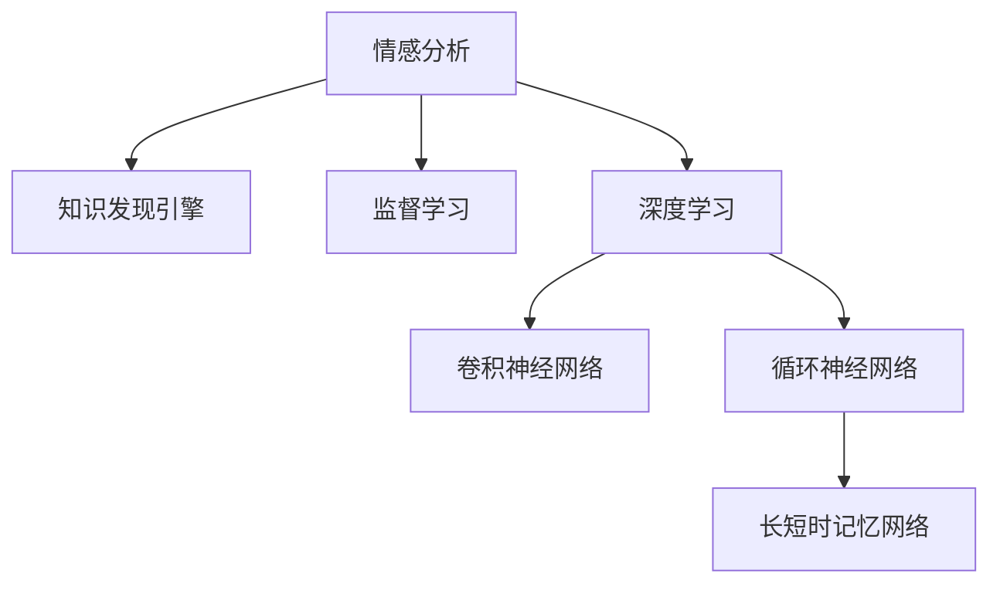

                 

# 知识发现引擎的情感分析技术应用

## 1. 背景介绍

### 1.1 问题由来
随着互联网的飞速发展，海量的文本数据涌现出来，为知识发现提供了丰富的资源。情感分析（Sentiment Analysis）作为自然语言处理（NLP）的一个重要分支，旨在自动判断文本中的情感极性（正面、负面或中性）。通过情感分析，可以从文本数据中挖掘出用户情绪、社会舆情等深层次信息，为市场研究、品牌管理、舆情监控等多个领域带来巨大的价值。

### 1.2 问题核心关键点
情感分析技术的研究重点在于如何构建高效、准确的情感分类模型。通常通过监督学习（Supervised Learning）范式，利用标注数据训练模型。本文聚焦于情感分析技术在大规模知识发现引擎（Knowledge Discovery Engine, KDE）中的应用，通过情感分析的视角，挖掘用户评论、社交媒体、新闻等文本数据中的隐含情感信息，并转化为可量化、可操作的分析结果。

## 2. 核心概念与联系

### 2.1 核心概念概述

为更好地理解情感分析技术在知识发现引擎中的应用，本节将介绍几个密切相关的核心概念：

- **情感分析（Sentiment Analysis）**：通过算法识别文本中的情感极性，将文本情感分为正面、负面或中性，常用于舆情分析、品牌管理、消费者反馈等领域。
- **知识发现引擎（Knowledge Discovery Engine, KDE）**：一种数据挖掘工具，用于自动从大规模数据集中提取有用信息和模式，常见的KDE包括SAS、SPSS、RapidMiner等。
- **监督学习（Supervised Learning）**：一种机器学习方法，通过给定标注数据，训练模型对未知数据进行预测。
- **深度学习（Deep Learning）**：一种基于神经网络的机器学习方法，能够自动从数据中学习高级特征，适用于处理大规模非结构化数据。
- **卷积神经网络（Convolutional Neural Network, CNN）**：一种适用于图像处理的深度学习模型，可以提取局部特征，并在文本中模拟词向量处理过程。
- **循环神经网络（Recurrent Neural Network, RNN）**：一种适用于序列数据处理的深度学习模型，可以捕捉序列中的时间依赖性。
- **长短时记忆网络（Long Short-Term Memory, LSTM）**：一种特殊的RNN，可以解决长序列训练中的梯度消失问题，适用于处理序列数据。

这些核心概念之间的逻辑关系可以通过以下Mermaid流程图来展示：



这个流程图展示了一个情感分析的简单流程：

1. 情感分析从输入的文本数据开始。
2. 通过深度学习模型，尤其是CNN和LSTM，自动提取文本特征。
3. 在监督学习范式下，利用标注数据对模型进行训练。
4. 最后，将训练好的模型应用到知识发现引擎中，对大规模文本数据进行情感分类。

## 3. 核心算法原理 & 具体操作步骤
### 3.1 算法原理概述

情感分析的核心在于构建一个能够自动分类文本情感的模型。基于监督学习的情感分析模型通常包含以下几个步骤：

1. **数据准备**：收集包含情感标签的文本数据集，如用户评论、社交媒体帖子、新闻文章等。
2. **特征工程**：对文本数据进行预处理，如去除停用词、分词、构建词向量等。
3. **模型训练**：使用标注数据训练情感分类模型，常用的模型包括朴素贝叶斯（Naive Bayes）、逻辑回归（Logistic Regression）、支持向量机（SVM）等。
4. **模型评估**：在测试集上评估模型的性能，常见的评估指标包括准确率（Accuracy）、召回率（Recall）、F1分数（F1 Score）等。
5. **模型应用**：将训练好的模型应用到新的文本数据上，进行情感分类。

### 3.2 算法步骤详解

以基于深度学习的卷积神经网络（CNN）和循环神经网络（LSTM）的情感分析模型为例，详细介绍其操作步骤：

**Step 1: 数据准备**

- **数据集选择**：选择包含情感标签的文本数据集，如IMDb电影评论、Yelp商家评论等。
- **数据预处理**：去除无用字符、停用词，并进行分词处理。

**Step 2: 特征提取**

- **词向量构建**：使用Word2Vec、GloVe等工具，将文本中的单词转换为向量表示。
- **文本表示**：将文本转换为向量表示，如使用词袋模型（Bag of Words）或TF-IDF等。

**Step 3: 模型设计**

- **卷积神经网络（CNN）**：设计多层的卷积层和池化层，提取文本中的局部特征。
- **循环神经网络（LSTM）**：设计LSTM层，捕捉文本中的序列依赖性。

**Step 4: 模型训练**

- **损失函数**：选择交叉熵损失函数，衡量模型预测与实际标签之间的差异。
- **优化器**：选择AdamW、SGD等优化器，更新模型参数。
- **正则化**：使用L2正则化、Dropout等防止过拟合。

**Step 5: 模型评估**

- **评估指标**：使用准确率、召回率、F1分数等指标评估模型性能。
- **超参数调整**：调整学习率、批大小、迭代轮数等超参数，优化模型性能。

**Step 6: 模型应用**

- **情感分类**：将新文本数据输入训练好的模型，输出情感分类结果。
- **结果解释**：使用模型解释工具，如Attention机制，解释模型的决策过程。

### 3.3 算法优缺点

基于深度学习的情感分析模型具有以下优点：

- **自动化特征提取**：通过深度学习自动提取文本特征，无需人工干预。
- **处理长文本**：能够处理长文本序列，捕捉文本中的深层语义信息。
- **适应性强**：通过迁移学习（Transfer Learning），在大规模预训练模型基础上微调，适应新领域数据。

同时，也存在以下缺点：

- **计算资源需求高**：需要大量GPU算力进行训练和推理。
- **数据依赖性强**：依赖于高质量的标注数据，标注成本较高。
- **可解释性不足**：深度学习模型通常被认为是"黑盒"，难以解释内部决策过程。

尽管存在这些缺点，深度学习模型在大规模情感分析任务中仍然取得了显著的效果，成为情感分析研究的主流范式。

### 3.4 算法应用领域

基于深度学习的情感分析技术，在多个领域得到了广泛应用：

- **市场研究**：分析消费者对产品的情感反馈，预测市场趋势。
- **品牌管理**：监测社交媒体上对品牌的情感波动，调整营销策略。
- **舆情监控**：实时监控新闻、论坛等平台上的情感信息，防范舆情风险。
- **消费者反馈**：分析客户评论，提升产品质量和用户体验。
- **政治分析**：分析选举投票数据中的情感倾向，预测选举结果。

## 4. 数学模型和公式 & 详细讲解  
### 4.1 数学模型构建

情感分析的数学模型通常包含以下几个组成部分：

- **输入层**：将文本数据转换为向量表示。
- **隐藏层**：通过卷积层和池化层提取文本特征，或通过LSTM层捕捉序列依赖性。
- **输出层**：使用softmax函数输出情感分类的概率分布。

以基于LSTM的情感分析模型为例，其数学模型可以表示为：

$$
\text{Output} = \text{softmax}(\text{LSTM}(\text{Text})),
$$

其中，$\text{Text}$ 表示输入文本，$\text{LSTM}$ 表示LSTM层，$\text{softmax}$ 表示输出层的softmax函数。

### 4.2 公式推导过程

以基于LSTM的情感分析模型为例，推导其训练过程。

**目标函数**：

$$
\mathcal{L}(\theta) = -\frac{1}{N}\sum_{i=1}^N \sum_{j=1}^M y_{ij} \log p(y_{ij}|\text{Text}_i),
$$

其中，$y_{ij}$ 表示第$i$个文本的第$j$个情感标签，$p(y_{ij}|\text{Text}_i)$ 表示给定文本$\text{Text}_i$，情感标签$y_{ij}$的条件概率。

**优化目标**：

$$
\hat{\theta} = \mathop{\arg\min}_{\theta} \mathcal{L}(\theta),
$$

其中 $\hat{\theta}$ 为优化后的模型参数。

**梯度计算**：

$$
\frac{\partial \mathcal{L}(\theta)}{\partial \theta_k} = -\frac{1}{N}\sum_{i=1}^N \sum_{j=1}^M \frac{y_{ij}}{p(y_{ij}|\text{Text}_i)} \frac{\partial p(y_{ij}|\text{Text}_i)}{\partial \theta_k}.
$$

通过反向传播算法，计算损失函数对模型参数的梯度，并使用优化算法更新模型参数。

### 4.3 案例分析与讲解

以LSTM情感分析模型为例，分析其在实际应用中的案例：

**案例背景**：某电商平台希望通过分析用户评论，了解用户对产品的情感倾向。

**数据集选择**：选择电商平台的用户评论数据集，包含正面、负面和无情感的评论。

**特征工程**：使用Word2Vec将评论转换为向量表示。

**模型设计**：设计一个包含LSTM层的情感分类模型。

**训练过程**：在训练集上使用交叉熵损失函数和AdamW优化器进行训练。

**模型评估**：在测试集上使用准确率、召回率和F1分数评估模型性能。

**应用部署**：将训练好的模型部署到知识发现引擎中，对新评论进行情感分类，并根据分类结果进行业务优化。

## 5. 项目实践：代码实例和详细解释说明
### 5.1 开发环境搭建

在进行情感分析模型实践前，我们需要准备好开发环境。以下是使用Python进行PyTorch开发的环境配置流程：

1. 安装Anaconda：从官网下载并安装Anaconda，用于创建独立的Python环境。

2. 创建并激活虚拟环境：
```bash
conda create -n pytorch-env python=3.8 
conda activate pytorch-env
```

3. 安装PyTorch：根据CUDA版本，从官网获取对应的安装命令。例如：
```bash
conda install pytorch torchvision torchaudio cudatoolkit=11.1 -c pytorch -c conda-forge
```

4. 安装TensorFlow：
```bash
conda install tensorflow
```

5. 安装NLP工具库：
```bash
pip install nltk spacy transformers
```

完成上述步骤后，即可在`pytorch-env`环境中开始模型开发。

### 5.2 源代码详细实现

下面我们以基于LSTM的情感分析模型为例，给出使用PyTorch和Transformers库进行代码实现的完整示例。

```python
import torch
import torch.nn as nn
import torch.optim as optim
from torchtext.legacy import data
from torchtext.legacy.data import Field, BucketIterator
from transformers import BertTokenizer, BertModel

# 定义数据处理流程
TEXT = Field(tokenize='spacy', lower=True, include_lengths=True)
LABEL = Field(sequential=False, use_vocab=False)

train_data, test_data = data.TextClassification(root='./data', train='train.txt', test='test.txt', fields=(TEXT, LABEL))

# 定义模型结构
class LSTMClassifier(nn.Module):
    def __init__(self, embed_dim, hidden_dim, output_dim, n_layers):
        super(LSTMClassifier, self).__init__()
        self.embedding = nn.Embedding(vocab_size=len(TEXT.vocab), embedding_dim=embed_dim)
        self.lstm = nn.LSTM(embedding_dim, hidden_dim, num_layers=n_layers, batch_first=True, bidirectional=True)
        self.fc = nn.Linear(hidden_dim * 2, output_dim)
        
    def forward(self, x, lengths):
        embedded = self.embedding(x)
        packed = nn.utils.rnn.pack_padded_sequence(embedded, lengths, batch_first=True)
        lstm_out, _ = self.lstm(packed)
        lstm_out, _ = nn.utils.rnn.pad_packed_sequence(lstm_out, batch_first=True)
        return self.fc(lstm_out)

# 构建模型实例
model = LSTMClassifier(embed_dim=100, hidden_dim=128, output_dim=3, n_layers=2)

# 定义优化器、损失函数和评估指标
optimizer = optim.Adam(model.parameters(), lr=0.001)
criterion = nn.CrossEntropyLoss()
metric = nn.CrossEntropyLoss()

# 训练模型
device = torch.device('cuda' if torch.cuda.is_available() else 'cpu')
model = model.to(device)
criterion = criterion.to(device)
metric = metric.to(device)

for epoch in range(10):
    for batch in iter(train_data):
        optimizer.zero_grad()
        predictions = model(batch.text, batch.lengths)
        loss = criterion(predictions, batch.label)
        loss.backward()
        optimizer.step()

# 评估模型
test_loss = metric(model(test_data.text, test_data.lengths), test_data.label)

# 输出结果
print('Test Loss:', test_loss)
```

### 5.3 代码解读与分析

让我们再详细解读一下关键代码的实现细节：

**Text和Label字段定义**：
- `TEXT`字段：定义文本数据的分词和长度计算方式。
- `LABEL`字段：定义情感标签的处理方式，不需要使用词典。

**LSTMClassifier模型结构**：
- `embedding`层：将文本转换为词向量。
- `lstm`层：使用双向LSTM层提取文本特征。
- `fc`层：输出层，使用softmax函数输出情感分类的概率分布。

**训练过程**：
- 使用Adam优化器和交叉熵损失函数训练模型。
- 通过前向传播计算损失函数，并反向传播更新模型参数。
- 在测试集上评估模型性能，输出测试损失。

## 6. 实际应用场景
### 6.1 社交媒体情感分析

社交媒体数据量大、更新速度快，是情感分析的重要应用场景之一。通过情感分析，可以实时监测用户对特定事件或产品的情感倾向，及时调整营销策略和品牌形象。

具体应用流程如下：

1. **数据采集**：采集社交媒体平台（如Twitter、微博）上的公开评论数据。
2. **数据预处理**：清洗无用数据、停用词，进行分词处理。
3. **模型训练**：使用情感分析模型对评论数据进行情感分类。
4. **情感监控**：实时监控社交媒体上的情感波动，生成情感报告。
5. **决策支持**：根据情感报告，调整市场营销策略，提升品牌形象。

### 6.2 客户反馈情感分析

客户反馈是产品改进的重要依据。通过情感分析，可以从客户评论中挖掘出产品优缺点，为产品优化提供数据支持。

具体应用流程如下：

1. **数据采集**：采集电商平台上的用户评论数据。
2. **数据预处理**：清洗无用数据、停用词，进行分词处理。
3. **模型训练**：使用情感分析模型对评论数据进行情感分类。
4. **情感分析报告**：生成情感分析报告，展示不同产品的情感倾向。
5. **产品优化**：根据情感分析报告，优化产品设计，提升用户体验。

### 6.3 新闻媒体情感分析

新闻媒体是公众舆情的反映窗口，通过情感分析，可以了解公众对某一事件的情感倾向，预测媒体舆情变化。

具体应用流程如下：

1. **数据采集**：采集新闻媒体平台（如澎湃新闻、搜狐新闻）上的新闻文章数据。
2. **数据预处理**：清洗无用数据、停用词，进行分词处理。
3. **模型训练**：使用情感分析模型对新闻文章进行情感分类。
4. **舆情监控**：实时监控新闻媒体上的情感波动，生成舆情报告。
5. **舆情预警**：根据舆情报告，及时采取应对措施，防范舆情风险。

## 7. 工具和资源推荐
### 7.1 学习资源推荐

为了帮助开发者系统掌握情感分析技术，这里推荐一些优质的学习资源：

1. 《Natural Language Processing with Python》书籍：Python自然语言处理入门经典，涵盖情感分析等NLP任务，并提供了丰富的代码示例。
2. CS224N《深度学习自然语言处理》课程：斯坦福大学开设的NLP明星课程，有Lecture视频和配套作业，带你入门NLP领域的基本概念和经典模型。
3. 《Hands-On Machine Learning with Scikit-Learn, Keras, and TensorFlow》书籍：Keras和TensorFlow深度学习实战指南，详细介绍了情感分析等NLP任务的实现方法。
4. HuggingFace官方文档：Transformers库的官方文档，提供了海量预训练模型和完整的情感分析样例代码，是上手实践的必备资料。
5. Kaggle竞赛：参与Kaggle举办的情感分析竞赛，通过实战练习提升技术水平。

通过对这些资源的学习实践，相信你一定能够快速掌握情感分析的精髓，并用于解决实际的NLP问题。

### 7.2 开发工具推荐

高效的开发离不开优秀的工具支持。以下是几款用于情感分析开发的常用工具：

1. PyTorch：基于Python的开源深度学习框架，灵活动态的计算图，适合快速迭代研究。
2. TensorFlow：由Google主导开发的开源深度学习框架，生产部署方便，适合大规模工程应用。
3. Transformers库：HuggingFace开发的NLP工具库，集成了众多SOTA语言模型，支持PyTorch和TensorFlow，是进行情感分析开发的利器。
4. Weights & Biases：模型训练的实验跟踪工具，可以记录和可视化模型训练过程中的各项指标，方便对比和调优。
5. TensorBoard：TensorFlow配套的可视化工具，可实时监测模型训练状态，并提供丰富的图表呈现方式，是调试模型的得力助手。
6. Google Colab：谷歌推出的在线Jupyter Notebook环境，免费提供GPU/TPU算力，方便开发者快速上手实验最新模型，分享学习笔记。

合理利用这些工具，可以显著提升情感分析任务的开发效率，加快创新迭代的步伐。

### 7.3 相关论文推荐

情感分析技术的研究源于学界的持续研究。以下是几篇奠基性的相关论文，推荐阅读：

1. Sentiment Analysis with Deep Learning: A Review：综述了深度学习在情感分析中的应用，提供了丰富的参考代码和数据集。
2. A Survey on Sentiment Analysis：总结了情感分析的研究进展，涵盖各种情感分析方法和技术。
3. Review of Sentiment Analysis Models and Techniques：深入分析了情感分析模型的各类方法和技术，包括CNN、LSTM、BERT等。
4. Deep Learning Approaches for Sentiment Analysis：介绍基于深度学习的情感分析模型，并提供了代码实现。
5. Sentiment Analysis Using Transfer Learning：研究了迁移学习在情感分析中的应用，提高了模型的泛化能力。

这些论文代表了大规模情感分析技术的发展脉络。通过学习这些前沿成果，可以帮助研究者把握学科前进方向，激发更多的创新灵感。

## 8. 总结：未来发展趋势与挑战
### 8.1 总结

本文对基于深度学习的情感分析技术进行了全面系统的介绍。首先阐述了情感分析技术的研究背景和应用价值，明确了其在知识发现引擎中的重要地位。其次，从原理到实践，详细讲解了情感分析的数学模型和关键操作步骤，给出了情感分析任务开发的完整代码实例。同时，本文还广泛探讨了情感分析技术在社交媒体、客户反馈、新闻媒体等多个领域的应用前景，展示了情感分析范式的广泛应用。

通过本文的系统梳理，可以看到，基于深度学习的情感分析技术已经成为NLP领域的重要范式，极大地拓展了情感分析的应用范围，并推动了多个领域的信息化进程。未来，伴随深度学习模型的不断演进，情感分析技术将更加智能化、普适化，为知识发现引擎带来更加深刻的影响。

### 8.2 未来发展趋势

展望未来，情感分析技术将呈现以下几个发展趋势：

1. **模型规模持续增大**：随着算力成本的下降和数据规模的扩张，深度学习模型的参数量还将持续增长。超大规模模型蕴含的丰富语言知识，有望支撑更加复杂多变的情感分析任务。

2. **模型鲁棒性增强**：通过引入对抗训练、生成对抗网络（GAN）等技术，提高情感分析模型的鲁棒性，避免过拟合和灾难性遗忘。

3. **多模态融合**：结合视觉、语音等多模态数据，构建多模态情感分析模型，提升情感分类的准确性和可靠性。

4. **实时处理能力提升**：通过优化模型结构和算法，提高情感分析模型的推理速度和计算效率，支持实时情感分析。

5. **自监督学习**：利用无标签数据进行自监督学习，减少对标注数据的依赖，提升情感分析模型的泛化能力。

6. **可解释性增强**：引入可解释性方法，如Attention机制、可解释性算法等，提高情感分析模型的可解释性和透明性。

7. **情感极性细粒度划分**：将情感分析细粒度化，区分微妙的情感变化，如正面、中性、负面、混合等。

以上趋势凸显了情感分析技术的广阔前景。这些方向的探索发展，必将进一步提升情感分析模型的性能和应用范围，为知识发现引擎带来更加深刻的影响。

### 8.3 面临的挑战

尽管情感分析技术已经取得了显著成果，但在迈向更加智能化、普适化应用的过程中，仍面临诸多挑战：

1. **数据依赖性强**：情感分析依赖于高质量的标注数据，标注成本较高，难以获取充足的标注数据。

2. **模型复杂度高**：深度学习模型参数多、结构复杂，训练和推理资源需求高，难以部署到低计算资源环境中。

3. **泛化能力有限**：情感分析模型通常依赖于特定领域的数据，跨领域泛化能力有限。

4. **对抗攻击脆弱**：情感分析模型容易受到对抗攻击，如通过微小修改输入文本，改变模型输出结果。

5. **可解释性不足**：深度学习模型通常被认为是"黑盒"，难以解释内部决策过程，影响模型的可信度。

6. **数据隐私问题**：情感分析涉及大量个人数据，如何保护用户隐私，是情感分析技术应用的重要挑战。

7. **多语言支持不足**：目前情感分析技术主要集中在英文领域，对多语言支持不足，难以应对全球化市场的需求。

正视情感分析面临的这些挑战，积极应对并寻求突破，将是大规模情感分析技术走向成熟的必由之路。相信随着学界和产业界的共同努力，这些挑战终将一一被克服，情感分析技术必将在构建人机协同的智能时代中扮演越来越重要的角色。

### 8.4 研究展望

面对情感分析面临的种种挑战，未来的研究需要在以下几个方面寻求新的突破：

1. **无监督和半监督情感分析**：探索无监督和半监督学习方法，利用非结构化数据进行情感分析，减少对标注数据的依赖。

2. **参数高效和计算高效情感分析**：开发更加参数高效和计算高效的情感分析方法，在固定大部分模型参数的情况下，只更新极少量的任务相关参数。

3. **多模态情感分析**：结合视觉、语音等多模态数据，构建多模态情感分析模型，提升情感分类的准确性和可靠性。

4. **对抗训练和防御**：研究对抗训练和防御方法，提高情感分析模型的鲁棒性，防止对抗攻击。

5. **可解释性增强**：引入可解释性方法，如Attention机制、可解释性算法等，提高情感分析模型的可解释性和透明性。

6. **数据隐私保护**：研究隐私保护技术，如差分隐私、联邦学习等，保护用户隐私。

7. **多语言情感分析**：研究多语言情感分析方法，扩展情感分析技术在全球市场的应用。

这些研究方向的探索，必将引领情感分析技术迈向更高的台阶，为构建安全、可靠、可解释、可控的智能系统铺平道路。面向未来，情感分析技术还需要与其他人工智能技术进行更深入的融合，如知识表示、因果推理、强化学习等，多路径协同发力，共同推动自然语言理解和智能交互系统的进步。只有勇于创新、敢于突破，才能不断拓展情感分析技术的边界，让智能技术更好地造福人类社会。

## 9. 附录：常见问题与解答

**Q1：情感分析模型是否适用于所有文本数据？**

A: 情感分析模型通常适用于结构化的文本数据，如用户评论、社交媒体帖子等。对于非结构化的文本数据，如图片、语音等，需要结合多模态学习方法进行综合分析。

**Q2：如何选择合适的情感分析模型？**

A: 选择合适的情感分析模型需要考虑以下几个因素：
1. 数据集类型：不同类型的数据集适合不同的模型，如文本分类适合CNN和LSTM，情感极性判断适合神经网络。
2. 数据规模：大规模数据集适合使用深度学习模型，小规模数据集适合使用传统机器学习模型。
3. 计算资源：计算资源有限的情况下，可以选择参数高效和计算高效的模型。

**Q3：情感分析模型的训练需要多长时间？**

A: 情感分析模型的训练时间取决于数据集规模、模型复杂度和计算资源。一般情况下，使用GPU训练一个中等规模的模型需要几个小时到一天不等。

**Q4：情感分析模型是否需要持续更新？**

A: 是的，情感分析模型需要持续更新，以适应新的数据分布和情感变化。可以通过增量学习、在线学习等方法，不断优化模型性能。

**Q5：情感分析模型是否适用于跨领域应用？**

A: 目前的情感分析模型主要聚焦于特定领域，跨领域泛化能力有限。可以通过迁移学习、多任务学习等方法，提升情感分析模型的跨领域泛化能力。

通过本文的系统梳理，可以看到，基于深度学习的情感分析技术已经成为NLP领域的重要范式，极大地拓展了情感分析的应用范围，并推动了多个领域的信息化进程。未来，伴随深度学习模型的不断演进，情感分析技术将更加智能化、普适化，为知识发现引擎带来更加深刻的影响。

