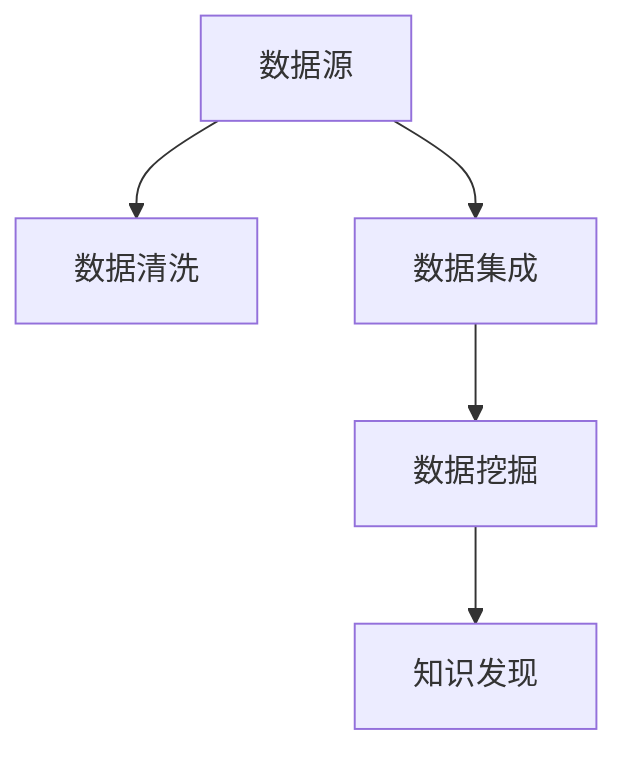

                 

# 知识发现引擎的数据源获取与处理

> 关键词：数据源, 数据清洗, 数据集成, 数据挖掘, 数据库技术

## 1. 背景介绍

### 1.1 问题由来
随着大数据时代的到来，信息量的爆炸式增长为知识的发现提供了前所未有的契机。然而，如何从海量的数据中高效、准确地提取有价值的信息，成为了大数据领域的一大挑战。传统的数据处理方法无法满足这一需求，需要借助更加智能化的工具——知识发现引擎。

### 1.2 问题核心关键点
知识发现引擎（Knowledge Discovery Engine, KDE）是一种用于从海量数据中提取有价值信息的智能系统。其核心技术包括数据源获取、数据清洗、数据集成、数据挖掘等。本文将重点介绍数据源获取与处理的技术细节和应用案例，为后续的数据挖掘和知识发现打下坚实基础。

### 1.3 问题研究意义
研究知识发现引擎的数据源获取与处理，对于拓展数据挖掘的应用范围，提升数据处理的效率和准确性，加速知识发现技术的产业化进程，具有重要意义：

1. 拓展数据应用范围。数据源的广泛获取和有效处理，可以使得更多类型的数据应用于知识发现，提高数据分析的全面性和多样性。
2. 提升数据处理效率。高效的数据源获取与处理，可以大幅缩短数据准备时间，提升后续数据挖掘和知识发现的效率。
3. 提高数据处理准确性。合理的数据清洗和集成策略，可以有效避免数据噪音和冗余，提高知识发现的准确性和可靠性。
4. 加速技术落地。借助智能化的数据获取与处理技术，可以加速知识发现技术在各个垂直行业的应用推广，促进行业智能化升级。
5. 带来技术创新。数据源获取与处理技术的不断演进，催生了数据增强、主动学习等新的研究方向，推动了大数据技术的持续进步。

## 2. 核心概念与联系

### 2.1 核心概念概述

为更好地理解知识发现引擎的数据源获取与处理技术，本节将介绍几个密切相关的核心概念：

- 数据源（Data Source）：指存储数据的地方，可以是数据库、文件系统、Web网页、API接口等。
- 数据清洗（Data Cleaning）：指从原始数据中去除噪音、重复、不完整数据等，保证数据质量的过程。
- 数据集成（Data Integration）：指将来自不同数据源的数据融合在一起，构建统一的数据视图，供后续分析和挖掘使用。
- 数据挖掘（Data Mining）：指从大量数据中发现规律、模式、异常等信息，为决策制定提供支持。
- 数据库技术（Database Technology）：指用于高效存储、查询和管理数据的各类技术，包括关系数据库、非关系数据库、NoSQL数据库等。

这些核心概念之间的逻辑关系可以通过以下Mermaid流程图来展示：



这个流程图展示了大数据处理的核心流程：

1. 数据源获取。
2. 数据清洗和集成。
3. 数据挖掘。
4. 知识发现。

## 3. 核心算法原理 & 具体操作步骤

### 3.1 算法原理概述

知识发现引擎的数据源获取与处理，本质上是将来自不同渠道的数据进行采集、清洗和融合的过程。其核心思想是：通过智能化的数据获取技术，高效、全面地收集各类数据源，并进行数据清洗和集成，构建一个结构化、高质量的数据视图，供后续的数据挖掘和知识发现使用。

### 3.2 算法步骤详解

数据源获取与处理的具体步骤包括：

**Step 1: 数据源识别与选择**
- 确定数据源类型：如关系型数据库、NoSQL数据库、文件系统、Web API等。
- 进行数据源可用性测试：确保数据源可访问、数据质量符合要求。
- 评估数据源价值：综合考虑数据规模、更新频率、数据分布等因素，选择合适的数据源。

**Step 2: 数据采集与抓取**
- 设计数据采集器：针对不同类型的数据源，设计相应的数据抓取工具。
- 实现数据采集：从数据源中抓取数据，可以使用爬虫、API调用、数据库接口等方式。
- 处理采集错误：设计容错机制，处理采集过程中可能出现的各种异常情况。

**Step 3: 数据清洗与预处理**
- 去除噪音数据：过滤掉缺失、异常、重复的数据，确保数据质量。
- 数据标准化：对数据进行格式转换、编码规范等标准化处理。
- 数据归一化：对数据进行归一化处理，消除不同量级数据的影响。

**Step 4: 数据集成与融合**
- 设计数据集成策略：如分布式集成、流水线集成等，选择合适的数据集成方式。
- 处理数据冲突：通过规则、算法等方式解决数据集成中的冲突问题。
- 构建数据视图：对融合后的数据进行分析和汇总，构建统一的数据视图。

### 3.3 算法优缺点

知识发现引擎的数据源获取与处理技术具有以下优点：
1. 高效全面。智能化的数据源识别与选择，可以全面覆盖各类数据源，高效获取所需数据。
2. 数据质量高。通过数据清洗和预处理技术，可以过滤掉噪音和冗余数据，保证数据质量。
3. 集成灵活。采用多种数据集成策略，可以灵活处理来自不同渠道的数据，构建统一的数据视图。
4. 应用广泛。广泛应用于大数据分析、商业智能、科学研究等各个领域，为知识发现提供了坚实的数据基础。

同时，该方法也存在一定的局限性：
1. 依赖外部系统。数据源的可用性和数据质量往往受限于外部系统的稳定性和可访问性。
2. 资源消耗高。大规模数据采集、清洗和集成需要大量计算资源和时间，成本较高。
3. 数据隐私问题。数据采集和集成过程中可能涉及敏感数据，需要关注数据隐私和安全问题。
4. 数据格式多样。不同类型的数据源往往采用不同的数据格式和存储方式，增加了数据处理的复杂性。

尽管存在这些局限性，但就目前而言，基于智能化的数据源获取与处理技术仍然是大数据处理的主流范式。未来相关研究的重点在于如何进一步降低数据获取和处理的成本，提高数据处理的灵活性和可扩展性，同时兼顾数据隐私和安全等因素。

### 3.4 算法应用领域

基于知识发现引擎的数据源获取与处理技术，已经广泛应用于以下领域：

- 商业智能（BI）：通过智能化的数据源获取与处理，构建企业级数据仓库，提供决策支持。
- 数据挖掘与分析：从大规模数据中发现规律和模式，为科学研究、金融分析等提供支持。
- 科学研究：从各类文献、实验数据中提取有价值信息，加速科学研究进程。
- 工业生产：采集和处理生产数据，优化生产流程，提高生产效率和质量。
- 医疗健康：从医疗记录、健康数据中提取信息，辅助疾病诊断和治疗决策。

除了上述这些经典应用外，大数据技术还在更多领域得到了广泛应用，如城市治理、智能交通、环境保护等，为各行各业带来了新的变革。

## 4. 数学模型和公式 & 详细讲解 & 举例说明

### 4.1 数学模型构建

本节将使用数学语言对知识发现引擎的数据源获取与处理过程进行更加严格的刻画。

假设数据源包含 $n$ 条记录，每条记录包含 $m$ 个字段。记数据集为 $D=\{(x_i,y_i)\}_{i=1}^n, x_i \in \mathbb{R}^m, y_i \in \mathbb{R}$。

定义数据清洗过程的函数 $f: \mathbb{R}^m \rightarrow \mathbb{R}^m$，其中 $f(x)$ 表示对记录 $x$ 进行清洗和预处理后的结果。记清洗后的数据集为 $D'$。

定义数据集成过程的函数 $g: \mathbb{R}^n \rightarrow \mathbb{R}^m$，其中 $g(y)$ 表示对记录 $y$ 进行数据集成后的结果。记集成后的数据集为 $D''$。

最终，知识发现引擎的目标是构建统一的数据视图，可以使用数学语言表示为：

$$
D'' = \{(x',y')\}_{i=1}^n, x' = g(f(x)), y' = g(f(y))
$$

其中 $x'$ 和 $y'$ 分别表示清洗和集成后的记录，$g$ 和 $f$ 分别表示数据集成和数据清洗函数。

### 4.2 公式推导过程

以下我们以文本数据的清洗和集成为例，推导数据清洗和集成的数学公式。

假设文本数据集 $D=\{(d_i,t_i)\}_{i=1}^n, d_i \in \mathbb{R}^m, t_i \in \{1,2,\ldots,k\}$。其中 $d_i$ 表示文本记录，$t_i$ 表示记录所属的类别。

**数据清洗过程**：

1. 去除噪音：去除包含特殊字符、无效编码等噪音数据。
2. 文本标准化：将文本转换为小写，去除标点符号，分词等标准化处理。
3. 去除停用词：去除常见的停用词，如 "的"、"是"、"在" 等，减少噪音。
4. 归一化处理：对文本进行归一化处理，消除不同长度文本的影响。

数学表示为：

$$
d' = f(d) = \text{去除噪音} \wedge \text{文本标准化} \wedge \text{去除停用词} \wedge \text{归一化处理}
$$

其中 $f(d)$ 表示对文本 $d$ 进行清洗后的结果。

**数据集成过程**：

1. 数据归一化：将不同长度、不同格式的文本数据归一化到相同长度，方便后续处理。
2. 数据融合：将清洗后的文本数据进行融合，去除重复记录，填充缺失数据。
3. 构建特征向量：将融合后的文本数据转换为特征向量，供后续数据挖掘和知识发现使用。

数学表示为：

$$
d'' = g(d') = \text{数据归一化} \wedge \text{数据融合} \wedge \text{构建特征向量}
$$

其中 $g(d')$ 表示对清洗后的文本数据 $d'$ 进行集成后的结果。

### 4.3 案例分析与讲解

**案例：商品销售数据分析**

假设某电商网站收集了每天的销售数据，包括商品名称、价格、销售量、销售额等。从数据源采集到的原始数据可能包含缺失值、异常值等噪音。

**数据源获取**：
- 通过网站爬虫抓取每天的销售数据。
- 使用数据库接口从电商网站的数据库中提取数据。

**数据清洗**：
- 去除缺失值：对缺失值进行填充或删除。
- 去除异常值：检测并删除异常值，如价格异常高的商品记录。
- 数据标准化：将日期转换为标准格式，统一商品名称的拼写。

**数据集成**：
- 数据归一化：将所有销售数据归一化到相同格式，便于后续分析。
- 数据融合：将所有日期的销售数据合并，消除重复记录。
- 构建特征向量：将商品名称、价格、销售量等数据转换为数值特征向量，供后续分析使用。

通过上述步骤，我们得到了一个结构化、高质量的数据视图，可以用于商品销售趋势分析、异常检测等任务。

## 5. 项目实践：代码实例和详细解释说明

### 5.1 开发环境搭建

在进行数据源获取与处理实践前，我们需要准备好开发环境。以下是使用Python进行Pandas开发的环境配置流程：

1. 安装Anaconda：从官网下载并安装Anaconda，用于创建独立的Python环境。

2. 创建并激活虚拟环境：
```bash
conda create -n data-pipeline python=3.8 
conda activate data-pipeline
```

3. 安装Pandas：从官网获取对应的安装命令。例如：
```bash
conda install pandas
```

4. 安装各类工具包：
```bash
pip install numpy matplotlib seaborn tqdm jupyter notebook ipython
```

完成上述步骤后，即可在`data-pipeline`环境中开始数据源获取与处理的开发。

### 5.2 源代码详细实现

下面我们以商品销售数据分析为例，给出使用Pandas库对数据进行清洗和集成的PyTorch代码实现。

首先，定义数据清洗函数：

```python
import pandas as pd
import numpy as np
import re
from nltk.tokenize import word_tokenize
from nltk.corpus import stopwords
from sklearn.preprocessing import StandardScaler
from sklearn.metrics import precision_recall_curve

def clean_data(df):
    # 去除缺失值
    df.dropna(inplace=True)
    
    # 去除异常值
    df = df[(df['price'] > 0) & (df['sales'] > 0)]
    
    # 文本标准化
    df['product_name'] = df['product_name'].apply(lambda x: x.lower())
    df['product_name'] = df['product_name'].apply(lambda x: re.sub(r'[^a-zA-Z0-9\s]', '', x))
    
    # 去除停用词
    stop_words = set(stopwords.words('english'))
    df['product_name'] = df['product_name'].apply(lambda x: ' '.join([word for word in word_tokenize(x) if word not in stop_words]))
    
    # 归一化处理
    scaler = StandardScaler()
    df[['price', 'sales']] = scaler.fit_transform(df[['price', 'sales']])
    
    return df
```

然后，定义数据集成函数：

```python
def integrate_data(df, time_range):
    # 数据归一化
    df = df.copy()
    df = pd.pivot_table(df, index='time', columns='product_name', values='sales')
    df = df.fillna(0)
    
    # 数据融合
    df = pd.DataFrame(df.stack().values)
    df.columns = ['time', 'product_name', 'sales']
    df = df.groupby(['time', 'product_name']).sum().reset_index()
    
    # 构建特征向量
    features = ['time', 'product_name', 'sales']
    df = df[features]
    
    return df
```

接着，定义数据处理函数：

```python
def process_data(data):
    # 数据清洗
    cleaned_data = clean_data(data)
    
    # 数据集成
    integrated_data = integrate_data(cleaned_data, time_range)
    
    # 构建训练集和测试集
    train_data = integrated_data[time_range == 'train']
    test_data = integrated_data[time_range == 'test']
    
    return train_data, test_data
```

最后，启动数据处理流程：

```python
# 加载原始数据
data = pd.read_csv('sales_data.csv')
time_range = ['train', 'test']

# 数据处理
train_data, test_data = process_data(data)
```

以上就是使用Pandas库对商品销售数据进行清洗和集成的完整代码实现。可以看到，通过Pandas库，我们可以快速实现数据处理的基本功能。

### 5.3 代码解读与分析

让我们再详细解读一下关键代码的实现细节：

**clean_data函数**：
- 去除缺失值：通过 `dropna` 方法去除缺失值。
- 去除异常值：根据价格和销售额，筛选出合理的数据。
- 文本标准化：转换为小写，去除特殊字符，分词并去除停用词。
- 归一化处理：使用 `StandardScaler` 对价格和销售额进行归一化。

**integrate_data函数**：
- 数据归一化：使用 `pivot_table` 方法将数据归一化到相同格式。
- 数据融合：使用 `stack` 方法合并数据，使用 `groupby` 方法计算总销售额。
- 构建特征向量：提取时间、商品名称和销售额，构建特征向量。

**process_data函数**：
- 数据清洗：调用 `clean_data` 函数对数据进行清洗。
- 数据集成：调用 `integrate_data` 函数对数据进行集成。
- 数据切分：根据时间范围将数据切分为训练集和测试集。

可以看到，Pandas库提供了丰富的数据处理功能，可以快速实现数据的清洗、集成和切分。合理利用这些工具，可以显著提升数据源获取与处理的效率，减少人工干预。

当然，工业级的系统实现还需考虑更多因素，如数据预处理管道、数据一致性、错误处理机制等。但核心的数据处理逻辑基本与此类似。

## 6. 实际应用场景
### 6.1 商业智能

基于知识发现引擎的数据源获取与处理技术，可以广泛应用于商业智能系统。商业智能系统通过智能化的数据获取和处理，构建企业级数据仓库，为决策支持提供可靠的数据基础。

在技术实现上，可以通过爬虫、API调用等方式获取电商、金融、社交等平台的数据，进行数据清洗和集成，构建统一的数据视图。通过数据分析、可视化等技术，为决策者提供市场趋势、用户行为、财务状况等关键信息，支持企业运营决策。

### 6.2 科学研究

科学研究领域对数据的需求日益增长，数据源获取与处理技术为各类科研项目提供了重要支持。通过数据源获取技术，可以采集和处理各类文献、实验数据、网络数据等，为科学研究提供原始数据。

在数据处理方面，可以应用数据清洗和集成技术，构建高质量的数据视图。通过数据分析、数据挖掘等技术，发现数据中的规律和模式，为科学研究的创新提供数据支持。

### 6.3 工业生产

在工业生产领域，数据源获取与处理技术可以采集和处理各类生产数据，为生产优化提供数据基础。通过数据清洗和集成技术，构建统一的生产数据视图。

在数据挖掘方面，可以应用异常检测、趋势分析等技术，发现生产过程中的异常情况和潜在问题，优化生产流程，提高生产效率和质量。

### 6.4 医疗健康

医疗健康领域对数据的需求非常庞大，数据源获取与处理技术为各类医疗项目提供了重要支持。通过数据源获取技术，可以采集和处理各类医疗记录、健康数据、基因数据等，为医疗研究和实践提供数据基础。

在数据处理方面，可以应用数据清洗和集成技术，构建高质量的医疗数据视图。通过数据分析、数据挖掘等技术，发现疾病模式、预测疾病风险、优化诊疗方案等，为医疗健康提供数据支持。

## 7. 工具和资源推荐
### 7.1 学习资源推荐

为了帮助开发者系统掌握知识发现引擎的数据源获取与处理技术的理论基础和实践技巧，这里推荐一些优质的学习资源：

1. 《Python数据科学手册》：一本系统介绍Python数据科学的书籍，涵盖了Pandas、NumPy、SciPy等常用工具库的使用方法。
2. 《数据挖掘导论》：一本介绍数据挖掘基础概念和方法的教材，适合初学者入门。
3. 《大数据技术与应用》：一本介绍大数据技术及其应用的教材，涵盖数据采集、数据清洗、数据挖掘等内容。
4. Kaggle数据科学竞赛平台：一个提供大量数据集的在线平台，适合进行数据挖掘和数据处理实践。
5. Coursera《大数据与机器学习》课程：由斯坦福大学开设的在线课程，涵盖大数据技术及其在机器学习中的应用。

通过对这些资源的学习实践，相信你一定能够快速掌握知识发现引擎的数据源获取与处理技术的精髓，并用于解决实际的数据挖掘和知识发现问题。
###  7.2 开发工具推荐

高效的开发离不开优秀的工具支持。以下是几款用于数据源获取与处理开发的常用工具：

1. Pandas：一个高性能的数据处理库，支持各类数据格式的数据导入和导出，提供丰富的数据清洗和集成功能。
2. NumPy：一个科学计算库，支持多维数组和矩阵计算，适合处理大规模数值数据。
3. Scikit-learn：一个机器学习库，提供各类数据预处理、特征工程、模型训练等功能，适合进行数据挖掘和知识发现。
4. Apache Spark：一个分布式计算框架，适合处理大规模数据集，支持数据清洗、集成和分析。
5. Apache Hadoop：一个分布式存储和计算框架，适合处理海量数据，支持数据采集、清洗和集成。

合理利用这些工具，可以显著提升数据源获取与处理的效率，加快创新迭代的步伐。

### 7.3 相关论文推荐

知识发现引擎的数据源获取与处理技术的发展源于学界的持续研究。以下是几篇奠基性的相关论文，推荐阅读：

1. Jaccard Index：一种常用的数据相似度度量方法，适合用于数据集成和聚类分析。
2. K-Means Clustering：一种常用的数据聚类算法，适合用于数据集成和分类。
3. Principal Component Analysis：一种常用的数据降维方法，适合用于数据集成和特征选择。
4. Random Forest：一种常用的机器学习算法，适合用于数据挖掘和特征选择。
5. Hadoop Distributed File System（HDFS）：一种分布式文件系统，适合用于大规模数据集的存储和管理。

这些论文代表了大数据处理技术的演进脉络。通过学习这些前沿成果，可以帮助研究者把握学科前进方向，激发更多的创新灵感。

## 8. 总结：未来发展趋势与挑战

### 8.1 总结

本文对知识发现引擎的数据源获取与处理技术进行了全面系统的介绍。首先阐述了数据源获取与处理技术的背景和意义，明确了数据源获取与处理在大数据处理中的重要地位。其次，从原理到实践，详细讲解了数据源获取与处理的核心步骤，给出了数据源获取与处理的完整代码实例。同时，本文还广泛探讨了数据源获取与处理技术在商业智能、科学研究、工业生产、医疗健康等多个行业领域的应用前景，展示了数据源获取与处理技术的广泛应用。此外，本文精选了数据源获取与处理技术的各类学习资源，力求为读者提供全方位的技术指引。

通过本文的系统梳理，可以看到，基于知识发现引擎的数据源获取与处理技术在大数据处理中扮演着至关重要的角色，极大地拓展了数据挖掘的应用范围，提高了数据处理的效率和准确性。未来，伴随数据源获取与处理技术的不断演进，大数据处理将更加智能化、高效化和自动化，为数据挖掘和知识发现提供更坚实的基础。

### 8.2 未来发展趋势

展望未来，知识发现引擎的数据源获取与处理技术将呈现以下几个发展趋势：

1. 数据源自动采集：通过自动化数据采集技术，进一步降低数据获取成本，提高数据获取的全面性和多样性。
2. 数据处理智能化：采用更加智能化的数据清洗和集成策略，自动化处理数据，减少人工干预，提高数据处理效率。
3. 数据融合多样化：应用多种数据融合技术，融合不同类型、不同格式的数据，构建统一的数据视图。
4. 数据质量优化：应用更加精确的数据清洗和标准化技术，提高数据质量，减少数据噪音。
5. 数据安全保护：加强数据隐私保护，防止数据泄露和滥用，确保数据安全。
6. 数据源异构化：处理不同类型、不同格式的数据源，提升数据处理的多样性和灵活性。

以上趋势凸显了数据源获取与处理技术的广阔前景。这些方向的探索发展，必将进一步提升大数据处理的技术水平，为数据挖掘和知识发现提供更坚实的基础。

### 8.3 面临的挑战

尽管知识发现引擎的数据源获取与处理技术已经取得了瞩目成就，但在迈向更加智能化、高效化、安全化的应用过程中，它仍面临着诸多挑战：

1. 数据质量问题：数据源采集和处理过程中可能存在噪音、缺失、冗余等问题，影响数据质量。如何提高数据清洗和预处理的效果，成为亟待解决的问题。
2. 数据隐私问题：数据采集和集成过程中可能涉及敏感数据，如何保护数据隐私和安全性，确保数据使用合规，也需要关注。
3. 数据格式多样性：不同类型的数据源往往采用不同的数据格式和存储方式，增加了数据处理的复杂性。如何提高数据处理的通用性和灵活性，是一个重要研究方向。
4. 计算资源消耗：大规模数据采集、清洗和集成需要大量计算资源和时间，成本较高。如何降低计算成本，提高数据处理效率，也是未来需要突破的难点。
5. 数据一致性问题：在数据集成过程中，不同数据源的数据格式、时间戳等信息不一致，容易产生数据冲突。如何处理数据一致性问题，确保数据融合的准确性，需要进一步研究。

正视数据源获取与处理技术面临的这些挑战，积极应对并寻求突破，将是大数据处理迈向成熟的必由之路。相信随着学界和产业界的共同努力，这些挑战终将一一被克服，大数据处理技术将迎来更广阔的应用前景。

### 8.4 研究展望

面对数据源获取与处理技术所面临的挑战，未来的研究需要在以下几个方面寻求新的突破：

1. 探索自动化数据获取技术。通过机器学习、自然语言处理等技术，自动获取各类数据源，降低数据获取成本，提高数据获取的全面性和多样性。
2. 研究智能化数据清洗技术。引入深度学习等技术，自动化处理数据清洗任务，减少人工干预，提高数据清洗的准确性和效率。
3. 开发数据融合优化算法。设计更高效的融合算法，提高数据融合的准确性和效率，处理更多类型、更多格式的数据。
4. 加强数据隐私保护。应用数据脱敏、加密等技术，保护数据隐私和安全性，确保数据使用的合规性。
5. 优化数据处理管道。设计高效的数据处理管道，简化数据处理流程，提高数据处理的通用性和可扩展性。
6. 研究分布式数据处理技术。应用分布式计算框架，提高数据处理的多样性和灵活性，提升数据处理效率和资源利用率。

这些研究方向的探索，必将引领知识发现引擎的数据源获取与处理技术迈向更高的台阶，为大数据处理和知识发现提供更坚实的基础。面向未来，数据源获取与处理技术还需要与其他人工智能技术进行更深入的融合，如知识表示、因果推理、强化学习等，多路径协同发力，共同推动大数据处理和知识发现的进步。只有勇于创新、敢于突破，才能不断拓展数据源获取与处理技术的边界，让大数据处理技术更好地服务于人类的生产和生活。

## 9. 附录：常见问题与解答

**Q1：如何高效地采集数据源？**

A: 高效的数据源采集可以通过自动化工具和API接口实现。首先，选择适合的数据源类型，并获取相关API接口。然后，设计数据采集器，自动化访问API接口，获取数据。使用爬虫技术，可以自动化抓取网站上的数据。同时，注意设置容错机制，处理采集过程中的各种异常情况。

**Q2：数据清洗过程中如何识别和处理噪音？**

A: 数据清洗过程中，可以使用统计学方法、规则匹配、异常检测等技术识别噪音。例如，通过均值、方差等统计量判断数据是否异常，使用正则表达式匹配无效数据，使用机器学习模型检测异常点。一旦识别出噪音，可以删除或替换数据，保证数据质量。

**Q3：数据集成过程中如何处理数据冲突？**

A: 数据集成过程中，常见的数据冲突包括重复记录、字段名称不一致等问题。可以使用规则、算法等方式解决。例如，使用唯一性约束处理重复记录，使用字段映射函数处理字段名称不一致问题。同时，需要注意数据格式和编码的一致性，确保数据集成的准确性。

**Q4：数据处理过程中如何保护数据隐私？**

A: 数据处理过程中，可以通过数据脱敏、加密等技术保护数据隐私。例如，使用伪匿名化技术替换敏感信息，使用加密技术保护数据传输和存储。同时，需要注意数据使用的合规性，确保数据使用的透明性和可追溯性。

**Q5：数据处理过程中如何优化计算资源消耗？**

A: 数据处理过程中，可以通过数据采样、分布式处理等方式优化计算资源消耗。例如，使用随机采样技术减少数据量，使用分布式计算框架提高数据处理的并行性。同时，需要注意资源分配的均衡性，避免资源浪费。

这些问题的解答，希望能帮助读者更好地理解知识发现引擎的数据源获取与处理技术的实现细节和应用场景，为实际的数据处理实践提供参考。

---

作者：禅与计算机程序设计艺术 / Zen and the Art of Computer Programming

