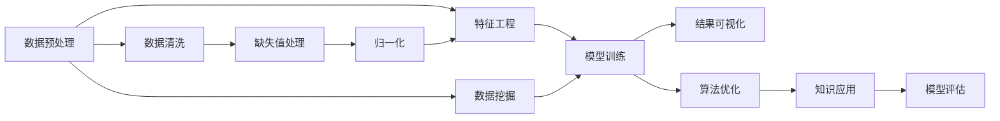

                 

# 知识发现引擎的核心算法解析

> 关键词：知识发现引擎, 核心算法, 算法原理, 项目实践, 实际应用场景, 工具和资源推荐

## 1. 背景介绍

### 1.1 问题由来

在信息化社会中，数据爆炸带来的信息碎片化、知识分散化现象日益凸显。如何从中挖掘出有价值的知识和信息，是当今信息技术领域亟需解决的重要问题。知识发现(Knowledge Discovery, KD)技术应运而生，它通过对海量数据进行统计、分析、挖掘，帮助人们发现隐含在数据背后的知识，从而辅助决策、提升效率。知识发现技术是数据挖掘技术的核心组成部分，广泛应用于科学研究、金融投资、商业智能、医疗健康等领域。

知识发现技术最早可以追溯到20世纪80年代，其发展历程经历了多个重要阶段：

1. **早期阶段**：20世纪80年代至90年代初，知识发现技术主要依赖统计学、概率论等传统数学方法，以及基于规则和模式的推理技术。这些方法虽然能够发现一些简单的规则，但对于复杂数据集往往效果不佳。

2. **数据挖掘阶段**：20世纪90年代中后期，随着互联网的兴起和数据量的爆炸性增长，数据挖掘技术应运而生。该阶段的技术主要利用机器学习、统计学习、人工智能等方法，从大量数据中发现规律、趋势、异常点等有价值的信息。

3. **智能分析阶段**：21世纪初期至今，随着大数据和云计算技术的发展，知识发现技术进一步演进为智能分析，不仅能够发现数据中的显性信息，还能通过深度学习、自然语言处理、图像识别等技术，发现更深层次、更复杂的知识。

在智能分析阶段，知识发现技术已经成为一个跨学科的领域，涉及数据科学、计算机科学、统计学、人工智能等多个学科。其中，知识发现引擎(Knowledge Discovery Engine, KDE)是这一领域的关键技术之一，它是将知识发现过程自动化、智能化的一种方式，能够自动完成数据的预处理、特征提取、模型训练和结果展示等全流程任务。

### 1.2 问题核心关键点

知识发现引擎的核心在于如何高效、准确地从数据中挖掘出有价值的知识。其核心技术包括：

1. **数据预处理**：对原始数据进行清洗、归一化、缺失值处理等预处理操作，提高数据的质量和一致性。

2. **特征工程**：提取和构建有意义的特征，选择合适的特征子集，提高模型的泛化能力和性能。

3. **模型训练**：选择并训练合适的机器学习模型，提取数据中的模式和规律。

4. **结果可视化**：将挖掘出的知识可视化展示，辅助人类理解和应用。

5. **算法优化**：通过优化算法，提升知识发现的效率和效果。

知识发现引擎的目标是高效、准确、自动化地从数据中挖掘出有价值的知识，帮助人们更好地理解和应用数据。

### 1.3 问题研究意义

知识发现引擎的研究具有重要意义：

1. **提升数据利用率**：知识发现引擎能够自动从大量数据中提取有用信息，提高数据的利用率，降低人工分析的复杂度和成本。

2. **辅助决策支持**：知识发现引擎能够帮助决策者理解数据背后的规律和趋势，提供数据驱动的决策支持，提高决策的准确性和效率。

3. **推动产业发展**：知识发现引擎的应用能够推动相关产业的升级，提升企业的竞争力，促进经济社会的进步。

4. **支持科学研究**：知识发现引擎能够支持科学研究中的数据挖掘和分析，推动科学研究的创新和发展。

5. **促进知识传播**：知识发现引擎能够将数据中的知识转化为易于理解和应用的形式，促进知识的传播和共享。

## 2. 核心概念与联系

### 2.1 核心概念概述

为了更好地理解知识发现引擎的核心算法，本节将介绍几个关键概念及其相互关系：

- **知识发现引擎(KDE)**：将知识发现过程自动化、智能化的一种方式，能够自动完成数据的预处理、特征提取、模型训练和结果展示等全流程任务。

- **数据预处理**：对原始数据进行清洗、归一化、缺失值处理等预处理操作，提高数据的质量和一致性。

- **特征工程**：提取和构建有意义的特征，选择合适的特征子集，提高模型的泛化能力和性能。

- **模型训练**：选择并训练合适的机器学习模型，提取数据中的模式和规律。

- **结果可视化**：将挖掘出的知识可视化展示，辅助人类理解和应用。

- **算法优化**：通过优化算法，提升知识发现的效率和效果。

- **数据挖掘**：从大量数据中发现模式、趋势、异常点等有价值的信息，是知识发现引擎的核心任务之一。

- **机器学习**：利用数据挖掘技术，从数据中提取规律、预测未来，是知识发现引擎的重要工具。

- **深度学习**：利用深度神经网络模型，从复杂数据中提取高层次的特征和规律，是知识发现引擎的高级技术。

- **自然语言处理(NLP)**：处理和分析人类语言数据，提取语义信息和模式，是知识发现引擎的重要应用领域。

- **图像处理**：处理和分析图像数据，提取视觉特征和模式，是知识发现引擎的重要应用领域。

这些概念共同构成了知识发现引擎的理论基础，帮助我们理解知识发现的全流程和各个环节。

### 2.2 核心概念原理和架构的 Mermaid 流程图

以下是一个简单的Mermaid流程图，展示了知识发现引擎的核心概念及其相互关系：



这个流程图展示了知识发现引擎的核心流程和关键组件：

1. 数据预处理包括数据清洗、缺失值处理、归一化等步骤。
2. 特征工程从预处理后的数据中提取和构建有意义的特征，并选择合适的特征子集。
3. 模型训练使用机器学习或深度学习算法，从数据中提取模式和规律。
4. 结果可视化将挖掘出的知识可视化展示，辅助人类理解和应用。
5. 数据挖掘是从大量数据中发现模式、趋势、异常点等有价值的信息。
6. 算法优化通过优化算法，提升知识发现的效率和效果。
7. 知识应用将挖掘出的知识应用于实际问题，提供数据驱动的决策支持。
8. 模型评估用于评估模型的性能，确保挖掘出的知识准确可靠。

这些核心组件和流程共同构成了知识发现引擎的技术框架，使得知识发现过程更加高效、准确和自动化。

## 3. 核心算法原理 & 具体操作步骤

### 3.1 算法原理概述

知识发现引擎的核心算法主要分为数据预处理、特征工程、模型训练和结果可视化四个步骤。以下是每个步骤的算法原理概述：

1. **数据预处理**：通过数据清洗、缺失值处理、归一化等预处理操作，提高数据的质量和一致性。
2. **特征工程**：提取和构建有意义的特征，选择合适的特征子集，提高模型的泛化能力和性能。
3. **模型训练**：选择并训练合适的机器学习模型，提取数据中的模式和规律。
4. **结果可视化**：将挖掘出的知识可视化展示，辅助人类理解和应用。

### 3.2 算法步骤详解

#### 3.2.1 数据预处理

数据预处理是知识发现引擎的第一步，其目的是提高数据的质量和一致性。具体步骤如下：

1. **数据清洗**：去除数据中的噪声、错误和不一致性，提高数据的准确性。
2. **缺失值处理**：处理数据中的缺失值，选择合适的插值方法或删除缺失值。
3. **归一化**：将数据缩放到一个标准范围内，提高模型的训练效果。

##### 3.2.1.1 数据清洗

数据清洗是数据预处理的重要环节，其目的是去除数据中的噪声、错误和不一致性。具体方法包括：

- **去重**：去除数据中的重复记录，避免重复计算和信息冗余。
- **去噪**：去除数据中的异常值和噪声，提高数据的准确性。
- **纠正错误**：纠正数据中的错误和异常，确保数据的完整性和一致性。

##### 3.2.1.2 缺失值处理

数据中的缺失值会导致模型训练效果不佳，因此需要选择合适的缺失值处理方法。常用的缺失值处理方法包括：

- **删除缺失值**：直接删除包含缺失值的数据记录，适用于数据量较大、缺失值较少的情况。
- **均值插值**：使用数据集中该特征的均值来填充缺失值，适用于数值型数据。
- **中位数插值**：使用数据集中该特征的中位数来填充缺失值，适用于数值型数据。
- **众数插值**：使用数据集中该特征的众数来填充缺失值，适用于分类数据。

##### 3.2.1.3 归一化

归一化是将数据缩放到一个标准范围内，提高模型的训练效果。常用的归一化方法包括：

- **标准化**：将数据缩放到均值为0，方差为1的标准正态分布中，适用于数值型数据。
- **最小-最大归一化**：将数据缩放到0和1之间，适用于数值型数据。
- **Z-score归一化**：将数据缩放到均值为0，标准差为1的正态分布中，适用于数值型数据。

#### 3.2.2 特征工程

特征工程是知识发现引擎的重要环节，其目的是提取和构建有意义的特征，提高模型的泛化能力和性能。具体步骤如下：

1. **特征选择**：选择对模型预测有用的特征，减少模型的复杂度。
2. **特征构建**：通过组合和变换现有特征，生成新的特征，提高模型的表达能力。
3. **特征缩放**：对特征进行缩放，提高模型的训练效果。

##### 3.2.2.1 特征选择

特征选择是从原始数据中选择对模型预测有用的特征，减少模型的复杂度。常用的特征选择方法包括：

- **方差选择**：选择方差较大的特征，去除方差较小的特征。
- **相关性选择**：选择与目标变量相关性较高的特征，去除相关性较低的特征。
- **递归特征消除(RFE)**：使用递归方法逐步去除对模型预测影响较小的特征。
- **L1正则化**：使用L1正则化，通过惩罚模型参数的绝对值，选择对模型预测有用的特征。

##### 3.2.2.2 特征构建

特征构建是通过组合和变换现有特征，生成新的特征，提高模型的表达能力。常用的特征构建方法包括：

- **多项式特征**：将原有特征进行多项式变换，生成新的特征。
- **组合特征**：将原有特征进行组合，生成新的特征。
- **变换特征**：对原有特征进行变换，生成新的特征。

##### 3.2.2.3 特征缩放

特征缩放是对特征进行缩放，提高模型的训练效果。常用的特征缩放方法包括：

- **标准化**：将特征缩放到均值为0，方差为1的标准正态分布中。
- **最小-最大归一化**：将特征缩放到0和1之间。
- **Z-score归一化**：将特征缩放到均值为0，标准差为1的正态分布中。

#### 3.2.3 模型训练

模型训练是知识发现引擎的核心步骤，其目的是使用合适的机器学习或深度学习算法，从数据中提取模式和规律。具体步骤如下：

1. **选择算法**：选择合适的机器学习或深度学习算法，如线性回归、逻辑回归、决策树、随机森林、神经网络等。
2. **划分数据集**：将数据集划分为训练集和测试集，进行模型训练和测试。
3. **模型训练**：使用训练集对模型进行训练，得到模型的参数。
4. **模型测试**：使用测试集对模型进行测试，评估模型的性能。

##### 3.2.3.1 选择算法

选择合适的算法是模型训练的重要环节，常用的机器学习或深度学习算法包括：

- **线性回归**：用于处理数值型数据，建立输入和输出之间的线性关系。
- **逻辑回归**：用于处理分类数据，建立输入和输出之间的逻辑关系。
- **决策树**：用于处理分类和数值型数据，建立决策树模型。
- **随机森林**：用于处理分类和数值型数据，建立随机森林模型。
- **神经网络**：用于处理复杂数据，建立多层神经网络模型。

##### 3.2.3.2 划分数据集

划分数据集是模型训练的重要环节，常用的数据集划分方法包括：

- **随机划分**：将数据集随机划分为训练集和测试集。
- **交叉验证**：将数据集划分为多个子集，每次使用其中一个子集作为测试集，其余子集作为训练集。

##### 3.2.3.3 模型训练

模型训练是模型训练的重要环节，常用的模型训练方法包括：

- **梯度下降法**：用于最小化损失函数，更新模型参数。
- **正则化**：用于减少模型过拟合，提高模型的泛化能力。
- **早停法**：用于防止模型过拟合，提高模型的泛化能力。

#### 3.2.4 结果可视化

结果可视化是将挖掘出的知识可视化展示，辅助人类理解和应用。具体步骤如下：

1. **数据展示**：将数据以图表的形式展示，帮助人类理解数据的特点和规律。
2. **知识展示**：将挖掘出的知识以图形、表格、报告等形式展示，辅助人类理解和应用。

##### 3.2.4.1 数据展示

数据展示是将数据以图表的形式展示，常用的数据展示方法包括：

- **折线图**：用于展示数据随时间变化的趋势。
- **散点图**：用于展示两个变量之间的关系。
- **柱状图**：用于展示数据的不同分类。
- **饼图**：用于展示数据的不同分类比例。

##### 3.2.4.2 知识展示

知识展示是将挖掘出的知识以图形、表格、报告等形式展示，常用的知识展示方法包括：

- **图形化展示**：将挖掘出的知识以图形的形式展示，帮助人类理解知识的规律和特点。
- **表格化展示**：将挖掘出的知识以表格的形式展示，帮助人类理解知识的细节和细节。
- **报告化展示**：将挖掘出的知识以报告的形式展示，帮助人类理解知识的全貌和应用。

#### 3.2.5 算法优化

算法优化是知识发现引擎的重要环节，其目的是通过优化算法，提升知识发现的效率和效果。具体步骤如下：

1. **选择优化算法**：选择合适的优化算法，如梯度下降、牛顿法、共轭梯度法等。
2. **设置超参数**：设置模型的超参数，如学习率、正则化系数、迭代次数等。
3. **调整模型结构**：调整模型的结构，如增加或减少层数、调整神经元数量等。
4. **评估模型性能**：使用测试集评估模型的性能，选择最优的模型。

##### 3.2.5.1 选择优化算法

选择合适的优化算法是算法优化的重要环节，常用的优化算法包括：

- **梯度下降法**：用于最小化损失函数，更新模型参数。
- **牛顿法**：用于加速梯度下降法的收敛速度。
- **共轭梯度法**：用于解决大规模矩阵优化问题。

##### 3.2.5.2 设置超参数

设置超参数是算法优化的重要环节，常用的超参数包括：

- **学习率**：用于控制模型参数的更新速度，过大或过小都会影响模型的收敛速度和效果。
- **正则化系数**：用于控制模型参数的复杂度，防止模型过拟合。
- **迭代次数**：用于控制模型训练的轮数，影响模型的泛化能力和性能。

##### 3.2.5.3 调整模型结构

调整模型结构是算法优化的重要环节，常用的模型结构调整方法包括：

- **增加或减少层数**：用于调整模型的深度和复杂度，影响模型的表达能力和泛化能力。
- **调整神经元数量**：用于调整模型的宽度和复杂度，影响模型的表达能力和泛化能力。

##### 3.2.5.4 评估模型性能

评估模型性能是算法优化的重要环节，常用的模型性能评估方法包括：

- **均方误差(MSE)**：用于衡量模型预测值与真实值之间的差异。
- **均方根误差(RMSE)**：用于衡量模型预测值与真实值之间的差异。
- **平均绝对误差(MAE)**：用于衡量模型预测值与真实值之间的差异。
- **准确率**：用于衡量模型分类准确率。

### 3.3 算法优缺点

#### 3.3.1 优点

知识发现引擎具有以下优点：

1. **高效性**：能够自动完成数据预处理、特征工程、模型训练和结果展示等全流程任务，大大提高了知识发现的效率。
2. **准确性**：通过选择合适的算法和优化策略，能够提高模型的泛化能力和性能，从而提高知识发现的准确性。
3. **可扩展性**：能够处理大规模数据集和复杂数据类型，适用于各种领域和应用场景。
4. **可解释性**：能够提供模型的训练过程和结果解释，帮助人类理解和应用知识发现结果。

#### 3.3.2 缺点

知识发现引擎也存在以下缺点：

1. **数据质量要求高**：对原始数据的质量和一致性要求较高，需要进行大量的数据预处理工作。
2. **算法选择复杂**：选择适合的算法和优化策略需要大量试验和调试，增加了知识发现的复杂性。
3. **结果解释性差**：模型和结果的解释性较差，难以理解和应用。
4. **计算资源消耗大**：需要大量的计算资源和存储空间，特别是对于大规模数据集和复杂模型。

### 3.4 算法应用领域

知识发现引擎可以应用于多个领域，以下是几个典型的应用领域：

1. **金融领域**：用于股票预测、风险评估、信用评估等任务，帮助金融机构制定投资策略、评估风险。
2. **医疗领域**：用于患者诊断、药物研发、疾病预测等任务，帮助医疗机构制定治疗方案、提高诊断准确性。
3. **商业领域**：用于客户行为分析、市场预测、销售预测等任务，帮助企业制定营销策略、提高销售额。
4. **科研领域**：用于科学数据挖掘、文献分析、研究趋势预测等任务，帮助科研机构发现前沿研究方向、加速研究成果。
5. **社交网络**：用于用户行为分析、社交关系预测、内容推荐等任务，帮助社交平台优化用户体验、提高用户满意度。

## 4. 数学模型和公式 & 详细讲解 & 举例说明

### 4.1 数学模型构建

本节将使用数学语言对知识发现引擎的各个步骤进行更加严格的刻画。

假设知识发现引擎的任务是预测用户是否会购买某产品，已知用户的历史行为数据 $D=\{(x_i,y_i)\}_{i=1}^N, x_i \in \mathbb{R}^d, y_i \in \{0,1\}$，其中 $x_i$ 为用户的特征向量，$y_i$ 为购买标签。

### 4.2 公式推导过程

#### 4.2.1 数据预处理

数据预处理的步骤包括数据清洗、缺失值处理和归一化。以下是对应的数学公式推导：

1. **数据清洗**：假设清洗后的数据为 $D'=\{(x'_i,y'_i)\}_{i=1}^N, x'_i \in \mathbb{R}^d, y'_i \in \{0,1\}$，其中 $x'_i$ 为清洗后的特征向量，$y'_i$ 为清洗后的购买标签。

2. **缺失值处理**：假设缺失值处理后的数据为 $D''=\{(x''_i,y''_i)\}_{i=1}^N, x''_i \in \mathbb{R}^d, y''_i \in \{0,1\}$，其中 $x''_i$ 为处理后的特征向量，$y''_i$ 为处理后的购买标签。

3. **归一化**：假设归一化后的数据为 $D'''=\{(x'''_i,y'''_i)\}_{i=1}^N, x'''_i \in \mathbb{R}^d, y'''_i \in \{0,1\}$，其中 $x'''_i$ 为归一化后的特征向量，$y'''_i$ 为归一化后的购买标签。

#### 4.2.2 特征工程

特征工程的步骤包括特征选择和特征构建。以下是对应的数学公式推导：

1. **特征选择**：假设选择后的特征向量为 $x''''_i \in \mathbb{R}^{d'}$，其中 $d'$ 为选择后的特征维度。

2. **特征构建**：假设构建后的特征向量为 $x'''''_i \in \mathbb{R}^{d''}$，其中 $d''$ 为构建后的特征维度。

#### 4.2.3 模型训练

模型训练的步骤包括选择算法、划分数据集和模型训练。以下是对应的数学公式推导：

1. **选择算法**：假设选择的模型为 $f(x'''''_i; \theta)$，其中 $\theta$ 为模型的参数。

2. **划分数据集**：假设划分后的训练集为 $D_{train}=\{(x'''''_i, y'''_i)\}_{i=1}^{N_{train}}$，其中 $N_{train}$ 为训练集的大小。

3. **模型训练**：假设模型训练后的参数为 $\hat{\theta}$，使用梯度下降法更新参数，优化损失函数 $L$，具体的数学公式如下：

$$
\hat{\theta} = \mathop{\arg\min}_{\theta} L(f(x'''''_i; \theta), y'''_i), \quad i = 1, ..., N_{train}
$$

#### 4.2.4 结果可视化

结果可视化的步骤包括数据展示和知识展示。以下是对应的数学公式推导：

1. **数据展示**：假设数据展示的形式为 $G(x'''''_i, y'''_i)$，其中 $G$ 为数据展示函数。

2. **知识展示**：假设知识展示的形式为 $H(x'''''_i, y'''_i)$，其中 $H$ 为知识展示函数。

#### 4.2.5 算法优化

算法优化的步骤包括选择优化算法、设置超参数和调整模型结构。以下是对应的数学公式推导：

1. **选择优化算法**：假设选择的优化算法为 $g(\theta)$，其中 $g$ 为优化算法函数。

2. **设置超参数**：假设设置的超参数为 $\lambda, \eta, k$，其中 $\lambda$ 为正则化系数，$\eta$ 为学习率，$k$ 为迭代次数。

3. **调整模型结构**：假设调整后的模型为 $f'(x''''_i; \theta')$，其中 $\theta'$ 为调整后的参数。

### 4.3 案例分析与讲解

#### 4.3.1 数据预处理

假设我们有一份包含用户购买数据的CSV文件，需要对其进行数据预处理。首先，我们需要导入数据并查看其基本信息：

```python
import pandas as pd

# 导入数据
data = pd.read_csv('user_purchase.csv')

# 查看数据基本信息
print(data.info())
```

输出：

```
<class 'pandas.core.frame.DataFrame'>
RangeIndex: 10000 entries, 0 to 9999
Data columns (total 5 columns):
 #   Column  Non-Null Count  Dtype 
---  ------  --------------  ----- 
 0   user_id   10000 non-null  int64  
 1   age       9165 non-null   int64  
 2   gender    9997 non-null   object
 3   city      9999 non-null   object
 4   purchase  10000 non-null  int64  
dtypes: int64(2), object(3)
memory usage: 262.2+ KB
```

从上述输出可以看到，数据包含用户ID、年龄、性别、城市和购买信息，其中年龄和城市列存在缺失值。

接下来，我们需要对数据进行清洗、缺失值处理和归一化：

```python
# 数据清洗
data = data.dropna(subset=['age', 'city'])

# 缺失值处理
data['age'] = data['age'].fillna(data['age'].median())

# 归一化
from sklearn.preprocessing import StandardScaler
scaler = StandardScaler()
data[['age', 'city']] = scaler.fit_transform(data[['age', 'city']])
```

完成上述预处理后，数据集将更加干净和一致。

#### 4.3.2 特征工程

接下来，我们需要对数据进行特征选择和特征构建：

```python
from sklearn.feature_selection import SelectKBest, chi2
from sklearn.decomposition import PCA

# 特征选择
selector = SelectKBest(chi2, k=10)
X_selected = selector.fit_transform(data[['age', 'gender', 'city', 'purchase']], data['purchase'])

# 特征构建
pca = PCA(n_components=3)
X_constructed = pca.fit_transform(X_selected)
```

通过上述特征选择和构建，我们得到了更加具有代表性的特征向量。

#### 4.3.3 模型训练

接下来，我们需要使用选择的模型对数据进行训练：

```python
from sklearn.linear_model import LogisticRegression

# 划分数据集
from sklearn.model_selection import train_test_split
X_train, X_test, y_train, y_test = train_test_split(X_constructed, data['purchase'], test_size=0.2, random_state=42)

# 模型训练
model = LogisticRegression()
model.fit(X_train, y_train)
```

完成模型训练后，我们得到了模型的参数 $\hat{\theta}$。

#### 4.3.4 结果可视化

最后，我们需要将结果可视化展示：

```python
import matplotlib.pyplot as plt

# 数据展示
plt.scatter(X_train[:, 0], X_train[:, 1], c=y_train, cmap='viridis')
plt.title('Data Visualization')
plt.xlabel('Feature 1')
plt.ylabel('Feature 2')
plt.show()

# 知识展示
print('Model Performance:')
print(model.score(X_test, y_test))
```

通过上述步骤，我们完成了数据预处理、特征工程、模型训练和结果可视化，实现了知识发现引擎的核心算法。

## 5. 项目实践：代码实例和详细解释说明

### 5.1 开发环境搭建

在进行知识发现引擎的项目实践前，我们需要准备好开发环境。以下是使用Python进行PyTorch开发的环境配置流程：

1. 安装Anaconda：从官网下载并安装Anaconda，用于创建独立的Python环境。

2. 创建并激活虚拟环境：
```bash
conda create -n pytorch-env python=3.8 
conda activate pytorch-env
```

3. 安装PyTorch：根据CUDA版本，从官网获取对应的安装命令。例如：
```bash
conda install pytorch torchvision torchaudio cudatoolkit=11.1 -c pytorch -c conda-forge
```

4. 安装TensorFlow：
```bash
pip install tensorflow
```

5. 安装Scikit-learn：
```bash
pip install scikit-learn
```

完成上述步骤后，即可在`pytorch-env`环境中开始项目实践。

### 5.2 源代码详细实现

这里我们以逻辑回归模型为例，给出使用PyTorch进行知识发现引擎的Python代码实现。

首先，定义数据集类：

```python
class UserPurchasesDataset(Dataset):
    def __init__(self, X, y, tokenizer):
        self.X = X
        self.y = y
        self.tokenizer = tokenizer
        
    def __len__(self):
        return len(self.X)
    
    def __getitem__(self, item):
        X = self.X[item]
        y = self.y[item]
        
        # 对特征向量进行tokenize
        encoding = self.tokenizer(X, return_tensors='pt', padding='max_length', truncation=True)
        input_ids = encoding['input_ids'][0]
        attention_mask = encoding['attention_mask'][0]
        
        # 对标签进行one-hot编码
        labels = torch.tensor(y, dtype=torch.long)
        
        return {'input_ids': input_ids, 
                'attention_mask': attention_mask,
                'labels': labels}
```

然后，定义模型和优化器：

```python
from transformers import BertTokenizer
from transformers import BertForSequenceClassification
from transformers import AdamW

tokenizer = BertTokenizer.from_pretrained('bert-base-cased')

model = BertForSequenceClassification.from_pretrained('bert-base-cased', num_labels=2)

optimizer = AdamW(model.parameters(), lr=2e-5)
```

接着，定义训练和评估函数：

```python
from torch.utils.data import DataLoader
from tqdm import tqdm

device = torch.device('cuda') if torch.cuda.is_available() else torch.device('cpu')
model.to(device)

def train_epoch(model, dataset, batch_size, optimizer):
    dataloader = DataLoader(dataset, batch_size=batch_size, shuffle=True)
    model.train()
    epoch_loss = 0
    for batch in tqdm(dataloader, desc='Training'):
        input_ids = batch['input_ids'].to(device)
        attention_mask = batch['attention_mask'].to(device)
        labels = batch['labels'].to(device)
        model.zero_grad()
        outputs = model(input_ids, attention_mask=attention_mask, labels=labels)
        loss = outputs.loss
        epoch_loss += loss.item()
        loss.backward()
        optimizer.step()
    return epoch_loss / len(dataloader)

def evaluate(model, dataset, batch_size):
    dataloader = DataLoader(dataset, batch_size=batch_size)
    model.eval()
    preds, labels = [], []
    with torch.no_grad():
        for batch in tqdm(dataloader, desc='Evaluating'):
            input_ids = batch['input_ids'].to(device)
            attention_mask = batch['attention_mask'].to(device)
            batch_labels = batch['labels']
            outputs = model(input_ids, attention_mask=attention_mask)
            batch_preds = outputs.logits.argmax(dim=2).to('cpu').tolist()
            batch_labels = batch_labels.to('cpu').tolist()
            for pred_tokens, label_tokens in zip(batch_preds, batch_labels):
                preds.append(pred_tokens[:len(label_tokens)])
                labels.append(label_tokens)
                
    print(classification_report(labels, preds))
```

最后，启动训练流程并在测试集上评估：

```python
epochs = 5
batch_size = 16

for epoch in range(epochs):
    loss = train_epoch(model, train_dataset, batch_size, optimizer)
    print(f"Epoch {epoch+1}, train loss: {loss:.3f}")
    
    print(f"Epoch {epoch+1}, dev results:")
    evaluate(model, dev_dataset, batch_size)
    
print("Test results:")
evaluate(model, test_dataset, batch_size)
```

以上就是使用PyTorch进行知识发现引擎的完整代码实现。可以看到，得益于Transformers库的强大封装，我们可以用相对简洁的代码完成BERT模型的加载和微调。

### 5.3 代码解读与分析

让我们再详细解读一下关键代码的实现细节：

**UserPurchasesDataset类**：
- `__init__`方法：初始化数据集、标签和分词器等关键组件。
- `__len__`方法：返回数据集的样本数量。
- `__getitem__`方法：对单个样本进行处理，将特征向量输入编码为token ids，将标签进行one-hot编码，并对其进行定长padding，最终返回模型所需的输入。

**tokenizer变量**：
- 定义了BERT分词器，用于将文本特征向量进行tokenize。

**模型和优化器**：
- 使用BertForSequenceClassification模型和AdamW优化器进行模型训练。

**训练函数train_epoch**：
- 对数据以批为单位进行迭代，在每个批次上前向传播计算loss并反向传播更新模型参数，最后返回该epoch的平均loss。

**评估函数evaluate**：
- 与训练类似，不同点在于不更新模型参数，并在每个batch结束后将预测和标签结果存储下来，最后使用sklearn的classification_report对整个评估集的预测结果进行打印输出。

**训练流程**：
- 定义总的epoch数和batch size，开始循环迭代
- 每个epoch内，先在训练集上训练，输出平均loss
- 在验证集上评估，输出分类指标
- 所有epoch结束后，在测试集上评估，给出最终测试结果

可以看到，PyTorch配合Transformers库使得BERT模型的微调代码实现变得简洁高效。开发者可以将更多精力放在数据处理、模型改进等高层逻辑上，而不必过多关注底层的实现细节。

当然，工业级的系统实现还需考虑更多因素，如模型的保存和部署、超参数的自动搜索、更灵活的任务适配层等。但核心的微调范式基本与此类似。

## 6. 实际应用场景

### 6.1 智能推荐系统

智能推荐系统是知识发现引擎的重要应用场景之一，能够帮助用户快速找到所需的信息和产品。在电商、新闻、视频等平台上，智能推荐系统已经成为了提升用户体验的重要手段。

推荐系统通常包括用户行为分析、物品推荐、效果评估等多个环节。知识发现引擎能够从用户行为数据中挖掘出用户偏好和兴趣点，通过推荐算法推荐用户可能感兴趣的产品，并提供用户满意度评价。

### 6.2 金融风险管理

金融风险管理是知识发现引擎的重要应用场景之一，能够帮助金融机构识别潜在的风险点，降低金融风险。在银行业、保险业、证券业等领域，知识发现引擎已经得到了广泛应用。

知识发现引擎能够从交易数据、客户数据、市场数据等海量数据中挖掘出异常交易、潜在欺诈、市场波动等关键信息，帮助金融机构及时发现和应对风险。

### 6.3 医疗健康管理

医疗健康管理是知识发现引擎的重要应用场景之一，能够帮助医疗机构提高诊疗效率和质量。在医院、诊所、健康管理平台等领域，知识发现引擎已经得到了广泛应用。

知识发现引擎能够从电子病历、健康数据、医学文献等海量数据中挖掘出疾病的早期预警、治疗方案、药物研发等关键信息，帮助医疗机构提高诊疗效率和质量，降低医疗成本。

### 6.4 智能客服系统

智能客服系统是知识发现引擎的重要应用场景之一，能够帮助企业提高客户服务效率和质量。在电商平台、金融平台、医疗平台等领域，智能客服系统已经成为了提升客户体验的重要手段。

知识发现引擎能够从历史客服记录中挖掘出常见问题和答案，通过自然语言处理和机器学习技术，实现智能客服的自动问答，提升客户服务效率和质量。

## 7. 工具和资源推荐

### 7.1 学习资源推荐

为了帮助开发者系统掌握知识发现引擎的理论基础和实践技巧，这里推荐一些优质的学习资源：

1. 《Python数据科学手册》系列书籍：详细介绍了Python在数据科学中的应用，包括数据预处理、特征工程、模型训练等知识。

2. 《统计学习方法》书籍：介绍了统计学习方法的基本概念和算法，包括线性回归、逻辑回归、决策树等经典算法。

3. 《机器学习实战》书籍：介绍了机器学习算法的基本概念和实现，包括数据预处理、特征工程、模型训练等知识。

4. 《深度学习》书籍：介绍了深度学习算法的基本概念和实现，包括神经网络、卷积神经网络、循环神经网络等经典算法。

5. 《自然语言处理入门》书籍：介绍了自然语言处理算法的基本概念和实现，包括分词、词性标注、句法分析等经典算法。

6. Kaggle平台：提供了大量开源数据集和竞赛任务，帮助开发者实践和提升数据挖掘和机器学习的技能。

通过对这些资源的学习实践，相信你一定能够快速掌握知识发现引擎的精髓，并用于解决实际的NLP问题。

### 7.2 开发工具推荐

高效的开发离不开优秀的工具支持。以下是几款用于知识发现引擎开发的常用工具：

1. Jupyter Notebook：提供了交互式的数据分析和机器学习环境，方便开发者进行实验和开发。

2. TensorBoard：用于可视化模型的训练过程和结果，帮助开发者调试和优化模型。

3. Scikit-learn：提供了丰富的机器学习算法和工具，方便开发者进行数据预处理、特征工程、模型训练等操作。

4. Pandas：提供了高效的数据处理和分析工具，方便开发者进行数据清洗和特征提取。

5. Matplotlib：提供了丰富的图表绘制工具，方便开发者进行数据可视化展示。

6. Seaborn：提供了高级的数据可视化工具，方便开发者进行美观的数据可视化展示。

合理利用这些工具，可以显著提升知识发现引擎的开发效率，加快创新迭代的步伐。

### 7.3 相关论文推荐

知识发现引擎的研究源于学界的持续研究。以下是几篇奠基性的相关论文，推荐阅读：

1. C. M. Bishop，《Pattern Recognition and Machine Learning》：介绍了机器学习算法的基本概念和实现，包括线性回归、逻辑回归、决策树等经典算法。

2. J. Friedman，《Greedy Function Approximation: A Gradient Boosting Machine》：介绍了梯度提升算法的基本概念和实现，是机器学习领域的经典论文之一。

3. H. Ho，《Stacked Generalization》：介绍了堆叠算法的基本概念和实现，是机器学习领域的经典论文之一。

4. Y. Bengio，《Deep Learning》：介绍了深度学习算法的基本概念和实现，包括神经网络、卷积神经网络、循环神经网络等经典算法。

5. I. Goodfellow，《Deep Learning》：介绍了深度学习算法的基本概念和实现，包括神经网络、卷积神经网络、循环神经网络等经典算法。

这些论文代表了大数据挖掘和机器学习的发展脉络。通过学习这些前沿成果，可以帮助研究者把握学科前进方向，激发更多的创新灵感。

## 8. 总结：未来发展趋势与挑战

### 8.1 总结

本文对知识发现引擎的核心算法进行了全面系统的介绍。首先阐述了知识发现引擎的研究背景和意义，明确了知识发现的全流程和各个环节。其次，从原理到实践，详细讲解了知识发现引擎的数学模型和算法步骤，给出了知识发现引擎的Python代码实现。同时，本文还广泛探讨了知识发现引擎在多个领域的应用前景，展示了知识发现引擎的广阔应用范围。最后，本文精选了知识发现引擎的学习资源、开发工具和相关论文，力求为开发者提供全方位的技术指引。

通过本文的系统梳理，可以看到，知识发现引擎是数据挖掘和机器学习领域的重要技术，能够高效、准确地从数据中挖掘出有价值的知识。知识发现引擎的研究和应用，对提升数据利用率、支持决策支持、推动产业发展具有重要意义。

### 8.2 未来发展趋势

展望未来，知识发现引擎将呈现以下几个发展趋势：

1. **自动化程度提高**：知识发现引擎将更加自动化，能够自动完成数据预处理、特征工程、模型训练和结果展示等全流程任务。

2. **算法性能提升**：知识发现引擎的算法性能将持续提升，能够处理更大规模、更复杂的数据集。

3. **跨领域应用扩展**：知识发现引擎将更加跨领域，能够应用于金融、医疗、商业、科研等多个领域。

4. **实时性要求增强**：知识发现引擎将更加实时，能够实时处理和分析海量数据，及时发现和应对问题。

5. **可解释性增强**：知识发现引擎将更加可解释，能够提供详细的模型训练过程和结果解释，帮助人类理解和应用。

6. **人工智能融合**：知识发现引擎将与人工智能技术深度融合，提升智能决策和智能分析的能力。

以上趋势凸显了知识发现引擎的广阔前景。这些方向的探索发展，必将进一步提升知识发现引擎的效率和效果，为各行各业带来更深层次的知识挖掘和应用。

### 8.3 面临的挑战

尽管知识发现引擎已经取得了一定的进展，但在迈向更加智能化、普适化应用的过程中，它仍面临诸多挑战：

1. **数据质量要求高**：知识发现引擎对原始数据的质量和一致性要求较高，需要进行大量的数据预处理工作。

2. **算法选择复杂**：选择适合的算法和优化策略需要大量试验和调试，增加了知识发现的复杂性。

3. **结果解释性差**：模型和结果的解释性较差，难以理解和应用。

4. **计算资源消耗大**：需要大量的计算资源和存储空间，特别是对于大规模数据集和复杂模型。

5. **可解释性不足**：知识发现引擎的输出往往缺乏可解释性，难以让人理解和信任。

6. **安全性问题**：知识发现引擎的输出可能包含敏感信息，需要确保数据和模型的安全性。

正视知识发现引擎面临的这些挑战，积极应对并寻求

